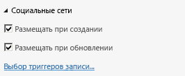

# Включение канала новостей для облачной бизнес-надстройкиEnable a newsfeed for a cloud business add-in
Функции социальных медиа и совместной работы в SharePoint для Office 365 позволяют пользователям следить за действиями со списком и добавлять комментарии. Вы можете легко создать канал новостей для своей облачной бизнес-надстройки, включив несколько свойств.Social and collaboration features in SharePoint for Office 365 allow users to track activity on a list and add comments. You can easily create a newsfeed for your Cloud Business Add-in by enabling a couple of properties.
 

 **Примечание.** В настоящее время идет процесс замены названия "приложения для SharePoint" названием "надстройки SharePoint". Во время этого процесса в документации и пользовательском интерфейсе некоторых продуктов SharePoint и средств Visual Studio может по-прежнему использоваться термин "приложения для SharePoint". Дополнительные сведения см. в статье [Новое название приложений для Office и SharePoint](new-name-for-apps-for-sharepoint.md#bk_newname).**Note**  The name "apps for SharePoint" is changing to "SharePoint Add-ins". During the transition, the documentation and the UI of some SharePoint products and Visual Studio tools might still use the term "apps for SharePoint". For details, see  [New name for apps for Office and SharePoint](new-name-for-apps-for-sharepoint.md#bk_newname).
 

## Необходимые компонентыPrerequisites

Для размещения канала новостей вам понадобится сайт разработчика SharePoint в Office 365, который вы можете получить на странице  [Регистрация на сайте разработчиков для Office 365](http://go.microsoft.com/fwlink/?LinkId=263490).To host the newsfeed, you'll need a SharePoint Developer site on Office 365, which you can get from  [Sign up for an Office 365 Developer Site](http://go.microsoft.com/fwlink/?LinkId=263490).
 

 

## ПроцедурыProcedures

### Включение канала новостейTo enable a newsfeed

1. В обозревателе решений откройте объект, представляющий список, в который требуется добавить канал новостей, а затем в области **Перспектива** откройте вкладку **Сервер**.In Solution Explorer, open the entity representing the list where you want to add a newsfeed, and then on the  **Perspective** bar choose the **Server** tab.
    
 
2. В окне **Свойства** установите флажки **Размещать при создании** или **Размещать при обновлении**.In the  **Properties** window, select the **Post when Created** and/or **Post when Updated** check boxes.
    
  
 

     Если установлен флажок **Размещать при создании**, в канал новостей добавляется поток для каждого нового элемента списка. Если установлен флажок **Размещать при обновлении**, поток добавляется при изменении значения для элемента в списке. Триггеры записей определяют, какие поля в элементе будут активировать запись.**Post when Created** adds a thread to the newsfeed for each new list item. **Post when Updated** adds a thread when the value for an item in the list is changed. Post triggers determine which fields in the item will trigger a post.
    
 
3. Перейдите по ссылке **Выбор триггеров записи**.Choose the  **Choose post triggers** link.
    
    Откроется диалоговое окно **Выбор триггеров записи**.The  **Choose post triggers** dialog box appears.
    
 
4. В диалоговом окне **Выбор триггеров записи** установите флажки для полей, которые должны вызывать размещение, а затем нажмите кнопку **ОК**.In the  **Choose post triggers** dialog box, select the check boxes for all fields that you want to trigger a post, and then choose the **OK** button.
    
    Будет создан единый поток для всех изменений элемента независимо от того, сколько полей выбрано.A single thread will be created for all changes in an item no matter how many fields you choose.
    
 

### Доступ к каналу новостейTo access a newsfeed

1. Чтобы запустить приложение, в строке меню выберите пункт **Отладка**, а затем — **Начать отладку**.On the menu bar, choose  **Debug**,  **Start Debugging** to run the application.
    
 
2. В запущенном приложении откройте экран просмотра для объекта, представляющего список, в который вы добавили канал новостей. Если вы включили параметр **Размещать при создании**, добавьте новый элемент. Если вы включили параметр **Размещать при обновлении**, отредактируйте поля, выбранные в диалоговом окне **Выбор триггеров записи**.In the running application, open the browse screen for the entity representing the list where you added a newsfeed. If you enabled  **Post when Created**, add a new item. If you enabled  **Post when Updated**, edit the fields that you selected in the  **Choose post triggers** dialog box.
    
 
3. На панели хрома SharePoint выберите ссылку **Канал новостей**.On the SharePoint chrome bar, choose the  **Newsfeed** link.
    
  
 

    В новом окне браузера откроется страница **Канал новостей** с записями для добавленных и обновленных элементов. Вы можете нажать **Мне нравится** рядом с той или иной записью или **Ответить**, чтобы добавить комментарий.The  **Newsfeed** page opens in a new browser window with entries for the added and/or updated items. You can choose the **Like** link for a post, or you can choose the **Reply** link to add a comment.
    
 

## Дополнительные ресурсыAdditional resources

-  [Разработка облачных бизнес-надстроекDevelop cloud business add-ins](develop-cloud-business-add-ins.md)
    
 
-  [Функции социальных медиа и совместной работы в SharePointSocial and collaboration features in SharePoint](http://msdn.microsoft.com/en-us/library/office/jj163280.aspx)
    
 
-  [Создание облачных бизнес-надстроек с каналом новостей для социальных службCreate a cloud business add-in with a social newsfeed](create-a-cloud-business-add-in-with-a-social-newsfeed.md)
    
 

