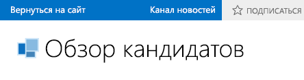

# Включение канала новостей для облачной бизнес-надстройки
Функции социальных медиа и совместной работы в SharePoint для Office 365 позволяют пользователям следить за действиями со списком и добавлять комментарии. Вы можете легко создать канал новостей для своей облачной бизнес-надстройки, включив несколько свойств.
 

 **Примечание.** В настоящее время идет процесс замены названия "приложения для SharePoint" названием "надстройки SharePoint". Во время этого процесса в документации и пользовательском интерфейсе некоторых продуктов SharePoint и средств Visual Studio может по-прежнему использоваться термин "приложения для SharePoint". Дополнительные сведения см. в статье [Новое название приложений для Office и SharePoint](new-name-for-apps-for-sharepoint.md#bk_newname).
 

## Необходимые компоненты

Для размещения канала новостей вам понадобится сайт разработчика SharePoint в Office 365, который вы можете получить на странице  [Регистрация на сайте разработчиков для Office 365](http://go.microsoft.com/fwlink/?LinkId=263490).
 

 

## Процедуры

### Включение канала новостей

1. В обозревателе решений откройте объект, представляющий список, в который требуется добавить канал новостей, а затем в области **Перспектива** откройте вкладку **Сервер**.
    
 
2. В окне **Свойства** установите флажки **Размещать при создании** или **Размещать при обновлении**.
    
  
 

     Если установлен флажок **Размещать при создании**, в канал новостей добавляется поток для каждого нового элемента списка. Если установлен флажок **Размещать при обновлении**, поток добавляется при изменении значения для элемента в списке. Триггеры записей определяют, какие поля в элементе будут активировать запись.
    
 
3. Перейдите по ссылке **Выбор триггеров записи**.
    
    Откроется диалоговое окно **Выбор триггеров записи**.
    
 
4. В диалоговом окне **Выбор триггеров записи** установите флажки для полей, которые должны вызывать размещение, а затем нажмите кнопку **ОК**.
    
    Будет создан единый поток для всех изменений элемента независимо от того, сколько полей выбрано.
    
 

### Доступ к каналу новостей

1. Чтобы запустить приложение, в строке меню выберите пункт **Отладка**, а затем — **Начать отладку**.
    
 
2. В запущенном приложении откройте экран просмотра для объекта, представляющего список, в который вы добавили канал новостей. Если вы включили параметр **Размещать при создании**, добавьте новый элемент. Если вы включили параметр **Размещать при обновлении**, отредактируйте поля, выбранные в диалоговом окне **Выбор триггеров записи**.
    
 
3. На панели хрома SharePoint выберите ссылку **Канал новостей**.
    
  
 

    В новом окне браузера откроется страница **Канал новостей** с записями для добавленных и обновленных элементов. Вы можете нажать **Мне нравится** рядом с той или иной записью или **Ответить**, чтобы добавить комментарий.
    
 

## Дополнительные ресурсы

-  [Разработка облачных бизнес-надстроек](develop-cloud-business-add-ins.md)
    
 
-  [Функции социальных медиа и совместной работы в SharePoint](http://msdn.microsoft.com/en-us/library/office/jj163280.aspx)
    
 
-  [Создание облачных бизнес-надстроек с каналом новостей для социальных служб](create-a-cloud-business-add-in-with-a-social-newsfeed.md)
    
 

