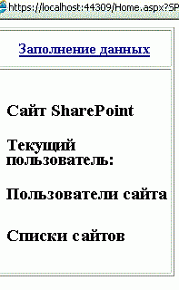

# <a name="get-started-creating-provider-hosted-sharepoint-add-ins"></a><span data-ttu-id="03540-103">Создание надстроек SharePoint, размещаемых у поставщика</span><span class="sxs-lookup"><span data-stu-id="03540-103">Get started creating provider-hosted SharePoint Add-ins</span></span>

<span data-ttu-id="03540-104">Надстройки, размещаемые у поставщика, — это один из двух основных типов надстроек SharePoint. Обзор надстроек SharePoint и этих основных типов см. в статье [Надстройки SharePoint](sharepoint-add-ins.md).</span><span class="sxs-lookup"><span data-stu-id="03540-104">Provider-hosted add-ins are one of the two major types of SharePoint Add-ins. For an overview of SharePoint Add-ins and the two different types, see [SharePoint Add-ins](sharepoint-add-ins.md).</span></span> 

<span data-ttu-id="03540-105">Ниже представлен обзор надстроек, размещаемых у поставщика.</span><span class="sxs-lookup"><span data-stu-id="03540-105">Here's a summary of provider-hosted add-ins:</span></span>

- <span data-ttu-id="03540-106">К ним относятся веб-приложения, службы или базы данных, которые размещены на компьютерах, не относящихся к ферме SharePoint или подписке на SharePoint Online.</span><span class="sxs-lookup"><span data-stu-id="03540-106">They include a web application, service, or database that is hosted externally from the SharePoint farm or SharePoint Online subscription.</span></span> <span data-ttu-id="03540-107">Они также могут содержать компоненты SharePoint.</span><span class="sxs-lookup"><span data-stu-id="03540-107">They may also include SharePoint components.</span></span> <span data-ttu-id="03540-108">Вы можете размещать внешние компоненты в любом стеке веб-хостинга, включая стек LAMP (Linux, Apache, MySQL и PHP).</span><span class="sxs-lookup"><span data-stu-id="03540-108">You can host the external components on any web-hosting stack, including the LAMP (Linux, Apache, MySQL, and PHP) stack.</span></span>
- <span data-ttu-id="03540-109">Пользовательская бизнес-логика надстройки должна запускаться на внешних компонентах или в JavaScript пользовательских страниц SharePoint.</span><span class="sxs-lookup"><span data-stu-id="03540-109">The custom business logic in the add-in has to run on either the external components or in JavaScript on custom SharePoint pages.</span></span>

<span data-ttu-id="03540-110">В этой статье описаны следующие действия:</span><span class="sxs-lookup"><span data-stu-id="03540-110">In this article, you'll complete the following steps:</span></span>

- <span data-ttu-id="03540-111">Настройка среды разработки</span><span class="sxs-lookup"><span data-stu-id="03540-111">Set up your dev environment</span></span>
- <span data-ttu-id="03540-112">Создание проекта надстройки</span><span class="sxs-lookup"><span data-stu-id="03540-112">Create the add-in project</span></span>
- <span data-ttu-id="03540-113">Написание кода надстройки</span><span class="sxs-lookup"><span data-stu-id="03540-113">Code your add-in</span></span>

<span data-ttu-id="03540-114"><a name="Setup"> </a></span><span class="sxs-lookup"><span data-stu-id="03540-114"></span></span>
## <a name="set-up-your-dev-environment"></a><span data-ttu-id="03540-115">Настройка среды разработки</span><span class="sxs-lookup"><span data-stu-id="03540-115">Set up your dev environment</span></span>

<span data-ttu-id="03540-116">Настроить среду для разработки надстроек SharePoint можно разными способами. Здесь описан самый простой из них.</span><span class="sxs-lookup"><span data-stu-id="03540-116">There are many ways to set up a development environment for SharePoint Add-ins. This section explains the simplest way.</span></span> <span data-ttu-id="03540-117">Информацию о настройке локальной среды и других альтернативных способах см. в [этой статье](tools-and-environments-for-developing-sharepoint-add-ins.md).</span><span class="sxs-lookup"><span data-stu-id="03540-117">For alternatives, such as setting up an "all on-premises" environment, see [Tools](tools-and-environments-for-developing-sharepoint-add-ins.md).</span></span>

### <a name="get-the-tools"></a><span data-ttu-id="03540-118">Установите инструменты</span><span class="sxs-lookup"><span data-stu-id="03540-118">Get the tools</span></span>

- <span data-ttu-id="03540-119">Если вы еще не установили **Visual Studio** 2013 или более поздней версии, сделайте это, следуя инструкциям из статьи [Установка Visual Studio](https://docs.microsoft.com/ru-RU/visualstudio/install/install-visual-studio).</span><span class="sxs-lookup"><span data-stu-id="03540-119">If you don't already have **Visual Studio** 2013 or later installed, install it by using the instructions at [Install Visual Studio](https://docs.microsoft.com/ru-RU/visualstudio/install/install-visual-studio).</span></span> <span data-ttu-id="03540-120">Рекомендуем использовать [последнюю версию из Центра загрузки Майкрософт](https://www.visualstudio.com/downloads/download-visual-studio-vs).</span><span class="sxs-lookup"><span data-stu-id="03540-120">We recommend using the [latest version from the Microsoft Download Center](https://www.visualstudio.com/downloads/download-visual-studio-vs).</span></span>
 
- <span data-ttu-id="03540-121">Visual Studio включает **Инструменты разработчика Microsoft Office для Visual Studio**.</span><span class="sxs-lookup"><span data-stu-id="03540-121">Visual Studio includes the **Microsoft Office Developer Tools for Visual Studio**.</span></span> <span data-ttu-id="03540-122">Иногда выпуск новой версии этих инструментов не совпадает с выходом обновлений Visual Studio.</span><span class="sxs-lookup"><span data-stu-id="03540-122">Sometimes a version of the tools is released between updates of Visual Studio.</span></span> <span data-ttu-id="03540-123">Чтобы убедиться, что у вас установлена последняя версия этих инструментов, запустите [установщик набора "Инструменты разработчика Office для Visual Studio 2013"](http://aka.ms/OfficeDevToolsForVS2013) или [установщик набора "Инструменты разработчика Office для Visual Studio 2015"](http://aka.ms/OfficeDevToolsForVS2015).</span><span class="sxs-lookup"><span data-stu-id="03540-123">To be sure that you have the latest version of the tools, run the [installer for Office Developer Tools for Visual Studio 2013](http://aka.ms/OfficeDevToolsForVS2013), or the [installer for Office Developer Tools for Visual Studio 2015](http://aka.ms/OfficeDevToolsForVS2015).</span></span> 

<span data-ttu-id="03540-124">Сверяйтесь с [более ранними версиями Visual Studio](http://msdn.microsoft.com/library/da049020-cfda-40d7-8ff4-7492772b620f.aspx) или другой [документацией по Visual Studio](https://docs.microsoft.com/ru-RU/visualstudio/).</span><span class="sxs-lookup"><span data-stu-id="03540-124">Reference [earlier versions of Visual Studio](http://msdn.microsoft.com/library/da049020-cfda-40d7-8ff4-7492772b620f.aspx) or other [Visual Studio documentation](https://docs.microsoft.com/ru-RU/visualstudio/).</span></span>

<span data-ttu-id="03540-125"><a name="o365_signup"> </a></span><span class="sxs-lookup"><span data-stu-id="03540-125"></span></span>
### <a name="sign-up-for-an-office-365-developer-site"></a><span data-ttu-id="03540-126">Получение шаблона "Сайт разработчика" для Office 365</span><span class="sxs-lookup"><span data-stu-id="03540-126">Sign up for an Office 365 Developer Site</span></span>

> [!NOTE]
> <span data-ttu-id="03540-127">Возможно, у вас уже есть доступ к шаблону "Сайт разработчика" для Office 365.</span><span class="sxs-lookup"><span data-stu-id="03540-127">You might already have access to an Office 365 Developer Site:</span></span> 
> - <span data-ttu-id="03540-p105">**Вы подписчик MSDN?** Visual Studio Ultimate и Visual Studio Premium с подпиской MSDN предоставляют льготное право на подписку разработчика приложений для Office 365. [Воспользуйтесь этим преимуществом прямо сегодня.](https://msdn.microsoft.com/subscriptions/manage/default.aspx)</span><span class="sxs-lookup"><span data-stu-id="03540-p105">**Are you an MSDN subscriber?** Visual Studio Ultimate and Visual Studio Premium with MSDN subscribers receive an Office 365 Developer Subscription as a benefit. [Redeem your benefit today.](https://msdn.microsoft.com/subscriptions/manage/default.aspx)</span></span> 
> - <span data-ttu-id="03540-131">**У вас есть один из указанных ниже планов подписки на Office 365?**</span><span class="sxs-lookup"><span data-stu-id="03540-131">**Do you have one of the following Office 365 subscription plans?**</span></span> <span data-ttu-id="03540-132">Если есть, администратор подписки на Office 365 может создать шаблон "Сайт разработчика" с помощью [Центра администрирования Office 365](https://portal.microsoftonline.com/admin/default.aspx).</span><span class="sxs-lookup"><span data-stu-id="03540-132">If so, an administrator of the Office 365 subscription can create a Developer Site by using the [Office 365 admin center](https://portal.microsoftonline.com/admin/default.aspx).</span></span> <span data-ttu-id="03540-133">Дополнительные сведения см. в статье [Создание шаблона "Сайт разработчика" для существующей подписки на Office 365](create-a-developer-site-on-an-existing-office-365-subscription.md).</span><span class="sxs-lookup"><span data-stu-id="03540-133">For more information, see [Create a developer site on an existing Office 365 subscription](create-a-developer-site-on-an-existing-office-365-subscription.md).</span></span> 

<span data-ttu-id="03540-134">Получить план подписки на Office 365 можно тремя способами.</span><span class="sxs-lookup"><span data-stu-id="03540-134">There are three ways to get an Office 365 plan:</span></span> 

- <span data-ttu-id="03540-135">Начните с [бесплатной 30-дневной пробной подписки](https://portal.microsoftonline.com/Signup/MainSignUp.aspx?OfferId=6881A1CB-F4EB-4db3-9F18-388898DAF510&amp;DL=DEVELOPERPACK), предусматривающей лицензию для одного пользователя.</span><span class="sxs-lookup"><span data-stu-id="03540-135">Start with a [free 30-day trial](https://portal.microsoftonline.com/Signup/MainSignUp.aspx?OfferId=6881A1CB-F4EB-4db3-9F18-388898DAF510&amp;DL=DEVELOPERPACK) with one user license.</span></span>

- <span data-ttu-id="03540-136">Приобретите [подписку разработчика приложений для Office 365](https://portal.microsoftonline.com/Signup/MainSignUp.aspx?OfferId=C69E7747-2566-4897-8CBA-B998ED3BAB88&amp;DL=DEVELOPERPACK).</span><span class="sxs-lookup"><span data-stu-id="03540-136">Buy an [Office 365 developer subscription](https://portal.microsoftonline.com/Signup/MainSignUp.aspx?OfferId=C69E7747-2566-4897-8CBA-B998ED3BAB88&amp;DL=DEVELOPERPACK).</span></span> 

- <span data-ttu-id="03540-137">Зарегистрируйте учетную запись разработчика на один год по специальной программе для разработчиков Office 365.</span><span class="sxs-lookup"><span data-stu-id="03540-137">Sign up for a free, one-year Office 365 developer account through the Office 365 Developer Program.</span></span> <span data-ttu-id="03540-138">Вы можете [узнать больше](http://dev.office.com/devprogram) или сразу заполнить [регистрационную форму](https://profile.microsoft.com/RegSysProfileCenter/wizardnp.aspx?wizid=14b845d0-938c-45af-b061-f798fbb4d170).</span><span class="sxs-lookup"><span data-stu-id="03540-138">[Get more information](http://dev.office.com/devprogram), or go straight to [the sign-up form](https://profile.microsoft.com/RegSysProfileCenter/wizardnp.aspx?wizid=14b845d0-938c-45af-b061-f798fbb4d170).</span></span> <span data-ttu-id="03540-139">После регистрации в программе для разработчиков вы получите электронное сообщение со ссылкой для регистрации учетной записи разработчика.</span><span class="sxs-lookup"><span data-stu-id="03540-139">You'll get an email after you sign up for the developer program with a link to sign up for the developer account.</span></span> <span data-ttu-id="03540-140">Следуйте приведенным ниже инструкциям.</span><span class="sxs-lookup"><span data-stu-id="03540-140">Use the following instructions.</span></span>

> [!TIP]
> <span data-ttu-id="03540-141">Откройте страницы, на которые указывают эти ссылки, в новом окне или на новой вкладке, чтобы работать с ними было удобнее.</span><span class="sxs-lookup"><span data-stu-id="03540-141">Open these links in another window or tab to keep the following instructions handy.</span></span>

1. <span data-ttu-id="03540-142">Первая страница регистрационной формы не требует объяснений. Укажите нужные сведения и нажмите кнопку **Далее**.</span><span class="sxs-lookup"><span data-stu-id="03540-142">The first page of the sign-up form is self-explanatory; supply the requested information, and then select **Next**.</span></span>
    
2. <span data-ttu-id="03540-143">На второй странице (рис. 1) укажите ИД пользователя, принадлежащий администратору подписки.</span><span class="sxs-lookup"><span data-stu-id="03540-143">On the second page, shown in Figure 1, specify a user ID for the administrator of the subscription.</span></span>
    
   <span data-ttu-id="03540-144">*Рис. 1. Доменное имя шаблона "Сайт разработчика" для Office 365*</span><span class="sxs-lookup"><span data-stu-id="03540-144">*Figure 1. Office 365 Developer Site domain name*</span></span>

   

3. <span data-ttu-id="03540-146">Создайте поддомен **.onmicrosoft.com**, например contoso.onmicrosoft.com.</span><span class="sxs-lookup"><span data-stu-id="03540-146">Create a subdomain of **.onmicrosoft.com**; for example, contoso.onmicrosoft.com.</span></span>
    
   <span data-ttu-id="03540-147">После регистрации необходимо войти на сайт портала Office 365, используемого для администрирования учетной записи, указав полученные учетные данные (в формате *ИД_пользователя@ваш_домен.onmicrosoft.com*).</span><span class="sxs-lookup"><span data-stu-id="03540-147">After you sign up, you use the resulting credentials (in the format *UserID@yourdomain.onmicrosoft.com*) to sign in to your Office 365 portal site where you administer your account.</span></span> <span data-ttu-id="03540-148">Ваш "Сайт разработчика" для SharePoint Online будет настроен в новом домене — `http://yourdomain.sharepoint.com`.</span><span class="sxs-lookup"><span data-stu-id="03540-148">Your SharePoint Online Developer Site is set up at your new domain: `http://yourdomain.sharepoint.com`.</span></span>
    
4. <span data-ttu-id="03540-149">Нажмите кнопку **Далее** и заполните последнюю страницу формы.</span><span class="sxs-lookup"><span data-stu-id="03540-149">Select **Next** and fill out the final page of the form.</span></span> <span data-ttu-id="03540-150">Чтобы получить код подтверждения, можно ввести номер мобильного или стационарного телефона, но *не* номер VoIP.</span><span class="sxs-lookup"><span data-stu-id="03540-150">If you choose to provide a telephone number to get a confirmation code, you can provide a mobile or landline telephone number, but *not* a VoIP (Voice over Internet Protocol) number.</span></span>
    
   > [!NOTE]
   > <span data-ttu-id="03540-151">Если при попытке зарегистрировать учетную запись разработчика уже выполнен вход в другую учетную запись Майкрософт, может появиться следующее сообщение: "Введенный ИД пользователя не работает.</span><span class="sxs-lookup"><span data-stu-id="03540-151">If you're signed in to another Microsoft account when you try to sign up for a developer account, you might see this message: "Sorry, that user ID you entered didn't work.</span></span> <span data-ttu-id="03540-152">Возможно, он недействителен.</span><span class="sxs-lookup"><span data-stu-id="03540-152">It looks like it's not valid.</span></span> <span data-ttu-id="03540-153">Убедитесь, что вы вводите ИД пользователя, назначенный вам организацией.</span><span class="sxs-lookup"><span data-stu-id="03540-153">Be sure you enter the user ID that your organization assigned to you.</span></span> <span data-ttu-id="03540-154">Как правило, ИД пользователя представлен в формате *proverka@example.com* или *proverka@example.onmicrosoft.com*".</span><span class="sxs-lookup"><span data-stu-id="03540-154">Your user ID usually looks like *someone@example.com* or *someone@example.onmicrosoft.com*."</span></span> 
   
   > <span data-ttu-id="03540-155">Если появляется это сообщение, выйдите из используемой учетной записи Майкрософт и повторите попытку.</span><span class="sxs-lookup"><span data-stu-id="03540-155">If you see that message, sign out of the Microsoft account you were using and try again.</span></span> <span data-ttu-id="03540-156">Если сообщение продолжает отображаться, очистите кэш браузера или переключитесь в режим **просмотра InPrivate**, а затем заполните форму.</span><span class="sxs-lookup"><span data-stu-id="03540-156">If you still get the message, clear your browser cache or switch to **InPrivate Browsing** and then fill out the form.</span></span>

   <span data-ttu-id="03540-157">По завершении регистрации в браузере откроется страница установки Office 365.</span><span class="sxs-lookup"><span data-stu-id="03540-157">After you finish the sign-up process, your browser opens the Office 365 installation page.</span></span> <span data-ttu-id="03540-158">Щелкните значок администратора, чтобы открыть страницу центра администрирования.</span><span class="sxs-lookup"><span data-stu-id="03540-158">Select the Admin icon to open the admin center page.</span></span>
 
   <span data-ttu-id="03540-159">*Рис. 2. Страница Центра администрирования Office 365*</span><span class="sxs-lookup"><span data-stu-id="03540-159">*Figure 2. Office 365 admin center page*</span></span>

   

5. <span data-ttu-id="03540-p113">Подождите, пока завершится настройка шаблона "Сайт разработчика". После этого обновите страницу центра администрирования в браузере.</span><span class="sxs-lookup"><span data-stu-id="03540-p113">Wait for your Developer Site to finish setting up. After provisioning is complete, refresh the admin center page in your browser.</span></span>
     
6. <span data-ttu-id="03540-163">Перейдите по ссылке **Создание надстроек** в левом верхнем углу страницы, чтобы открыть "Сайт разработчика".</span><span class="sxs-lookup"><span data-stu-id="03540-163">Select the **Build Add-ins** link in the upper-left corner of the page to open your Developer Site.</span></span> <span data-ttu-id="03540-164">Открывшийся сайт должен выглядеть так, как показано на рис. 3.</span><span class="sxs-lookup"><span data-stu-id="03540-164">You should see a site that looks like the one in Figure 3.</span></span> <span data-ttu-id="03540-165">Наличие на странице списка **Тестируемые надстройки** подтверждает, что веб-сайт был создан с помощью шаблона "Сайт разработчика" SharePoint.</span><span class="sxs-lookup"><span data-stu-id="03540-165">The **Add-ins in Testing** list on the page confirms that the website was made with the SharePoint Developer Site template.</span></span> <span data-ttu-id="03540-166">Если вместо этого отображается обычный сайт группы, подождите несколько минут и перезагрузите сайт.</span><span class="sxs-lookup"><span data-stu-id="03540-166">If you see a regular team site instead, wait a few minutes and then restart your site.</span></span>
    
7. <span data-ttu-id="03540-167">Запишите URL-адрес сайта. Он используется при создании проектов надстроек SharePoint в Visual Studio.</span><span class="sxs-lookup"><span data-stu-id="03540-167">Make a note of the site's URL; it's used when you create SharePoint Add-ins projects in Visual Studio.</span></span>
    
   <span data-ttu-id="03540-168">*Рис. 3. Домашняя страница сайта разработчика со списком "Тестируемые надстройки"*</span><span class="sxs-lookup"><span data-stu-id="03540-168">*Figure 3. Your Developer Site home page with the Add-ins in Testing list*</span></span>

   
 
<span data-ttu-id="03540-170"><a name="Create"> </a></span><span class="sxs-lookup"><span data-stu-id="03540-170"></span></span>
## <a name="create-the-add-in-project"></a><span data-ttu-id="03540-171">Создание проекта надстройки</span><span class="sxs-lookup"><span data-stu-id="03540-171">Create the add-in project</span></span>

1. <span data-ttu-id="03540-172">Запустите Visual Studio, выбрав команду **Запуск от имени администратора**.</span><span class="sxs-lookup"><span data-stu-id="03540-172">Start Visual Studio by using the **Run as administrator** option.</span></span>
    
2. <span data-ttu-id="03540-173">В Visual Studio выберите **Файл** > **Создать** > **Проект**.</span><span class="sxs-lookup"><span data-stu-id="03540-173">In Visual Studio, select **File** > **New** > **New Project**.</span></span>
    
3. <span data-ttu-id="03540-174">В диалоговом окне **Создание проекта** последовательно разверните узлы **Visual C#** и **Office/SharePoint**, а затем выберите **Надстройки** > **Надстройка SharePoint**.</span><span class="sxs-lookup"><span data-stu-id="03540-174">In the **New Project** dialog box, expand the **Visual C#** node, expand the **Office/SharePoint** node, and then select **Add-ins** > **SharePoint Add-in**.</span></span>
    
4. <span data-ttu-id="03540-175">Назовите проект **SampleAddIn** и нажмите кнопку **ОК**.</span><span class="sxs-lookup"><span data-stu-id="03540-175">Name the project **SampleAddIn**, and then select **OK**.</span></span>
   
5. <span data-ttu-id="03540-176">В диалоговом окне **Укажите параметры надстройки SharePoint** выполните указанные ниже действия.</span><span class="sxs-lookup"><span data-stu-id="03540-176">In the **Specify the SharePoint Add-in Settings** dialog box, do the following:</span></span>
    
   - <span data-ttu-id="03540-177">Укажите полный URL-адрес сайта SharePoint, который вы хотите использовать для отладки надстройки.</span><span class="sxs-lookup"><span data-stu-id="03540-177">Provide the full URL of the SharePoint site that you want to use to debug your add-in.</span></span> <span data-ttu-id="03540-178">Это URL-адрес шаблона "Сайт разработчика".</span><span class="sxs-lookup"><span data-stu-id="03540-178">This is the URL of the Developer Site.</span></span> <span data-ttu-id="03540-179">В URL-адресе укажите HTTPS, а не HTTP.</span><span class="sxs-lookup"><span data-stu-id="03540-179">Use HTTPS, not HTTP in the URL.</span></span> <span data-ttu-id="03540-180">В какой-то момент выполнения этой процедуры или вскоре после его завершения вам будет предложено войти на сайт.</span><span class="sxs-lookup"><span data-stu-id="03540-180">At some point during this procedure, or shortly after it completes, you will be prompted to sign in to this site.</span></span> <span data-ttu-id="03540-181">Время поступления этого предложения бывает разным.</span><span class="sxs-lookup"><span data-stu-id="03540-181">The timing of the prompt varies.</span></span> <span data-ttu-id="03540-182">Используйте учетные данные администратора (в домене \*.onmicrosoft.com), созданные при оформлении доступа к шаблону "Сайт разработчика" (например, Moye_Imya@contoso.onmicrosoft.com).</span><span class="sxs-lookup"><span data-stu-id="03540-182">Use the administrator credentials (in the \*.onmicrosoft.com domain) that you created when you signed up for your Developer Site; for example MyName@contoso.onmicrosoft.com.</span></span>    

   - <span data-ttu-id="03540-183">В разделе **Как требуется разместить надстройку SharePoint?** выберите элемент **Размещено у поставщика**.</span><span class="sxs-lookup"><span data-stu-id="03540-183">Under **How do you want to host your SharePoint Add-in**, select **Provider-hosted**.</span></span>

   - <span data-ttu-id="03540-184">Нажмите кнопку **Далее**.</span><span class="sxs-lookup"><span data-stu-id="03540-184">Select **Next**.</span></span>  
 
6. <span data-ttu-id="03540-185">На странице **Указание целевой версии SharePoint** выберите **SharePoint Online**, а затем нажмите кнопку **Далее**.</span><span class="sxs-lookup"><span data-stu-id="03540-185">On the **Specify the target SharePoint version** page, select **SharePoint Online**, and then select **Next**.</span></span>

7. <span data-ttu-id="03540-186">В разделе **Какой тип проекта веб-приложения требуется создать?** выберите пункт **Приложение веб-форм ASP.NET**, а затем нажмите кнопку **Далее**.</span><span class="sxs-lookup"><span data-stu-id="03540-186">Under **Which type of web application project do you want to create?**, select **ASP.NET Web Forms Application**, and then select **Next**.</span></span>

8. <span data-ttu-id="03540-187">В разделе **Как требуется выполнять проверку подлинности надстройки?** выберите пункт **Использовать службу контроля доступа Microsoft Azure**.</span><span class="sxs-lookup"><span data-stu-id="03540-187">Under **How do you want your add-in to authenticate?**, select **Use Windows Azure Access Control Service**.</span></span>

9. <span data-ttu-id="03540-188">В мастере нажмите кнопку **Готово**.</span><span class="sxs-lookup"><span data-stu-id="03540-188">In the wizard, select **Finish**.</span></span>
    
   <span data-ttu-id="03540-189">Основная часть операций по настройке совершается при открытии решения.</span><span class="sxs-lookup"><span data-stu-id="03540-189">Much of the configuration is done when the solution opens.</span></span> <span data-ttu-id="03540-190">В решении Visual Studio создаются два проекта: один для надстройки SharePoint, а другой — для веб-приложения ASP.NET.</span><span class="sxs-lookup"><span data-stu-id="03540-190">Two projects are created in the Visual Studio solution: one for the SharePoint Add-in and the other for the ASP.NET web application.</span></span>

<span data-ttu-id="03540-191"><a name="Code"> </a></span><span class="sxs-lookup"><span data-stu-id="03540-191"></span></span>
## <a name="code-your-add-in"></a><span data-ttu-id="03540-192">Написание кода надстройки</span><span class="sxs-lookup"><span data-stu-id="03540-192">Code your add-in</span></span>

1. <span data-ttu-id="03540-p117">Откройте файл AppManifest.xml. На вкладке **Разрешения** укажите область **Коллекция сайтов** и уровень разрешений **Read**.</span><span class="sxs-lookup"><span data-stu-id="03540-p117">Open the AppManifest.xml file. On the **Permissions** tab, specify the **Site Collection** scope and the **Read** permission level.</span></span>

2. <span data-ttu-id="03540-195">Удалите разметку в теге `<body>` файла Pages/Default.aspx веб-приложения, а затем добавьте приведенные ниже элементы управления HTML и ASP.NET в `<body>`.</span><span class="sxs-lookup"><span data-stu-id="03540-195">Delete any markup inside the `<body>` tag of the Pages/Default.aspx file of your web application, and then add the following HTML and ASP.NET controls inside the `<body>`.</span></span> <span data-ttu-id="03540-196">В этом примере используется элемент управления [UpdatePanel](http://msdn2.microsoft.com/ru-RU/library/bb359258) для обеспечения частичной отрисовки страницы.</span><span class="sxs-lookup"><span data-stu-id="03540-196">This sample uses the [UpdatePanel](http://msdn2.microsoft.com/ru-RU/library/bb359258) control to enable partial page rendering.</span></span>
    
    ```HTML
     <form id="form1" runat="server">
       <div>
         <asp:ScriptManager ID="ScriptManager1" runat="server"
                 EnablePartialRendering="true" />
         <asp:UpdatePanel ID="PopulateData" runat="server" UpdateMode="Conditional">
           <ContentTemplate>      
             <table border="1" cellpadding="10">
              <tr><th><asp:LinkButton ID="CSOM" runat="server" Text="Populate Data" 
                                    OnClick="CSOM_Click" /></th></tr>
              <tr><td>

             <h2>SharePoint Site</h2>
             <asp:Label runat="server" ID="WebTitleLabel"/>

             <h2>Current User:</h2>
             <asp:Label runat="server" ID="CurrentUserLabel" />

             <h2>Site Users</h2>
             <asp:ListView ID="UserList" runat="server">     
                 <ItemTemplate >
                   <asp:Label ID="UserItem" runat="server" 
                                     Text="<%# Container.DataItem.ToString()  %>">
                   </asp:Label><br />
                </ItemTemplate>
             </asp:ListView>

             <h2>Site Lists</h2>
                    <asp:ListView ID="ListList" runat="server">
                        <ItemTemplate >
                          <asp:Label ID="ListItem" runat="server" 
                                     Text="<%# Container.DataItem.ToString()  %>">
                         </asp:Label><br />
                       </ItemTemplate>
                   </asp:ListView>
                 </td>              
               </tr>
              </table>
            </ContentTemplate>
          </asp:UpdatePanel>
       </div>
     </form>
    ```

3. <span data-ttu-id="03540-197">Добавьте приведенные ниже объявления в файл Default.aspx.cs веб-приложения.</span><span class="sxs-lookup"><span data-stu-id="03540-197">Add the following declarations to the Default.aspx.cs file of your web application.</span></span>
    
    ```C#
       using Microsoft.SharePoint.Client;
       using Microsoft.IdentityModel.S2S.Tokens;
       using System.Net;
       using System.IO;
       using System.Xml;
    ```

4. <span data-ttu-id="03540-198">В файле Default.aspx.cs веб-приложения добавьте указанные ниже переменные в класс [Page](http://msdn2.microsoft.com/ru-RU/library/dfbt9et1).</span><span class="sxs-lookup"><span data-stu-id="03540-198">In the Default.aspx.cs file of your web application, add these variables inside the [Page](http://msdn2.microsoft.com/ru-RU/library/dfbt9et1) class.</span></span>
    
   ```C#
     SharePointContextToken contextToken;
     string accessToken;
     Uri sharepointUrl;
     string siteName;
     string currentUser;
     List<string> listOfUsers = new List<string>();
     List<string> listOfLists = new List<string>();
   ```

5. <span data-ttu-id="03540-199">Добавьте метод `RetrieveWithCSOM` в класс [Page](http://msdn2.microsoft.com/ru-RU/library/dfbt9et1).</span><span class="sxs-lookup"><span data-stu-id="03540-199">Add the `RetrieveWithCSOM` method inside the [Page](http://msdn2.microsoft.com/ru-RU/library/dfbt9et1) class.</span></span> <span data-ttu-id="03540-200">Этот метод использует CSOM SharePoint, чтобы получать сведения о вашем сайте и отображать их на странице.</span><span class="sxs-lookup"><span data-stu-id="03540-200">This method uses the SharePoint CSOM to retrieve information about your site and display it on the page.</span></span>
    
    ```C#
        // This method retrieves information about the host web by using the CSOM.
      private void RetrieveWithCSOM(string accessToken)
      {

          if (IsPostBack)
          {
              sharepointUrl = new Uri(Request.QueryString["SPHostUrl"]);
          }            

          ClientContext clientContext =
                          TokenHelper.GetClientContextWithAccessToken(
                              sharepointUrl.ToString(), accessToken);

          // Load the properties for the web object.
          Web web = clientContext.Web;
          clientContext.Load(web);
          clientContext.ExecuteQuery();

          // Get the site name.
          siteName = web.Title;

          // Get the current user.
          clientContext.Load(web.CurrentUser);
          clientContext.ExecuteQuery();
          currentUser = clientContext.Web.CurrentUser.LoginName;

          // Load the lists from the Web object.
          ListCollection lists = web.Lists;
          clientContext.Load<ListCollection>(lists);
          clientContext.ExecuteQuery();

          // Load the current users from the Web object.
          UserCollection users = web.SiteUsers;
          clientContext.Load<UserCollection>(users);
          clientContext.ExecuteQuery();

          foreach (User siteUser in users)
          {
              listOfUsers.Add(siteUser.LoginName);
          }

          foreach (List list in lists)
          {
              listOfLists.Add(list.Title);
          }
      }
    ```

6. <span data-ttu-id="03540-201">Добавьте метод `CSOM_Click` в класс [Page](http://msdn2.microsoft.com/ru-RU/library/dfbt9et1).</span><span class="sxs-lookup"><span data-stu-id="03540-201">Add the `CSOM_Click` method inside the [Page](http://msdn2.microsoft.com/ru-RU/library/dfbt9et1) class.</span></span> <span data-ttu-id="03540-202">Этот метод вызывает событие, которое происходит, когда пользователь переходит по ссылке **Заполнение данными**.</span><span class="sxs-lookup"><span data-stu-id="03540-202">This method triggers the event that occurs when the user clicks the **Populate Data** link.</span></span>
    
    ```C#
      protected void CSOM_Click(object sender, EventArgs e)
    {
        string commandAccessToken = ((LinkButton)sender).CommandArgument;
        RetrieveWithCSOM(commandAccessToken);
        WebTitleLabel.Text = siteName;
        CurrentUserLabel.Text = currentUser;
        UserList.DataSource = listOfUsers;
        UserList.DataBind();
        ListList.DataSource = listOfLists;
        ListList.DataBind();    
     }
    ```

7. <span data-ttu-id="03540-203">Замените существующий метод `Page_Load` указанным ниже.</span><span class="sxs-lookup"><span data-stu-id="03540-203">Replace the existing `Page_Load` method with this one.</span></span> <span data-ttu-id="03540-204">Метод `Page_Load` использует методы файла TokenHelper.cs, чтобы извлечь контекст из объекта `Request` и получить маркер доступа от службы контроля доступа Microsoft Azure (ACS).</span><span class="sxs-lookup"><span data-stu-id="03540-204">The `Page_Load` method uses methods in the TokenHelper.cs file to retrieve the context from the `Request` object and get an access token from Microsoft Azure Access Control Service (ACS).</span></span>
    
    ```C#
      // The Page_load method fetches the context token and the access token. 
    // The access token is used by all of the data retrieval methods.
    protected void Page_Load(object sender, EventArgs e)
    {
         string contextTokenString = TokenHelper.GetContextTokenFromRequest(Request);

        if (contextTokenString != null)
        {
            contextToken =
                TokenHelper.ReadAndValidateContextToken(contextTokenString, Request.Url.Authority);

            sharepointUrl = new Uri(Request.QueryString["SPHostUrl"]);
            accessToken =
                        TokenHelper.GetAccessToken(contextToken, sharepointUrl.Authority)
                        .AccessToken;

             // For simplicity, this sample assigns the access token to the button's CommandArgument property. 
             // In a production add-in, this would not be secure. The access token should be cached on the server-side.
            CSOM.CommandArgument = accessToken;
        }
        else if (!IsPostBack)
        {
            Response.Write("Could not find a context token.");
            return;
        }
    }
    ```

8. <span data-ttu-id="03540-205">После этого файл Default.aspx.cs должен выглядеть, как показано ниже.</span><span class="sxs-lookup"><span data-stu-id="03540-205">The Default.aspx.cs file should look like this when you're finished.</span></span>
    
    ```C#
      using System;
      using System.Collections.Generic;
      using System.Linq;
      using System.Web;
      using System.Web.UI;
      using System.Web.UI.WebControls;

      using Microsoft.SharePoint.Client;
      using Microsoft.IdentityModel.S2S.Tokens;
      using System.Net;
      using System.IO;
      using System.Xml;

      namespace SampleAddInWeb
      {
          public partial class Default : System.Web.UI.Page
          {
              SharePointContextToken contextToken;
              string accessToken;
              Uri sharepointUrl;
              string siteName;
              string currentUser;
              List<string> listOfUsers = new List<string>();
              List<string> listOfLists = new List<string>();

              protected void Page_PreInit(object sender, EventArgs e)
              {
                  Uri redirectUrl;
                  switch (SharePointContextProvider.CheckRedirectionStatus(Context, out redirectUrl))
                  {
                      case RedirectionStatus.Ok:
                          return;
                      case RedirectionStatus.ShouldRedirect:
                          Response.Redirect(redirectUrl.AbsoluteUri, endResponse: true);
                          break;
                      case RedirectionStatus.CanNotRedirect:
                          Response.Write("An error occurred while processing your request.");
                          Response.End();
                          break;
                  }
              }

              protected void CSOM_Click(object sender, EventArgs e)
              {
                  string commandAccessToken = ((LinkButton)sender).CommandArgument;
                  RetrieveWithCSOM(commandAccessToken);
                  WebTitleLabel.Text = siteName;
                  CurrentUserLabel.Text = currentUser;
                  UserList.DataSource = listOfUsers;
                  UserList.DataBind();
                  ListList.DataSource = listOfLists;
                  ListList.DataBind();
              }

              // This method retrieves information about the host web by using the CSOM.
              private void RetrieveWithCSOM(string accessToken)
              {

                  if (IsPostBack)
                  {
                      sharepointUrl = new Uri(Request.QueryString["SPHostUrl"]);
                  }

                  ClientContext clientContext =
                          TokenHelper.GetClientContextWithAccessToken(
                              sharepointUrl.ToString(), accessToken);

                  // Load the properties for the web object.
                  Web web = clientContext.Web;
                  clientContext.Load(web);
                  clientContext.ExecuteQuery();

                  // Get the site name.
                  siteName = web.Title;

                  // Get the current user.
                  clientContext.Load(web.CurrentUser);
                  clientContext.ExecuteQuery();
                  currentUser = clientContext.Web.CurrentUser.LoginName;

                  // Load the lists from the Web object.
                  ListCollection lists = web.Lists;
                  clientContext.Load<ListCollection>(lists);
                  clientContext.ExecuteQuery();

                  // Load the current users from the Web object.
                  UserCollection users = web.SiteUsers;
                  clientContext.Load<UserCollection>(users);
                  clientContext.ExecuteQuery();

                  foreach (User siteUser in users)
                  {
                      listOfUsers.Add(siteUser.LoginName);
                  }

                  foreach (List list in lists)
                  {
                      listOfLists.Add(list.Title);
                  }
              }

              protected void Page_Load(object sender, EventArgs e)
              {
                  string contextTokenString = 
                       TokenHelper.GetContextTokenFromRequest(Request);

                  if (contextTokenString != null)
                  {
                      contextToken =
                          TokenHelper.ReadAndValidateContextToken(contextTokenString, Request.Url.Authority);

                      sharepointUrl = new Uri(Request.QueryString["SPHostUrl"]);
                      accessToken =
                          TokenHelper.GetAccessToken(contextToken, sharepointUrl.Authority)
                                     .AccessToken;
                      CSOM.CommandArgument = accessToken;
                  }
                  else if (!IsPostBack)
                  {
                      Response.Write("Could not find a context token.");
                      return;
                  }
              }
          }
      }
     
    ```

9. <span data-ttu-id="03540-206">Нажмите клавишу F5, чтобы развернуть и запустить надстройку.</span><span class="sxs-lookup"><span data-stu-id="03540-206">Use the F5 key to deploy and run your add-in.</span></span> <span data-ttu-id="03540-207">Если отобразится окно **Оповещение системы безопасности** с предложением доверять самозаверяющему сертификату Localhost, нажмите кнопку **Да**.</span><span class="sxs-lookup"><span data-stu-id="03540-207">If you see a **Security Alert** window that asks you to trust the self-signed Localhost certificate, select **Yes**.</span></span>
    
10. <span data-ttu-id="03540-208">Выберите **Сделать доверенным** на странице подтверждения, чтобы предоставить надстройке разрешения.</span><span class="sxs-lookup"><span data-stu-id="03540-208">Select **Trust It** on the consent page to grant permissions to the add-in.</span></span> <span data-ttu-id="03540-209">Visual Studio установит веб-приложение в IIS Express, а затем установит надстройку на тестовом сайте SharePoint и запустит ее.</span><span class="sxs-lookup"><span data-stu-id="03540-209">Visual Studio will install the web application to IIS Express and then install the add-in to your test SharePoint site and launch it.</span></span> <span data-ttu-id="03540-210">Откроется страница с таблицей, как на приведенном ниже снимке экрана.</span><span class="sxs-lookup"><span data-stu-id="03540-210">You'll see a page that has the table shown in the following screen shot.</span></span> <span data-ttu-id="03540-211">Чтобы просмотреть сводную информацию о сайте SharePoint, выберите **Заполнение данных**.</span><span class="sxs-lookup"><span data-stu-id="03540-211">To see summary information about your SharePoint site, select **Populate Data**.</span></span>

   <span data-ttu-id="03540-212">*Рис. 4. Страница запуска примера базовой надстройки, размещаемой у поставщика*</span><span class="sxs-lookup"><span data-stu-id="03540-212">*Figure 4. Launch page of the basic provider-hosted add-in sample*</span></span>

   
 

<span data-ttu-id="03540-214"><a name="SP15createprovider_nextsteps"> </a></span><span class="sxs-lookup"><span data-stu-id="03540-214"></span></span>    
## <a name="next-steps"></a><span data-ttu-id="03540-215">Дальнейшие действия</span><span class="sxs-lookup"><span data-stu-id="03540-215">Next steps</span></span>

<span data-ttu-id="03540-216">Порядок дальнейших действий с надстройкой:</span><span class="sxs-lookup"><span data-stu-id="03540-216">To create your add-ins, walk through the following steps in this order:</span></span>
 
1.  [<span data-ttu-id="03540-217">Настройка внешнего вида надстройки SharePoint с размещением у поставщика</span><span class="sxs-lookup"><span data-stu-id="03540-217">Give your provider-hosted add-in the SharePoint look-and-feel</span></span>](give-your-provider-hosted-add-in-the-sharepoint-look-and-feel.md)
2.  [<span data-ttu-id="03540-218">Добавление настраиваемой кнопки в надстройку, размещенную у поставщика</span><span class="sxs-lookup"><span data-stu-id="03540-218">Include a custom button in the provider-hosted add-in</span></span>](include-a-custom-button-in-the-provider-hosted-add-in.md)
3.  [<span data-ttu-id="03540-219">Краткий обзор объектной модели SharePoint</span><span class="sxs-lookup"><span data-stu-id="03540-219">Get a quick overview of the SharePoint object model</span></span>](get-a-quick-overview-of-the-sharepoint-object-model.md)
4.  [<span data-ttu-id="03540-220">Добавление операций записи SharePoint в надстройку, размещенную у поставщика</span><span class="sxs-lookup"><span data-stu-id="03540-220">Add SharePoint write operations to the provider-hosted add-in</span></span>](add-sharepoint-write-operations-to-the-provider-hosted-add-in.md)
5.  [<span data-ttu-id="03540-221">Добавление веб-части надстройки в надстройку, размещенную у поставщика</span><span class="sxs-lookup"><span data-stu-id="03540-221">Include an add-in part in the provider-hosted add-in</span></span>](include-an-add-in-part-in-the-provider-hosted-add-in.md)
6.  [<span data-ttu-id="03540-222">Обработка событий надстройки, размещенной у поставщика</span><span class="sxs-lookup"><span data-stu-id="03540-222">Handle add-in events in the provider-hosted add-in</span></span>](handle-add-in-events-in-the-provider-hosted-add-in.md)
7.  [<span data-ttu-id="03540-223">Добавление логики, выполняемой при первом запуске, в надстройку, размещаемую у поставщика</span><span class="sxs-lookup"><span data-stu-id="03540-223">Add first-run logic to the provider-hosted add-in</span></span>](add-first-run-logic-to-the-provider-hosted-add-in.md)
8.  [<span data-ttu-id="03540-224">Программное развертывание собственной кнопки в надстройке с размещением у поставщика</span><span class="sxs-lookup"><span data-stu-id="03540-224">Programmatically deploy a custom button in the provider-hosted add-in</span></span>](programmatically-deploy-a-custom-button-in-the-provider-hosted-add-in.md)
9.  [<span data-ttu-id="03540-225">Обработка событий элементов списков в надстройке с размещением у поставщика</span><span class="sxs-lookup"><span data-stu-id="03540-225">Handle list item events in the provider-hosted add-in</span></span>](handle-list-item-events-in-the-provider-hosted-add-in.md)


