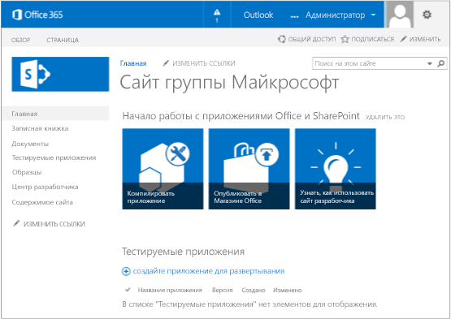

# <a name="get-started-creating-provider-hosted-sharepoint-add-ins"></a><span data-ttu-id="be0cf-102">Знакомство с созданием надстроек SharePoint с размещением у поставщика</span><span class="sxs-lookup"><span data-stu-id="be0cf-102">Get started creating provider-hosted SharePoint Add-ins</span></span>
<span data-ttu-id="be0cf-103">Узнайте, как настроить среду разработки и создать свою первую надстройку SharePoint с размещением у поставщика.</span><span class="sxs-lookup"><span data-stu-id="be0cf-103">Set up a development environment and create your first provider-hosted SharePoint Add-in.</span></span>
 

 <span data-ttu-id="be0cf-p101">**Примечание.** В настоящее время идет процесс замены названия "приложения для SharePoint" названием "надстройки SharePoint". Во время этого процесса в документации и пользовательском интерфейсе некоторых продуктов SharePoint и средств Visual Studio может по-прежнему использоваться термин "приложения для SharePoint". Дополнительные сведения см. в статье [Новое название приложений для Office и SharePoint](new-name-for-apps-for-sharepoint.md#bk_newname).</span><span class="sxs-lookup"><span data-stu-id="be0cf-p101">**Note**  The name "apps for SharePoint" is changing to "SharePoint Add-ins". During the transition, the documentation and the UI of some SharePoint products and Visual Studio tools might still use the term "apps for SharePoint". For details, see  [New name for apps for Office and SharePoint](new-name-for-apps-for-sharepoint.md#bk_newname).</span></span>
 

<span data-ttu-id="be0cf-107">Надстройки с размещением у поставщика — это один из двух основных типов надстроек SharePoint. Обзор надстроек SharePoint и этих основных типов см. в статье [Надстройки SharePoint](sharepoint-add-ins.md). Ниже представлен обзор надстроек с размещением у поставщика.</span><span class="sxs-lookup"><span data-stu-id="be0cf-107">Provider-hosted add-ins are one of the two major types of SharePoint Add-ins. For an overview of SharePoint Add-ins and the two different types, see  [SharePoint Add-ins](sharepoint-add-ins.md). Here's a summary of provider-hosted add-ins:</span></span>
 

- <span data-ttu-id="be0cf-p102">К ним относятся веб-приложения, службы или базы данных, размещенные на компьютерах, которые не относятся к ферме SharePoint или подписке SharePoint Online. Они могут также содержать компоненты SharePoint. Вы можете размещать внешние компоненты в любом стеке веб-хостинга, в том числе стеке LAMP (Linux, Apache, MySQL и PHP).</span><span class="sxs-lookup"><span data-stu-id="be0cf-p102">They include a web application, or service, or database that is hosted externally from the SharePoint farm or SharePoint Online subscription. They may also include SharePoint components. You can host the external components on any web-hosting stack, including the LAMP (Linux, Apache, MySQL, and PHP) stack.</span></span>
    
 
- <span data-ttu-id="be0cf-111">Пользовательская бизнес-логика надстройки должна запускаться на внешних компонентах или в JavaScript пользовательских страниц SharePoint.</span><span class="sxs-lookup"><span data-stu-id="be0cf-111">The custom business logic in the add-in has to run on either the external components or in JavaScript on custom SharePoint pages.</span></span>
    
 
- [<span data-ttu-id="be0cf-112">Этап 1. Настройка среды разработки</span><span class="sxs-lookup"><span data-stu-id="be0cf-112">Step 1 - Set up your dev environment</span></span>](get-started-creating-provider-hosted-sharepoint-add-ins.md#Setup) 

- [<span data-ttu-id="be0cf-113">Этап 2. Создание проекта приложения</span><span class="sxs-lookup"><span data-stu-id="be0cf-113">Step 2 - Create the app project</span></span>](get-started-creating-provider-hosted-sharepoint-add-ins.md#Create) 

- [<span data-ttu-id="be0cf-114">Этап 3. Написание кода приложения</span><span class="sxs-lookup"><span data-stu-id="be0cf-114">Step 3 - Code your app</span></span>](get-started-creating-provider-hosted-sharepoint-add-ins.md#Code)
 
## <a name="set-up-your-dev-environment"></a><span data-ttu-id="be0cf-115">Настройка среды разработки</span><span class="sxs-lookup"><span data-stu-id="be0cf-115">Set up your dev environment</span></span>
<span data-ttu-id="be0cf-116"><a name="Setup"> </a></span><span class="sxs-lookup"><span data-stu-id="be0cf-116"></span></span>

<span data-ttu-id="be0cf-p103">Существует множество способов настройки среды разработки для надстроек SharePoint. Здесь приведен самый простой из них. Остальные способы вы найдете в разделе [Дополнительные ресурсы](#bk_addresources).</span><span class="sxs-lookup"><span data-stu-id="be0cf-p103">There are many ways to set up a development environment for SharePoint Add-ins. This section explains the simplest way. For alternatives, see  [Additional resources](#bk_addresources).</span></span>
 

 

### <a name="get-the-tools"></a><span data-ttu-id="be0cf-119">Получение инструментов</span><span class="sxs-lookup"><span data-stu-id="be0cf-119">Get the tools</span></span>


- <span data-ttu-id="be0cf-p104">Если у вас еще не установлена среда **Visual Studio** 2013 или более поздней версии, установите ее, следуя инструкциям на странице [Установка Visual Studio](http://msdn.microsoft.com/library/da049020-cfda-40d7-8ff4-7492772b620f.aspx). Рекомендуем использовать [последнюю версию из Центра загрузки Майкрософт](https://www.visualstudio.com/downloads/download-visual-studio-vs).</span><span class="sxs-lookup"><span data-stu-id="be0cf-p104">If you don't already have  **Visual Studio** 2013 or later installed, install it using the instructions at [Install Visual Studio](http://msdn.microsoft.com/library/da049020-cfda-40d7-8ff4-7492772b620f.aspx). We recommend using the  [latest version from the Microsoft Download Center](https://www.visualstudio.com/downloads/download-visual-studio-vs).</span></span>
    
 
- <span data-ttu-id="be0cf-p105">В состав Visual Studio входят **Инструменты разработчика Microsoft Office для Visual Studio**. Иногда выпуск новой версии инструментов не совпадает с выходом обновлений Visual Studio. Чтобы убедиться, что у вас установлена последняя версия инструментов, запустите [установщик Инструментов разработчика Office для Visual Studio 2013](http://aka.ms/OfficeDevToolsForVS2013) или [установщик Инструментов разработчика Office для Visual Studio 2015](http://aka.ms/OfficeDevToolsForVS2015).</span><span class="sxs-lookup"><span data-stu-id="be0cf-p105">Visual Studio includes the  **Microsoft Office Developer Tools for Visual Studio**. Sometimes a version of the tools is released between updates of Visual Studio. To be sure that you have the latest version of the tools, run the [installer for Office Developer Tools for Visual Studio 2013](http://aka.ms/OfficeDevToolsForVS2013), or the  [installer for Office Developer Tools for Visual Studio 2015](http://aka.ms/OfficeDevToolsForVS2015).</span></span> 
    
 

### <a name="sign-up-for-an-office-365-developer-site"></a><span data-ttu-id="be0cf-125">Получение Сайта разработчика для Office 365</span><span class="sxs-lookup"><span data-stu-id="be0cf-125">Sign up for an Office 365 Developer Site</span></span>
<span data-ttu-id="be0cf-126"><a name="o365_signup"> </a></span><span class="sxs-lookup"><span data-stu-id="be0cf-126"></span></span>


 <span data-ttu-id="be0cf-p106">**Примечание.** Возможно, у вас уже есть доступ к Сайту разработчика для Office 365. **Вы являетесь подписчиком MSDN?** Visual Studio Ultimate и Visual Studio Premium с подпиской на MSDN включают бесплатную подписку разработчика приложений для Office 365. [Воспользуйтесь этим преимуществом прямо сегодня.](https://msdn.microsoft.com/subscriptions/manage/default.aspx) **У вас есть один из указанных ниже планов подписки на Office 365?** **В этом случае администратор подписки на Office 365 может создать Сайт разработчика, ** используя [Центр администрирования Office 365](https://portal.microsoftonline.com/admin/default.aspx). Дополнительные сведения см. в статье [Создание сайта разработчика для существующей подписки на Office 365](create-a-developer-site-on-an-existing-office-365-subscription.md).</span><span class="sxs-lookup"><span data-stu-id="be0cf-p106">**Note**   You might already have access to an Office 365 Developer Site: **Are you an MSDN subscriber?** Visual Studio Ultimate and Visual Studio Premium with MSDN subscribers receive an Office 365 Developer Subscription as a benefit. [Redeem your benefit today.](https://msdn.microsoft.com/subscriptions/manage/default.aspx) **Do you have one of the following Office 365 subscription plans?** **If so, an administrator of the Office 365 subscription can create a Developer Site** by using the [Office 365 admin center](https://portal.microsoftonline.com/admin/default.aspx). For more info, see  [Create a developer site on an existing Office 365 subscription](create-a-developer-site-on-an-existing-office-365-subscription.md).</span></span> 
 

<span data-ttu-id="be0cf-133">Получить план Office 365 можно тремя способами.</span><span class="sxs-lookup"><span data-stu-id="be0cf-133">There are three ways to get an Office 365 plan.</span></span> 
 

 

- <span data-ttu-id="be0cf-p107">Бесплатно зарегистрируйте учетную запись разработчика Office 365 через программу для разработчиков Office 365 сроком на один год.  [Узнайте больше на сайте программы ](http://dev.office.com/devprogram) или заполните [форму регистрации](https://profile.microsoft.com/RegSysProfileCenter/wizardnp.aspx?wizid=14b845d0-938c-45af-b061-f798fbb4d170). После регистрации в программе для разработчиков вы получите сообщение электронной почты со ссылкой для входа в учетную запись разработчика. Затем следуйте приведенным ниже инструкциям.</span><span class="sxs-lookup"><span data-stu-id="be0cf-p107">Sign up for a free, one year Office 365 developer account through the Office 365 Developer Program.  [Get more information](http://dev.office.com/devprogram), or go straight to  [the sign-up form](https://profile.microsoft.com/RegSysProfileCenter/wizardnp.aspx?wizid=14b845d0-938c-45af-b061-f798fbb4d170). You'll get an e-mail after you sign up for the developer program with a link to sign up for the developer account. Use the instructions below.</span></span>
    
 
- <span data-ttu-id="be0cf-138">Начните с [бесплатной 30-дневной пробной версии](https://portal.microsoftonline.com/Signup/MainSignUp.aspx?OfferId=6881A1CB-F4EB-4db3-9F18-388898DAF510&amp;DL=DEVELOPERPACK) с лицензией для одного пользователя.</span><span class="sxs-lookup"><span data-stu-id="be0cf-138">Start with a  [free 30-day trial](https://portal.microsoftonline.com/Signup/MainSignUp.aspx?OfferId=6881A1CB-F4EB-4db3-9F18-388898DAF510&amp;DL=DEVELOPERPACK) with one user license.</span></span>
    
 
- <span data-ttu-id="be0cf-139">Приобретите [подписку разработчика приложений для Office 365](https://portal.microsoftonline.com/Signup/MainSignUp.aspx?OfferId=C69E7747-2566-4897-8CBA-B998ED3BAB88&amp;DL=DEVELOPERPACK).</span><span class="sxs-lookup"><span data-stu-id="be0cf-139">Buy an  [Office 365 developer subscription](https://portal.microsoftonline.com/Signup/MainSignUp.aspx?OfferId=C69E7747-2566-4897-8CBA-B998ED3BAB88&amp;DL=DEVELOPERPACK).</span></span> 
    
 

 <span data-ttu-id="be0cf-140">**Совет.** Откройте эти ссылки в новом окне или на новой вкладке, чтобы работать с ними было удобнее.</span><span class="sxs-lookup"><span data-stu-id="be0cf-140">**Tip**  Open these links in another window or tab in order to keep the following instructions handy.</span></span>
 


<span data-ttu-id="be0cf-141">**Рис. 1. Доменное имя Сайта разработчика Office 365**</span><span class="sxs-lookup"><span data-stu-id="be0cf-141">**Figure 1. Office 365 Developer Site domain name**</span></span>

 

 

 

 

 

 

1. <span data-ttu-id="be0cf-143">Первая страница (не показана) регистрационной формы не требует объяснений. Укажите нужные сведения и нажмите кнопку **Далее**.</span><span class="sxs-lookup"><span data-stu-id="be0cf-143">The first page (not shown) of the signup form is self-explanatory; supply the requested information and then choose  **Next**.</span></span>
    
 
2. <span data-ttu-id="be0cf-144">На второй странице (рис. 1) укажите ИД администратора подписки.</span><span class="sxs-lookup"><span data-stu-id="be0cf-144">On the second page, shown in Figure 1, specify a user ID for the administrator of the subscription.</span></span>
    
 
3. <span data-ttu-id="be0cf-145">Создайте поддомен **.onmicrosoft.com**, например contoso.onmicrosoft.com.</span><span class="sxs-lookup"><span data-stu-id="be0cf-145">Create a subdomain of  **.onmicrosoft.com**; for example, contoso.onmicrosoft.com.</span></span>
    
    <span data-ttu-id="be0cf-p108">После регистрации необходимо использовать полученные учетные данные (в формате _ИД_пользователя_@ _ваш_домен_.onmicrosoft.com) для входа на сайт портала Office 365, используемый для администрирования учетной записи. Сайт разработчика для SharePoint Online будет установлен на новом домене: **http:// _ваш_домен_.sharepoint.com**.</span><span class="sxs-lookup"><span data-stu-id="be0cf-p108">After signup, you use the resulting credentials (in the format  _UserID_@ _yourdomain_.onmicrosoft.com) to sign in to your Office 365 portal site where you administer your account. Your SharePoint Online Developer Site is set up at your new domain:  **http:// _yourdomain_.sharepoint.com**.</span></span>
    
 
4. <span data-ttu-id="be0cf-p109">Нажмите кнопку **Далее** и заполните последнюю страницу формы. Если вы хотите указать номер телефона, чтобы получить код подтверждения, можно ввести номер мобильного или стационарного телефона, но *не* номер VoIP.</span><span class="sxs-lookup"><span data-stu-id="be0cf-p109">Choose  **Next** and fill out the final page of the form. If you choose to provide a telephone number to get a confirmation code, you can provide a mobile or land line telephone number, but *not*  a VoIP (Voice over Internet Protocol) number.</span></span>
    
 

    
 <span data-ttu-id="be0cf-p110">**Примечание.** Если при попытке зарегистрировать учетную запись разработчика выполнен вход в другую учетную запись Майкрософт, может появиться следующее сообщение: "Введен неправильный ИД пользователя. Возможно, он недействителен. Убедитесь, что вы вводите ИД пользователя, назначенный вам организацией. Он должен выглядеть так: *proverka@example.com* или *proverka@example.onmicrosoft.com*". Если появляется такое сообщение, выйдите из текущей учетной записи Майкрософт и повторите попытку. Если сообщение продолжает появляться, очистите кэш браузера или выберите режим **Просмотр InPrivate**, а затем заполните форму.</span><span class="sxs-lookup"><span data-stu-id="be0cf-p110">**Note**  If you're logged on to another Microsoft account when you try to sign up for a developer account, you might see this message: "Sorry, that user ID you entered didn't work. It looks like it's not valid. Be sure you enter the user ID that your organization assigned to you. Your user ID usually looks like  *someone@example.com*  or *someone@example.onmicrosoft.com*  ."If you see that message, log out of the Microsoft account you were using and try again. If you still get the message, clear your browser cache or switch to  **InPrivate Browsing** and then fill out the form.</span></span>
 

<span data-ttu-id="be0cf-p111">По завершении регистрации в браузере откроется страница установки Office 365. Щелкните значок администратора, чтобы открыть страницу Центра администрирования.</span><span class="sxs-lookup"><span data-stu-id="be0cf-p111">After you finish the signup process, your browser opens the Office 365 installation page. Choose the Admin icon to open the admin center page.</span></span>
 

 

<span data-ttu-id="be0cf-157">**Рис. 2. Страница Центра администрирования Office 365**</span><span class="sxs-lookup"><span data-stu-id="be0cf-157">**Figure 2. Office 365 admin center page**</span></span>

 

 

 

 

1. <span data-ttu-id="be0cf-p112">Подождите, пока завершится настройка Сайта разработчика. После этого обновите страницу центра администрирования в браузере.</span><span class="sxs-lookup"><span data-stu-id="be0cf-p112">Wait for your Developer Site to finish setting up. After provisioning is complete, refresh the admin center page in your browser.</span></span>
    
 
2. <span data-ttu-id="be0cf-p113">Затем перейдите по ссылке **Создание надстроек** в верхнем левом углу страницы, чтобы открыть Сайт разработчика. Должен открыться сайт, показанный на рис. 3. На странице размещен список **Тестируемые надстройки**, подтверждающий, что веб-сайт был создан с помощью шаблона Сайта разработчика SharePoint. Если вместо него вы видите обычный сайт группы, подождите несколько минут и откройте сайт заново.</span><span class="sxs-lookup"><span data-stu-id="be0cf-p113">Then, choose the  **Build Add-ins** link in the upper left corner of the page to open your Developer Site. You should see a site that looks like the one in Figure 3. The **Add-ins in Testing** list on the page confirms that the website was made with SharePoint Developer Site template. If you see a regular team site instead, wait a few minutes and then restart your site.</span></span>
    
 
3. <span data-ttu-id="be0cf-165">Обратите внимание на URL-адрес сайта. Он используется при создании проектов надстроек SharePoint в Visual Studio.</span><span class="sxs-lookup"><span data-stu-id="be0cf-165">Make a note of the URL of the site; it's used when you create SharePoint Add-ins projects in Visual Studio.</span></span>
    
 

<span data-ttu-id="be0cf-166">**Рис. 3. Домашняя страница сайта разработчика со списком "Тестируемые надстройки"**</span><span class="sxs-lookup"><span data-stu-id="be0cf-166">**Figure 3. Your Developer Site home page with the Add-ins in Testing list**</span></span>

 

 

 

 

 

## <a name="create-the-add-in-project"></a><span data-ttu-id="be0cf-168">Создание проекта надстройки</span><span class="sxs-lookup"><span data-stu-id="be0cf-168">Create the add-in project</span></span>
<span data-ttu-id="be0cf-169"><a name="Create"> </a></span><span class="sxs-lookup"><span data-stu-id="be0cf-169"></span></span>


1. <span data-ttu-id="be0cf-170">Запустите Visual Studio, выбрав команду **Запуск от имени администратора**.</span><span class="sxs-lookup"><span data-stu-id="be0cf-170">Start Visual Studio using the  **Run as administrator** option.</span></span>
    
 
2. <span data-ttu-id="be0cf-171">В Visual Studio выберите пункты **Файл** > **Создать** > **Проект**.</span><span class="sxs-lookup"><span data-stu-id="be0cf-171">In Visual Studio, choose  **File** > **New** > **Project**.</span></span>
    
 
3. <span data-ttu-id="be0cf-172">В диалоговом окне **Новый проект** последовательно разверните узлы **Visual C#** и **Office/SharePoint**, а затем выберите элементы **Надстройки** > **Надстройка SharePoint**.</span><span class="sxs-lookup"><span data-stu-id="be0cf-172">In the  **New Project** dialog box, expand the **Visual C#** node, expand the **Office/SharePoint** node, and then choose **Add-ins** > **SharePoint Add-in**.</span></span>
    
 
4. <span data-ttu-id="be0cf-173">Назовите проект SampleAddIn и нажмите кнопку **ОК**.</span><span class="sxs-lookup"><span data-stu-id="be0cf-173">Name the project SampleAddIn, and then choose  **OK**.</span></span>
    
 
5. <span data-ttu-id="be0cf-174">В первом диалоговом окне **Укажите параметры надстройки SharePoint** выполните указанные ниже действия.</span><span class="sxs-lookup"><span data-stu-id="be0cf-174">In the first  **Specify the SharePoint Add-in Settings** dialog box, do the following:</span></span>
    
      - <span data-ttu-id="be0cf-p114">Укажите полный URL-адрес сайта SharePoint, который вы хотите использовать для отладки надстройки. Это URL-адрес Сайт разработчиков. При указании URL-адреса используйте протокол HTTPS вместо HTTP. В какой-то момент во время этой процедуры или вскоре после ее завершения вам будет предложено войти на сайт. Время поступления предложения бывает разным. Используйте учетные данные администратора (в домене *.onmicrosoft.com), созданные при регистрации Сайта разработчика (например, Moye_imya@contoso.onmicrosoft.com).</span><span class="sxs-lookup"><span data-stu-id="be0cf-p114">Provide the full URL of the SharePoint site that you want to use to debug your add-in. This is the URL of the Developer Site. Use HTTPS, not HTTP in the URL. At some point during this procedure, or shortly after it completes, you will be prompted to login to this site. The timing of the prompt varies. Use the administrator credentials. (in the *.onmicrosoft.com domain) that you created when you signed up for your Developer Site; for example MyName@contoso.onmicrosoft.com.</span></span> 
    
 
  - <span data-ttu-id="be0cf-182">В разделе **Как требуется разместить надстройку SharePoint?** выберите элемент **Размещено у поставщика**.</span><span class="sxs-lookup"><span data-stu-id="be0cf-182">Under  **How do you want to host your SharePoint Add-in**, choose  **Provider-hosted**.</span></span>
    
 
  -  <span data-ttu-id="be0cf-183">Нажмите кнопку **Далее**.</span><span class="sxs-lookup"><span data-stu-id="be0cf-183">Choose **Next**.</span></span>
    
 
6. <span data-ttu-id="be0cf-184">На странице **Указание целевой версии SharePoint** выберите **SharePoint Online**, а затем нажмите кнопку **Далее**.</span><span class="sxs-lookup"><span data-stu-id="be0cf-184">On the  **Specify the target SharePoint version** page, choose **SharePoint Online**, and then choose  **Next**.</span></span>
    
 
7. <span data-ttu-id="be0cf-p115">В разделе **Какой тип проекта веб-приложения требуется создать?** выберите пункт **Приложение веб-форм ASP.NET**, а затем нажмите кнопку **Далее**.</span><span class="sxs-lookup"><span data-stu-id="be0cf-p115">Under  **Which type of web application project do you want to create?**, choose  **ASP.NET Web Forms Application**. Choose  **Next**.</span></span>
    
 
8. <span data-ttu-id="be0cf-187">В разделе **Как требуется выполнять проверку подлинности надстройки?** выберите пункт **Использовать службу контроля доступа Microsoft Azure**.</span><span class="sxs-lookup"><span data-stu-id="be0cf-187">Under  **How do you want your add-in to authenticate?**, choose  **Use Windows Azure Access Control Service**.</span></span>
    
 
9. <span data-ttu-id="be0cf-188">В мастере нажмите кнопку **Готово**.</span><span class="sxs-lookup"><span data-stu-id="be0cf-188">In the wizard, choose  **Finish**.</span></span>
    
    <span data-ttu-id="be0cf-p116">Основная часть операций по настройке совершается при открытии решения. В решении Visual Studio создаются два проекта: один для Надстройка SharePoint и один для веб-приложения ASP.NET.</span><span class="sxs-lookup"><span data-stu-id="be0cf-p116">Much of the configuration is done when the solution opens. Two projects are created in the Visual Studio solution - one for the SharePoint Add-in and the other for the ASP.NET web application.</span></span>
    
 

## <a name="code-your-add-in"></a><span data-ttu-id="be0cf-191">Написание кода надстройки</span><span class="sxs-lookup"><span data-stu-id="be0cf-191">Code your add-in</span></span>
<span data-ttu-id="be0cf-192"><a name="Code"> </a></span><span class="sxs-lookup"><span data-stu-id="be0cf-192"></span></span>


1. <span data-ttu-id="be0cf-p117">Откройте файл AppManifest.xml. На вкладке **Разрешения** укажите область **Семейство веб-сайтов** и уровень разрешений **Чтение**.</span><span class="sxs-lookup"><span data-stu-id="be0cf-p117">Open the AppManifest.xml file. On the  **Permissions** tab, specify the **Site Collection** scope and the **Read** permission level.</span></span>
    
 
2. <span data-ttu-id="be0cf-p118">Удалите часть кода в теге **<body>** файла Pages/Default.aspx веб-приложения, а затем добавьте приведенные ниже элементы управления HTML и ASP.NET в раздел **<body>**. В этом примере используется элемент управления [UpdatePanel](http://msdn2.microsoft.com/EN-US/library/bb359258), который включает частичную отрисовку страницы.</span><span class="sxs-lookup"><span data-stu-id="be0cf-p118">Delete any markup inside the  **<body>** tag of the Pages/Default.aspx file of your web application, and then add the following HTML and ASP.NET controls inside the **<body>**. This sample uses the  [UpdatePanel](http://msdn2.microsoft.com/EN-US/library/bb359258) control to enable partial page rendering.</span></span>
    
```HTML
  <form id="form1" runat="server">
  <div>
    <asp:ScriptManager ID="ScriptManager1" runat="server"
            EnablePartialRendering="true" />
    <asp:UpdatePanel ID="PopulateData" runat="server" UpdateMode="Conditional">
      <ContentTemplate>      
        <table border="1" cellpadding="10">
         <tr><th><asp:LinkButton ID="CSOM" runat="server" Text="Populate Data" 
                               OnClick="CSOM_Click" /></th></tr>
         <tr><td>

        <h2>SharePoint Site</h2>
        <asp:Label runat="server" ID="WebTitleLabel"/>

        <h2>Current User:</h2>
        <asp:Label runat="server" ID="CurrentUserLabel" />

        <h2>Site Users</h2>
        <asp:ListView ID="UserList" runat="server">     
            <ItemTemplate >
              <asp:Label ID="UserItem" runat="server" 
                                Text="<%# Container.DataItem.ToString()  %>">
              </asp:Label><br />
           </ItemTemplate>
        </asp:ListView>

        <h2>Site Lists</h2>
               <asp:ListView ID="ListList" runat="server">
                   <ItemTemplate >
                     <asp:Label ID="ListItem" runat="server" 
                                Text="<%# Container.DataItem.ToString()  %>">
                    </asp:Label><br />
                  </ItemTemplate>
              </asp:ListView>
            </td>              
          </tr>
         </table>
       </ContentTemplate>
     </asp:UpdatePanel>
  </div>
</form>
```

3. <span data-ttu-id="be0cf-197">Добавьте приведенные ниже объявления в файл Default.aspx.cs веб-приложения.</span><span class="sxs-lookup"><span data-stu-id="be0cf-197">Add the following declarations to the Default.aspx.cs file of your web application.</span></span>
    
```C#
  using Microsoft.SharePoint.Client;
using Microsoft.IdentityModel.S2S.Tokens;
using System.Net;
using System.IO;
using System.Xml;
```

4. <span data-ttu-id="be0cf-198">В файле Default.aspx.cs веб-приложения добавьте указанные ниже переменные в класс [Page](http://msdn2.microsoft.com/EN-US/library/dfbt9et1).</span><span class="sxs-lookup"><span data-stu-id="be0cf-198">In the Default.aspx.cs file of your web application, add these variables inside the  [Page](http://msdn2.microsoft.com/EN-US/library/dfbt9et1) class.</span></span>
    
```C#
  SharePointContextToken contextToken;
string accessToken;
Uri sharepointUrl;
string siteName;
string currentUser;
List<string> listOfUsers = new List<string>();
List<string> listOfLists = new List<string>();
```

5. <span data-ttu-id="be0cf-p119">Добавьте метод  `RetrieveWithCSOM` в класс [Page](http://msdn2.microsoft.com/EN-US/library/dfbt9et1) . Этот метод использует CSOM SharePoint, чтобы получать сведения о вашем сайте и отображать их на странице.</span><span class="sxs-lookup"><span data-stu-id="be0cf-p119">Add the  `RetrieveWithCSOM` method inside the [Page](http://msdn2.microsoft.com/EN-US/library/dfbt9et1) class. This method uses the SharePoint CSOM to retrieve information about your site and display it on the page.</span></span>
    
```C#
  // This method retrieves information about the host web by using the CSOM.
private void RetrieveWithCSOM(string accessToken)
{

    if (IsPostBack)
    {
        sharepointUrl = new Uri(Request.QueryString["SPHostUrl"]);
    }            

    ClientContext clientContext =
                    TokenHelper.GetClientContextWithAccessToken(
                        sharepointUrl.ToString(), accessToken);

    // Load the properties for the web object.
    Web web = clientContext.Web;
    clientContext.Load(web);
    clientContext.ExecuteQuery();

    // Get the site name.
    siteName = web.Title;

    // Get the current user.
    clientContext.Load(web.CurrentUser);
    clientContext.ExecuteQuery();
    currentUser = clientContext.Web.CurrentUser.LoginName;

    // Load the lists from the Web object.
    ListCollection lists = web.Lists;
    clientContext.Load<ListCollection>(lists);
    clientContext.ExecuteQuery();

    // Load the current users from the Web object.
    UserCollection users = web.SiteUsers;
    clientContext.Load<UserCollection>(users);
    clientContext.ExecuteQuery();

    foreach (User siteUser in users)
    {
        listOfUsers.Add(siteUser.LoginName);
    }


    foreach (List list in lists)
    {
        listOfLists.Add(list.Title);
    }
}
```

6. <span data-ttu-id="be0cf-p120">Добавьте метод `CSOM_Click` в класс [Page](http://msdn2.microsoft.com/EN-US/library/dfbt9et1). Этот метод вызывает событие, которое возникает, когда пользователь переходит по ссылке **Заполнение данными**.</span><span class="sxs-lookup"><span data-stu-id="be0cf-p120">Add the  `CSOM_Click` method inside the [Page](http://msdn2.microsoft.com/EN-US/library/dfbt9et1) class. This method triggers the event that occurs when the user clicks the **Populate Data** link.</span></span>
    
```C#
  protected void CSOM_Click(object sender, EventArgs e)
{
    string commandAccessToken = ((LinkButton)sender).CommandArgument;
    RetrieveWithCSOM(commandAccessToken);
    WebTitleLabel.Text = siteName;
    CurrentUserLabel.Text = currentUser;
    UserList.DataSource = listOfUsers;
    UserList.DataBind();
    ListList.DataSource = listOfLists;
    ListList.DataBind();    
 }
```

7. <span data-ttu-id="be0cf-p121">Замените существующий метод  `Page_Load` указанным ниже. Метод `Page_Load` использует методы файла TokenHelper.cs, чтобы извлечь контекст из объекта `Request` и получить маркер доступа от Служба контроля доступа Microsoft Azure (ACS).</span><span class="sxs-lookup"><span data-stu-id="be0cf-p121">Replace the existing  `Page_Load` method with this one. The `Page_Load` method uses methods in the TokenHelper.cs file to retrieve the context from the `Request` object and get an access token from Microsoft Azure Access Control Service (ACS).</span></span>
    
```C#
  // The Page_load method fetches the context token and the access token. 
// The access token is used by all of the data retrieval methods.
protected void Page_Load(object sender, EventArgs e)
{
     string contextTokenString = TokenHelper.GetContextTokenFromRequest(Request);

    if (contextTokenString != null)
    {
        contextToken =
            TokenHelper.ReadAndValidateContextToken(contextTokenString, Request.Url.Authority);

        sharepointUrl = new Uri(Request.QueryString["SPHostUrl"]);
        accessToken =
                    TokenHelper.GetAccessToken(contextToken, sharepointUrl.Authority)
                    .AccessToken;

         // For simplicity, this sample assigns the access token to the button's CommandArgument property. 
         // In a production add-in, this would not be secure. The access token should be cached on the server-side.
        CSOM.CommandArgument = accessToken;
    }
    else if (!IsPostBack)
    {
        Response.Write("Could not find a context token.");
        return;
    }
}
```

8. <span data-ttu-id="be0cf-205">После этого файл Default.aspx.cs должен выглядеть, как показано ниже.</span><span class="sxs-lookup"><span data-stu-id="be0cf-205">The Default.aspx.cs file should look like this when you're done.</span></span>
    
```C#
  using System;
using System.Collections.Generic;
using System.Linq;
using System.Web;
using System.Web.UI;
using System.Web.UI.WebControls;

using Microsoft.SharePoint.Client;
using Microsoft.IdentityModel.S2S.Tokens;
using System.Net;
using System.IO;
using System.Xml;

namespace SampleAddInWeb
{
    public partial class Default : System.Web.UI.Page
    {
        SharePointContextToken contextToken;
        string accessToken;
        Uri sharepointUrl;
        string siteName;
        string currentUser;
        List<string> listOfUsers = new List<string>();
        List<string> listOfLists = new List<string>();

        protected void Page_PreInit(object sender, EventArgs e)
        {
            Uri redirectUrl;
            switch (SharePointContextProvider.CheckRedirectionStatus(Context, out redirectUrl))
            {
                case RedirectionStatus.Ok:
                    return;
                case RedirectionStatus.ShouldRedirect:
                    Response.Redirect(redirectUrl.AbsoluteUri, endResponse: true);
                    break;
                case RedirectionStatus.CanNotRedirect:
                    Response.Write("An error occurred while processing your request.");
                    Response.End();
                    break;
            }
        }

        protected void CSOM_Click(object sender, EventArgs e)
        {
            string commandAccessToken = ((LinkButton)sender).CommandArgument;
            RetrieveWithCSOM(commandAccessToken);
            WebTitleLabel.Text = siteName;
            CurrentUserLabel.Text = currentUser;
            UserList.DataSource = listOfUsers;
            UserList.DataBind();
            ListList.DataSource = listOfLists;
            ListList.DataBind();
        }

        // This method retrieves information about the host web by using the CSOM.
        private void RetrieveWithCSOM(string accessToken)
        {

            if (IsPostBack)
            {
                sharepointUrl = new Uri(Request.QueryString["SPHostUrl"]);
            }


            ClientContext clientContext =
                    TokenHelper.GetClientContextWithAccessToken(
                        sharepointUrl.ToString(), accessToken);


            // Load the properties for the web object.
            Web web = clientContext.Web;
            clientContext.Load(web);
            clientContext.ExecuteQuery();

            // Get the site name.
            siteName = web.Title;

            // Get the current user.
            clientContext.Load(web.CurrentUser);
            clientContext.ExecuteQuery();
            currentUser = clientContext.Web.CurrentUser.LoginName;

            // Load the lists from the Web object.
            ListCollection lists = web.Lists;
            clientContext.Load<ListCollection>(lists);
            clientContext.ExecuteQuery();

            // Load the current users from the Web object.
            UserCollection users = web.SiteUsers;
            clientContext.Load<UserCollection>(users);
            clientContext.ExecuteQuery();

            foreach (User siteUser in users)
            {
                listOfUsers.Add(siteUser.LoginName);
            }

            foreach (List list in lists)
            {
                listOfLists.Add(list.Title);
            }
        }

        protected void Page_Load(object sender, EventArgs e)
        {
            string contextTokenString = 
                 TokenHelper.GetContextTokenFromRequest(Request);

            if (contextTokenString != null)
            {
                contextToken =
                    TokenHelper.ReadAndValidateContextToken(contextTokenString, Request.Url.Authority);

                sharepointUrl = new Uri(Request.QueryString["SPHostUrl"]);
                accessToken =
                    TokenHelper.GetAccessToken(contextToken, sharepointUrl.Authority)
                               .AccessToken;
                CSOM.CommandArgument = accessToken;
            }
            else if (!IsPostBack)
            {
                Response.Write("Could not find a context token.");
                return;
            }
        }
    }
}
```

9. <span data-ttu-id="be0cf-p122">Нажмите клавишу F5, чтобы развернуть и запустить надстройку. Если появится окно **Оповещение системы безопасности** с предложением доверять самозаверяющему сертификату Localhost, нажмите кнопку **Да**.</span><span class="sxs-lookup"><span data-stu-id="be0cf-p122">Use the F5 key to deploy and run your add-in. If you see a  **Security Alert** window that asks you to trust the self-signed Localhost certificate, choose **Yes**.</span></span>
    
    <span data-ttu-id="be0cf-p123">Выберите **Доверять** на странице подтверждения, чтобы предоставить надстройке разрешения. Visual Studio установит веб-приложение в IIS Express, а затем установит надстройку на тестовом сайте SharePoint и запустит ее. Откроется страница с таблицей, показанная на приведенном ниже снимке экрана. Нажмите **Заполнение данных**, чтобы просмотреть сводную информацию о сайте SharePoint.</span><span class="sxs-lookup"><span data-stu-id="be0cf-p123">Choose  **Trust It** on the consent page to grant permissions to the add-in. Visual Studio will install the web application to IIS Express and then install add-in to your test SharePoint site and launch it. You'll see a page that has the table shown in the following screen shot. Choose **Populate Data** to see summary information about your SharePoint site.</span></span>
    

    <span data-ttu-id="be0cf-212">**Страница запуска образца базовой надстройки с размещением у поставщика**</span><span class="sxs-lookup"><span data-stu-id="be0cf-212">**Launch page of the basic provider-hosted add-in sample**</span></span>

 

  
 

 

 

## <a name="next-steps"></a><span data-ttu-id="be0cf-214">Дальнейшие действия</span><span class="sxs-lookup"><span data-stu-id="be0cf-214">Next steps</span></span>
<span data-ttu-id="be0cf-215"><a name="SP15createprovider_nextsteps"> </a></span><span class="sxs-lookup"><span data-stu-id="be0cf-215"></span></span>

<span data-ttu-id="be0cf-216">Сведения об интеграции надстройки в схему пользовательского интерфейса SharePoint см. в статье [Настройка внешнего вида надстройки SharePoint, размещенной у поставщика](give-your-provider-hosted-add-in-the-sharepoint-look-and-feel.md).</span><span class="sxs-lookup"><span data-stu-id="be0cf-216">See  [Give your provider-hosted add-in the SharePoint look-and-feel](give-your-provider-hosted-add-in-the-sharepoint-look-and-feel.md) to learn how to integrate an add-in into SharePoint's UI scheme.</span></span>
 

 

## <a name="additional-resources"></a><span data-ttu-id="be0cf-217">Дополнительные ресурсы</span><span class="sxs-lookup"><span data-stu-id="be0cf-217">Additional resources</span></span>
<span data-ttu-id="be0cf-218"><a name="bk_addresources"> </a></span><span class="sxs-lookup"><span data-stu-id="be0cf-218"></span></span>


- <span data-ttu-id="be0cf-219">Настройка других типов среды разработки (например, среды "все локальные") описана в разделе  [Инструменты](tools-and-environments-for-developing-sharepoint-add-ins.md) в содержании Надстройки SharePoint.</span><span class="sxs-lookup"><span data-stu-id="be0cf-219">For other ways of setting up a development environment, such as an "all on-premise" environment, see the  [Tools](tools-and-environments-for-developing-sharepoint-add-ins.md) section in the SharePoint Add-ins table of contents.</span></span>
    
 

