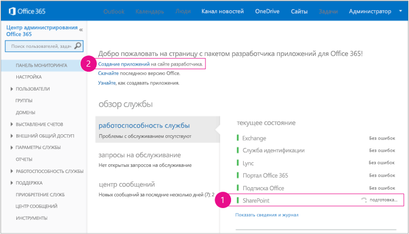

# <a name="get-started-creating-provider-hosted-sharepoint-add-ins"></a>Знакомство с созданием надстроек SharePoint с размещением у поставщика
Узнайте, как настроить среду разработки и создать свою первую надстройку SharePoint с размещением у поставщика.
 

 **Примечание.** В настоящее время идет процесс замены названия "приложения для SharePoint" названием "надстройки SharePoint". Во время этого процесса в документации и пользовательском интерфейсе некоторых продуктов SharePoint и средств Visual Studio может по-прежнему использоваться термин "приложения для SharePoint". Дополнительные сведения см. в статье [Новое название приложений для Office и SharePoint](new-name-for-apps-for-sharepoint.md#bk_newname).
 

Надстройки с размещением у поставщика — это один из двух основных типов надстроек SharePoint. Обзор надстроек SharePoint и этих основных типов см. в статье [Надстройки SharePoint](sharepoint-add-ins.md). Ниже представлен обзор надстроек с размещением у поставщика.
 

- К ним относятся веб-приложения, службы или базы данных, размещенные на компьютерах, которые не относятся к ферме SharePoint или подписке SharePoint Online. Они могут также содержать компоненты SharePoint. Вы можете размещать внешние компоненты в любом стеке веб-хостинга, в том числе стеке LAMP (Linux, Apache, MySQL и PHP).
    
 
- Пользовательская бизнес-логика надстройки должна запускаться на внешних компонентах или в JavaScript пользовательских страниц SharePoint.
    
 
- [Этап 1. Настройка среды разработки](get-started-creating-provider-hosted-sharepoint-add-ins.md#Setup) 

- [Этап 2. Создание проекта приложения](get-started-creating-provider-hosted-sharepoint-add-ins.md#Create) 

- [Этап 3. Написание кода приложения](get-started-creating-provider-hosted-sharepoint-add-ins.md#Code)
 
## <a name="set-up-your-dev-environment"></a>Настройка среды разработки
<a name="Setup"> </a>

Существует множество способов настройки среды разработки для надстроек SharePoint. Здесь приведен самый простой из них. Остальные способы вы найдете в разделе [Дополнительные ресурсы](#bk_addresources).
 

 

### <a name="get-the-tools"></a>Получение инструментов


- Если у вас еще не установлена среда **Visual Studio** 2013 или более поздней версии, установите ее, следуя инструкциям на странице [Установка Visual Studio](http://msdn.microsoft.com/library/da049020-cfda-40d7-8ff4-7492772b620f.aspx). Рекомендуем использовать [последнюю версию из Центра загрузки Майкрософт](https://www.visualstudio.com/downloads/download-visual-studio-vs).
    
 
- В состав Visual Studio входят **Инструменты разработчика Microsoft Office для Visual Studio**. Иногда выпуск новой версии инструментов не совпадает с выходом обновлений Visual Studio. Чтобы убедиться, что у вас установлена последняя версия инструментов, запустите [установщик Инструментов разработчика Office для Visual Studio 2013](http://aka.ms/OfficeDevToolsForVS2013) или [установщик Инструментов разработчика Office для Visual Studio 2015](http://aka.ms/OfficeDevToolsForVS2015). 
    
 

### <a name="sign-up-for-an-office-365-developer-site"></a>Получение Сайта разработчика для Office 365
<a name="o365_signup"> </a>


 **Примечание.** Возможно, у вас уже есть доступ к Сайту разработчика для Office 365. **Вы являетесь подписчиком MSDN?** Visual Studio Ultimate и Visual Studio Premium с подпиской на MSDN включают бесплатную подписку разработчика приложений для Office 365. [Воспользуйтесь этим преимуществом прямо сегодня.](https://msdn.microsoft.com/subscriptions/manage/default.aspx) **У вас есть один из указанных ниже планов подписки на Office 365?** **В этом случае администратор подписки на Office 365 может создать Сайт разработчика, ** используя [Центр администрирования Office 365](https://portal.microsoftonline.com/admin/default.aspx). Дополнительные сведения см. в статье [Создание сайта разработчика для существующей подписки на Office 365](create-a-developer-site-on-an-existing-office-365-subscription.md). 
 

Получить план Office 365 можно тремя способами. 
 

 

- Бесплатно зарегистрируйте учетную запись разработчика Office 365 через программу для разработчиков Office 365 сроком на один год.  [Узнайте больше на сайте программы ](http://dev.office.com/devprogram) или заполните [форму регистрации](https://profile.microsoft.com/RegSysProfileCenter/wizardnp.aspx?wizid=14b845d0-938c-45af-b061-f798fbb4d170). После регистрации в программе для разработчиков вы получите сообщение электронной почты со ссылкой для входа в учетную запись разработчика. Затем следуйте приведенным ниже инструкциям.
    
 
- Начните с [бесплатной 30-дневной пробной версии](https://portal.microsoftonline.com/Signup/MainSignUp.aspx?OfferId=6881A1CB-F4EB-4db3-9F18-388898DAF510&amp;DL=DEVELOPERPACK) с лицензией для одного пользователя.
    
 
- Приобретите [подписку разработчика приложений для Office 365](https://portal.microsoftonline.com/Signup/MainSignUp.aspx?OfferId=C69E7747-2566-4897-8CBA-B998ED3BAB88&amp;DL=DEVELOPERPACK). 
    
 

 **Совет.** Откройте эти ссылки в новом окне или на новой вкладке, чтобы работать с ними было удобнее.
 


**Рис. 1. Доменное имя Сайта разработчика Office 365**

 

 

 

 

 

 

1. Первая страница (не показана) регистрационной формы не требует объяснений. Укажите нужные сведения и нажмите кнопку **Далее**.
    
 
2. На второй странице (рис. 1) укажите ИД администратора подписки.
    
 
3. Создайте поддомен **.onmicrosoft.com**, например contoso.onmicrosoft.com.
    
    После регистрации необходимо использовать полученные учетные данные (в формате _ИД_пользователя_@ _ваш_домен_.onmicrosoft.com) для входа на сайт портала Office 365, используемый для администрирования учетной записи. Сайт разработчика для SharePoint Online будет установлен на новом домене: **http:// _ваш_домен_.sharepoint.com**.
    
 
4. Нажмите кнопку **Далее** и заполните последнюю страницу формы. Если вы хотите указать номер телефона, чтобы получить код подтверждения, можно ввести номер мобильного или стационарного телефона, но *не* номер VoIP.
    
 

    
 **Примечание.** Если при попытке зарегистрировать учетную запись разработчика выполнен вход в другую учетную запись Майкрософт, может появиться следующее сообщение: "Введен неправильный ИД пользователя. Возможно, он недействителен. Убедитесь, что вы вводите ИД пользователя, назначенный вам организацией. Он должен выглядеть так: *proverka@example.com* или *proverka@example.onmicrosoft.com*". Если появляется такое сообщение, выйдите из текущей учетной записи Майкрософт и повторите попытку. Если сообщение продолжает появляться, очистите кэш браузера или выберите режим **Просмотр InPrivate**, а затем заполните форму.
 

По завершении регистрации в браузере откроется страница установки Office 365. Щелкните значок администратора, чтобы открыть страницу Центра администрирования.
 

 

**Рис. 2. Страница Центра администрирования Office 365**

 

 

 

 

1. Подождите, пока завершится настройка Сайта разработчика. После этого обновите страницу центра администрирования в браузере.
    
 
2. Затем перейдите по ссылке **Создание надстроек** в верхнем левом углу страницы, чтобы открыть Сайт разработчика. Должен открыться сайт, показанный на рис. 3. На странице размещен список **Тестируемые надстройки**, подтверждающий, что веб-сайт был создан с помощью шаблона Сайта разработчика SharePoint. Если вместо него вы видите обычный сайт группы, подождите несколько минут и откройте сайт заново.
    
 
3. Обратите внимание на URL-адрес сайта. Он используется при создании проектов надстроек SharePoint в Visual Studio.
    
 

**Рис. 3. Домашняя страница сайта разработчика со списком "Тестируемые надстройки"**

 

 

 

 

 

## <a name="create-the-add-in-project"></a>Создание проекта надстройки
<a name="Create"> </a>


1. Запустите Visual Studio, выбрав команду **Запуск от имени администратора**.
    
 
2. В Visual Studio выберите пункты **Файл** > **Создать** > **Проект**.
    
 
3. В диалоговом окне **Новый проект** последовательно разверните узлы **Visual C#** и **Office/SharePoint**, а затем выберите элементы **Надстройки** > **Надстройка SharePoint**.
    
 
4. Назовите проект SampleAddIn и нажмите кнопку **ОК**.
    
 
5. В первом диалоговом окне **Укажите параметры надстройки SharePoint** выполните указанные ниже действия.
    
      - Укажите полный URL-адрес сайта SharePoint, который вы хотите использовать для отладки надстройки. Это URL-адрес Сайт разработчиков. При указании URL-адреса используйте протокол HTTPS вместо HTTP. В какой-то момент во время этой процедуры или вскоре после ее завершения вам будет предложено войти на сайт. Время поступления предложения бывает разным. Используйте учетные данные администратора (в домене *.onmicrosoft.com), созданные при регистрации Сайта разработчика (например, Moye_imya@contoso.onmicrosoft.com). 
    
 
  - В разделе **Как требуется разместить надстройку SharePoint?** выберите элемент **Размещено у поставщика**.
    
 
  -  Нажмите кнопку **Далее**.
    
 
6. На странице **Указание целевой версии SharePoint** выберите **SharePoint Online**, а затем нажмите кнопку **Далее**.
    
 
7. В разделе **Какой тип проекта веб-приложения требуется создать?** выберите пункт **Приложение веб-форм ASP.NET**, а затем нажмите кнопку **Далее**.
    
 
8. В разделе **Как требуется выполнять проверку подлинности надстройки?** выберите пункт **Использовать службу контроля доступа Microsoft Azure**.
    
 
9. В мастере нажмите кнопку **Готово**.
    
    Основная часть операций по настройке совершается при открытии решения. В решении Visual Studio создаются два проекта: один для Надстройка SharePoint и один для веб-приложения ASP.NET.
    
 

## <a name="code-your-add-in"></a>Написание кода надстройки
<a name="Code"> </a>


1. Откройте файл AppManifest.xml. На вкладке **Разрешения** укажите область **Семейство веб-сайтов** и уровень разрешений **Чтение**.
    
 
2. Удалите часть кода в теге **<body>** файла Pages/Default.aspx веб-приложения, а затем добавьте приведенные ниже элементы управления HTML и ASP.NET в раздел **<body>**. В этом примере используется элемент управления [UpdatePanel](http://msdn2.microsoft.com/EN-US/library/bb359258), который включает частичную отрисовку страницы.
    
```HTML
  <form id="form1" runat="server">
  <div>
    <asp:ScriptManager ID="ScriptManager1" runat="server"
            EnablePartialRendering="true" />
    <asp:UpdatePanel ID="PopulateData" runat="server" UpdateMode="Conditional">
      <ContentTemplate>      
        <table border="1" cellpadding="10">
         <tr><th><asp:LinkButton ID="CSOM" runat="server" Text="Populate Data" 
                               OnClick="CSOM_Click" /></th></tr>
         <tr><td>

        <h2>SharePoint Site</h2>
        <asp:Label runat="server" ID="WebTitleLabel"/>

        <h2>Current User:</h2>
        <asp:Label runat="server" ID="CurrentUserLabel" />

        <h2>Site Users</h2>
        <asp:ListView ID="UserList" runat="server">     
            <ItemTemplate >
              <asp:Label ID="UserItem" runat="server" 
                                Text="<%# Container.DataItem.ToString()  %>">
              </asp:Label><br />
           </ItemTemplate>
        </asp:ListView>

        <h2>Site Lists</h2>
               <asp:ListView ID="ListList" runat="server">
                   <ItemTemplate >
                     <asp:Label ID="ListItem" runat="server" 
                                Text="<%# Container.DataItem.ToString()  %>">
                    </asp:Label><br />
                  </ItemTemplate>
              </asp:ListView>
            </td>              
          </tr>
         </table>
       </ContentTemplate>
     </asp:UpdatePanel>
  </div>
</form>
```

3. Добавьте приведенные ниже объявления в файл Default.aspx.cs веб-приложения.
    
```C#
  using Microsoft.SharePoint.Client;
using Microsoft.IdentityModel.S2S.Tokens;
using System.Net;
using System.IO;
using System.Xml;
```

4. В файле Default.aspx.cs веб-приложения добавьте указанные ниже переменные в класс [Page](http://msdn2.microsoft.com/EN-US/library/dfbt9et1).
    
```C#
  SharePointContextToken contextToken;
string accessToken;
Uri sharepointUrl;
string siteName;
string currentUser;
List<string> listOfUsers = new List<string>();
List<string> listOfLists = new List<string>();
```

5. Добавьте метод  `RetrieveWithCSOM` в класс [Page](http://msdn2.microsoft.com/EN-US/library/dfbt9et1) . Этот метод использует CSOM SharePoint, чтобы получать сведения о вашем сайте и отображать их на странице.
    
```C#
  // This method retrieves information about the host web by using the CSOM.
private void RetrieveWithCSOM(string accessToken)
{

    if (IsPostBack)
    {
        sharepointUrl = new Uri(Request.QueryString["SPHostUrl"]);
    }            

    ClientContext clientContext =
                    TokenHelper.GetClientContextWithAccessToken(
                        sharepointUrl.ToString(), accessToken);

    // Load the properties for the web object.
    Web web = clientContext.Web;
    clientContext.Load(web);
    clientContext.ExecuteQuery();

    // Get the site name.
    siteName = web.Title;

    // Get the current user.
    clientContext.Load(web.CurrentUser);
    clientContext.ExecuteQuery();
    currentUser = clientContext.Web.CurrentUser.LoginName;

    // Load the lists from the Web object.
    ListCollection lists = web.Lists;
    clientContext.Load<ListCollection>(lists);
    clientContext.ExecuteQuery();

    // Load the current users from the Web object.
    UserCollection users = web.SiteUsers;
    clientContext.Load<UserCollection>(users);
    clientContext.ExecuteQuery();

    foreach (User siteUser in users)
    {
        listOfUsers.Add(siteUser.LoginName);
    }


    foreach (List list in lists)
    {
        listOfLists.Add(list.Title);
    }
}
```

6. Добавьте метод `CSOM_Click` в класс [Page](http://msdn2.microsoft.com/EN-US/library/dfbt9et1). Этот метод вызывает событие, которое возникает, когда пользователь переходит по ссылке **Заполнение данными**.
    
```C#
  protected void CSOM_Click(object sender, EventArgs e)
{
    string commandAccessToken = ((LinkButton)sender).CommandArgument;
    RetrieveWithCSOM(commandAccessToken);
    WebTitleLabel.Text = siteName;
    CurrentUserLabel.Text = currentUser;
    UserList.DataSource = listOfUsers;
    UserList.DataBind();
    ListList.DataSource = listOfLists;
    ListList.DataBind();    
 }
```

7. Замените существующий метод  `Page_Load` указанным ниже. Метод `Page_Load` использует методы файла TokenHelper.cs, чтобы извлечь контекст из объекта `Request` и получить маркер доступа от Служба контроля доступа Microsoft Azure (ACS).
    
```C#
  // The Page_load method fetches the context token and the access token. 
// The access token is used by all of the data retrieval methods.
protected void Page_Load(object sender, EventArgs e)
{
     string contextTokenString = TokenHelper.GetContextTokenFromRequest(Request);

    if (contextTokenString != null)
    {
        contextToken =
            TokenHelper.ReadAndValidateContextToken(contextTokenString, Request.Url.Authority);

        sharepointUrl = new Uri(Request.QueryString["SPHostUrl"]);
        accessToken =
                    TokenHelper.GetAccessToken(contextToken, sharepointUrl.Authority)
                    .AccessToken;

         // For simplicity, this sample assigns the access token to the button's CommandArgument property. 
         // In a production add-in, this would not be secure. The access token should be cached on the server-side.
        CSOM.CommandArgument = accessToken;
    }
    else if (!IsPostBack)
    {
        Response.Write("Could not find a context token.");
        return;
    }
}
```

8. После этого файл Default.aspx.cs должен выглядеть, как показано ниже.
    
```C#
  using System;
using System.Collections.Generic;
using System.Linq;
using System.Web;
using System.Web.UI;
using System.Web.UI.WebControls;

using Microsoft.SharePoint.Client;
using Microsoft.IdentityModel.S2S.Tokens;
using System.Net;
using System.IO;
using System.Xml;

namespace SampleAddInWeb
{
    public partial class Default : System.Web.UI.Page
    {
        SharePointContextToken contextToken;
        string accessToken;
        Uri sharepointUrl;
        string siteName;
        string currentUser;
        List<string> listOfUsers = new List<string>();
        List<string> listOfLists = new List<string>();

        protected void Page_PreInit(object sender, EventArgs e)
        {
            Uri redirectUrl;
            switch (SharePointContextProvider.CheckRedirectionStatus(Context, out redirectUrl))
            {
                case RedirectionStatus.Ok:
                    return;
                case RedirectionStatus.ShouldRedirect:
                    Response.Redirect(redirectUrl.AbsoluteUri, endResponse: true);
                    break;
                case RedirectionStatus.CanNotRedirect:
                    Response.Write("An error occurred while processing your request.");
                    Response.End();
                    break;
            }
        }

        protected void CSOM_Click(object sender, EventArgs e)
        {
            string commandAccessToken = ((LinkButton)sender).CommandArgument;
            RetrieveWithCSOM(commandAccessToken);
            WebTitleLabel.Text = siteName;
            CurrentUserLabel.Text = currentUser;
            UserList.DataSource = listOfUsers;
            UserList.DataBind();
            ListList.DataSource = listOfLists;
            ListList.DataBind();
        }

        // This method retrieves information about the host web by using the CSOM.
        private void RetrieveWithCSOM(string accessToken)
        {

            if (IsPostBack)
            {
                sharepointUrl = new Uri(Request.QueryString["SPHostUrl"]);
            }


            ClientContext clientContext =
                    TokenHelper.GetClientContextWithAccessToken(
                        sharepointUrl.ToString(), accessToken);


            // Load the properties for the web object.
            Web web = clientContext.Web;
            clientContext.Load(web);
            clientContext.ExecuteQuery();

            // Get the site name.
            siteName = web.Title;

            // Get the current user.
            clientContext.Load(web.CurrentUser);
            clientContext.ExecuteQuery();
            currentUser = clientContext.Web.CurrentUser.LoginName;

            // Load the lists from the Web object.
            ListCollection lists = web.Lists;
            clientContext.Load<ListCollection>(lists);
            clientContext.ExecuteQuery();

            // Load the current users from the Web object.
            UserCollection users = web.SiteUsers;
            clientContext.Load<UserCollection>(users);
            clientContext.ExecuteQuery();

            foreach (User siteUser in users)
            {
                listOfUsers.Add(siteUser.LoginName);
            }

            foreach (List list in lists)
            {
                listOfLists.Add(list.Title);
            }
        }

        protected void Page_Load(object sender, EventArgs e)
        {
            string contextTokenString = 
                 TokenHelper.GetContextTokenFromRequest(Request);

            if (contextTokenString != null)
            {
                contextToken =
                    TokenHelper.ReadAndValidateContextToken(contextTokenString, Request.Url.Authority);

                sharepointUrl = new Uri(Request.QueryString["SPHostUrl"]);
                accessToken =
                    TokenHelper.GetAccessToken(contextToken, sharepointUrl.Authority)
                               .AccessToken;
                CSOM.CommandArgument = accessToken;
            }
            else if (!IsPostBack)
            {
                Response.Write("Could not find a context token.");
                return;
            }
        }
    }
}
```

9. Нажмите клавишу F5, чтобы развернуть и запустить надстройку. Если появится окно **Оповещение системы безопасности** с предложением доверять самозаверяющему сертификату Localhost, нажмите кнопку **Да**.
    
    Выберите **Доверять** на странице подтверждения, чтобы предоставить надстройке разрешения. Visual Studio установит веб-приложение в IIS Express, а затем установит надстройку на тестовом сайте SharePoint и запустит ее. Откроется страница с таблицей, показанная на приведенном ниже снимке экрана. Нажмите **Заполнение данных**, чтобы просмотреть сводную информацию о сайте SharePoint.
    

    **Страница запуска образца базовой надстройки с размещением у поставщика**

 

  
 

 

 

## <a name="next-steps"></a>Дальнейшие действия
<a name="SP15createprovider_nextsteps"> </a>

Сведения об интеграции надстройки в схему пользовательского интерфейса SharePoint см. в статье [Настройка внешнего вида надстройки SharePoint, размещенной у поставщика](give-your-provider-hosted-add-in-the-sharepoint-look-and-feel.md).
 

 

## <a name="additional-resources"></a>Дополнительные ресурсы
<a name="bk_addresources"> </a>


- Настройка других типов среды разработки (например, среды "все локальные") описана в разделе  [Инструменты](tools-and-environments-for-developing-sharepoint-add-ins.md) в содержании Надстройки SharePoint.
    
 

