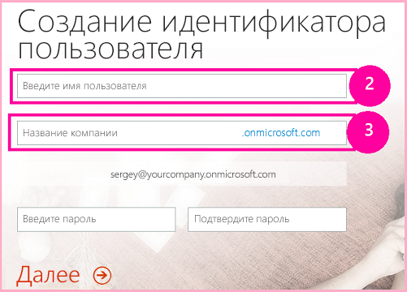

# <a name="get-started-creating-sharepoint-hosted-sharepoint-add-ins"></a>Знакомство с созданием надстроек SharePoint, размещаемых в SharePoint

Надстройки с размещением в SharePoint — это один из двух основных типов надстроек SharePoint. Обзор надстроек SharePoint и этих основных типов см. в статье [Надстройки SharePoint](sharepoint-add-ins.md). Ниже представлен обзор надстроек с размещением в SharePoint.

- Они содержат списки SharePoint, веб-части, рабочие процессы, пользовательские страницы и другие компоненты, каждый из которых установлен на дочернем сайте (сайте надстройки) того веб-сайта SharePoint, на котором установлена надстройка.

- Единственный код, который они содержат, — JavaScript пользовательских страниц SharePoint.

- Этап 1. Настройка среды разработки 

- Этап 2. Создание проекта приложения 

- Этап 3. Написание кода приложения

<a name="Setup"> </a>
## <a name="set-up-your-dev-environment"></a>Настройка среды разработки

Существует множество способов настройки среды разработки для надстроек SharePoint. Здесь приведен самый простой из них.

### <a name="get-the-tools"></a>Получение инструментов

- Если у вас еще не установлена среда **Visual Studio** 2013 или более поздней версии, установите ее согласно инструкциям на странице [Установка Visual Studio](https://docs.microsoft.com/ru-RU/visualstudio/install/install-visual-studio). Рекомендуем использовать [последнюю версию из Центра загрузки Майкрософт](https://www.visualstudio.com/downloads/download-visual-studio-vs).

- Visual Studio включает **Инструменты разработчика Microsoft Office для Visual Studio**. Иногда выпуск новой версии инструментов не совпадает с выходом обновлений Visual Studio. Чтобы убедиться, что у вас установлена последняя версия инструментов, запустите [установщик Инструментов разработчика Office для Visual Studio 2013](http://aka.ms/OfficeDevToolsForVS2013) или [установщик Инструментов разработчика Office для Visual Studio 2015](http://aka.ms/OfficeDevToolsForVS2015). 

<a name="o365_signup"> </a>
### <a name="sign-up-for-an-office-365-developer-site"></a>Регистрация сайта разработчика для Office 365

> [!NOTE]
> Возможно, у вас уже есть доступ к сайту разработчика Office 365.
> - **Вы подписчик MSDN?** Visual Studio Ultimate и Visual Studio Premium с подпиской MSDN предоставляют льготное право на подписку разработчика приложений для Office 365. [Воспользуйтесь этим преимуществом прямо сегодня.](https://msdn.microsoft.com/subscriptions/manage/default.aspx) 
> - **У вас есть один из указанных ниже планов подписки на Office 365?** В таком случае администратор подписки на Office 365 может создать сайт разработчика с помощью [Центра администрирования Office 365](https://portal.microsoftonline.com/admin/default.aspx). Дополнительные сведения см. в статье [Создание сайта разработчика с использованием имеющейся подписки на Office 365](create-a-developer-site-on-an-existing-office-365-subscription.md). 

Получить план Office 365 можно тремя способами: 

- Начните с [бесплатной 30-дневной пробной версии](https://portal.microsoftonline.com/Signup/MainSignUp.aspx?OfferId=6881A1CB-F4EB-4db3-9F18-388898DAF510&amp;DL=DEVELOPERPACK) с лицензией для одного пользователя.

- Приобретите [подписку разработчика приложений для Office 365](https://portal.microsoftonline.com/Signup/MainSignUp.aspx?OfferId=C69E7747-2566-4897-8CBA-B998ED3BAB88&amp;DL=DEVELOPERPACK). 

- Зарегистрируйте бесплатную учетную запись разработчика Office 365 на один год, приняв участие в программе для разработчиков приложений для Office 365. [Ознакомьтесь с дополнительными сведениями](http://dev.office.com/devprogram) или перейдите непосредственно к [форме регистрации](https://profile.microsoft.com/RegSysProfileCenter/wizardnp.aspx?wizid=14b845d0-938c-45af-b061-f798fbb4d170). После регистрации в программе для разработчиков вы получите электронное сообщение со ссылкой для регистрации учетной записи разработчика. Следуйте приведенным ниже инструкциям.

> [!TIP]
> Откройте эти ссылки в новом окне или на новой вкладке, чтобы работать с ними было удобнее.

1. Первая страница регистрационной формы не требует объяснений. Укажите нужные сведения и нажмите кнопку **Далее**.

2. На второй странице (рис. 1) укажите ИД администратора подписки.
   
   *Рис. 1. Доменное имя сайта разработчика Office 365*

   
   
3. Создайте поддомен **.onmicrosoft.com**, например contoso.onmicrosoft.com.
    
   После регистрации необходимо использовать полученные учетные данные (в формате *ИД_пользователя@ваш_домен.onmicrosoft.com*), чтобы войти на сайт портала Office 365, используемого для администрирования учетной записи. Ваш сайт разработчика SharePoint Online будет установлен на новом домене: `http://yourdomain.sharepoint.com`.
    
4. Нажмите кнопку **Далее** и заполните последнюю страницу формы. Если вы хотите указать номер телефона, чтобы получить код подтверждения, можно ввести номер мобильного или стационарного телефона, но *не* номер VoIP.
    
   > [!NOTE]
   > Если при попытке зарегистрировать учетную запись разработчика уже выполнен вход в другую учетную запись Майкрософт, может появиться сообщение "К сожалению, указанный вами ИД пользователя не работает. Похоже, он не является допустимым. Обязательно укажите ИД пользователя, назначенный вам организацией. Как правило, ИД пользователя представлен в формате *proverka@example.com* или *proverka@example.onmicrosoft.com*". 

   > Если появится это сообщение, выйдите из используемой учетной записи Майкрософт и повторите попытку. Если сообщение по-прежнему появляется, очистите кэш браузера или переключитесь в режим **Просмотр InPrivate **, а затем заполните форму.

   По завершении регистрации в браузере откроется страница установки Office 365. Щелкните значок администратора, чтобы открыть страницу центра администрирования.

   *Рис. 2. Страница Центра администрирования Office 365*

   
 
5. Подождите, пока завершится настройка сайта разработчика. После этого обновите страницу центра администрирования в браузере.

6. Перейдите по ссылке **Создание надстроек** в левом верхнем углу страницы, чтобы открыть сайт разработчика. Открывшийся сайт должен выглядеть так, как показано на рис. 3. Список **Тестируемые надстройки** на странице подтверждает, что веб-сайт был создан с помощью шаблона "Сайт разработчика" из SharePoint. Если вместо этого отображается обычный сайт группы, подождите несколько минут и перезагрузите сайт.

7. Запишите URL-адрес сайта. Он используется при создании проектов надстроек SharePoint в Visual Studio.

   *Рис. 3. Домашняя страница сайта разработчика со списком "Тестируемые надстройки"*

   

<a name="Create"> </a>
## <a name="create-the-add-in-project"></a>Создание проекта надстройки

1. Запустите Visual Studio, выбрав команду **Запуск от имени администратора**.

2. В Visual Studio выберите пункты **Файл** > **Создать** > **Новый проект**.
 
3. В диалоговом окне **Новый проект** последовательно разверните узлы **Visual C#** и **Office/SharePoint**, а затем выберите элементы **Надстройки** > **Надстройка для SharePoint**.

4. Присвойте проекту имя **EmployeeOrientation**, а затем нажмите кнопку **ОК**.

5. В диалоговом окне **Настройка параметров надстроек SharePoint** укажите полный URL-адрес сайта SharePoint, который требуется использовать для отладки надстройки. Это URL-адрес сайта разработчика. Используйте в URL-адресе протокол HTTPS, а не HTTP. В разделе **Как требуется разместить надстройку SharePoint?**, выберите **Размещено в SharePoint**, а затем нажмите кнопку **Готово**.

6. Вам может быть предложено войти на сайт разработчика. В таком случае используйте учетные данные администратора подписки.

7. После создания проекта откройте файл **/Pages/Default.aspx** из корневой папки проекта. Помимо прочего, этот созданный файл загружает один или оба сценария, размещенные в SharePoint: sp.runtime.js и sp.js. Разметку для загрузки этих файлов можно найти в элементе управления **Content** в верхней части файла с идентификатором **PlaceHolderAdditionalPageHead**. Разметка зависит от используемой версии **Инструментов разработчика Microsoft Office для Visual Studio**. В руководствах из этой серии необходимо загружать оба файла с обычными HTML-тегами **\<script\>**, а не с тегами **\<SharePoint:ScriptLink\>**. 

    Убедитесь, что указанные ниже строки присутствуют в элементе управления **PlaceHolderAdditionalPageHead** *над* строкой `<meta name="WebPartPageExpansion" content="full" />`.
    
    ```
      <script type="text/javascript" src="/_layouts/15/sp.runtime.js"></script> 
      <script type="text/javascript" src="/_layouts/15/sp.js"></script> 
    ```

8. Проверьте файл на наличие другой разметки, загружающей один или оба файла сценариев, и удалите ее. Сохраните и закройте файл.

<a name="Code"> </a>
## <a name="code-your-add-in"></a>Написание кода надстройки

Для вашей первой надстройки SharePoint с размещением в SharePoint мы включим классическое расширение SharePoint: настраиваемый список и его экземпляр.

1. В **обозревателе решений** откройте файл AppManifest.xml.

2. Когда откроется конструктор манифеста, измените значение в поле **Title**, на **Адаптация сотрудников**. *Не* меняйте значение в поле **Name**.

3. Сохраните и закройте файл.

4. В **обозревателе решений** щелкните проект правой кнопкой мыши и выберите пункты **Добавить** > **Новая папка**. Назовите папку Lists.

5. Щелкните новую папку правой кнопкой мыши и выберите пункты **Добавить** > **Новый элемент**. В узле **Office/SharePoint** откроется диалоговое окно **Добавление нового элемента**.

6. Выберите **Список**. Задайте для него имя **NewEmployeeOrientation** и нажмите кнопку **Добавить**. 
 
7. На странице **Выберите параметры списка** в мастере настройки SharePoint оставьте заданное по умолчанию отображаемое имя списка **NewEmployeeOrientation**, нажмите кнопку **Создать настраиваемый шаблон списка и экземпляр списка на его основе** и в раскрывающемся списке выберите **По умолчанию (настраиваемый список)**. Затем нажмите кнопку **Готово**.

8. Мастер создаст шаблон списка **NewEmployeeOrientation** с экземпляром дочернего списка под названием **NewEmployeeOrientationInstance**. При этом может открыться конструктор списков, который понадобится на следующем этапе.

9. Разверните узел **NewEmployeeOrientationInstance** в **обозревателе решений**, если вы еще не сделали этого, чтобы четко отличать файл elements.xml, который представляет собой дочерний элемент *экземпляра* списка, от файла elements.xml, который представляет собой дочерний элемент *шаблона* списка.
    
    *Рис. 4. Узел списков в обозревателе решений*

    

10. Откройте дочерний элемент elements.xml в шаблоне списка **NewEmployeeOrientation**.

11. Измените значение атрибута **DisplayName** (не атрибута **Name**), чтобы имя стало более понятным: "Обучение новых сотрудников".

12. Задайте для атрибута **Description** значение "Сведения об адаптации новых сотрудников".

13. Оставьте для других атрибутов значения по умолчанию, а затем сохраните и закройте файл.

14. Если конструктор списков не открыт, выберите узел **NewEmployeeOrientation** в **обозревателе решений**.

15. Откройте вкладку **Список** в конструкторе. Эта вкладка используется для установки определенных значений *экземпляра* (не *шаблона*) списка, но она содержит некоторые значения по умолчанию, унаследованные от шаблона.

16. Замените значения на вкладке **Список** на следующие:
    
    -  **Заголовок**: "Новые сотрудники в Сиэтле".
    -  **URL-адрес списка**: Lists/NewEmployeesInSeattle.
    -  **Описание**: "Новые сотрудники в Сиэтле".

17. Оставьте установленные по умолчанию флажки и закройте конструктор.

18. В **обозревателе решений** может отображаться старое имя экземпляра списка. В таком случае откройте контекстное меню узла **NewEmployeeOrientationInstance**, выберите пункт **Переименовать** и измените имя на **NewEmployeesInSeattle**.

19. Откройте файл schema.xml.

20. В элементе **View**, значение **BaseViewID** которого равно 0, замените имеющийся элемент **ViewFields** на приведенную ниже часть кода. Используйте именно этот GUID для параметра **FieldRef** с именем `Title`. В этом автоматически созданном файле schema.xml могут встречаться разрывы строк в странных местах. Убедитесь, что вы нашли соответствующие начальный и конечный теги элемента **ViewFields**. Добавьте разрывы строк для удобочитаемости. 

    ```
      <ViewFields>
         <FieldRef Name="Title" ID="{fa564e0f-0c70-4ab9-b863-0177e6ddd247}" DisplayName="Employee" />
      </ViewFields>
    ```

21. Не закрывая файл schema.xml, в элементе **View**, значение **BaseViewID** которого равно 1, замените элемент **ViewFields** на приведенную ниже разметку. Используйте именно этот GUID для параметра **FieldRef** с именем `LinkTitle`.
    
    ```
      <ViewFields>
         <FieldRef Name="LinkTitle" ID="{82642ec8-ef9b-478f-acf9-31f7d45fbc31}" DisplayName="Employee" />
      </ViewFields>
    ```

22. Сохраните и закройте файл schema.xml.

23. Откройте файл elements.xml, который представляет собой дочерний элемент *экземпляра* списка **NewEmployeesInSeattle** (а не *шаблона* списка **NewEmployeeOrientation**).

24. В этом файле заполните список начальными данными. Для этого добавьте следующую разметку элемента **Data** в качестве дочернего элемента **ListInstance**.
    
    ```
      <Data>
      <Rows>
        <Row>
          <Field Name="Title">Tom Higginbotham</Field>
        </Row>
        <Row>
          <Field Name="Title">Satomi Hayakawa</Field>
        </Row>
        <Row>
          <Field Name="Title">Cassi Hicks</Field>
        </Row>
        <Row>
          <Field Name="Title">Lertchai Treetawatchaiwong</Field>
        </Row>
      </Rows>
    </Data>
    ```

25. Сохраните и закройте файл.

26. В **обозревателе решений** дважды щелкните элемент **Компонент1**, чтобы открыть конструктор компонентов. В конструкторе задайте для параметра **Название** значение **Компоненты для адаптации новый сотрудников**, а для параметра **Описание** — значение **Списки и другие компоненты для адаптации сотрудников в компании**. Сохраните файл и закройте конструктор.

27. Если элемент **Компонент1** в **обозревателе решений** не был переименован автоматически, откройте его контекстное меню, выберите пункт **Переименовать** и укажите имя **NewEmployeeOrientationComponents**.

28. Откройте файл Default.aspx.

29. Найдите элемент **Content** для ASP.NET с идентификатором **PlaceHolderPageTitleInTitleArea**. Замените стандартную строку **Заголовок страницы** на **Новые сотрудники по местонахождению**.

30. Найдите элемент **Content** для ASP.NET с идентификатором **PlaceHolderMain**. *Замените* его содержимое на приведенную ниже разметку. `_spPageContextInfo` — это объект JavaScript, который SharePoint автоматически включает на страницу. Его свойство `webAbsoluteUrl` возвращает URL-адрес сайта надстройки.
    
    ```XML
        <p><asp:HyperLink runat="server" 
        NavigateUrl="JavaScript:window.location = _spPageContextInfo.webAbsoluteUrl + '/Lists/NewEmployeesInSeattle/AllItems.aspx';" 
        Text="New Employees in Seattle" /></p>
    ```

<a name="Code"> </a>
## <a name="run-the-add-in-and-test-the-list"></a>Запуск надстройки и тестирование списка

1. Нажмите клавишу F5, чтобы развернуть и запустить надстройку. Visual Studio временно устанавливает надстройку на тестовом сайте SharePoint и сразу же запускает ее. Сведения о том, как пользователи запускают установленную надстройку SharePoint, см. в разделе [Дальнейшие действия](#Nextsteps).

2. Когда откроется страница надстройки по умолчанию, перейдите по ссылке **Новые сотрудники в Сиэтле**, чтобы открыть экземпляр настраиваемого списка.
    
    *Рис. 5. Страница по умолчанию и страница представления списка*

    

3. Добавьте и удалите элементы в списке.

4. Чтобы завершить сеанс отладки, закройте окно браузера или остановите отладку в Visual Studio. При каждом нажатии клавиши F5 Visual Studio будет отзывать предыдущую версию надстройки и устанавливать ее последнюю версию.

5. Вы будете работать с этой надстройкой и решением Visual Studio при изучении других статей, поэтому при перерывах в работе рекомендуем отзывать надстройку. В **обозревателе решений** щелкните проект правой кнопкой мыши и выберите пункт **Отозвать**.

## <a name="additional-resources"></a>Дополнительные ресурсы

- [Установка более ранних версий Visual Studio](http://msdn.microsoft.com/library/da049020-cfda-40d7-8ff4-7492772b620f.aspx)
- [Документация по Visual Studio](https://docs.microsoft.com/ru-RU/visualstudio/)

## <a name="next-steps"></a>Дальнейшие действия
<a name="Nextsteps"> </a>

На данный момент в списке мало сведений для адаптации сотрудников. Мы добавим их в дальнейших статьях этой серии. Но для начала ненадолго отвлечемся от написания кода, чтобы научиться развертывать надстройки SharePoint в статье [Развертывание и установка надстроек, размещаемых в SharePoint](deploy-and-install-a-sharepoint-hosted-sharepoint-add-in.md).
 
