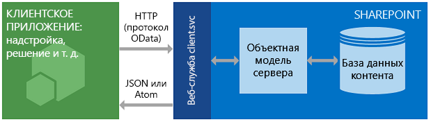

# <a name="get-to-know-the-sharepoint-rest-service"></a>Знакомство со службой REST в SharePoint

В SharePoint реализована служба передачи репрезентативного состояния (REST), сравнимая с уже имеющимися [клиентскими объектными моделями](http://msdn.microsoft.com/library/88e5e1b9-eab2-4f3b-a3f2-75c96b86f1f4%28Office.15%29.aspx). Теперь разработчики могут удаленно работать с данными SharePoint при помощи любой технологии, поддерживающей веб-запросы REST. Это означает, что разработчики могут выполнять операции **создания**, **чтения**, **обновления** и **удаления** (CRUD) из надстроек, решений и клиентских приложений для SharePoint, используя веб-технологии REST и стандартный синтаксис протокола OData (Open Data Protocol).

## <a name="prerequisites"></a>Необходимые компоненты

В этой статье предполагается, что у вас есть базовое представление о службе REST и создании запросов REST.

<a name="bk_how"> </a>

## <a name="how-the-sharepoint-rest-service-works"></a>Принцип работы службы REST в SharePoint

В SharePoint появилась возможность удаленной работы с сайтами SharePoint с помощью REST. Теперь вы можете работать с объектами SharePoint напрямую, используя любую технологию, поддерживающую стандартные возможности REST.

Для доступа к ресурсам SharePoint с помощью REST необходимо создать HTTP-запрос RESTful, используя стандарт OData, который соответствует нужному API клиентской объектной модели. Примеры:

*Метод клиентской объектной модели:*<br/> 
`List.GetByTitle(listname)` 

*Конечная точка REST:*<br/>
`http://server/site/_api/lists/getbytitle('listname')`

Веб-служба client.svc в SharePoint обрабатывает HTTP-запрос и возвращает ответ в формате Atom или нотации объектов JavaScript (JSON). Затем клиентское приложение должно проанализировать этот ответ. Ниже показано высокоуровневое представление архитектуры REST в SharePoint.

**Архитектура службы REST в SharePoint**


 
Благодаря функциональности и простоте использования этих клиентских объектных моделей разработчики чаще всего применяют их для обмена данными с сайтами SharePoint, используя управляемый код для .NET Framework, Silverlight или JavaScript.
 
<a name="bk_usingHTTP"> </a>

### <a name="use-http-commands-with-the-sharepoint-rest-service"></a>Использование команд HTTP со службой REST в SharePoint

Чтобы использовать возможности REST, встроенные в SharePoint, необходимо создать HTTP-запрос RESTful, используя стандарт OData, соответствующий нужному API клиентской объектной модели. Веб-служба client.svc обрабатывает HTTP-запрос и возвращает ответ в формате Atom или JSON. Затем клиентское приложение должно проанализировать этот ответ.

Конечные точки в службе REST SharePoint соответствуют типам и элементам клиентских объектных моделей SharePoint. С помощью HTTP-запросов вы можете использовать эти конечные точки REST для выполнения типичных операций CRUD с сущностями SharePoint, такими как списки и сайты. 

|**Задача**|**HTTP-запрос**|**Примечания**|
|:-----|:-----|:-----|
|Чтение ресурса|**GET**||
|Создание или обновление ресурса|**POST**|- С помощью запроса **POST** можно создавать сущности, например списки и сайты.<br/>- Служба REST SharePoint поддерживает отправку команд **POST**, включающих определения объектов, в конечные точки, представляющие коллекции.<br/>- В операциях **POST** для всех необязательных свойств задаются значения по умолчанию.<br/>- При попытке задать доступное только для чтения свойство в рамках операции **POST** служба возвращает исключение.|
|Обновление или вставка ресурса |**PUT**|- С помощью операций **PUT** и **MERGE** можно обновлять существующие объекты SharePoint.<br/>- Любая конечная точка службы, представляющая операцию **set** для свойств объектов, поддерживает как запросы **PUT**, так и запросы **MERGE**.<br/>- В случае запросов **MERGE** задавать свойства необязательно. Все свойства, не заданные в явном виде, сохраняют свои текущие значения.<br/>- В случае запросов **PUT**, если не указать все обязательные свойства в обновлениях объекта, служба REST возвращает исключение.<br/>- Кроме того, всем необязательным свойствам, не заданным в явном виде, присваиваются значения по умолчанию.|
|Удаление ресурса|**DELETE**|Отправив команду HTTP **DELETE** на URL-адрес определенной конечной точки, вы можете удалить объект SharePoint, который представляет эта конечная точка.<br/>- В случае объектов, поддерживающих повторное использование (таких как списки, файлы и элементы списков), используется операция **Recycle**.|

<br/>

<a name="bk_constructURLs"> </a>

### <a name="construct-rest-urls-to-access-sharepoint-resources"></a>Составление URL-адресов REST для доступа к ресурсам SharePoint

Когда возможно, URI для этих конечных точек REST близко имитирует подпись API ресурса в клиентской объектной модели SharePoint. Главные точки входа для службы REST представляют семейство веб-сайтов и сайт указанного контекста. 

Для доступа к определенному семейству веб-сайтов используйте следующую конструкцию:

`http://server/site/_api/site`

Для доступа к определенному сайту используйте следующую конструкцию:

`http://server/site/_api/web`

В обоих случаях *server* представляет имя сервера, а *site* — имя определенного сайта или путь к нему.

Начиная с этой отправной точки, вы можете составлять более конкретные URI REST, ''обходя" объектную модель с использованием имен API клиентской объектной модели, разделенных знаком косой черты (/).

Этот синтаксис неприменим к REST API SocialFeedManager и SocialFollowingManager. Дополнительные сведения см. в следующих статьях: 

- [Справочные материалы по REST API каналов социальных сетей для SharePoint](../general-development/social-feed-rest-api-reference-for-sharepoint.md)
- [Справочные материалы по REST API отслеживания пользователей и контента для SharePoint](../general-development/following-people-and-content-rest-api-reference-for-sharepoint.md)

Дополнительные рекомендации по определению URI конечных точек REST в SharePoint на основе подписи соответствующих API клиентской объектной модели см. в [этой статье](determine-sharepoint-rest-service-endpoint-uris.md).

<a name="bk_URLexamples"> </a>

## <a name="sharepoint-rest-endpoint-examples"></a>Примеры конечных точек REST в SharePoint

В приведенной ниже таблице представлены типичные примеры URL-адресов конечных точек REST, которые помогут вам приступить к работе с данными SharePoint. Чтобы составить полный URL-адрес REST, добавьте строку `http://server/site/_api/` в начале фрагментов URL-адресов, показанных в таблице. При необходимости для команд **POST** в таблице приводятся примеры данных, которые необходимо передать в тексте HTTP-запроса для создания указанного элемента SharePoint. Элементы в кавычках представляют переменные, вместо которых следует подставить свои значения.

<br/>

|**Описание**|**Конечная точка URL-адреса**|**Метод HTTP**|**Содержимое текста**|
|:-----|:-----|:-----|:-----|
|Получает заголовок списка| `web/title`|GET|Не применимо|
|Получает все списки на сайте| `lists`|GET|Неприменимо|
|Получает метаданные одного списка| `lists/getbytitle('listname')`|GET|Не применимо|
|Получает элементы списка| `lists/getbytitle('listname')/items`|GET|Неприменимо|
|Получает определенное свойство документа<br/>(в данном случае это заголовок документа)| `lists/getbytitle('listname')?select=Title`|GET|Не применимо|
|Создает список| `lists`|POST|См. пример|
|Добавляет элемент в список| `lists/getbytitle('listname')/items`|POST|См. пример|

<br/>

_Пример данных для **создания списка**_

```
{
  '__metadata':{'type':SP.List},
  'AllowContentTypes': true,
  'BaseTemplate': 104 ,
  'ContentTypesEnabled': true,
  'Description': 'My list description ',
  'Title': 'RestTest '
}
```

<br/>

_Пример данных для **добавления элемента в список**_

```
{
  '__metadata':{'type': SP.Data.'listname'.ListItem},
  'Title': 'MyItem'
}

```

<br/>

<a name="batch"> </a>

## <a name="batch-job-support"></a>Поддержка пакетных заданий

Служба REST в SharePoint Online (а также локальной среде SharePoint 2016 или более поздней версии) поддерживает объединение нескольких запросов в один вызов службы с помощью параметра запроса OData `$batch`. Подробные сведения и ссылки на примеры кода см. в [этой статье](make-batch-requests-with-the-rest-apis.md).

<a name="SP15startREST_bk_addlresources"> </a>

## <a name="odata-resources"></a>Материалы по OData

-  [Разработка сервисноориентированных приложений с помощью WCF](https://docs.microsoft.com/ru-RU/dotnet/framework/wcf/index)
-  [Open Data Protocol](http://www.odata.org/)
-  [Соглашения об URI для протокола OData](http://www.odata.org/documentation/odata-version-2-0/uri-conventions/)
-  [Адресация для операций службы](http://www.odata.org/documentation/odata-version-2-0/uri-conventions#AddressingServiceOperations)
-  [Операции протокола OData](http://www.odata.org/documentation/odata-version-2-0/operations/)
-  [Условия ошибок](http://www.odata.org/documentation/odata-version-2-0/operations#ErrorConditions)
 

<a name="bk_learnmore"> </a>

## <a name="sharepoint-rest-service-topics"></a>Статьи, посвященные службе REST в SharePoint

Дополнительные сведения об использовании службы REST в SharePoint см. в перечисленных ниже ресурсах.

|**Название**|**Описание**|
|:-----|:-----|
| [Выполнение базовых операций с использованием конечных точек REST SharePoint](complete-basic-operations-using-sharepoint-rest-endpoints.md)|Узнайте, как выполнять операции CRUD (создание, чтение, обновление, удаление) с помощью интерфейса REST SharePoint.|
| [Работа со списками и элементами списков в службе REST](working-with-lists-and-list-items-with-rest.md)|Узнайте, как выполнять основные операции CRUD со списками и их элементами при помощи интерфейса REST SharePoint.|
| [Работа с папками и файлами в службе REST](working-with-folders-and-files-with-rest.md)|Узнайте, как выполнять основные операции CRUD с папками и файлами при помощи интерфейса REST SharePoint.|
| [Навигация по структуре данных SharePoint, представленной в службе REST](navigate-the-sharepoint-data-structure-represented-in-the-rest-service.md)|Узнайте, как с помощью конечной точки REST в элементе SharePoint получить доступ к связанным элементам, например родительским сайтам или структуре библиотеки, в которой находится этот элемент.|
| [Определение URI конечных точек службы REST в SharePoint](determine-sharepoint-rest-service-endpoint-uris.md)|Общие рекомендации по определению URI конечных точек REST в SharePoint на основе подписей соответствующих API клиентской объектной модели.|
| [Использование операций запросов OData в запросах REST SharePoint](use-odata-query-operations-in-sharepoint-rest-requests.md)|Узнайте, как использовать широкий спектр операторов строки запроса OData для выбора, фильтрации и упорядочивания данных, запрашиваемых у службы REST SharePoint.|
| [Отправка пакетных запросов с помощью интерфейсов REST API](make-batch-requests-with-the-rest-apis.md)|Узнайте, как объединить несколько запросов в один вызов службы REST.|
| [Синхронизация элементов SharePoint с помощью службы REST](synchronize-sharepoint-items-using-the-rest-service.md)|Узнайте, как синхронизировать элементы между SharePoint и надстройками или службами с помощью ресурса **GetListItemChangesSinceToken**, входящего в состав службы REST в SharePoint.|
| [Отправка файла с помощью REST API и jQuery](upload-a-file-by-using-the-rest-api-and-jquery.md) |В примерах кода в этой статье показано, как с помощью интерфейса REST и AJAX-запросов jQuery добавить локальный файл в библиотеку "Документы", а затем изменить свойства элемента списка, представляющего отправленный файл.|
| [Установка настраиваемых разрешений для списка с помощью интерфейса REST](set-custom-permissions-on-a-list-by-using-the-rest-interface.md) |Сайты, списки и элементы списков SharePoint относятся к типу SecurableObject, наследующему разрешения от родительского объекта. Чтобы задать особые разрешения для объекта, необходимо запретить ему наследовать разрешения от родительского объекта, а затем определить новые разрешения, добавив или удалив назначения ролей.|
| [Основные сведения о рабочих процессах SharePoint](../general-development/sharepoint-workflow-fundamentals.md)|Узнайте, как добавлять функции поиска в клиентские и мобильные приложения с помощью службы REST поиска в SharePoint Server 2013 и любой технологии, поддерживающей веб-запросы REST.|
| [Справочные материалы по REST API каналов социальных сетей для SharePoint](../general-development/social-feed-rest-api-reference-for-sharepoint.md)|Конечные точки REST SharePoint для выполнения задач, связанных с каналами.|
| [Справочные материалы по REST API отслеживания пользователей и контента для SharePoint](../general-development/following-people-and-content-rest-api-reference-for-sharepoint.md)|Конечные точки REST SharePoint для подписки на людей и контент.|
| [Разработка надстроек SharePoint](develop-sharepoint-add-ins.md) | Здесь вы найдете подробные статьи и ресурсы, которые помогут вам расширить возможности своих надстроек SharePoint.|
| [Справочные материалы по REST API и примеры](https://msdn.microsoft.com/library) | Полный справочник по API для работы с инструментами, службами и технологиями Майкрософт. Здесь вы найдете подробный синтаксис, фрагменты кода и рекомендации по созданию приложений, разработке веб-сайтов и работе с облаком.|


<!-- Removed these because the first one 404'd and the second one went to Working with lists (already in list).
| [REST API reference and samples](http://msdn.microsoft.com/library/rest-api-reference-and-samples%28Office.15%29.aspx)|This page contains links to all of the REST resources that are available for SharePoint developers on MSDN.| 
| [Use ETag values through the REST service to get document list item versioning](http://msdn.microsoft.com/library/5f7e0579-46b7-44ab-b3b4-cdbc622dcd98%28Office.15%29.aspx)|Learn how to use HTML ETags with the SharePoint REST service for concurrency control of SharePoint lists and list items.|-->

