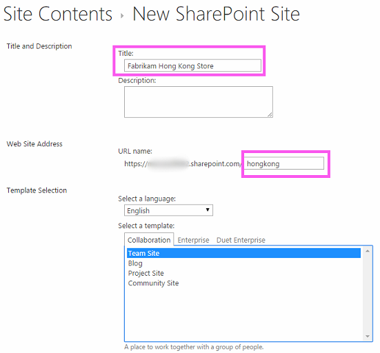
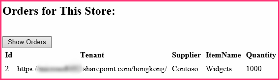
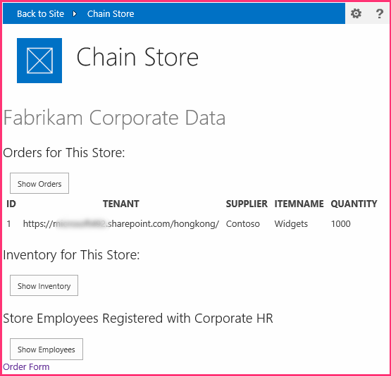

# <a name="give-your-provider-hosted-add-in-the-sharepoint-look-and-feel"></a><span data-ttu-id="0fdf3-101">Настройка внешнего вида надстройки SharePoint, размещенной у поставщика</span><span class="sxs-lookup"><span data-stu-id="0fdf3-101">Give your provider-hosted add-in the SharePoint look-and-feel</span></span>
<span data-ttu-id="0fdf3-102">Сведения о том, как придать надстройкам SharePoint, размещаемым у поставщика, внешний вид и удобство использования SharePoint.</span><span class="sxs-lookup"><span data-stu-id="0fdf3-102">Learn how to give your provider-hosted spappplural the look and feel of SharePoint.</span></span>
 

 <span data-ttu-id="0fdf3-p101">**Примечание** Название "приложения для SharePoint" меняется на "надстройки SharePoint". Пока изменения не будут внесены полностью, в документации и пользовательском интерфейсе некоторых продуктов SharePoint и средств Visual Studio по-прежнему может встречаться термин "приложение". Дополнительные сведения см. в статье [Название "приложения для Office и SharePoint" изменилось на "надстройки Office и SharePoint"](new-name-for-apps-for-sharepoint#bk_newname).</span><span class="sxs-lookup"><span data-stu-id="0fdf3-p101">The name "apps for SharePoint" is changing to "SharePoint Add-ins". During the transition, the documentation and the UI of some SharePoint products and Visual Studio tools might still use the term "apps for SharePoint". For details, see [New name for apps for Office and SharePoint](new-name-for-apps-for-sharepoint#bk_newname).</span></span>
 

<span data-ttu-id="0fdf3-p102">Это вторая часть серии статей, посвященной основам разработки надстроек, размещенных у поставщика. Для начала вам следует ознакомиться со статьей [Надстройки SharePoint](sharepoint-add-ins) и предыдущими статьями из этой серии.</span><span class="sxs-lookup"><span data-stu-id="0fdf3-p102">Learn how to give your provider-hosted SharePoint Add-ins the look and feel of SharePoint. This is the second in a series of articles about the basics of developing provider-hosted SharePoint Add-ins. You should first be familiar with  [SharePoint Add-ins](sharepoint-add-ins) and the previous articles in this series:</span></span>
 

-  [<span data-ttu-id="0fdf3-108">Знакомство с созданием надстроек SharePoint с размещением у поставщика</span><span class="sxs-lookup"><span data-stu-id="0fdf3-108">Get started creating provider-hosted SharePoint Add-ins</span></span>](get-started-creating-provider-hosted-sharepoint-add-ins)
    
 
<span data-ttu-id="0fdf3-p103">Из предыдущей статьи этой серии вы узнали, как настраивать среду разработки и использовать Visual Studio для создания первой надстройки начального уровня, предоставляющей данные SharePoint удаленному веб-приложению надстройки. В данной статье мы собираемся начать работу с уже созданного решения Надстройка SharePoint. Оно включает приложение веб-форм ASP.NET и базу данных SQL Azure. Мы создали их для вас, так как в этой серии статей мы сконцентрируемся только на Надстройки SharePoint. При изучении каждой статьи серии вы будете добавлять в надстройку дополнительные функции SharePoint и увеличивать степень ее интеграции с SharePoint.</span><span class="sxs-lookup"><span data-stu-id="0fdf3-p103">In the previous article of this series you learned how to set up a development environment and how to use Visual Studio to create a first "Hello World" level add-in that exposes SharePoint data in the add-in's remote web application. In this article, we are going to start with an SharePoint Add-in solution that has already been created. It includes an ASP.NET Web Forms application and an SQL Azure database. We've created these for you because this series of articles is intended to focus only on SharePoint Add-ins. You'll be adding more SharePoint functionality and integration to the add-in with each article in this series.</span></span>
 

 

## <a name="get-to-know-the-base-add-in"></a><span data-ttu-id="0fdf3-114">Знакомство с базовой надстройкой</span><span class="sxs-lookup"><span data-stu-id="0fdf3-114">Get to know the base add-in</span></span>

<span data-ttu-id="0fdf3-p104">В этой серии статей мы не будем учить вас программированию для ASP.NET или T-SQL, но у вас должны быть базовые знания об удаленных компонентах надстройки, прежде чем мы начнем интегрировать ее в SharePoint. Надстройка предназначена для сети розничных магазинов, при этом подразумевается, что у каждого магазина имеется веб-сайт группы в подписке родительской компании на SharePoint Online. Когда магазин устанавливает надстройку на своем сайте группы, она позволяет ему интегрировать данные и интерфейс SharePoint магазина с данными, размещенными в базе данных родительской компании. У каждого экземпляра надстройки имеется собственная область в корпоративной базе данных, при этом пользователи могут взаимодействовать только с корпоративными данными, сопоставленными с их магазином.</span><span class="sxs-lookup"><span data-stu-id="0fdf3-p104">We are not going to teach you ASP.NET or T-SQL programming in this series, but you need to know a little about the remote components of the add-in before we can start integrating it into SharePoint. The scenario of the add-in envisions a chain of retail stores and each store has a team website in the parent company's SharePoint Online subscription. When a store installs the add-in on its team site, the add-in enables them to integrate their SharePoint data and experience with data in the parent company's database. Each instance of the add-in has its own tenancy in the corporate database, and users can only interact with corporate data that is associated with their store.</span></span>
 

 

### <a name="begin-by-creating-team-sites-for-two-stores-in-the-chain"></a><span data-ttu-id="0fdf3-119">Для начала создадим сайты групп для двух магазинов в цепочке.</span><span class="sxs-lookup"><span data-stu-id="0fdf3-119">Begin by creating team sites for two stores in the chain</span></span>


1. <span data-ttu-id="0fdf3-p105">Откройте начальную страницу SharePoint Online и на панели быстрого запуска щелкните ссылку **Содержание сайта**. Прокрутите страницу **Содержание сайта** вниз до ссылки **создать дочерний сайт** и щелкните ее.</span><span class="sxs-lookup"><span data-stu-id="0fdf3-p105">Open the home page of your SharePoint Online and then click the **Site Contents** link on the quick launch. On the **Site Contents** page, scroll down until you see the **new subsite** link and click it.</span></span>
    
 
2. <span data-ttu-id="0fdf3-122">На странице **Создание сайта SharePoint** заполните форму для нового сайта группы, используя значения с указанного ниже снимка экрана.</span><span class="sxs-lookup"><span data-stu-id="0fdf3-122">On the **New SharePoint Site** page, fill out the form for a new team site by using the values in the following screen shot.</span></span>
    
  
 

 

 
3. <span data-ttu-id="0fdf3-124">Для всех остальных параметров оставьте значения, используемые по умолчанию, и нажмите кнопку **Создать**.</span><span class="sxs-lookup"><span data-stu-id="0fdf3-124">Leave all other settings at their defaults and press **Create**.</span></span>
    
 

### <a name="explore-the-add-in"></a><span data-ttu-id="0fdf3-125">Обзор надстройки</span><span class="sxs-lookup"><span data-stu-id="0fdf3-125">Explore the add-in</span></span>


1. <span data-ttu-id="0fdf3-p106">Перейдите в репозиторий [SharePoint_Provider-hosted_Add-Ins_Tutorials](https://github.com/OfficeDev/SharePoint_Provider-hosted_Add-ins_Tutorials) и нажмите кнопку **Скачать ZIP-файл**, чтобы сохранить файл на свой компьютер, а затем распакуйте его.</span><span class="sxs-lookup"><span data-stu-id="0fdf3-p106">Go to  [SharePoint_Provider-hosted_Add-Ins_Tutorials](https://github.com/OfficeDev/SharePoint_Provider-hosted_Add-ins_Tutorials) and click the **Download ZIP** button to download the repository to your desktop. Unzip the file.</span></span>
    
 
2. <span data-ttu-id="0fdf3-p107">Запустите Visual Studio *от имени администратора*, а затем откройте решение BeforeSharePointUI.sln. В нем представлены три проекта:</span><span class="sxs-lookup"><span data-stu-id="0fdf3-p107">Launch Visual Studio *as an administrator*  and then open BeforeSharePointUI.sln. There are three projects in the solution:</span></span>
    
      -  <span data-ttu-id="0fdf3-130">**ChainStore** — проект надстройки для SharePoint;</span><span class="sxs-lookup"><span data-stu-id="0fdf3-130">**ChainStore** - the SharePoint Add-in project.</span></span>
    
 
  -  <span data-ttu-id="0fdf3-131">**ChainStoreWeb** — удаленное веб-приложение;</span><span class="sxs-lookup"><span data-stu-id="0fdf3-131">**ChainStoreWeb** - the remote web application.</span></span>
    
 
  -  <span data-ttu-id="0fdf3-132">**ChainCorporateDB** — база данных SQL Azure.</span><span class="sxs-lookup"><span data-stu-id="0fdf3-132">**ChainCorporateDB** - the SQL Azure database.</span></span>
    
 
3. <span data-ttu-id="0fdf3-p108">Выберите проект **ChainStore** и в окне **Свойства** укажите для свойства **URL-адрес сайта** полный URL-адрес сайта группы в Гонконге: https://{ВАШ_ДОМЕН_SHAREPOINT}/hongkong/. Не забудьте в конце адреса поставить символ /. Нажмите кнопку **Сохранить**. *На определенном моменте этого процесса вам будет предложено войти в вашу подписку SharePoint Online.*</span><span class="sxs-lookup"><span data-stu-id="0fdf3-p108">Select the **ChainStore** project and, in the **Properties** window, set the **Site URL** property to the full URL of the Hong Kong team site:https://{YOUR_SHAREPOINT_DOMAIN}/hongkong/. Be sure to include the "/" character at the end. Press the **Save** button. *At some point in this process, you will be prompted to login to your SharePoint Online subscription.*</span></span> 
    
 
4. <span data-ttu-id="0fdf3-137">В верхней части **обозревателя решений** щелкните правой кнопкой мыши узел решения и выберите **Назначить запускаемые проекты**.</span><span class="sxs-lookup"><span data-stu-id="0fdf3-137">Right-click the solution node at the top of **Solution Explorer** and select **Set startup projects**.</span></span>
    
 
5. <span data-ttu-id="0fdf3-138">Убедитесь, что в столбце **Действие** для всех трех проектов указано значение **Запускать**.</span><span class="sxs-lookup"><span data-stu-id="0fdf3-138">Make sure all three projects are set to **Start** in the **Action** column.</span></span>
    
 
6. <span data-ttu-id="0fdf3-p109">Нажмите клавишу F5, чтобы развернуть и запустить вашу надстройку. Visual Studio размещает удаленное веб-приложение в IIS Express, а базу данных SQL в SQL Express. Кроме того, он создает временную установку надстройки на вашем тестовом сайте SharePoint и сразу же запускает ее. Прежде чем откроется начальная страница надстройки, вам будет предложено предоставить надстройке необходимые разрешения.</span><span class="sxs-lookup"><span data-stu-id="0fdf3-p109">Use the F5 key to deploy and run your add-in. Visual Studio hosts the remote web application in IIS Express and hosts the SQL database in SQL Express. It also makes a temporary installation of the add-in on your test SharePoint site and immediately runs the add-in. You are prompted to grant permissions to the add-in before it's start page opens.</span></span>
    
 
7. <span data-ttu-id="0fdf3-p110">На снимке экрана ниже показано, как выглядит начальная страница надстройки. В самом верху указано имя веб-сайта SharePoint, на котором установлена надстройка. Это побочный эффект работы примера кода, создаваемого Инструментами разработчика Office для Visual Studio. Вы исправите это на одном из следующих этапов. На странице имеются области, в которых отображаются данные из таблиц **Inventory** (Запасы), **Orders** (Заказы) и **Employees** (Сотрудники) корпоративной базы данных SQL. Изначально эти таблицы пусты.</span><span class="sxs-lookup"><span data-stu-id="0fdf3-p110">The add-in's start page looks like the one in the screen shot below. At the very top is the name of the SharePoint website where the add-in is installed. This is a side effect of some sample code that the Office Developer Tools for Visual Studio generate. You'll change this in a later step. The page has areas where data from the corporate **Inventory**, **Orders**, and **Employees** SQL database tables can be seen. These tables are empty initially.</span></span>
    
  
 

 

 
8. <span data-ttu-id="0fdf3-p111">Чтобы открыть форму заказа, щелкните ссылку **Order Form** (Форма заказа) в нижней части страницы. Введите необходимые значения в форму и нажмите кнопку **Place Order** (Разместить заказ). Пример вводимых значений показан на снимке экрана ниже. Несмотря на то что не будет отображено никакого уведомления, код кнопки передаст эти значения в параметризированную хранимую процедуру в базе данных SQL. Использование таких процедур позволяет защитить базу данных от атак путем внедрения кода SQL.</span><span class="sxs-lookup"><span data-stu-id="0fdf3-p111">Open the **Order Form** link at the bottom of the page to open an order form. Enter some values in the form and press **Place Order**. The following screenshot shows an example. It won't appear that anything has nappened, but the code behind the button passes the values to a parameterized stored procedure in the SQL database. Using parameterized stored procedures protects the database from SQL injection attacks.</span></span>
    
  
 

 

 
9. <span data-ttu-id="0fdf3-p112">С помощью кнопки "Назад" в браузере вернитесь обратно на начальную страницу, а затем нажмите кнопку **Show Orders** (Показать заказы). Страница обновится и на ней отобразится ваш заказ, как показано на снимке экрана ниже.</span><span class="sxs-lookup"><span data-stu-id="0fdf3-p112">Use the browser's back button to navigate back to the start page, and then press the **Show Orders** button. The page will refresh and your order will appear on the page similar to the following screenshot.</span></span>
    
    <span data-ttu-id="0fdf3-p113">В таблице имеется поле **Tenant** (Клиент), в котором записан URL-адрес вашего тестового веб-сайта SharePoint. Это не имеет отношения к подписке на SharePoint Online, которую иногда называют тенантностью. Вместо этого каждый экземпляр надстройки представляет собой отдельный клиент в корпоративной базе данных. Так как на один хост-сайт SharePoint допускается устанавливать не более одного экземпляра надстройки, то можно использовать URL-адрес хост-сайта в качестве дискриминатора клиента в базе данных. (Сведения о различиях между хост-сайтом и сайтом надстройки см. в статье [Надстройки SharePoint](sharepoint-add-ins).) При операциях записи в базу данных или чтения из нее все хранимые процедуры в надстройке включают значение дискриминатора. Это гарантирует, что когда пользователь нажимает кнопку **Show Orders** (Показать заказы), **Show Employees** (Показать сотрудников) или **Show Inventory** (Показать запасы), из базы данных будут получены только те данные, которые сопоставлены с магазином пользователя. Эта конструкция также гарантирует, что пользователи смогут размещать заказы и добавлять сотрудников только для своего магазина.</span><span class="sxs-lookup"><span data-stu-id="0fdf3-p113">The table has a **Tenant** field with the URL of your test SharePoint website as the value. This does not refer to the SharePoint Online subscription that is sometimes called a tenancy. Instead, each instance of the add-in is a distinct tenant in the corporate database. Since no more than one instance of an add-in can be installed on a specific SharePoint host web, the URL of the host web can be used as a tenant discriminator in the database. (For a refresher on the distinction between host web and add-in web, see [SharePoint Add-ins](sharepoint-add-ins).) All of the stored procedures in the add-in include the discriminator value when they write or read from the database. This ensures that when a user presses the **Show Orders** (or **Show Employees** or **Show Inventory**) button, only the data that is associated with the user's store is retrieved from the database. This design also ensures that users can only place orders and add employees for their own store.</span></span>
    
    <span data-ttu-id="0fdf3-p114">Удаленное веб-приложение получает URL-адрес хост-сайта из параметра строки запроса, который SharePoint добавляет в URL-адрес начальной страницы, когда запускает надстройку. Так как используется SSL, то эта строка передается на удаленное веб-приложение через Интернет в зашифрованном виде.</span><span class="sxs-lookup"><span data-stu-id="0fdf3-p114">The remote web application obtains the host web URL from a query string parameter that SharePoint adds to the URL of the start page when it launches the add-in. Since SSL is being used, this query string is encrypted as it goes across the Internet to the remote web application.</span></span> 
    
  
 

 

 
10. <span data-ttu-id="0fdf3-p116">Чтобы завершить сеанс отладки, закройте окно браузера или остановите отладку в Visual Studio. При каждом нажатии клавиши F5 Visual Studio будет отзывать предыдущую версию надстройки и устанавливать ее последнюю версию.</span><span class="sxs-lookup"><span data-stu-id="0fdf3-p116">To end the debugging session, close the browser window or stop debugging in Visual Studio. Each time that you press F5, Visual Studio will retract the previous version of the add-in and install the latest one.</span></span>
    
 
11. <span data-ttu-id="0fdf3-p117">По умолчанию между сеансами отладки в Visual Studio надстройка остается установленной на хост-сайте SharePoint. Чтобы посмотреть, как конечные пользователи могут запускать ее после установки, в браузере откройте веб-сайт SharePoint компании Fabrikam в Гонконге и перейдите на страницу **Site Contents** (Содержание сайта). Будет отображено название надстройки, как показано на снимке экрана ниже.</span><span class="sxs-lookup"><span data-stu-id="0fdf3-p117">By default the add-in remains installed on the SharePoint host web in between debugging sessions in Visual Studio. To see how end users would launch it after it is installed, open the Fabrikam Hong Kong SharePoint website in your browser and navigate to the **Site Contents** page. You'll see the tile for the add-in as it is in the following screenshot:</span></span>
    
  
 

    
     <span data-ttu-id="0fdf3-175">**Примечание.** Если вы щелкните плитку, начальная страница не откроется, потому что когда вы останавливаете отладку, Visual Studio закрывает сеанс IIS Express.</span><span class="sxs-lookup"><span data-stu-id="0fdf3-175">**Note** If you click on the tile, the start page will not open because Visual Studio closes the IIS Express session when you stop debugging.</span></span>

## <a name="configure-visual-studio-to-rebuild-the-corporate-database-with-each-debugging-session"></a><span data-ttu-id="0fdf3-176">Настройка Visual Studio на перестройку корпоративной базы данных при каждом сеансе отладки</span><span class="sxs-lookup"><span data-stu-id="0fdf3-176">Configure Visual Studio to rebuild the corporate database with each debugging session</span></span>
<span data-ttu-id="0fdf3-177"><a name="Rebuild"> </a></span><span class="sxs-lookup"><span data-stu-id="0fdf3-177"></span></span>

 <span data-ttu-id="0fdf3-p118">По умолчанию Visual Studio *не*  перестраивает базу данных SQL Express. Таким образом, заказы и другие элементы, которые вы добавили в базу данных в сеансе отладки, останутся в ней и для следующих сеансов. Гораздо удобнее при каждом нажатии клавиши F5 начинать работу с пустой базой данных, поэтому выполните указанные ниже действия.</span><span class="sxs-lookup"><span data-stu-id="0fdf3-p118">By default, Visual Studio will *not*  rebuild the SQL Express database. So orders and other items that you add to the database in one debugging session are still in the database in later sessions. It is easier to start with an empty database each time you press F5, so take these steps:</span></span>
 

 

1. <span data-ttu-id="0fdf3-181">Щелкните правой кнопкой мыши проект **ChainCorporateDB** и выберите пункт **Свойства**.</span><span class="sxs-lookup"><span data-stu-id="0fdf3-181">Right-click the **ChainCorporateDB** project and select **Properties**.</span></span>
    
 
2. <span data-ttu-id="0fdf3-182">Откройте вкладку **Отладка** и включите параметр **Всегда повторно создавать базу данных**.</span><span class="sxs-lookup"><span data-stu-id="0fdf3-182">Open the **Debug** tab and enable the **Always re-create database** option.</span></span>
    
 

## <a name="give-the-remote-web-application-the-look-and-feel-of-sharepoint"></a><span data-ttu-id="0fdf3-183">Придание удаленному веб-приложению внешнего вида и удобства использования SharePoint</span><span class="sxs-lookup"><span data-stu-id="0fdf3-183">Give the remote web application the look and feel of SharePoint</span></span>
<span data-ttu-id="0fdf3-184"><a name="Rebuild"> </a></span><span class="sxs-lookup"><span data-stu-id="0fdf3-184"></span></span>

<span data-ttu-id="0fdf3-185">Иногда необходимо, чтобы удаленные страницы имели собственную фирменную символику, но в большинстве случаев они должны имитировать пользовательский интерфейс SharePoint, чтобы пользователи полагали, что они по-прежнему работают с SharePoint.</span><span class="sxs-lookup"><span data-stu-id="0fdf3-185">In some scenarios, you want your remote pages to have their own branding, but in most cases they should mimic the UI of SharePoint so that users feel they are still inside SharePoint.</span></span>
 

 

### <a name="add-sharepoint-chrome-and-top-bar-to-the-start-page"></a><span data-ttu-id="0fdf3-186">Добавление на начальную страницу строки хрома и верхней панели SharePoint</span><span class="sxs-lookup"><span data-stu-id="0fdf3-186">Add SharePoint chrome and top bar to the start page</span></span>


1. <span data-ttu-id="0fdf3-p119">В **обозревателе решений** перейдите к **ChainStoreWeb | Страницы** и откройте файл CorporateDataViewer.aspx. Это начальная страница надстройки.</span><span class="sxs-lookup"><span data-stu-id="0fdf3-p119">In **Solution Explorer**, navigate to **ChainStoreWeb | Pages**, and open the CorporateDataViewer.aspx file. This is the add-in's start page</span></span>
    
 
2. <span data-ttu-id="0fdf3-p120">В разделе **head** отобразится сценарий, который загружает пару библиотек JavaScript. Сразу же после него вставьте указанный ниже сценарий. Он загружает файл SP.UI.Controls.js, который имеется на всех веб-сайтах SharePoint в папке /_layouts/15/. Помимо прочего, этот файл загружает библиотеку CSS SharePoint.</span><span class="sxs-lookup"><span data-stu-id="0fdf3-p120">In the **head** section, you'll see a script that loads a couple of JavaScript libraries. Add the following additional script below it. This script loads the SP.UI.Controls.js file which is in every SharePoint website at the /_layouts/15/ folder. Among other things, this file will load the SharePoint CSS library.</span></span>
    
```
  <script type="text/javascript">
    var hostweburl;

    // Load the SharePoint resources.
    $(document).ready(function () {

        // Get the URI decoded add-in web URL.
        hostweburl =
            decodeURIComponent(
                getQueryStringParameter("SPHostUrl")
        );

        // The SharePoint js files URL are in the form:
        // web_url/_layouts/15/resource.js
        var scriptbase = hostweburl + "/_layouts/15/";

        // Load the js file and continue to the 
        // success handler.
        $.getScript(scriptbase + "SP.UI.Controls.js")
    });

    // Function to retrieve a query string value.
    function getQueryStringParameter(paramToRetrieve) {
        var params =
            document.URL.split("?")[1].split("&amp;");
        var strParams = "";
        for (var i = 0; i < params.length; i = i + 1) {
            var singleParam = params[i].split("=");
            if (singleParam[0] == paramToRetrieve)
                return singleParam[1];
        }
    }
</script>
```

3. <span data-ttu-id="0fdf3-p121">В верхней части раздела body страницы добавьте указанную ниже разметку. Это позволит добавить на страницу верхнюю панель SharePoint, называемую элемент управления хрома. Подробности этой разметки станут более понятными, когда далее в этой статье мы протестируем измененную надстройку. (Так как ранее надстройки назывались приложениями, в некоторых именах свойств отображается слово app.)</span><span class="sxs-lookup"><span data-stu-id="0fdf3-p121">At the top of the body section of the page, add the following markup. This will insert the SharePoint top bar, called the chrome control, onto the page. The details of this markup will become clearer when we test the revised add-in later in this article. (The string "app" appears in some of the property names because add-ins used to be called "apps".)</span></span>
    
```
  <!-- Chrome control placeholder. Options are declared inline.  -->
<div 
    id="chrome_ctrl_container"
    data-ms-control="SP.UI.Controls.Navigation"  
    data-ms-options=
        '{  
            "appHelpPageUrl" : "Help.aspx",
            "appIconUrl" : "/Images/AppIcon.png",
            "appTitle" : "Chain Store",
            "settingsLinks" : [
                {
                    "linkUrl" : "Account.aspx",
                    "displayName" : "Account settings"
                },
                {
                    "linkUrl" : "Contact.aspx",
                    "displayName" : "Contact us"
                }
            ]
         }'>
</div>
```

4. <span data-ttu-id="0fdf3-p122">Заголовки **H1** и ссылка в разделе body страницы автоматически будут использовать стили, определенные в библиотеке CSS SharePoint, поэтому не нужно их изменять. Для иллюстрации того, как использовать стили SharePoint, задайте для заголовков столбцов в трех элементах управления **GridView** стиль SharePoint "Прописные буквы", добавив атрибут **HeaderStyle-CssClass** к каждому элементу управления и присвоив ему значение `ms-uppercase`. Ниже приведен пример такого кода. Внесите такие же изменения во все три элемента управления **GridView**.</span><span class="sxs-lookup"><span data-stu-id="0fdf3-p122">The **H1** headers and the hyperlink in the body of the page will automatically use styles defined in SharePoint's CSS library, so they don't need to be changed. To illustrate how you can use the SharePoint styles, set the column headings in the three **GridView** controls to SharePoint's "all caps" style by adding the **HeaderStyle-CssClass** attribute to each of the controls and setting its value to " `ms-uppercase`". The following is an example. Make the same change to all three **GridView** controls.</span></span>
    
```XML
  <asp:GridView ID="ordersGridView" runat="server" CellPadding="5" GridLines="None" 
HeaderStyle-CssClass="ms-uppercase" />
```

5. <span data-ttu-id="0fdf3-p123">Элемент управления хрома использует значок надстройки, поэтому нам необходима вторая копия файла значка на удаленном веб-сервере. В **обозревателе решений** щелкните правой кнопкой мыши файл AppIcon.png в проекте **ChainStore** и выберите пункт **Копировать**.</span><span class="sxs-lookup"><span data-stu-id="0fdf3-p123">The chrome control uses the add-in's icon, so we need a second copy of the icon file on the remote web server. In **Solution Explorer**, right-click the AppIcon.png file in the **ChainStore** project and choose **Copy**.</span></span> 
    
 
6. <span data-ttu-id="0fdf3-203">Щелкните правой кнопкой мыши папку **Images** (Изображения) в проекте **ChainStoreWeb** и выберите пункт **Вставить**.</span><span class="sxs-lookup"><span data-stu-id="0fdf3-203">Right-click the **Images** folder in the **ChainStoreWeb** project and choose **Paste**.</span></span>
    
 
7. <span data-ttu-id="0fdf3-204">Откройте файл CorporateDataViewer.aspx.cs.</span><span class="sxs-lookup"><span data-stu-id="0fdf3-204">Open the CorporateDataViewer.aspx.cs file.</span></span>
    
 
8. <span data-ttu-id="0fdf3-p124">Класс `CorporateDataViewer` объявляет частный член типа **SharePointContext**. Этот класс определен в файле SharePointContext.cs, созданном в Инструментах разработчика Office для Visual Studio при добавлении проекта. Вы можете считать его аналогом класса **HttpContextBase** в ASP.NET, в который добавлена контекстная информация SharePoint, например URL-адрес хост-сайта.</span><span class="sxs-lookup"><span data-stu-id="0fdf3-p124">The  `CorporateDataViewer` class declares a private member of type **SharePointContext**. This class is defined in the SharePointContext.cs file that the Office Developer Tools for Visual Studio generated when the project was created. You can think of it as something like the **HttpContextBase** class of ASP.NET, but with SharePoint contextual information, such as the host web's URL, added to it.</span></span>
    
    <span data-ttu-id="0fdf3-p125">В методе **Page_Load** имеется оператор **using**, который записывает имя хост-сайта SharePoint на удаленную начальную страницу. Это пример кода, поэтому целиком удалите оператор **using**. При этом оставьте строку, которая инициализирует переменную `spContext`. Теперь этот метод должен выглядеть указанным ниже образом.</span><span class="sxs-lookup"><span data-stu-id="0fdf3-p125">In the **Page_Load** method, there is a **using** statement that writes the name of the SharePoint host web to the remote start page. This is sample code, so delete the entire **using** statement. (But leave the line that initializes the `spContext` variable.) The method should now look like the following.</span></span>
    


```C#
  protected void Page_Load(object sender, EventArgs e)
{
    spContext = SharePointContextProvider.Current.GetSharePointContext(Context);
}
```

9. <span data-ttu-id="0fdf3-211">Существует четыре других файла ASP.NET, для которых требуется пользовательский интерфейс SharePoint:</span><span class="sxs-lookup"><span data-stu-id="0fdf3-211">There are four other ASP.NET files that need the SharePoint UI:</span></span> 
    
      - <span data-ttu-id="0fdf3-212">Account.aspx</span><span class="sxs-lookup"><span data-stu-id="0fdf3-212">Account.aspx</span></span>
    
 
  - <span data-ttu-id="0fdf3-213">Contact.aspx</span><span class="sxs-lookup"><span data-stu-id="0fdf3-213">Contact.aspx</span></span>
    
 
  - <span data-ttu-id="0fdf3-214">Help.aspx</span><span class="sxs-lookup"><span data-stu-id="0fdf3-214">Help.aspx</span></span>
    
 
  - <span data-ttu-id="0fdf3-215">OrderForm.aspx</span><span class="sxs-lookup"><span data-stu-id="0fdf3-215">OrderForm.aspx</span></span>
    
 

     <span data-ttu-id="0fdf3-p126">**Примечание.** Последний ASPX-файл в проекте (EmployeeAdder.aspx) фактически никогда не отрисовывается, поэтому не изменяйте его пользовательский интерфейс. Вы изучите этот файл более подробно в одной из следующих статей этой серии.</span><span class="sxs-lookup"><span data-stu-id="0fdf3-p126">**Note** The last aspx file in the project, EmployeeAdder.aspx, is never actually rendered, so you don't change its UI. You'll learn more about it in a later article of this series.</span></span> 

    <span data-ttu-id="0fdf3-p127">Нам не нужен элемент управления хрома на этих страницах. Мы только хотим получить доступ к библиотеке CSS SharePoint. В каждый из этих четырех файлов добавьте указанную ниже разметку в элемент **head**.</span><span class="sxs-lookup"><span data-stu-id="0fdf3-p127">But we don't want the chrome control on these pages. We just want access to the SharePoint CSS library. For each of these four, add the following markup to the **head** element.</span></span>
    


```XML
  <link type="text/css" rel="stylesheet" 
href="<%= spContext.SPHostUrl.ToString() + "_layouts/15/defaultcss.ashx" %>" />
```

10. <span data-ttu-id="0fdf3-p128">Это и следующее за ним действия уже выполнены для страниц Order Form (Форма заказа) и Account (Учетная запись), поэтому необходимо выполнить их только для страниц Contact (Контакт) и Help (Справка). Чтобы получить объект  `spContext` для каждой страницы, откройте ASPX.CS-файлы кода программной части для трех ASPX-страниц. В каждом из них добавьте указанный ниже член в класс **Page**.</span><span class="sxs-lookup"><span data-stu-id="0fdf3-p128">This step and the next one have already been done for the Order Form page and the Account page, so they apply only to the Contact, and Help pages. To get the  `spContext` object onto each of the pages, open the *.aspx.cs code behind files for the three aspx pages. In each of them, add the following member to the **Page** class.</span></span>
    
```C#
  protected SharePointContext spContext;
```

11. <span data-ttu-id="0fdf3-p129">Замените метод **Page_Load** указанной ниже версией. Объект извлекается из кэша сеанса. Он был помещен в кэш, когда был создан методом **Page_Load** начальной страницы надстройки.</span><span class="sxs-lookup"><span data-stu-id="0fdf3-p129">Replace the **Page_Load** method with the following version. The object is being retrieved from the Session cache. It was cached there when it was first created by the **Page_Load** method of the add-in's start page.</span></span>
    
```C#
  protected void Page_Load(object sender, EventArgs e)
{
    spContext = Session["SPContext"] as SharePointContext;
}
```

12. <span data-ttu-id="0fdf3-p130">Откройте страницу OrderForm.aspx. В верхнем элементе **Label** замените элемент **<b>** в фразе **Place Order** (Разместить заказ) на теги `ms-accentText`, ссылающиеся на класс CSS. После этого весь элемент управления **Label** должен иметь указанный ниже вид.</span><span class="sxs-lookup"><span data-stu-id="0fdf3-p130">Open the OrderForm.aspx page. In the top Label element, replace the  b  element on the phrase Place Order with span tags that reference the  CSS class. The entire Label control should look like this when you are done.</span></span>
    
```XML
  <asp:Label ID="lblOrderPrompt" runat="server"
         Text="Enter a supplier, product, and quantity; and then press <span class='ms-accentText'>Place Order</span>.">
</asp:Label>
```


## <a name="run-the-add-in-and-test-the-new-sharepoint-ui"></a><span data-ttu-id="0fdf3-230">Запуск надстройки и тестирование списка</span><span class="sxs-lookup"><span data-stu-id="0fdf3-230">Run the add-in and test the new SharePoint UI</span></span>
<span data-ttu-id="0fdf3-231"><a name="Rebuild"> </a></span><span class="sxs-lookup"><span data-stu-id="0fdf3-231"></span></span>

1. <span data-ttu-id="0fdf3-p131">Нажмите клавишу F5, чтобы развернуть и запустить вашу надстройку. Visual Studio размещает удаленное веб-приложение в IIS Express, а базу данных SQL в SQL Express. Кроме того, он создает временную установку надстройки на вашем тестовом сайте SharePoint и немедленно запускает ее. Прежде чем откроется начальная страница надстройки, вам будет предложено предоставить надстройке необходимые разрешения.</span><span class="sxs-lookup"><span data-stu-id="0fdf3-p131">Use the F5 key to deploy and run your add-in. Visual Studio hosts the remote web application in IIS Express and hosts the SQL database in a SQL Express. It also makes a temporary installation of the add-in on your test SharePoint site and immediately runs the add-in. You are prompted to grant permissions to the add-in before it's start page opens.</span></span>
    
2. <span data-ttu-id="0fdf3-p132">Когда откроется начальная страница надстройки, она будет выглядеть как страница SharePoint. Щелкните ссылку **Order Form** (Форма заказа). Теперь эта форма тоже выглядит как форма SharePoint.</span><span class="sxs-lookup"><span data-stu-id="0fdf3-p132">When the add-in's start page opens, it now looks like a SharePoint page. Click the **Order Form** link. It also now looks like a SharePoint form.</span></span>
    
  
 
3. <span data-ttu-id="0fdf3-241">Создайте заказ и нажмите кнопку **Place Order** (Разместить заказ).</span><span class="sxs-lookup"><span data-stu-id="0fdf3-241">Create an order and press **Place Order**.</span></span>
    
4.  <span data-ttu-id="0fdf3-p134">С помощью кнопки "Назад" в браузере вернитесь обратно на начальную страницу надстройки, а затем нажмите кнопку **Show Orders** (Показать заказы). Теперь эта страница должна выглядеть, как показано ниже. Обратите внимание, что теперь в заголовках столбцов используются только прописные буквы.</span><span class="sxs-lookup"><span data-stu-id="0fdf3-p134">Use the browser's back button to navigate back to the add-in start page, and then press **Show Orders**. The page should now look similar like the following. Note that the column headings are now all caps.</span></span> 
    
  
 

5. <span data-ttu-id="0fdf3-p136">Щелкните по значку **?** в конце элемента управления хрома. Откроется простая страница Справки. Нажмите кнопку "Назад" в браузере.</span><span class="sxs-lookup"><span data-stu-id="0fdf3-p136">Press the **?** icon on the end of the chrome control. A simple help page opens. Click the browser's back button.</span></span>
    
 
6. <span data-ttu-id="0fdf3-p137">Щелкните по значку с изображением шестеренки на элементе управления хрома. Откроется меню со ссылками на страницы Account (Учетная запись) и Contact (Контакт). Откройте страницу Account (Учетная запись) и с помощью кнопки "Назад" в браузере вернитесь на начальную страницу. Выполните такие же действия для страницы Contact (Контакт).</span><span class="sxs-lookup"><span data-stu-id="0fdf3-p137">Press the gear icon on the chrome control. A menu opens with links for an Account and a Contact page. Open the Account page and use the browser's back button to get back to the start page. Do the same for the Contact page.</span></span>
    
 
7. <span data-ttu-id="0fdf3-p138">На элементе управления хрома нажмите кнопку **Back to Site** (Вернуться на сайт). Откроется начальная страница хост-сайта (сайт группы магазина в Гонконге).</span><span class="sxs-lookup"><span data-stu-id="0fdf3-p138">Click the **Back to Site** button on the chrome control. The home page of the host web, the Hong Kong store team site, opens.</span></span>
    
 
8. <span data-ttu-id="0fdf3-257">Щелкните по значку с изображением шестеренки на верхней панели и выберите **Change the look** (Изменить вид).</span><span class="sxs-lookup"><span data-stu-id="0fdf3-257">Click the gear icon on the top bar and then choose **Change the look**.</span></span>
    
 
9. <span data-ttu-id="0fdf3-258">Следуйте инструкциям, чтобы изменить внешний вид сайта, используя один из доступных вариантов оформления.</span><span class="sxs-lookup"><span data-stu-id="0fdf3-258">Follow the prompts to change the site to one of the alternative "looks".</span></span> 
    
 
10. <span data-ttu-id="0fdf3-p139">Перейдите на страницу **Site Contents** (Содержание сайта) и запустите приложение Chain Store, щелкнув его плитку. Для ваших настраиваемых страниц будет использован выбранный вариант оформления. На снимках экрана ниже показано, как они выглядят при использовании оформления **Природа**.</span><span class="sxs-lookup"><span data-stu-id="0fdf3-p139">Navigate to the **Site Contents** page and launch the Chain Store app from its tile. Your custom pages have taken on the chosen look. The following screenshots show how they appear in the **Nature** composed look.</span></span>
    
  
 

11. <span data-ttu-id="0fdf3-263">Измените внешний вид сайта обратно на вид, используемый по умолчанию (он называется **Office**).</span><span class="sxs-lookup"><span data-stu-id="0fdf3-263">Change the site's look back to the default, which is called **Office**.</span></span>
    
 
12. <span data-ttu-id="0fdf3-p140">Чтобы завершить сеанс отладки, закройте окно браузера или остановите отладку в Visual Studio. При каждом нажатии клавиши F5 Visual Studio будет отзывать предыдущую версию надстройки и устанавливать ее последнюю версию.</span><span class="sxs-lookup"><span data-stu-id="0fdf3-p140">To end the debugging session, close the browser window or stop debugging in Visual Studio. Each time that you press F5, Visual Studio will retract the previous version of the add-in and install the latest one.</span></span>
    
 
13. <span data-ttu-id="0fdf3-p141">Вы будете работать с этой надстройкой и решением Visual Studio и в других статьях, поэтому при перерывах в работе рекомендуется отзывать надстройку. В **обозревателе решений** щелкните проект правой кнопкой мыши и выберите пункт **Отозвать**.</span><span class="sxs-lookup"><span data-stu-id="0fdf3-p141">You will work with this add-in and Visual Studio solution in other articles, and it's a good practice to retract the add-in one last time when you are done working with it for a while. Right-click the project in **Solution Explorer** and choose **Retract**.</span></span>
    
 

## <a name="next-steps"></a><span data-ttu-id="0fdf3-268">Дальнейшие действия</span><span class="sxs-lookup"><span data-stu-id="0fdf3-268">Next Steps</span></span>
<span data-ttu-id="0fdf3-269"><a name="Nextsteps"> </a></span><span class="sxs-lookup"><span data-stu-id="0fdf3-269"></span></span>

 <span data-ttu-id="0fdf3-p142">Теперь надстройка выглядит как SharePoint. Тем не менее она по-прежнему является веб-приложением, которое на самом деле не интегрировано с SharePoint, хотя и запускается с помощью плитки в SharePoint. Вы добавите настраиваемую команду, запускаемую с помощью настраиваемой кнопки на ленте в следующей статье: [Включение настраиваемой кнопки в надстройку, размещаемую у поставщика](include-a-custom-button-in-the-provider-hosted-add-in).</span><span class="sxs-lookup"><span data-stu-id="0fdf3-p142">The add-in now looks like SharePoint, but it's still just a web application that doesn't really integrate with SharePoint beyond being launched from a tile in SharePoint. You'll add a custom command, launched from a custom ribbon button in the next article: [Include a custom button in the provider-hosted add-in](include-a-custom-button-in-the-provider-hosted-add-in).</span></span>
 

 

