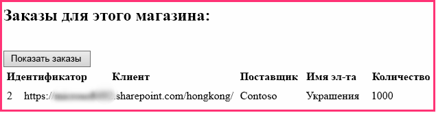

# <a name="give-your-provider-hosted-add-in-the-sharepoint-look-and-feel"></a><span data-ttu-id="27353-103">Настройка внешнего вида надстройки SharePoint с размещением у поставщика</span><span class="sxs-lookup"><span data-stu-id="27353-103">Give your provider-hosted add-in the SharePoint look-and-feel</span></span>

<span data-ttu-id="27353-104">Это вторая часть серии статей, посвященной основам разработки надстроек SharePoint, размещаемых у поставщика. Для начала следует ознакомиться со статьей [Надстройки SharePoint](sharepoint-add-ins.md) и обзорной статьей из этой серии.</span><span class="sxs-lookup"><span data-stu-id="27353-104">This is the second in a series of articles about the basics of developing provider-hosted SharePoint Add-ins. You should first be familiar with the topic [SharePoint Add-ins](sharepoint-add-ins.md) and the previous article in this series:</span></span>

-  [<span data-ttu-id="27353-105">Знакомство с созданием надстроек SharePoint с размещением у поставщика</span><span class="sxs-lookup"><span data-stu-id="27353-105">Get started creating provider-hosted SharePoint Add-ins</span></span>](get-started-creating-provider-hosted-sharepoint-add-ins.md)
    
<span data-ttu-id="27353-106">Работая с предыдущей статьей этой серии, вы научились настраивать среду разработки и с помощью Visual Studio создали первую надстройку уровня Hello World, которая предоставляет данные SharePoint в удаленном веб-приложении.</span><span class="sxs-lookup"><span data-stu-id="27353-106">In the previous article of this series you learned how to set up a development environment and how to use Visual Studio to create a first "Hello World" level add-in that exposes SharePoint data in the add-in's remote web application.</span></span> 

<span data-ttu-id="27353-107">В этой статье мы начнем работу с уже созданного решения надстройки SharePoint.</span><span class="sxs-lookup"><span data-stu-id="27353-107">In this article, we start with a SharePoint Add-in solution that has already been created.</span></span> <span data-ttu-id="27353-108">Оно включает в себя приложение веб-форм ASP.NET и базу данных SQL Azure.</span><span class="sxs-lookup"><span data-stu-id="27353-108">It includes an ASP.NET Web Forms application and a SQL Azure database.</span></span> <span data-ttu-id="27353-109">Мы создали их за вас, так как цель этой серии статей — сосредоточиться только на надстройках SharePoint. В каждой статье этой серии вы будете добавлять новые функции SharePoint и средства интеграции в надстройку.</span><span class="sxs-lookup"><span data-stu-id="27353-109">We've created these for you because this series of articles is intended to focus only on SharePoint Add-ins. You'll be adding more SharePoint functionality and integration to the add-in with each article in this series.</span></span>

## <a name="get-to-know-the-base-add-in"></a><span data-ttu-id="27353-110">Знакомство с базовой надстройкой</span><span class="sxs-lookup"><span data-stu-id="27353-110">Get to know the base add-in</span></span>

<span data-ttu-id="27353-111">В этой серии статей мы не будем учить вас программированию на ASP.NET или T-SQL, но вам потребуются минимальные знания об удаленных компонентах надстроек, чтобы мы могли начать интегрировать их в SharePoint.</span><span class="sxs-lookup"><span data-stu-id="27353-111">We are not going to teach you ASP.NET or T-SQL programming in this series, but you need to know a little about the remote components of the add-in before we can start integrating it into SharePoint.</span></span> <span data-ttu-id="27353-112">Сценарий использования надстройки подразумевает сеть розничных магазинов, при этом у каждого магазина есть веб-сайт группы в подписке на SharePoint Online родительской компании.</span><span class="sxs-lookup"><span data-stu-id="27353-112">The scenario of the add-in envisions a chain of retail stores, and each store has a team website in the parent company's SharePoint Online subscription.</span></span> <span data-ttu-id="27353-113">Когда магазин устанавливает надстройку на своем сайте группы, надстройка позволяет интегрировать данные и интерфейс SharePoint с данными в базе данных родительской компании.</span><span class="sxs-lookup"><span data-stu-id="27353-113">When a store installs the add-in on its team site, the add-in enables them to integrate their SharePoint data and experience with data in the parent company's database.</span></span> <span data-ttu-id="27353-114">У каждого экземпляра надстройки есть собственная область клиентов в корпоративной базе данных, и пользователи могут взаимодействовать только с теми корпоративными данными, которые сопоставлены с их магазином.</span><span class="sxs-lookup"><span data-stu-id="27353-114">Each instance of the add-in has its own tenancy in the corporate database, and users can only interact with corporate data that is associated with their store.</span></span>

### <a name="create-team-sites-for-two-stores-in-the-chain"></a><span data-ttu-id="27353-115">Создание сайтов групп для двух магазинов сети</span><span class="sxs-lookup"><span data-stu-id="27353-115">Create team sites for two stores in the chain</span></span>

1. <span data-ttu-id="27353-116">Откройте домашнюю страницу вашего сайта SharePoint Online, а затем щелкните ссылку **Содержимое сайта** на панели быстрого запуска.</span><span class="sxs-lookup"><span data-stu-id="27353-116">Open the home page of your SharePoint Online site, and then select the **Site Contents** link on the quick launch.</span></span> <span data-ttu-id="27353-117">Прокрутите страницу **Содержимое сайта** вниз до ссылки **Создать дочерний сайт** и перейдите по этой ссылке.</span><span class="sxs-lookup"><span data-stu-id="27353-117">On the **Site Contents** page, scroll down until you see the **new subsite** link, and then select it.</span></span>
 
2. <span data-ttu-id="27353-118">На странице **Создание сайта SharePoint** заполните форму для нового сайта группы, используя указанные ниже значения (которые также показаны на снимке экрана ниже).</span><span class="sxs-lookup"><span data-stu-id="27353-118">On the **New SharePoint Site** page, fill out the form for a new team site by entering these values (also shown in the following screen shot):</span></span>

   - <span data-ttu-id="27353-119">**Название**: Fabrikam Hong Kong Store</span><span class="sxs-lookup"><span data-stu-id="27353-119">**Title**: Fabrikam Hong Kong Store</span></span>
   - <span data-ttu-id="27353-120">**URL-адрес**: hongkong</span><span class="sxs-lookup"><span data-stu-id="27353-120">**URL**: hongkong</span></span>
    
   <span data-ttu-id="27353-121">*Рис. 1. Форма создания дочернего сайта SharePoint*</span><span class="sxs-lookup"><span data-stu-id="27353-121">*Figure 1. Form for creating a new SharePoint subsite*</span></span>

   

3. <span data-ttu-id="27353-123">Для всех остальных параметров оставьте значения, используемые по умолчанию, и нажмите кнопку **Создать**.</span><span class="sxs-lookup"><span data-stu-id="27353-123">Leave all other settings at their defaults, and then select **Create**.</span></span>

### <a name="explore-the-add-in"></a><span data-ttu-id="27353-124">Обзор надстройки</span><span class="sxs-lookup"><span data-stu-id="27353-124">Explore the add-in</span></span>

1. <span data-ttu-id="27353-125">Перейдите в репозиторий [SharePoint_Provider-hosted_Add-Ins_Tutorials](https://github.com/OfficeDev/SharePoint_Provider-hosted_Add-ins_Tutorials) и нажмите кнопку **Download ZIP** (Скачать ZIP-файл), чтобы сохранить файл на компьютере.</span><span class="sxs-lookup"><span data-stu-id="27353-125">Go to [SharePoint_Provider-hosted_Add-Ins_Tutorials](https://github.com/OfficeDev/SharePoint_Provider-hosted_Add-ins_Tutorials) and select the **Download ZIP** button to download the repository to your desktop.</span></span> <span data-ttu-id="27353-126">Распакуйте файл.</span><span class="sxs-lookup"><span data-stu-id="27353-126">Unzip the file.</span></span>
 
2. <span data-ttu-id="27353-127">Запустите Visual Studio *от имени администратора*, а затем откройте решение BeforeSharePointUI.sln.</span><span class="sxs-lookup"><span data-stu-id="27353-127">Launch Visual Studio *as an administrator*, and then open BeforeSharePointUI.sln.</span></span> <span data-ttu-id="27353-128">Решение включает три указанных ниже проекта.</span><span class="sxs-lookup"><span data-stu-id="27353-128">There are three projects in the solution:</span></span>
    
   - <span data-ttu-id="27353-129">**ChainStore** — проект надстройки SharePoint.</span><span class="sxs-lookup"><span data-stu-id="27353-129">**ChainStore**: the SharePoint Add-in project</span></span>
   - <span data-ttu-id="27353-130">**ChainStoreWeb** — удаленное веб-приложение.</span><span class="sxs-lookup"><span data-stu-id="27353-130">**ChainStoreWeb**: the remote web application</span></span>
   - <span data-ttu-id="27353-131">**ChainCorporateDB** — база данных SQL Azure.</span><span class="sxs-lookup"><span data-stu-id="27353-131">**ChainCorporateDB**: the SQL Azure database</span></span>

3. <span data-ttu-id="27353-132">Выберите проект **ChainStore** и в окне **Свойства** укажите для свойства **URL-адрес сайта** полный URL-адрес сайта группы в Гонконге: `https://{YOUR_SHAREPOINT_DOMAIN}/hongkong/` (не забудьте добавить символ / в конце адреса).</span><span class="sxs-lookup"><span data-stu-id="27353-132">Select the **ChainStore** project and, in the **Properties** window, set the **Site URL** property to the full URL of the Hong Kong team site: `https://{YOUR_SHAREPOINT_DOMAIN}/hongkong/` (be sure to include the "/" character at the end).</span></span> <span data-ttu-id="27353-133">Нажмите кнопку **Сохранить**.</span><span class="sxs-lookup"><span data-stu-id="27353-133">Select **Save**.</span></span> <span data-ttu-id="27353-134">*В определенный момент этого процесса вам будет предложено войти в учетную запись подписки на SharePoint Online.*</span><span class="sxs-lookup"><span data-stu-id="27353-134">*At some point in this process, you will be prompted to sign in to your SharePoint Online subscription.*</span></span> 
    
4. <span data-ttu-id="27353-135">В верхней части **обозревателя решений** щелкните узел решения правой кнопкой мыши и выберите пункт **Назначить запускаемые проекты**.</span><span class="sxs-lookup"><span data-stu-id="27353-135">Right-click the solution node at the top of **Solution Explorer**, and then select **Set startup projects**.</span></span>
 
5. <span data-ttu-id="27353-136">Убедитесь, что в столбце **Действие** для всех трех проектов указано значение **Запуск**.</span><span class="sxs-lookup"><span data-stu-id="27353-136">Ensure that all three projects are set to **Start** in the **Action** column.</span></span>
    
6. <span data-ttu-id="27353-137">Нажмите клавишу F5, чтобы развернуть и запустить надстройку.</span><span class="sxs-lookup"><span data-stu-id="27353-137">Use the F5 key to deploy and run your add-in.</span></span> <span data-ttu-id="27353-138">Редактор Visual Studio размещает удаленное веб-приложение в IIS Express, а базу данных SQL — в SQL Express.</span><span class="sxs-lookup"><span data-stu-id="27353-138">Visual Studio hosts the remote web application in IIS Express and hosts the SQL database in SQL Express.</span></span> <span data-ttu-id="27353-139">Кроме того, он выполняет временную установку надстройки на вашем тестовом сайте SharePoint и сразу же запускает ее.</span><span class="sxs-lookup"><span data-stu-id="27353-139">It also makes a temporary installation of the add-in on your test SharePoint site and immediately runs the add-in.</span></span> <span data-ttu-id="27353-140">Прежде чем откроется начальная страница надстройки, вам будет предложено предоставить надстройке необходимые разрешения.</span><span class="sxs-lookup"><span data-stu-id="27353-140">You are prompted to grant permissions to the add-in before its start page opens.</span></span>
    
7. <span data-ttu-id="27353-141">Начальная страница надстройки выглядит так, как показано на рис. 2.</span><span class="sxs-lookup"><span data-stu-id="27353-141">The add-in's start page looks like the one in Figure 2.</span></span> <span data-ttu-id="27353-142">В самом верху расположено имя веб-сайта SharePoint, на котором установлена надстройка.</span><span class="sxs-lookup"><span data-stu-id="27353-142">At the very top is the name of the SharePoint website where the add-in is installed.</span></span> <span data-ttu-id="27353-143">Это побочный эффект примера кода, который создается набором "Инструменты разработчика Office для Visual Studio".</span><span class="sxs-lookup"><span data-stu-id="27353-143">This is a side effect of some sample code that the Office Developer Tools for Visual Studio generates.</span></span> <span data-ttu-id="27353-144">Вы исправите это на одном из следующих этапов.</span><span class="sxs-lookup"><span data-stu-id="27353-144">You'll change this in a later step.</span></span> <span data-ttu-id="27353-145">На странице есть области, в которых можно просмотреть данные из таблиц **Orders** (Заказы), **Inventory** (Запасы) и **Employees** (Сотрудники) корпоративной базы данных SQL.</span><span class="sxs-lookup"><span data-stu-id="27353-145">The page has areas where data from the corporate **Orders**, **Inventory**, and **Employees** SQL database tables can be seen.</span></span> <span data-ttu-id="27353-146">Изначально эти таблицы пусты.</span><span class="sxs-lookup"><span data-stu-id="27353-146">These tables are empty initially.</span></span>
  
   <span data-ttu-id="27353-147">*Рис. 2. Начальная страница надстройки сетевого магазина*</span><span class="sxs-lookup"><span data-stu-id="27353-147">*Figure 2. Start page of the chain store add-in*</span></span>

   

8. <span data-ttu-id="27353-149">Перейдите по ссылке **Order Form** (Форма заказа) в нижней части страницы. Откроется форма заказа.</span><span class="sxs-lookup"><span data-stu-id="27353-149">Select the **Order Form** link at the bottom of the page to open an order form.</span></span> <span data-ttu-id="27353-150">Введите необходимые значения в форму и нажмите кнопку **Place Order** (Заказать).</span><span class="sxs-lookup"><span data-stu-id="27353-150">Enter some values in the form, and then select **Place Order**.</span></span> <span data-ttu-id="27353-151">На рис. 3 показан снимок экрана с примером.</span><span class="sxs-lookup"><span data-stu-id="27353-151">The screenshot in Figure 3 shows an example.</span></span> <span data-ttu-id="27353-152">На экране ничего не изменится, но код кнопки передаст значения в параметризованную хранимую процедуру в базе данных SQL.</span><span class="sxs-lookup"><span data-stu-id="27353-152">It won't appear that anything has happened, but the code behind the button passes the values to a parameterized stored procedure in the SQL database.</span></span> <span data-ttu-id="27353-153">Использование параметризованной хранимой процедуры позволяет защитить базу данных от атак путем внедрения кода SQL.</span><span class="sxs-lookup"><span data-stu-id="27353-153">Using parameterized stored procedures protects the database from SQL injection attacks.</span></span>

   <span data-ttu-id="27353-154">*Рис. 3. Форма заказа*</span><span class="sxs-lookup"><span data-stu-id="27353-154">*Figure 3. Order form*</span></span>

   

9. <span data-ttu-id="27353-156">Нажмите кнопку "Назад" в браузере, чтобы вернуться на начальную страницу, а затем нажмите кнопку **Show Orders** (Показать заказы).</span><span class="sxs-lookup"><span data-stu-id="27353-156">Use the browser's back button to go back to the start page, and then select the **Show Orders** button.</span></span> <span data-ttu-id="27353-157">Начальная страница обновится, и ваш заказ отобразится на странице, которая будет выглядеть примерно так, как показано на снимке экрана на рис. 4.</span><span class="sxs-lookup"><span data-stu-id="27353-157">The start page refreshes and your order appears on the page similar to the screenshot in Figure 4.</span></span>

   <span data-ttu-id="27353-158">*Рис. 4. Начальная страница после нажатия кнопки Show Orders (Показать заказы)*</span><span class="sxs-lookup"><span data-stu-id="27353-158">*Figure 4. Start page after selecting Show Orders*</span></span>

   
    
   <span data-ttu-id="27353-161">В таблице есть поле **Tenant** (Клиент), в котором в качестве значения указан URL-адрес вашего тестового веб-сайта SharePoint.</span><span class="sxs-lookup"><span data-stu-id="27353-161">The table has a **Tenant** field with the URL of your test SharePoint website as the value.</span></span> <span data-ttu-id="27353-162">Оно не имеет отношения к подписке на SharePoint Online, которую иногда называют областью клиентов.</span><span class="sxs-lookup"><span data-stu-id="27353-162">This does not refer to the SharePoint Online subscription that is sometimes called a tenancy.</span></span> <span data-ttu-id="27353-163">Вместо этого каждый экземпляр надстройки представляет собой отдельный клиент в корпоративной базе данных.</span><span class="sxs-lookup"><span data-stu-id="27353-163">Instead, each instance of the add-in is a distinct tenant in the corporate database.</span></span> <span data-ttu-id="27353-164">Так как на хост-сайте SharePoint можно установить не более одного экземпляра надстройки, URL-адрес хост-сайта можно использовать в качестве дискриминатора клиента в базе данных.</span><span class="sxs-lookup"><span data-stu-id="27353-164">Because no more than one instance of an add-in can be installed on a specific SharePoint host web, the URL of the host web can be used as a tenant discriminator in the database.</span></span> <span data-ttu-id="27353-165">(Сведения о различиях между хост-сайтом и сайтом надстройки см. в статье [Надстройки SharePoint](sharepoint-add-ins.md).)</span><span class="sxs-lookup"><span data-stu-id="27353-165">(For a refresher on the distinction between host web and add-in web, see [SharePoint Add-ins](sharepoint-add-ins.md).)</span></span> 
   
   <span data-ttu-id="27353-166">Все хранимые процедуры в надстройке включают значение дискриминатора, когда выполняют операции чтения или записи в базе данных.</span><span class="sxs-lookup"><span data-stu-id="27353-166">All the stored procedures in the add-in include the discriminator value when they write or read from the database.</span></span> <span data-ttu-id="27353-167">В результате этого, когда пользователь нажмет кнопку **Show Orders** (Показать заказы), **Show Inventory** (Показать запасы) либо **Show Employees** (Показать сотрудников), из базы данных будут получены только те данные, которые сопоставлены с магазином пользователя.</span><span class="sxs-lookup"><span data-stu-id="27353-167">This ensures that when a user selects **Show Orders** (or **Show Inventory** or **Show Employees**), only the data that is associated with the user's store is retrieved from the database.</span></span> <span data-ttu-id="27353-168">Кроме того, благодаря этому пользователи смогут создавать заказы и добавлять сотрудников только для своего магазина.</span><span class="sxs-lookup"><span data-stu-id="27353-168">This design also ensures that users can only place orders and add employees for their own store.</span></span>
    
   <span data-ttu-id="27353-169">Удаленное веб-приложение получает URL-адрес хост-сайта из параметра строки запроса, который SharePoint добавляет в URL-адрес начальной страницы при запуске надстройки.</span><span class="sxs-lookup"><span data-stu-id="27353-169">The remote web application obtains the host web URL from a query string parameter that SharePoint adds to the URL of the start page when it launches the add-in.</span></span> <span data-ttu-id="27353-170">Так как используется протокол SSL, эта строка запроса шифруется для передачи в удаленное веб-приложение через Интернет.</span><span class="sxs-lookup"><span data-stu-id="27353-170">Because SSL is being used, this query string is encrypted as it goes across the Internet to the remote web application.</span></span> 

10. <span data-ttu-id="27353-171">Чтобы завершить сеанс отладки, закройте окно браузера или остановите отладку в Visual Studio.</span><span class="sxs-lookup"><span data-stu-id="27353-171">To end the debugging session, close the browser window or stop debugging in Visual Studio.</span></span> <span data-ttu-id="27353-172">При каждом нажатии клавиши F5 Visual Studio отзывает предыдущую версию надстройки и устанавливает ее последнюю версию.</span><span class="sxs-lookup"><span data-stu-id="27353-172">Each time you select F5, Visual Studio retracts the previous version of the add-in and installs the latest one.</span></span>   
 
11. <span data-ttu-id="27353-173">По умолчанию надстройка остается установленной на хост-сайте SharePoint между сеансами отладки в Visual Studio.</span><span class="sxs-lookup"><span data-stu-id="27353-173">By default, the add-in remains installed on the SharePoint host web in between debugging sessions in Visual Studio.</span></span> <span data-ttu-id="27353-174">Чтобы посмотреть, как пользователи будут запускать надстройку после ее установки, откройте веб-сайт SharePoint Fabrikam Hong Kong в браузере и перейдите на страницу **Содержимое сайта**.</span><span class="sxs-lookup"><span data-stu-id="27353-174">To see how end users would launch it after it is installed, open the Fabrikam Hong Kong SharePoint website in your browser and go to the **Site Contents** page.</span></span> <span data-ttu-id="27353-175">Вы увидите плитку надстройки, такую же, как на снимке экрана ниже.</span><span class="sxs-lookup"><span data-stu-id="27353-175">You'll see the tile for the add-in as it is in the following screenshot.</span></span>

   <span data-ttu-id="27353-176">*Рис. 5. Плитка запуска для надстройки сетевого магазина*</span><span class="sxs-lookup"><span data-stu-id="27353-176">*Figure 5. Launch tile for the Chain Store add-in*</span></span>

   
 
   > [!NOTE]
   > <span data-ttu-id="27353-178">Если вы щелкнете плитку, начальная страница не откроется, так как когда вы останавливаете отладку, Visual Studio закрывает сеанс IIS Express.</span><span class="sxs-lookup"><span data-stu-id="27353-178">If you select the tile, the start page does not open because Visual Studio closes the IIS Express session when you stop debugging.</span></span>

<span data-ttu-id="27353-179"><a name="Rebuild"> </a></span><span class="sxs-lookup"><span data-stu-id="27353-179"><a name="Rebuild"> </a></span></span>
## <a name="configure-visual-studio-to-rebuild-the-corporate-database-with-each-debugging-session"></a><span data-ttu-id="27353-180">Настройка Visual Studio для перестройки корпоративной базы данных при каждом сеансе отладки</span><span class="sxs-lookup"><span data-stu-id="27353-180">Configure Visual Studio to rebuild the corporate database with each debugging session</span></span>

<span data-ttu-id="27353-181">По умолчанию Visual Studio *не* перестраивает базу данных SQL Express.</span><span class="sxs-lookup"><span data-stu-id="27353-181">By default, Visual Studio will *not*  rebuild the SQL Express database.</span></span> <span data-ttu-id="27353-182">Таким образом, заказы и другие элементы, которые вы добавляете в базу данных в сеансе отладки, остаются в базе данных и при последующих сеансах отладки.</span><span class="sxs-lookup"><span data-stu-id="27353-182">Therefore, orders and other items that you add to the database in one debugging session are still in the database in later sessions.</span></span> <span data-ttu-id="27353-183">Намного проще начинать работу с пустой базой данных при каждом нажатии клавиши F5, поэтому выполните указанные ниже действия.</span><span class="sxs-lookup"><span data-stu-id="27353-183">It is easier to start with an empty database each time you select F5, so take these steps:</span></span>

1. <span data-ttu-id="27353-184">Щелкните правой кнопкой мыши проект **ChainCorporateDB** и выберите пункт **Свойства**.</span><span class="sxs-lookup"><span data-stu-id="27353-184">Right-click the **ChainCorporateDB** project, and select **Properties**.</span></span>

2. <span data-ttu-id="27353-185">Откройте вкладку **Отладка** и включите параметр **Всегда повторно создавать базу данных**.</span><span class="sxs-lookup"><span data-stu-id="27353-185">Open the **Debug** tab and enable the **Always re-create database** option.</span></span>  


## <a name="give-the-remote-web-application-the-look-and-feel-of-sharepoint"></a><span data-ttu-id="27353-186">Придание удаленному веб-приложению внешнего вида и удобства использования SharePoint</span><span class="sxs-lookup"><span data-stu-id="27353-186">Give the remote web application the look and feel of SharePoint</span></span>

<span data-ttu-id="27353-187">Иногда необходимо, чтобы удаленные страницы имели собственную фирменную символику, но в большинстве случаев они должны имитировать пользовательский интерфейс SharePoint, чтобы пользователи полагали, что они по-прежнему работают с SharePoint.</span><span class="sxs-lookup"><span data-stu-id="27353-187">In some scenarios, you want your remote pages to have their own branding, but in most cases they should mimic the UI of SharePoint so that users feel they are still inside SharePoint.</span></span>

### <a name="add-sharepoint-chrome-and-top-bar-to-the-start-page"></a><span data-ttu-id="27353-188">Добавление хрома и верхней панели SharePoint на начальную страницу</span><span class="sxs-lookup"><span data-stu-id="27353-188">Add SharePoint chrome and top bar to the start page</span></span>

1. <span data-ttu-id="27353-189">В **обозревателе решений** выберите пункты **ChainStoreWeb** > **Страницы** и откройте файл CorporateDataViewer.aspx (представляет собой начальную страницу надстройки).</span><span class="sxs-lookup"><span data-stu-id="27353-189">In **Solution Explorer**, go to **ChainStoreWeb** > **Pages**, and open the CorporateDataViewer.aspx file (the add-in's start page).</span></span>

2. <span data-ttu-id="27353-190">В разделе **head** есть скрипт, загружающий ряд библиотек JavaScript.</span><span class="sxs-lookup"><span data-stu-id="27353-190">In the **head** section, you'll see a script that loads some JavaScript libraries.</span></span> <span data-ttu-id="27353-191">Добавьте под ним указанный ниже скрипт.</span><span class="sxs-lookup"><span data-stu-id="27353-191">Add the following additional script under it.</span></span> <span data-ttu-id="27353-192">Этот скрипт загружает файл SP.UI.Controls.js, который есть на каждом веб-сайте SharePoint в папке /\_layouts/15/.</span><span class="sxs-lookup"><span data-stu-id="27353-192">This script loads the SP.UI.Controls.js file, which is in every SharePoint website at the /\_layouts/15/ folder.</span></span> <span data-ttu-id="27353-193">Помимо прочего, этот файл загружает библиотеку CSS SharePoint.</span><span class="sxs-lookup"><span data-stu-id="27353-193">Among other things, this file loads the SharePoint CSS library.</span></span>
    
    ```
      <script type="text/javascript">
        var hostweburl;

        // Load the SharePoint resources.
        $(document).ready(function () {

            // Get the URI decoded add-in web URL.
            hostweburl =
                decodeURIComponent(
                    getQueryStringParameter("SPHostUrl")
            );

            // The SharePoint js files URL are in the form:
            // web_url/_layouts/15/resource.js
            var scriptbase = hostweburl + "/_layouts/15/";

            // Load the js file and continue to the 
            // success handler.
            $.getScript(scriptbase + "SP.UI.Controls.js")
        });

        // Function to retrieve a query string value.
        function getQueryStringParameter(paramToRetrieve) {
            var params =
                document.URL.split("?")[1].split("&amp;");
            var strParams = "";
            for (var i = 0; i < params.length; i = i + 1) {
                var singleParam = params[i].split("=");
                if (singleParam[0] == paramToRetrieve)
                    return singleParam[1];
            }
        }
    </script>
    ```

3. В верхней части текста страницы добавьте указанную ниже часть кода. Она добавляет верхнюю панель SharePoint, называемую элементом управления хрома, на страницу. <span data-ttu-id="27353-196">Эта часть кода станет более понятной, когда мы протестируем измененную надстройку далее в этой статье. Некоторые имена свойств содержат подстроку "app", так как ранее надстройки назывались приложениями (apps).</span><span class="sxs-lookup"><span data-stu-id="27353-196">The details of this markup will become clearer when we test the revised add-in later in this article (the string "app" appears in some of the property names because add-ins used to be called "apps").</span></span>
    
    ```
      <!-- Chrome control placeholder. Options are declared inline.  -->
    <div 
        id="chrome_ctrl_container"
        data-ms-control="SP.UI.Controls.Navigation"  
        data-ms-options=
            '{  
                "appHelpPageUrl" : "Help.aspx",
                "appIconUrl" : "/Images/AppIcon.png",
                "appTitle" : "Chain Store",
                "settingsLinks" : [
                    {
                        "linkUrl" : "Account.aspx",
                        "displayName" : "Account settings"
                    },
                    {
                        "linkUrl" : "Contact.aspx",
                        "displayName" : "Contact us"
                    }
                ]
             }'>
    </div>
    ```

4. <span data-ttu-id="27353-197">Для заголовков **H1** и гиперссылки в тексте страницы автоматически используются стили, определенные в библиотеке CSS SharePoint, поэтому не нужно изменять их.</span><span class="sxs-lookup"><span data-stu-id="27353-197">The **H1** headers and the hyperlink in the body of the page automatically use styles defined in SharePoint's CSS library, so they don't need to be changed.</span></span> <span data-ttu-id="27353-198">Чтобы проиллюстрировать, как можно использовать стили SharePoint, задайте для заголовков столбцов в трех элементах управления **GridView** стиль SharePoint "все прописные", добавив атрибут **HeaderStyle-CssClass** к каждому элементу управления и задав для него значение `ms-uppercase`.</span><span class="sxs-lookup"><span data-stu-id="27353-198">To illustrate how you can use the SharePoint styles, set the column headings in the three **GridView** controls to SharePoint's "all caps" style by adding the **HeaderStyle-CssClass** attribute to each of the controls and setting its value to `ms-uppercase`.</span></span> <span data-ttu-id="27353-199">Ниже приведен пример.</span><span class="sxs-lookup"><span data-stu-id="27353-199">The following is an example.</span></span> <span data-ttu-id="27353-200">Измените все три элемента управления **GridView** таким же образом.</span><span class="sxs-lookup"><span data-stu-id="27353-200">Make the same change to all three **GridView** controls.</span></span>
    
    ```XML
      <asp:GridView ID="ordersGridView" runat="server" CellPadding="5" GridLines="None" 
    HeaderStyle-CssClass="ms-uppercase" />
    ```

5. <span data-ttu-id="27353-201">Элемент управления хрома использует значок надстройки, поэтому нам необходима еще одна копия файла значка на удаленном веб-сервере.</span><span class="sxs-lookup"><span data-stu-id="27353-201">The chrome control uses the add-in's icon, so we need a second copy of the icon file on the remote web server.</span></span> <span data-ttu-id="27353-202">В **обозревателе решений** щелкните правой кнопкой мыши файл AppIcon.png в проекте **ChainStore** и выберите пункт **Копировать**.</span><span class="sxs-lookup"><span data-stu-id="27353-202">In **Solution Explorer**, right-click the AppIcon.png file in the **ChainStore** project, and select **Copy**.</span></span> 
    
6. <span data-ttu-id="27353-203">Щелкните правой кнопкой мыши папку **Images** (Изображения) в проекте **ChainStoreWeb** и выберите пункт **Вставить**.</span><span class="sxs-lookup"><span data-stu-id="27353-203">Right-click the **Images** folder in the **ChainStoreWeb** project, and select **Paste**.</span></span>
 
7. <span data-ttu-id="27353-204">Откройте файл CorporateDataViewer.aspx.cs.</span><span class="sxs-lookup"><span data-stu-id="27353-204">Open the CorporateDataViewer.aspx.cs file.</span></span> 
 
8. <span data-ttu-id="27353-205">Класс `CorporateDataViewer` объявляет частный член типа **SharePointContext**.</span><span class="sxs-lookup"><span data-stu-id="27353-205">The `CorporateDataViewer` class declares a private member of type **SharePointContext**.</span></span> <span data-ttu-id="27353-206">Этот класс определен в файле SharePointContext.cs, созданном набором "Инструменты разработчика Office для Visual Studio" при создании проекта.</span><span class="sxs-lookup"><span data-stu-id="27353-206">This class is defined in the SharePointContext.cs file that the Office Developer Tools for Visual Studio generated when the project was created.</span></span> <span data-ttu-id="27353-207">Вы можете считать его классом **HttpContextBase** в ASP.NET, но с добавленными контекстными сведениями SharePoint, например с URL-адресом хост-сайта.</span><span class="sxs-lookup"><span data-stu-id="27353-207">You can think of it as something like the **HttpContextBase** class of ASP.NET, but with SharePoint contextual information such as the host web's URL added to it.</span></span>
    
   <span data-ttu-id="27353-208">В методе **Page_Load** оператор **using** записывает имя хост-сайта SharePoint на удаленную начальную страницу.</span><span class="sxs-lookup"><span data-stu-id="27353-208">In the **Page_Load** method, a **using** statement writes the name of the SharePoint host web to the remote start page.</span></span> <span data-ttu-id="27353-209">Это пример кода, поэтому удалите весь оператор **using** (но оставьте строку, в которой выполняется инициализация переменной `spContext`).</span><span class="sxs-lookup"><span data-stu-id="27353-209">This is sample code, so delete the entire **using** statement (but leave the line that initializes the `spContext` variable).</span></span> <span data-ttu-id="27353-210">Теперь метод должен выглядеть примерно так, как показано ниже.</span><span class="sxs-lookup"><span data-stu-id="27353-210">The method should now look like the following.</span></span>

    ```C#
      protected void Page_Load(object sender, EventArgs e)
    {
        spContext = SharePointContextProvider.Current.GetSharePointContext(Context);
    }
    ```

9. <span data-ttu-id="27353-211">Существует четыре других файла ASP.NET, для которых требуется пользовательский интерфейс SharePoint:</span><span class="sxs-lookup"><span data-stu-id="27353-211">There are four other ASP.NET files that need the SharePoint UI:</span></span> 
    
   - <span data-ttu-id="27353-212">Account.aspx</span><span class="sxs-lookup"><span data-stu-id="27353-212">Account.aspx</span></span>
   - <span data-ttu-id="27353-213">Contact.aspx</span><span class="sxs-lookup"><span data-stu-id="27353-213">Contact.aspx</span></span>
   - <span data-ttu-id="27353-214">Help.aspx</span><span class="sxs-lookup"><span data-stu-id="27353-214">Help.aspx</span></span>
   - <span data-ttu-id="27353-215">OrderForm.aspx</span><span class="sxs-lookup"><span data-stu-id="27353-215">OrderForm.aspx</span></span>

   > [!NOTE]
   > <span data-ttu-id="27353-p124">Последний ASPX-файл в проекте (EmployeeAdder.aspx) фактически никогда не отрисовывается, поэтому не изменяйте его пользовательский интерфейс. Вы изучите этот файл более подробно в одной из следующих статей этой серии.</span><span class="sxs-lookup"><span data-stu-id="27353-p124">The last aspx file in the project, EmployeeAdder.aspx, is never actually rendered, so you don't change its UI. You'll learn more about it in a later article of this series.</span></span> 

   <span data-ttu-id="27353-218">Мы не хотим, чтобы на этих страницах был элемент управления хрома.</span><span class="sxs-lookup"><span data-stu-id="27353-218">We don't want the chrome control on these pages.</span></span> <span data-ttu-id="27353-219">Нам всего лишь необходимо получить доступ к библиотеке CSS SharePoint.</span><span class="sxs-lookup"><span data-stu-id="27353-219">We just want access to the SharePoint CSS library.</span></span> <span data-ttu-id="27353-220">В каждом из этих четырех файлов добавьте указанную ниже часть кода в элемент **head**.</span><span class="sxs-lookup"><span data-stu-id="27353-220">For each of these four files, add the following markup to the **head** element.</span></span>

    ```XML
      <link type="text/css" rel="stylesheet" 
    href="<%= spContext.SPHostUrl.ToString() + "_layouts/15/defaultcss.ashx" %>" />
    ```

10. <span data-ttu-id="27353-221">Это и следующее действие уже выполнены для страницы Order Form (Форма заказа) и страницы Account (Учетная запись), поэтому они применяются только к страницам Contact (Контакт) и Help (Справка).</span><span class="sxs-lookup"><span data-stu-id="27353-221">This step and the next one have already been done for the Order Form page and the Account page, so they apply only to the Contact page and Help page.</span></span> <span data-ttu-id="27353-222">Чтобы добавить объект `spContext` на каждую страницу, откройте код \*.aspx.cs в файлах для этих трех ASPX-страниц.</span><span class="sxs-lookup"><span data-stu-id="27353-222">To get the `spContext` object onto each of the pages, open the \*.aspx.cs code behind files for the three aspx pages.</span></span> <span data-ttu-id="27353-223">В каждом файле добавьте указанный ниже член в класс **Page**.</span><span class="sxs-lookup"><span data-stu-id="27353-223">In each of them, add the following member to the **Page** class.</span></span>
    
    ```C#
      protected SharePointContext spContext;
    ```

11. <span data-ttu-id="27353-p127">Замените метод **Page_Load** указанной ниже версией. Объект извлекается из кэша сеанса. Он был помещен в кэш, когда был создан методом **Page_Load** начальной страницы надстройки.</span><span class="sxs-lookup"><span data-stu-id="27353-p127">Replace the **Page_Load** method with the following version. The object is being retrieved from the Session cache. It was cached there when it was first created by the **Page_Load** method of the add-in's start page.</span></span>
    
    ```C#
      protected void Page_Load(object sender, EventArgs e)
    {
        spContext = Session["SPContext"] as SharePointContext;
    }
    ```

12. <span data-ttu-id="27353-227">Откройте страницу OrderForm.aspx.</span><span class="sxs-lookup"><span data-stu-id="27353-227">Open the OrderForm.aspx page.</span></span> <span data-ttu-id="27353-228">В правом верхнем элементе **Label** (Надпись) замените элемент `<b>` в фразе **Place Order** (Заказать) тегами span, ссылающимися на класс CSS `ms-accentText`.</span><span class="sxs-lookup"><span data-stu-id="27353-228">In the top **Label** element, replace the `<b>` element on the phrase **Place Order** with span tags that reference the `ms-accentText` CSS class.</span></span> <span data-ttu-id="27353-229">Когда вы закончите вносить изменения, весь элемент управления **Label** (Надпись) должен выглядеть, как показано ниже.</span><span class="sxs-lookup"><span data-stu-id="27353-229">The entire **Label** control should look like this when you are finished.</span></span>
    
    ```XML
      <asp:Label ID="lblOrderPrompt" runat="server"
             Text="Enter a supplier, product, and quantity; and then press <span class='ms-accentText'>Place Order</span>.">
    </asp:Label>
    ```

## <a name="run-the-add-in-and-test-the-new-sharepoint-ui"></a><span data-ttu-id="27353-230">Запуск надстройки и тестирование нового пользовательского интерфейса SharePoint</span><span class="sxs-lookup"><span data-stu-id="27353-230">Run the add-in and test the new SharePoint UI</span></span>

1. <span data-ttu-id="27353-231">Нажмите клавишу F5, чтобы развернуть и запустить надстройку.</span><span class="sxs-lookup"><span data-stu-id="27353-231">Use the F5 key to deploy and run your add-in.</span></span> <span data-ttu-id="27353-232">Редактор Visual Studio размещает удаленное веб-приложение в IIS Express, а базу данных SQL — в SQL Express.</span><span class="sxs-lookup"><span data-stu-id="27353-232">Visual Studio hosts the remote web application in IIS Express and hosts the SQL database in SQL Express.</span></span> <span data-ttu-id="27353-233">Кроме того, он выполняет временную установку надстройки на вашем тестовом сайте SharePoint и сразу же запускает ее.</span><span class="sxs-lookup"><span data-stu-id="27353-233">It also makes a temporary installation of the add-in on your test SharePoint site and immediately runs the add-in.</span></span> <span data-ttu-id="27353-234">Прежде чем откроется начальная страница надстройки, вам будет предложено предоставить надстройке необходимые разрешения.</span><span class="sxs-lookup"><span data-stu-id="27353-234">You are prompted to grant permissions to the add-in before its start page opens.</span></span>
    
2. <span data-ttu-id="27353-235">Когда откроется начальная страница надстройки, она будет выглядеть как страница SharePoint.</span><span class="sxs-lookup"><span data-stu-id="27353-235">When the add-in's start page opens, it now looks like a SharePoint page.</span></span> <span data-ttu-id="27353-236">Перейдите по ссылке **Order Form** (Форма заказа).</span><span class="sxs-lookup"><span data-stu-id="27353-236">Select the **Order Form** link.</span></span> <span data-ttu-id="27353-237">Теперь эта форма выглядит как форма SharePoint.</span><span class="sxs-lookup"><span data-stu-id="27353-237">It also now looks like a SharePoint form.</span></span>
  
   <span data-ttu-id="27353-238">*Рис. 6. Форма "Order Form" (Форма заказа) со шрифтами Segoe и выделенной фразой "Place Order" (Заказать)*</span><span class="sxs-lookup"><span data-stu-id="27353-238">*Figure 6. The Order Form with Segoe fonts and a highlighted Place Order*</span></span>

   
 
3. <span data-ttu-id="27353-241">Создайте заказ и нажмите кнопку **Place Order** (Заказать).</span><span class="sxs-lookup"><span data-stu-id="27353-241">Create an order, and then select **Place Order**.</span></span>
    
4. <span data-ttu-id="27353-242">Нажмите кнопку "Назад" в браузере, чтобы вернуться на начальную страницу надстройки, а затем нажмите кнопку **Show Orders** (Показать заказы).</span><span class="sxs-lookup"><span data-stu-id="27353-242">Use the browser's back button to go back to the add-in start page, and then select **Show Orders**.</span></span> <span data-ttu-id="27353-243">Теперь страница должна выглядеть приблизительно так, как показано ниже.</span><span class="sxs-lookup"><span data-stu-id="27353-243">The page should now look similar to the following.</span></span> <span data-ttu-id="27353-244">Обратите внимание на то, что заголовки столбцов теперь написаны заглавными буквами.</span><span class="sxs-lookup"><span data-stu-id="27353-244">Note that the column headings are now all caps.</span></span> 
  
   <span data-ttu-id="27353-245">*Рис. 7. Начальная страница с элементом управления хрома*</span><span class="sxs-lookup"><span data-stu-id="27353-245">*Figure 7. The start page with a chrome control*</span></span>

   

5. <span data-ttu-id="27353-248">Щелкните значок **?**, расположенный</span><span class="sxs-lookup"><span data-stu-id="27353-248">Select the **?**</span></span> <span data-ttu-id="27353-249">в конце элемента управления хрома.</span><span class="sxs-lookup"><span data-stu-id="27353-249">icon on the end of the chrome control.</span></span> <span data-ttu-id="27353-250">Откроется простая страница справки.</span><span class="sxs-lookup"><span data-stu-id="27353-250">A simple help page opens.</span></span> <span data-ttu-id="27353-251">Нажмите кнопку "Назад" в браузере.</span><span class="sxs-lookup"><span data-stu-id="27353-251">Select the browser's back button.</span></span>

6. <span data-ttu-id="27353-252">Щелкните значок с изображением шестеренки на элементе управления хрома.</span><span class="sxs-lookup"><span data-stu-id="27353-252">Select the gear icon on the chrome control.</span></span> <span data-ttu-id="27353-253">Откроется меню со ссылками на страницу "Account" (Учетная запись) и страницу "Contact" (Контакт).</span><span class="sxs-lookup"><span data-stu-id="27353-253">A menu opens with links for an Account page and a Contact page.</span></span> <span data-ttu-id="27353-254">Откройте страницу "Account" (Учетная запись) и с помощью кнопки "Назад" в браузере перейдите к начальной странице.</span><span class="sxs-lookup"><span data-stu-id="27353-254">Open the Account page, and use the browser's back button to get back to the start page.</span></span> <span data-ttu-id="27353-255">Выполните такие же действия для страницы "Contact" (Контакт).</span><span class="sxs-lookup"><span data-stu-id="27353-255">Do the same for the Contact page.</span></span>

7. <span data-ttu-id="27353-256">Нажмите кнопку **Back to Site** (Вернуться на сайт) на элементе управления хрома.</span><span class="sxs-lookup"><span data-stu-id="27353-256">Select the **Back to Site** button on the chrome control.</span></span> <span data-ttu-id="27353-257">Откроется домашняя страница хост-сайта (сайта группы магазина в Гонконге).</span><span class="sxs-lookup"><span data-stu-id="27353-257">The home page of the host web, the Hong Kong store team site, opens.</span></span>

8. <span data-ttu-id="27353-258">Щелкните значок с изображением шестеренки на верхней панели и выберите пункт **Изменить внешний вид**.</span><span class="sxs-lookup"><span data-stu-id="27353-258">Select the gear icon on the top bar, and then select **Change the look**.</span></span>

9. <span data-ttu-id="27353-259">Следуя инструкциям, измените внешний вид сайта с помощью одного из доступных вариантов оформления.</span><span class="sxs-lookup"><span data-stu-id="27353-259">Follow the prompts to change the site to one of the alternative "looks."</span></span>

10. <span data-ttu-id="27353-p137">Перейдите на страницу **Site Contents** (Содержание сайта) и запустите приложение Chain Store, щелкнув его плитку. Для ваших настраиваемых страниц будет использован выбранный вариант оформления. На снимках экрана ниже показано, как они выглядят при использовании оформления **Природа**.</span><span class="sxs-lookup"><span data-stu-id="27353-p137">Navigate to the **Site Contents** page and launch the Chain Store app from its tile. Your custom pages have taken on the chosen look. The following screenshots show how they appear in the **Nature** composed look.</span></span>

   <span data-ttu-id="27353-263">*Рис. 8. Начальная страница и форма заказа в оформлении "Природа"*</span><span class="sxs-lookup"><span data-stu-id="27353-263">*Figure 8. The start page and order form with the Nature composed look*</span></span> 

   

11. <span data-ttu-id="27353-265">Верните внешний вид сайта, используемый по умолчанию (он называется **Office**).</span><span class="sxs-lookup"><span data-stu-id="27353-265">Change the site's look back to the default, which is called **Office**.</span></span>

12. <span data-ttu-id="27353-266">Чтобы завершить сеанс отладки, закройте окно браузера или остановите отладку в Visual Studio.</span><span class="sxs-lookup"><span data-stu-id="27353-266">To end the debugging session, close the browser window or stop debugging in Visual Studio.</span></span> <span data-ttu-id="27353-267">При каждом нажатии клавиши F5 Visual Studio отзывает предыдущую версию надстройки и устанавливает ее последнюю версию.</span><span class="sxs-lookup"><span data-stu-id="27353-267">Each time you select F5, Visual Studio retracts the previous version of the add-in and installs the latest one.</span></span>

13. <span data-ttu-id="27353-268">Вы будете работать с этой надстройкой и решением Visual Studio при изучении других статей, поэтому при перерывах в работе рекомендуем отзывать надстройку.</span><span class="sxs-lookup"><span data-stu-id="27353-268">You will work with this add-in and Visual Studio solution in other articles, and it's a good practice to retract the add-in one last time when you are done working with it for a while.</span></span> <span data-ttu-id="27353-269">В **обозревателе решений** щелкните проект правой кнопкой мыши и выберите пункт **Отозвать**.</span><span class="sxs-lookup"><span data-stu-id="27353-269">Right-click the project in **Solution Explorer** and select **Retract**.</span></span>

## <a name="next-steps"></a><span data-ttu-id="27353-270">Дальнейшие действия</span><span class="sxs-lookup"><span data-stu-id="27353-270">Next steps</span></span>
<span data-ttu-id="27353-271"><a name="Nextsteps"> </a></span><span class="sxs-lookup"><span data-stu-id="27353-271"><a name="Nextsteps"> </a></span></span>

<span data-ttu-id="27353-p140">Теперь надстройка выглядит как SharePoint. Тем не менее она по-прежнему является веб-приложением, которое на самом деле не интегрировано с SharePoint, хотя и запускается с помощью плитки в SharePoint. Вы добавите настраиваемую команду, запускаемую с помощью настраиваемой кнопки на ленте в следующей статье: [Включение настраиваемой кнопки в надстройку, размещаемую у поставщика](include-a-custom-button-in-the-provider-hosted-add-in.md).</span><span class="sxs-lookup"><span data-stu-id="27353-p140">The add-in now looks like SharePoint, but it's still just a web application that doesn't really integrate with SharePoint beyond being launched from a tile in SharePoint. You'll add a custom command, launched from a custom ribbon button in the next article: [Include a custom button in the provider-hosted add-in](include-a-custom-button-in-the-provider-hosted-add-in.md).</span></span>
 

