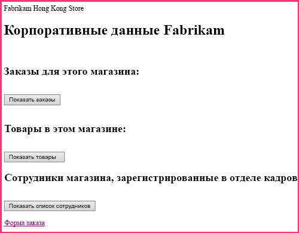

# <a name="give-your-provider-hosted-add-in-the-sharepoint-look-and-feel"></a>Настройка внешнего вида надстройки SharePoint с размещением у поставщика

Это вторая часть серии статей, посвященной основам разработки надстроек SharePoint, размещаемых у поставщика. Для начала следует ознакомиться со статьей [Надстройки SharePoint](sharepoint-add-ins.md) и обзорной статьей из этой серии.

-  [Знакомство с созданием надстроек SharePoint с размещением у поставщика](get-started-creating-provider-hosted-sharepoint-add-ins.md)
    
Работая с предыдущей статьей этой серии, вы научились настраивать среду разработки и с помощью Visual Studio создали первую надстройку уровня Hello World, которая предоставляет данные SharePoint в удаленном веб-приложении. 

В этой статье мы начнем работу с уже созданного решения надстройки SharePoint. Оно включает в себя приложение веб-форм ASP.NET и базу данных SQL Azure. Мы создали их за вас, так как цель этой серии статей — сосредоточиться только на надстройках SharePoint. В каждой статье этой серии вы будете добавлять новые функции SharePoint и средства интеграции в надстройку.

## <a name="get-to-know-the-base-add-in"></a>Знакомство с базовой надстройкой

В этой серии статей мы не будем учить вас программированию на ASP.NET или T-SQL, но вам потребуются минимальные знания об удаленных компонентах надстроек, чтобы мы могли начать интегрировать их в SharePoint. Сценарий использования надстройки подразумевает сеть розничных магазинов, при этом у каждого магазина есть веб-сайт группы в подписке на SharePoint Online родительской компании. Когда магазин устанавливает надстройку на своем сайте группы, надстройка позволяет интегрировать данные и интерфейс SharePoint с данными в базе данных родительской компании. У каждого экземпляра надстройки есть собственная область клиентов в корпоративной базе данных, и пользователи могут взаимодействовать только с теми корпоративными данными, которые сопоставлены с их магазином.

### <a name="create-team-sites-for-two-stores-in-the-chain"></a>Создание сайтов групп для двух магазинов сети

1. Откройте домашнюю страницу вашего сайта SharePoint Online, а затем щелкните ссылку **Содержимое сайта** на панели быстрого запуска. Прокрутите страницу **Содержимое сайта** вниз до ссылки **Создать дочерний сайт** и перейдите по этой ссылке.
 
2. На странице **Создание сайта SharePoint** заполните форму для нового сайта группы, используя указанные ниже значения (которые также показаны на снимке экрана ниже).

   - **Название**: Fabrikam Hong Kong Store
   - **URL-адрес**: hongkong
    
   *Рис. 1. Форма создания дочернего сайта SharePoint*

   

3. Для всех остальных параметров оставьте значения, используемые по умолчанию, и нажмите кнопку **Создать**.

### <a name="explore-the-add-in"></a>Обзор надстройки

1. Перейдите в репозиторий [SharePoint_Provider-hosted_Add-Ins_Tutorials](https://github.com/OfficeDev/SharePoint_Provider-hosted_Add-ins_Tutorials) и нажмите кнопку **Download ZIP** (Скачать ZIP-файл), чтобы сохранить файл на компьютере. Распакуйте файл.
 
2. Запустите Visual Studio *от имени администратора*, а затем откройте решение BeforeSharePointUI.sln. Решение включает три указанных ниже проекта.
    
   - **ChainStore** — проект надстройки SharePoint.
   - **ChainStoreWeb** — удаленное веб-приложение.
   - **ChainCorporateDB** — база данных SQL Azure.

3. Выберите проект **ChainStore** и в окне **Свойства** укажите для свойства **URL-адрес сайта** полный URL-адрес сайта группы в Гонконге: `https://{YOUR_SHAREPOINT_DOMAIN}/hongkong/` (не забудьте добавить символ / в конце адреса). Нажмите кнопку **Сохранить**. *В определенный момент этого процесса вам будет предложено войти в учетную запись подписки на SharePoint Online.* 
    
4. В верхней части **обозревателя решений** щелкните узел решения правой кнопкой мыши и выберите пункт **Назначить запускаемые проекты**.
 
5. Убедитесь, что в столбце **Действие** для всех трех проектов указано значение **Запуск**.
    
6. Нажмите клавишу F5, чтобы развернуть и запустить надстройку. Редактор Visual Studio размещает удаленное веб-приложение в IIS Express, а базу данных SQL — в SQL Express. Кроме того, он выполняет временную установку надстройки на вашем тестовом сайте SharePoint и сразу же запускает ее. Прежде чем откроется начальная страница надстройки, вам будет предложено предоставить надстройке необходимые разрешения.
    
7. Начальная страница надстройки выглядит так, как показано на рис. 2. В самом верху расположено имя веб-сайта SharePoint, на котором установлена надстройка. Это побочный эффект примера кода, который создается набором "Инструменты разработчика Office для Visual Studio". Вы исправите это на одном из следующих этапов. На странице есть области, в которых можно просмотреть данные из таблиц **Orders** (Заказы), **Inventory** (Запасы) и **Employees** (Сотрудники) корпоративной базы данных SQL. Изначально эти таблицы пусты.
  
   *Рис. 2. Начальная страница надстройки сетевого магазина*

   

8. Перейдите по ссылке **Order Form** (Форма заказа) в нижней части страницы. Откроется форма заказа. Введите необходимые значения в форму и нажмите кнопку **Place Order** (Заказать). На рис. 3 показан снимок экрана с примером. На экране ничего не изменится, но код кнопки передаст значения в параметризованную хранимую процедуру в базе данных SQL. Использование параметризованной хранимой процедуры позволяет защитить базу данных от атак путем внедрения кода SQL.

   *Рис. 3. Форма заказа*

   

9. Нажмите кнопку "Назад" в браузере, чтобы вернуться на начальную страницу, а затем нажмите кнопку **Show Orders** (Показать заказы). Начальная страница обновится, и ваш заказ отобразится на странице, которая будет выглядеть примерно так, как показано на снимке экрана на рис. 4.

   *Рис. 4. Начальная страница после нажатия кнопки Show Orders (Показать заказы)*

   
    
   В таблице есть поле **Tenant** (Клиент), в котором в качестве значения указан URL-адрес вашего тестового веб-сайта SharePoint. Оно не имеет отношения к подписке на SharePoint Online, которую иногда называют областью клиентов. Вместо этого каждый экземпляр надстройки представляет собой отдельный клиент в корпоративной базе данных. Так как на хост-сайте SharePoint можно установить не более одного экземпляра надстройки, URL-адрес хост-сайта можно использовать в качестве дискриминатора клиента в базе данных. (Сведения о различиях между хост-сайтом и сайтом надстройки см. в статье [Надстройки SharePoint](sharepoint-add-ins.md).) 
   
   Все хранимые процедуры в надстройке включают значение дискриминатора, когда выполняют операции чтения или записи в базе данных. В результате этого, когда пользователь нажмет кнопку **Show Orders** (Показать заказы), **Show Inventory** (Показать запасы) либо **Show Employees** (Показать сотрудников), из базы данных будут получены только те данные, которые сопоставлены с магазином пользователя. Кроме того, благодаря этому пользователи смогут создавать заказы и добавлять сотрудников только для своего магазина.
    
   Удаленное веб-приложение получает URL-адрес хост-сайта из параметра строки запроса, который SharePoint добавляет в URL-адрес начальной страницы при запуске надстройки. Так как используется протокол SSL, эта строка запроса шифруется для передачи в удаленное веб-приложение через Интернет. 

10. Чтобы завершить сеанс отладки, закройте окно браузера или остановите отладку в Visual Studio. При каждом нажатии клавиши F5 Visual Studio отзывает предыдущую версию надстройки и устанавливает ее последнюю версию.   
 
11. По умолчанию надстройка остается установленной на хост-сайте SharePoint между сеансами отладки в Visual Studio. Чтобы посмотреть, как пользователи будут запускать надстройку после ее установки, откройте веб-сайт SharePoint Fabrikam Hong Kong в браузере и перейдите на страницу **Содержимое сайта**. Вы увидите плитку надстройки, такую же, как на снимке экрана ниже.

   *Рис. 5. Плитка запуска для надстройки сетевого магазина*

   
 
   > [!NOTE]
   > Если вы щелкнете плитку, начальная страница не откроется, так как когда вы останавливаете отладку, Visual Studio закрывает сеанс IIS Express.

<a name="Rebuild"> </a>
## <a name="configure-visual-studio-to-rebuild-the-corporate-database-with-each-debugging-session"></a>Настройка Visual Studio для перестройки корпоративной базы данных при каждом сеансе отладки

По умолчанию Visual Studio *не* перестраивает базу данных SQL Express. Таким образом, заказы и другие элементы, которые вы добавляете в базу данных в сеансе отладки, остаются в базе данных и при последующих сеансах отладки. Намного проще начинать работу с пустой базой данных при каждом нажатии клавиши F5, поэтому выполните указанные ниже действия.

1. Щелкните правой кнопкой мыши проект **ChainCorporateDB** и выберите пункт **Свойства**.

2. Откройте вкладку **Отладка** и включите параметр **Всегда повторно создавать базу данных**.  


## <a name="give-the-remote-web-application-the-look-and-feel-of-sharepoint"></a>Придание удаленному веб-приложению внешнего вида и удобства использования SharePoint

Иногда необходимо, чтобы удаленные страницы имели собственную фирменную символику, но в большинстве случаев они должны имитировать пользовательский интерфейс SharePoint, чтобы пользователи полагали, что они по-прежнему работают с SharePoint.

### <a name="add-sharepoint-chrome-and-top-bar-to-the-start-page"></a>Добавление хрома и верхней панели SharePoint на начальную страницу

1. В **обозревателе решений** выберите пункты **ChainStoreWeb** > **Страницы** и откройте файл CorporateDataViewer.aspx (представляет собой начальную страницу надстройки).

2. В разделе **head** есть скрипт, загружающий ряд библиотек JavaScript. Добавьте под ним указанный ниже скрипт. Этот скрипт загружает файл SP.UI.Controls.js, который есть на каждом веб-сайте SharePoint в папке /\_layouts/15/. Помимо прочего, этот файл загружает библиотеку CSS SharePoint.
    
    ```
      <script type="text/javascript">
        var hostweburl;

        // Load the SharePoint resources.
        $(document).ready(function () {

            // Get the URI decoded add-in web URL.
            hostweburl =
                decodeURIComponent(
                    getQueryStringParameter("SPHostUrl")
            );

            // The SharePoint js files URL are in the form:
            // web_url/_layouts/15/resource.js
            var scriptbase = hostweburl + "/_layouts/15/";

            // Load the js file and continue to the 
            // success handler.
            $.getScript(scriptbase + "SP.UI.Controls.js")
        });

        // Function to retrieve a query string value.
        function getQueryStringParameter(paramToRetrieve) {
            var params =
                document.URL.split("?")[1].split("&amp;");
            var strParams = "";
            for (var i = 0; i < params.length; i = i + 1) {
                var singleParam = params[i].split("=");
                if (singleParam[0] == paramToRetrieve)
                    return singleParam[1];
            }
        }
    </script>
    ```

3. В верхней части текста страницы добавьте указанную ниже часть кода. Она добавляет верхнюю панель SharePoint, называемую элементом управления хрома, на страницу. Эта часть кода станет более понятной, когда мы протестируем измененную надстройку далее в этой статье. Некоторые имена свойств содержат подстроку "app", так как ранее надстройки назывались приложениями (apps).
    
    ```
      <!-- Chrome control placeholder. Options are declared inline.  -->
    <div 
        id="chrome_ctrl_container"
        data-ms-control="SP.UI.Controls.Navigation"  
        data-ms-options=
            '{  
                "appHelpPageUrl" : "Help.aspx",
                "appIconUrl" : "/Images/AppIcon.png",
                "appTitle" : "Chain Store",
                "settingsLinks" : [
                    {
                        "linkUrl" : "Account.aspx",
                        "displayName" : "Account settings"
                    },
                    {
                        "linkUrl" : "Contact.aspx",
                        "displayName" : "Contact us"
                    }
                ]
             }'>
    </div>
    ```

4. Для заголовков **H1** и гиперссылки в тексте страницы автоматически используются стили, определенные в библиотеке CSS SharePoint, поэтому не нужно изменять их. Чтобы проиллюстрировать, как можно использовать стили SharePoint, задайте для заголовков столбцов в трех элементах управления **GridView** стиль SharePoint "все прописные", добавив атрибут **HeaderStyle-CssClass** к каждому элементу управления и задав для него значение `ms-uppercase`. Ниже приведен пример. Измените все три элемента управления **GridView** таким же образом.
    
    ```XML
      <asp:GridView ID="ordersGridView" runat="server" CellPadding="5" GridLines="None" 
    HeaderStyle-CssClass="ms-uppercase" />
    ```

5. Элемент управления хрома использует значок надстройки, поэтому нам необходима еще одна копия файла значка на удаленном веб-сервере. В **обозревателе решений** щелкните правой кнопкой мыши файл AppIcon.png в проекте **ChainStore** и выберите пункт **Копировать**. 
    
6. Щелкните правой кнопкой мыши папку **Images** (Изображения) в проекте **ChainStoreWeb** и выберите пункт **Вставить**.
 
7. Откройте файл CorporateDataViewer.aspx.cs. 
 
8. Класс `CorporateDataViewer` объявляет частный член типа **SharePointContext**. Этот класс определен в файле SharePointContext.cs, созданном набором "Инструменты разработчика Office для Visual Studio" при создании проекта. Вы можете считать его классом **HttpContextBase** в ASP.NET, но с добавленными контекстными сведениями SharePoint, например с URL-адресом хост-сайта.
    
   В методе **Page_Load** оператор **using** записывает имя хост-сайта SharePoint на удаленную начальную страницу. Это пример кода, поэтому удалите весь оператор **using** (но оставьте строку, в которой выполняется инициализация переменной `spContext`). Теперь метод должен выглядеть примерно так, как показано ниже.

    ```C#
      protected void Page_Load(object sender, EventArgs e)
    {
        spContext = SharePointContextProvider.Current.GetSharePointContext(Context);
    }
    ```

9. Существует четыре других файла ASP.NET, для которых требуется пользовательский интерфейс SharePoint: 
    
   - Account.aspx
   - Contact.aspx
   - Help.aspx
   - OrderForm.aspx

   > [!NOTE]
   > Последний ASPX-файл в проекте (EmployeeAdder.aspx) фактически никогда не отрисовывается, поэтому не изменяйте его пользовательский интерфейс. Вы изучите этот файл более подробно в одной из следующих статей этой серии. 

   Мы не хотим, чтобы на этих страницах был элемент управления хрома. Нам всего лишь необходимо получить доступ к библиотеке CSS SharePoint. В каждом из этих четырех файлов добавьте указанную ниже часть кода в элемент **head**.

    ```XML
      <link type="text/css" rel="stylesheet" 
    href="<%= spContext.SPHostUrl.ToString() + "_layouts/15/defaultcss.ashx" %>" />
    ```

10. Это и следующее действие уже выполнены для страницы Order Form (Форма заказа) и страницы Account (Учетная запись), поэтому они применяются только к страницам Contact (Контакт) и Help (Справка). Чтобы добавить объект `spContext` на каждую страницу, откройте код \*.aspx.cs в файлах для этих трех ASPX-страниц. В каждом файле добавьте указанный ниже член в класс **Page**.
    
    ```C#
      protected SharePointContext spContext;
    ```

11. Замените метод **Page_Load** указанной ниже версией. Объект извлекается из кэша сеанса. Он был помещен в кэш, когда был создан методом **Page_Load** начальной страницы надстройки.
    
    ```C#
      protected void Page_Load(object sender, EventArgs e)
    {
        spContext = Session["SPContext"] as SharePointContext;
    }
    ```

12. Откройте страницу OrderForm.aspx. В правом верхнем элементе **Label** (Надпись) замените элемент `<b>` в фразе **Place Order** (Заказать) тегами span, ссылающимися на класс CSS `ms-accentText`. Когда вы закончите вносить изменения, весь элемент управления **Label** (Надпись) должен выглядеть, как показано ниже.
    
    ```XML
      <asp:Label ID="lblOrderPrompt" runat="server"
             Text="Enter a supplier, product, and quantity; and then press <span class='ms-accentText'>Place Order</span>.">
    </asp:Label>
    ```

## <a name="run-the-add-in-and-test-the-new-sharepoint-ui"></a>Запуск надстройки и тестирование нового пользовательского интерфейса SharePoint

1. Нажмите клавишу F5, чтобы развернуть и запустить надстройку. Редактор Visual Studio размещает удаленное веб-приложение в IIS Express, а базу данных SQL — в SQL Express. Кроме того, он выполняет временную установку надстройки на вашем тестовом сайте SharePoint и сразу же запускает ее. Прежде чем откроется начальная страница надстройки, вам будет предложено предоставить надстройке необходимые разрешения.
    
2. Когда откроется начальная страница надстройки, она будет выглядеть как страница SharePoint. Перейдите по ссылке **Order Form** (Форма заказа). Теперь эта форма выглядит как форма SharePoint.
  
   *Рис. 6. Форма "Order Form" (Форма заказа) со шрифтами Segoe и выделенной фразой "Place Order" (Заказать)*

   
 
3. Создайте заказ и нажмите кнопку **Place Order** (Заказать).
    
4. Нажмите кнопку "Назад" в браузере, чтобы вернуться на начальную страницу надстройки, а затем нажмите кнопку **Show Orders** (Показать заказы). Теперь страница должна выглядеть приблизительно так, как показано ниже. Обратите внимание на то, что заголовки столбцов теперь написаны заглавными буквами. 
  
   *Рис. 7. Начальная страница с элементом управления хрома*

   

5. Щелкните значок **?**, расположенный в конце элемента управления хрома. Откроется простая страница справки. Нажмите кнопку "Назад" в браузере.

6. Щелкните значок с изображением шестеренки на элементе управления хрома. Откроется меню со ссылками на страницу "Account" (Учетная запись) и страницу "Contact" (Контакт). Откройте страницу "Account" (Учетная запись) и с помощью кнопки "Назад" в браузере перейдите к начальной странице. Выполните такие же действия для страницы "Contact" (Контакт).

7. Нажмите кнопку **Back to Site** (Вернуться на сайт) на элементе управления хрома. Откроется домашняя страница хост-сайта (сайта группы магазина в Гонконге).

8. Щелкните значок с изображением шестеренки на верхней панели и выберите пункт **Изменить внешний вид**.

9. Следуя инструкциям, измените внешний вид сайта с помощью одного из доступных вариантов оформления.

10. Перейдите на страницу **Site Contents** (Содержание сайта) и запустите приложение Chain Store, щелкнув его плитку. Для ваших настраиваемых страниц будет использован выбранный вариант оформления. На снимках экрана ниже показано, как они выглядят при использовании оформления **Природа**.

   *Рис. 8. Начальная страница и форма заказа в оформлении "Природа"* 

   

11. Верните внешний вид сайта, используемый по умолчанию (он называется **Office**).

12. Чтобы завершить сеанс отладки, закройте окно браузера или остановите отладку в Visual Studio. При каждом нажатии клавиши F5 Visual Studio отзывает предыдущую версию надстройки и устанавливает ее последнюю версию.

13. Вы будете работать с этой надстройкой и решением Visual Studio при изучении других статей, поэтому при перерывах в работе рекомендуем отзывать надстройку. В **обозревателе решений** щелкните проект правой кнопкой мыши и выберите пункт **Отозвать**.

## <a name="next-steps"></a>Дальнейшие действия
<a name="Nextsteps"> </a>

Теперь надстройка выглядит как SharePoint. Тем не менее она по-прежнему является веб-приложением, которое на самом деле не интегрировано с SharePoint, хотя и запускается с помощью плитки в SharePoint. Вы добавите настраиваемую команду, запускаемую с помощью настраиваемой кнопки на ленте в следующей статье: [Включение настраиваемой кнопки в надстройку, размещаемую у поставщика](include-a-custom-button-in-the-provider-hosted-add-in.md).
 

