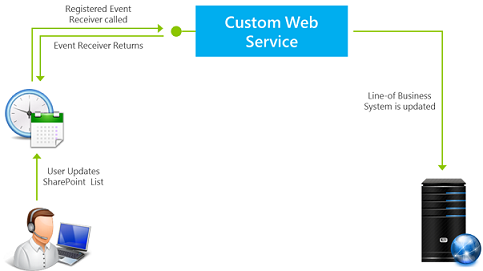

# <a name="handle-events-in-sharepoint-add-ins"></a>Обработка событий в надстройках SharePoint

 **Примечание.** Название "приложения для SharePoint" меняется на "надстройки SharePoint". В процессе перехода с одного названия на другое в документации и пользовательском интерфейсе некоторых продуктов SharePoint и средств Visual Studio по-прежнему может встречаться термин "приложения для SharePoint". Дополнительные сведения см. в статье [Новое название приложений для Office и SharePoint](new-name-for-apps-for-sharepoint#bk_newname).
 

Пользовательский код в надстройках с размещением у поставщика может обрабатывать три категории событий:
 

-  **События списков**, например добавление или удаление списка на веб-сайте.
    
 
-  **События элементов списков**, например редактирование элемента в списке.
    
 
-  **События надстройки**, например установка надстройки.
    
 
Надстройки SharePoint с размещением в SharePoint не поддерживают обработку событий, но вы можете превратить рабочий процесс в подобие обработчика событий списков или их элементов, сделав так, чтобы событие вызывало рабочий процесс. См. статью [Рабочие процессы в SharePoint](http://msdn.microsoft.com/library/e0602371-ae22-44be-8a7e-9e47e9f046d6%28Office.15%29.aspx). События надстроек не могут вызывать рабочие процессы, поэтому они не могут обрабатываться надстройкой с размещением в SharePoint.
 

 **Примечание.** События веб-сайтов и семейств веб-сайтов не поддерживаются в надстройках SharePoint.
 

События делятся на два типа: 
 

-  **События *до операции*** вызываются до обработки события инфраструктурой SharePoint (в том числе сохранения изменений в базе данных контента). В SharePoint **пользовательские обработчики событий до операции всегда выполняются синхронно**. Помимо прочего, их можно использовать для отмены события. Например, если у надстройки есть функция удаления списка, обработчик соответствующего события может отменить удаление, если не соблюдаются определенные условия. Если событие является частью последовательности, его отмена предотвратит возникновение последующих событий. Например, если обработчик события **ItemAdding** отменяет его, то следующее событие **ItemAdded** не вызывается.
    
 
-  **События *после операции*** вызываются после обработки события инфраструктурой SharePoint. В SharePoint **обработчики удаленных событий после операции всегда выполняются асинхронно**, только если это не события приложений. Помимо прочего, их можно использовать для регистрации событий.
    
 

## <a name="handle-list-and-list-item-events"></a>Обработка событий списков и их элементов
<a name="RER"> </a>

Для обработки событий списков и их элементов создаются удаленные приемники событий (RER) — веб-службы, которые выполняются за пределами фермы SharePoint или SharePoint Online. URL-адрес службы RER регистрируется для обрабатываемых ею событий. Зарегистрировать обработчик можно двумя способами:
 

 

- События на хост-сайте регистрируются программно с помощью CSOM (клиентской объектной модели) или REST API SharePoint. Обычно для этого используется логика "первого запуска" в надстройке или обработчике события надстройки. Обзор событий надстроек см. в разделе [Обработка событий надстроек](#HandlingAppEvents) этой статьи. Пример кода, который программно регистрирует событие списка: [OfficeDev/PnP/Samples/Core.EventReceivers](https://github.com/OfficeDev/PnP/tree/master/Samples/Core.EventReceivers).
    
 
-  События на сайте надстройки обычно регистрируются в компоненте сайта с помощью простой разметки XML. Подробные сведения о создании разметки и службы представлены в статье [Создание удаленного приемника событий в надстройках SharePoint](create-a-remote-event-receiver-in-sharepoint-add-ins). Кроме того, события на сайте надстройки можно регистрировать программным способом.
    
 

 **Примечание.** Удаленные приемники событий служат для того же, что и приемники событий в фермах. Но последние содержат специальный код, выполняемый на серверах SharePoint, поэтому их нельзя использовать в надстройках SharePoint.
 

Надстройка может обрабатывать приведенные ниже события списков и библиотеки документов. События с окончанием "ing" выполняются до операции (синхронно), а события с окончанием "ed" — после (асинхронно).
 

 

|||
|:-----|:-----|
|ListAdding|ListAdded|
|ListDeleting|ListDeleted|
|FieldAdding|FieldAdded|
|FieldDeleting|FieldDeleted|
|FieldUpdating|FieldUpdated|
События обновления полей связаны с изменением свойств поля (столбца) в списке, например возможности сортировки, а не с изменением данных в поле.
 

 
Надстройка может обрабатывать следующие события элементов списков: 
 

 

|||
|:-----|:-----|
|ItemAdding|ItemAdded|
|ItemUpdating|ItemUpdated|
|ItemDeleting|ItemDeleted|
|ItemCheckingOut|ItemCheckedOut|
|ItemCheckingIn|ItemCheckedIn|
|ItemUncheckingOut|ItemUncheckedOut|
|ItemAttachmentAdding|ItemAttachmentAdded|
|ItemAttachmentDeleting|ItemAtttachmentDeleted|
|ItemFileMoving|ItemFileMoved|
|ItemVersionDeleting*|ItemVersonDeleted*|
||ItemFileConverted|

 **Примечание.** *Эти два новых события могут быть недоступны в пользовательском интерфейсе Visual Studio. Если это так, выберите событие ItemDeleting или ItemDeleted и измените имена вручную.
 

При работе в Visual Studio и добавлении RER в проект надстройки SharePoint Инструменты разработчика Office для Visual Studio делают следующее:
 

 

- Файл веб-службы, например RemoteEventReceiver1.svc, добавляется в веб-приложение для обработки событий, указанных при добавлении удаленного приемника событий в надстройку SharePoint. Веб-служба содержит файл с кодом для обработки удаленных событий.
    
    После создания приемника удаленных событий следует добавить код в файл, используемый службой веб-приложения для обработки событий. По умолчанию файл кода содержит два метода, к которым добавляется код обработки: 
    
      -  `ProcessEvent()` обрабатывает события до операции (такие, как в левых столбцах выше) и возвращает в SharePoint объект, сообщающий, отменять ли событие.
    
 
  -  `ProcessOneWayEvent()` обрабатывает события после операции. Он выполняется асинхронно и не возвращает никаких объектов в SharePoint.
    
 

    Когда происходит зарегистрированное событие, SharePoint вызывает соответствующий метод в службе и передает объект, который предоставляет некоторые контекстные сведения для кода. Например, определяется тип события (указанный в одной из двух таблиц выше), чтобы можно было перейти к соответствующему фрагменту кода.
    
 
- Элемент проекта для удаленного приемника событий добавляется в проект надстройки SharePoint. Файл Elements.xml для удаленного приемника событий ссылается на веб-службу в веб-приложении и указанные удаленные события. В следующем примере показано, как файл Elements.xml обрабатывает добавление или удаление элемента списка.
    
```XML
  <?xml version="1.0" encoding="utf-8"?>
<Elements xmlns="http://schemas.microsoft.com/sharepoint/">
  <Receivers ListTemplateId="104">
      <Receiver>
        <Name>RemoteEventReceiver1ItemAdding</Name>
        <Type>ItemAdding</Type>
        <SequenceNumber>10000</SequenceNumber>
        <Url>~remoteAppUrl/RemoteEventReceiver1.svc</Url>
      </Receiver>
      <Receiver>
        <Name>RemoteEventReceiver1ItemDeleting</Name>
        <Type>ItemDeleting</Type>
        <SequenceNumber>10000</SequenceNumber>
        <Url>~remoteAppUrl/RemoteEventReceiver1.svc</Url>
      </Receiver>
  </Receivers>
</Elements>
```

Чтобы изменить события, обрабатываемые приемником удаленных событий, откройте **обозреватель решений**, затем окно **Свойства** для приемника удаленных событий, разверните узел **События SharePoint** и задайте для нужных событий значения **True**.
 

 

 **Примечание.** Дополнительные сведения об удаленных приемниках событий, в том числе сведения об устранении неполадок, см. [здесь](handle-events-in-sharepoint-add-ins#RERFAQ).
 


## <a name="handling-add-in-events"></a>Обработка событий надстройки
<a name="HandlingAppEvents"> </a>

События надстройки также обрабатываются удаленными веб-службами, но настраиваются в пакете надстройки не так, как удаленные приемники событий списка и его элементов, поэтому рассматриваются как отдельная категория компонента. В этом случае удаленная веб-служба регистрируется в манифесте надстройки, а не в компоненте сайта надстройки. Для надстройки даже не нужен сайт. Ниже описаны три события надстройки.
 

 

### <a name="appinstalled-event"></a>Событие AppInstalled

Событие **AppInstalled** выполняется сразу после установки надстройки, но до отправки пользователю уведомления о ее завершении. Хотя это событие и выполняется *после* операции, SharePoint запускает обработчик *синхронно*. Надстройка не доступна для использования до завершения работы обработчика, а он может отменить установку (в результате чего SharePoint отменит все выполненные действия). Рекомендуется для выявления ошибок в обработчике и уведомления SharePoint об отмене установки. Дополнительные сведения см. в разделе [Включение логики отката и логики проверки выполненных действий в обработчики событий надстроек](#Rollback).
 

 

 **Примечание.** При установке надстройки на [уровне клиента](tenancies-and-deployment-scopes-for-sharepoint-add-ins) она устанавливается в семействе веб-сайтов каталога надстроек, и событие AppInstalled запускается только после этого. Надстройка видима на нескольких веб-сайтах в клиентской организации, но событие не запускается для каждого из них отдельно.
 

Помимо отмены установки надстройки, это событие можно использовать для других целей, в том числе:
 

 

- Установка на хост-сайте компонентов SharePoint, которые невозможно декларативно установить с помощью компонента хост-сайта, например списков и дочерних веб-сайтов.
    
 
- Программная регистрация обработчиков событий списков и их элементов на хост-сайте или сайте надстройки.
    
 
- Установка параметров инициализации, зависящих от экземпляра надстройки. Например, у надстройки может быть контейнер свойств сайта надстройки для хранения параметров, которые отличаются между разными экземплярами надстройки. Обработчик AppInstalled может записывать в контейнер свойств разные значения, зависящие, к примеру, от типа хост-сайта (например, сайта группы или блога).
    
     **Примечание.** Проверив, является ли хост-сайт сайтом каталога надстроек, можно определить, установлена ли надстройка на уровне клиента. См. статью [Области клиентов и области развертывания для надстроек SharePoint](tenancies-and-deployment-scopes-for-sharepoint-add-ins).
- Выполнение в удаленном веб-приложении настройки, зависящей от экземпляра надстройки, например добавление таблицы в базу данных.
    
 

 **Важно!** Событие AppInstalled должно завершаться в течение 30 секунд, иначе инфраструктура установки SharePoint посчитает, что произошел сбой. Инфраструктура перезапустит событие *и повторит ваш код с начала*. Если время ожидания истечет четыре раза, SharePoint выполнит полный откат установки надстройки. Подробное описание последствий представлено в разделе [Включение логики отката и логики проверки выполненных действий в обработчики событий надстроек](#Rollback).
 


### <a name="appuninstalling-event"></a>Событие AppUninstalling

Событие **AppUninstalling** *не* запускается при удалении надстройки с хост-сайта. Надстройка всего лишь перемещается в корзину пользователя. Для вызова события AppUninstalling пользователь должен удалить надстройку из корзины, а затем **удалить ее из второй корзины**. Событие AppUninstalling синхронное, его можно использовать для отмены удаления, чтобы надстройка осталась во второй корзине.
 

 
Основное назначение обработчика этого события — удаление или перемещение в корзину элементов, развернутых обработчиком события AppInstalled (или AppUpdated). SharePoint не может удалить эти элементы или переместить их в корзину, так как не располагает данными о них, по крайней мере не как о компонентах надстройки. Эти элементы рекомендуется удалять. Но вы можете оставить элементы, которые будут использоваться после удаления надстройки. Если список или веб-сайт, созданный обработчиком события AppInstalled, еще будет использоваться, не удаляйте его в обработчике события AppUninstalling.
 

 

### <a name="appupgraded-event"></a>Событие AppUpgraded

Событие **AppUpgraded** запускается сразу после обновления надстройки до новой версии, но до отправки пользователю уведомления о его завершении. Как и событие AppInstalled, оно выполняется после операции, но, по сути, является синхронным, и рекомендуется для выявления ошибок и уведомления SharePoint об откате обновления.
 

 
Некоторые примеры того, что может делать обработчик этого события:
 

 

- Добавление, изменение или удаление компонентов надстройки с хост-сайта.
    
 
- Действия в надстройке, которые невозможно выполнить с помощью описательной семантики обновления в компоненте сайта надстройки. Например, с помощью описательной разметки обновления невозможно удалять элементы, но это можно сделать программно в обработчике события AppUpgraded.
    
 
- Изменение компонентов, зависящих от экземпляра надстройки, в веб-приложении или удаленной базе данных надстройки.
    
 
 *Подробные инструкции по созданию обработчиков событий надстроек см. в [этой статье](create-an-add-in-event-receiver-in-sharepoint-add-ins)*.
 

 

### <a name="include-rollback-logic-and-already-done-logic-in-your-add-in-event-handlers"></a>Включение логики отката и логики проверки выполненных действий в обработчики событий надстроек
<a name="Rollback"> </a>

Если при обработке любого из трех событий надстройки возникает ошибка, SharePoint отменяет событие и откатывает все связанные с ним изменения. Обработчики событий надстроек должны учитывать эту систему, так как при сбое части реализуемого события нужно откатить все событие, а не продолжать работу, рискуя оставить надстройку в поврежденном состоянии. Как правило, обработчик должен сделать следующее:
 

 

- Сообщить SharePoint об ошибке. Сообщение SOAP, которое веб-служба обработки событий надстроек возвращает в SharePoint, содержит свойство **Status** со значением **Continue**, **CancelWithError** или **CancelWithoutError**. Оба состояния **Cancel*** уведомляют SharePoint об откате события.
    
 
- Выполнить откат действий, уже выполненных обработчиком до обнаружения ошибки. Как правило, среда SharePoint не может это сделать, поскольку ей неизвестно, какие действия выполнил обработчик. Это правило не является универсальным. Например, при отмене установки надстройки SharePoint полностью удалит сайт надстройки, поэтому обработчику события AppInstalled нет смысла отменять все действия, выполненные с этим сайтом. Тем не менее, обычно он должен отменять действия, выполненные с хост-сайтом или удаленными компонентами надстройки. 
    
 

 **Специальное примечание о событии AppUninstalling.** Указанное выше относится как к событию AppUninstalling, так и к двум другим событиям надстроек. Например, если после удаления строки из удаленной базы данных возникает ошибка, строку необходимо восстановить. Так как служба отправит в SharePoint сообщение об отмене, надстройка не будет удалена из корзины. При восстановлении и повторном использовании она может не работать без этой записи в базе данных. Однако обработчик AppUninstalling завершает работу *до* удаления надстройки из корзины. Поэтому при возникновении ошибки в самом SharePoint и отмене удаления обработчик не сможет отменить выполненные действия.
 

Если среда SharePoint не получит сообщение от обработчика в течение 30 секунд, она снова вызовет обработчик. После трех повторных попыток (всего четырех) выполняется полный откат события. При каждом вызове обработчика код запускается сначала. Как правило, вам не нужно, чтобы обработчик повторял уже выполненные действия, например создание списка на хост-сайте, и вам неизвестно, завершила ли свою работу, или вообще запустилась, логика отката до истечения времени ожидания обработчика. 
 

 
Ошибки установки и обновления отображаются в пользовательском интерфейсе SharePoint, как показано на следующем рисунке.
 

 

**Рисунок 1. Получение сведений об ошибке установки.**

 

 

 

#### <a name="add-in-event-handler-architecture-strategies"></a>Стратегии архитектуры обработчиков событий надстройки
<a name="Strategies"> </a>

Если представить обработчик в псевдокоде, он должен иметь примерно следующую структуру. Если в разделе Try возникнет ошибка, должны вызываться разделы Catch и Rollback (это может происходить автоматически, в зависимости от языка и платформы).
 

 

```
Try
    If X not already done,
        Do X.
Catch
    Send cancel message to SharePoint.
    If X not already undone,
        Undo X.

```

Однако логика отката и проверки выполненных действий в веб-службе может замедлить работу обработчика. Логика установки и отката обычно изменяет объекты, более или менее удаленные от веб-службы, например хост-сайт SharePoint или внутреннюю базу данных. Если код установки и отката поделен между разделами Try и Catch, то служба вызывает удаленные компоненты по отдельности, часто несколько раз в каждом разделе. Рекомендуется реализовать логику установки и отката в самом удаленном компоненте с помощью процедуры, которая может вызываться из раздела Try обработчика. Процедура должна возвращать сообщение об успешном завершении или сбое. В последнем случае код из раздела Try вызывает раздел Catch (например, сообщив об исключении). Раздел Catch лишь уведомляет SharePoint. Назовем это стратегией делегирования обработчика. Она проиллюстрирована следующим псевдокодом:
 

 


```
Try
    Call the "Do X" procedure on remote platform.
    If remote platform reports failure, call Catch.
Catch
    Send cancel message to SharePoint.

```

Процедура "Do X", которая выполняется в удаленной системе, будет содержать логику отката и проверки выполненных действий, как показано ниже.
 

 


```
Try
    If X not already done,
        Do X.
        Set success flag to true.
Catch
    If X was done before error,
        Undo X.
    Set success flag to false.
Send
    Return success flag to the event handler.

```

Например, если обработчик должен выполнить действие с базой данных SQL Server, вы можете установить на сервере SQL Server хранимую процедуру, которая использует блок [TRY-CATCH](http://msdn.microsoft.com/library/248df62a-7334-4bca-8262-235a28f4b07f%28Office.15%29.aspx) для реализации логики отката, с блоками [IF-ELSE](http://msdn.microsoft.com/library/676c881f-dee1-417a-bc51-55da62398e81%28Office.15%29.aspx) для реализации логики проверки выполненных действий.
 

 
Модель надстроек SharePoint не позволяет хранить пользовательский серверный код в SharePoint и вызывать его из CSOM (клиентской объектной модели). Но CSOM позволяет объединить логику try-catch и if-then-else и отправить ее на сервер для выполнения. Подробный пример обработчика событий надстройки, который использует стратегию делегирования для добавления списка на хост-сайт см. в [этой статье](create-an-add-in-event-receiver-in-sharepoint-add-ins). Пример кода см. на странице [OfficeDev/PnP/Samples/Core.AppEvents.HandlerDelegation](https://github.com/OfficeDev/PnP/tree/master/Samples/Core.AppEvents.HandlerDelegation).
 

 
Стратегию делегирования обработчика можно использовать не всегда. Например, если обработчик вызывает несколько компонентов, например базу данных и хост-сайт SharePoint, один из вызовов может завершиться успешно, а другой — с ошибкой. В этом случае логика отката для первого компонента не будет выполняться, если она реализована согласно стратегии делегирования обработчика. По этой причине при синхронном вызове компонентов только последний из них может использовать эту стратегию. При асинхронном вызове эту стратегию нельзя использовать ни в одном из них. Пример обработчика событий надстроек, который не использует стратегию делегирования обработчика, см. на странице [OfficeDev/PnP/Samples/Core.AppEvents](https://github.com/OfficeDev/PnP/tree/master/Samples/Core.AppEvents).
 

 

 **Совет.** В случае сбоя события AppInstalled SharePoint удалит сайт надстройки (если он существует), а в случае сбоя события AppUpated SharePoint восстановит состояние надстройки до обновления. По этой причине обработчикам никогда не нужно отменять действия, выполненные на сайте надстройки. Если обработчик выполняет действия как на хост-сайте, так и на сайте надстройки, то начать следует с сайта надстройки. Это позволит использовать стратегию делегирования обработчика для хост-сайта. Даже если действия с сайтом надстройки будут выполнены успешно, а действия с хост-сайтом завершатся с ошибкой, выполняется вся логика отката.
 


## <a name="remote-event-receivers-in-add-ins-that-support-multiple-security-zones"></a>Удаленные приемники событий в надстройках, поддерживающих несколько зон безопасности
<a name="HandlingAppEvents"> </a>

В отношении разработки надстроек, поддерживающих несколько зон безопасности и содержащих удаленный приемник событий, действуют некоторые ограничения. Дополнительные сведения см. в статье базы знаний kb3135876 о том, что [невозможно добавить приложение из Магазина SharePoint по умолчанию при использовании надстроек, размещенных у поставщика, не в зонах по умолчанию в SharePoint](https://support.microsoft.com/en-us/kb/3135876).
 

 

## <a name="remote-event-receivers-faq"></a>Удаленные приемники событий: вопросы и ответы
<a name="RERFAQ"> </a>

Ниже приведены распространенные вопросы, которые могут возникнуть при использовании удаленных приемников событий.
 

 

### <a name="how-are-remote-event-receivers-different-from-event-receivers-in-sharepoint-2010"></a>Чем удаленные приемники событий отличаются от приемников событий в SharePoint 2010?
<a name="RER_HowRERDifferentfrom2010"> </a>

В SharePoint 2010 приемники событий обрабатывают события, которые происходят в списках, сайтах и других объектах SharePoint, выполняя код на сервере SharePoint (с полным доверием или в песочнице). Такие приемники событий существуют и в SharePoint. Однако SharePoint также поддерживает *удаленные* приемники событий, в которых код, выполняющийся при вызове события, размещается в веб-службе. Это означает, что при регистрации удаленного приемника событий также необходимо сообщить SharePoint, какую веб-службу вызывать. В таблице 1 пример кода слева (решения SharePoint) реализует функции с помощью обработчика событий. Пример справа (надстройки SharePoint) реализует те же функции с помощью удаленного приемника событий.
 

 

**Таблица 1. Примеры кода для приемников событий в SharePoint 2010 и удаленных приемников событий в надстройках**


|**Решения SharePoint**|**Надстройки SharePoint **|
|:-----|:-----|
|
```C#
// Trigger an event when an item is added to the SharePoint list.
Public class OnPlantUpdated : SPItemEventReceiver
{
Public override void ItemAdding (SPItemEventProperties properties)
{
Properties.After.Properties.ChangedProperties.Add("Image",CreateLink(properties));
Properties.status =SPEventReceiverStatus.Continue;
}

/// When an item updates, run the following.
Public override void ItemUpdating(SPItemEventProperties properties)
{
Properties.AfterProperties.ChangedProperties.Add("Image",CreateLink9properties));
Properties.Status= SPEventReceiverStatus.Continue;
}

```

|
```C#
/* Trigger an event when an item is added to the SharePoint list*/
Public class OnPlantUpdated : IRemoteEventService
{
public SPRemoteEventResult ProcessEvent (SPRemoteEventProperties properties)
{
SPRemoteEventResult result =new SPRemoteEventResult();
If (properties.EventType == SPRemoteEventType.ItemAdding ||  
properties.EventType == SPRemoteEventType.ItemUpdating)
{

// Add code that runs when an item is added or updated.
}

```

| Полный пример кода см. в [этой статье](http://code.msdn.microsoft.com/SharePoint-2013-Add-list-2c6e71e0). Подробную демонстрацию см. в [этом видео](http://channel9.msdn.com/Series/Reimagine-SharePoint-Development/Migrating-a-SharePoint-Event-Receiver-to-a-Remote-Event-Receiver).
 

 

### 
<a name="RER_HowRERDifferentfrom2010"> </a>

Сведения см. в разделе [Перечисление SPRemoteEventType](https://msdn.microsoft.com/en-us/library/microsoft.sharepoint.client.eventreceivers.spremoteeventtype.aspx).
 

 

### <a name="how-do-remote-event-receivers-work"></a>Как работают удаленные приемники событий?
<a name="RER_HowDoRERWork"> </a>

На рисунке 1 показано, как работают удаленные приемники событий:
 

 

- Пользователь выполняет действие в SharePoint (например, изменяет элемент списка).
    
 
- Затем SharePoint обращается к зарегистрированной веб-службе. Вы можете выполнять некоторые операции, например обновлять свойство элемента списка или серверную систему.
    
 
- Веб-служба также может обратиться к службе контроля доступа, чтобы запросить собственный подписанный маркер для обратного вызова SharePoint. С помощью этого маркера можно выполнять удаленные действия из веб-службы в результате предыдущей операции над элементом списка или серверной системой.
    
 

**Рисунок 2. Принцип действия удаленных приемников событий в SharePoint**

 

 

 

 

 

### <a name="how-do-i-debug-remote-event-receivers"></a>Как отлаживать удаленные приемники событий?
<a name="RER_DebugRER"> </a>

См. статью [Устранение неполадок и отладка удаленного приемника событий в надстройке SharePoint](debug-and-troubleshoot-a-remote-event-receiver-in-a-sharepoint-add-in). 
 

 

### <a name="can-i-run-client-side-javascript-code-from-remote-event-receivers"></a>Можно ли запускать клиентский код (JavaScript) из удаленных приемников событий?
<a name="RER_ClientsideCodeFromRER"> </a>

Нет.
 

 

### <a name="are-there-any-restrictions-on-where-a-remote-event-receiver-can-be-hosted-or-on-its-url"></a>Существуют ли ограничения на размещение удаленного приемника событий или его URL-адрес?
<a name="RER_ClientsideCodeFromRER"> </a>

Удаленный приемник событий может быть размещен в облаке или на локальном сервере, который не используется в качестве сервера SharePoint. URL-адрес производственного приемника не может указывать определенный порт. Это значит, что вам необходимо использовать порт 443 для HTTPS (рекомендовано) или порт 80 для HTTP. При использовании HTTPS, если приемник размещен локально, а надстройка на Microsoft SharePoint Online, сервер размещения должен иметь доверенный сертификат, выданный центром сертификации. (Самозаверяющий сертификат действует, только если надстройка расположена в локальной ферме SharePoint.)
 

 

### <a name="will-a-sharepoint-2010-event-handler-work-on-sharepoint-after-i-upgrade"></a>Будет ли работать обработчик событий SharePoint 2010 в SharePoint после обновления?
<a name="RER_Will2020EventHandlerWillWorkOn2013"> </a>

Если пакет решения SharePoint 2010, содержащий обработчик событий, обновляется до SharePoint, то, в зависимости от ваших настроек, пакет решения может работать без изменений. Это касается и обработчика событий. Если решение SharePoint 2010 преобразуется в надстройку в SharePoint, обработчик событий должен быть переписан как удаленный приемник событий. (См. видео [о переносе приемника событий SharePoint в удаленный приемник событий](http://channel9.msdn.com/Series/Reimagine-SharePoint-Development/Migrating-a-SharePoint-Event-Receiver-to-a-Remote-Event-Receiver).)
 

 

## <a name="additional-resources"></a>Дополнительные ресурсы
<a name="SP15handleevents_addlresources"> </a>


-  [Создание удаленного приемника событий в надстройках SharePoint](create-a-remote-event-receiver-in-sharepoint-add-ins)
    
 
-  [Создание приемника событий надстроек в надстройках SharePoint](create-an-add-in-event-receiver-in-sharepoint-add-ins)
    
 
-  [Введение в удаленные приемники событий в SharePoint](http://www.microsoft.com/resources/msdn/en-us/office/media/video/videol?cid=sdc&amp;from=mscomsdc&amp;VideoID=3ef8f7ae-85a7-44c3-967d-d1620e2a019f)
    
 
-  [Перенос приемника событий SharePoint в удаленный приемник событий](http://channel9.msdn.com/Series/Reimagine-SharePoint-Development/Migrating-a-SharePoint-Event-Receiver-to-a-Remote-Event-Receiver)
    
 

