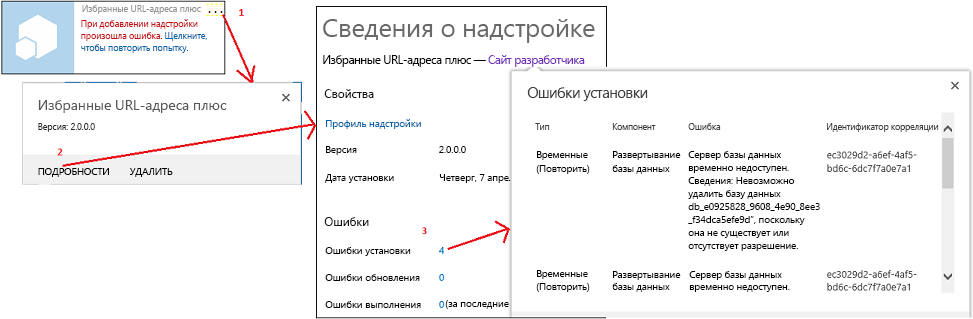

# <a name="handle-events-in-sharepoint-add-ins"></a><span data-ttu-id="03057-102">Обработка событий в надстройках SharePoint</span><span class="sxs-lookup"><span data-stu-id="03057-102">Handle events in SharePoint Add-ins</span></span>

 <span data-ttu-id="03057-p101">**Примечание.** В настоящее время идет процесс замены названия "приложения для SharePoint" названием "надстройки SharePoint". Во время этого процесса в документации и пользовательском интерфейсе некоторых продуктов SharePoint и средств Visual Studio может по-прежнему использоваться термин "приложения для SharePoint". Дополнительные сведения см. в статье [Новое название приложений для Office и SharePoint](new-name-for-apps-for-sharepoint.md#bk_newname).</span><span class="sxs-lookup"><span data-stu-id="03057-p101">**Note**  The name "apps for SharePoint" is changing to "SharePoint Add-ins". During the transition, the documentation and the UI of some SharePoint products and Visual Studio tools might still use the term "apps for SharePoint". For details, see  [New name for apps for Office and SharePoint](new-name-for-apps-for-sharepoint.md#bk_newname).</span></span>
 

<span data-ttu-id="03057-106">Пользовательский код в надстройках с размещением у поставщика может обрабатывать три категории событий:</span><span class="sxs-lookup"><span data-stu-id="03057-106">Your custom code can handle three categories of events in provider-hosted add-ins:</span></span>
 

-  <span data-ttu-id="03057-107">**События списков**, например добавление или удаление списка на веб-сайте.</span><span class="sxs-lookup"><span data-stu-id="03057-107">**List events**, such as the adding or deleting of a list on a website.</span></span>
    
 
-  <span data-ttu-id="03057-108">**События элементов списков**, например редактирование элемента в списке.</span><span class="sxs-lookup"><span data-stu-id="03057-108">**List item events**, such as the editing of an item in a list.</span></span>
    
 
-  <span data-ttu-id="03057-109">**События надстройки**, например установка надстройки.</span><span class="sxs-lookup"><span data-stu-id="03057-109">**Add-in events**, such as the installation of an add-in.</span></span>
    
 
<span data-ttu-id="03057-p102">Надстройки SharePoint с размещением в SharePoint не поддерживают обработку событий, но вы можете превратить рабочий процесс в подобие обработчика событий списков или их элементов, сделав так, чтобы событие вызывало рабочий процесс. См. статью [Рабочие процессы в SharePoint](http://msdn.microsoft.com/library/e0602371-ae22-44be-8a7e-9e47e9f046d6%28Office.15%29.aspx). События надстроек не могут вызывать рабочие процессы, поэтому они не могут обрабатываться надстройкой с размещением в SharePoint.</span><span class="sxs-lookup"><span data-stu-id="03057-p102">SharePoint-hosted SharePoint Add-ins do not support event handling, but you can turn a workflow into a kind of list or list item event handler by setting an event to trigger the workflow. See  [Workflows in SharePoint](http://msdn.microsoft.com/library/e0602371-ae22-44be-8a7e-9e47e9f046d6%28Office.15%29.aspx). Workflows cannot be triggered by add-in events, so add-in events cannot be handled with a SharePoint-hosted add-in.</span></span>
 

 <span data-ttu-id="03057-113">**Примечание.** События веб-сайтов и семейств веб-сайтов не поддерживаются в надстройках SharePoint.</span><span class="sxs-lookup"><span data-stu-id="03057-113">**Note**  Website events and site collection events are not supported in SharePoint Add-ins.</span></span>
 

<span data-ttu-id="03057-114">События делятся на два типа:</span><span class="sxs-lookup"><span data-stu-id="03057-114">There are two kinds of events:</span></span> 
 

-  <span data-ttu-id="03057-p103">**События *до операции*** вызываются до обработки события инфраструктурой SharePoint (в том числе сохранения изменений в базе данных контента). В SharePoint **пользовательские обработчики событий до операции всегда выполняются синхронно**. Помимо прочего, их можно использовать для отмены события. Например, если у надстройки есть функция удаления списка, обработчик соответствующего события может отменить удаление, если не соблюдаются определенные условия. Если событие является частью последовательности, его отмена предотвратит возникновение последующих событий. Например, если обработчик события **ItemAdding** отменяет его, то следующее событие **ItemAdded** не вызывается.</span><span class="sxs-lookup"><span data-stu-id="03057-p103">***Before*  events** are triggered before the SharePoint infrastructure does any of it's own handling of the event (including committing changes to the content database). In SharePoint **custom before event handlers always execute synchronously**. Among other purposes, they can be used to cancel the event. For example, if an add-in has a function for deleting a list, a handler for the list deleting event can cancel the deletion if certain conditions are not met. If the event is part of a sequence of events, cancelling it prevents any of the later events from occurring at all. For example, if your handler for the **ItemAdding** event cancels the event, the **ItemAdded** event, which normally comes later, is not triggered.</span></span>
    
 
-  <span data-ttu-id="03057-p104">**События *после операции*** вызываются после обработки события инфраструктурой SharePoint. В SharePoint **обработчики удаленных событий после операции всегда выполняются асинхронно**, только если это не события приложений. Помимо прочего, их можно использовать для регистрации событий.</span><span class="sxs-lookup"><span data-stu-id="03057-p104">***After*  events** are triggered after the SharePoint infrastructure does any of it's own handling of the event. In SharePoint, **remote after event handlers, for list and list item events, always execute asynchronously**. (App events are an exception.) Among other purposes, they can be used to log events.</span></span>
    
 

## <a name="handle-list-and-list-item-events"></a><span data-ttu-id="03057-124">Обработка событий списков и их элементов</span><span class="sxs-lookup"><span data-stu-id="03057-124">Handle list and list item events</span></span>
<span data-ttu-id="03057-125"><a name="RER"> </a></span><span class="sxs-lookup"><span data-stu-id="03057-125"></span></span>

<span data-ttu-id="03057-p105">Для обработки событий списков и их элементов создаются удаленные приемники событий (RER) — веб-службы, которые выполняются за пределами фермы SharePoint или SharePoint Online. URL-адрес службы RER регистрируется для обрабатываемых ею событий. Зарегистрировать обработчик можно двумя способами:</span><span class="sxs-lookup"><span data-stu-id="03057-p105">To handle list and list item events, you create remote event receivers (RERs), which are web services that run externally to the SharePoint farm or SharePoint Online. The URL of the RER service is registered for the events it handles. There are two ways to register a handler:</span></span>
 

 

- <span data-ttu-id="03057-p106">События на хост-сайте регистрируются программно с помощью CSOM (клиентской объектной модели) или REST API SharePoint. Обычно для этого используется логика "первого запуска" в надстройке или обработчике события надстройки. Обзор событий надстроек см. в разделе [Обработка событий надстроек](#HandlingAppEvents) этой статьи. Пример кода, который программно регистрирует событие списка: [OfficeDev/PnP/Samples/Core.EventReceivers](https://github.com/OfficeDev/PnP/tree/master/Samples/Core.EventReceivers.md).</span><span class="sxs-lookup"><span data-stu-id="03057-p106">Events in the host web are registered programmatically with the CSOM (client-side object model) or the SharePoint REST API. This task is typically done in "first run" logic in the add-in or in a handler for an add-in event. (See  [Handling add-in events](#HandlingAppEvents) later in the article for an overview of add-in events.) For a code sample that programmatically registers a list event, see [OfficeDev/PnP/Samples/Core.EventReceivers](https://github.com/OfficeDev/PnP/tree/master/Samples/Core.EventReceivers.md).</span></span>
    
 
-  <span data-ttu-id="03057-p107">События на сайте надстройки обычно регистрируются в компоненте сайта с помощью простой разметки XML. Подробные сведения о создании разметки и службы представлены в статье [Создание удаленного приемника событий в надстройках SharePoint](create-a-remote-event-receiver-in-sharepoint-add-ins.md). Кроме того, события на сайте надстройки можно регистрировать программным способом.</span><span class="sxs-lookup"><span data-stu-id="03057-p107">Events in the add-in web are usually registered in a Feature of the add-in web with some simple XML markup. Details of how to create the markup and the service are in [Create a remote event receiver in SharePoint Add-ins](create-a-remote-event-receiver-in-sharepoint-add-ins.md). It is also possible to register add-in web events programmatically.</span></span>
    
 

 <span data-ttu-id="03057-134">**Примечание.** Удаленные приемники событий служат для того же, что и приемники событий в фермах. Но последние содержат специальный код, выполняемый на серверах SharePoint, поэтому их нельзя использовать в надстройках SharePoint.</span><span class="sxs-lookup"><span data-stu-id="03057-134">**Note**  RERs have the same purpose as event receivers in farm solutions; but event receivers have custom code that runs on the SharePoint servers, so they cannot be used in SharePoint Add-ins.</span></span>
 

<span data-ttu-id="03057-p108">Надстройка может обрабатывать приведенные ниже события списков и библиотеки документов. События с окончанием "ing" выполняются до операции (синхронно), а события с окончанием "ed" — после (асинхронно).</span><span class="sxs-lookup"><span data-stu-id="03057-p108">Your add-in can handle the following list and document library events. Events ending in "ing" are before (synchronous) events and those ending in "ed" are after (asynchronous) events.</span></span>
 

 

|||
|:-----|:-----|
|<span data-ttu-id="03057-137">ListAdding</span><span class="sxs-lookup"><span data-stu-id="03057-137">ListAdding</span></span>|<span data-ttu-id="03057-138">ListAdded</span><span class="sxs-lookup"><span data-stu-id="03057-138">ListAdded</span></span>|
|<span data-ttu-id="03057-139">ListDeleting</span><span class="sxs-lookup"><span data-stu-id="03057-139">ListDeleting</span></span>|<span data-ttu-id="03057-140">ListDeleted</span><span class="sxs-lookup"><span data-stu-id="03057-140">ListDeleted</span></span>|
|<span data-ttu-id="03057-141">FieldAdding</span><span class="sxs-lookup"><span data-stu-id="03057-141">FieldAdding</span></span>|<span data-ttu-id="03057-142">FieldAdded</span><span class="sxs-lookup"><span data-stu-id="03057-142">FieldAdded</span></span>|
|<span data-ttu-id="03057-143">FieldDeleting</span><span class="sxs-lookup"><span data-stu-id="03057-143">FieldDeleting</span></span>|<span data-ttu-id="03057-144">FieldDeleted</span><span class="sxs-lookup"><span data-stu-id="03057-144">FieldDeleted</span></span>|
|<span data-ttu-id="03057-145">FieldUpdating</span><span class="sxs-lookup"><span data-stu-id="03057-145">FieldUpdating</span></span>|<span data-ttu-id="03057-146">FieldUpdated</span><span class="sxs-lookup"><span data-stu-id="03057-146">FieldUpdated</span></span>|
<span data-ttu-id="03057-147">События обновления полей связаны с изменением свойств поля (столбца) в списке, например возможности сортировки, а не с изменением данных в поле.</span><span class="sxs-lookup"><span data-stu-id="03057-147">The field update events are about changing the properties of a field (column) on a list, such as whether it is sortable, not about changing the data in the field.</span></span>
 

 
<span data-ttu-id="03057-148">Надстройка может обрабатывать следующие события элементов списков:</span><span class="sxs-lookup"><span data-stu-id="03057-148">Your add-in can handle the following list item events.</span></span> 
 

 

|||
|:-----|:-----|
|<span data-ttu-id="03057-149">ItemAdding</span><span class="sxs-lookup"><span data-stu-id="03057-149">ItemAdding</span></span>|<span data-ttu-id="03057-150">ItemAdded</span><span class="sxs-lookup"><span data-stu-id="03057-150">ItemAdded</span></span>|
|<span data-ttu-id="03057-151">ItemUpdating</span><span class="sxs-lookup"><span data-stu-id="03057-151">ItemUpdating</span></span>|<span data-ttu-id="03057-152">ItemUpdated</span><span class="sxs-lookup"><span data-stu-id="03057-152">ItemUpdated</span></span>|
|<span data-ttu-id="03057-153">ItemDeleting</span><span class="sxs-lookup"><span data-stu-id="03057-153">ItemDeleting</span></span>|<span data-ttu-id="03057-154">ItemDeleted</span><span class="sxs-lookup"><span data-stu-id="03057-154">ItemDeleted</span></span>|
|<span data-ttu-id="03057-155">ItemCheckingOut</span><span class="sxs-lookup"><span data-stu-id="03057-155">ItemCheckingOut</span></span>|<span data-ttu-id="03057-156">ItemCheckedOut</span><span class="sxs-lookup"><span data-stu-id="03057-156">ItemCheckedOut</span></span>|
|<span data-ttu-id="03057-157">ItemCheckingIn</span><span class="sxs-lookup"><span data-stu-id="03057-157">ItemCheckingIn</span></span>|<span data-ttu-id="03057-158">ItemCheckedIn</span><span class="sxs-lookup"><span data-stu-id="03057-158">ItemCheckedIn</span></span>|
|<span data-ttu-id="03057-159">ItemUncheckingOut</span><span class="sxs-lookup"><span data-stu-id="03057-159">ItemUncheckingOut</span></span>|<span data-ttu-id="03057-160">ItemUncheckedOut</span><span class="sxs-lookup"><span data-stu-id="03057-160">ItemUncheckedOut</span></span>|
|<span data-ttu-id="03057-161">ItemAttachmentAdding</span><span class="sxs-lookup"><span data-stu-id="03057-161">ItemAttachmentAdding</span></span>|<span data-ttu-id="03057-162">ItemAttachmentAdded</span><span class="sxs-lookup"><span data-stu-id="03057-162">ItemAttachmentAdded</span></span>|
|<span data-ttu-id="03057-163">ItemAttachmentDeleting</span><span class="sxs-lookup"><span data-stu-id="03057-163">ItemAttachmentDeleting</span></span>|<span data-ttu-id="03057-164">ItemAtttachmentDeleted</span><span class="sxs-lookup"><span data-stu-id="03057-164">ItemAtttachmentDeleted</span></span>|
|<span data-ttu-id="03057-165">ItemFileMoving</span><span class="sxs-lookup"><span data-stu-id="03057-165">ItemFileMoving</span></span>|<span data-ttu-id="03057-166">ItemFileMoved</span><span class="sxs-lookup"><span data-stu-id="03057-166">ItemFileMoved</span></span>|
|<span data-ttu-id="03057-167">ItemVersionDeleting*</span><span class="sxs-lookup"><span data-stu-id="03057-167">ItemVersionDeleting*</span></span>|<span data-ttu-id="03057-168">ItemVersonDeleted*</span><span class="sxs-lookup"><span data-stu-id="03057-168">ItemVersonDeleted*</span></span>|
||<span data-ttu-id="03057-169">ItemFileConverted</span><span class="sxs-lookup"><span data-stu-id="03057-169">ItemFileConverted</span></span>|

 <span data-ttu-id="03057-p109">**Примечание.** *Эти два новых события могут быть недоступны в пользовательском интерфейсе Visual Studio. Если это так, выберите событие ItemDeleting или ItemDeleted и измените имена вручную.</span><span class="sxs-lookup"><span data-stu-id="03057-p109">**Note**  *These two new events may not be available in the Visual Studio UI. If not, pick ItemDeleting or ItemDeleted and then manually change the names.</span></span>
 

<span data-ttu-id="03057-172">При работе в Visual Studio и добавлении RER в проект надстройки SharePoint Инструменты разработчика Office для Visual Studio делают следующее:</span><span class="sxs-lookup"><span data-stu-id="03057-172">When you are working in Visual Studio, and you add a RER to a SharePoint Add-in project, the Office Developer Tools for Visual Studio do the following:</span></span>
 

 

- <span data-ttu-id="03057-p110">Файл веб-службы, например RemoteEventReceiver1.svc, добавляется в веб-приложение для обработки событий, указанных при добавлении удаленного приемника событий в надстройку SharePoint. Веб-служба содержит файл с кодом для обработки удаленных событий.</span><span class="sxs-lookup"><span data-stu-id="03057-p110">A web service file, such as RemoteEventReceiver1.svc, is added to the web application to handle the events that you specified when you added the remote event receiver to the SharePoint Add-in. The web service contains a code file to handle the remote events.</span></span>
    
    <span data-ttu-id="03057-p111">После создания приемника удаленных событий следует добавить код в файл, используемый службой веб-приложения для обработки событий. По умолчанию файл кода содержит два метода, к которым добавляется код обработки:</span><span class="sxs-lookup"><span data-stu-id="03057-p111">After you create the remote event receiver, you add code to the code file for the web application service to handle the events. By default, the code file contains two methods to which you add your handling code:</span></span> 
    
      -  <span data-ttu-id="03057-177">`ProcessEvent()` обрабатывает события до операции (такие, как в левых столбцах выше) и возвращает в SharePoint объект, сообщающий, отменять ли событие.</span><span class="sxs-lookup"><span data-stu-id="03057-177">`ProcessEvent()` handles "before" events (such as those in the left-hand columns in the tables earlier in the article) and it returns an object to SharePoint that reports on whether it should cancel the event or let it proceed.</span></span>
    
 
  -  <span data-ttu-id="03057-p112">`ProcessOneWayEvent()` обрабатывает события после операции. Он выполняется асинхронно и не возвращает никаких объектов в SharePoint.</span><span class="sxs-lookup"><span data-stu-id="03057-p112">`ProcessOneWayEvent()` handles "after" events. It runs asynchronously and does not return anything to SharePoint.</span></span>
    
 

    <span data-ttu-id="03057-p113">Когда происходит зарегистрированное событие, SharePoint вызывает соответствующий метод в службе и передает объект, который предоставляет некоторые контекстные сведения для кода. Например, определяется тип события (указанный в одной из двух таблиц выше), чтобы можно было перейти к соответствующему фрагменту кода.</span><span class="sxs-lookup"><span data-stu-id="03057-p113">When a registered event occurs, SharePoint calls the appropriate method in your service and passes an object that provides some context information for your code. For example, the event type (from one of the two tables earlier in the article) is identified, so that your code can branch to the logic that is appropriate for the event.</span></span>
    
 
- <span data-ttu-id="03057-p114">Элемент проекта для удаленного приемника событий добавляется в проект надстройки SharePoint. Файл Elements.xml для удаленного приемника событий ссылается на веб-службу в веб-приложении и указанные удаленные события. В следующем примере показано, как файл Elements.xml обрабатывает добавление или удаление элемента списка.</span><span class="sxs-lookup"><span data-stu-id="03057-p114">A project item for the remote event receiver is added to the SharePoint Add-in project. The Elements.xml file for the remote event receiver references the web service in the web application and the remote events that you specified. The following example shows an Elements.xml file that handles the addition or deletion of a list item.</span></span>
    
```XML
  <?xml version="1.0" encoding="utf-8"?>
<Elements xmlns="http://schemas.microsoft.com/sharepoint/">
  <Receivers ListTemplateId="104">
      <Receiver>
        <Name>RemoteEventReceiver1ItemAdding</Name>
        <Type>ItemAdding</Type>
        <SequenceNumber>10000</SequenceNumber>
        <Url>~remoteAppUrl/RemoteEventReceiver1.svc</Url>
      </Receiver>
      <Receiver>
        <Name>RemoteEventReceiver1ItemDeleting</Name>
        <Type>ItemDeleting</Type>
        <SequenceNumber>10000</SequenceNumber>
        <Url>~remoteAppUrl/RemoteEventReceiver1.svc</Url>
      </Receiver>
  </Receivers>
</Elements>
```

<span data-ttu-id="03057-185">Чтобы изменить события, обрабатываемые приемником удаленных событий, откройте **обозреватель решений**, затем окно **Свойства** для приемника удаленных событий, разверните узел **События SharePoint** и задайте для нужных событий значения **True**.</span><span class="sxs-lookup"><span data-stu-id="03057-185">To change the events that the remote event receiver handles, open  **Solution Explorer**, open the  **Properties** window for the remote event receiver, expand the **SharePoint Events** node, and then set only the events that you want to handle to **True**.</span></span>
 

 

 <span data-ttu-id="03057-186">**Примечание.** Дополнительные сведения об удаленных приемниках событий, в том числе сведения об устранении неполадок, см. [здесь](handle-events-in-sharepoint-add-ins.md#RERFAQ).</span><span class="sxs-lookup"><span data-stu-id="03057-186">**Note**  For additional information about RERs, including some troubleshooting information, see  [Remote Event Receivers FAQ](handle-events-in-sharepoint-add-ins.md#RERFAQ).</span></span>
 


## <a name="handling-add-in-events"></a><span data-ttu-id="03057-187">Обработка событий надстройки</span><span class="sxs-lookup"><span data-stu-id="03057-187">Handling add-in events</span></span>
<span data-ttu-id="03057-188"><a name="HandlingAppEvents"> </a></span><span class="sxs-lookup"><span data-stu-id="03057-188"><a name="HandlingAppEvents"> </a></span></span>

<span data-ttu-id="03057-p115">События надстройки также обрабатываются удаленными веб-службами, но настраиваются в пакете надстройки не так, как удаленные приемники событий списка и его элементов, поэтому рассматриваются как отдельная категория компонента. В этом случае удаленная веб-служба регистрируется в манифесте надстройки, а не в компоненте сайта надстройки. Для надстройки даже не нужен сайт. Ниже описаны три события надстройки.</span><span class="sxs-lookup"><span data-stu-id="03057-p115">Add-in events are also handled by remote web services, but they are configured differently in the add-in package from list and list item RERs, so they are treated as a separate category of component. For an add-in event, the remote web service is registered in the add-in manifest, not in an add-in web Feature. The add-in doesn't even have to have an add-in web. There are three add-in events as described in the next sections.</span></span>
 

 

### <a name="appinstalled-event"></a><span data-ttu-id="03057-193">Событие AppInstalled</span><span class="sxs-lookup"><span data-stu-id="03057-193">AppInstalled event</span></span>

<span data-ttu-id="03057-p116">Событие **AppInstalled** выполняется сразу после установки надстройки, но до отправки пользователю уведомления о ее завершении. Хотя это событие и выполняется *после* операции, SharePoint запускает обработчик *синхронно*. Надстройка не доступна для использования до завершения работы обработчика, а он может отменить установку (в результате чего SharePoint отменит все выполненные действия). Рекомендуется для выявления ошибок в обработчике и уведомления SharePoint об отмене установки. Дополнительные сведения см. в разделе [Включение логики отката и логики проверки выполненных действий в обработчики событий надстроек](#Rollback).</span><span class="sxs-lookup"><span data-stu-id="03057-p116">The  **AppInstalled** event runs immediately after SharePoint has finished everything that it needs to do when the add-in is installed, but before the user is notified that installation is complete. Although this is an *after*  event, SharePoint runs your handler *synchronously*  . The add-in is not available for use until after your handler has completed and your handler can cancel the installation (which will cause SharePoint to roll back everything it has done as part of the installation). In fact, it is a best practice to catch any errors in your handler and instruct SharePoint to roll back the installation. For more information, see [Include rollback logic and "already done" logic in your add-in event handlers](#Rollback).</span></span>
 

 

 <span data-ttu-id="03057-p117">**Примечание.** При установке надстройки на [уровне клиента](tenancies-and-deployment-scopes-for-sharepoint-add-ins.md) она устанавливается в семействе веб-сайтов каталога надстроек, и событие AppInstalled запускается только после этого. Надстройка видима на нескольких веб-сайтах в клиентской организации, но событие не запускается для каждого из них отдельно.</span><span class="sxs-lookup"><span data-stu-id="03057-p117">**Note**  When you install an add-in with  [Tenant scope](tenancies-and-deployment-scopes-for-sharepoint-add-ins.md), it is installed to the add-in catalog site collection and the AppInstalled event runs then and only then. The add-in is visible in multiple web sites in the tenancy, but the event does not run separately for each of these.</span></span>
 

<span data-ttu-id="03057-201">Помимо отмены установки надстройки, это событие можно использовать для других целей, в том числе:</span><span class="sxs-lookup"><span data-stu-id="03057-201">Besides canceling an add-in installation, this event can be used for many other purposes including:</span></span>
 

 

- <span data-ttu-id="03057-202">Установка на хост-сайте компонентов SharePoint, которые невозможно декларативно установить с помощью компонента хост-сайта, например списков и дочерних веб-сайтов.</span><span class="sxs-lookup"><span data-stu-id="03057-202">Install SharePoint components to the host web that cannot be declaratively installed with the host web Feature, such as lists or subwebs.</span></span>
    
 
- <span data-ttu-id="03057-203">Программная регистрация обработчиков событий списков и их элементов на хост-сайте или сайте надстройки.</span><span class="sxs-lookup"><span data-stu-id="03057-203">Programmatically register list and list item event handlers with the host web or add-in web.</span></span>
    
 
- <span data-ttu-id="03057-p118">Установка параметров инициализации, зависящих от экземпляра надстройки. Например, у надстройки может быть контейнер свойств сайта надстройки для хранения параметров, которые отличаются между разными экземплярами надстройки. Обработчик AppInstalled может записывать в контейнер свойств разные значения, зависящие, к примеру, от типа хост-сайта (например, сайта группы или блога).</span><span class="sxs-lookup"><span data-stu-id="03057-p118">Set app-instance-relative initialization settings. For example, your add-in can have an add-in web property bag for holding settings that vary from one instance of the add-in to another. Your AppInstalled handler can write varying values to the property bag, based on, say, the site type of the host web (such as Team Site or Blog site).</span></span>
    
     <span data-ttu-id="03057-p119">**Примечание.** Проверив, является ли хост-сайт сайтом каталога надстроек, можно определить, установлена ли надстройка на уровне клиента. См. статью [Области клиентов и области развертывания для надстроек SharePoint](tenancies-and-deployment-scopes-for-sharepoint-add-ins.md).</span><span class="sxs-lookup"><span data-stu-id="03057-p119">**Note**  Checking to see if the host web is an AppCatalog site is a good way to detect whether the add-in has been installed with tenant scope. See  [Tenancies and deployment scopes for SharePoint Add-ins](tenancies-and-deployment-scopes-for-sharepoint-add-ins.md).</span></span>
- <span data-ttu-id="03057-209">Выполнение в удаленном веб-приложении настройки, зависящей от экземпляра надстройки, например добавление таблицы в базу данных.</span><span class="sxs-lookup"><span data-stu-id="03057-209">Perform app-instance-relative configuration in the add-in's remote web application, such as adding a table to a database.</span></span>
    
 

 <span data-ttu-id="03057-p120">**Важно!** Событие AppInstalled должно завершаться в течение 30 секунд, иначе инфраструктура установки SharePoint посчитает, что произошел сбой. Инфраструктура перезапустит событие *и повторит ваш код с начала*. Если время ожидания истечет четыре раза, SharePoint выполнит полный откат установки надстройки. Подробное описание последствий представлено в разделе [Включение логики отката и логики проверки выполненных действий в обработчики событий надстроек](#Rollback).</span><span class="sxs-lookup"><span data-stu-id="03057-p120">**Important**  Your implementation of the AppInstalled event must complete within 30 seconds or the SharePoint installation infrastructure will think it has failed. The infrastructure will rerun the event,  *and repeat your code from the beginning*  , up to three additional times. After four timeouts, SharePoint will roll back the entire add-in installation. The full implications of these facts are discussed in [Include rollback logic and "already done" logic in your add-in event handlers](#Rollback).</span></span>
 


### <a name="appuninstalling-event"></a><span data-ttu-id="03057-214">Событие AppUninstalling</span><span class="sxs-lookup"><span data-stu-id="03057-214">AppUninstalling event</span></span>

<span data-ttu-id="03057-p121">Событие **AppUninstalling** *не* запускается при удалении надстройки с хост-сайта. Надстройка всего лишь перемещается в корзину пользователя. Для вызова события AppUninstalling пользователь должен удалить надстройку из корзины, а затем **удалить ее из второй корзины**. Событие AppUninstalling синхронное, его можно использовать для отмены удаления, чтобы надстройка осталась во второй корзине.</span><span class="sxs-lookup"><span data-stu-id="03057-p121">The  **AppUninstalling** event does *not*  run when the add-in is removed from the host web. Removal of an add-in only moves the add-in to the user's recycle bin. Two more steps are required before the AppUninstalling event is triggered. First, a user must remove the add-in from the recycle bin, which moves it to the second stage recycle bin. Second, a **user must remove the add-in from the second stage recycle bin. This last task triggers the AppUninstalling event**. The AppUninstalling event is synchronous and you can use it to cancel the uninstallation, which would leave the add-in in the second stage recycle bin.</span></span>
 

 
<span data-ttu-id="03057-p122">Основное назначение обработчика этого события — удаление или перемещение в корзину элементов, развернутых обработчиком события AppInstalled (или AppUpdated). SharePoint не может удалить эти элементы или переместить их в корзину, так как не располагает данными о них, по крайней мере не как о компонентах надстройки. Эти элементы рекомендуется удалять. Но вы можете оставить элементы, которые будут использоваться после удаления надстройки. Если список или веб-сайт, созданный обработчиком события AppInstalled, еще будет использоваться, не удаляйте его в обработчике события AppUninstalling.</span><span class="sxs-lookup"><span data-stu-id="03057-p122">The main purpose of a handler for this event is to delete or recycle things that were deployed with a AppInstalled (or an AppUpdated) handler. SharePoint cannot delete these things, or move them to the recycle bin, because it doesn't know about them, at least not as components of the add-in. It is usually a good practice to remove these things. But you don't want to delete things that still have a useful life after the add-in is gone: if a list or website created by your AppInstalled handler is still going to be used, don't delete it in your AppUninstalling handler.</span></span>
 

 

### <a name="appupgraded-event"></a><span data-ttu-id="03057-225">Событие AppUpgraded</span><span class="sxs-lookup"><span data-stu-id="03057-225">AppUpgraded event</span></span>

<span data-ttu-id="03057-p123">Событие **AppUpgraded** запускается сразу после обновления надстройки до новой версии, но до отправки пользователю уведомления о его завершении. Как и событие AppInstalled, оно выполняется после операции, но, по сути, является синхронным, и рекомендуется для выявления ошибок и уведомления SharePoint об откате обновления.</span><span class="sxs-lookup"><span data-stu-id="03057-p123">The  **AppUpgraded** event runs immediately after SharePoint has finished everything that it needs to do when the add-in is updated to a new version, but before the user is notified that updating is complete. Like the AppInstalled event, it is an after event, but is essentially synchronous and it is a best practice to catch errors and notify SharePoint to roll back the update.</span></span>
 

 
<span data-ttu-id="03057-228">Некоторые примеры того, что может делать обработчик этого события:</span><span class="sxs-lookup"><span data-stu-id="03057-228">Some examples of what a handler for this event can do:</span></span>
 

 

- <span data-ttu-id="03057-229">Добавление, изменение или удаление компонентов надстройки с хост-сайта.</span><span class="sxs-lookup"><span data-stu-id="03057-229">Add, change, or remove add-in components from the host web.</span></span>
    
 
- <span data-ttu-id="03057-p124">Действия в надстройке, которые невозможно выполнить с помощью описательной семантики обновления в компоненте сайта надстройки. Например, с помощью описательной разметки обновления невозможно удалять элементы, но это можно сделать программно в обработчике события AppUpgraded.</span><span class="sxs-lookup"><span data-stu-id="03057-p124">Do things in the add-in web that aren't possible with the declarative update semantics in an add-in web Feature. For example, you cannot delete anything with the declarative update markup, but you can do so programmatically in an AppUpgraded handler.</span></span>
    
 
- <span data-ttu-id="03057-232">Изменение компонентов, зависящих от экземпляра надстройки, в веб-приложении или удаленной базе данных надстройки.</span><span class="sxs-lookup"><span data-stu-id="03057-232">Make changes to app-instance-relative components in the add-in's web application or remote database.</span></span>
    
 
 <span data-ttu-id="03057-233">*Подробные инструкции по созданию обработчиков событий надстроек см. в [этой статье](create-an-add-in-event-receiver-in-sharepoint-add-ins.md)*.</span><span class="sxs-lookup"><span data-stu-id="03057-233">*Detailed instructions for creating add-in event handlers is in  [Create an add-in event receiver in SharePoint Add-ins](create-an-add-in-event-receiver-in-sharepoint-add-ins.md)*  .</span></span>
 

 

### <a name="include-rollback-logic-and-already-done-logic-in-your-add-in-event-handlers"></a><span data-ttu-id="03057-234">Включение логики отката и логики проверки выполненных действий в обработчики событий надстроек</span><span class="sxs-lookup"><span data-stu-id="03057-234">Include rollback logic and "already done" logic in your add-in event handlers</span></span>
<span data-ttu-id="03057-235"><a name="Rollback"> </a></span><span class="sxs-lookup"><span data-stu-id="03057-235"><a name="Rollback"> </a></span></span>

<span data-ttu-id="03057-p125">Если при обработке любого из трех событий надстройки возникает ошибка, SharePoint отменяет событие и откатывает все связанные с ним изменения. Обработчики событий надстроек должны учитывать эту систему, так как при сбое части реализуемого события нужно откатить все событие, а не продолжать работу, рискуя оставить надстройку в поврежденном состоянии. Как правило, обработчик должен сделать следующее:</span><span class="sxs-lookup"><span data-stu-id="03057-p125">If SharePoint encounters an error when processing any of the three add-in events, it will cancel the event and roll back any changes it has made in connection with the event. Your add-in event handlers have to integrate with this system because if the part of the event that you are implementing fails, you want the whole event to roll back, rather than continue and leave things in a possibly corrupt state. Here's what your handler usually has to do:</span></span>
 

 

- <span data-ttu-id="03057-p126">Сообщить SharePoint об ошибке. Сообщение SOAP, которое веб-служба обработки событий надстроек возвращает в SharePoint, содержит свойство **Status** со значением **Continue**, **CancelWithError** или **CancelWithoutError**. Оба состояния **Cancel*** уведомляют SharePoint об откате события.</span><span class="sxs-lookup"><span data-stu-id="03057-p126">Tell SharePoint that an error has occurred. The SOAP message that your add-in event handling web service returns to SharePoint will have a  **Status** property that can have the values of **Continue**,  **CancelWithError**, or  **CancelWithoutError**. Either  **Cancel*** status tells SharePoint to roll back the event.</span></span>
    
 
- <span data-ttu-id="03057-p127">Выполнить откат действий, уже выполненных обработчиком до обнаружения ошибки. Как правило, среда SharePoint не может это сделать, поскольку ей неизвестно, какие действия выполнил обработчик. Это правило не является универсальным. Например, при отмене установки надстройки SharePoint полностью удалит сайт надстройки, поэтому обработчику события AppInstalled нет смысла отменять все действия, выполненные с этим сайтом. Тем не менее, обычно он должен отменять действия, выполненные с хост-сайтом или удаленными компонентами надстройки.</span><span class="sxs-lookup"><span data-stu-id="03057-p127">Roll back what the handler has already done before the handler encounters the error. SharePoint can't usually do this for you because it doesn't know what your handler did. This isn't a universal rule. For example, if an add-in installation is canceled, SharePoint will delete the entire add-in web, so there's no point in an AppInstalled event handler reverting anything it has done to the add-in web. But it usually should roll back things it did to the host web or to remote components of the add-in.</span></span> 
    
 

 <span data-ttu-id="03057-p128">**Специальное примечание о событии AppUninstalling.** Указанное выше относится как к событию AppUninstalling, так и к двум другим событиям надстроек. Например, если после удаления строки из удаленной базы данных возникает ошибка, строку необходимо восстановить. Так как служба отправит в SharePoint сообщение об отмене, надстройка не будет удалена из корзины. При восстановлении и повторном использовании она может не работать без этой записи в базе данных. Однако обработчик AppUninstalling завершает работу *до* удаления надстройки из корзины. Поэтому при возникновении ошибки в самом SharePoint и отмене удаления обработчик не сможет отменить выполненные действия.</span><span class="sxs-lookup"><span data-stu-id="03057-p128">**Note**   **Special note about the AppUninstalling event:** The preceding points apply to the AppUninstalling event as much as to the other two add-in events. For example, if your handler for the uninstalling event deletes a row in a remote database, and then encounters an error, the row needs to be restored. Since your service will be sending a cancel message to SharePoint, the add-in will not be removed from the recycle bin. If it is restored from there and used again, it may fail to work without that database entry.However, your AppUninstalling handler completes  *before*  SharePoint removes the add-in from the recycle bin. So, if SharePoint itself encounters an error and needs to cancel the removal, there is no way for your handler to undo what it has done.</span></span>
 

<span data-ttu-id="03057-p129">Если среда SharePoint не получит сообщение от обработчика в течение 30 секунд, она снова вызовет обработчик. После трех повторных попыток (всего четырех) выполняется полный откат события. При каждом вызове обработчика код запускается сначала. Как правило, вам не нужно, чтобы обработчик повторял уже выполненные действия, например создание списка на хост-сайте, и вам неизвестно, завершила ли свою работу, или вообще запустилась, логика отката до истечения времени ожидания обработчика.</span><span class="sxs-lookup"><span data-stu-id="03057-p129">If SharePoint doesn't receive a results message from your handler in 30 seconds, it will call the handler again. It gives up entirely, and rolls back the event, after three retries (four tries in all). Each time it calls the handler, your code starts again from the beginning. But you generally don't want your handler to redo things it has already done, such as create a list on the host web, and you can't know if your rollback logic was completed, or even triggered, before the handler timed out. For this reason, your handler logic should not take any action without first checking whether the action has already been done, unless it would be harmless to do it again.</span></span> 
 

 
<span data-ttu-id="03057-256">Ошибки установки и обновления отображаются в пользовательском интерфейсе SharePoint, как показано на следующем рисунке.</span><span class="sxs-lookup"><span data-stu-id="03057-256">Installation and updating errors can be seen in the SharePoint UI, as shown in the following graphic.</span></span>
 

 

<span data-ttu-id="03057-257">**Рисунок 1. Получение сведений об ошибке установки.**</span><span class="sxs-lookup"><span data-stu-id="03057-257">**Figure 1. Getting details for install error.**</span></span>

 

 

 

#### <a name="add-in-event-handler-architecture-strategies"></a><span data-ttu-id="03057-259">Стратегии архитектуры обработчиков событий надстройки</span><span class="sxs-lookup"><span data-stu-id="03057-259">Add-in event handler architecture strategies</span></span>
<span data-ttu-id="03057-260"><a name="Strategies"> </a></span><span class="sxs-lookup"><span data-stu-id="03057-260"></span></span>

<span data-ttu-id="03057-p130">Если представить обработчик в псевдокоде, он должен иметь примерно следующую структуру. Если в разделе Try возникнет ошибка, должны вызываться разделы Catch и Rollback (это может происходить автоматически, в зависимости от языка и платформы).</span><span class="sxs-lookup"><span data-stu-id="03057-p130">Expressed in pseudo-code, your handler should usually be structured something like the following. If an error occurs in the Try section, the Catch and Rollback section should be invoked. (This may happen automatically depending on the language and framework.)</span></span>
 

 

```
Try
    If X not already done,
        Do X.
Catch
    Send cancel message to SharePoint.
    If X not already undone,
        Undo X.

```

<span data-ttu-id="03057-p131">Однако логика отката и проверки выполненных действий в веб-службе может замедлить работу обработчика. Логика установки и отката обычно изменяет объекты, более или менее удаленные от веб-службы, например хост-сайт SharePoint или внутреннюю базу данных. Если код установки и отката поделен между разделами Try и Catch, то служба вызывает удаленные компоненты по отдельности, часто несколько раз в каждом разделе. Рекомендуется реализовать логику установки и отката в самом удаленном компоненте с помощью процедуры, которая может вызываться из раздела Try обработчика. Процедура должна возвращать сообщение об успешном завершении или сбое. В последнем случае код из раздела Try вызывает раздел Catch (например, сообщив об исключении). Раздел Catch лишь уведомляет SharePoint. Назовем это стратегией делегирования обработчика. Она проиллюстрирована следующим псевдокодом:</span><span class="sxs-lookup"><span data-stu-id="03057-p131">However, implementing your rollback and "already done" logic in your web service can slow down the handler. Both your installation and rollback logic usually make changes to something more-or-less remote from the web service, such as the SharePoint host web or a back end database. If your installation and rollback code is split between the Try and Catch sections, then the service is making separate calls to the remote components, often several such calls in each section. The best practice is usually to implement the installation and rollback logic on the remote component itself in a procedure that can be called from your handler in your Try section. The procedure should return a success or failure message, and if it reports failure, code in your Try section invokes the Catch section (by, say, throwing an exception). The only thing the Catch section does is notify SharePoint. We'll call this the handler delegation strategy. The following pseudo-code illustrates the strategy:</span></span>
 

 


```
Try
    Call the "Do X" procedure on remote platform.
    If remote platform reports failure, call Catch.
Catch
    Send cancel message to SharePoint.

```

<span data-ttu-id="03057-272">Процедура "Do X", которая выполняется в удаленной системе, будет содержать логику отката и проверки выполненных действий, как показано ниже.</span><span class="sxs-lookup"><span data-stu-id="03057-272">The "Do X" procedure, that executes on the remote system, would itself contain the rollback and "already done" logic like the following.</span></span>
 

 


```
Try
    If X not already done,
        Do X.
        Set success flag to true.
Catch
    If X was done before error,
        Undo X.
    Set success flag to false.
Send
    Return success flag to the event handler.

```

<span data-ttu-id="03057-p132">Например, если обработчик должен выполнить действие с базой данных SQL Server, вы можете установить на сервере SQL Server хранимую процедуру, которая использует блок [TRY-CATCH](http://msdn.microsoft.com/library/248df62a-7334-4bca-8262-235a28f4b07f%28Office.15%29.aspx) для реализации логики отката, с блоками [IF-ELSE](http://msdn.microsoft.com/library/676c881f-dee1-417a-bc51-55da62398e81%28Office.15%29.aspx) для реализации логики проверки выполненных действий.</span><span class="sxs-lookup"><span data-stu-id="03057-p132">For example, if your handler needs to take action on an SQL Server database, you can install a stored procedure on the SQL Server that uses a  [TRY-CATCH](http://msdn.microsoft.com/library/248df62a-7334-4bca-8262-235a28f4b07f%28Office.15%29.aspx) block to implement installation-rollback logic. with [IF-ELSE](http://msdn.microsoft.com/library/676c881f-dee1-417a-bc51-55da62398e81%28Office.15%29.aspx) blocks to implement "already done" logic.</span></span>
 

 
<span data-ttu-id="03057-p133">Модель надстроек SharePoint не позволяет хранить пользовательский серверный код в SharePoint и вызывать его из CSOM (клиентской объектной модели). Но CSOM позволяет объединить логику try-catch и if-then-else и отправить ее на сервер для выполнения. Подробный пример обработчика событий надстройки, который использует стратегию делегирования для добавления списка на хост-сайт см. в [этой статье](create-an-add-in-event-receiver-in-sharepoint-add-ins.md). Пример кода см. на странице [OfficeDev/PnP/Samples/Core.AppEvents.HandlerDelegation](https://github.com/OfficeDev/PnP/tree/master/Samples/Core.AppEvents.HandlerDelegation.md).</span><span class="sxs-lookup"><span data-stu-id="03057-p133">The SharePoint add-in model doesn't provide a way to store custom server-side code on SharePoint and invoke it from the CSOM (client-side object model). But the CSOM does provide a way to bundle try-catch and if-then-else logic and send it to the server for execution. For a detailed example of a add-in event handler that uses the handler delegation strategy to add a list to a host web, see  [Create an add-in event receiver in SharePoint Add-ins](create-an-add-in-event-receiver-in-sharepoint-add-ins.md). For a code sample, see  [OfficeDev/PnP/Samples/Core.AppEvents.HandlerDelegation](https://github.com/OfficeDev/PnP/tree/master/Samples/Core.AppEvents.HandlerDelegation.md).</span></span>
 

 
<span data-ttu-id="03057-p134">Стратегию делегирования обработчика можно использовать не всегда. Например, если обработчик вызывает несколько компонентов, например базу данных и хост-сайт SharePoint, один из вызовов может завершиться успешно, а другой — с ошибкой. В этом случае логика отката для первого компонента не будет выполняться, если она реализована согласно стратегии делегирования обработчика. По этой причине при синхронном вызове компонентов только последний из них может использовать эту стратегию. При асинхронном вызове эту стратегию нельзя использовать ни в одном из них. Пример обработчика событий надстроек, который не использует стратегию делегирования обработчика, см. на странице [OfficeDev/PnP/Samples/Core.AppEvents](https://github.com/OfficeDev/PnP/tree/master/Samples/Core.AppEvents).</span><span class="sxs-lookup"><span data-stu-id="03057-p134">You cannot always use the handler delegation strategy. For example, when your handler is calling out to more than one component, such as to a database and the SharePoint host web, there is a chance that one could complete successfully and then the other fail. In this scenario, the rollback logic for the first component doesn't run if you designed it with the handler delegation strategy. For this reason, if you are calling to the components synchronously only the last one called can use the handler delegation strategy. If they are called asynchronously, you can't use that strategy in any of them. For a sample of an add-in event handler that does not use the handler delegation strategy, see  [OfficeDev/PnP/Samples/Core.AppEvents](https://github.com/OfficeDev/PnP/tree/master/Samples/Core.AppEvents).</span></span>
 

 

 <span data-ttu-id="03057-p135">**Совет.** В случае сбоя события AppInstalled SharePoint удалит сайт надстройки (если он существует), а в случае сбоя события AppUpated SharePoint восстановит состояние надстройки до обновления. По этой причине обработчикам никогда не нужно отменять действия, выполненные на сайте надстройки. Если обработчик выполняет действия как на хост-сайте, так и на сайте надстройки, то начать следует с сайта надстройки. Это позволит использовать стратегию делегирования обработчика для хост-сайта. Даже если действия с сайтом надстройки будут выполнены успешно, а действия с хост-сайтом завершатся с ошибкой, выполняется вся логика отката.</span><span class="sxs-lookup"><span data-stu-id="03057-p135">**Tip**  If the AppInstalled event fails, SharePoint will delete the add-in web, if there is one; and if the AppUpated event fails, SharePoint will restore the add-in web to its pre-update state. For this reason, your handlers never need to rollback actions they take on the add-in web. If you handler performs actions on both the host web and the add-in web, it should deal with the add-in web first. Doing so makes it safe to use the handler delegation strategy for the host web. Even if the add-in web actions succeed and the host web actions fail, there is no rollback logic that goes unexecuted.</span></span>
 


## <a name="remote-event-receivers-in-add-ins-that-support-multiple-security-zones"></a><span data-ttu-id="03057-289">Удаленные приемники событий в надстройках, поддерживающих несколько зон безопасности</span><span class="sxs-lookup"><span data-stu-id="03057-289">Remote Event Receivers in add-ins that support multiple security zones</span></span>
<span data-ttu-id="03057-290"><a name="HandlingAppEvents"> </a></span><span class="sxs-lookup"><span data-stu-id="03057-290"></span></span>

<span data-ttu-id="03057-p136">В отношении разработки надстроек, поддерживающих несколько зон безопасности и содержащих удаленный приемник событий, действуют некоторые ограничения. Дополнительные сведения см. в статье базы знаний kb3135876 о том, что [невозможно добавить приложение из Магазина SharePoint по умолчанию при использовании надстроек, размещенных у поставщика, не в зонах по умолчанию в SharePoint](https://support.microsoft.com/ru-RU/kb/3135876).</span><span class="sxs-lookup"><span data-stu-id="03057-p136">There are some restrictions on how you design an add-in that supports multiple security zones and has a remote event receiver. For more information, see Knowledge Base article kb3135876  [You can't add an application from the default SharePoint store when you use provider-hosted add-ins in non-default zones in SharePoint](https://support.microsoft.com/ru-RU/kb/3135876).</span></span>
 

 

## <a name="remote-event-receivers-faq"></a><span data-ttu-id="03057-293">Удаленные приемники событий: вопросы и ответы</span><span class="sxs-lookup"><span data-stu-id="03057-293">Remote Event Receivers FAQ</span></span>
<span data-ttu-id="03057-294"><a name="RERFAQ"> </a></span><span class="sxs-lookup"><span data-stu-id="03057-294"></span></span>

<span data-ttu-id="03057-295">Ниже приведены распространенные вопросы, которые могут возникнуть при использовании удаленных приемников событий.</span><span class="sxs-lookup"><span data-stu-id="03057-295">The following are common questions you may have when using remote event receivers.</span></span>
 

 

### <a name="how-are-remote-event-receivers-different-from-event-receivers-in-sharepoint-2010"></a><span data-ttu-id="03057-296">Чем удаленные приемники событий отличаются от приемников событий в SharePoint 2010?</span><span class="sxs-lookup"><span data-stu-id="03057-296">How are remote event receivers different from event receivers in SharePoint 2010?</span></span>
<span data-ttu-id="03057-297"><a name="RER_HowRERDifferentfrom2010"> </a></span><span class="sxs-lookup"><span data-stu-id="03057-297"></span></span>

<span data-ttu-id="03057-p137">В SharePoint 2010 приемники событий обрабатывают события, которые происходят в списках, сайтах и других объектах SharePoint, выполняя код на сервере SharePoint (с полным доверием или в песочнице). Такие приемники событий существуют и в SharePoint. Однако SharePoint также поддерживает *удаленные* приемники событий, в которых код, выполняющийся при вызове события, размещается в веб-службе. Это означает, что при регистрации удаленного приемника событий также необходимо сообщить SharePoint, какую веб-службу вызывать. В таблице 1 пример кода слева (решения SharePoint) реализует функции с помощью обработчика событий. Пример справа (надстройки SharePoint) реализует те же функции с помощью удаленного приемника событий.</span><span class="sxs-lookup"><span data-stu-id="03057-p137">In SharePoint 2010, event receivers handle events that occur on SharePoint lists, sites, and other SharePoint objects by running the code on the SharePoint server (either full-trust or in a sandbox). This type of event receiver still exists in SharePoint. However, SharePoint also supports  *remote*  event receivers in which the code that runs when the event is triggered is hosted by a web service. This means that if you register a remote event receiver, you also need to tell SharePoint which web service to invoke. In Table 1, the code example on the left (SharePoint solutions) implements functionality using an event handler. The example on the right (SharePoint Add-ins) implements the same functionality using a remote event receiver.</span></span>
 

 

<span data-ttu-id="03057-304">**Таблица 1. Примеры кода для приемников событий в SharePoint 2010 и удаленных приемников событий в надстройках**</span><span class="sxs-lookup"><span data-stu-id="03057-304">**Table 1. Code examples for event receivers in SharePoint 2010 vs. remote event receivers in add-ins**</span></span>


|<span data-ttu-id="03057-305">**Решения SharePoint**</span><span class="sxs-lookup"><span data-stu-id="03057-305">**SharePoint solutions**</span></span>|<span data-ttu-id="03057-306">**Надстройки SharePoint **</span><span class="sxs-lookup"><span data-stu-id="03057-306">**SharePoint Add-ins **</span></span>|
|:-----|:-----|
|
```C#
// Trigger an event when an item is added to the SharePoint list.
Public class OnPlantUpdated : SPItemEventReceiver
{
Public override void ItemAdding (SPItemEventProperties properties)
{
Properties.After.Properties.ChangedProperties.Add("Image",CreateLink(properties));
Properties.status =SPEventReceiverStatus.Continue;
}

/// When an item updates, run the following.
Public override void ItemUpdating(SPItemEventProperties properties)
{
Properties.AfterProperties.ChangedProperties.Add("Image",CreateLink9properties));
Properties.Status= SPEventReceiverStatus.Continue;
}

```

|
```C#
/* Trigger an event when an item is added to the SharePoint list*/
Public class OnPlantUpdated : IRemoteEventService
{
public SPRemoteEventResult ProcessEvent (SPRemoteEventProperties properties)
{
SPRemoteEventResult result =new SPRemoteEventResult();
If (properties.EventType == SPRemoteEventType.ItemAdding ||  
properties.EventType == SPRemoteEventType.ItemUpdating)
{

// Add code that runs when an item is added or updated.
}

```

<span data-ttu-id="03057-p138">| Полный пример кода см. в [этой статье](http://code.msdn.microsoft.com/SharePoint-Add-list-2c6e71e0). Подробную демонстрацию см. в [этом видео](http://channel9.msdn.com/Series/Reimagine-SharePoint-Development/Migrating-a-SharePoint-Event-Receiver-to-a-Remote-Event-Receiver).</span><span class="sxs-lookup"><span data-stu-id="03057-p138">| See  [Add list item properties with a remote event receiver](http://code.msdn.microsoft.com/SharePoint-Add-list-2c6e71e0) for the complete code sample. See [Migrating a SharePoint event receiver to a remote event receiver](http://channel9.msdn.com/Series/Reimagine-SharePoint-Development/Migrating-a-SharePoint-Event-Receiver-to-a-Remote-Event-Receiver) for a detailed demo of the code sample.</span></span>
 

 

### 
<span data-ttu-id="03057-309"><a name="RER_HowRERDifferentfrom2010"> </a></span><span class="sxs-lookup"><span data-stu-id="03057-309"></span></span>

<span data-ttu-id="03057-310">Сведения см. в разделе [Перечисление SPRemoteEventType](https://msdn.microsoft.com/ru-RU/library/microsoft.sharepoint.client.eventreceivers.spremoteeventtype.aspx).</span><span class="sxs-lookup"><span data-stu-id="03057-310">For information, see  [SPRemoteEventType enumeration](https://msdn.microsoft.com/ru-RU/library/microsoft.sharepoint.client.eventreceivers.spremoteeventtype.aspx)</span></span>
 

 

### <a name="how-do-remote-event-receivers-work"></a><span data-ttu-id="03057-311">Как работают удаленные приемники событий?</span><span class="sxs-lookup"><span data-stu-id="03057-311">How do remote event receivers work?</span></span>
<span data-ttu-id="03057-312"><a name="RER_HowDoRERWork"> </a></span><span class="sxs-lookup"><span data-stu-id="03057-312"></span></span>

<span data-ttu-id="03057-313">На рисунке 1 показано, как работают удаленные приемники событий:</span><span class="sxs-lookup"><span data-stu-id="03057-313">Figure 1 shows how remote event receivers work:</span></span>
 

 

- <span data-ttu-id="03057-314">Пользователь выполняет действие в SharePoint (например, изменяет элемент списка).</span><span class="sxs-lookup"><span data-stu-id="03057-314">The user performs an action on SharePoint (for example, edits a list item).</span></span>
    
 
- <span data-ttu-id="03057-p139">Затем SharePoint обращается к зарегистрированной веб-службе. Вы можете выполнять некоторые операции, например обновлять свойство элемента списка или серверную систему.</span><span class="sxs-lookup"><span data-stu-id="03057-p139">SharePoint then talks to the registered web service. You could perform some operations???for example, update a list item property, or update a backend system.</span></span>
    
 
- <span data-ttu-id="03057-p140">Веб-служба также может обратиться к службе контроля доступа, чтобы запросить собственный подписанный маркер для обратного вызова SharePoint. С помощью этого маркера можно выполнять удаленные действия из веб-службы в результате предыдущей операции над элементом списка или серверной системой.</span><span class="sxs-lookup"><span data-stu-id="03057-p140">The web service can also talk to the Access Control Service (ACS) to request its own signed token to do a call back to SharePoint. Using this token, you can perform remote actions from within the web service as a result of the earlier operation on the list item or in the backend system.</span></span>
    
 

<span data-ttu-id="03057-319">**Рисунок 2. Принцип действия удаленных приемников событий в SharePoint**</span><span class="sxs-lookup"><span data-stu-id="03057-319">**Figure 2. How remote event receivers work in SharePoint**</span></span>

 

 

 

 

 

### <a name="how-do-i-debug-remote-event-receivers"></a><span data-ttu-id="03057-321">Как отлаживать удаленные приемники событий?</span><span class="sxs-lookup"><span data-stu-id="03057-321">How do I debug remote event receivers?</span></span>
<span data-ttu-id="03057-322"><a name="RER_DebugRER"> </a></span><span class="sxs-lookup"><span data-stu-id="03057-322"></span></span>

<span data-ttu-id="03057-323">См. статью [Устранение неполадок и отладка удаленного приемника событий в надстройке SharePoint](debug-and-troubleshoot-a-remote-event-receiver-in-a-sharepoint-add-in.md).</span><span class="sxs-lookup"><span data-stu-id="03057-323">See  [Debug and troubleshoot a remote event receiver in a SharePoint Add-in](debug-and-troubleshoot-a-remote-event-receiver-in-a-sharepoint-add-in.md).</span></span> 
 

 

### <a name="can-i-run-client-side-javascript-code-from-remote-event-receivers"></a><span data-ttu-id="03057-324">Можно ли запускать клиентский код (JavaScript) из удаленных приемников событий?</span><span class="sxs-lookup"><span data-stu-id="03057-324">Can I run client-side (JavaScript) code from remote event receivers?</span></span>
<span data-ttu-id="03057-325"><a name="RER_ClientsideCodeFromRER"> </a></span><span class="sxs-lookup"><span data-stu-id="03057-325"></span></span>

<span data-ttu-id="03057-326">Нет.</span><span class="sxs-lookup"><span data-stu-id="03057-326">No.</span></span>
 

 

### <a name="are-there-any-restrictions-on-where-a-remote-event-receiver-can-be-hosted-or-on-its-url"></a><span data-ttu-id="03057-327">Существуют ли ограничения на размещение удаленного приемника событий или его URL-адрес?</span><span class="sxs-lookup"><span data-stu-id="03057-327">Are there any restrictions on where a remote event receiver can be hosted or on its URL?</span></span>
<span data-ttu-id="03057-328"><a name="RER_ClientsideCodeFromRER"> </a></span><span class="sxs-lookup"><span data-stu-id="03057-328"></span></span>

<span data-ttu-id="03057-p141">Удаленный приемник событий может быть размещен в облаке или на локальном сервере, который не используется в качестве сервера SharePoint. URL-адрес производственного приемника не может указывать определенный порт. Это значит, что вам необходимо использовать порт 443 для HTTPS (рекомендовано) или порт 80 для HTTP. При использовании HTTPS, если приемник размещен локально, а надстройка на Microsoft SharePoint Online, сервер размещения должен иметь доверенный сертификат, выданный центром сертификации. (Самозаверяющий сертификат действует, только если надстройка расположена в локальной ферме SharePoint.)</span><span class="sxs-lookup"><span data-stu-id="03057-p141">The remote event receiver can be hosted in the cloud or in an on-premise server that is not also being used as a SharePoint server. The URL of a production receiver cannot specify a particular port. This means that you must use either port 443 for HTTPS, which we recommend, or port 80 for HTTP. If you are using HTTPS and the receiver service is hosted on-premise, but the add-in is on Microsoft SharePoint Online, then the hosting server must have a publicly trusted certificate from a certificate authority. (A self-signed certificate works only if the add-in is in an on-premise SharePoint farm.)</span></span>
 

 

### <a name="will-a-sharepoint-2010-event-handler-work-on-sharepoint-after-i-upgrade"></a><span data-ttu-id="03057-334">Будет ли работать обработчик событий SharePoint 2010 в SharePoint после обновления?</span><span class="sxs-lookup"><span data-stu-id="03057-334">Will a SharePoint 2010 event handler work on SharePoint after I upgrade?</span></span>
<span data-ttu-id="03057-335"><a name="RER_Will2020EventHandlerWillWorkOn2013"> </a></span><span class="sxs-lookup"><span data-stu-id="03057-335"></span></span>

<span data-ttu-id="03057-p142">Если пакет решения SharePoint 2010, содержащий обработчик событий, обновляется до SharePoint, то, в зависимости от ваших настроек, пакет решения может работать без изменений. Это касается и обработчика событий. Если решение SharePoint 2010 преобразуется в надстройку в SharePoint, обработчик событий должен быть переписан как удаленный приемник событий. (См. видео [о переносе приемника событий SharePoint в удаленный приемник событий](http://channel9.msdn.com/Series/Reimagine-SharePoint-Development/Migrating-a-SharePoint-Event-Receiver-to-a-Remote-Event-Receiver).)</span><span class="sxs-lookup"><span data-stu-id="03057-p142">If a SharePoint 2010 solution package containing an event handler is upgraded to SharePoint, depending on your customizations, the solution package may work without any modifications. This will include the event handler too. If the SharePoint 2010 solution is remodeled into a SharePoint Add-in in SharePoint, the event handler should be rewritten as a remote event receiver. (See  [Migrating a SharePoint Event Receiver to a Remote Event Receiver](http://channel9.msdn.com/Series/Reimagine-SharePoint-Development/Migrating-a-SharePoint-Event-Receiver-to-a-Remote-Event-Receiver).)</span></span>
 

 

## <a name="additional-resources"></a><span data-ttu-id="03057-340">Дополнительные ресурсы</span><span class="sxs-lookup"><span data-stu-id="03057-340">Additional resources</span></span>
<span data-ttu-id="03057-341"><a name="SP15handleevents_addlresources"> </a></span><span class="sxs-lookup"><span data-stu-id="03057-341"></span></span>


-  [<span data-ttu-id="03057-342">Создание удаленного приемника событий в надстройках SharePoint</span><span class="sxs-lookup"><span data-stu-id="03057-342">Create a remote event receiver in SharePoint Add-ins</span></span>](create-a-remote-event-receiver-in-sharepoint-add-ins.md)
    
 
-  [<span data-ttu-id="03057-343">Создание удаленного приемника событий в надстройках SharePoint</span><span class="sxs-lookup"><span data-stu-id="03057-343">Create an add-in event receiver in SharePoint Add-ins</span></span>](create-an-add-in-event-receiver-in-sharepoint-add-ins.md)
    
 
-  [<span data-ttu-id="03057-344">Введение в удаленные приемники событий в SharePoint</span><span class="sxs-lookup"><span data-stu-id="03057-344">Introducing remote event receivers in SharePoint</span></span>](http://www.microsoft.com/resources/msdn/en-us/office/media/video/videol?cid=sdc&amp;from=mscomsdc&amp;VideoID=3ef8f7ae-85a7-44c3-967d-d1620e2a019f)
    
 
-  [<span data-ttu-id="03057-345">Перенос приемника событий SharePoint в удаленный приемник событий</span><span class="sxs-lookup"><span data-stu-id="03057-345">Migrating a SharePoint Event Receiver to a Remote Event Receiver</span></span>](http://channel9.msdn.com/Series/Reimagine-SharePoint-Development/Migrating-a-SharePoint-Event-Receiver-to-a-Remote-Event-Receiver)
    
 

