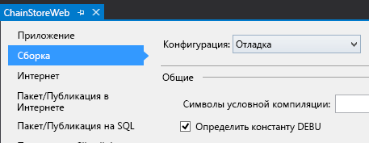
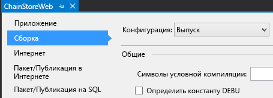

# <a name="handle-list-item-events-in-the-provider-hosted-add-in"></a>Обработка событий элементов списков в надстройке с размещением у поставщика

Это десятая часть серии статей, посвященной основам разработки надстроек, размещаемых у поставщика. Для начала вам следует ознакомиться со статьей [Надстройки SharePoint](sharepoint-add-ins.md) и предыдущими статьями из этой серии.

-  [Знакомство с созданием надстроек SharePoint с размещением у поставщика](get-started-creating-provider-hosted-sharepoint-add-ins.md)
-  [Настройка внешнего вида надстройки SharePoint, размещенной у поставщика](give-your-provider-hosted-add-in-the-sharepoint-look-and-feel.md)
-  [Добавление настраиваемой кнопки в надстройку, размещенную у поставщика](include-a-custom-button-in-the-provider-hosted-add-in.md)
-  [Краткий обзор объектной модели SharePoint](get-a-quick-overview-of-the-sharepoint-object-model.md)
-  [Добавление операций записи SharePoint в надстройку, размещенную у поставщика](add-sharepoint-write-operations-to-the-provider-hosted-add-in.md)
-  [Добавление веб-части надстройки в надстройку, размещенную у поставщика](include-an-add-in-part-in-the-provider-hosted-add-in.md)
-  [Обработка событий надстройки, размещенной у поставщика](handle-add-in-events-in-the-provider-hosted-add-in.md)
-  [Добавление логики, выполняемой при первом запуске, в надстройку, размещаемую у поставщика](add-first-run-logic-to-the-provider-hosted-add-in.md)
-  [Программное развертывание настраиваемой кнопки в надстройке, размещаемой у поставщика](programmatically-deploy-a-custom-button-in-the-provider-hosted-add-in.md)

> [!NOTE]
> Если вы изучали предыдущие статьи из этой серии о надстройках, размещаемых у поставщика, то у вас уже есть решение для Visual Studio, которое можно использовать для работы с этой статьей. Кроме того, вы можете скачать репозиторий на веб-странице [SharePoint_Provider-hosted_Add-Ins_Tutorials](https://github.com/OfficeDev/SharePoint_Provider-hosted_Add-ins_Tutorials) и открыть файл BeforeRER.sln.

В одной из предыдущих статей этой серии мы рассказывали, что при размещении заказа он добавляется в таблицу **Orders** (Заказы) в корпоративной базе данных, а соответствующий ему элемент автоматически добавляется в список **Expected Shipments** (Ожидаемые отгрузки). Когда заказ прибывает в местный магазин, пользователь указывает в столбце **Arrived** (Прибыл) значение **Yes** (Да). При изменении значения поля для элемента создается событие обновления элемента, для которого можно добавить настраиваемый обработчик. 

Изучая эту статью, вы создадите обработчик данного события элемента списка, а затем программным способом развернете его в коде, выполняемом при первом запуске надстройки SharePoint. Обработчик добавит элемент в таблицу **Inventory** (Запасы) корпоративной базы данных. Затем он задаст в столбце **Added to Inventory** (Добавлен в запасы) списка **Expected Shipments** (Ожидаемые отгрузки) значение **Yes** (Да). Вы также узнаете, как не допустить, чтобы это второе событие обновления элемента создало бесконечный ряд событий обновления элемента.

## <a name="programmatically-deploy-the-expected-shipments-list"></a>Программное развертывание списка Expected Shipments (Ожидаемые отгрузки)

> [!NOTE]
> Когда решение открывается повторно, для параметров раздела "Запускаемые проекты" в Visual Studio обычно возвращаются значения по умолчанию. Сразу же после повторного открытия примера решения согласно инструкциям из этой серии статей всегда делайте вот что: 
> 1. В верхней части **обозревателя решений** щелкните узел решения правой кнопкой мыши и выберите пункт **Назначить запускаемые проекты**.  
> 2. Убедитесь, что в столбце **Действие** для всех трех проектов указано значение **Запуск**.

1. В **обозревателе решений** откройте файл Utilities\SharePointComponentDeployer.cs проекта **ChainStoreWeb**. Добавьте указанный ниже метод в класс `SharePointComponentDeployer`. 

     ```C#
      private static void CreateExpectedShipmentsList()
     {
        using (var clientContext = sPContext.CreateUserClientContextForSPHost())
        {
        var query = from list in clientContext.Web.Lists
                where list.Title == "Expected Shipments"
                select list;
        IEnumerable<List> matchingLists = clientContext.LoadQuery(query);
        clientContext.ExecuteQuery();

        if (matchingLists.Count() == 0)
        {
            ListCreationInformation listInfo = new ListCreationInformation();
            listInfo.Title = "Expected Shipments";
            listInfo.TemplateType = (int)ListTemplateType.GenericList;
            listInfo.Url = "Lists/ExpectedShipments";
            List expectedShipmentsList = clientContext.Web.Lists.Add(listInfo);

            Field field = expectedShipmentsList.Fields.GetByInternalNameOrTitle("Title");
            field.Title = "Product";
            field.Update();

            expectedShipmentsList.Fields.AddFieldAsXml("<Field DisplayName='Supplier'" 
                                    + " Type='Text' />", 
                                    true,
                                    AddFieldOptions.DefaultValue);
            expectedShipmentsList.Fields.AddFieldAsXml("<Field DisplayName='Quantity'" 
                                    + " Type='Number'" 
                                    + " Required='TRUE' >" 
                                    + "<Default>1</Default></Field>",
                                    true, 
                                    AddFieldOptions.DefaultValue);
            expectedShipmentsList.Fields.AddFieldAsXml("<Field DisplayName='Arrived'" 
                                   + " Type='Boolean'"
                                   + " ShowInNewForm='FALSE'>"
                                   + "<Default>FALSE</Default></Field>",
                                    true, 
                                    AddFieldOptions.DefaultValue);
            expectedShipmentsList.Fields.AddFieldAsXml("<Field DisplayName='Added to Inventory'" 
                                    + " Type='Boolean'" 
                                    + " ShowInNewForm='FALSE'>"
                                    + "<Default>FALSE</Default></Field>", 
                                    true, 
                                    AddFieldOptions.DefaultValue);

            clientContext.ExecuteQuery();
        }
         }
     }
     ```

    В этом коде нет новой функциональности, которой не было в предыдущей статье этой серии, но следует обратить внимание на вот что:
   
    - Код присваивает атрибуту **Required** поля **Quantity** (Количество) значение **TRUE**, поэтому это поле всегда должно иметь значение. Затем он задает число 1 в качестве значения, используемого по умолчанию.
   
    - В форме New Item (Новый элемент) поля **Arrived** (Прибыл) и **Added to Inventory** (Добавлен в запасы) скрыты.
   
    - В идеальном случае в форме Edit Item (Изменение элемента) поле **Added to Inventory** (Добавлен в запасы) тоже должно быть скрыто, так как его значение следует изменить на **Yes** (Да), только когда обработчик события обновления элемента в первый раз добавит элемент в корпоративную таблицу **Inventory** (Запасы). По техническим причинам, о которых мы расскажем на одном из следующих этапов, это поле должно отображаться в форме Edit Item (Изменение элемента), чтобы программным способом записывать в него данные из обработчика события обновления элемента.


2. В методе **DeployChainStoreComponentsToHostWeb** добавьте указанную ниже строку перед строкой `RemoteTenantVersion = localTenantVersion`.
    
    ```C#
      CreateExpectedShipmentsList();
    ```

## <a name="create-the-list-item-event-receiver"></a>Создание приемника событий элемента списка

> [!NOTE]
> Если вы работали со статьями этой серии, то, скорее всего, уже настроили собственную среду разработки для отладки удаленных приемников событий. Если вы еще не сделали этого, то прежде чем перейти к другим разделам этой статьи, прочитайте раздел [Настройка решения для отладки приемника событий](handle-add-in-events-in-the-provider-hosted-add-in.md#RERDebug).

Пакет "Инструменты разработчика Office для Visual Studio" включает элемент **Удаленный приемник событий**, который можно добавить в надстройку SharePoint. На момент написания данной статьи для этого элемента проекта предполагается, что список (для которого будет зарегистрирован приемник) находится на сайте надстройки и, соответственно, пакет инструментов создает сайт надстройки, а также ряд содержащихся в нем артефактов SharePoint. Кроме того, предполагается, что приемник для надстройки Chain Store будет зарегистрирован (на одном из следующих этапов) для списка **Expected Shipments** (Ожидаемые отгрузки) на хост-сайте, поэтому для надстройки не требуется сайт надстройки. (Сведения о различиях между сайтами надстроек и хост-сайтами см. в статье [Надстройки SharePoint](sharepoint-add-ins.md).)
 
> [!NOTE]
> Приемники событий списка и элемента списка называются удаленными приемниками событий, так как их код является удаленным по отношению к SharePoint и размещен либо в облаке, либо на локальном сервере за пределами фермы SharePoint. Тем не менее события, запускающие их, находятся в SharePoint.

1. В **обозревателе решений** щелкните правой кнопкой мыши папку **Службы** в проекте **ChainStoreWeb** и выберите **Добавить** > **Служба WCF**.

2. Когда отобразится соответствующий запрос, укажите для службы имя **RemoteEventReceiver1**, а затем нажмите кнопку **OK**. 

3. Пакет инструментов создаст файл интерфейса, файл \*.svc и файл кода программной части. Нам не потребуется файл интерфейса IRemoteEventReceiver1.cs, поэтому удалите его. (Возможно, пакет инструментов открыл его автоматически. В этом случае закройте файл, а затем удалите его.)
    
   > [!NOTE]
   > Когда вы создавали приемники событий надстройки для событий установки и удаления в одной из предыдущих статей этой серии, пакет "Инструменты разработчика Office для Visual Studio" добавил их URL-адреса в файл манифеста приложения. Приемники событий списка и элемента списка не зарегистрированы в манифесте приложения. Их необходимо зарегистрировать программным способом (в надстройке, размещаемой у поставщика). Вы сделаете это на одном из следующих этапов.

4. Откройте файл кода программной части RemoteEventReceiver1.svc.cs. Замените все его содержимое указанным ниже кодом. 

    ```C#
      using System;
    using System.Collections.Generic;
    using Microsoft.SharePoint.Client;
    using Microsoft.SharePoint.Client.EventReceivers;
    using System.Data.SqlClient;
    using System.Data;
    using ChainStoreWeb.Utilities;

    namespace ChainStoreWeb.Services
    {
        public class RemoteEventReceiver1 : IRemoteEventService
        {
        /// <summary>
        /// Handles events that occur before an action occurs, 
        /// such as when a user is adding or deleting a list item.
        /// </summary>
        /// <param name="properties">Holds information about the remote event.</param>
        /// <returns>Holds information returned from the remote event.</returns>
        public SPRemoteEventResult ProcessEvent(SPRemoteEventProperties properties)
        {
            throw new NotImplementedException();
        }

        /// <summary>
        /// Handles events that occur after an action occurs, 
        /// such as after a user adds an item to a list or deletes an item from a list.
        /// </summary>
        /// <param name="properties">Holds information about the remote event.</param>
        public void ProcessOneWayEvent(SPRemoteEventProperties properties)
        {

        }
        }
    }
    ```

   Обратите внимание на следующие особенности этого кода:
    
   - Интерфейс `IRemoteEventService` определен в пространстве имен **Microsoft.SharePoint.Client.EventReceivers**.
    
   - В надстройке Chain Store не будут обрабатываться никакие события, возникающие до выполнения какого-либо действия, но метод **ProcessEvent** является обязательным для интерфейса `IRemoteEventService`.

5. Добавьте указанный ниже код в метод **ProcessOneWayEvent**. Обратите внимание, что **ItemUpdated** — единственное событие, которое будет обрабатываться в этом примере, поэтому вместо структуры **switch** можно использовать простую структуру **if**. Приемники событий обычно обрабатывают несколько событий, поэтому желательно, чтобы вы изучили шаблон, который вы (как разработчик надстроек SharePoint) чаще всего будете использовать в своих обработчиках событий.
    
    ```C#
      switch (properties.EventType)
    {
        case SPRemoteEventType.ItemUpdated:

        // TODO12: Handle the item updated event.

        break;
    }  
    ```

6. Замените `TODO12` указанным ниже кодом. Здесь мы опять используем структуру **switch**, когда достаточно использовать простую структуру **if**, чтобы показать вам стандартный шаблон, используемый в приемниках событий SharePoint.
    
    ```C#
      switch (properties.ItemEventProperties.ListTitle)
    {
        case "Expected Shipments":

        // TODO13: Handle the arrival of a shipment.

        break;
    }
    ```

7. Код, который реагирует на прибытие отгруженного товара, должен выполнять два указанных ниже действия.
    
   - Добавьте элемент, который прибыл в магазин, в корпоративные запасы.
    
   - Задавать для поля **Added to Inventory** (Добавлен в запасы) в списке **Expected Shipments** (Ожидаемые отгрузки) значение **Yes** (Да). Но это должно происходить, только если элемент успешно добавлен в запасы.
    
   Добавьте указанный ниже код вместо `TODO13`. Два метода (`TryUpdateInventory` и `RecordInventoryUpdateLocally`) будут созданы на дальнейших этапах.

    ```C#
      bool updateComplete = TryUpdateInventory(properties);
    if (updateComplete)
    {
        RecordInventoryUpdateLocally(properties);
    }
    ```


8. Теперь метод **ProcessOneWayEvent** должен выглядеть вот так:

    ```C#
      public void ProcessOneWayEvent(SPRemoteEventProperties properties)
    {
        switch (properties.EventType)
        {
        case SPRemoteEventType.ItemUpdated:

            switch (properties.ItemEventProperties.ListTitle)
            {
            case "Expected Shipments":
                bool updateComplete = UpdateInventory(properties);
                if (updateComplete)
                {
                RecordInventoryUpdateLocally(properties);
                }
                break;
            }
            break;
        }          
    }
    ```

9. Добавьте указанный ниже метод в класс `RemoteEventReceiver1`.
    
    ```C#
      private bool TryUpdateInventory(SPRemoteEventProperties properties)
    {
        bool successFlag = false;

        // TODO14: Test whether the list item is changing because the product has arrived
        // or for some other reason. If the former, add it to the inventory and set the success flag
        // to true.     

        return successFlag;
    }
    ```

10. Список **Expected Shipments** (Ожидаемые отгрузки) включает пять столбцов, но нам не нужно, чтобы обработчик реагировал на большинство видов обновлений элемента. Например, если пользователь исправляет написание имени поставщика, запускается событие обновления элемента, но при этом обработчик не должен ничего делать. Он должен действовать, только когда в поле **Arrived** (Прибыл) задано значение **Yes** (Да). 
    
    Необходимо проверить еще одно условие. Предположим, что в поле **Arrived** (Прибыл) задано значение **Yes** (Да), а продукт в элементе добавлен в запасы (соответственно, поле **Added to Inventory** (Добавлен в запасы) имеет значение **Yes** (Да)). Но позже пользователь по ошибке изменяет значение поля **Arrived** (Прибыл) для отгрузки обратно на **No** (Нет), а затем исправляет свою ошибку, снова присвоив полю значение **Yes** (Да). Ошибка и ее исправление создают событие обновления элемента. Обработчик не будет реагировать на ошибку, так как он срабатывает только если полю **Arrived** (Прибыл) присваивается значение **Yes** (Да). Обработчик среагирует на исправление, при котором полю **Arrived** (Прибыл) снова будет присвоено значение **Yes** (Да), поэтому один продукт в одном и том же количестве будет еще раз добавлен в запасы. По этой причине обработчик должен срабатывать, только когда поле **Added to Inventory** (Добавлен в запасы) имеет значение **No** (Нет). 
    
    Таким образом, обработчику необходимо "знать" значения этих полей, как только пользователь обновит элемент. У объекта **SPRemoteEventProperties** есть свойство **ItemEventProperties**. В свою очередь, у этого свойства имеется индексированное свойство **AfterProperties**, в котором хранятся значения полей обновленного элемента. В коде ниже эти свойства используются, чтобы проверить, необходимо ли срабатывать обработчику. Вставьте этот код вместо `TODO14`.

     ```C#
      var arrived = Convert.ToBoolean(properties.ItemEventProperties.AfterProperties["Arrived"]);
    var addedToInventory = Convert.ToBoolean(properties.ItemEventProperties.AfterProperties["Added_x0020_to_x0020_Inventory"]);

    if (arrived &amp;&amp; !addedToInventory)
    {

        // TODO15: Add the item to inventory

        successFlag = true;
    }
     ```

11. Замените `TODO15` указанным ниже кодом. 

     ```C#
      using (SqlConnection conn = SQLAzureUtilities.GetActiveSqlConnection())
    using (SqlCommand cmd = conn.CreateCommand())
    {
        conn.Open();
        cmd.CommandText = "UpdateInventory";
        cmd.CommandType = CommandType.StoredProcedure;
        SqlParameter tenant = cmd.Parameters.Add("@Tenant", SqlDbType.NVarChar);
        tenant.Value = properties.ItemEventProperties.WebUrl + "/";
        SqlParameter product = cmd.Parameters.Add("@ItemName", SqlDbType.NVarChar, 50);
        product.Value = properties.ItemEventProperties.AfterProperties["Title"]; // not "Product"
        SqlParameter quantity = cmd.Parameters.Add("@Quantity", SqlDbType.SmallInt);
        quantity.Value = Convert.ToUInt16(properties.ItemEventProperties.AfterProperties["Quantity"]);
        cmd.ExecuteNonQuery();
    }
     ```

    Здесь в основном используется программирование для SQL и ASP.NET, и мы не будем подробно рассматривать его, но при этом учтите вот что:
    
    - Мы используем свойство **ItemEventProperties.WebUrl** для получения имени клиента, представляющего собой URL-адрес хост-сайта.

    - Мы еще раз используем свойство **AfterProperties**, чтобы получить значения имени и количества продукта.
    
    - Мы ссылаемся на поле имени продукта, используя имя Title (Название), даже несмотря на то, что в методе **CreateExpectedShipmentsList** отображаемое имя было изменено на Product (Продукт), так как для ссылки на поля всегда используются внутренние имена полей.
 

12. Мы еще не закончили работу с методом **TryUpdateInventory**, но сейчас он должен выглядеть вот так:
    
     ```C#
      private bool TryUpdateInventory(SPRemoteEventProperties properties)
    {
        bool successFlag = false;

        var arrived = Convert.ToBoolean(properties.ItemEventProperties.AfterProperties["Arrived"]);
        var addedToInventory = Convert.ToBoolean(properties.ItemEventProperties.AfterProperties["Added_x0020_to_x0020_Inventory"]);

        if (arrived &amp;&amp; !addedToInventory)
        {
        using (SqlConnection conn = SQLAzureUtilities.GetActiveSqlConnection())
        using (SqlCommand cmd = conn.CreateCommand())
        {
            conn.Open();
            cmd.CommandText = "UpdateInventory";
            cmd.CommandType = CommandType.StoredProcedure;
            SqlParameter tenant = cmd.Parameters.Add("@Tenant", SqlDbType.NVarChar);
            tenant.Value = properties.ItemEventProperties.WebUrl + "/";
            SqlParameter product = cmd.Parameters.Add("@ItemName", SqlDbType.NVarChar, 50);
            product.Value = properties.ItemEventProperties.AfterProperties["Title"]; // not "Product"
            SqlParameter quantity = cmd.Parameters.Add("@Quantity", SqlDbType.SmallInt);
            quantity.Value = Convert.ToUInt16(properties.ItemEventProperties.AfterProperties["Quantity"]);
            cmd.ExecuteNonQuery();
        }            
        successFlag = true;
        }  
        return successFlag;
    }
     ```

13. Когда метод **TryUpdateInventory** возвращает значение **true**, наш обработчик вызывает (еще не написанный) метод, который обновляет тот же элемент в списке **Expected Shipments** (Ожидаемые отгрузки), задавая для поля **Added to Inventory** (Добавлен в запасы) значение **Yes** (Да). Он представляет собой событие обновления элемента, поэтому обработчик будет вызван еще раз. (Так как теперь поле **Added to Inventory** (Добавлен в запасы) имеет значение **Yes** (Да), обработчик не будет еще раз добавлять одну и ту же отгрузку на склад, но при этом он по-прежнему будет вызван.) 
    
    Когда событие обновления элемента возникает вследствие обновления программным путем, SharePoint ведет себя немного по-другому: *он включает в свойство __AfterProperties__ только поля, которые изменились при обновлении.* Таким образом, поле **Arrived** (Прибыл) будет отсутствовать, так как изменено только поле **Added to Inventory** (Добавлен в запасы). 
    
    При выполнении строки
    
    `var arrived = Convert.ToBoolean(properties.ItemEventProperties.AfterProperties["Arrived"]);`
    
    возникнет исключение **KeyNotFoundException**. 
    
    Существует несколько способов решения этой проблемы. В данном примере мы собираемся перехватить исключение и использовать блок **catch**, чтобы присвоить параметру  `successFlag` значение **false**. Благодаря этому элемент не будет обновлен в третий раз.
    
    Добавьте все в метод, который находится между первой строкой (`bool successFlag = false;`) и последней строкой (`return successFlag;`) в блоке **try**.
    
14. Добавьте указанный ниже блок **catch** сразу после блока **try**.
    
     ```C#
      catch (KeyNotFoundException)
    {
        successFlag = false;
    }
     ```

    > [!NOTE]
    > Исключение **KeyNotFoundException** — это еще одна причина, по которой нам придется оставить поле **Added to Inventory** (Добавлен в запасы) видимым в форме Edit Item (Изменение элемента). SharePoint не включает в свойство **AfterProperties** скрытые поля формы Edit Item (Изменение элемента).

15. Теперь весь метод должен выглядеть вот так:

     ```C#
      private bool TryUpdateInventory(SPRemoteEventProperties properties)
    {
        bool successFlag = false;

        try 
        {
        var arrived = Convert.ToBoolean(properties.ItemEventProperties.AfterProperties["Arrived"]);
        var addedToInventory = Convert.ToBoolean(properties.ItemEventProperties.AfterProperties["Added_x0020_to_x0020_Inventory"]);

        if (arrived &amp;&amp; !addedToInventory)
        {
            using (SqlConnection conn = SQLAzureUtilities.GetActiveSqlConnection())
            using (SqlCommand cmd = conn.CreateCommand())
            {
            conn.Open();
            cmd.CommandText = "UpdateInventory";
            cmd.CommandType = CommandType.StoredProcedure;
            SqlParameter tenant = cmd.Parameters.Add("@Tenant", SqlDbType.NVarChar);
            tenant.Value = properties.ItemEventProperties.WebUrl + "/";
            SqlParameter product = cmd.Parameters.Add("@ItemName", SqlDbType.NVarChar, 50);
            product.Value = properties.ItemEventProperties.AfterProperties["Title"]; // not "Product"
            SqlParameter quantity = cmd.Parameters.Add("@Quantity", SqlDbType.SmallInt);
            quantity.Value = Convert.ToUInt16(properties.ItemEventProperties.AfterProperties["Quantity"]);
            cmd.ExecuteNonQuery();
            }            
            successFlag = true;
        }  
        }
        catch (KeyNotFoundException)
        {
        successFlag = false;
        }
        return successFlag;
    }
     ```

16. Добавьте указанный ниже метод в класс `RemoteEventReceiver1`. 

     ```C#
      private void RecordInventoryUpdateLocally(SPRemoteEventProperties properties)
    {
        using (ClientContext clientContext = TokenHelper.CreateRemoteEventReceiverClientContext(properties))
        {
        List expectedShipmentslist = clientContext.Web.Lists.GetByTitle(properties.ItemEventProperties.ListTitle);
        ListItem arrivedItem = expectedShipmentslist.GetItemById(properties.ItemEventProperties.ListItemId);
        arrivedItem["Added_x0020_to_x0020_Inventory"] = true;
        arrivedItem.Update();
        clientContext.ExecuteQuery();
        }
    }
     ```

    Этот шаблон кода должен быть знаком вам по предыдущим статьям этой серии. Тем не менее есть одно отличие.
    
    - Код получает объект **ClientContext**, вызывая метод **TokenHelper.CreateRemoteEventReceiverClientContext**, а не метод **SharePointContext.CreateUserClientContextForSPHost**, который мы использовали в коде, который вызывался в SharePoint из страниц, например из страницы EmployeeAdder. 
    
    - Основная причина использования разных методов для получения объекта **ClientContext** состоит в том, что SharePoint передает приемникам событий сведения, необходимые для создания таких объектов, по-другому, чем страницам. Что касается приемников событий, он передает объект **SPRemoteEventProperties**, а в случае страниц он передает специальное поле, называемое маркером контекста, в тексте запроса, запускающего страницу надстройки.

17. Сохраните и закройте файл кода приемника.
    
## <a name="register-the-receiver"></a>Регистрация приемника

Последняя задача, которую необходимо выполнить, это сообщить SharePoint, что у нас имеется пользовательский приемник и мы хотим, чтобы SharePoint вызывал его при обновлении элемента в списке **Expected Shipments** (Ожидаемые отгрузки).

1. Откройте файл SharePointContentDeployer.cs и добавьте указанную ниже строку в метод **DeployChainStoreComponentsToHostWeb** сразу же после строки, в которой создается список **Expected Shipments** (Ожидаемые отгрузки). Мы добавим этот метод на следующем этапе. Обратите внимание, что в метод мы передаем объект **HttpRequest**, который начальная страница надстройки передавала в метод **DeployChainStoreComponentsToHostWeb**.
    
    ```C#
      RegisterExpectedShipmentsEventHandler(request);
    ```

2. Добавьте указанный ниже метод в класс `SharePointComponentDeployer`.
    
    ```C#
      private static void RegisterExpectedShipmentsEventHandler(HttpRequest request)
    {
        using (var clientContext = sPContext.CreateUserClientContextForSPHost())    
        {
        var query = from list in clientContext.Web.Lists
                where list.Title == "Expected Shipments"
                select list;
        IEnumerable<List> matchingLists = clientContext.LoadQuery(query);
        clientContext.ExecuteQuery();

        List expectedShipmentsList = matchingLists.Single();

        // TODO16: Add the event receiver to the list's collection of event receivers.       

        clientContext.ExecuteQuery();
        }
    }
    ```

3. Замените `TODO16` указанными ниже строками. Обратите внимание, что для приемников событий существует "легковесный" класс **CreationInformation**, аналогичный тому, который используется для списков и элементов списков.
    
    ```C#
    EventReceiverDefinitionCreationInformation receiver = new EventReceiverDefinitionCreationInformation();
    receiver.ReceiverName = "ExpectedShipmentsItemUpdated";
    receiver.EventType = EventReceiverType.ItemUpdated;

     // TODO17: Set the URL of the receiver.

    expectedShipmentsList.EventReceivers.Add(receiver);

    ```

4. Теперь вам необходимо сообщить SharePoint URL-адрес приемника событий. В рабочей среде это будет тот же домен, что и для удаленных страниц (с путем /Services/RemoteEventReceiver1.svc). Так как обработчик зарегистрирован в коде, выполняемом при первом запуске и размещенном на начальной странице надстройки, то домен находится в заголовке узла объекта **HttpRequest** для запроса, вызвавшего эту страницу. Наш код передал этот объект из страницы в метод **DeployChainStoreComponentsToHostWeb**, который затем передал его в метод **RegisterExpectedShipmentsEventHandler**. Поэтому мы можем задать URL-адрес приемника с помощью указанного ниже кода.
    
    `receiver.ReceiverUrl = "https://" + request.Headers["Host"] + "/Services/RemoteEventReceiver1.svc";`
    
   К сожалению, этот способ не будет работать при отладке надстройки в Visual Studio. Когда вы выполняете отладку, приемник размещен в служебной шине Azure, а не по URL-адресу localhost, по которому размещены удаленные страницы. Нам необходимо использовать разные URL-адреса для приемника в зависимости от того, выполняем ли мы отладку, поэтому замените `TODO17` указанной ниже структурой, в которой используются директивы компилятора C#. Обратите внимание, что в режиме отладки URL-адрес приемника считывается из параметра web.config (он будет создан на одном из следующих этапов). 

    ```C#
      #if DEBUG
                receiver.ReceiverUrl = WebConfigurationManager.AppSettings["RERdebuggingServiceBusUrl"].ToString();
    #else
                receiver.ReceiverUrl = "https://" + request.Headers["Host"] + "/Services/RemoteEventReceiver1.svc"; 
    #endif

    ```


5. Теперь весь метод **RegisterExpectedShipmentsEventHandler** должен выглядеть вот так:
    
    ```C#
      private static void RegisterExpectedShipmentsEventHandler(HttpRequest request)
    {    
        using (var clientContext = sPContext.CreateUserClientContextForSPHost())
        {
        var query = from list in clientContext.Web.Lists
                    where list.Title == "Expected Shipments"
                    select list;
        IEnumerable<List> matchingLists = clientContext.LoadQuery(query);
        clientContext.ExecuteQuery();

        List expectedShipmentsList = matchingLists.Single();

        EventReceiverDefinitionCreationInformation receiver = new EventReceiverDefinitionCreationInformation();
        receiver.ReceiverName = "ExpectedShipmentsItemUpdated";
        receiver.EventType = EventReceiverType.ItemUpdated;

    #if DEBUG
        receiver.ReceiverUrl = WebConfigurationManager.AppSettings["RERdebuggingServiceBusUrl"].ToString();
    #else
        receiver.ReceiverUrl = "https://" + request.Headers["Host"] + "/Services/RemoteEventReceiver1.svc"; 
    #endif
        expectedShipmentsList.EventReceivers.Add(receiver);
        clientContext.ExecuteQuery();
        }
    }
    ```

6. Добавьте указанный ниже оператор **using** в начало файла.
    
    ```C#
      using System.Web.Configuration;
    ```

7. Чтобы убедиться, что параметр `DEBUG` имеет значение true (Истина) исключительно во время отладки надстройки, сделайте вот что:
    
   1. В **обозревателе решений** щелкните правой кнопкой мыши проект **ChainStoreWeb** и выберите пункт **Свойства**.
   
   2. Перейдите на вкладку **Сборка** в разделе **Свойства**, а затем выберите пункт **Отладка** вверху в раскрывающемся списке **Конфигурация**.
   
   3. Проверьте, установлен ли флажок **Определить константу DEBUG** (обычно он установлен по умолчанию). На снимке экрана ниже показаны правильные настройки.

      *Рис. 1. Вложенная вкладка "Сборка" на вкладке "Свойства" в Visual Studio*

      

   4. В раскрывающемся списке **Конфигурация** выберите пункт **Выпуск**, а затем убедитесь, что флажок **Определить константу DEBUG** *не* установлен (обычно по умолчанию он не установлен). Правильные настройки показаны на снимке экрана ниже.
  
      *Рис. 2. Вложенная вкладка "Сборка" на вкладке "Свойства" со снятым флажком*

      

   5. Если вы внесли какие-либо изменения, сохраните их, а затем закройте вкладку **Свойства**.
    
 
8. Откройте файл web.config, а затем добавьте указанную ниже разметку в качестве дочерней разметки для элемента **appSettings**. Мы получим значение этого параметра в следующем разделе.
    
    ```XML
      <add key="RERdebuggingServiceBusUrl" value="" />
    ```

## <a name="get-the-receiver-url-for-debugging"></a>Получение URL-адреса приемника для отладки

Приемники событий надстройки и событий элементов списков представляют собой службы WCF. При этом каждая такая служба "знает" свою конечную точку и хранит ее в разных местах, включая объект **System.ServiceModel.OperationContext.Current.Channel.LocalAddress.Uri**. 

Когда вы выполняете отладку, приемник надстройки размещен в конечной точке служебной шины Azure, которая почти не отличается от конечной точки для приемника элемента списка. Разница состоит в том, что URL-адрес конечной точки надстройки имеет окончание AppEventReceiver.svc, а URL-адрес приемника элемента списка — RemoteEventReceiver1.svc. Таким образом, мы можем получить URL-адрес конечной точки в приемнике надстройки, немного изменить его окончание, а затем использовать его в качестве значения параметра **RERdebuggingServiceBusUrl** в файле web.config.

1. Откройте файл AppEventReceiver.svc.cs в папке **Services** (Службы) проекта **ChainStoreWeb**.

2. Добавьте указанный ниже код в качестве самой первой строки в методе **ProcessEvent**.
    
    ```C#
      string debugEndpoint = System.ServiceModel.OperationContext.Current.Channel.LocalAddress.Uri.ToString(); 
    ```

3. Добавьте точку останова в указанную ниже строку метода.

4. Нажмите клавишу F5 для отладки надстройки. Так как файл web.config открыт, а пакет "Инструменты разработчика Office для Visual Studio" изменяет параметр при каждом нажатии клавиши F5, вам будет предложено перезагрузить его. Выберите вариант **Да**. 

5. При достижении точки останова наведите курсор на переменную `debugEndpoint`. Когда появится подсказка по данным Visual Studio, щелкните стрелку вниз и выберите пункт **Средство визуализации текста**.
  
   *Рис. 3. Средство визуализации текста в Visual Studio с URL-адресом служебной шины Azure*

   

6. Скопируйте значение строки из средства визуализации и вставьте его куда-нибудь.

7. Закройте средство визуализации, а затем остановите отладку в Visual Studio.

8. Удалите или закомментируйте строку, которую вы добавили на втором этапе этой процедуры, а затем удалите точку останова.

9. В скопированной вами строке замените текст AppEventReceiver.svc в конце текстом RemoteEventReceiver1.svc.

10. Скопируйте и вставьте измененный URL-адрес в качестве значения ключа **RERdebuggingServiceBusUrl** в файле web.config.

> [!NOTE]
> Ручное копирование URL-адреса служебной шины и последующая вставка его измененной версии в файл web.config — это не единственный способ решить вопрос использования разных URL-адресов при отладке удаленного приемника событий, когда он работает в рабочей среде.  Мы можем программно сохранить значение **System.ServiceModel.OperationContext.Current.Channel.LocalAddress.Uri** в SharePoint или удаленной базе данных, а затем наш код, выполняемый при первом запуске, может прочитать и назначить его свойству `receiver.ReceiverUrl`.  Мы можем зарегистрировать приемник событий элемента списка в качестве части установленного надстройкой обработчика событий. Затем мы можем программно прочитать **System.ServiceModel.OperationContext.Current.Channel.LocalAddress.Uri**, изменить и назначить его `receiver.ReceiverUrl` без необходимости сохранения. 
>
> Для реализации этой стратегии также потребуется создать список **Expected Shipments** (Ожидаемые отгрузки) в установленном надстройкой обработчике событий, так как он должен существовать, прежде чем для него можно будет зарегистрировать обработчик. 
>
> Кроме того, обратите внимание, что мы можем объединить наш приемник событий надстройки и приемник событий элемента списка в один приемник (то есть в одни и те же SVC- и SVC.CS-файлы). В этом случае в URL-адрес не нужно вносить никаких изменений, прежде чем использовать его в качестве значения для `receiver.ReceiverUrl`.

## <a name="run-the-add-in-and-test-the-list-item-receiver"></a>Запуск надстройки и тестирование приемника элемента списка

1. Откройте страницу **Site Contents** (Содержание сайта) веб-сайта магазина в Гонконге и удалите список **Expected Shipments** (Ожидаемые отгрузки), если он там есть. 

2. Нажмите клавишу F5, чтобы развернуть и запустить надстройку. Редактор Visual Studio размещает удаленное веб-приложение в IIS Express, а базу данных SQL — в SQL Express. Кроме того, он временно устанавливает надстройку на вашем тестовом сайте SharePoint и сразу же запускает ее. Прежде чем откроется начальная страница надстройки, вам будет предложено предоставить надстройке необходимые разрешения.

3. Когда откроется начальная страница надстройки, нажмите кнопку **Вернуться на сайт** на расположенном в верхней части элементе управления хрома.

4. С начальной страницы магазина в Гонконге перейдите на страницу **Site Contents** (Содержание сайта) и откройте список **Expected Shipments** (Ожидаемые отгрузки).

5. Создайте элемент. Обратите внимание, что в форме нового элемента не отображаются поля **Arrived** (Прибыл) и **Added to Inventory** (Добавлен в запасы).
 
6. После создания элемента повторно откройте его, чтобы внести изменения. Установите флажок **Arrived** (Прибыл) и сохраните элемент. В результате этих действий будет создано событие обновления элемента. Элемент будет добавлен в запасы, а значение поля **Added to Inventory** (Добавлен в запасы) — заменено на **Yes** (Да). Чтобы отобразить изменения в поле **Added to Inventory** (Добавлен в запасы) вам, возможно, потребуется обновить страницу.

7. Нажимайте кнопку "Назад" в браузере, пока не вернетесь на начальную страницу надстройки Chain Store, а затем нажмите кнопку **Show Inventory** (Отобразить запасы). Теперь в списке появится элемент, для которого вы задали значение **Arrived** (Прибыл).

8. Перейдите обратно к списку **Expected Shipments** (Ожидаемые отгрузки) и добавьте другой элемент *с точно такими же именем продукта и названием поставщика*, но с другим количеством.

9. После создания элемента повторно откройте его, чтобы внести изменения. Измените значение поля **Arrived** (Прибыл) на **Yes** (Да) и сохраните элемент.

10. Нажимайте кнопку "Назад" в браузере, пока не вернетесь на начальную страницу надстройки Chain Store, а затем нажмите кнопку **Show Inventory** (Отобразить запасы). Список по-прежнему будет включать один элемент с именем продукта и названием поставщика, но теперь его количество будет представлять собой сумму количеств двух элементов в списке **Expected Shipments** (Ожидаемые отгрузки).

11. Чтобы завершить сеанс отладки, закройте окно браузера или остановите отладку в Visual Studio. При каждом нажатии клавиши F5 Visual Studio отзывает предыдущую версию надстройки и устанавливает ее последнюю версию.

12. Вы будете работать с этой надстройкой и решением Visual Studio при изучении других статей, поэтому при перерывах в работе рекомендуем отзывать надстройку. В **обозревателе решений** щелкните проект правой кнопкой мыши и выберите пункт **Отозвать**.

## <a name="next-steps"></a>Дальнейшие действия
<a name="Nextsteps"> </a>

Чтобы узнать, как опубликовать надстройку на сайте SharePoint, см. статью [Развертывание и установка надстроек SharePoint: методы и параметры](deploying-and-installing-sharepoint-add-ins-methods-and-options.md). Подробные сведения о разработке надстроек SharePoint см. на следующих страницах:

-  [Проектирование надстроек SharePoint](design-sharepoint-add-ins.md)
-  [Разработка надстроек SharePoint](develop-sharepoint-add-ins.md)
-  [Публикация надстроек SharePoint](publish-sharepoint-add-ins.md)
-  [Средства и среды для разработки надстроек SharePoint](tools-and-environments-for-developing-sharepoint-add-ins.md)
    
 

