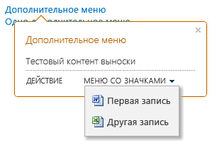

# <a name="highlight-content-and-enhance-the-functionality-of-sharepoint-hosted-sharepoint-add-ins-with-the-callout-control"></a><span data-ttu-id="1ed5d-102">Выделение контента и расширение функций надстроек с размещением в SharePoint с помощью элемента "Выноска"</span><span class="sxs-lookup"><span data-stu-id="1ed5d-102">Highlight content and enhance the functionality of SharePoint-hosted SharePoint Add-ins with the callout control</span></span>
<span data-ttu-id="1ed5d-p101">Элемент "Выноска" в SharePoint помогает привлечь внимание пользователя и продемонстрировать функции приложения, размещенного в SharePoint. Вы можете настраивать его различным образом в зависимости от требований к пользовательскому интерфейсу приложения. В этой статье рассказывается, как спроектировать такой элемент управления, добавить его на страницу, а также настроить его внешний вид и режим работы.</span><span class="sxs-lookup"><span data-stu-id="1ed5d-p101">The SharePoint callout control provides a flexible way to engage your user and showcase your SharePoint-hosted app's functionality. You can configure it in a variety of ways to suit your app's UI. This article shows you how to construct this control, add it to your page, and customize its appearance and behavior.</span></span>
 
<span data-ttu-id="1ed5d-p102">Выполняя поиск на сайте SharePoint, вы увидите примеры элемента управления "Выноска", так как он отображается каждый раз, когда вы наводите указатель на результат поиска. На рис. 1 показана выноска для отдельного результата поиска, а также представлено несколько типичных аспектов элемента управления контентом: заголовок, сведения об элементе на странице и действия (**Открыть** и **Отправить**), которые вы можете выполнить с этим элементом. В данном случае используются относительно простые сведения и действия, однако вы уже можете наблюдать два преимущества использования выноски: отображение дополнительных сведений об элементах на странице по мере необходимости и удобство добавления функций на страницу.</span><span class="sxs-lookup"><span data-stu-id="1ed5d-p102">When you do searches in a SharePoint site, you'll see examples of the callout control in action, as it pops up whenever you hover over a search result. Figure 1 shows the callout for a single search result and shows a few of the typical things in a content control: a title, some information about the item on the page, and actions ( **Open** and **Send**) that you can take on the item. In this case, the information and actions are relatively simple, but you can already see two advantages to using it. First, it lets you show additional information about elements in a page when that's needed, and second, it gives you an elegant way of adding functionality to the page.</span></span> 
 

<span data-ttu-id="1ed5d-110">**Рис. 1. Пример элемента управления "Выноска" на странице результатов поиска в SharePoint**</span><span class="sxs-lookup"><span data-stu-id="1ed5d-110">**Figure 1. Example of the callout control on a SharePoint search results page**</span></span>

 

 

 

 

 

 <span data-ttu-id="1ed5d-p103">**Примечание.** В настоящее время идет процесс замены названия "приложения для SharePoint" названием "надстройки SharePoint". Во время этого процесса в документации и пользовательском интерфейсе некоторых продуктов SharePoint и средств Visual Studio может по-прежнему использоваться термин "приложения для SharePoint". Дополнительные сведения см. в статье [Новое название приложений для Office и SharePoint](new-name-for-apps-for-sharepoint.md#bk_newname).</span><span class="sxs-lookup"><span data-stu-id="1ed5d-p103">**Note**  The name "apps for SharePoint" is changing to "SharePoint Add-ins". During the transition, the documentation and the UI of some SharePoint products and Visual Studio tools might still use the term "apps for SharePoint". For details, see  [New name for apps for Office and SharePoint](new-name-for-apps-for-sharepoint.md#bk_newname).</span></span>
 


## <a name="make-the-control-available-to-your-html-page-by-including-the-calloutjs-file"></a><span data-ttu-id="1ed5d-115">Предоставление HTML-странице доступа к элементу управления путем добавления файла callout.js</span><span class="sxs-lookup"><span data-stu-id="1ed5d-115">Make the control available to your HTML page by including the callout.js file</span></span>
<span data-ttu-id="1ed5d-116"><a name="GettingStarted"> </a></span><span class="sxs-lookup"><span data-stu-id="1ed5d-116"></span></span>

<span data-ttu-id="1ed5d-117">В этом примере используется метод `SP.SOD.executeFunc`, чтобы гарантировать, что файл скрипта загрузится до выполнения какого-либо кода, ссылающегося на него.</span><span class="sxs-lookup"><span data-stu-id="1ed5d-117">This example uses the  `SP.SOD.executeFunc` method to ensure that the script file loads before you run any code that depends on it.</span></span>
 

 

```
SP.SOD.executeFunc("callout.js", "Callout", function () {
    });
```

<span data-ttu-id="1ed5d-p104">Функция, которую вы передаете в функцию  `SP.SOD.executeFunc`, содержит код, который вы хотите выполнить после загрузки файла callout.js. Когда эти файлы загрузятся, используйте объект  `CalloutManager`, чтобы создать объект  `Callout` для каждого элемента страницы, которому требуется иметь сопоставленный с ним элемент управления выносками. `CalloutManager` это одноэлементный объект, хранящий ссылки на каждый объект `Callout` на странице внутри массива ассоциативных элементов. Объект `Callout` имеет всего два обязательных члена: `ID` и `launchPoint`. Член  `ID` это ключ, сопоставленный с объектом `Callout` в `CalloutManager`:  `CalloutManager["value of the callout's ID member"]`. Член  `launchPoint` это элемент HTML-страницы. Вы можете, например, создать или получить элемент `div` на своей странице и передать его в качестве члена объекта `Callout`. По умолчанию элемент управления выносками отображается при щелчке пользователем элемента  `launchPoint`. В этом примере показано, как создать простейший элемент управления выносками всего с одним из обязательных членов и строкой заголовка.</span><span class="sxs-lookup"><span data-stu-id="1ed5d-p104">The function that you pass to the  `SP.SOD.executeFunc` function contains the code that you want to run after the callout.js file loads. After you load those files, you use the `CalloutManager` object to create a `Callout` object for each page element that needs to have a callout control associated with it. The `CalloutManager` is a singleton that stores references to every `Callout` object on a page inside an associative array. The `Callout` object has only two required members: `ID` and `launchPoint`. The  `ID` member is the key that is mapped to the `Callout` object in the `CalloutManager`:  `CalloutManager["value of the callout's ID member"]`. The  `launchPoint` member is an HTML page element. You can, for example, create or get a `div` element on your page and pass it as a member of the `Callout` object. By default, the callout control appears whenever a user clicks the `launchPoint` element. This example shows you how to create the simplest possible callout control with only the two required members and a title string.</span></span>
 

 


```
var calloutPageElement = document.createElement("div");
var callout = CalloutManager.createNew({
   ID: "unique identifier",
   launchPoint: calloutPageElement,
   title: "callout title"
});

```

<span data-ttu-id="1ed5d-p105">Данная конкретная выноска отображает заголовок в верхней части элемента управления, когда пользователь щелкает элемент страницы. Используйте необязательные члены для удобной и эффективной настройки внешнего вида, режима работы, положения и действий элемента управления. Элемент управления выносками имеет метод set, с помощью которого вы можете задать значение для любого параметра после создания экземпляра элемента управления.</span><span class="sxs-lookup"><span data-stu-id="1ed5d-p105">This particular callout pops up and displays a title at the top of the control whenever a user clicks on the page element. You use the optional members to customize the control's appearance, behavior, positioning, and actions in some very powerful ways. The callout control also has a set method that you can use to set a value for any parameter after you create an instance of the control.</span></span>
 

 


```
callout.set({openOptions:{event: "hover"}});
```

<span data-ttu-id="1ed5d-130">Вы также можете задать значения для всех элементов выноски в объекте `CalloutOptions`, а затем передать этот объект методу `createNew`.</span><span class="sxs-lookup"><span data-stu-id="1ed5d-130">You can also set values for all of the callout members in a  `CalloutOptions` object and then pass that object to the `createNew` method.</span></span>
 

 


```
var calloutPageElement = document.createElement("div");
var calloutOptions = new CalloutOptions();
calloutOptions.ID = unique identifier;
calloutOptions.launchPoint = calloutPageElement;
calloutOptions.title = callout title;
var callout = CalloutManager.createNew(calloutOptions);
```


## <a name="how-to-customize-the-appearance-of-the-callout-control"></a><span data-ttu-id="1ed5d-131">Настройка внешнего вида выноски</span><span class="sxs-lookup"><span data-stu-id="1ed5d-131">How to customize the appearance of the callout control</span></span>
<span data-ttu-id="1ed5d-132"><a name="Appearance"> </a></span><span class="sxs-lookup"><span data-stu-id="1ed5d-132"></span></span>

<span data-ttu-id="1ed5d-133">Управлять внешним видом выноски можно с помощью указанных ниже элементов.</span><span class="sxs-lookup"><span data-stu-id="1ed5d-133">You can use these members to control the display of callout.</span></span>
 

 


|<span data-ttu-id="1ed5d-134">**Элемент**</span><span class="sxs-lookup"><span data-stu-id="1ed5d-134">**Member**</span></span>|<span data-ttu-id="1ed5d-135">**Назначение**</span><span class="sxs-lookup"><span data-stu-id="1ed5d-135">**Purpose**</span></span>|<span data-ttu-id="1ed5d-136">**Допустимые значения (полужирным шрифтом выделено значение по умолчанию)**</span><span class="sxs-lookup"><span data-stu-id="1ed5d-136">**Valid values (default in bold)**</span></span>|
|:-----|:-----|:-----|
|<span data-ttu-id="1ed5d-137">title</span><span class="sxs-lookup"><span data-stu-id="1ed5d-137">title</span></span>|<span data-ttu-id="1ed5d-138">Отображение заголовка в верхней части элемента управления.</span><span class="sxs-lookup"><span data-stu-id="1ed5d-138">Display a title at the top of the control.</span></span>|<span data-ttu-id="1ed5d-139">строка, **NULL**, строка с HTML-кодом</span><span class="sxs-lookup"><span data-stu-id="1ed5d-139">string,  **null**, string containing HTML</span></span>|
|<span data-ttu-id="1ed5d-140">content</span><span class="sxs-lookup"><span data-stu-id="1ed5d-140">content</span></span>|<span data-ttu-id="1ed5d-141">Отображение HTML в элементе управления в случае отсутствия значения для элемента `contentElement`.</span><span class="sxs-lookup"><span data-stu-id="1ed5d-141">Display HTML inside the control whenever there is no value for the  `contentElement` member.</span></span>|<span data-ttu-id="1ed5d-142">строка с HTML-кодом, **NULL**, должен быть равен NULL, если для элемента `contentElement` задано значение.</span><span class="sxs-lookup"><span data-stu-id="1ed5d-142">string containing HTML,  **null**, must be null if `contentElement` has a value</span></span>|
|<span data-ttu-id="1ed5d-143">contentElement</span><span class="sxs-lookup"><span data-stu-id="1ed5d-143">contentElement</span></span>|<span data-ttu-id="1ed5d-144">Отображение элемента HTML внутри элемента управления в случае отсутствия значения для элемента `content`.</span><span class="sxs-lookup"><span data-stu-id="1ed5d-144">Display an HTML element inside the control when there is no value for the  `content` member.</span></span>|<span data-ttu-id="1ed5d-145">любой элемент HTML, **NULL**, должен быть равен NULL, если для элемента `content` задано значение</span><span class="sxs-lookup"><span data-stu-id="1ed5d-145">any HTML element,  **null**, must be null if `content` has a value</span></span>|
|<span data-ttu-id="1ed5d-146">contentWidth</span><span class="sxs-lookup"><span data-stu-id="1ed5d-146">contentWidth</span></span>|<span data-ttu-id="1ed5d-p106">Указание ширины (в пикселях) контейнера основной части выноски. Этот контейнер также имеет границу шириной 1 пиксель и поле шириной 15 пикселей с каждой стороны, поэтому итоговый элемент управления на 32 пикселя шире указанной вами ширины. Для свойства  `overflow` CSS элемента управления устанавливается значение `hidden`, поэтому контент, который не умещается в указанную вами ширину, обрезается. Если задать этот член для открытой выноски, изменение вступит в силу немедленно. Это не распространяется на остальные члены.  </span><span class="sxs-lookup"><span data-stu-id="1ed5d-p106">Specify the width, in pixels, of the callout body container. This container also has a 1-pixel border and 15-pixel padding on each side, so the control is 32 pixels wider than the body width that you specify. The control's CSS  `overflow` property is set to `hidden`, so your content will be clipped if it does not fit inside the width that you specify. If you set this member on an open callout, the change will take effect immediately. This is not true of the other members.</span></span>|<span data-ttu-id="1ed5d-152">Любое число от 240 до 610, **350** (то есть по умолчанию ширина элемента управления составляет 382 пикселя)</span><span class="sxs-lookup"><span data-stu-id="1ed5d-152">Any number between 240 and 610,  **350** (making the control 382 pixels wide by default)</span></span>|
|<span data-ttu-id="1ed5d-153">beakOrientation</span><span class="sxs-lookup"><span data-stu-id="1ed5d-153">beakOrientation</span></span>|<span data-ttu-id="1ed5d-154">Задает ориентацию стрелки или указателя выноски.</span><span class="sxs-lookup"><span data-stu-id="1ed5d-154">Specify the orientation of the beak or pointer of the callout control.</span></span>|<span data-ttu-id="1ed5d-155">**topBottom**: ориентация, показанная на рис. 2. **Рис. 2. Стрелка выноски с ориентацией topBottom****leftRight**: ориентация, показанная на рис. 3. **Рис. 3. Стрелка выноски с ориентацией leftRight**</span><span class="sxs-lookup"><span data-stu-id="1ed5d-155">**topBottom**, to look like this (Figure 2):**Figure 2. Where the callout control's beak appears with the topBottom orientation**  **leftRight**, to look like this (Figure 3):**Figure 3. Where the callout control's beak appears with the leftright orientation** </span></span>|

## <a name="how-to-customize-the-behavior-of-the-callout-control"></a><span data-ttu-id="1ed5d-156">Настройка поведения элемента управления "Выноска"</span><span class="sxs-lookup"><span data-stu-id="1ed5d-156">How to customize the behavior of the callout control</span></span>
<span data-ttu-id="1ed5d-157"><a name="Behavior"> </a></span><span class="sxs-lookup"><span data-stu-id="1ed5d-157"></span></span>

<span data-ttu-id="1ed5d-p107">Вы можете использовать следующие члены для управления режимом работы выноски. Начинайте с важного члена  `openOptions`, так как он позволяет вам указать, как элемент управления открывается и закрывается при взаимодействии пользователя со страницей.</span><span class="sxs-lookup"><span data-stu-id="1ed5d-p107">You can use the following members to control the behavior of the callout. Begin with the important  `openOptions` member because it lets you specify how the control will open and close when the user interacts with it on the page.</span></span>
 

 


|<span data-ttu-id="1ed5d-160">**Значения элемента `openOptions`**</span><span class="sxs-lookup"><span data-stu-id="1ed5d-160">**Use these values for the  `openOptions` member**</span></span>|<span data-ttu-id="1ed5d-161">**Назначение**</span><span class="sxs-lookup"><span data-stu-id="1ed5d-161">**Purpose**</span></span>|
|:-----|:-----|
|<span data-ttu-id="1ed5d-162">**{event: "click", closeCalloutOnBlur: true}**</span><span class="sxs-lookup"><span data-stu-id="1ed5d-162">**{event: "click", closeCalloutOnBlur: true}**</span></span>|<span data-ttu-id="1ed5d-p108">Элемент управления выносками отображается, когда пользователь щелкает элемент  `launchPoint`, и закрывается, когда пользователь перемещает указатель за пределы элемента управления  `launchPoint`. Поскольку значение  `event` равно `click`, значение параметра  `showCloseButton` равно **true** по умолчанию и не может быть изменено. Это сочетание значений используется по умолчанию. </span><span class="sxs-lookup"><span data-stu-id="1ed5d-p108">Make the callout control appear when the user clicks on the  `launchPoint` element with a mouse and close whenever a user moves the mouse away from the `launchPoint` element. Because the value of `event` is `click`, the value of the  `showCloseButton` option is **true** by default and can't be changed. This is the default combination of values.</span></span>|
| `{event: "hover", showCloseButton: true}`|<span data-ttu-id="1ed5d-p109">Элемент управления выносками отображается, когда пользователь наводит указатель на элемент  `launchPoint`, и закрывается, когда пользователь нажимает кнопку **X** в верхнем правом углу элемента управления. Поскольку значение `event` равно `hover`, значение  `closeCalloutOnBlur` не используется и не может быть задано. </span><span class="sxs-lookup"><span data-stu-id="1ed5d-p109">Make the callout control appear when the user hovers over the  `launchPoint` element with a mouse and close whenever the user clicks on an **X** button in the upper right corner of the control. Because the value of `event` is `hover`, the value of  `closeCalloutOnBlur` is not applicable and can't be set.</span></span>|
| `{event: "click", closeCalloutOnBlur: false}`|<span data-ttu-id="1ed5d-p110">Элемент управления выносками отображается, когда пользователь наводит указатель на элемент  `launchPoint`, и закрывается только тогда, когда пользователь нажимает кнопку **X** в верхнем правом углу элемента управления. Поскольку значение `event` равно `click`, значение параметра  `showClosebutton` равно **true** по умолчанию и не может быть изменено. </span><span class="sxs-lookup"><span data-stu-id="1ed5d-p110">Make the callout control appear when the user hovers over the  `launchPoint` element with a mouse and close only whenever the user clicks on an **X** button in the upper right corner of the control. Since the value of `event` is `click`, the value of the  `showClosebutton` option is **true** by default and can't be changed.</span></span>|
<span data-ttu-id="1ed5d-170">Ниже показаны другие элементы, с помощью которых можно управлять поведением выноски.</span><span class="sxs-lookup"><span data-stu-id="1ed5d-170">These are the other members that you can set to control the callout's behavior.</span></span>
 

 


|<span data-ttu-id="1ed5d-171">**Элемент**</span><span class="sxs-lookup"><span data-stu-id="1ed5d-171">**Use this member**</span></span>|<span data-ttu-id="1ed5d-172">**Назначение**</span><span class="sxs-lookup"><span data-stu-id="1ed5d-172">**Purpose**</span></span>|<span data-ttu-id="1ed5d-173">**Допустимые значения (полужирным шрифтом выделено значение по умолчанию)**</span><span class="sxs-lookup"><span data-stu-id="1ed5d-173">**Valid values (default in bold)**</span></span>|
|:-----|:-----|:-----|
|<span data-ttu-id="1ed5d-174">onOpeningCallback</span><span class="sxs-lookup"><span data-stu-id="1ed5d-174">onOpeningCallback</span></span>|<span data-ttu-id="1ed5d-p111">Выполнение действий, которые должны произойти до прорисовки на странице элемента управления выносками. Поскольку объект  `Callout` требуется передать в виде параметра в предоставляемую вами функцию, вы можете использовать этот член, чтобы задать значения для любых свойств элемента управления до его прорисовки. Вы также можете использовать этот член для запуска асинхронных действий, которые добавляют или изменяют содержимое этого элемента управления. Задать значение для этого члена можно только один раз.</span><span class="sxs-lookup"><span data-stu-id="1ed5d-p111">Perform actions that must happen before the callout control is rendered on the page. Because the  `Callout` object must be passed as a parameter to the function that you supply, you can use this member to set values for any of the control's properties before the control is rendered. You can also use this member to begin asynchronous actions that add or change the content of the control. You can set a value for this member only once.</span></span>| <span data-ttu-id="1ed5d-179">`function(callout /*=Callout*/) {...}`, **NULL**</span><span class="sxs-lookup"><span data-stu-id="1ed5d-179">`function(callout /*=Callout*/) {...}`,  **null**</span></span>|
|<span data-ttu-id="1ed5d-180">onOpenedCallback</span><span class="sxs-lookup"><span data-stu-id="1ed5d-180">onOpenedCallback</span></span>|<span data-ttu-id="1ed5d-p112">Выполнение действий, которые должны произойти после прорисовки на странице элемента управления выносками и полного его анимирования. Вы можете использовать этот член для работы с моделью DOM элемента управления. Задать значение для этого члена можно только один раз.</span><span class="sxs-lookup"><span data-stu-id="1ed5d-p112">Perform actions that must happen after the callout control is rendered on the page and fully animated. You might use this member to manipulate the Document Object Model (DOM) of the control. You can set a value for this member only once.</span></span>| <span data-ttu-id="1ed5d-184">`function(callout /*=Callout*/) {...}`, **NULL**</span><span class="sxs-lookup"><span data-stu-id="1ed5d-184">`function(callout /*=Callout*/) {...}`,  **null**</span></span>|
|<span data-ttu-id="1ed5d-185">onClosingCallback</span><span class="sxs-lookup"><span data-stu-id="1ed5d-185">onClosingCallback</span></span>|<span data-ttu-id="1ed5d-p113">Выполнение действий, которые должны произойти во время закрытия элемента управления выносками, но до его полного удаления со страницы. Задать значение для этого члена можно только один раз.</span><span class="sxs-lookup"><span data-stu-id="1ed5d-p113">Perform actions that must happen while the callout control is closing but before it has fully been removed from the page. You can set a value for this member only once.</span></span>| <span data-ttu-id="1ed5d-188">`function(callout /*=Callout*/) {...}`, **NULL**</span><span class="sxs-lookup"><span data-stu-id="1ed5d-188">`function(callout /*=Callout*/) {...}`,  **null**</span></span>|
|<span data-ttu-id="1ed5d-189">onClosedCallback</span><span class="sxs-lookup"><span data-stu-id="1ed5d-189">onClosedCallback</span></span>|<span data-ttu-id="1ed5d-p114">Выполнение действий, которые должны произойти после закрытия элемента управления выносками и полного удаления его со страницы. Задать значение для этого члена можно только один раз.</span><span class="sxs-lookup"><span data-stu-id="1ed5d-p114">Perform actions that must happen after the callout control has closed and been removed from the page. You can set a value for this member only once.</span></span>| <span data-ttu-id="1ed5d-192">`function(callout /*=Callout*/) {...}`, **NULL**</span><span class="sxs-lookup"><span data-stu-id="1ed5d-192">`function(callout /*=Callout*/) {...}`,  **null**</span></span>|

## <a name="how-to-use-the-callout-control-methods"></a><span data-ttu-id="1ed5d-193">Как использовать методы элемента управления "Выноска"</span><span class="sxs-lookup"><span data-stu-id="1ed5d-193">How to use the callout control methods</span></span>
<span data-ttu-id="1ed5d-194"><a name="CalloutMethods"> </a></span><span class="sxs-lookup"><span data-stu-id="1ed5d-194"></span></span>

<span data-ttu-id="1ed5d-195">Вы можете настраивать поведение выноски с помощью указанных ниже методов.</span><span class="sxs-lookup"><span data-stu-id="1ed5d-195">You can use these methods to customize the behavior of the callout control.</span></span>
 

 


|<span data-ttu-id="1ed5d-196">**Метод**</span><span class="sxs-lookup"><span data-stu-id="1ed5d-196">**Use this method**</span></span>|<span data-ttu-id="1ed5d-197">**Назначение**</span><span class="sxs-lookup"><span data-stu-id="1ed5d-197">**Purpose**</span></span>|<span data-ttu-id="1ed5d-198">**Допустимые значения параметров**</span><span class="sxs-lookup"><span data-stu-id="1ed5d-198">**Valid parameter values**</span></span>|
|:-----|:-----|:-----|
|<span data-ttu-id="1ed5d-199">set({member:value})</span><span class="sxs-lookup"><span data-stu-id="1ed5d-199">set({member:value})</span></span>|<span data-ttu-id="1ed5d-200">Задает значения элементов после того, как вы создадите экземпляр элемента управления.</span><span class="sxs-lookup"><span data-stu-id="1ed5d-200">Set values for members after you have constructed an instance of the control.</span></span>|<span data-ttu-id="1ed5d-201">Пара имя-значение, определяющая значение любого элемента выноски.```var callout = new Callout({openOptions:{event: "click"}});callout.set({openOptions:{event: "hover"}});```</span><span class="sxs-lookup"><span data-stu-id="1ed5d-201">A name/value pair that defines a value for any callout control member.```var callout = new Callout({openOptions:{event: "click"}});callout.set({openOptions:{event: "hover"}});```</span></span>|
|<span data-ttu-id="1ed5d-202">getOrientation()</span><span class="sxs-lookup"><span data-stu-id="1ed5d-202">getOrientation()</span></span>|<span data-ttu-id="1ed5d-p115">Возвращает объект `CalloutOrientation`, указывающий направление выноски. Этот объект содержит четыре логических элемента: `up`, `down`, `left` и `right`. Пока элемент управления открыт, для двух из этих значений задано значение **true**, а для двух других — **false** (например, `up` и `right`).</span><span class="sxs-lookup"><span data-stu-id="1ed5d-p115">Return a  `CalloutOrientation` object that indicates which way the callout control is pointing. This object has four Boolean members: `up`,  `down`,  `left`, and  `right`. While the control is open, two of these values will be  **true** and two will be **false** ( `up` and `right`, for example).</span></span>|<span data-ttu-id="1ed5d-206">Нет параметров</span><span class="sxs-lookup"><span data-stu-id="1ed5d-206">No parameters</span></span>|
|<span data-ttu-id="1ed5d-207">addEventCallback(string eventName, CalloutCallback callback</span><span class="sxs-lookup"><span data-stu-id="1ed5d-207">addEventCallback(string eventName, CalloutCallback callback</span></span>|<span data-ttu-id="1ed5d-208">Регистрация функции обратного вызова, которая выполняется при переходе выноски в состояние, указанное параметром `eventName`.</span><span class="sxs-lookup"><span data-stu-id="1ed5d-208">Register a callback function that is called whenever the callout control changes to the state specified by the  `eventName` parameter.</span></span>|<span data-ttu-id="1ed5d-p116">Параметр  `eventName` должен иметь одно из следующих значений: `opening`,  `open`,  `closing`,  `closed`. Параметр  `callback` должен быть функцией, которая принимает экземпляр элемента управления выносками в качестве своего первого параметра. </span><span class="sxs-lookup"><span data-stu-id="1ed5d-p116">The  `eventName` parameter must be one of these values: `opening`,  `open`,  `closing`,  `closed`. The  `callback` parameter must be a function that takes an instance of the callout control as its first parameter.</span></span>|
|<span data-ttu-id="1ed5d-211">open()</span><span class="sxs-lookup"><span data-stu-id="1ed5d-211">open()</span></span>|<span data-ttu-id="1ed5d-p117">Отображение элемента управления. Если элемент управления уже открыт или находится в процессе открытия, этот метод возвращает значение **false** и не выполняется никаких действий.</span><span class="sxs-lookup"><span data-stu-id="1ed5d-p117">Display the control. If the control is already open or opening, this method returns  **false** and does nothing.</span></span>|<span data-ttu-id="1ed5d-214">Нет параметров</span><span class="sxs-lookup"><span data-stu-id="1ed5d-214">No parameters</span></span>|
|<span data-ttu-id="1ed5d-215">close(bool useAnimation)</span><span class="sxs-lookup"><span data-stu-id="1ed5d-215">close(bool useAnimation)</span></span>|<span data-ttu-id="1ed5d-p118">Скрытие элемента управления. Если элемент управления уже закрыт или находится в процессе закрытия, этот метод возвращает значение **false** и не выполняется никаких действий.</span><span class="sxs-lookup"><span data-stu-id="1ed5d-p118">Hide the control. If the control is closed or already closing, this method returns  **false** and does nothing.</span></span>|<span data-ttu-id="1ed5d-p119">Логическое значение, указывающее, сопровождается ли закрытие элемента управления анимацией. По умолчанию анимация отключена.</span><span class="sxs-lookup"><span data-stu-id="1ed5d-p119">A Boolean value that specifies whether the control closes with animation. Animation is off by default.</span></span>|
|<span data-ttu-id="1ed5d-220">toggle()</span><span class="sxs-lookup"><span data-stu-id="1ed5d-220">toggle()</span></span>|<span data-ttu-id="1ed5d-221">Переключение открытого/закрытого состояния элемента управления</span><span class="sxs-lookup"><span data-stu-id="1ed5d-221">Toggle the control's open/close state.</span></span>|<span data-ttu-id="1ed5d-222">Нет параметров</span><span class="sxs-lookup"><span data-stu-id="1ed5d-222">No parameters</span></span>|
|<span data-ttu-id="1ed5d-223">addAction(CallOutAction calloutAction)</span><span class="sxs-lookup"><span data-stu-id="1ed5d-223">addAction(CallOutAction calloutAction)</span></span>|<span data-ttu-id="1ed5d-p120">Добавление нового  `CalloutAction` в массив объектов `CalloutAction` элемента управления выносками. Эти объекты определяют действия для отображения в нижнем колонтитуле элемента управления. В разделе [Добавление действий в элемент управления выносками](#AddActions) поясняется, как создавать эти объекты. Вы можете добавлять действия только после создания экземпляра элемента управления. Этот элемент управления может иметь не более трех действий, и в случае добавления большего числа действий возникает исключение. </span><span class="sxs-lookup"><span data-stu-id="1ed5d-p120">Add a new  `CalloutAction` to the callout control's array of `CalloutAction` objects. These objects define the actions to show in the footer of the control. The [How to add actions to the callout control](#AddActions) section explains how to construct these objects. You can add actions only after creating an instance of the control. The control can have no more than three actions, and if you try to add more you'll get an exception.</span></span>|<span data-ttu-id="1ed5d-229">Объект `CalloutAction`.</span><span class="sxs-lookup"><span data-stu-id="1ed5d-229">A  `CalloutAction` object.</span></span>|
|<span data-ttu-id="1ed5d-230">refreshActions()</span><span class="sxs-lookup"><span data-stu-id="1ed5d-230">refreshActions()</span></span>|<span data-ttu-id="1ed5d-p121">Перезагрузка действий, добавленных в элемент управления. Вы можете использовать этот метод для изменения, включения или отключения действий при открытом элементе управления.</span><span class="sxs-lookup"><span data-stu-id="1ed5d-p121">Reload all of the actions that have been added to the control. You can use this method to change, enable, or disable actions while the control is open.</span></span>|<span data-ttu-id="1ed5d-233">Нет параметров</span><span class="sxs-lookup"><span data-stu-id="1ed5d-233">No parameters</span></span>|

## <a name="how-to-add-actions-to-the-callout-control"></a><span data-ttu-id="1ed5d-234">Как добавлять действия в элемент управления "Выноска"</span><span class="sxs-lookup"><span data-stu-id="1ed5d-234">How to add actions to the callout control</span></span>
<span data-ttu-id="1ed5d-235"><a name="AddActions"> </a></span><span class="sxs-lookup"><span data-stu-id="1ed5d-235"></span></span>

<span data-ttu-id="1ed5d-p122">Вы добавляете действия после создания экземпляра элемента управления выносками. Действие выноски может представлять собой отдельное действие или меню действий. Вы можете добавить в элемент управления выносками до трех действий. После создания действия выноски вы добавляете его в объект  `CalloutControl` с помощью его метода `addAction`. Этот пример действия открывает новое окно в браузере, когда пользователь щелкает текст.</span><span class="sxs-lookup"><span data-stu-id="1ed5d-p122">You add actions after you've created an instance of the callout control. A callout action can consist of either a single action or a menu of actions. You can add up to three actions to a callout control. Once you have created a callout action, you add it to the  `CalloutControl` object with its `addAction` method. This sample action opens a new window in your browser after the user clicks on the text.</span></span>
 

 

```
//Create CalloutAction
var calloutAction = new CalloutAction({
            text: "Open window"
            onClickCallback: function() {                
                window.open(url);
            }
        });

//Add Action to an instance of the CalloutControl        
        myCalloutControl.addAction(calloutAction);
```

<span data-ttu-id="1ed5d-241">Вы также можете задать значения для всех элементов `CalloutAction` в объекте `CalloutActionOptions` и передать этот объект конструктору `CalloutAction`.</span><span class="sxs-lookup"><span data-stu-id="1ed5d-241">You can also set values for all of the  `CalloutAction` members in a `CalloutActionOptions` object and pass that object to the `CalloutAction` constructor.</span></span>
 

 


```
//Create CalloutAction
var calloutActionOptions = new CalloutActionOptions();
calloutActionOptions.text = "Open window";
actionOptions.onClickCallback = function() {
    window.open(url);
};
var calloutAction = new CalloutAction(calloutActionOptions);

//Add Action to an instance of the CalloutControl        
        myCalloutControl.addAction(calloutAction);
```

<span data-ttu-id="1ed5d-242">Ниже перечислены элементы, с помощью которых можно определять поведение действия выноски.</span><span class="sxs-lookup"><span data-stu-id="1ed5d-242">You can use these members to define the behavior of a callout action.</span></span>
 

 


|<span data-ttu-id="1ed5d-243">**Элемент**</span><span class="sxs-lookup"><span data-stu-id="1ed5d-243">**Use this member**</span></span>|<span data-ttu-id="1ed5d-244">**Назначение**</span><span class="sxs-lookup"><span data-stu-id="1ed5d-244">**Purpose**</span></span>|<span data-ttu-id="1ed5d-245">**Допустимые значения (полужирным шрифтом выделено значение по умолчанию)**</span><span class="sxs-lookup"><span data-stu-id="1ed5d-245">**Valid values (default in bold)**</span></span>|
|:-----|:-----|:-----|
|<span data-ttu-id="1ed5d-246">text (обязательный)</span><span class="sxs-lookup"><span data-stu-id="1ed5d-246">text (required)</span></span>|<span data-ttu-id="1ed5d-247">Отображение текстовой подписи действия.</span><span class="sxs-lookup"><span data-stu-id="1ed5d-247">Display a text label for the action.</span></span>|<span data-ttu-id="1ed5d-248">строка, **NULL**</span><span class="sxs-lookup"><span data-stu-id="1ed5d-248">string,  **null**</span></span>|
|<span data-ttu-id="1ed5d-249">onClickCallback</span><span class="sxs-lookup"><span data-stu-id="1ed5d-249">onClickCallback</span></span>|<span data-ttu-id="1ed5d-250">Определение действия, выполняемого, когда пользователь нажимает подпись действия выноски.</span><span class="sxs-lookup"><span data-stu-id="1ed5d-250">Define the action that occurs when the user clicks on the callout action label.</span></span>| <span data-ttu-id="1ed5d-251">`function(calloutAction /*=CalloutAction*/) {...}`, **NULL**</span><span class="sxs-lookup"><span data-stu-id="1ed5d-251">`function(calloutAction /*=CalloutAction*/) {...}`,  **null**</span></span>|
|<span data-ttu-id="1ed5d-252">isEnabledCallback</span><span class="sxs-lookup"><span data-stu-id="1ed5d-252">isEnabledCallback</span></span>|<span data-ttu-id="1ed5d-p123">Определение функции обратного вызова, которая выполняется до отображения выноски и определяет, включено ли то или иное действие. Если функция возвращает значение **true**, на выноске отображается разрешенное действие. Если она возвращает значение **false**, на выноске отображается текст действия, но само действие отключается. `function(calloutAction /*=CalloutAction*/) {...}`, **NULL**</span><span class="sxs-lookup"><span data-stu-id="1ed5d-p123">Define a callback function that runs before the callout displays and determines whether the action is enabled. If this function returns  **true**, the callout displays the enabled action. If it returns **false**, the callout displays the action text, but disables the action. `function(calloutAction /*=CalloutAction*/) {...}`,  **null**</span></span>|
|<span data-ttu-id="1ed5d-257">isVisibleCallback</span><span class="sxs-lookup"><span data-stu-id="1ed5d-257">isVisibleCallback</span></span>|<span data-ttu-id="1ed5d-p124">Определение функции обратного вызова, которая выполняется до отображения выноски и определяет, отображается ли текст действия. Если функция возвращает значение **true**, на выноске отображается текст действия. Если она возвращает значение **false**, текст действия на выноске скрывается. Другие действия смещаются влево, занимая место скрытого действия. </span><span class="sxs-lookup"><span data-stu-id="1ed5d-p124">Define a callback function that runs before the callout displays and determines whether the action text displays. If this function returns  **true**, the callout displays the action text. If it returns **false**, the callout hides the action text. Additional actions will move left to take the place of the hidden action.</span></span>| <span data-ttu-id="1ed5d-262">`function(calloutAction /*=CalloutAction*/) {...}`, **NULL**</span><span class="sxs-lookup"><span data-stu-id="1ed5d-262">`function(calloutAction /*=CalloutAction*/) {...}`,  **null**</span></span>|
|<span data-ttu-id="1ed5d-263">tooltip</span><span class="sxs-lookup"><span data-stu-id="1ed5d-263">tooltip</span></span>|<span data-ttu-id="1ed5d-264">Отображение текста при наведении указателя на текст действия выноски.</span><span class="sxs-lookup"><span data-stu-id="1ed5d-264">Display text when the user hovers over the callout action text.</span></span>|<span data-ttu-id="1ed5d-265">строка, **NULL**</span><span class="sxs-lookup"><span data-stu-id="1ed5d-265">string,  **null**</span></span>|
|<span data-ttu-id="1ed5d-266">disabledTooltip</span><span class="sxs-lookup"><span data-stu-id="1ed5d-266">disabledTooltip</span></span>|<span data-ttu-id="1ed5d-267">Отображение текста при наведении указателя на текст отключенного действия выноски (если функция `isEnabledCallback` возвращает значение **false**).</span><span class="sxs-lookup"><span data-stu-id="1ed5d-267">Display text when the user hovers over the callout action text and the callout action has been disabled (when the  `isEnabledCallback` function returns **false** ).</span></span>|<span data-ttu-id="1ed5d-268">строка, **NULL**</span><span class="sxs-lookup"><span data-stu-id="1ed5d-268">string,  **null**</span></span>|
|<span data-ttu-id="1ed5d-269">menuEntries</span><span class="sxs-lookup"><span data-stu-id="1ed5d-269">menuEntries</span></span>|<span data-ttu-id="1ed5d-p125">Определение меню действий вместо отдельного действия. В следующем разделе поясняется, как создать  `CalloutActionMenuEntry` и добавить его в объект `CalloutAction`.  </span><span class="sxs-lookup"><span data-stu-id="1ed5d-p125">Define a menu of actions instead of a single action. The next section explains how to create a  `CalloutActionMenuEntry` and add it to a `CalloutAction` object.</span></span>|<span data-ttu-id="1ed5d-272">[`CalloutActionMenuEntry`, …], NULL</span><span class="sxs-lookup"><span data-stu-id="1ed5d-272">[ `CalloutActionMenuEntry`, ...], null</span></span>|

### <a name="how-to-add-action-menus-to-the-callout-control"></a><span data-ttu-id="1ed5d-273">Как добавлять меню действий к элементу управления "Выноска"</span><span class="sxs-lookup"><span data-stu-id="1ed5d-273">How to add action menus to the callout control</span></span>

<span data-ttu-id="1ed5d-274">Когда действие выноски содержит меню вместо отдельного действия, пользователь видит рядом с текстом действия выноски стрелку вниз, как показано на рисунке 4.</span><span class="sxs-lookup"><span data-stu-id="1ed5d-274">When a callout action contains a menu instead of a single action, the user sees a down arrow next to the callout action text, as in Figure 4.</span></span>
 

 

<span data-ttu-id="1ed5d-275">**Рис. 4. Меню, отображаемое в действии выноски, когда пользователь нажимает стрелку возле подписи действия**</span><span class="sxs-lookup"><span data-stu-id="1ed5d-275">**Figure 4. A callout action displays a menu when a user clicks on the arrow next to the action label**</span></span>

 

 

 
<span data-ttu-id="1ed5d-277">Вы можете создать в меню любое число элементов и добавить их в действие выноски, передав в виде массива, как значение члена  `menuEntries` объекта `CalloutAction`.</span><span class="sxs-lookup"><span data-stu-id="1ed5d-277">You can create as many menu entries as you want and add them to the callout action by passing them in an array, as the value of the  `menuEntries` member of the `CalloutAction` object.</span></span>
 

 


```
//Create two menu entries.
var menuEntry1 = new CalloutActionMenuEntry("Entry One", calloutActionCallbackFunction, "/_layouts/images/DOC16.GIF");
var menuEntry2 = new CalloutActionMenuEntry("Some Other Entry", calloutActionCallbackFunction, "/_layouts/images/XLS16.GIF");

//Add the menu entries to the callout action.
var calloutAction = new CalloutAction({
   text: "MENU W/ ICONS",
   menuEntries: [menuEntry1, menuEntry2]
})

//Add the callout action to the callout control.
callout.addAction(calloutAction);

```

<span data-ttu-id="1ed5d-p126">Конструктор  `CalloutActionMenuEntry` принимает три параметра. Первые два из них являются обязательными. Третий необязателен, но может оказаться полезным, так как позволяет отобразить значок рядом с текстом.</span><span class="sxs-lookup"><span data-stu-id="1ed5d-p126">The  `CalloutActionMenuEntry` constructor takes three parameters. The first two parameters are required. The third is optional, but it can be helpful because it lets you display an icon with the text.</span></span>
 

 

 

- <span data-ttu-id="1ed5d-281">Передайте в качестве первого параметра строку для отображения текстовой подписи каждого пункта меню.</span><span class="sxs-lookup"><span data-stu-id="1ed5d-281">Pass a string as the first parameter to display a text label for each menu entry.</span></span>
    
 
- <span data-ttu-id="1ed5d-282">Передайте функцию в качестве второго параметра, чтобы определить действие, которое выполняется при щелчке пользователем текста элемента меню.</span><span class="sxs-lookup"><span data-stu-id="1ed5d-282">Pass a function as the second parameter to define the action that occurs when the user clicks on the menu entry text.</span></span>
    
 
- <span data-ttu-id="1ed5d-283">Передайте строку, содержащую URL-адрес для значка, который вы хотите отобразить слева от текстовой метки.</span><span class="sxs-lookup"><span data-stu-id="1ed5d-283">Pass a string that contains the URL for the icon that you want to display to the left of the text label.</span></span>
    
 

## <a name="how-to-use-the-calloutmanager-to-create-and-manage-instances-of-the-callout-control"></a><span data-ttu-id="1ed5d-284">Как создавать экземпляры элемента управления "Выноска" и управлять ими с помощью CalloutManager</span><span class="sxs-lookup"><span data-stu-id="1ed5d-284">How to use the CalloutManager to create and manage instances of the callout control</span></span>
<span data-ttu-id="1ed5d-285"><a name="UseCalloutManager"> </a></span><span class="sxs-lookup"><span data-stu-id="1ed5d-285"></span></span>

<span data-ttu-id="1ed5d-p127">Одноэлементный объект  `CalloutManager` хранит ссылки на каждый объект `Callout` на странице. Он хранит каждый экземпляр элемента управления выносками в массиве ассоциативных элементов, где значение `ID` каждого элемента управления является ключом. `CalloutManager` содержит методы, помогающие создавать хранимые им объекты `Callout` и управлять ими.</span><span class="sxs-lookup"><span data-stu-id="1ed5d-p127">The  `CalloutManager` singleton object stores references to every `Callout` object on a page. It stores each instance of the callout control in an associative array where the `ID` value of each control is the key. The `CalloutManager` contains methods that help you create and manage the `Callout` objects that it stores.</span></span>
 

 


|<span data-ttu-id="1ed5d-289">**Метод**</span><span class="sxs-lookup"><span data-stu-id="1ed5d-289">**Use this method**</span></span>|<span data-ttu-id="1ed5d-290">**Назначение**</span><span class="sxs-lookup"><span data-stu-id="1ed5d-290">**Purpose**</span></span>|<span data-ttu-id="1ed5d-291">**Допустимые значения параметров**</span><span class="sxs-lookup"><span data-stu-id="1ed5d-291">**Valid parameter values**</span></span>|
|:-----|:-----|:-----|
|<span data-ttu-id="1ed5d-292">createNew()</span><span class="sxs-lookup"><span data-stu-id="1ed5d-292">createNew(members)</span></span>|<span data-ttu-id="1ed5d-p128">Создание нового объекта  `Callout`. Когда вы делаете это,  `CalloutManager` добавляет запись для элемента управления в свой массив ассоциативных элементов, используя значение требуемого члена `ID` в качестве ключа. </span><span class="sxs-lookup"><span data-stu-id="1ed5d-p128">Create a new  `Callout` object. When you do this, the `CalloutManager` adds an entry for the control in its associative array, with the value of the required member `ID` as the key.</span></span>|<span data-ttu-id="1ed5d-p129">Массив ассоциативных элементов, назначающий значения каждому элементу, который требуется использовать. Элементы `ID` и `launchPoint` являются обязательными.</span><span class="sxs-lookup"><span data-stu-id="1ed5d-p129">An associative array that assigns values to each member that you want to use. The  `ID` and `launchPoint` members are required.</span></span>|
|<span data-ttu-id="1ed5d-297">createNewIfNecessary()</span><span class="sxs-lookup"><span data-stu-id="1ed5d-297">createNewIfNecessary (members)</span></span>|<span data-ttu-id="1ed5d-298">Создание объекта `Callout`, если объекту `launchPoint`, переданному в качестве параметра, еще не назначен элемент управления "Выноска".</span><span class="sxs-lookup"><span data-stu-id="1ed5d-298">Create a  `Callout` object if the `launchPoint` that you pass as a parameter doesn't have a callout control assigned to it already.</span></span>|<span data-ttu-id="1ed5d-p130">Массив ассоциативных элементов, назначающий значения каждому элементу, который требуется использовать. Элементы `ID` и `launchPoint` являются обязательными.</span><span class="sxs-lookup"><span data-stu-id="1ed5d-p130">An associative array that assigns values to each member that you want to use. The  `ID` and `launchPoint` members are required.</span></span>|
|<span data-ttu-id="1ed5d-301">getFromLaunchPoint: функция (/*@type(HTMLElement)*/launchPoint)</span><span class="sxs-lookup"><span data-stu-id="1ed5d-301">getFromLaunchPoint: function (/*@type(HTMLElement)*/launchPoint)</span></span>|<span data-ttu-id="1ed5d-p131">Получение объекта  `Callout`, связанного с предоставленным в функции элементом  `launchPoint`. Этот метод вызывает исключение, если  `launchPoint` не имеет назначенного объекта `Callout`.  </span><span class="sxs-lookup"><span data-stu-id="1ed5d-p131">Get the  `Callout` object associated with the `launchPoint` provided in the function. This method throws an exception if the `launchPoint` doesn't have a `Callout` object assigned to it.</span></span>|<span data-ttu-id="1ed5d-304">Нет параметров</span><span class="sxs-lookup"><span data-stu-id="1ed5d-304">No parameters</span></span>|
|<span data-ttu-id="1ed5d-305">getFromLaunchPointIfExists: функция (/*@type(HTMLElement)*/launchPoint)</span><span class="sxs-lookup"><span data-stu-id="1ed5d-305">getFromLaunchPointIfExists: function (/*@type(HTMLElement)*/launchPoint)</span></span>|<span data-ttu-id="1ed5d-p132">Получение объекта `Callout`, связанного с объектом `launchPoint`, указанным в функции. Этот метод возвращает значение NULL, если объекту `launchPoint` не назначен объект `Callout`.</span><span class="sxs-lookup"><span data-stu-id="1ed5d-p132">Get the  `Callout` object associated with the `launchPoint` provided in the function. This method returns null if the `launchPoint` doesn't have a `Callout` object assigned to it.</span></span>|<span data-ttu-id="1ed5d-308">Нет параметров</span><span class="sxs-lookup"><span data-stu-id="1ed5d-308">No parameters</span></span>|
|<span data-ttu-id="1ed5d-309">getFromCalloutDescendant: функция (/*@type(HTMLElement)*/descendant)</span><span class="sxs-lookup"><span data-stu-id="1ed5d-309">getFromCalloutDescendant: function (/*@type(HTMLElement)*/descendant)</span></span>|<span data-ttu-id="1ed5d-p133">Получение объекта  `Callout`, связанного с HTML-элементом, который предоставлен в выданном функцией элементе. Этим элементом может быть любой потомок элемента выноски. Например, вы можете передать значение члена  `contentElement`, назначенное при создании объекта  `Callout`. Этот метод вызывает исключение, если потомок не имеет связанного с ним объекта  `Callout`.  </span><span class="sxs-lookup"><span data-stu-id="1ed5d-p133">Get the  `Callout` object associated with the HTML element provided in the function given element. This element can be any descendent of the callout element. For example, you could pass the value of the `contentElement` member that you assigned when you created the `Callout` object. This method throws an exception if the descendant doesn't have a `Callout` object associated with it.</span></span>|<span data-ttu-id="1ed5d-314">Нет параметров</span><span class="sxs-lookup"><span data-stu-id="1ed5d-314">No parameters</span></span>|
|<span data-ttu-id="1ed5d-315">closeAll()</span><span class="sxs-lookup"><span data-stu-id="1ed5d-315">closeAll()</span></span>|<span data-ttu-id="1ed5d-p134">Закрывает все открытые объекты `Callout`. Этот метод возвращает значение true, если он закрывает хотя бы одну выноску.</span><span class="sxs-lookup"><span data-stu-id="1ed5d-p134">Closes all open  `Callout` objects. This method returns true if it closes at least one callout.</span></span>|<span data-ttu-id="1ed5d-318">Нет параметров</span><span class="sxs-lookup"><span data-stu-id="1ed5d-318">No parameters</span></span>|
|<span data-ttu-id="1ed5d-319">isAtLeastOneCalloutOpen()</span><span class="sxs-lookup"><span data-stu-id="1ed5d-319">isAtLeastOneCalloutOpen()</span></span>|<span data-ttu-id="1ed5d-320">Проверяет наличие хотя бы одной открытой выноски.</span><span class="sxs-lookup"><span data-stu-id="1ed5d-320">Check to see if at least one callout is open.</span></span>|<span data-ttu-id="1ed5d-321">Нет параметров</span><span class="sxs-lookup"><span data-stu-id="1ed5d-321">No parameters</span></span>|

## <a name="how-to-position-the-callout-control-on-the-page"></a><span data-ttu-id="1ed5d-322">Как разместить элемент управления "Выноска" на странице</span><span class="sxs-lookup"><span data-stu-id="1ed5d-322">How to position the callout control on the page</span></span>
<span data-ttu-id="1ed5d-323"><a name="Positioning"> </a></span><span class="sxs-lookup"><span data-stu-id="1ed5d-323"></span></span>


|<span data-ttu-id="1ed5d-324">**Элемент**</span><span class="sxs-lookup"><span data-stu-id="1ed5d-324">**Use this member**</span></span>|<span data-ttu-id="1ed5d-325">**Назначение**</span><span class="sxs-lookup"><span data-stu-id="1ed5d-325">**Purpose**</span></span>|<span data-ttu-id="1ed5d-326">**Допустимые значения (полужирным шрифтом выделено значение по умолчанию)**</span><span class="sxs-lookup"><span data-stu-id="1ed5d-326">**Valid values (default in bold)**</span></span>|
|:-----|:-----|:-----|
|<span data-ttu-id="1ed5d-327">boundingBox</span><span class="sxs-lookup"><span data-stu-id="1ed5d-327">boundingBox</span></span>|<span data-ttu-id="1ed5d-p135">Указание HTML-элемента, который будет выступать в качестве эквивалента  `offsetParent` элемента управления выносками. По умолчанию стандартным значением для него будет `offsetParent` элемента управления выносками, однако вы можете использовать этот член, чтобы обеспечить правильное расположение элемента управления. Элемент управления выносками попытается расположиться таким образом, чтобы находится внутри этой рамки. Он изменит направление (с верхнего на нижнее или с левого на правой в зависимости от ориентации указателя), чтобы оставаться видимым в этой рамке. </span><span class="sxs-lookup"><span data-stu-id="1ed5d-p135">Specify the HTML element that will serve as the equivalent of the  `offsetParent` of the callout control. By default, the default value for this will be the callout control's `offsetParent`, but you can use this member to make sure that the control is positioned correctly. The callout control will attempt to position itself so that it's visible within this box. It will change direction (from top to bottom or from left to right, depending on the beak orientation) to remain visible within it.</span></span>|<span data-ttu-id="1ed5d-332">любой HTML-элемент, **offsetParent HTML-элемента, содержащего выноску**</span><span class="sxs-lookup"><span data-stu-id="1ed5d-332">any HTML element,  **the offsetParent of the HTML element that contains the callout control**</span></span>|
|<span data-ttu-id="1ed5d-333">positionAlgorithm</span><span class="sxs-lookup"><span data-stu-id="1ed5d-333">positionAlgorithm</span></span>|<span data-ttu-id="1ed5d-p136">Переопределение алгоритма размещения по умолчанию для элемента управления выносками. В следующем разделе описывается использование объекта  `calloutPositioningProxy` в целях написания алгоритмов размещения для элемента управления выносками.</span><span class="sxs-lookup"><span data-stu-id="1ed5d-p136">Override the default positioning algorithm for the callout control. The following section describes how to use the  `calloutPositioningProxy` object to write positioning algorithms for the callout control.</span></span>|<span data-ttu-id="1ed5d-336">**CalloutOptions.prototype.defaultPositionAlgorithm**, `function(calloutPositioningProxy) { ... }`</span><span class="sxs-lookup"><span data-stu-id="1ed5d-336">**CalloutOptions.prototype.defaultPositionAlgorithm**, `function(calloutPositioningProxy) { ... }`</span></span>|

### <a name="how-to-write-positioning-algorithms-with-calloutpositioningproxy"></a><span data-ttu-id="1ed5d-337">Как создавать алгоритмы размещения с помощью calloutPositioningProxy</span><span class="sxs-lookup"><span data-stu-id="1ed5d-337">How to write positioning algorithms with calloutPositioningProxy</span></span>

<span data-ttu-id="1ed5d-p137">Объект  `calloutPositioningProxy` содержит методы и свойства, которые вы можете использовать, чтобы переопределить логическую схему размещения, используемую по умолчанию элементом управления выносками. Например, если вы хотите, чтобы этот элемент все время отображался ниже и правее элемента `launchPoint`, напишите следующий алгоритм размещения.</span><span class="sxs-lookup"><span data-stu-id="1ed5d-p137">The  `calloutPositioningProxy` object contains methods and properties that you can use to override the positioning logic that the callout control uses by default. For example, if you want the control to appear below and to the right of the `launchPoint` element all of the time, you write a positioning algorithm that looks like the following.</span></span>
 

 

```
function alwaysGoDownAndRight(calloutPositioningProxy)  {
    calloutPositioningProxy.moveDownAndRight();
} 

```

<span data-ttu-id="1ed5d-p138">Затем вы передаете эту функцию в качестве значения члена  `positionAlgorithm` объекта `Callout`. Вы можете сделать это при создании  `Callout` или позднее, просто задав это значение.</span><span class="sxs-lookup"><span data-stu-id="1ed5d-p138">You would then pass that function as the value of the  `Callout` object's `positionAlgorithm` member. You can do that when you create the `Callout`, or later by setting the value.</span></span>
 

 


```
callout.set({positionAlgorithm: alwaysGoDownAndRight});

```

<span data-ttu-id="1ed5d-342">Вы всегда можете взглянуть на логическую схему размещения по умолчанию, запустив консоль JavaScript браузера (например, инструменты разработчика по F12 в Internet Explorer).</span><span class="sxs-lookup"><span data-stu-id="1ed5d-342">You can always take a look at the default positioning logic by launching your browser's JavaScript console (the Internet Explorer F12 Developer Tools, for example).</span></span>
 

 


```
CalloutOptions.prototype.positionAlgorithm.toString()
```

<span data-ttu-id="1ed5d-343">Вы можете программировать логику размещения с помощью указанных ниже методов объекта `CalloutPositioningProxy`.</span><span class="sxs-lookup"><span data-stu-id="1ed5d-343">You can use these methods in the  `CalloutPositioningProxy` object to write your own positioning logic.</span></span>
 

 


|<span data-ttu-id="1ed5d-344">**Метод**</span><span class="sxs-lookup"><span data-stu-id="1ed5d-344">**Method**</span></span>|<span data-ttu-id="1ed5d-345">**Описание**</span><span class="sxs-lookup"><span data-stu-id="1ed5d-345">**Description**</span></span>|
|:-----|:-----|
|<span data-ttu-id="1ed5d-346">isCalloutTooFarTop()</span><span class="sxs-lookup"><span data-stu-id="1ed5d-346">isCalloutTooFarTop()</span></span>|<span data-ttu-id="1ed5d-347">Возвращает логическое значение.</span><span class="sxs-lookup"><span data-stu-id="1ed5d-347">Returns Boolean.</span></span>|
|<span data-ttu-id="1ed5d-348">isCalloutTooFarRight()</span><span class="sxs-lookup"><span data-stu-id="1ed5d-348">isCalloutTooFarRight()</span></span>|<span data-ttu-id="1ed5d-349">Возвращает логическое значение.</span><span class="sxs-lookup"><span data-stu-id="1ed5d-349">Returns Boolean.</span></span>|
|<span data-ttu-id="1ed5d-350">isCalloutTooFarBottom()</span><span class="sxs-lookup"><span data-stu-id="1ed5d-350">isCalloutTooFarBottom()</span></span>|<span data-ttu-id="1ed5d-351">Возвращает логическое значение.</span><span class="sxs-lookup"><span data-stu-id="1ed5d-351">Returns Boolean.</span></span>|
|<span data-ttu-id="1ed5d-352">isCalloutTooFarLeft()</span><span class="sxs-lookup"><span data-stu-id="1ed5d-352">isCalloutTooFarLeft()</span></span>|<span data-ttu-id="1ed5d-353">Возвращает логическое значение.</span><span class="sxs-lookup"><span data-stu-id="1ed5d-353">Returns Boolean.</span></span>|
|<span data-ttu-id="1ed5d-354">isCalloutLeftOfHardBoundingBox()</span><span class="sxs-lookup"><span data-stu-id="1ed5d-354">isCalloutLeftOfHardBoundingBox()</span></span>|<span data-ttu-id="1ed5d-p139">Возвращает логическое значение. Если это значение равно **true**, левая сторона элемента управления выходит за границы элемента-контейнера. Она не видна, и пользователь не может получить доступ к ней с помощью прокрутки.</span><span class="sxs-lookup"><span data-stu-id="1ed5d-p139">Returns Boolean. If  **true**, the left side of the control sits outside its container element. It's not visible and the user can't scroll to it.</span></span>|
|<span data-ttu-id="1ed5d-358">isCalloutRightOfHardBoundingBox()</span><span class="sxs-lookup"><span data-stu-id="1ed5d-358">isCalloutRightOfHardBoundingBox()</span></span>|<span data-ttu-id="1ed5d-p140">Возвращает логическое значение. Если это значение равно **true**, правая сторона элемента управления выходит за границы элемента-контейнера. Она не видна, и пользователь не может получить доступ к ней с помощью прокрутки.</span><span class="sxs-lookup"><span data-stu-id="1ed5d-p140">Returns Boolean. If  **true**, the right side of the control sits outside its container element. It is not visible and the user can't scroll to it.</span></span>|
|<span data-ttu-id="1ed5d-362">isCalloutAboveHardBoundingBox()</span><span class="sxs-lookup"><span data-stu-id="1ed5d-362">isCalloutAboveHardBoundingBox()</span></span>|<span data-ttu-id="1ed5d-p141">Возвращает логическое значение. Если это значение равно **true**, верхняя сторона элемента управления выходит за границы элемента-контейнера. Она не видна, и пользователь не может получить доступ к ней с помощью прокрутки.</span><span class="sxs-lookup"><span data-stu-id="1ed5d-p141">Returns Boolean. If  **true**, the top of the control sits outside its container element. It's not visible and the user can't scroll to it.</span></span>|
|<span data-ttu-id="1ed5d-366">isCalloutBelowHardBoundingBox()</span><span class="sxs-lookup"><span data-stu-id="1ed5d-366">isCalloutBelowHardBoundingBox()</span></span>|<span data-ttu-id="1ed5d-p142">Возвращает логическое значение. Если это значение равно **true**, нижняя сторона элемента управления выходит за границы элемента-контейнера. Она не видна, и пользователь не может получить доступ к ней с помощью прокрутки.</span><span class="sxs-lookup"><span data-stu-id="1ed5d-p142">Returns Boolean. If  **true**, the bottom of the control sits outside its container element. It's not visible and the user can't scroll to it.</span></span>|
|<span data-ttu-id="1ed5d-370">isOrientedUp()</span><span class="sxs-lookup"><span data-stu-id="1ed5d-370">isOrientedUp()</span></span>|<span data-ttu-id="1ed5d-371">Возвращает логическое значение.</span><span class="sxs-lookup"><span data-stu-id="1ed5d-371">Returns Boolean.</span></span>|
|<span data-ttu-id="1ed5d-372">isOrientedDown()</span><span class="sxs-lookup"><span data-stu-id="1ed5d-372">isOrientedDown()</span></span>|<span data-ttu-id="1ed5d-373">Возвращает логическое значение.</span><span class="sxs-lookup"><span data-stu-id="1ed5d-373">Returns Boolean.</span></span>|
|<span data-ttu-id="1ed5d-374">isOrientedLeft()</span><span class="sxs-lookup"><span data-stu-id="1ed5d-374">isOrientedLeft()</span></span>|<span data-ttu-id="1ed5d-375">Возвращает логическое значение.</span><span class="sxs-lookup"><span data-stu-id="1ed5d-375">Returns Boolean.</span></span>|
|<span data-ttu-id="1ed5d-376">isOrientedRight()</span><span class="sxs-lookup"><span data-stu-id="1ed5d-376">isOrientedRight()</span></span>|<span data-ttu-id="1ed5d-377">Возвращает логическое значение.</span><span class="sxs-lookup"><span data-stu-id="1ed5d-377">Returns Boolean.</span></span>|
|<span data-ttu-id="1ed5d-378">moveUpAndRight()</span><span class="sxs-lookup"><span data-stu-id="1ed5d-378">moveUpAndRight()</span></span>|<span data-ttu-id="1ed5d-p143">Не возвращает никакого значения. Изменяет направление ориентации элемента управления.</span><span class="sxs-lookup"><span data-stu-id="1ed5d-p143">Returns nothing. Changes the direction of the control.</span></span>|
|<span data-ttu-id="1ed5d-381">moveUpAndLeft()</span><span class="sxs-lookup"><span data-stu-id="1ed5d-381">moveUpAndLeft()</span></span>|<span data-ttu-id="1ed5d-p144">Не возвращает никакого значения. Изменяет направление ориентации элемента управления.</span><span class="sxs-lookup"><span data-stu-id="1ed5d-p144">Returns nothing. Changes the direction of the control.</span></span>|
|<span data-ttu-id="1ed5d-384">moveDownAndRight()</span><span class="sxs-lookup"><span data-stu-id="1ed5d-384">moveDownAndRight()</span></span>|<span data-ttu-id="1ed5d-p145">Не возвращает никакого значения. Изменяет направление ориентации элемента управления.</span><span class="sxs-lookup"><span data-stu-id="1ed5d-p145">Returns nothing. Changes the direction of the control.</span></span>|
|<span data-ttu-id="1ed5d-387">moveDownAndLeft()</span><span class="sxs-lookup"><span data-stu-id="1ed5d-387">moveDownAndLeft()</span></span>|<span data-ttu-id="1ed5d-p146">Не возвращает никакого значения. Изменяет направление ориентации элемента управления.</span><span class="sxs-lookup"><span data-stu-id="1ed5d-p146">Returns nothing. Changes the direction of the control.</span></span>|
|<span data-ttu-id="1ed5d-390">moveTowardsOppositeQuadrant()</span><span class="sxs-lookup"><span data-stu-id="1ed5d-390">moveTowardsOppositeQuadrant()</span></span>|<span data-ttu-id="1ed5d-p147">Не возвращает никакого значения. Изменяет направление ориентации элемента управления.</span><span class="sxs-lookup"><span data-stu-id="1ed5d-p147">Returns nothing. Changes the direction of the control.</span></span>|
|<span data-ttu-id="1ed5d-393">flipHorizontal()</span><span class="sxs-lookup"><span data-stu-id="1ed5d-393">flipHorizontal()</span></span>|<span data-ttu-id="1ed5d-p148">Не возвращает никакого значения. Изменяет направление ориентации элемента управления.</span><span class="sxs-lookup"><span data-stu-id="1ed5d-p148">Returns nothing. Changes the direction of the control.</span></span>|
|<span data-ttu-id="1ed5d-396">flipVertical()</span><span class="sxs-lookup"><span data-stu-id="1ed5d-396">flipVertical()</span></span>|<span data-ttu-id="1ed5d-p149">Не возвращает никакого значения. Изменяет направление ориентации элемента управления.</span><span class="sxs-lookup"><span data-stu-id="1ed5d-p149">Returns nothing. Changes the direction of the control.</span></span>|
|<span data-ttu-id="1ed5d-399">numberOfEdgesCollidingWithBoundingBox()</span><span class="sxs-lookup"><span data-stu-id="1ed5d-399">numberOfEdgesCollidingWithBoundingBox()</span></span>|<span data-ttu-id="1ed5d-p150">Возвращает целое число от 0 до 4, обозначающее число краев, которыми выноска соприкасается с видимым ограничивающим прямоугольником. Например, если верхняя часть элемента управления обрезается верхним краем основной части документа после вызова метода  `moveUpAndRight()`, метод  `numberOfEdgesCollidingWithBoundingBox()` возвращает число больше 1. </span><span class="sxs-lookup"><span data-stu-id="1ed5d-p150">Returns an integer between 0 and 4 that represents the number of edges where the callout collides with the visible bounding box. For example, if the top of the control is clipped by the top of the document body after you call the  `moveUpAndRight()` method, the `numberOfEdgesCollidingWithBoundingBox()` method returns a number greater than 1.</span></span>|
<span data-ttu-id="1ed5d-p151">Этот алгоритм размещения вынуждает элемент управления располагаться над текстом или под ним. Свойство  `isRTL` объекта `CalloutPositioningProxy` указывает, читается ли отображаемый текст справа налево. Проверяйте значение этого свойства, чтобы обеспечить правильное размещение элемента управления относительно текста на странице.</span><span class="sxs-lookup"><span data-stu-id="1ed5d-p151">This positioning algorithm makes the control go above or below the text. The  `isRTL` property of the `CalloutPositioningProxy` tells you whether the text is displaying a right-to-left language. You check for this property to ensure that the control is always positioned correctly in relation to the text on the page.</span></span>
 

 


```
function examplePositionAlgorithm(calloutPositioningProxy) {
    if (!calloutPositioningProxy.isRTL) {
        calloutPositioningProxy.moveDownAndRight();
        if (calloutPositioningProxy.isCalloutTooFarBottom()) {
            calloutPositioningProxy.moveUpAndRight();
        }
    }
    else {
        calloutPositioningProxy.moveDownAndLeft();
        if (calloutPositioningProxy.isCalloutTooFarBottom()) {
            calloutPositioningProxy.moveUpAndLeft();
        }
    }
}
callout.set({positionAlgorithm: examplePositionAlgorithm});

```

<span data-ttu-id="1ed5d-405">Этот алгоритм размещения изменяет направление по умолчанию для элемента управления с  `upAndRight` на `downAndRight`, однако при наличии столкновений он использует стандартный алгоритм.</span><span class="sxs-lookup"><span data-stu-id="1ed5d-405">This positioning algorithm changes the default direction of the control to  `downAndRight` instead of `upAndRight`, but it uses the default algorithm if there are any collisions.</span></span>
 

 


```
function tryDownAndRightThenGoDefault(calloutPositioningProxy) {
    if (!calloutPositioningProxy.isRTL)
        calloutPositioningProxy.moveDownAndRight();
    else
        calloutPositioningProxy.moveDownAndLeft();
    
    if (calloutPositioningProxy.numberOfEdgesCollidingWithBoundingBox() > 0)
        return CalloutOptions.prototype.positionAlgorithm.apply(this, arguments);
};
callout.set({positionAlgorithm: tryDownAndRightThenGoDefault});

```


## <a name="additional-resources"></a><span data-ttu-id="1ed5d-406">Дополнительные ресурсы</span><span class="sxs-lookup"><span data-stu-id="1ed5d-406">Additional resources</span></span>
<span data-ttu-id="1ed5d-407"><a name="bk_addresources"> </a></span><span class="sxs-lookup"><span data-stu-id="1ed5d-407"></span></span>


-  [<span data-ttu-id="1ed5d-408">SharePoint: использование представлений списков, выносок и диалоговых окон в надстройках, размещаемых в SharePoint</span><span class="sxs-lookup"><span data-stu-id="1ed5d-408">SharePoint: Use list views, callouts, and dialogs in SharePoint-hosted add-ins</span></span>](http://code.msdn.microsoft.com/officeapps/SharePoint-Use-list-cb3e4e14)
    
 
-  [<span data-ttu-id="1ed5d-409">Знакомство с созданием надстроек SharePoint с размещением в SharePoint</span><span class="sxs-lookup"><span data-stu-id="1ed5d-409">Get started creating SharePoint-hosted SharePoint Add-ins</span></span>](get-started-creating-sharepoint-hosted-sharepoint-add-ins.md)
    
 
-  [<span data-ttu-id="1ed5d-410">Разработка пользовательского интерфейса для надстроек SharePoint</span><span class="sxs-lookup"><span data-stu-id="1ed5d-410">UX design for SharePoint Add-ins</span></span>](ux-design-for-sharepoint-add-ins.md)
    
 

 

 
