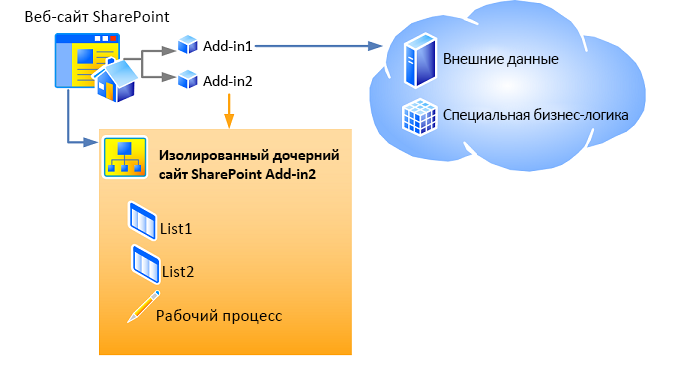

# <a name="host-webs-add-in-webs-and-sharepoint-components-in-sharepoint"></a>Хост-сайты, сайты надстроек и компоненты SharePoint в SharePoint

Когда надстройка, включающая компоненты SharePoint, устанавливается на веб-сайте, она включается в список на странице **Контент сайта**, откуда ее можно запустить. Этот список является единственным обязательным добавлением на веб-сайт, хотя также можно добавить и другие элементы (например, дополнительное действие или веб-часть надстройки). Сведения об этих возможностях см. в разделе [Доступ к надстройке из пользовательского интерфейса](important-aspects-of-the-sharepoint-add-in-architecture-and-development-landscap.md#AccessingApp). 

<a name="IsolatedDomain"> </a>
## <a name="host-webs-add-in-webs-and-the-isolated-domain"></a>Хост-сайты, сайты надстроек и изолированный домен

Компоненты надстройки SharePoint, отличные от элементов пользовательского интерфейса, такие как списки, типы контента, рабочие процессы и страницы, развертываются на другом веб-сайте в специальном изолированном домене. Этот факт во многом скрыт от пользователя. Специальный веб-сайт, на котором *развертывается* надстройка, называется сайтом надстройки. Веб-сайт, на котором *устанавливается* надстройка, называется хост-сайтом. Хотя сайт надстройки имеет собственный изолированный домен, он находится в том же семействе веб-сайтов, что и хост-сайт. (Единственное исключение из этого правила — установка надстройки с областью клиента. В этом случае сайт надстройки находится в семействе веб-сайтов корпоративного каталога надстроек.) 

На рисунке 1 показан хост-сайт с двумя установленными надстройками SharePoint. У надстройки 1 есть удаленные компоненты, но нет компонентов SharePoint, поэтому она не имеет сайта надстройки. У надстройки 2 нет удаленных компонентов, но есть два списка SharePoint и рабочий процесс. Они развернуты на изолированном дочернем сайте. (У надстройки SharePoint могут быть как удаленные компоненты, так и компоненты, размещенные в SharePoint, но ни одна показанная на этой схеме надстройка не включает компоненты обоих этих типов.)

*Рис. 1. Хост-сайт с надстройкой, размещенной у поставщика, и надстройкой с размещением в SharePoint*


 
Например, предположим, что надстройка с компонентами SharePoint, включающими не только элементы пользовательского интерфейса, которые могут быть развернуты на хост-сайте, устанавливается на хост-сайте со следующим URL-адресом:

    `https://www.fabrikam.com/sites/Marketing`

Надстройка SharePoint будет развертываться на заново созданном веб-сайте с URL-адресом, аналогичным следующему:

    `http://add-in-bdf2016ea7dacb.fabrikamadd-ins.com/sites/Marketing/Scheduler`

Обратите внимание, что этот URL-адрес имеет следующую структуру:

    `https://` _Add-in_Prefix_ `-` _Add-in_ID_ `.` _Add-in_Base_Domain_ `/` _Domain_Relative_URL_of_Host_Web_ `/` _Add-in_Name_

Эти заполнители имеют следующие значения:

-  _Add-in_Prefix_ — это любая строка, установленная администратором фермы в центре администрирования. Значение по умолчанию — "default". В данном примере администратор изменил его на "add-in".

-  _Add-in_ID_ — это шестнадцатеричное число, которое генерируется внутри надстройки при ее установке.

-  _Add-in_Base_Domain_ — это строка, установленная администратором фермы в центре администрирования или командной консоли SharePoint. Его *не* следует устанавливать как поддомен веб-приложения SharePoint, иначе цель изоляции надстройки не будет выполнена. В этом примере администратор удалил префикс "www." и добавил "add-ins" к названию компании. Таким образом, `fabrikamadd-ins.com` — это базовый домен надстройки.

-  _Domain_Relative_URL_of_Host_Web_ — это относительный URL-адрес родительского хост-сайта, в данном случае `sites/Marketing`.

-  _Add-in_Name_ — это значение для атрибута **Name** элемента **App** в файле appmanifest.xml.

Существует две основные причины, по которым компоненты SharePoint развертываются на сайтах надстроек, а не на хост-сайта. Обе они связаны с безопасностью.

-  **Обеспечение выполнения разрешений надстройки.** В Модель для надстроек SharePoint надстройка имеет собственное удостоверение, а также разрешения, которые могут не совпадать с разрешениями пользователя, выполняющего надстройку. Эти разрешения надстройки запрашиваются при установке надстройки и предоставляются лицом, устанавливающим её, а также лицом, имеющим все разрешения, которые запрашивает надстройка. (Если пользователь, устанавливающий надстройку, не имеет все разрешения, запрашиваемые надстройкой, то он не может установить её.) Предоставляя каждой надстройке собственный домен, SharePoint может надежно идентифицировать запросы, которые делает надстройка, и проверять разрешения надстройки. Дополнительные сведения о разрешениях надстроек см. в разделе [Разрешения надстроек](important-aspects-of-the-sharepoint-add-in-architecture-and-development-landscap.md#AppPermissions).

-  **Безопасность междоменных скриптов.** Современные браузеры поддерживают "политику единого домена" по отношению к вызовам методов JavaScript. При развертывании каждого Надстройка SharePoint в собственном домене, SharePoint использует преимущества политики единого домена браузера, чтобы JavaScript в Надстройка SharePoint не мог выполнять никакой JavaScript из другого домена, включая домен, в котором с точки зрения пользователя установлена надстройка.
    
   В SharePoint также есть средства безопасного обхода ограничений политики. Помимо прочего, удаленным компонентам надстройки SharePoint разрешается запрашивать данные с любого веб-сайта в рамках общей родительской принадлежности сайта надстройки и хост-сайта. Дополнительные сведения см. в статье [Обращение к данным SharePoint из надстроек с помощью междоменной библиотеки](access-sharepoint-data-from-add-ins-using-the-cross-domain-library.md).

<a name="TypesOfSPComponentsInApps"> </a>
## <a name="types-of-sharepoint-components-that-can-be-in-a-sharepoint-add-in"></a>Типы компонентов SharePoint, встречающиеся в надстройке SharePoint

В целом надстройка SharePoint может содержать один или несколько компонентов из приведенного ниже списка. С некоторыми исключениями, эти компоненты необходимо развертывать в **веб**-компонентах, находящихся в файле пакета решения SharePoint (WSP-файле).

> [!NOTE]
> Компоненты, помеченные звездочкой (\*), более подробно описаны в разделе [Условия для развертывания компонентов SharePoint](#SpecialCases) далее в этой статье.

- Компоненты (только уровня **веб-сайта**)
- Дополнительные действия (в том числе пункты контекстного меню и настройки ленты)\*
- Приемники удаленных событий\*
- Разметка, которая ссылается на веб-части, в том числе веб-части надстроек, включенные в SharePoint (но не пользовательские веб-части)\*
- Пользовательские файлы каскадных таблиц стилей (CSS) для использования на страницах SharePoint
- Пользовательские файлы JavaScript для использования страницами SharePoint
- Модули (наборы файлов)
- Страницы
- Шаблоны списка
- Экземпляры списков и библиотек
- Настраиваемые формы списков
- Настраиваемые представления списков
- Настраиваемые типы контента
- Поля (относящиеся к типам полей, встроенных в SharePoint)
- Модели Microsoft Business Connectivity Services (только в **веб**-области), основанные на модели типы внешнего контента и внешние списки, использующие типы контента\*
- Рабочие процессы\*
- Контейнеры свойств
- Шаблоны сайтов (но не определения сайтов)\*

В надстройке SharePoint нельзя развертывать компоненты SharePoint других видов. Дополнительные сведения о том, что можно включать в надстройку SharePoint, см. в статье [Сравнение надстроек SharePoint с решениями SharePoint](http://msdn.microsoft.com/library/0e9efadb-aaf2-4c0d-afd5-d6cf25c4e7a8%28Office.15%29.aspx).

<a name="SpecialCases"> </a>
## <a name="caveats-for-deploying-sharepoint-components"></a>Условия для развертывания компонентов SharePoint

Ознакомьтесь с условиями и подробными сведениями, касающимися развертывания определенных компонентов SharePoint в надстройке: 

- **Дополнительные действия.** Дополнительные действия можно добавлять как на сайт надстройки, так и на хост-сайт. Чтобы добавить дополнительное действие на сайт надстройки, его следует включить в компонент уровня **Web**, находящийся в WSP-файле, как это делается с любым другим компонентом, который добавляется на сайт надстройки. Чтобы добавить дополнительное действие на хост-сайт, можно включить (даже в надстройке с внешним размещением) разметку **CustomAction** в компонент, который находится в пакете надстройки, но вне WSP-файла. Компоненты в таком "свободном" компоненте относятся к хост-сайту, а не к сайту надстройки, поэтому такой тип компонентов называетсякомпонентом хост-сайта. 

- **Веб-части.** Одну разновидность веб-частей, веб-часть надстройки, можно разворачивать в надстройке, и эта веб-часть может вести либо на сайт надстройки, либо на хост-сайт. На все остальные типы веб-частей можно ссылаться в надстройках, но они не могут разворачиваться в надстройках. Если веб-часть надстройки разворачивается на хост-сайте, ее необходимо включить в компонент хост-сайта.

- **Удаленные приемники событий.** Удаленные приемники событий появились в SharePoint. Они похожи на классические приемники событий SharePoint, за исключением того, что код выполняется в облаке. Эти приемники событий недоступны в надстройках, размещенных в SharePoint.

- **Рабочие процессы.** Рабочие процессы в SharePoint используют среду выполнения workflow-процессов, размещенную в Microsoft Azure, которая появилась в SharePoint. Закодированные рабочие процессы, которые используют среду выполнения workflow-процессов, размещенную в SharePoint, не могут включаться в Надстройка SharePoint. Разрешены только декларативные рабочие процессы или рабочие процессы, использующие новейшую среду выполнения.

- **Модели Microsoft Business Connectivity Services (BCS), типы внешнего контента и внешние списки.** Модели службы подключения к бизнес-данным (BDC) обычно имеют область, которая шире, чем семейство веб-сайтов. Но когда модель службы подключения к бизнес-данным развертывается в надстройке, ее область ограничивается областью сайта надстройки. Когда модель службы подключения к бизнес-данным включается в надстройку, она хранится не в хранилище общих служб BDC, а в виде файла на сайте надстройки.

- **Шаблоны веб-сайтов.** В большинстве случаев вам потребуется, чтобы сайт надстройки устанавливал новую встроенную конфигурацию определений сайта **APP#0**, оптимизированную для сайтов надстройки. (Дополнительные сведения об этом см. в разделе [Доступ к надстройке из пользовательского интерфейса](important-aspects-of-the-sharepoint-add-in-architecture-and-development-landscap.md#AccessingApp).) SharePoint автоматически использует **APP#0**, если пакет надстройки не включает элемент [WebTemplate](http://msdn.microsoft.com/library/ff4ba91a-cc5f-47ff-9101-a7651f452185%28Office.15%29.aspx).
    
   Кроме того, можно задать пользовательского тип для сайта надстройки. Для этого необходимо выполнить два основных действия.
    
   - Включите пользовательский [элемент WebTemplate (шаблон веб-сайта)](http://msdn.microsoft.com/library/ff4ba91a-cc5f-47ff-9101-a7651f452185%28Office.15%29.aspx), файл onet.xml и, возможно, другие связанные файлы в компонент сайта надстройки для вашей надстройки. Разверните шаблон веб-сайта в веб-компоненте в WSP-файле внутри пакета надстройки как обычно.

   - Добавьте [элемент WebTemplate (PropertiesDefinition complexType) (манифест надстройки SharePoint)](http://msdn.microsoft.com/library/62302903-e97a-a9a3-a64e-13176a7c4e1e%28Office.15%29.aspx) в манифест надстройки в качестве потомка элемента **Properties** и установите для его атрибута **Id** значение GUID компонента сайта надстройки и значение **Name** атрибута [Элемент WebTemplate (шаблон веб-сайта)](http://msdn.microsoft.com/library/ff4ba91a-cc5f-47ff-9101-a7651f452185%28Office.15%29.aspx). Обратите внимание, что GUID должен быть заключен в фигурные скобки и содержать дефисы, а также отделяться от имени шаблона символом "#". Вот пример такого значения:
    
     ```XML
       <WebTemplate Id="{81dd4ae5-873b-4759-9838-4ad9c3dd2952}#NewSiteType" />
     ```

   > [!NOTE]
   > Новый элемент [WebTemplate](http://msdn.microsoft.com/library/62302903-e97a-a9a3-a64e-13176a7c4e1e%28Office.15%29.aspx) для манифестов надстроек отличается разметкой от элемента [WebTemplate](http://msdn.microsoft.com/library/ff4ba91a-cc5f-47ff-9101-a7651f452185%28Office.15%29.aspx), который можно включить в компоненты. Элемент **WebTemplate**, который можно включить в компоненты, определяет тип сайта, но элемент **WebTemplate** для манифестов надстроек просто указывает на используемый тип сайтов. Дополнительные сведения о манифесте надстройки SharePoint см. в разделе [Структура пакета надстройки](important-aspects-of-the-sharepoint-add-in-architecture-and-development-landscap.md#SPAppModelArch_Package).

   > [!CAUTION]
   > Не используйте элемент **WebTemplate** в манифесте надстройки для указания какой-либо из встроенных конфигураций определений сайта SharePoint в качестве типа веб-сайта надстройки. Для сайтов надстройки не поддерживается использование какой-либо из встроенных конфигураций определений сайта, кроме **APP#0**. 

   Дополнительные сведения о конфигурациях определений сайта и шаблонах веб-сайтов см. в статье [Работа с шаблонами и определениями](http://msdn.microsoft.com/library/1edf6d4d-eddb-4cb5-9034-ed394e8a3e01%28Office.15%29.aspx).
    
## <a name="see-also"></a>См. также
<a name="SP15hostedwebs_bk_addlresources"> </a>

- [Важные аспекты разработки и архитектуры для надстроек SharePoint](important-aspects-of-the-sharepoint-add-in-architecture-and-development-landscap.md)
- [Безопасный доступ к данным и клиентские объектные модели для надстроек SharePoint](secure-data-access-and-client-object-models-for-sharepoint-add-ins.md)
- [Сравнение надстроек SharePoint с решениями SharePoint](http://msdn.microsoft.com/library/0e9efadb-aaf2-4c0d-afd5-d6cf25c4e7a8%28Office.15%29.aspx)

