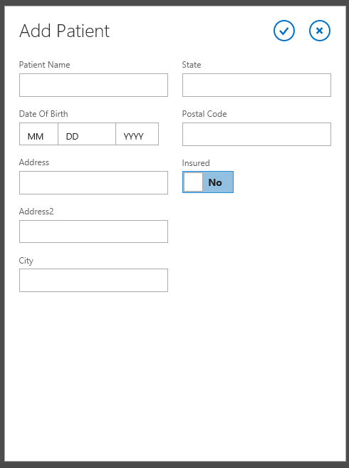
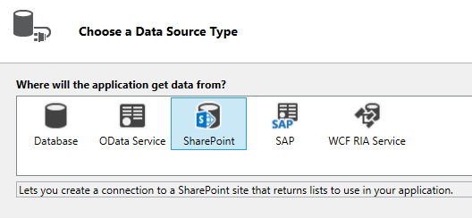
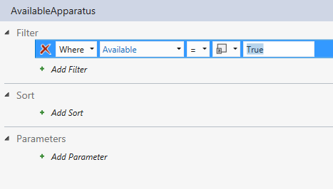
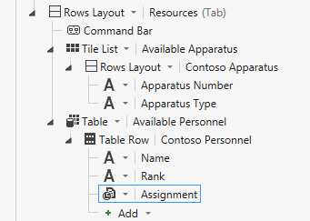
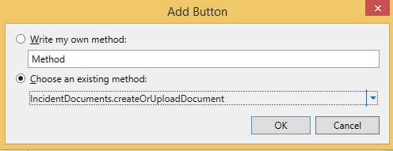
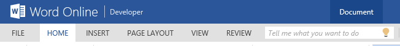
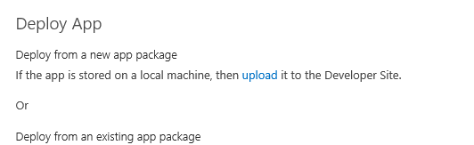
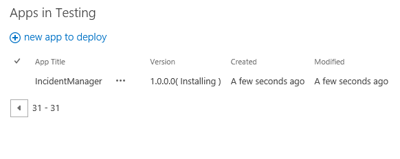

# <a name="incident-manager-a-cloud-business-add-in-tutorial"></a><span data-ttu-id="b8c85-101">Диспетчер инцидентов: руководство по созданию облачной бизнес-надстройки</span><span class="sxs-lookup"><span data-stu-id="b8c85-101">Incident manager: A cloud business add-in tutorial</span></span>
<span data-ttu-id="b8c85-p101">С помощью шаблона **Облачная бизнес-надстройка** в Visual Studio можно создать надстройку, размещаемую в SharePoint, в которой пользователи могут просматривать, добавлять и изменять данные из удаленных источников с помощью современных мобильных сенсорных устройств, например телефонов и планшетов. В этом учебнике показано, как создать надстройку для вымышленной противопожарной службы Contoso, предназначенную для управления текущими инцидентами. В пошаговом руководстве охвачены базовые концепции создания облачной бизнес-надстройки, а также более сложные концепции, например интеграция библиотек документов и списков SharePoint.</span><span class="sxs-lookup"><span data-stu-id="b8c85-p101">By using the **Cloud Business Add-in** template in Visual Studio, you can create a SharePoint hosted in which mobile users can view, add, and update data from remote locations by using modern, touch-oriented devices such as phones and tablets. In this tutorial, you'll create an add-in for a fictional Contoso Fire Department to handle on-scene incident management. The walkthrough covers the core concepts of building a Cloud Business Add-in as well as more advanced concepts such as integrating SharePoint lists and document libraries.</span></span>
 
<span data-ttu-id="b8c85-105">Вы можете скачать пример надстройки диспетчера инцидентов и связанные с ним файлы в коллекции примеров MSDN: [Диспетчер инцидентов: руководство по созданию облачной бизнес-надстройки](http://code.msdn.microsoft.com/Incident-Manager-A-Cloud-c32d9b04).</span><span class="sxs-lookup"><span data-stu-id="b8c85-105">You can download the Incident Management sample application and associated files from the MSDN Samples Gallery: [Incident Manager: A Cloud Business Add-in Tutorialhttp://code.msdn.microsoft.com/Incident-Manager-A-Cloud-c32d9b04](http://code.msdn.microsoft.com/Incident-Manager-A-Cloud-c32d9b04).</span></span>
 

 <span data-ttu-id="b8c85-p102">**Примечание.** В настоящее время идет процесс замены названия "приложения для SharePoint" названием "надстройки SharePoint". Во время этого процесса в документации и пользовательском интерфейсе некоторых продуктов SharePoint и средств Visual Studio может по-прежнему использоваться термин "приложения для SharePoint". Дополнительные сведения см. в статье [Новое название приложений для Office и SharePoint](new-name-for-apps-for-sharepoint#bk_newname).</span><span class="sxs-lookup"><span data-stu-id="b8c85-p102">The name "apps for SharePoint" is changing to "SharePoint Add-ins". During the transition, the documentation and the UI of some SharePoint products and Visual Studio tools might still use the term "apps for SharePoint". For details, see [New name for apps for Office and SharePoint](new-name-for-apps-for-sharepoint#bk_newname).</span></span>
 


## <a name="prerequisites"></a><span data-ttu-id="b8c85-109">Необходимые компоненты</span><span class="sxs-lookup"><span data-stu-id="b8c85-109">Prerequisites</span></span>

<span data-ttu-id="b8c85-110">Для работы с этим пошаговым руководством необходим Visual Studio 2013 с обновлением 1 и Инструменты разработчика Microsoft для Visual Studio 2013 с обновлением от марта 2014 г.</span><span class="sxs-lookup"><span data-stu-id="b8c85-110">This walkthrough requires Visual Studio 2013 Update 1 and Microsoft Developer Tools for Visual Studio 2013 - March 2014 Update.</span></span>
 

 
<span data-ttu-id="b8c85-111">Для размещения надстройки вам также понадобится сайт разработчика SharePoint в Office 365, который вы можете получить на странице  [Регистрация на сайте разработчиков для Office 365](http://go.microsoft.com/fwlink/?LinkId=263490).</span><span class="sxs-lookup"><span data-stu-id="b8c85-111">To host the add-in, you'll also need a SharePoint Developer site on Office 365, which you can get from the  [Sign up for an Office 365 Developer Site](http://go.microsoft.com/fwlink/?LinkId=263490).</span></span>
 

 

 <span data-ttu-id="b8c85-112">**Примечание.** Вы также можете разместить облачную бизнес-надстройку на сайте SharePoint.</span><span class="sxs-lookup"><span data-stu-id="b8c85-112">**Note** You can also host a Cloud Business Add-in on a SharePoint site.</span></span>
 


## <a name="create-the-incident-management-application"></a><span data-ttu-id="b8c85-113">Создание надстройки для управления инцидентами</span><span class="sxs-lookup"><span data-stu-id="b8c85-113">Create the Incident Management Application</span></span>
<span data-ttu-id="b8c85-114"><a name="add-in"> </a></span><span class="sxs-lookup"><span data-stu-id="b8c85-114"></span></span>

<span data-ttu-id="b8c85-p103">В сферу работы противопожарной службы Contoso входит ликвидация пожаров, неотложная медицинская помощь, дорожно-транспортные происшествия и другие аварийные случаи. Каждый такой случай требует значительной работы по документированию происшествия. Сейчас компания регистрирует информацию, заполняя бумажные бланки на месте происшествия, а по возвращении в часть вводит информацию в свою компьютерную систему. Недавно компания ввела систему SharePoint для Office 365 для управления записями и приобрела планшеты, чтобы позволить руководителю аварийно-спасательных работ вводить данные на месте происшествия.</span><span class="sxs-lookup"><span data-stu-id="b8c85-p103">The Contoso Fire Department responds to fires, medical aid emergencies, motor vehicle accidents and other emergencies. Each emergency incident requires considerable paperwork to document the incident. They currently enter information using paper forms on-scene, and then enter the information into their computer system when they return to the firehouse. They have recently adopted SharePoint for Office 365 for records management, and they have purchased tablets to enable the Incident Commander to enter data on-scene.</span></span>
 

 
<span data-ttu-id="b8c85-p104">Вы создадите мобильную надстройку, которая будет использоваться для ввода основных сведений о происшествии. Так как при многих происшествиях требуется медицинская помощь, в надстройке также необходимо предусмотреть возможность ввода данных для многих пострадавших при одном происшествии. Этот раздел покажет вам, как создать базовое приложение, попутно объясняя основы облачных бизнес-надстроек.</span><span class="sxs-lookup"><span data-stu-id="b8c85-p104">You will build the mobile add-in that will be used to enter basic information about the incident. Since many incidents also involve medical aid, the add-in will also need to be able to enter data for multiple patients per incident. In this section you will build the basic application, learning the fundamentals of Cloud Business Add-ins along the way.</span></span>
 

 

### <a name="to-create-a-project"></a><span data-ttu-id="b8c85-122">Создание проекта</span><span class="sxs-lookup"><span data-stu-id="b8c85-122">To create a project</span></span>


1. <span data-ttu-id="b8c85-123">В строке меню последовательно выберите пункты **Файл**, **Создать** и **Проект**.</span><span class="sxs-lookup"><span data-stu-id="b8c85-123">On the menu bar, choose  **File**,  **New**,  **Project**.</span></span>
    
    <span data-ttu-id="b8c85-124">Откроется диалоговое окно **Создание проекта**.</span><span class="sxs-lookup"><span data-stu-id="b8c85-124">The  **New Project** dialog box opens.</span></span>
    
 
2. <span data-ttu-id="b8c85-125">В списке шаблонов разверните узел **Visual Basic** или **Visual C#**, затем узел **Office/SharePoint**, выберите узел **Надстройки**, а затем шаблон **Облачная бизнес-надстройка**, как показано на рис. 1.</span><span class="sxs-lookup"><span data-stu-id="b8c85-125">In the list of templates, expand the **Visual Basic** or **Visual C#** node, expand the **Office/SharePoint** node, choose the **Add-ins** node, and then choose the **Cloud Business Add-in** template, as shown in Figure 1.</span></span>
    
    <span data-ttu-id="b8c85-126">**Рис. 1. Шаблон облачной бизнес-надстройки**</span><span class="sxs-lookup"><span data-stu-id="b8c85-126">**Figure 1. Cloud Business Add-in template**</span></span>

 

  
 

 

 
3. <span data-ttu-id="b8c85-128">В текстовом поле **Имя** введите IncidentManager (Диспетчер инцидентов) и нажмите кнопку **OK**.</span><span class="sxs-lookup"><span data-stu-id="b8c85-128">In the **Name** text box, enterIncidentManager, and then choose the **OK** button.</span></span>
    
    <span data-ttu-id="b8c85-129">Откроется мастер **создания облачной бизнес-надстройки**.</span><span class="sxs-lookup"><span data-stu-id="b8c85-129">The **New Cloud Business Add-in** wizard opens.</span></span>
    
 
4. <span data-ttu-id="b8c85-130">В мастере **создания облачной бизнес-надстройки** введите URL-адрес вашего сайта разработчика Office 365 и нажмите кнопку **Готово**.</span><span class="sxs-lookup"><span data-stu-id="b8c85-130">In the **New Cloud Business Add-in** wizard, enter the URL for your Office 365 Developer site, and then choose the **Finish** button.</span></span>
    
    <span data-ttu-id="b8c85-131">URL-адрес должен принять следующий вид: https://_MySite_.sharepoint.com/sites/Developer/.</span><span class="sxs-lookup"><span data-stu-id="b8c85-131">The URL should take the form https://  _MySite_.sharepoint.com/sites/Developer/.</span></span>
    
    <span data-ttu-id="b8c85-132">Решение **IncidentManager** будет добавлено в обозреватель решений с четырьмя проектами: проект верхнего уровня **IncidentManager**, проект **IncidentManager.HTMLClient**, проект **IncidentManager.Server** и проект **IncidentManager.SharePoint**.</span><span class="sxs-lookup"><span data-stu-id="b8c85-132">A **IncidentManager** solution is added to Solution Explorer with four projects: a top-level **IncidentManager** project, a **IncidentManager.HTMLClient** project, a **IncidentManager.Server** project, and a **IncidentManager.SharePoint** project.</span></span>
    
    
 

    
    <span data-ttu-id="b8c85-p105">На следующем этапе вы добавите сущность, представляющую набор происшествий. Сущность создает таблицу базы данных SQL Server, встроенную в надстройку. В ней будет храниться информация о каждом происшествии.</span><span class="sxs-lookup"><span data-stu-id="b8c85-p105">In the next step, you'll add an entity to represent a collection of incidents. The entity creates a SQL Server database table that is intrinsic to the add-in. It will store information about each incident.</span></span>
    
 

### <a name="to-add-the-incident-entity"></a><span data-ttu-id="b8c85-136">Добавление объекта Incident</span><span class="sxs-lookup"><span data-stu-id="b8c85-136">To add the Incident entity</span></span>


1. <span data-ttu-id="b8c85-137">На **начальном** экране выберите гиперссылку **Создать таблицу**.</span><span class="sxs-lookup"><span data-stu-id="b8c85-137">On the **Start** screen, choose the **Create New Table** hyperlink.</span></span>
    
    <span data-ttu-id="b8c85-138">Откроется Entity Designer.</span><span class="sxs-lookup"><span data-stu-id="b8c85-138">The entity designer opens.</span></span>
    
 
2. <span data-ttu-id="b8c85-139">В окне **Свойства** в текстовом поле свойства **Имя** введите Incident (Инцидент).</span><span class="sxs-lookup"><span data-stu-id="b8c85-139">In the **Properties** window, in the text box for the **Name** property, enterIncident.</span></span>
    
 
3. <span data-ttu-id="b8c85-140">В Entity Designer перейдите по ссылке **<Add Property>** и введите IncidentNumber (Номер инцидента).</span><span class="sxs-lookup"><span data-stu-id="b8c85-140">In the entity designer, choose the <Add Property> link and enter Name.</span></span>
    
 
4. <span data-ttu-id="b8c85-141">Нажмите клавишу ВВОД. Пр этом будет выбран **тип**, используемый по умолчанию (**String**), и флажок **Обязательный** останется установленным.</span><span class="sxs-lookup"><span data-stu-id="b8c85-141">Choose the Enter key, accepting the default **Type**, **String**, and leaving the **Required** checkbox selected.</span></span>
    
 
5. <span data-ttu-id="b8c85-142">В окне **Свойства** установите флажок **Включить в уникальный индекс**.</span><span class="sxs-lookup"><span data-stu-id="b8c85-142">In the **Properties** window, select the **Include in Unique Index** check box.</span></span>
    
    <span data-ttu-id="b8c85-143">У каждого инцидента должен быть уникальный номер.</span><span class="sxs-lookup"><span data-stu-id="b8c85-143">The incident number must be unique for each incident.</span></span>
    
 
6. <span data-ttu-id="b8c85-144">Перейдите по ссылке **<Add Property>** и введите IncidentDate (Дата инцидента), а затем нажмите клавишу **TAB**.</span><span class="sxs-lookup"><span data-stu-id="b8c85-144">Choose the  **<Add Property>** link and enterIncidentDate, and then choose the  **Tab** key.</span></span>
    
 
7. <span data-ttu-id="b8c85-145">В столбце **Тип** выберите **Дата**, а затем дважды нажмите клавишу TAB.</span><span class="sxs-lookup"><span data-stu-id="b8c85-145">In the **Type** column, choose **Date**, and then choose the Tab key twice.</span></span>
    
 
8. <span data-ttu-id="b8c85-146">В столбце **Имя** введите DispatchTime (Время отправки), а в столбце **Тип** — тип данных **DateTime**.</span><span class="sxs-lookup"><span data-stu-id="b8c85-146">In the **Name** column enterDispatchTime, and in the **Type** column choose the **DateTime** data type.</span></span>
    
 
9. <span data-ttu-id="b8c85-147">В следующей строке введите IncidentType (Тип инцидента) и выберите тип данных **Integer**.</span><span class="sxs-lookup"><span data-stu-id="b8c85-147">In the next row enter IncidentType and choose **Integer** as the data type.</span></span>
    
 
10. <span data-ttu-id="b8c85-148">В следующей строке введите IncidentAddress (Адрес инцидента) и выберите тип данных **String**.</span><span class="sxs-lookup"><span data-stu-id="b8c85-148">In the next row enter IncidentAddress and choose **String** as the data type.</span></span>
    
 
11. <span data-ttu-id="b8c85-149">В следующей строке введите ReportingPartyName (Имя, лица сообщившего об инциденте) и выберите тип данных **String**, а затем снимите флажок **Обязательный**.</span><span class="sxs-lookup"><span data-stu-id="b8c85-149">In the next row enter ReportingPartyName and choose **String** as the data type, and then clear the **Required** check box.</span></span>
    
    <span data-ttu-id="b8c85-150">Иногда сведения об инцидентах сообщаются анонимно, и вам не нужно требовать указывать значение в этом поле.</span><span class="sxs-lookup"><span data-stu-id="b8c85-150">Sometimes incidents are reported anonymously, so you don't want to require a value in this field.</span></span>
    
 
12. <span data-ttu-id="b8c85-151">В следующей строке введите ReportingPhone (Телефон, с которого сообщили об инциденте) и выберите тип данных **PhoneNumber**.</span><span class="sxs-lookup"><span data-stu-id="b8c85-151">In the next row enter ReportingPhone and choose the **PhoneNumber** data type.</span></span>
    
     <span data-ttu-id="b8c85-152">**Phone Number** — это пользовательский бизнес-тип, который автоматически форматирует и проверяет номера телефонов.</span><span class="sxs-lookup"><span data-stu-id="b8c85-152">**Phone Number** is acustom business type that automatically formats and provides validation for telephone numbers.</span></span>
    
 
13. <span data-ttu-id="b8c85-153">В окне **Свойства** щелкните гиперссылку **Форматы телефонных номеров**.</span><span class="sxs-lookup"><span data-stu-id="b8c85-153">In the **Properties** window, choose the **Phone Number Formats** hyperlink.</span></span>
    
    <span data-ttu-id="b8c85-154">Откроется диалоговое окно **Форматы телефонных номеров**.</span><span class="sxs-lookup"><span data-stu-id="b8c85-154">The **Phone Number Formats** dialog box opens.</span></span>
    
 
14. <span data-ttu-id="b8c85-155">В диалоговом окне **Форматы телефонных номеров** выберите соответствующий формат для своей локали, а затем нажмите кнопку **Вверх**, чтобы переместить его в верх списка.</span><span class="sxs-lookup"><span data-stu-id="b8c85-155">In the **Phone Number Formats** dialog box, choose the appropriate format for your locale, and then choose the **Move Up** button to move it to the top of the list.</span></span>
    
 
15. <span data-ttu-id="b8c85-156">В текстовом поле **Проверка тестового номера телефона** введите номер телефона и убедитесь, что он правильно отформатирован, а затем нажмите кнопку **Сохранить**.</span><span class="sxs-lookup"><span data-stu-id="b8c85-156">In the **Test Phone Number Validation** text box, enter a phone number and verify that it's properly formatted, and then choose the **Save** button.</span></span>
    
    <span data-ttu-id="b8c85-157">Бизнес-тип **Phone Number** выполняет форматирование и проверку на любом экране, на котором он появляется.</span><span class="sxs-lookup"><span data-stu-id="b8c85-157">The **Phone Number** business type handles formatting and validation for you on any screen where it appears.</span></span>
    
 
16. <span data-ttu-id="b8c85-158">В следующей строке укажите IncidentCommander (Управляющий инцидентом) и выберите тип данных **Person**.</span><span class="sxs-lookup"><span data-stu-id="b8c85-158">In the next row enter IncidentCommander and choose the **Person** data type.</span></span>
    
    <span data-ttu-id="b8c85-159">Бизнес-тип **Person** осуществляет связь со службой профилей пользователей SharePoint, которая запрашивает информацию о пользователях из Active Directory.</span><span class="sxs-lookup"><span data-stu-id="b8c85-159">The **Person** business type provides a connection to the SharePoint User Profile Service, which pulls user information from Active Directory.</span></span>
    
    <span data-ttu-id="b8c85-160">На рис. 2 показан завершенный объект.</span><span class="sxs-lookup"><span data-stu-id="b8c85-160">Figure 2 shows the finished entity.</span></span>
    

    <span data-ttu-id="b8c85-161">**Рис. 2. Объект Incidents**</span><span class="sxs-lookup"><span data-stu-id="b8c85-161">**Figure 2. The Incidents entity**</span></span>

 

  
 

    
 

    
    <span data-ttu-id="b8c85-p106">На следующем этапе вы добавите список вариантов выбора, позволяющий пользователям выбирать значения из фиксированного набора. В таком случае у противопожарной службы будет набор общих типов происшествий.</span><span class="sxs-lookup"><span data-stu-id="b8c85-p106">In the next step, you'll add a choice list that allows the user to choose from a fixed set of values. In this case, the fire department has a set of common incident types.</span></span>
    
 

### <a name="to-add-a-list-of-choices"></a><span data-ttu-id="b8c85-165">Добавление списка значений</span><span class="sxs-lookup"><span data-stu-id="b8c85-165">To add a list of choices</span></span>


1. <span data-ttu-id="b8c85-166">В Entity Designer выберите поле **IncidentType** (Тип инцидента), а затем в окне **Свойства** щелкните гиперссылку **Список значений**.</span><span class="sxs-lookup"><span data-stu-id="b8c85-166">In the entity designer, choose the **IncidentType** field, and then in the **Properties** window choose the **Choice List** hyperlink.</span></span>
    
    <span data-ttu-id="b8c85-167">Откроется диалоговое окно **Список значений**.</span><span class="sxs-lookup"><span data-stu-id="b8c85-167">The **Choice List** dialog box opens.</span></span>
    
 
2. <span data-ttu-id="b8c85-168">В диалоговом окне **Список значений** щелкните ссылку **Добавить значение** и введите 1.</span><span class="sxs-lookup"><span data-stu-id="b8c85-168">In the **Choice List** dialog box, choose the **Add Value** link and enter1.</span></span>
    
 
3. <span data-ttu-id="b8c85-169">В столбце **Отображаемое имя** введите **Fire - Commercial** (Коммерческая противопожарная служба).</span><span class="sxs-lookup"><span data-stu-id="b8c85-169">In the **Display Name** column, enter **Fire - Commercial**.</span></span>
    
 
4. <span data-ttu-id="b8c85-170">Введите указанные ниже значения и отображаемые имена, а затем нажмите кнопку **ОК**.</span><span class="sxs-lookup"><span data-stu-id="b8c85-170">Enter the following values and display names, and then choose the **OK** button.</span></span>
    

|<span data-ttu-id="b8c85-171">**Значение**</span><span class="sxs-lookup"><span data-stu-id="b8c85-171">**Value**</span></span>|<span data-ttu-id="b8c85-172">**Отображаемое имя**</span><span class="sxs-lookup"><span data-stu-id="b8c85-172">**Display Name**</span></span>|
|:-----|:-----|
|<span data-ttu-id="b8c85-173">2</span><span class="sxs-lookup"><span data-stu-id="b8c85-173"> :=2</span></span>|<span data-ttu-id="b8c85-174">Пожар помещения</span><span class="sxs-lookup"><span data-stu-id="b8c85-174">Fire - Residential</span></span>|
|<span data-ttu-id="b8c85-175">3</span><span class="sxs-lookup"><span data-stu-id="b8c85-175"> :=3</span></span>|<span data-ttu-id="b8c85-176">Пожар один личный состав тушения</span><span class="sxs-lookup"><span data-stu-id="b8c85-176">Fire - Single Engine Response</span></span>|
|<span data-ttu-id="b8c85-177">4</span><span class="sxs-lookup"><span data-stu-id="b8c85-177">Stage 4</span></span>| <span data-ttu-id="b8c85-178">Медицинская помощь специализированная реаниматологическая помощь</span><span class="sxs-lookup"><span data-stu-id="b8c85-178">Aid - Advanced Life Support</span></span>|
|<span data-ttu-id="b8c85-179">5</span><span class="sxs-lookup"><span data-stu-id="b8c85-179"> :=5</span></span>| <span data-ttu-id="b8c85-180">Медицинская помощь первичные реанимационные мероприятия</span><span class="sxs-lookup"><span data-stu-id="b8c85-180">Aid - Basic Life Support</span></span>|
|<span data-ttu-id="b8c85-181">6</span><span class="sxs-lookup"><span data-stu-id="b8c85-181"> :=6</span></span>|<span data-ttu-id="b8c85-182">Дорожно-транспортное происшествие</span><span class="sxs-lookup"><span data-stu-id="b8c85-182">Motor Vehicle Collision</span></span>|
|<span data-ttu-id="b8c85-183">7</span><span class="sxs-lookup"><span data-stu-id="b8c85-183"> :=7</span></span>|<span data-ttu-id="b8c85-184">Вызов службы</span><span class="sxs-lookup"><span data-stu-id="b8c85-184">Service Call</span></span>|
|||

<span data-ttu-id="b8c85-p107">При работе надстройки пользователю будет доступен список отображаемых имен. Когда пользователь выберет необходимый вариант, в базе данных сохранится соответствующее значение **Integer**.</span><span class="sxs-lookup"><span data-stu-id="b8c85-p107">At run time, a list of the display names will be presented to the user. When they make a choice, the corresponding **Integer** value will be stored in the database.</span></span>
    
<span data-ttu-id="b8c85-p108">На следующем этапе вы добавите сущность "Пострадавший". Многие из происшествий, которыми занимается противопожарная служба, требуют оказания медицинской помощи, и часто в одном происшествии есть несколько пострадавших.</span><span class="sxs-lookup"><span data-stu-id="b8c85-p108">In the next step, you'll add a Patient entity. Many of the fire department's incidents involve medical aid, and a single incident often involves multiple patients.</span></span>
    
 

### <a name="to-add-the-patient-entity"></a><span data-ttu-id="b8c85-189">Добавление объекта Patient</span><span class="sxs-lookup"><span data-stu-id="b8c85-189">To add the Patient entity</span></span>


1. <span data-ttu-id="b8c85-190">В **обозревателе решений** откройте контекстное меню для узла **Источники данных** и выберите пункт **Добавить таблицу**.</span><span class="sxs-lookup"><span data-stu-id="b8c85-190">In **Solution Explorer**, open the shortcut menu for the **Data Sources** node and choose **Add Table**.</span></span>
    
 
2. <span data-ttu-id="b8c85-191">В окне **Свойства** в текстовом поле для свойства **Имя** введите Patient (Пострадавший).</span><span class="sxs-lookup"><span data-stu-id="b8c85-191">In the **Properties** window, in the text box for the **Name** property, enterPatient.</span></span>
    
 
3. <span data-ttu-id="b8c85-192">В Entity Designer добавьте указанные ниже поля, как показано на рис. 3.</span><span class="sxs-lookup"><span data-stu-id="b8c85-192">In the entity designer, add the following fields as shown in Figure 3:</span></span>
    
    <span data-ttu-id="b8c85-193">**Рис. 3. Завершенный объект Patient**</span><span class="sxs-lookup"><span data-stu-id="b8c85-193">**Figure 3. The finished Patient entity**</span></span>

 

  
 

    
 

    
    <span data-ttu-id="b8c85-p109">На следующем этапе вы определите отношение между сущностями "Происшествие" и "Пострадавший". С происшествием может быть связано много пациентов.</span><span class="sxs-lookup"><span data-stu-id="b8c85-p109">In the next step, you'll define a relationship between the Incident and Patient entities. An incident can have multiple related patients.</span></span>
    
 

### <a name="to-define-a-relationship"></a><span data-ttu-id="b8c85-197">Создание отношения</span><span class="sxs-lookup"><span data-stu-id="b8c85-197">To define a relationship</span></span>


1. <span data-ttu-id="b8c85-198">В **обозревателе решений** откройте контекстное меню для узла **Incidents.lsml** и нажмите кнопку **Открыть**.</span><span class="sxs-lookup"><span data-stu-id="b8c85-198">In **Solution Explorer**, open the shortcut menu for the **Incidents.lsml** node and choose **Open**.</span></span>
    
 
2. <span data-ttu-id="b8c85-199">На панели инструментов нажмите кнопку **Отношение**.</span><span class="sxs-lookup"><span data-stu-id="b8c85-199">On the toolbar, choose the **Relationship** button.</span></span>
    
    <span data-ttu-id="b8c85-200">Откроется диалоговое окно **Добавление нового отношения**.</span><span class="sxs-lookup"><span data-stu-id="b8c85-200">The **Add New Relationship** dialog box appears.</span></span>
    
 
3. <span data-ttu-id="b8c85-201">В диалоговом окне **Добавление нового отношения** в столбце **К:** строки **Имя** выберите **Patient** (Пострадавший).</span><span class="sxs-lookup"><span data-stu-id="b8c85-201">In the **Add New Relationship** dialog box, in the **To** column of the **Name** row, choose **Patient**.</span></span>
    
 
4. <span data-ttu-id="b8c85-202">В строке **Кратность** в столбце **От:** выберите **Ноль или один**.</span><span class="sxs-lookup"><span data-stu-id="b8c85-202">In the **Multiplicity** row, in the **From** column choose **Zero or one**.</span></span>
    
 
5. <span data-ttu-id="b8c85-203">В столбце **К:** выберите **Много** и нажмите кнопку **ОК**.</span><span class="sxs-lookup"><span data-stu-id="b8c85-203">In the **To** column, choose **Many**, and then choose the **OK** button.</span></span>
    
    <span data-ttu-id="b8c85-204">На рис. 4 показано отношение.</span><span class="sxs-lookup"><span data-stu-id="b8c85-204">Figure 4 shows the relationship.</span></span>
    

    <span data-ttu-id="b8c85-205">**Рис. 4. Отношение между объектами Incidents и Patients**</span><span class="sxs-lookup"><span data-stu-id="b8c85-205">**Figure 4. Incidents and Patients relationship**</span></span>

 

  
 

    <span data-ttu-id="b8c85-p110">Таким образом создается отношение "ноль или один ко многим" между происшествиями и пострадавшими. У записи происшествия не обязательно должен быть пострадавший, но у каждого пострадавшего должно быть отношение с записью происшествия.</span><span class="sxs-lookup"><span data-stu-id="b8c85-p110">This creates a zero or one to many relationship between incidents and patients. An incident record doesn't have to have a patient, but every patient has to have a related incident record.</span></span>
    
    
 

    
    <span data-ttu-id="b8c85-209">На следующем этапе вы добавите экраны для просмотра, добавления и редактирования записей "Пострадавший" и "Происшествие".</span><span class="sxs-lookup"><span data-stu-id="b8c85-209">In the next step, you'll add screens to view, add, and edit both Patient and Incident records.</span></span>
    
 

### <a name="to-add-screens"></a><span data-ttu-id="b8c85-210">Добавление экранов</span><span class="sxs-lookup"><span data-stu-id="b8c85-210">To add screens</span></span>


1. <span data-ttu-id="b8c85-211">В **обозревателе решений** откройте контекстное меню для узла **Incidents.lsml** и нажмите кнопку **Открыть**.</span><span class="sxs-lookup"><span data-stu-id="b8c85-211">In **Solution Explorer**, open the shortcut menu for the **Incidents.lsml** node and choose **Open**.</span></span>
    
 
2. <span data-ttu-id="b8c85-212">В конструкторе экрана в строке **Перспектива** откройте вкладку **HTML-клиент**, а затем на панели инструментов нажмите кнопку **Экран**.</span><span class="sxs-lookup"><span data-stu-id="b8c85-212">In the screen designer, on the **Perspective** bar, choose the **HTML Client** tab, and then on the toolbar choose the **Screen** button.</span></span>
    
    <span data-ttu-id="b8c85-213">Откроется диалоговое окно **Добавление нового экрана**.</span><span class="sxs-lookup"><span data-stu-id="b8c85-213">The **Add New Screen** dialog box opens.</span></span>
    
 
3. <span data-ttu-id="b8c85-214">В диалоговом окне **Добавление нового экрана** в списке **Выберите шаблон экрана** выберите **Общий набор экранов**.</span><span class="sxs-lookup"><span data-stu-id="b8c85-214">In the **Add New Screen** dialog box, in the **Select a screen template** list, choose **Common Screen Set**.</span></span>
    
 
4. <span data-ttu-id="b8c85-215">В текстовом поле **Имя набора экранов** введите Incidents (Инциденты).</span><span class="sxs-lookup"><span data-stu-id="b8c85-215">In the **Screen Set Name** text box, enterIncidents.</span></span>
    
 
5. <span data-ttu-id="b8c85-216">В списке **Данные экрана** выберите **Incidents** (Инциденты).</span><span class="sxs-lookup"><span data-stu-id="b8c85-216">In the **Screen Data** list, choose **Incidents**.</span></span>
    
 
6. <span data-ttu-id="b8c85-217">Установите флажки **Incident Details** (Сведения об инциденте) и **Incident Patients** (Пострадавшие в инциденте), а затем нажмите кнопку **ОК**.</span><span class="sxs-lookup"><span data-stu-id="b8c85-217">Select both the **Incident Details** and **Incident Patients** check boxes, and then choose the **OK** button.</span></span>
    
    <span data-ttu-id="b8c85-218">На рис. 5 показано диалоговое окно "Добавление нового экрана".</span><span class="sxs-lookup"><span data-stu-id="b8c85-218">Figure 5 shows the Add New Screen dialog.</span></span>
    

    <span data-ttu-id="b8c85-219">**Рис. 5. Диалоговое окно "Добавление нового экрана"**</span><span class="sxs-lookup"><span data-stu-id="b8c85-219">**Figure 5. Add New Screen dialog**</span></span>

 

  
 

    <span data-ttu-id="b8c85-p111">В проект "HTML-клиент" добавлены экраны для обзора, просмотра сведений, а также добавления и редактирования. Экран обзора автоматически устанавливается в качестве начального экрана приложения, и автоматически предоставляются необходимые команды для запуска экранов просмотра и добавления и редактирования.</span><span class="sxs-lookup"><span data-stu-id="b8c85-p111">Browse, View Details, and Add/Edit screens are added to the HTMLClient project. The Browse screen is automatically set as the home screen for the application, and the necessary commands for launching the View and Add/Edit screens are automatically provided.</span></span>
    
 
7. <span data-ttu-id="b8c85-p112">Чтобы запустить надстройку, в строке меню последовательно выберите пункты **Отладка** и **Начать отладку**. Если откроется диалоговое окно **Подключение к SharePoint**, введите свои имя пользователя и пароль.</span><span class="sxs-lookup"><span data-stu-id="b8c85-p112">On the menu bar, choose **Debug**, **Start Debugging** to run the application. If the **Connect to SharePoint** dialog box appears, enter your user name and password.</span></span>
    
 
8. <span data-ttu-id="b8c85-p113">Если отобразится соответствующий запрос, нажмите кнопку **Доверять**. Откроется надстройка с пустым экраном. Обратите внимание, что экран имеет название **IncidentsSet** (Набор инцидентов).</span><span class="sxs-lookup"><span data-stu-id="b8c85-p113">If prompted, choose the **Trust It** button. The add-in will open with a blank screen. Notice that the screen title is **IncidentsSet**.</span></span>
    
 
9. <span data-ttu-id="b8c85-228">Нажмите кнопку **Добавить**.</span><span class="sxs-lookup"><span data-stu-id="b8c85-228">Choose the **Add** button.</span></span>
    
    <span data-ttu-id="b8c85-p114">Откроется диалоговое окно **Incidents** (Инциденты). Обратите внимание, что несмотря на то что вы можете ввести данные об инциденте, нет возможности добавить пострадавших. Чтобы исправить этот и другие недочеты, вам потребуется настроить экраны.</span><span class="sxs-lookup"><span data-stu-id="b8c85-p114">The **Incidents** dialog box opens. Notice that while you can enter incident data, there's no provision for adding patients. You'll fix that and other design issues by customizing the screens.</span></span>
    
    
 

    
    <span data-ttu-id="b8c85-232">В следующем действии вы настроите экран Browse (Обзор).</span><span class="sxs-lookup"><span data-stu-id="b8c85-232">In the next step, you'll customize the Browse screen.</span></span>
    
 
10. <span data-ttu-id="b8c85-233">Закройте диалоговое окно **Incident** (Инцидент). Затем закройте окно браузера, чтобы вернуться в режим конструктора.</span><span class="sxs-lookup"><span data-stu-id="b8c85-233">Close the **Incident** dialog box, and then close the browser window to return to design mode.</span></span>
    
 

### <a name="to-customize-the-browse-screen"></a><span data-ttu-id="b8c85-234">Настройка экрана Browse (Обзор)</span><span class="sxs-lookup"><span data-stu-id="b8c85-234">To customize the browse screen</span></span>


1. <span data-ttu-id="b8c85-235">На экране **обозревателя решений** откройте контекстное меню для узла **BrowseIncidentsSet.lsml** и нажмите кнопку **Открыть**.</span><span class="sxs-lookup"><span data-stu-id="b8c85-235">In **Solution Explorer** screen, open the shortcut menu for the **BrowseIncidentsSet.lsml** node and choose **Open**.</span></span>
    
 
2. <span data-ttu-id="b8c85-236">В окне **Свойства** выберите свойство **Отображаемое имя** и введите Incidents (Инциденты).</span><span class="sxs-lookup"><span data-stu-id="b8c85-236">In the **Properties** window, choose the **Display Name** property and enterIncidents.</span></span>
    
 
3. <span data-ttu-id="b8c85-237">На экране конструктора выберите узел **Макет строк | строки**, а затем разверните список **Добавить** и выберите пункт **Incident Address** (Адрес инцидента).</span><span class="sxs-lookup"><span data-stu-id="b8c85-237">In the screen designer, choose the **Rows Layout | rows** node, and then expand the **Add** list and choose **Incident Address**.</span></span>
    
 
4. <span data-ttu-id="b8c85-238">Выберите узел **Dispatch Time** (Время отправки), а затем на панели инструментов нажмите кнопку **Удалить**.</span><span class="sxs-lookup"><span data-stu-id="b8c85-238">Choose the **Dispatch Time** node, and then on the toolbar choose the **Delete** button.</span></span>
    
    <span data-ttu-id="b8c85-239">На рис. 6 показан завершенный макет экрана.</span><span class="sxs-lookup"><span data-stu-id="b8c85-239">Figure 6 shows the finished screen layout.</span></span>
    

    <span data-ttu-id="b8c85-240">**Рис. 6. Макет экрана Browse (Обзор)**</span><span class="sxs-lookup"><span data-stu-id="b8c85-240">**Figure 6. Browse screen layout**</span></span>

 

  
 

    <span data-ttu-id="b8c85-242">При выполнении приложения на экране будут отображаться плитки для всех происшествий, и на каждой из них будет показан номер, дата и адрес.</span><span class="sxs-lookup"><span data-stu-id="b8c85-242">At run time the screen will display a tile for each incident, and each tile will display the incident number, date, and address.</span></span>
    
    
 

    
    <span data-ttu-id="b8c85-243">На следующем экране вы настроите экран добавления и редактирования.</span><span class="sxs-lookup"><span data-stu-id="b8c85-243">In the next step, you'll customize the Add/Edit screen.</span></span>
    
 

### <a name="to-customize-the-addedit-screen"></a><span data-ttu-id="b8c85-244">Настройка экрана добавления и редактирования</span><span class="sxs-lookup"><span data-stu-id="b8c85-244">To customize the add/edit screen</span></span>


1. <span data-ttu-id="b8c85-245">На экране **обозревателя решений** откройте контекстное меню для узла **AddEditIncidents.lsml** и нажмите кнопку **Открыть**.</span><span class="sxs-lookup"><span data-stu-id="b8c85-245">In **Solution Explorer** screen, open the shortcut menu for the **AddEditIncidents.lsml** node and choose **Open**.</span></span>
    
 
2. <span data-ttu-id="b8c85-246">Выберите узлы **Incident Address** (Адрес инцидента), **Reporting Party Name** (Имя, лица сообщившего об инциденте) и **Reporting Phone** (Телефон, с которого сообщили об инциденте) и перетащите их в раздел **Макет строк | слева** под узлом **Incident Type** (Тип инцидента).</span><span class="sxs-lookup"><span data-stu-id="b8c85-246">Choose the **Incident Address**, **Reporting Party Name**, and **Reporting Phone** nodes and drag them to the **Rows Layout | left** section, below the **Incident Type** node.</span></span>
    
 
3. <span data-ttu-id="b8c85-247">Выберите узел **Dispatch Time** (Время отправки) и в окне **Свойства** снимите флажок **Средство выбора даты включено**.</span><span class="sxs-lookup"><span data-stu-id="b8c85-247">Choose the **Dispatch Time** node, and in the **Properties** window clear the **Date Picker Enabled** check box.</span></span>
    
    <span data-ttu-id="b8c85-248">Дата не нужна, так как она всегда будет совпадать с датой инцидента.</span><span class="sxs-lookup"><span data-stu-id="b8c85-248">The date isn't needed since it will always be the same as the incident date.</span></span>
    
 
4. <span data-ttu-id="b8c85-249">В конструкторе экрана в области слева щелкните ссылку **Add Patients** (Добавить пострадавших), как показано на рис. 7.</span><span class="sxs-lookup"><span data-stu-id="b8c85-249">In the left pane of the screen designer, choose the **Add Patients** link, as shown in figure 7.</span></span>
    
    <span data-ttu-id="b8c85-250">**Рис. 7. Ссылка Add Patients (Добавить пострадавших)**</span><span class="sxs-lookup"><span data-stu-id="b8c85-250">**Figure 7. Add Patients link**</span></span>

 

  
 

 

 
5. <span data-ttu-id="b8c85-252">В области слева выберите узел **Patients** (Пострадавшие) и перетащите его в узел **Incident Commander** (Управляющий инцидентом) в области в центре окна.</span><span class="sxs-lookup"><span data-stu-id="b8c85-252">In the left pane, choose the **Patients** node and drag it under the **Incident Commander** node in the center pane.</span></span>
    
    <span data-ttu-id="b8c85-253">На рис. 8 показан завершенный макет экрана.</span><span class="sxs-lookup"><span data-stu-id="b8c85-253">Figure 8 shows the finished screen layout.</span></span>
    

    <span data-ttu-id="b8c85-254">**Рис. 8. Макет экрана добавления и редактирования**</span><span class="sxs-lookup"><span data-stu-id="b8c85-254">**Figure 8. The Add/Edit screen layout**</span></span>

 

  
 

    
 

    
    <span data-ttu-id="b8c85-256">На следующем этапе вы создадите экран для добавления записей о пострадавших.</span><span class="sxs-lookup"><span data-stu-id="b8c85-256">In the next step, you'll create a screen to add patient records.</span></span>
    
 

### <a name="to-add-a-patients-screen"></a><span data-ttu-id="b8c85-257">Добавление экрана Patients (Пострадавшие).</span><span class="sxs-lookup"><span data-stu-id="b8c85-257">To add a Patients screen</span></span>


1. <span data-ttu-id="b8c85-258">На экране **обозревателя решений** откройте контекстное меню для узла **AddEditIncidents.lsml** и нажмите кнопку **Открыть**.</span><span class="sxs-lookup"><span data-stu-id="b8c85-258">In **Solution Explorer** screen, open the shortcut menu for the **AddEditIncidents.lsml** node and choose **Open**.</span></span>
    
 
2. <span data-ttu-id="b8c85-259">В конструкторе экрана в узле **Макет строк | Сведения (вкладка)** откройте контекстное меню для узла **Панель команд** и щелкните **Добавить кнопку**.</span><span class="sxs-lookup"><span data-stu-id="b8c85-259">In the screen designer, under the **Rows Layout | Details (Tab)** node, open the shortcut menu for the **Command Bar** node and choose **Add Button**.</span></span>
    
 
3. <span data-ttu-id="b8c85-260">В диалоговом окне **Добавление кнопки** разверните список **showTab** и в группе **Patients** (Пострадавшие) выберите **addAndEditNew**, а затем нажмите кнопку **ОК**.</span><span class="sxs-lookup"><span data-stu-id="b8c85-260">In the **Add Button** dialog box, expand the **showTab** list and in the **Patients** group choose **addAndEditNew**, and then choose the **OK** button.</span></span>
    
    <span data-ttu-id="b8c85-261">Откроется диалоговое окно **Добавление нового экрана**.</span><span class="sxs-lookup"><span data-stu-id="b8c85-261">The **Add New Screen** dialog box opens.</span></span>
    
 
4. <span data-ttu-id="b8c85-262">В диалоговом окне **Добавление нового экрана** примите значения, используемые по умолчанию, и нажмите кнопку **ОК**.</span><span class="sxs-lookup"><span data-stu-id="b8c85-262">In the **Add New Screen** dialog box, accept the default values and choose the **OK** button.</span></span>
    
    <span data-ttu-id="b8c85-263">В конструкторе экрана откроется экран **AddEditPatient**.</span><span class="sxs-lookup"><span data-stu-id="b8c85-263">The **AddEditPatient** screen opens in the screen designer.</span></span>
    
 
5. <span data-ttu-id="b8c85-264">В окне "Свойства" выберите свойство **Отображаемое имя** и введите Add Patient (Добавление пострадавшего).</span><span class="sxs-lookup"><span data-stu-id="b8c85-264">In the Properties window, choose the **Display Name** property and enterAdd Patient.</span></span>
    
 
6. <span data-ttu-id="b8c85-265">В конструкторе экрана выберите узел **Incident** (Инцидент) и удалите его.</span><span class="sxs-lookup"><span data-stu-id="b8c85-265">In the screen designer, choose the **Incident** node and delete it.</span></span>
    
    <span data-ttu-id="b8c85-266">Поле **Incidents** (Инцидент) не требуется, так как пострадавший уже связан с инцидентом.</span><span class="sxs-lookup"><span data-stu-id="b8c85-266">The **Incidents** field isn't needed since the patient is already associated with an incident.</span></span>
    
    <span data-ttu-id="b8c85-267">На рис. 9 показан завершенный макет экрана.</span><span class="sxs-lookup"><span data-stu-id="b8c85-267">Figure 9 shows the finished screen layout.</span></span>
    

    <span data-ttu-id="b8c85-268">**Рис. 9. Макет экрана добавления и редактирования**</span><span class="sxs-lookup"><span data-stu-id="b8c85-268">**Figure 9. The Add/Edit screen layout**</span></span>

 

  
 

    
 

    
    <span data-ttu-id="b8c85-270">На следующем этапе вы запустите надстройку и добавите некоторые данные.</span><span class="sxs-lookup"><span data-stu-id="b8c85-270">In the next step, you'll run the add-in and add some data.</span></span>
    
 

### <a name="to-test-the-add-in"></a><span data-ttu-id="b8c85-271">Тестирование надстройки</span><span class="sxs-lookup"><span data-stu-id="b8c85-271">To test the add-in</span></span>


1. <span data-ttu-id="b8c85-272">В строке меню последовательно выберите пункты **Отладка** и **Начать отладку**.</span><span class="sxs-lookup"><span data-stu-id="b8c85-272">On the menu bar, choose **Debug**, **Start Debugging**.</span></span>
    
 
2. <span data-ttu-id="b8c85-273">В запущенной надстройке нажмите кнопку **Добавить**.</span><span class="sxs-lookup"><span data-stu-id="b8c85-273">In the running add-in, choose the **Add** button.</span></span>
    
    <span data-ttu-id="b8c85-274">Откроется всплывающее окно **Incidents** (Инциденты), как показано на рис. 10.</span><span class="sxs-lookup"><span data-stu-id="b8c85-274">The **Incidents** Popup opens, as shown in figure 10.</span></span>
    

    <span data-ttu-id="b8c85-275">**Рис. 10. Всплывающее окно Incidents (Инциденты)**</span><span class="sxs-lookup"><span data-stu-id="b8c85-275">**Figure 10. The Incidents Popup**</span></span>

 

  
 

 

 
3. <span data-ttu-id="b8c85-277">В текстовом поле **Incident Number** (Номер инцидента) введите 2014-1.</span><span class="sxs-lookup"><span data-stu-id="b8c85-277">In the **Incident Number** text box, enter2014-1.</span></span>
    
 
4. <span data-ttu-id="b8c85-278">В полях **Incident Date** (Дата инцидента) и **Dispatch Time** (Время отправки) с помощью элементов управления **Средство выбора даты** и **Средство выбора времени** выберите дату и время.</span><span class="sxs-lookup"><span data-stu-id="b8c85-278">In the **Incident Date** and **Dispatch Time** fields, use the **Date Picker** and **Time Picker** controls to select a date and time.</span></span>
    
 
5. <span data-ttu-id="b8c85-279">В списке **Incident Type** (Тип инцидента) выберите **Aid - Basic Life Support** (Медицинская помощь: первичные реанимационные мероприятия).</span><span class="sxs-lookup"><span data-stu-id="b8c85-279">In the **Incident Type** list, choose **Aid - Basic Life Support**.</span></span>
    
 
6. <span data-ttu-id="b8c85-280">В текстовом поле **Incident Address** (Адрес инцидента) введите адрес в своем городе.</span><span class="sxs-lookup"><span data-stu-id="b8c85-280">In the **Incident Address** text box, enter a street address in your city.</span></span>
    
     <span data-ttu-id="b8c85-p115">Не вводите город, область или край и почтовый индекс. Предполагается, что пожарная служба работает только в одном городе.</span><span class="sxs-lookup"><span data-stu-id="b8c85-p115">Don't include city, state, or postal code. It's assumed that the fire department only serves one city.</span></span>
    
 
7. <span data-ttu-id="b8c85-283">В элементе управления **средства выбора людей** **Incident Commander** (Управляющий инцидентом) введите имя пользователя на вашем сайте SharePoint.</span><span class="sxs-lookup"><span data-stu-id="b8c85-283">In the **Incident Commander** **Person Picker** control, enter the name of a user on your SharePoint site.</span></span>
    
    <span data-ttu-id="b8c85-284">Обратите внимание, что по мере ввода текста отображается список всех подходящих имен.</span><span class="sxs-lookup"><span data-stu-id="b8c85-284">Notice that as you type a list of all matching names is displayed.</span></span>
    
 
8. <span data-ttu-id="b8c85-285">Нажмите кнопку **Add Patient** (Добавить пострадавшего).</span><span class="sxs-lookup"><span data-stu-id="b8c85-285">Choose the **Add Patient** button.</span></span>
    
    <span data-ttu-id="b8c85-286">Откроется всплывающее окно **Add Patient** (Добавление пострадавшего), как показано на рис. 11.</span><span class="sxs-lookup"><span data-stu-id="b8c85-286">The **Add Patient** Popup opens, as shown in Figure 11.</span></span>
    

    <span data-ttu-id="b8c85-287">**Рис. 11. Всплывающее окно Add Patient (Добавление пострадавшего)**</span><span class="sxs-lookup"><span data-stu-id="b8c85-287">**Figure 11. The Add Patient Popup**</span></span>

 

  
 

 

 
9. <span data-ttu-id="b8c85-289">Введите информацию о пострадавшем и нажмите кнопку **Сохранить**.</span><span class="sxs-lookup"><span data-stu-id="b8c85-289">Enter information for a patient, and then choose the **Save** button.</span></span>
    
    <span data-ttu-id="b8c85-p116">Имя добавленного вами пострадавшего отобразится во всплывающем окне **Incidents** (Инциденты). Если хотите, можете добавить других пострадавших.</span><span class="sxs-lookup"><span data-stu-id="b8c85-p116">The name of the patient that you added is displayed on the **Incidents** Popup. If you want, you can add more patients.</span></span>
    
 
10. <span data-ttu-id="b8c85-292">Во всплывающем окне **Incidents** (Инциденты) нажмите кнопку **Сохранить**.</span><span class="sxs-lookup"><span data-stu-id="b8c85-292">On the **Incidents** Popup, choose the **Save** button.</span></span>
    
    <span data-ttu-id="b8c85-p117">Если вы следовали инструкциям, отобразится сообщение об ошибке проверки. Поле **Reporting Phone** (Телефон, с которого сообщили об инциденте) — обязательное. В облачных бизнес-надстройках есть встроенная проверка для обязательных полей.</span><span class="sxs-lookup"><span data-stu-id="b8c85-p117">If you were following instructions, you will see a validation error message. The **Reporting Phone** field is a required field. Cloud Business Add-ins have built-in validation for required fields.</span></span>
    
 
11. <span data-ttu-id="b8c85-296">Введите номер телефона и снова нажмите кнопку **Сохранить**.</span><span class="sxs-lookup"><span data-stu-id="b8c85-296">Enter a phone number and then choose the **Save** button again.</span></span>
    
    <span data-ttu-id="b8c85-297">На начальном экране **Incidents** (Инциденты) отобразится плитка с номером, датой и адресом инцидента.</span><span class="sxs-lookup"><span data-stu-id="b8c85-297">A tile is displayed on the home **Incidents** screen with the incident number, date, and address.</span></span>
    
 
12. <span data-ttu-id="b8c85-298">Чтобы открыть экран "Просмотр" для инцидента, щелкните соответствующую плитку.</span><span class="sxs-lookup"><span data-stu-id="b8c85-298">Choose the tile to open the View screen for the incident.</span></span>
    
    <span data-ttu-id="b8c85-299">Обратите внимание, что поле **Reporting Phone** (Телефон, с которого сообщили об инциденте) отображается как гиперссылка, и с его помощью можно получить прямой доступ к приложению телефона, используемому по умолчанию.</span><span class="sxs-lookup"><span data-stu-id="b8c85-299">Notice that the **Reporting Phone** field is displayed as a hyperlink, providing direct access to your default phone application.</span></span>
    
 
13. <span data-ttu-id="b8c85-300">Нажмите кнопку **Правка**, чтобы открыть экран **AddEditIncidents**, а затем нажмите кнопку **Отменить**, чтобы вернуться на экран **Просмотр**.</span><span class="sxs-lookup"><span data-stu-id="b8c85-300">Choose the **Edit** button to open the **AddEditIncidents** screen, and the choose the **Discard** button to return to the **View** screen.</span></span>
    
 
14. <span data-ttu-id="b8c85-301">Откройте вкладку **Patients** (Пострадавшие), чтобы отобразить список пострадавших, а затем щелкните плитку необходимого пострадавшего.</span><span class="sxs-lookup"><span data-stu-id="b8c85-301">Choose the **Patients** tab to display a list of patients, and then choose a patient tile.</span></span>
    
    <span data-ttu-id="b8c85-p118">Обратите внимание, что эта плитка не откроет экран просмотра для пострадавшего. Это потому, что вы еще не создали ни одного пострадавшего.</span><span class="sxs-lookup"><span data-stu-id="b8c85-p118">Notice that it doesn't open a view screen for the patient. That's because you haven't created one yet.</span></span>
    
 
15. <span data-ttu-id="b8c85-304">Чтобы вернуться в режим конструктора, нажмите кнопку **Закрыть** в браузере.</span><span class="sxs-lookup"><span data-stu-id="b8c85-304">Choose the **Close** button in your browser to return to design mode.</span></span>
    
    
 

    
    <span data-ttu-id="b8c85-305">В следующем действии мы добавим экран для отображения пострадавших.</span><span class="sxs-lookup"><span data-stu-id="b8c85-305">In the next step, you'll add a screen to view patients.</span></span>
    
 

### <a name="to-add-a-view-screen"></a><span data-ttu-id="b8c85-306">Добавление экрана просмотра</span><span class="sxs-lookup"><span data-stu-id="b8c85-306">To add a view screen</span></span>


1. <span data-ttu-id="b8c85-307">На экране **обозревателя решений** откройте контекстное меню для узла **Patients.lsml** и нажмите кнопку **Открыть**.</span><span class="sxs-lookup"><span data-stu-id="b8c85-307">In **Solution Explorer** screen, open the shortcut menu for the **Patients.lsml** node and choose **Open**.</span></span>
    
 
2. <span data-ttu-id="b8c85-308">В Entity Designer в строке **Перспектива** щелкните **HTML-клиент**, а затем на панели инструментов нажмите кнопку **Экран**.</span><span class="sxs-lookup"><span data-stu-id="b8c85-308">In the entity designer, on the **Perspective** bar, choose **HTMLClient**, and then on the toolbar choose the **Screen** button.</span></span>
    
    <span data-ttu-id="b8c85-309">Откроется диалоговое окно **Добавление нового экрана**.</span><span class="sxs-lookup"><span data-stu-id="b8c85-309">The **Add New Screen** dialog box opens.</span></span>
    
 
3. <span data-ttu-id="b8c85-310">В диалоговом окне **Добавление нового экрана** в списке **Выберите шаблон экрана** выберите **Экран просмотра сведений**.</span><span class="sxs-lookup"><span data-stu-id="b8c85-310">In the **Add New Screen** dialog box, in the **Select a screen template** list, choose **View Details Screen**.</span></span>
    
 
4. <span data-ttu-id="b8c85-311">В текстовом поле **Имя экрана** введите **ViewPatient** (Просмотр сведений о пострадавшем), в списке **Данные экрана** выберите **Patient** (Пострадавший) и нажмите кнопку **ОК**.</span><span class="sxs-lookup"><span data-stu-id="b8c85-311">In the **Screen Name** text box, enter **ViewPatient**, choose **Patient** in the **Screen Data** list, and then choose the **OK** button.</span></span>
    
    <span data-ttu-id="b8c85-312">В конструкторе экрана откроется экран **ViewPatient** (Просмотр сведений о пострадавшем).</span><span class="sxs-lookup"><span data-stu-id="b8c85-312">The **ViewPatient** screen opens in the screen designer.</span></span>
    
 
5. <span data-ttu-id="b8c85-313">В конструкторе экрана в узле **Макет строк | Сведения (вкладка)** откройте контекстное меню для узла **Панель команд** и щелкните **Добавить кнопку**.</span><span class="sxs-lookup"><span data-stu-id="b8c85-313">In the screen designer, under the **Rows Layout | Details (Tab)** node, open the shortcut menu for the **Command Bar** node and choose **Add Button**.</span></span>
    
 
6. <span data-ttu-id="b8c85-314">В диалоговом окне **Добавление кнопки** разверните список **showTab** и в группе **Patient** щелкните **Изменить**, а затем нажмите кнопку **ОК**.</span><span class="sxs-lookup"><span data-stu-id="b8c85-314">In the **Add Button** dialog box, expand the **showTab** list and in the **Patient** group choose **Edit**, and then choose the **OK** button.</span></span>
    
 
7. <span data-ttu-id="b8c85-315">Запустите надстройку и убедитесь, что теперь можно отображать пострадавших и изменять сведения о них.</span><span class="sxs-lookup"><span data-stu-id="b8c85-315">Run the application and verify that you can now view and edit patient records.</span></span>
    
    
 

    
    <span data-ttu-id="b8c85-p119">Теперь вы создали полнофункциональную надстройку по управлению происшествиями, но облачные бизнес-надстройки способны делать намного больше. В следующем разделе вы узнаете, как использовать ресурсы на сайте SharePoint из надстройки по управлению происшествиями.</span><span class="sxs-lookup"><span data-stu-id="b8c85-p119">You have now built a fully functional incident management add-in, but there's much more you can do with Cloud Business Add-ins. In the next section, you'll learn how to utilize resources on the SharePoint site from the incident management add-in.</span></span>
    
 

## <a name="integrate-sharepoint-resources"></a><span data-ttu-id="b8c85-318">Интеграция ресурсов SharePoint</span><span class="sxs-lookup"><span data-stu-id="b8c85-318">Integrate SharePoint Resources</span></span>
<span data-ttu-id="b8c85-319"><a name="integrate"> </a></span><span class="sxs-lookup"><span data-stu-id="b8c85-319"></span></span>

<span data-ttu-id="b8c85-p120">Противопожарная служба Contoso начала использовать надстройку по управлению происшествиями, и, как часто происходит с проектами разработки программного обеспечения, теперь она хочет добавить новую возможность. Кроме информации о происшествиях и пострадавших, компании необходимо управлять ресурсами, например огнетушительными аппаратами и персоналом. У компании уже есть списки аппаратов и персонала на сайте SharePoint, поэтому вы будете использовать эти списки как еще один источник данных для надстройки.</span><span class="sxs-lookup"><span data-stu-id="b8c85-p120">The Contoso Fire Department has started using the Incident Manager add-in, and as is typical in software development projects they are now requesting a new feature. In addition to incident and patient information, they also need to manage resources such as fire apparatus and personnel. They already have lists of apparatus and personnel on their SharePoint site, so you will utilize those lists as another data source for the add-in.</span></span>
 

 
<span data-ttu-id="b8c85-323">На первом этапе необходимо добавить несколько заранее заполненных шаблонов списков на свой сайт разработчика.</span><span class="sxs-lookup"><span data-stu-id="b8c85-323">The first step is to add a couple of pre-populated list templates to your developer site.</span></span>
 

 

### <a name="to-add-list-templates"></a><span data-ttu-id="b8c85-324">Добавление шаблонов списков</span><span class="sxs-lookup"><span data-stu-id="b8c85-324">To add list templates</span></span>


1. <span data-ttu-id="b8c85-325">Чтобы запустить надстройку, в строке меню последовательно выберите команды **Отладка** и **Начать отладку**.</span><span class="sxs-lookup"><span data-stu-id="b8c85-325">On the menu bar, choose **Debug**, **Start Debugging** to run the add-in.</span></span>
    
 
2. <span data-ttu-id="b8c85-326">В запущенной надстройке на панели хрома щелкните **Вернуться на сайт**, чтобы перейти на свой сайт разработчика SharePoint, как показано на рис. 12.</span><span class="sxs-lookup"><span data-stu-id="b8c85-326">In the running add-in, on the chrome bar, choose **Back to site** link to navigate to your SharePoint developer site, as shown in Figure 12.</span></span>
    
    <span data-ttu-id="b8c85-327">**Рис. 12. Ссылка "Вернуться на сайт"**</span><span class="sxs-lookup"><span data-stu-id="b8c85-327">**Figure 12. The Back to site link**</span></span>

 

  
 

 

 
3. <span data-ttu-id="b8c85-329">На странице **Разработчик** щелкните ссылку **Содержимое сайта**.</span><span class="sxs-lookup"><span data-stu-id="b8c85-329">On the **Developer** page, choose the **Site Contents** link.</span></span>
    
 
4. <span data-ttu-id="b8c85-330">На странице **Содержимое сайта** щелкните ссылку **Параметры**, как показано на рис. 13.</span><span class="sxs-lookup"><span data-stu-id="b8c85-330">On the **Site Contents** page, choose the **Settings** link, as shown in Figure 13.</span></span>
    
    <span data-ttu-id="b8c85-331">**Рис. 13. Ссылка "Параметры"**</span><span class="sxs-lookup"><span data-stu-id="b8c85-331">**Figure 13. The Settings link**</span></span>

 

  
 

 

 
5. <span data-ttu-id="b8c85-333">На странице **Параметры сайта** в списке **Коллекции веб-дизайнера** щелкните ссылку **Шаблоны списков**, как показано на рис. 14.</span><span class="sxs-lookup"><span data-stu-id="b8c85-333">On the **Site Settings** page, in the **Web Designer Galleries** list, choose the **List templates** link as shown in Figure 14.</span></span>
    
    <span data-ttu-id="b8c85-334">**Рис. 14. Ссылка "Шаблоны списков"**</span><span class="sxs-lookup"><span data-stu-id="b8c85-334">**Figure 14. The List templates link**</span></span>

 

  
 

 

 
6. <span data-ttu-id="b8c85-336">На странице **Коллекция шаблонов списков** откройте вкладку **ФАЙЛЫ**, а затем на ленте нажмите кнопку **Отправить документ**.</span><span class="sxs-lookup"><span data-stu-id="b8c85-336">On the **List Template Gallery** page, choose the **FILES** tab, and then on the ribbon choose the **Upload Document** button.</span></span>
    
 
7. <span data-ttu-id="b8c85-337">В диалоговом окне **Добавление шаблона** нажмите кнопку **Обзор**, а затем перейдите к папке **Ресурсы** для скачанного примера "Управление инцидентами".</span><span class="sxs-lookup"><span data-stu-id="b8c85-337">In the **Add a template** dialog box, choose the **Browse** button and then navigate to the **Resources** folder for the downloaded Incident Management sample.</span></span>
    
 
8. <span data-ttu-id="b8c85-338">Выберите файл **ContosoApparatus.stp** и нажмите кнопку **Открыть**, а затем кнопку **ОК**.</span><span class="sxs-lookup"><span data-stu-id="b8c85-338">Choose the **ContosoApparatus.stp** file and choose the **Open** button, then choose the **OK** button.</span></span>
    
 
9. <span data-ttu-id="b8c85-339">В диалоговом окне **Коллекция шаблонов списков** нажмите кнопку **Сохранить**.</span><span class="sxs-lookup"><span data-stu-id="b8c85-339">In the **List Template Gallery** dialog box, choose the **Save** button.</span></span>
    
 
10. <span data-ttu-id="b8c85-340">Повторите процесс и отправьте файл **ContosoPersonnel.stp**.</span><span class="sxs-lookup"><span data-stu-id="b8c85-340">Repeat the process and upload the **ContosoPersonnel.stp** file.</span></span>
    
    <span data-ttu-id="b8c85-341">**Рис. 15. Отправленные файлы**</span><span class="sxs-lookup"><span data-stu-id="b8c85-341">**Figure 15. The uploaded files**</span></span>

 

  
 

 

 
11. <span data-ttu-id="b8c85-343">Щелкните ссылку **Содержимое сайта** и на странице **Содержимое сайта** щелкните плитку **добавить надстройку**.</span><span class="sxs-lookup"><span data-stu-id="b8c85-343">Choose the **Site Contents** link, and on the **Site Contents** page choose the **add an add-in** tile.</span></span>
    
 
12. <span data-ttu-id="b8c85-344">На странице **Содержимое сайта > Ваши надстройки** щелкните плитку **Contoso Apparatus** (Оборудование Contoso).</span><span class="sxs-lookup"><span data-stu-id="b8c85-344">On the **Site Contents > Your Add-ins** page, choose the **Contoso Apparatus** tile.</span></span>
    
     <span data-ttu-id="b8c85-345">**Примечание.** Чтобы найти плитку **Contoso Apparatus** (Оборудование Contoso), вам может потребоваться перейти на вторую страницу надстроек.</span><span class="sxs-lookup"><span data-stu-id="b8c85-345">**Note** You may need to go to the second page of add-ins to find the **Contoso Apparatus** tile.</span></span>
13. <span data-ttu-id="b8c85-346">В диалоговом окне **Добавление настраиваемого списка** выберите текстовое поле **Имя** и введите Contoso Apparatus (Оборудование Contoso), а затем нажмите кнопку **Создать**.</span><span class="sxs-lookup"><span data-stu-id="b8c85-346">In the **Adding Custom List** dialog box, choose the **Name** text box and enterContoso Apparatus, and then choose the **Create** button.</span></span>
    
 
14. <span data-ttu-id="b8c85-347">Повторите процесс и добавьте список **Contoso Personnel** (Сотрудники Contoso), введя для него имя Contoso Personnel (Сотрудники Contoso).</span><span class="sxs-lookup"><span data-stu-id="b8c85-347">Repeat the process and add the **Contoso Personnel** list, enteringContoso Personnel as the name.</span></span>
    
 
15. <span data-ttu-id="b8c85-348">На странице **Содержимое сайта** проверьте, появились ли списки **Contoso Apparatus** (Оборудование Contoso) и **Contoso Personnel** (Сотрудники Contoso).</span><span class="sxs-lookup"><span data-stu-id="b8c85-348">On the **Site Contents** page, verify that the **Contoso Apparatus** and **Contoso Personnel** lists now appear.</span></span>
    
    
 

    
    <span data-ttu-id="b8c85-349">В следующем действии вы добавите свой сайт SharePoint в качестве источника данных.</span><span class="sxs-lookup"><span data-stu-id="b8c85-349">In the next step, you'll add your SharePoint site as a data source.</span></span>
    
 

### <a name="to-add-a-sharepoint-data-source"></a><span data-ttu-id="b8c85-350">Добавление источника данных SharePoint</span><span class="sxs-lookup"><span data-stu-id="b8c85-350">To add a SharePoint data source</span></span>


1. <span data-ttu-id="b8c85-351">В **обозревателе решений** откройте контекстное меню узла **Источники данных** и выберите пункт **Добавить источник данных**.</span><span class="sxs-lookup"><span data-stu-id="b8c85-351">In **Solution Explorer**, open the shortcut menu for the **Data Sources** node and choose **Add Data Source**.</span></span>
    
    <span data-ttu-id="b8c85-352">Откроется **мастер подключения к источнику данных**.</span><span class="sxs-lookup"><span data-stu-id="b8c85-352">The **Attach Data Source Wizard** opens.</span></span>
    
 
2. <span data-ttu-id="b8c85-353">В **мастере подключения к источнику данных** щелкните значок **SharePoint**, как показано на рис. 16, а затем нажмите кнопку **Далее**.</span><span class="sxs-lookup"><span data-stu-id="b8c85-353">In the **Attach Data Source Wizard**, choose the **SharePoint** icon as shown in Figure 16, and then choose the **Next** button.</span></span>
    
    <span data-ttu-id="b8c85-354">**Рис. 16. Источник данных SharePoint**</span><span class="sxs-lookup"><span data-stu-id="b8c85-354">**Figure 16. SharePoint data source**</span></span>

 

  
 

 

 
3. <span data-ttu-id="b8c85-356">На странице **Ввод сведений для подключения** убедитесь, что указан правильный URL-адрес вашего сайта разработчика SharePoint, а затем нажмите кнопку **Далее**.</span><span class="sxs-lookup"><span data-stu-id="b8c85-356">On the **Enter Connection Information** page, verify that the URL for your SharePoint developer site is correct, and then choose the **Next** button.</span></span>
    
 
4. <span data-ttu-id="b8c85-357">На странице **Выбор элементов SharePoint** установите флажки для списков **ContosoApparatus** (Оборудование Сontoso) и **ContosoPersonnel** (Сотрудники Contoso), как показано на рис. 17, а затем нажмите кнопку **Готово**.</span><span class="sxs-lookup"><span data-stu-id="b8c85-357">On the **Choose your SharePoint Items** page, select the check boxes for the **ContosoApparatus** and **ContosoPersonnel** lists as shown in Figure 17, and then choose the **Finish** button.</span></span>
    
    <span data-ttu-id="b8c85-358">**Рис. 17. Выбранные списки**</span><span class="sxs-lookup"><span data-stu-id="b8c85-358">**Figure 17. The selected lists**</span></span>

 

  
 

    <span data-ttu-id="b8c85-360">Объекты будут добавлены в новый узел **Данные разработчика** в узле **Источники данных** в **обозревателе решений**, и в Entity Designer откроется объект **ContosoApparatus**.</span><span class="sxs-lookup"><span data-stu-id="b8c85-360">The entities are added to a new **Developer Data** node under the **Data Sources** node in **Solution Explorer**, and the **ContosoApparatus** entity opens in the entity designer.</span></span>
    
    
     <span data-ttu-id="b8c85-p121">**Примечание.** Возможно, вы заметили, что также добавлен объект **UserInformationLists**. SharePoint использует этот список для управления полями **CreatedBy** и**ModifiedBy** для списков.</span><span class="sxs-lookup"><span data-stu-id="b8c85-p121">You may have noticed that a **UserInformationLists** entity was also added. This list is used by SharePoint to manage the **CreatedBy** and **ModifiedBy** fields for lists.</span></span>
5. <span data-ttu-id="b8c85-363">В окне **Свойства** выберите свойство **Отображаемое имя** и измените его значение на Apparatus (Оборудование).</span><span class="sxs-lookup"><span data-stu-id="b8c85-363">In the **Properties** window, choose the **Display Name** property and change it toApparatus.</span></span>
    
    
 

    
    <span data-ttu-id="b8c85-p122">В следующем действии вы определите запрос, который будет ограничивать перечень данных, возвращаемых из объекта **ApparatusSet**. В данном случае вам необходимо отображать только действующее оборудование.</span><span class="sxs-lookup"><span data-stu-id="b8c85-p122">In the next step, you'll define a query to limit the data returned from the **ApparatusSet** entity. In this case, you only want to see apparatus that are in service.</span></span>
    
 

### <a name="to-define-the-availableapparatus-query"></a><span data-ttu-id="b8c85-366">Определение запроса AvailableApparatus</span><span class="sxs-lookup"><span data-stu-id="b8c85-366">To define the AvailableApparatus query</span></span>


1. <span data-ttu-id="b8c85-367">В **обозревателе решений** откройте контекстное меню узла **ApparatusSet.lsml** и выберите пункт **Добавить запрос**.</span><span class="sxs-lookup"><span data-stu-id="b8c85-367">In **Solution Explorer**, open the shortcut menu for the **ApparatusSet.lsml** node and choose **Add Query**.</span></span>
    
    <span data-ttu-id="b8c85-368">Откроется конструктор запросов.</span><span class="sxs-lookup"><span data-stu-id="b8c85-368">The query designer opens.</span></span>
    
 
2. <span data-ttu-id="b8c85-369">В окне **Свойства** выберите свойство **Имя** и введите для него значение AvailableApparatus.</span><span class="sxs-lookup"><span data-stu-id="b8c85-369">In the **Properties** window, choose the **Name** property and enterAvailableApparatus.</span></span>
    
 
3. <span data-ttu-id="b8c85-370">В конструкторе запросов щелкните ссылку **Добавить фильтр** и во втором раскрывающемся списке выберите **Доступные**.</span><span class="sxs-lookup"><span data-stu-id="b8c85-370">In the query designer, choose the **Add Filter** link, and in the second drop-down list choose **Available**.</span></span>
    
 
4. <span data-ttu-id="b8c85-371">В последнем текстовом поле измените значение **Ложь** на **Истина**.</span><span class="sxs-lookup"><span data-stu-id="b8c85-371">In the last text box, change **False** to **True**.</span></span>
    
    <span data-ttu-id="b8c85-372">На рис. 18 показан запрос.</span><span class="sxs-lookup"><span data-stu-id="b8c85-372">Figure 18 shows the query.</span></span>
    

    <span data-ttu-id="b8c85-373">**Рис. 18. Запрос AvailableApparatus (Доступное оборудование)**</span><span class="sxs-lookup"><span data-stu-id="b8c85-373">**Figure 18. The AvailableApparatus query**</span></span>

 

  
 

    
 

    
    <span data-ttu-id="b8c85-p123">В следующем действии вы определите другой запрос для объекта **ContosoPersonnel**. В данном случае вам необходимо отображать только тех сотрудников, которые относятся к смене A.</span><span class="sxs-lookup"><span data-stu-id="b8c85-p123">In the next step, you'll define another query for the **ContosoPersonnel** entity. In this case, you only want to see personnel that are assigned to the "A" shift.</span></span>
    
 

### <a name="to-define-the-availablepersonnel-query"></a><span data-ttu-id="b8c85-377">Определение запроса AvailablePersonnel (Доступные сотрудники)</span><span class="sxs-lookup"><span data-stu-id="b8c85-377">To define the AvailablePersonnel query</span></span>


1. <span data-ttu-id="b8c85-378">В **обозревателе решений** откройте контекстное меню узла **ContosoPersonnels.lsml** и выберите пункт **Добавить запрос**.</span><span class="sxs-lookup"><span data-stu-id="b8c85-378">In **Solution Explorer**, open the shortcut menu for the **ContosoPersonnels.lsml** node and choose **Add Query**.</span></span>
    
    <span data-ttu-id="b8c85-379">Откроется конструктор запросов.</span><span class="sxs-lookup"><span data-stu-id="b8c85-379">The query designer opens.</span></span>
    
 
2. <span data-ttu-id="b8c85-380">В окне **Свойства** выберите свойство **Имя** и введите для него значение AvailablePersonnel (Доступные сотрудники).</span><span class="sxs-lookup"><span data-stu-id="b8c85-380">In the **Properties** window, choose the **Name** property and enterAvailablePersonnel.</span></span>
    
 
3. <span data-ttu-id="b8c85-381">В конструкторе запросов щелкните ссылку **Добавить фильтр** и во втором раскрывающемся списке выберите **Shift** (Смена).</span><span class="sxs-lookup"><span data-stu-id="b8c85-381">In the query designer, choose the **Add Filter** link, and in the second drop-down list choose **Shift**.</span></span>
    
 
4. <span data-ttu-id="b8c85-382">В последнем текстовом поле введите **A**.</span><span class="sxs-lookup"><span data-stu-id="b8c85-382">In the last text box, enter **A**.</span></span>
    
    <span data-ttu-id="b8c85-383">На рис. 19 показан запрос.</span><span class="sxs-lookup"><span data-stu-id="b8c85-383">Figure 19 shows the query.</span></span>
    

    <span data-ttu-id="b8c85-384">**Рис. 19. Запрос AvailablePersonnel (Доступные сотрудники)**</span><span class="sxs-lookup"><span data-stu-id="b8c85-384">**Figure 19. The AvailablePersonnel query**</span></span>

 

  
 

    
 

    
    <span data-ttu-id="b8c85-386">В следующем действии вы добавите списки доступного оборудования и сотрудников на экран **ViewIncidents** (Просмотр инцидентов).</span><span class="sxs-lookup"><span data-stu-id="b8c85-386">In the next step, you'll add lists of available apparatus and personnel to the **ViewIncidents** screen.</span></span>
    
 

### <a name="to-add-queries-to-the-screen"></a><span data-ttu-id="b8c85-387">Добавление запросов на экран</span><span class="sxs-lookup"><span data-stu-id="b8c85-387">To add queries to the screen</span></span>


1. <span data-ttu-id="b8c85-388">В **обозревателе решений** откройте контекстное меню узла **ViewIncidents.lsml** и нажмите кнопку **Открыть**.</span><span class="sxs-lookup"><span data-stu-id="b8c85-388">In **Solution Explorer**, open the shortcut menu for the **ViewIncidents.lsml** node and choose **Open**.</span></span>
    
 
2. <span data-ttu-id="b8c85-389">В конструкторе экрана откройте контекстное меню узла **Вкладка** и щелкните **Добавить вкладку**.</span><span class="sxs-lookup"><span data-stu-id="b8c85-389">In the screen designer, open the shortcut menu for the **Tab** node and choose **Add Tab**.</span></span>
    
 
3. <span data-ttu-id="b8c85-390">В окне **Свойства** измените значение свойства **Имя** на Resources (Ресурсы).</span><span class="sxs-lookup"><span data-stu-id="b8c85-390">In the **Properties** window, change the **Name** property toResources.</span></span>
    
 
4. <span data-ttu-id="b8c85-391">В конструкторе экрана на панели инструментов щелкните **Добавить элемент данных**.</span><span class="sxs-lookup"><span data-stu-id="b8c85-391">In the screen designer, on the toolbar, choose **Add Data Item**.</span></span>
    
    <span data-ttu-id="b8c85-392">Откроется диалоговое окно **Добавление элемента данных**.</span><span class="sxs-lookup"><span data-stu-id="b8c85-392">The **Add Data Item** dialog box opens.</span></span>
    
 
5. <span data-ttu-id="b8c85-393">В диалоговом окне **Добавление элемента данных** установите переключатель **Запрос**.</span><span class="sxs-lookup"><span data-stu-id="b8c85-393">In the **Add Data Item** dialog box, choose the **Query** option button.</span></span>
    
 
6. <span data-ttu-id="b8c85-394">В списке выберите пункт **DeveloperData.AvailableApparatus**, как показано на рис. 20, и нажмите кнопку **ОК**.</span><span class="sxs-lookup"><span data-stu-id="b8c85-394">In the list, choose **DeveloperData.AvailableApparatus** as shown in Figure 20, and then choose the **OK** button.</span></span>
    
    <span data-ttu-id="b8c85-395">**Рис. 20. Запрос AvailableApparatus (Доступное оборудование)**</span><span class="sxs-lookup"><span data-stu-id="b8c85-395">**Figure 20. The AvailableApparatus query**</span></span>

 

  
 

    <span data-ttu-id="b8c85-397">Коллекция **AvailableApparatus** (Доступное оборудование) будет добавлена в левую область конструктора экрана.</span><span class="sxs-lookup"><span data-stu-id="b8c85-397">The **AvailableApparatus** collection is added to the left pane of the screen designer.</span></span>
    
 
7. <span data-ttu-id="b8c85-398">Повторите этот процесс, чтобы добавить запрос **AvailablePersonnel** (Доступные сотрудники) на экран.</span><span class="sxs-lookup"><span data-stu-id="b8c85-398">Repeat the process to add the **AvailablePersonnel** query to the screen.</span></span>
    
 
8. <span data-ttu-id="b8c85-399">В узле **Макет строк | Ресурсы** откройте список **Добавить** и выберите пункт **Available Apparatus** (Доступное оборудование).</span><span class="sxs-lookup"><span data-stu-id="b8c85-399">Under the **Rows Layout | Resources** node, open the **Add** list and choose **Available Apparatus**.</span></span>
    
 
9. <span data-ttu-id="b8c85-400">Выберите узел **Список | Available Apparatus (Доступное оборудование)**, откройте список **Список** и выберите пункт **Список плиток**.</span><span class="sxs-lookup"><span data-stu-id="b8c85-400">Choose the **List | Available Apparatus** node, open the **List** list and choose **Tile List**.</span></span>
    
 
10. <span data-ttu-id="b8c85-401">Удалите все элементы в узле **Макет строк | Contoso Apparatus (Оборудование Contoso)**, кроме **Apparatus Number** (Номер оборудования) и **Apparatus Type** (Тип оборудования).</span><span class="sxs-lookup"><span data-stu-id="b8c85-401">Delete all of the items under the **Rows Layout | Contoso Apparatus** node except for **Apparatus Number** and **Apparatus Type**.</span></span>
    
 
11. <span data-ttu-id="b8c85-402">В узле **Макет строк | Ресурсы** откройте список **Добавить** и выберите пункт **Available Personnel** (Доступные сотрудники).</span><span class="sxs-lookup"><span data-stu-id="b8c85-402">Under the **Rows Layout | Resources** node, open the **Add** list and choose **Available Personnel**.</span></span>
    
 
12. <span data-ttu-id="b8c85-403">Выберите узел **Список | Available Personnel (Доступные сотрудники)**, откройте список **Список** и выберите пункт **Таблица**.</span><span class="sxs-lookup"><span data-stu-id="b8c85-403">Choose the **List | Available Personnel** node, open the **List** list and choose **Table**.</span></span>
    
 
13. <span data-ttu-id="b8c85-404">Удалите все элементы в узле **Строка таблицы | Contoso Personnel (Сотрудники Contoso)**, кроме **Name** (Имя), **Rank** (Ранг) и **Assignment** (Назначение).</span><span class="sxs-lookup"><span data-stu-id="b8c85-404">Delete all of the items under the **Table Row | Contoso Personnel** node except for **Name**, **Rank**, and **Assignment**.</span></span>
    
    <span data-ttu-id="b8c85-405">На рис. 21 показан макет экрана.</span><span class="sxs-lookup"><span data-stu-id="b8c85-405">Figure 21 shows the screen layout.</span></span>
    

    <span data-ttu-id="b8c85-406">**Рис. 21. Макет экрана**</span><span class="sxs-lookup"><span data-stu-id="b8c85-406">**Figure 21. The screen layout**</span></span>

 

  
 

 

 
14. <span data-ttu-id="b8c85-p124">Запустите надстройку и просмотрите изменения. Выберите инцидент, а затем откройте вкладку **Resources** (Ресурсы), чтобы просмотреть список доступных ресурсов.</span><span class="sxs-lookup"><span data-stu-id="b8c85-p124">Run the add-in and observe the changes. Choose an incident, and then choose the **Resources** tab to see a list of available resources.</span></span>
    
    
 

    
    <span data-ttu-id="b8c85-p125">Мы закончили вносить изменения. В следующем разделе вы узнаете, как добавить библиотеку документов SharePoint и сопоставить ее с надстройкой.</span><span class="sxs-lookup"><span data-stu-id="b8c85-p125">The changes are now complete. In the next section, you'll learn how add and associate a SharePoint document library with add-in.</span></span>
    
 

## <a name="associate-a-document-library"></a><span data-ttu-id="b8c85-412">Сопоставление библиотеки документов</span><span class="sxs-lookup"><span data-stu-id="b8c85-412">Associate a Document Library</span></span>
<span data-ttu-id="b8c85-413"><a name="associate"> </a></span><span class="sxs-lookup"><span data-stu-id="b8c85-413"></span></span>

<span data-ttu-id="b8c85-p126">На месте происшествия руководитель аварийно-спасательных работ должен документировать многие данные. Для некоторых из них предварительно созданы формы, а некоторые не предусмотрены заранее и зависят от конкретного случая. Документы, создаваемые на месте происшествия, должны быть доступны позже; они должны быть упорядочены по происшествиям для легкого извлечения. Для надстройки по управлению происшествиями можно использовать компонент настраиваемой библиотеки документов в SharePoint, чтобы сопоставлять документы с каждым происшествием.</span><span class="sxs-lookup"><span data-stu-id="b8c85-p126">On the scene of an incident the Incident Commander has to document many things, some using existing forms and some ad-hoc. The documents created on-scene must be accessible later, and they Must be organized by incident for easy retrieval. For the Incident Management add-in, you can utilize the custom document library feature in SharePoint to associate documents with each incident.</span></span>
 

 

### <a name="to-add-a-document-library-to-the-sharepoint-site"></a><span data-ttu-id="b8c85-417">Добавление библиотеки документов на сайт SharePoint</span><span class="sxs-lookup"><span data-stu-id="b8c85-417">To add a document library to the SharePoint site</span></span>


1. <span data-ttu-id="b8c85-418">Чтобы запустить надстройку, в строке меню последовательно выберите команды **Отладка** и **Начать отладку**.</span><span class="sxs-lookup"><span data-stu-id="b8c85-418">On the menu bar, choose **Debug**, **Start Debugging** to run the add-in.</span></span>
    
 
2. <span data-ttu-id="b8c85-419">В запущенной надстройке на панели хрома щелкните **Вернуться на сайт**, как показано на рис. 22, и перейдите на свой сайт разработчика SharePoint.</span><span class="sxs-lookup"><span data-stu-id="b8c85-419">In the running add-in, on the chrome bar, choose **Back to site** link as shown in Figure 22 to navigate to your SharePoint developer site.</span></span>
    
    <span data-ttu-id="b8c85-420">**Рис. 22. Ссылка "Вернуться на сайт"**</span><span class="sxs-lookup"><span data-stu-id="b8c85-420">**Figure 22. The Back to site link**</span></span>

 

  
 

 

 
3. <span data-ttu-id="b8c85-422">На странице **Разработчик** щелкните ссылку **Содержимое сайта**.</span><span class="sxs-lookup"><span data-stu-id="b8c85-422">On the **Developer** page, choose the **Site Contents** link.</span></span>
    
 
4. <span data-ttu-id="b8c85-423">На странице **Содержимое сайта** щелкните плитку **добавить надстройку**.</span><span class="sxs-lookup"><span data-stu-id="b8c85-423">On the **Site Contents** page, choose the **add an add-in** tile.</span></span>
    
 
5. <span data-ttu-id="b8c85-424">На странице **Содержимое сайта > Ваши надстройки** щелкните плитку **Библиотека документов**.</span><span class="sxs-lookup"><span data-stu-id="b8c85-424">On the **Site Contents > Your Add-ins** page, choose the **Document Library** tile.</span></span>
    
 
6. <span data-ttu-id="b8c85-425">В диалоговом окне **Добавление библиотеки документов** в текстовом поле **Имя** введите Incident Documents (Документы, связанные с инцидентом), а затем нажмите кнопку **Создать**.</span><span class="sxs-lookup"><span data-stu-id="b8c85-425">In the **Adding Document Library** dialog box, in the **Name** text box enterIncident Documents, and then choose the **Create** button.</span></span>
    
 
7. <span data-ttu-id="b8c85-426">На странице **Содержимое сайта** щелкните плитку **Incident Documents** (Документы, связанные с инцидентом), чтобы открыть библиотеку, а затем откройте вкладку **БИБЛИОТЕКА**.</span><span class="sxs-lookup"><span data-stu-id="b8c85-426">On the **Site Contents** page, choose the **Incident Documents** tile to open the library, and then choose the **LIBRARY** tab.</span></span>
    
 
8. <span data-ttu-id="b8c85-427">На **ленте** нажмите кнопку **Создать столбец**.</span><span class="sxs-lookup"><span data-stu-id="b8c85-427">On the **Ribbon**, choose the **Create Column** button.</span></span>
    
 
9. <span data-ttu-id="b8c85-428">В диалоговом окне **Создание столбца** в текстовом поле **Имя столбца** введите IncidentNumber (Номер инцидента), а затем нажмите кнопку **ОК**.</span><span class="sxs-lookup"><span data-stu-id="b8c85-428">In the **Create Column** dialog box, in the **Column name** text box enterIncidentNumber, and then choose the **OK** button.</span></span>
    
    <span data-ttu-id="b8c85-429">На рис. 23 показан добавленный столбец.</span><span class="sxs-lookup"><span data-stu-id="b8c85-429">Figure 23 shows the newly added column.</span></span>
    

    <span data-ttu-id="b8c85-430">**Рис. 23. Библиотека документов Incident Documents (Документы, связанные с инцидентом)**</span><span class="sxs-lookup"><span data-stu-id="b8c85-430">**Figure 23. The Incident Documents document library**</span></span>

 

  
 

    <span data-ttu-id="b8c85-p127">Чтобы сопоставить библиотеку документов с вашей надстройкой, библиотека документов должна содержать настраиваемый столбец, сопоставленный с уникальным полем в вашем объекте. В этом случае столбец **IncidentNumber** (Номер инцидента) будет сопоставлен с полем **IncidentNumber** (Номер инцидента) в объекте **Incidents** (Инциденты).</span><span class="sxs-lookup"><span data-stu-id="b8c85-p127">In order to associate the document library with your add-in, the document library must contain a custom column that maps to a unique field in your entity. In this case the **IncidentNumber** column maps to the **IncidentNumber** field in the **Incidents** entity.</span></span>
    
    
 

    
    <span data-ttu-id="b8c85-434">В следующем действии вы добавите библиотеку документов в свою надстройку.</span><span class="sxs-lookup"><span data-stu-id="b8c85-434">In the next step, you'll add the document library to your add-in.</span></span>
    
 

### <a name="to-add-a-document-library-to-a-project"></a><span data-ttu-id="b8c85-435">Добавление библиотеки документов в проект</span><span class="sxs-lookup"><span data-stu-id="b8c85-435">To add a document library to a project</span></span>


1. <span data-ttu-id="b8c85-436">В **обозревателе решений** откройте контекстное меню узла **Данные разработчика** и выберите пункт **Обновить источник данных**.</span><span class="sxs-lookup"><span data-stu-id="b8c85-436">In **Solution Explorer**, open the shortcut menu for the **Developer Data** node and choose **Update Data Source**.</span></span>
    
 
2. <span data-ttu-id="b8c85-437">На странице **Выбор элементов SharePoint** в левой панели выберите элемент списка **Библиотеки документов**, а в правой панели установите флажок **IncidentDocuments** (Документы, связанные с инцидентом), как показано на рис. 24, и нажмите кнопку **Готово**.</span><span class="sxs-lookup"><span data-stu-id="b8c85-437">On the **Choose your SharePoint Items** page, in the left pane, choose the **Document Libraries** list item, and in the right pane, select the **IncidentDocuments** checkbox as shown in Figure 24, and then choose the **Finish** button.</span></span>
    
    <span data-ttu-id="b8c85-438">**Рис. 24. Объект IncidentDocuments (Документы, связанные с инцидентом)**</span><span class="sxs-lookup"><span data-stu-id="b8c85-438">**Figure 24. The IncidentDocuments entity**</span></span>

 

  
 

    <span data-ttu-id="b8c85-440">В обозреватель решений будет добавлен узел **IncidentDocuments.lsml**.</span><span class="sxs-lookup"><span data-stu-id="b8c85-440">An **IncidentDocuments.lsml** node is added to Solution Explorer.</span></span>
    
    
 

    
    <span data-ttu-id="b8c85-441">В следующем действии вы создадите отношение между библиотекой документов и объектом Incidents (Инциденты).</span><span class="sxs-lookup"><span data-stu-id="b8c85-441">In the next step, you'll create a relationship between the document library and the Incidents entity..</span></span>
    
 

### <a name="to-create-a-relationship-across-data-sources"></a><span data-ttu-id="b8c85-442">Создание отношения между источниками данных</span><span class="sxs-lookup"><span data-stu-id="b8c85-442">To create a relationship across data sources</span></span>


1. <span data-ttu-id="b8c85-443">В **обозревателе решений** откройте контекстное меню узла **IncidentDocuments.lsml** и нажмите кнопку **Открыть**.</span><span class="sxs-lookup"><span data-stu-id="b8c85-443">In **Solution Explorer**, open the shortcut menu for the **IncidentDocuments.lsml** node and choose **Open**.</span></span>
    
 
2. <span data-ttu-id="b8c85-444">В Entity Designer в строке **Перспектива** выберите пункт **Сервер**, а затем на панели инструментов нажмите кнопку **Отношение**.</span><span class="sxs-lookup"><span data-stu-id="b8c85-444">In the entity designer, on the **Perspective** bar choose **Server**, and then on the toolbar choose **Relationship**.</span></span>
    
 
3. <span data-ttu-id="b8c85-445">В диалоговом окне **Добавление нового отношения** в раскрывающемся списке **К:** выберите пункт **Incident** (Инцидент), как показано на рис. 25.</span><span class="sxs-lookup"><span data-stu-id="b8c85-445">In the **Add New Relationship** dialog box, in the **To** dropdown list, choose **Incident** as shown in Figure 25.</span></span>
    
    <span data-ttu-id="b8c85-446">**Рис. 25. Диалоговое окно "Добавление нового отношения"**</span><span class="sxs-lookup"><span data-stu-id="b8c85-446">**Figure 25. The Add New Relationship dialog box**</span></span>

 

  
 

 

 
4. <span data-ttu-id="b8c85-448">В раскрывающемся списке **Внешний ключ** выберите поле **IncidentNumber (String)** (Номер инцидента [String]) из объекта **IncidentDocuments** (Документы, связанные с инцидентом).</span><span class="sxs-lookup"><span data-stu-id="b8c85-448">In the **Foreign** key dropdown list, choose the **IncidentNumber (String)** field from the **IncidentDocuments** entity.</span></span>
    
 
5. <span data-ttu-id="b8c85-449">В раскрывающемся списке **Первичный ключ** выберите поле **IncidentNumber (String)** (Номер инцидента [String]) из объекта **Incidents** (Инциденты) и нажмите кнопку **ОК**.</span><span class="sxs-lookup"><span data-stu-id="b8c85-449">In the **Primary** key dropdown list, choose the **IncidentNumber (String)** field from the **Incidents** entity, and then choose the **OK** button.</span></span>
    
    <span data-ttu-id="b8c85-450">На рис. 26 показаны внешний и первичный ключи.</span><span class="sxs-lookup"><span data-stu-id="b8c85-450">Figure 26 shows the Foreign and Primary keys.</span></span>
    

    <span data-ttu-id="b8c85-451">**Рис. 26. Внешний и первичный ключи**</span><span class="sxs-lookup"><span data-stu-id="b8c85-451">**Figure 26. Foreign and primary keys**</span></span>

 

  
 

    
 

    
    <span data-ttu-id="b8c85-453">В следующем действии вы добавите библиотеку документов на экран **ViewIncidents** (Просмотр инцидентов).</span><span class="sxs-lookup"><span data-stu-id="b8c85-453">In the next step, you'll add the document library to the **ViewIncidents** screen.</span></span>
    
 

### <a name="to-add-a-document-library-to-a-screen"></a><span data-ttu-id="b8c85-454">Добавление библиотеки документов на экран</span><span class="sxs-lookup"><span data-stu-id="b8c85-454">To add a document library to a screen</span></span>


1. <span data-ttu-id="b8c85-455">В **обозревателе решений** откройте контекстное меню узла **ViewIncidents.lsml** и нажмите кнопку **Открыть**.</span><span class="sxs-lookup"><span data-stu-id="b8c85-455">In **Solution Explorer**, open the shortcut menu for the **ViewIncidents.lsml** node and choose **Open**.</span></span>
    
 
2. <span data-ttu-id="b8c85-456">В конструкторе экрана откройте контекстное меню узла **Вкладка** и щелкните **Добавить вкладку**.</span><span class="sxs-lookup"><span data-stu-id="b8c85-456">In the screen designer, open the shortcut menu for the **Tab** node and choose **Add Tab**.</span></span>
    
 
3. <span data-ttu-id="b8c85-457">В окне **Свойства** измените значение свойства **Имя** на Documents (Документы).</span><span class="sxs-lookup"><span data-stu-id="b8c85-457">In the **Properties** window, change the **Name** property toDocuments.</span></span>
    
 
4. <span data-ttu-id="b8c85-458">В конструкторе экрана в левой области щелкните ссылку **Add IncidentDocuments** (Добавить документы, связанные с инцидентом).</span><span class="sxs-lookup"><span data-stu-id="b8c85-458">In the screen designer, in the left pane, choose the **Add IncidentDocuments** link.</span></span>
    
 
5. <span data-ttu-id="b8c85-459">В центральной области в узле **Макет строк | Документы** откройте список **Добавить** и выберите пункт **Incident Documents** (Документы, связанные с инцидентом).</span><span class="sxs-lookup"><span data-stu-id="b8c85-459">In the center pane, under the **Rows Layout | Documents** node, open the **Add** list and choose **Incident Documents**.</span></span>
    
 
6. <span data-ttu-id="b8c85-460">В узле **Макет строк | Документы** откройте контекстное меню узла **Панель команд** и выберите пункт **Добавить кнопку**.</span><span class="sxs-lookup"><span data-stu-id="b8c85-460">Under the **Rows Layout | Documents** node, open the shortcut menu for the **Command Bar** node and choose **Add Button**.</span></span>
    
 
7. <span data-ttu-id="b8c85-461">В диалоговом окне **Добавление кнопки** разверните список **showTab** и в группе **IncidentDocuments** (Документы, связанные с инцидентом) выберите пункт **createOrUploadDocument**, как показано на рис. 27, и нажмите кнопку **ОК**.</span><span class="sxs-lookup"><span data-stu-id="b8c85-461">In the **Add Button** dialog box, expand the **showTab** list and in the **IncidentDocuments** group choose **createOrUploadDocument** as shown in Figure 27, and then choose the **OK** button.</span></span>
    
    <span data-ttu-id="b8c85-462">**Рис. 27. Диалоговое окно "Добавление кнопки"**</span><span class="sxs-lookup"><span data-stu-id="b8c85-462">**Figure 27. The Add Button dialog box**</span></span>

 

  
 

 

 
8. <span data-ttu-id="b8c85-464">В окне **Свойства** выберите свойство **Отображаемое имя** и введите Add Document (Добавить документ).</span><span class="sxs-lookup"><span data-stu-id="b8c85-464">In the **Properties** window, choose the **Display Name** property and enterAdd Document.</span></span>
    
 
9. <span data-ttu-id="b8c85-465">Разверните список свойств **Значок** и выберите пункт **Вложение**.</span><span class="sxs-lookup"><span data-stu-id="b8c85-465">Expand the **Icon** property list and choose **Attachment**.</span></span>
    
 
10. <span data-ttu-id="b8c85-466">Чтобы запустить надстройку, в строке меню последовательно выберите команды **Отладка** и **Начать отладку**.</span><span class="sxs-lookup"><span data-stu-id="b8c85-466">On the menu bar, choose **Debug**, **Start Debugging** to run the add-in.</span></span>
    
 
11. <span data-ttu-id="b8c85-467">Выберите инцидент, откройте вкладку **Documents** (Документы) и нажмите кнопку **Add Document** (Добавить документ).</span><span class="sxs-lookup"><span data-stu-id="b8c85-467">Choose an incident, choose the **Documents** tab, and then choose the **Add Document** button.</span></span>
    
    <span data-ttu-id="b8c85-468">Откроется диалоговое окно SharePoint **Создание файла**, как показано на рис. 28.</span><span class="sxs-lookup"><span data-stu-id="b8c85-468">The SharePoint **Create a new file** dialog box opens, as shown in Figure 28.</span></span>
    

    <span data-ttu-id="b8c85-469">**Рис. 28. Диалоговое окно "Создание файла"**</span><span class="sxs-lookup"><span data-stu-id="b8c85-469">**Figure 28. The Create a new file dialog box**</span></span>

 

  
 

 

 
12. <span data-ttu-id="b8c85-471">Щелкните ссылку **ОТПРАВИТЬ СУЩЕСТВУЮЩИЙ ФАЙЛ**, выберите файл, который необходимо отправить, а затем нажмите кнопку **Открыть**.</span><span class="sxs-lookup"><span data-stu-id="b8c85-471">Choose the **UPLOAD EXISTING FILE** link and choose any file to upload, and then choose the **Open** button.</span></span>
    
    <span data-ttu-id="b8c85-472">Файл будет добавлен на вкладку **Documents** (Документы).</span><span class="sxs-lookup"><span data-stu-id="b8c85-472">The file is added to the **Documents** tab.</span></span>
    
     <span data-ttu-id="b8c85-473">**Совет.** Если вы выбрали документ Office, то можете просмотреть его в надстройке.</span><span class="sxs-lookup"><span data-stu-id="b8c85-473">**TIP** If you choose an Office document, you can view it in the add-in.</span></span>
13. <span data-ttu-id="b8c85-474">Нажмите кнопку Add Document (Добавить документ) и в диалоговом окне **Создание файла** щелкните **Документ Word**.</span><span class="sxs-lookup"><span data-stu-id="b8c85-474">Choose the Add Document button, and in the **Create a new file** dialog box, choose **Word document**.</span></span>
    
    <span data-ttu-id="b8c85-475">Новый документ Word откроется в **Word Online**.</span><span class="sxs-lookup"><span data-stu-id="b8c85-475">A new Word document opens in **Word Online**.</span></span>
    
 
14. <span data-ttu-id="b8c85-476">В заголовке окна выберите поле **Имя документа**, как показано на рис. 29, и введите Incident Report (Отчет об инциденте).</span><span class="sxs-lookup"><span data-stu-id="b8c85-476">On the title bar, choose the **Document** name field as shown in Figure 29 and enterIncident Report.</span></span>
    
    <span data-ttu-id="b8c85-477">**Рис. 29. Поле имени документа**</span><span class="sxs-lookup"><span data-stu-id="b8c85-477">**Figure 29. The Document name field**</span></span>

 

  
 

    <span data-ttu-id="b8c85-479">Введенное здесь имя будет использоваться в качестве имени файла документа.</span><span class="sxs-lookup"><span data-stu-id="b8c85-479">This will be used as the file name for the document.</span></span>
    
    
     <span data-ttu-id="b8c85-p128">**Примечание.** Если вы не введете имя файла, файл будет сохранен с именем **Документ.docx**, используемым по умолчанию. После сохранения файла его имя можно изменить только в библиотеке документов в SharePoint.</span><span class="sxs-lookup"><span data-stu-id="b8c85-p128">**Note** If you don't enter a file name, it will be saved with the default name **Document.docx**. Once saved, the file name can only be changed by accessing it in the document library in SharePoint.</span></span>
15. <span data-ttu-id="b8c85-p129">Вернитесь к надстройке, нажав кнопку "Назад"в браузере. Документ **Incident Report** (Отчет об инциденте) должен отобразиться на вкладке **Documents** (Документы).</span><span class="sxs-lookup"><span data-stu-id="b8c85-p129">Choose the back button in your browser to return to the add-in. The **Incident Report** document should appear on the **Documents** tab.</span></span>
    
 
16. <span data-ttu-id="b8c85-484">Чтобы вернуться в режим конструктора, нажмите кнопку **Закрыть** в браузере.</span><span class="sxs-lookup"><span data-stu-id="b8c85-484">Choose the **Close** button in your browser to return to design mode.</span></span>
    
    
 

    
    <span data-ttu-id="b8c85-485">В следующем разделе вы настроите надстройку и добавите код JavaScript.</span><span class="sxs-lookup"><span data-stu-id="b8c85-485">In the next section, you'll customize the add-in and add some JavaScript code.</span></span>
    
 

## <a name="customize-the-add-in"></a><span data-ttu-id="b8c85-486">Настройка надстройки</span><span class="sxs-lookup"><span data-stu-id="b8c85-486">Customize the Add-in</span></span>
<span data-ttu-id="b8c85-487"><a name="custom"> </a></span><span class="sxs-lookup"><span data-stu-id="b8c85-487"></span></span>

<span data-ttu-id="b8c85-p130">Противопожарная служба Contoso довольна возможностями, добавленными в надстройку по управлению происшествиями, но хочет добавить еще несколько "завершающих штрихов". Представители службы хотят, чтобы на экране отображался логотип службы вместо значка, используемого по умолчанию. Им не нравится элемент управления **FlipSwitch** для поля **Insured** (Есть страховка) на экране **AddEditPatient**, и они хотят заменить его на флажок. Наконец, так как не при всех происшествиях есть пострадавшие, необходимо, чтобы вкладка **Patients** (Пострадавшие) не отображалась на экране **ViewIncidents** (Просмотр инцидентов), если пострадавших нет.</span><span class="sxs-lookup"><span data-stu-id="b8c85-p130">The Contoso Fire Department is pleased with the additions to the Incident Management add-in, but there are few more “fit and finish” items on their list. They want to display their logo on the screens instead of the default icon. They don’t like the **FlipSwitch** control for **Insured** field on the **AddEditPatient** screen and want it replaced with a check box.  Finally, since not all incidents have patients, they don’t want the **Patients** tab on the **ViewIncidents** screen at appear if there aren’t any patients.</span></span>
 

 

### <a name="to-display-a-custom-logo"></a><span data-ttu-id="b8c85-492">Отображение настраиваемого логотипа</span><span class="sxs-lookup"><span data-stu-id="b8c85-492">To display a custom logo</span></span>


1. <span data-ttu-id="b8c85-493">В **обозревателе решений** в проекте **IncidentManager.HtmlClient** разверните узлы **Контент** и **Изображения**.</span><span class="sxs-lookup"><span data-stu-id="b8c85-493">In **Solution Explorer**, in the **IncidentManager.HtmlClient** project, expand the **Content** and **Images** nodes.</span></span>
    
 
2. <span data-ttu-id="b8c85-494">Выберите файлы **user-logo.png** и **user-splash-screen.png**, как показано на рис. 30, и удалите их.</span><span class="sxs-lookup"><span data-stu-id="b8c85-494">Choose the **user-logo.png** and **user-splash-screen.png** files as shown in Figure 30 and delete them.</span></span>
    
    <span data-ttu-id="b8c85-495">**Рис. 30. Файлы, которые необходимо удалить**</span><span class="sxs-lookup"><span data-stu-id="b8c85-495">**Figure 30. The files to delete**</span></span>

 

  
 

 

 
3. <span data-ttu-id="b8c85-497">Откройте контекстное меню узла **Изображения**, последовательно выберите пункты **Добавить** и **Существующий элемент**.</span><span class="sxs-lookup"><span data-stu-id="b8c85-497">Open the shortcut menu for the **Images** node, choose **Add**, **Existing Item**.</span></span>
    
 
4. <span data-ttu-id="b8c85-498">В диалоговом окне **Добавление существующего элемента** нажмите кнопку **Обзор**, а затем перейдите к папке **Ресурсы** для скачанного примера Incident Management (Управление инцидентами).</span><span class="sxs-lookup"><span data-stu-id="b8c85-498">In the **Add Existing Item** dialog box, choose the **Browse** button and then navigate to the **Resources** folder for the downloaded Incident Management sample.</span></span>
    
 
5. <span data-ttu-id="b8c85-499">Выберите файлы **user-logo.png** и **user-splash-screen.png**, а затем нажмите кнопку **Добавить**.</span><span class="sxs-lookup"><span data-stu-id="b8c85-499">Choose the **user-logo.png** and **user-splash-screen.png** files, and then choose the **Add** button.</span></span>
    
    <span data-ttu-id="b8c85-500">В заголовке окна надстройки отобразятся новые изображения, а при ее загрузке будет появляться экран-заставка.</span><span class="sxs-lookup"><span data-stu-id="b8c85-500">The new images will be displayed on the title bar of the add-in and in the splash screen shown when the add-in is loading.</span></span>
    
    
 

    
    <span data-ttu-id="b8c85-501">В следующем действии вы замените элемент управления **FlipSwitch** на флажок.</span><span class="sxs-lookup"><span data-stu-id="b8c85-501">In the next step, you'll replace the **FlipSwitch** control with a checkbox.</span></span>
    
 

### <a name="to-replace-the-flipswitch-control"></a><span data-ttu-id="b8c85-502">Замена элемента управления FlipSwitch</span><span class="sxs-lookup"><span data-stu-id="b8c85-502">To replace the FlipSwitch control</span></span>


1. <span data-ttu-id="b8c85-503">В **обозревателе решений** откройте контекстное меню узла **AddEditPatient.lsml** и нажмите кнопку **Открыть**.</span><span class="sxs-lookup"><span data-stu-id="b8c85-503">In **Solution Explorer**, open the shortcut menu for the **AddEditPatient.lsml** screen node and choose **Open**.</span></span>
    
 
2. <span data-ttu-id="b8c85-504">В конструкторе экрана разверните список для узла **Insured** (Есть страховка) и выберите **Пользовательский элемент управления**.</span><span class="sxs-lookup"><span data-stu-id="b8c85-504">In the screen designer, expand the list for the **Insured** node and choose **Custom Control**.</span></span>
    
 
3. <span data-ttu-id="b8c85-505">В окне **Свойства** щелкните ссылку **Изменить код метода Render**.</span><span class="sxs-lookup"><span data-stu-id="b8c85-505">In the **Properties** window, choose the **Edit Render Code** link.</span></span>
    
 
4. <span data-ttu-id="b8c85-506">В редакторе кода добавьте указанный ниже код в метод **Insured_render**.</span><span class="sxs-lookup"><span data-stu-id="b8c85-506">In the Code Editor, add the following code to the **Insured_render** method:</span></span>
    
```
  // Create the checkbox and add it to the DOM.
    var checkbox = $("<input type='checkbox'/>")
            .css({
                height: 20,
                width: 20,
                margin: "10px"
            })
            .appendTo($(element));

    // Determine if the change was initiated by the user.
    var changingValue = false;

    checkbox.change(function () {
        changingValue = true;
        contentItem.value = checkbox[0].checked;
        changingValue = false;
    });
    contentItem.dataBind("value", function (newValue) {
        if (!changingValue) {
            checkbox[0].checked = newValue;
        }
    });
```


    This code creates a  **CheckBox** control when the screen is rendered. You'll also need to add code to set an initial value.
    
 
5. <span data-ttu-id="b8c85-507">В **обозревателе решений** откройте контекстное меню объекта **Patients.lsml** и нажмите кнопку **Открыть**.</span><span class="sxs-lookup"><span data-stu-id="b8c85-507">In **Solution Explorer**, open the shortcut menu for the **Patients.lsml** entity node and choose **Open**.</span></span>
    
 
6. <span data-ttu-id="b8c85-508">В Entity Designer на панели **Перспектива** откройте вкладку **HTMLClient**.</span><span class="sxs-lookup"><span data-stu-id="b8c85-508">In the entity designer, on the **Perspective** bar, choose the **HTMLClient** tab.</span></span>
    
 
7. <span data-ttu-id="b8c85-509">На панели инструментов разверните список **Запись кода** и выберите пункт **created**.</span><span class="sxs-lookup"><span data-stu-id="b8c85-509">On the toolbar, expand the **Write Code** list and choose **created**.</span></span>
    
 
8. <span data-ttu-id="b8c85-510">В редакторе кода добавьте указанный ниже код в метод **created**.</span><span class="sxs-lookup"><span data-stu-id="b8c85-510">In the Code Editor, add the following code to the **created** method:</span></span>
    
```
  entity.Insured = new Boolean();
    entity.Insured = 'true';
```


    This code sets the initial value of the control to checked (true) when the screen is created.
    
    
 

    
    In the next step, you'll add code to hide the  **Patients** tab if no patients exist.
    
 

### <a name="to-conditionally-hide-a-tab"></a><span data-ttu-id="b8c85-511">Условное скрытие вкладки</span><span class="sxs-lookup"><span data-stu-id="b8c85-511">To conditionally hide a tab</span></span>


1. <span data-ttu-id="b8c85-512">В **обозревателе решений** откройте контекстное меню узла экрана **ViewIncidents.lsml** и нажмите кнопку **Открыть**.</span><span class="sxs-lookup"><span data-stu-id="b8c85-512">In **Solution Explorer**, open the shortcut menu for the **ViewIncidents.lsml** screen node and choose **Open**.</span></span>
    
 
2. <span data-ttu-id="b8c85-513">На панели инструментов откройте список **Запись кода** и выберите пункт **created**.</span><span class="sxs-lookup"><span data-stu-id="b8c85-513">On the toolbar, open the **Write Code** list and choose **created**.</span></span>
    
 
3. <span data-ttu-id="b8c85-514">В редакторе кода добавьте указанный ниже код в метод **ViewIncidents_created**.</span><span class="sxs-lookup"><span data-stu-id="b8c85-514">In the Code Editor, add the following code to the **ViewIncidents_created** method:</span></span>
    
```
  screen.getPatients().then(function (results) {
        var queryCount = results.count;
        if (queryCount == 0 ) {
            screen.findContentItem("Patients").isVisible = false;
        }
    });
```


    This code runs the  **GetPatients** query to get a count of **Patients**. If the result is zero, the  **findContentItem** method sets the **isVisible** property of the **Patients** tab to false, hiding it.
    
 
4. <span data-ttu-id="b8c85-p131">В строке меню последовательно выберите пункты **Отладка** и **Начать отладку**, чтобы запустить надстройку. Обратите внимание, что на экранах будет отображаться новый логотип. Откройте первый инцидент, который вы создали ранее, и измените сведения о пострадавшем. Убедитесь, что вместо поля Insured (Есть страховка) сейчас используется одноименный флажок. Добавьте новый инцидент без пострадавших и убедитесь, что вкладка **Patients** (Пострадавшие) скрыта на экране просмотра.</span><span class="sxs-lookup"><span data-stu-id="b8c85-p131">On the menu bar, choose **Debug**, **Start Debugging** to run the add-in. Notice that the new logo appears on the screens. Open the first incident that you created earlier and edit a patient. Verify that the Insured field is now a checkbox. Add a new incident without any patients, and verify that the **Patients** tab is hidden on the view screen.</span></span>
    
    
 

    
    <span data-ttu-id="b8c85-520">В последнем разделе вы опубликуете готовую надстройку в SharePoint.</span><span class="sxs-lookup"><span data-stu-id="b8c85-520">In the final section, you'll publish the finished add-in to SharePoint.</span></span>
    
 

## <a name="publish-to-sharepoint"></a><span data-ttu-id="b8c85-521">Публикация в SharePoint</span><span class="sxs-lookup"><span data-stu-id="b8c85-521">Publish to SharePoint</span></span>
<span data-ttu-id="b8c85-522"><a name="pub"> </a></span><span class="sxs-lookup"><span data-stu-id="b8c85-522"></span></span>

<span data-ttu-id="b8c85-p132">Пока вы запускали надстройку только в режиме отладки, который выполняет проверку подлинности с помощью SharePoint и перенаправляет вас к экземпляру IIS Express локального компьютера. Далее вы опубликуете надстройку как автоматически размещаемую надстройку SharePoint, которая будет автоматически подготавливать пространство в Office 365 для надстройки и внутренней базы данных. В частности, надстройка будет размещена в Microsoft Azure, а база данных в SQL Azure. После того как вы опубликуете надстройку, другие люди смогут запускать ее из SharePoint на своих компьютерах и мобильных устройствах.</span><span class="sxs-lookup"><span data-stu-id="b8c85-p132">So far you've only run the add-in in Debug mode, which uses SharePoint to provide authentication and redirects to the local computer's instance of IIS Express. Next you'll publish the add-in as an auto-hosted SharePoint add-in, which will automatically provision space in Office 365 for both the add-in and an intrinsic database. Specifically, the add-in will be hosted in Microsoft Azure and the database in SQL Azure. After you publish your add-in, others can start it from SharePoint on their computers and mobile devices.</span></span>
 

 

### <a name="to-publish-the-add-in"></a><span data-ttu-id="b8c85-527">Публикация надстройки</span><span class="sxs-lookup"><span data-stu-id="b8c85-527">To publish the add-in</span></span>


1. <span data-ttu-id="b8c85-528">На панели инструментов Visual Studio откройте список **Отладка** и выберите пункт **Выпуск**.</span><span class="sxs-lookup"><span data-stu-id="b8c85-528">On the Visual Studio toolbar, open the **Debug** list and choose **Release**.</span></span>
    
 
2. <span data-ttu-id="b8c85-529">В **обозревателе решений** откройте контекстное меню узла **IncidentManager** (Диспетчер инцидентов), как показано на рис. 31, и выберите пункт **Опубликовать**.</span><span class="sxs-lookup"><span data-stu-id="b8c85-529">In **Solution Explorer**, open the shortcut menu for the **IncidentManager** node as shown in Figure 31, and then choose **Publish**.</span></span>
    
    <span data-ttu-id="b8c85-530">**Рис. 31. Узел IncidentManager (Диспетчер инцидентов)**</span><span class="sxs-lookup"><span data-stu-id="b8c85-530">**Figure 31. The IncidentManager node**</span></span>

 

  
 

    <span data-ttu-id="b8c85-532">Откроется **мастер публикации приложений LightSwitch**.</span><span class="sxs-lookup"><span data-stu-id="b8c85-532">The **LightSwitch Publish Application Wizard** appears.</span></span>
    
 
3. <span data-ttu-id="b8c85-533">На странице параметров **SharePoint** установите переключатель **Автоматическое размещение**, как показано на рис. 32, а затем нажмите кнопку **Опубликовать**.</span><span class="sxs-lookup"><span data-stu-id="b8c85-533">On the **SharePoint** options page, choose the **Autohosted** option button as shown in Figure 32, and then choose the **Publish** button.</span></span>
    
    <span data-ttu-id="b8c85-534">**Рис. 32. Вариант "Автоматическое размещение"**</span><span class="sxs-lookup"><span data-stu-id="b8c85-534">**Figure 32. The Autohosted option**</span></span>

 

  
 

    <span data-ttu-id="b8c85-536">Когда надстройка будет опубликована, откроется **проводник**, в котором будет отображаться папка **Publish** (Публикация) для вашего проекта.</span><span class="sxs-lookup"><span data-stu-id="b8c85-536">When your add-in is published, **File Explorer** appears and displays the **Publish** folder for your project.</span></span>
    
 
4. <span data-ttu-id="b8c85-537">В браузере перейдите на свой сайт разработчика SharePoint</span><span class="sxs-lookup"><span data-stu-id="b8c85-537">In the browser, navigate to your SharePoint Developer site</span></span>
    
 
5. <span data-ttu-id="b8c85-538">В списке **Тестируемые надстройки** щелкните ссылку с многоточием (…) рядом с пунктом **IncidentManager** (Диспетчер инцидентов), а затем щелкните ссылку **Удалить**, как показано на рис. 33.</span><span class="sxs-lookup"><span data-stu-id="b8c85-538">In the **Add-ins in Testing** list, choose the ellipsis (…) link next to **IncidentManager**, and then choose the **Remove** link, as shown in Figure 33.</span></span>
    
    <span data-ttu-id="b8c85-539">**Рис. 33. Ссылка "Удалить"**</span><span class="sxs-lookup"><span data-stu-id="b8c85-539">**Figure 33. The Remove link**</span></span>

 

  
 

 

 
6. <span data-ttu-id="b8c85-541">Щелкните ссылку **создания надстройки для развертывания**.</span><span class="sxs-lookup"><span data-stu-id="b8c85-541">Choose the **new add-in to deploy** link.</span></span>
    
 
7. <span data-ttu-id="b8c85-542">В диалоговом окне **Развертывание надстройки** щелкните ссылку **отправки**, как показано на рис. 34.</span><span class="sxs-lookup"><span data-stu-id="b8c85-542">In the **Deploy Add-in** dialog box, choose the **upload** link, as shown in Figure 34.</span></span>
    
    <span data-ttu-id="b8c85-543">**Рис. 34. Ссылка отправки**</span><span class="sxs-lookup"><span data-stu-id="b8c85-543">**Figure 34. The upload link**</span></span>

 

  
 

    <span data-ttu-id="b8c85-545">Откроется диалоговое окно **Отправка надстройки**.</span><span class="sxs-lookup"><span data-stu-id="b8c85-545">The **Upload Add-in** dialog box opens.</span></span>
    
 
8. <span data-ttu-id="b8c85-546">В диалоговом окне **Отправка надстройки** нажмите кнопку **Обзор** и найдите папку **Publish** (Публикация) для своей надстройки. Выберите файл **IncidentManager.SharePoint.app**, нажмите кнопку **Открыть**, а затем кнопку **ОК**.</span><span class="sxs-lookup"><span data-stu-id="b8c85-546">In the **Upload Add-in** dialog box, choose the **Browse** button and navigate to the **Publish** folder for your add-in and choose the **IncidentManager.SharePoint.app** file, choose the **Open** button, and then choose the **OK** button.</span></span>
    
    <span data-ttu-id="b8c85-547">Когда файл будет отправлен, откроется диалоговое окно **Развертывание надстройки**.</span><span class="sxs-lookup"><span data-stu-id="b8c85-547">Once the file has been uploaded, the **Deploy Add-in** dialog box opens.</span></span>
    
 
9. <span data-ttu-id="b8c85-548">В диалоговом окне **Развертывание надстройки** нажмите кнопку **Развернуть**.</span><span class="sxs-lookup"><span data-stu-id="b8c85-548">In the **Deploy Add-in** dialog box, choose the **Deploy** button.</span></span>
    
 
10. <span data-ttu-id="b8c85-549">В диалоговом окне **Отправка надстройки** нажмите кнопку **Доверять**.</span><span class="sxs-lookup"><span data-stu-id="b8c85-549">In the **Upload Add-in** dialog box, choose the **Trust It** button.</span></span>
    
    <span data-ttu-id="b8c85-p133">Надстройка будет установлена на вашем сайте SharePoint. Этот процесс может занять несколько минут.</span><span class="sxs-lookup"><span data-stu-id="b8c85-p133">The add-in will be installed on your SharePoint site. The process may take a few minutes.</span></span>
    
    <span data-ttu-id="b8c85-552">На рис. 35 показан список "Тестируемые надстройки" в процессе установки надстройки.</span><span class="sxs-lookup"><span data-stu-id="b8c85-552">Figure 35 shows the Add-ins in Testing list as the add-in is installing.</span></span>
    

    <span data-ttu-id="b8c85-553">**Рис. 35. Список "Тестируемые надстройки"**</span><span class="sxs-lookup"><span data-stu-id="b8c85-553">**Figure 35. The Add-ins in Testing list**</span></span>

 

  
 

 

 
11. <span data-ttu-id="b8c85-555">Щелкните ссылку **Содержимое сайта**.</span><span class="sxs-lookup"><span data-stu-id="b8c85-555">Choose the **Site Contents** link.</span></span>
    
    <span data-ttu-id="b8c85-556">На рис. 37 показан список "Содержимое сайта" в процессе установки надстройки.</span><span class="sxs-lookup"><span data-stu-id="b8c85-556">Figure 37 shows the Site Contents list as the add-in is installing.</span></span>
    

    <span data-ttu-id="b8c85-557">**Рис. 37. Установка надстройки**</span><span class="sxs-lookup"><span data-stu-id="b8c85-557">**Figure 37. The add-in is installing**</span></span>

 

  
 

 

 
12. <span data-ttu-id="b8c85-559">По завершении установки надстройки щелкните плитку **Incident Manager** (Диспетчер инцидентов), чтобы запустить надстройку.</span><span class="sxs-lookup"><span data-stu-id="b8c85-559">Once the add-in has finished installing, choose the **Incident Manager** tile to run the add-in.</span></span>
    
    <span data-ttu-id="b8c85-560">На рис. 38 показан список "Содержимое сайта" после установки надстройки.</span><span class="sxs-lookup"><span data-stu-id="b8c85-560">Figure 38 shows the Site Contents list after the add-in is installed.</span></span>
    

    <span data-ttu-id="b8c85-561">**Рис. 38. Установка надстройки**</span><span class="sxs-lookup"><span data-stu-id="b8c85-561">**Figure 38. The add-in is installed**</span></span>

 

  
 

    <span data-ttu-id="b8c85-p134">Надстройка открывается в браузере и выглядит точно так же, как при запуске в режиме отладки. Обратите внимание, что исчезли данные, которые вы ввели при разработке. При развертывании надстройки развертывается база данных, но не сами данные.</span><span class="sxs-lookup"><span data-stu-id="b8c85-p134">The add-in opens in the browser and looks exactly the same as when you ran the add-in in Debug mode. Notice that the data you entered during development is gone. When deploying the add-in, the database is deployed but not the data.</span></span>
    
 
13. <span data-ttu-id="b8c85-566">Введите какие-либо данные и убедитесь, что все работает, как ожидалось.</span><span class="sxs-lookup"><span data-stu-id="b8c85-566">Enter some data and verify that everything works as expected.</span></span>
    
    <span data-ttu-id="b8c85-567">На рис. 39 показана надстройка, отображаемая в браузере на компьютере.</span><span class="sxs-lookup"><span data-stu-id="b8c85-567">Figure 39 shows the add-in as displayed in a desktop browser.</span></span>
    

    <span data-ttu-id="b8c85-568">**Рис. 39. Мозаика**</span><span class="sxs-lookup"><span data-stu-id="b8c85-568">**Figure 39. Tile view**</span></span>

 

  
 

    <span data-ttu-id="b8c85-p135">Вы также можете проверить свою надстройку на мобильном устройстве. Войдите на сайт SharePoint из веб-браузера на устройстве, а затем запустите надстройку.</span><span class="sxs-lookup"><span data-stu-id="b8c85-p135">You can also verify your add-in on a mobile device. Sign in to your SharePoint site from the web browser on your device, and then start the add-in.</span></span>
    
    <span data-ttu-id="b8c85-572">На рис. 40 показана надстройка, отображаемая в браузере мобильного устройства.</span><span class="sxs-lookup"><span data-stu-id="b8c85-572">Figure 40 shows the add-in as displayed in a mobile browser.</span></span>
    

    <span data-ttu-id="b8c85-573">**Рис. 40. Представление списка**</span><span class="sxs-lookup"><span data-stu-id="b8c85-573">**Figure 40. List view**</span></span>

 

  
 

 

 
<span data-ttu-id="b8c85-p136">Поздравляем! Вы завершили изучение этого руководства и теперь знакомы с основами создания облачной бизнес-надстройки. Теперь создайте собственную надстройку, а представленные ниже дополнительные ресурсы помогут вам углубить свои знания.</span><span class="sxs-lookup"><span data-stu-id="b8c85-p136">Congratulations! You have now finished the tutorial, and you know the basics of a creating a Cloud Business Add-in. Now go and build an add-in of your own - the additional resource below should help you to go further.</span></span>
 

## <a name="additional-resources"></a><span data-ttu-id="b8c85-578">Дополнительные ресурсы</span><span class="sxs-lookup"><span data-stu-id="b8c85-578">Additional resources</span></span>
<span data-ttu-id="b8c85-579"><a name="bk_addresources"> </a></span><span class="sxs-lookup"><span data-stu-id="b8c85-579"></span></span>


-  [<span data-ttu-id="b8c85-580">Приступая к разработке облачной бизнес-надстройки</span><span class="sxs-lookup"><span data-stu-id="b8c85-580">Get started developing cloud business add-ins</span></span>](get-started-developing-cloud-business-add-ins)
    
 
-  [<span data-ttu-id="b8c85-581">Разработка облачных бизнес-надстроек</span><span class="sxs-lookup"><span data-stu-id="b8c85-581">Develop cloud business add-ins</span></span>](develop-cloud-business-add-ins)
    
 
-  [<span data-ttu-id="b8c85-582">Публикация облачных бизнес-надстроек</span><span class="sxs-lookup"><span data-stu-id="b8c85-582">Publish cloud business add-ins</span></span>](publish-cloud-business-add-ins)
    
 

