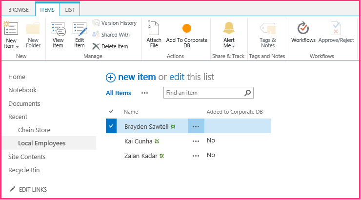
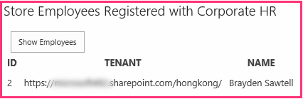

# <a name="include-a-custom-button-in-the-provider-hosted-add-in"></a>Добавление настраиваемой кнопки в надстройку, размещенную у поставщика
Узнайте, как добавить настраиваемую кнопку ленты в надстройку SharePoint, размещаемую у поставщика.
 

 **Примечание.** В настоящее время идет процесс замены названия "приложения для SharePoint" названием "надстройки SharePoint". Во время этого процесса в документации и пользовательском интерфейсе некоторых продуктов SharePoint и средств Visual Studio может по-прежнему использоваться термин "приложения для SharePoint". Дополнительные сведения см. в статье [Новое название приложений для Office и SharePoint](new-name-for-apps-for-sharepoint#bk_newname).
 

Это третья часть серии статей, посвященной основам разработки надстроек SharePoint, размещаемых у поставщика. Для начала вам следует ознакомиться со статьей [Надстройки SharePoint](sharepoint-add-ins) и предыдущими статьями из этой серии.
 

-  [Знакомство с созданием надстроек SharePoint с размещением у поставщика](get-started-creating-provider-hosted-sharepoint-add-ins)
    
 
-  [Настройка внешнего вида надстройки SharePoint, размещенной у поставщика](give-your-provider-hosted-add-in-the-sharepoint-look-and-feel)
    
 

 **Примечание.** Если вы изучали предыдущие статьи этой серии о надстройках, размещаемых у поставщика, то у вас уже есть решение для Visual Studio, которое можно использовать для работы с данной статьей. Кроме того, вы можете скачать репозиторий [SharePoint_SP-hosted_Add-Ins_Tutorials](https://github.com/OfficeDev/SharePoint_Provider-hosted_Add-ins_Tutorials) и открыть файл BeforeRibbonButton.sln.
 

Надстройка SharePoint может включать дополнительные действия, представляющие собой условие SharePoint для настраиваемых элементов меню или кнопок ленты. В данной статье рассказывается, как создать настраиваемую кнопку, которая синхронизирует список SharePoint с удаленной базой данных.
 

## <a name="create-a-custom-list-on-the-host-website"></a>Создание настраиваемого списка на хост-сайте

Предполагается, что настраиваемая кнопка будет размещена на ленте определенного списка, в котором записаны сведения о сотрудниках местного магазина. В одной из следующих статей этой серии вы узнаете, как программным способом добавить настраиваемый список на хост-сайт, а при изучении данной статьи вы добавите такой список вручную. 
 

 

1. На начальной странице магазина Fabrikam в Гонконге выберите пункты **Содержимое сайта | Добавить надстройку | Настраиваемый список**. 
    
 
2. В диалоговом окне **Добавление настраиваемого списка** укажите имя "Local Employees" (Местные сотрудники) и нажмите кнопку **Создать**. 
    
 
3. На странице **Содержимое сайта** откройте список **Местные сотрудники**.
    
 
4. Откройте вкладку **Список** на ленте, а затем нажмите кнопку **Параметры списка**.
    
 
5. В разделе **Столбцы** на странице **Параметры списка** выберите столбец **Название**.
    
 
6. В форме **Изменение столбца** измените значение в поле **Имя столбца** с "Название" на "Имя", а затем нажмите кнопку **ОК**.
    
 
7. На странице **Параметры** нажмите **Создать столбец**.
    
 
8. В форме **Создание столбца** выполните указанные ниже действия.
    
      1. В поле **Имя столбца** введите "Добавлено в корпоративную базу данных".
    
 
  2. Выберите тип **Да/нет (флажок)**.
    
 
  3. В поле **Значение по умолчанию** укажите значение **Нет**.
    
 
  4. Нажмите кнопку **ОК**. Снова откроется страница **Параметры**.
    
 
9. Выберите **Содержимое сайта**, чтобы открыть страницу **Содержимое сайта**. Она содержит плитку нового списка. Откройте ее.
    
 
10. Нажмите **Создать элемент**, а затем в форме создания элемента введите имя, но *не* устанавливайте флажок **Добавлено в корпоративную базу данных**. Затем нажмите кнопку **Сохранить**. Список должен выглядеть примерно так:
    
  
 

 

 

## <a name="add-the-custom-button"></a>Добавление настраиваемой кнопки

В этом разделе вы добавите в надстройку часть кода, которая будет развертывать кнопку на ленте списка. Когда пользователь выделяет сотрудника в списке и нажимает кнопку, имя сотрудника добавляется в корпоративную базу данных, а в поле **Добавлено в корпоративную базу данных** для этого сотрудника значение "Нет" меняется на "Да".
 

 

1.  *Если открыт Visual Studio, вам придется закрыть его*  и повторно открыть решение Chain Store, чтобы Visual Studio обнаружил новый список. (Запустите Visual Studio от имени администратора.)
    
     **Примечание.** Параметры запускаемых проектов в Visual Studio обычно возвращаются к значениям по умолчанию каждый раз, когда вы заново открываете решение. Открывая пример решения, рассматриваемый в этой серии статей, всегда выполняйте следующие действия: щелкните правой кнопкой мыши узел решения в **обозревателе решений** и выберите пункт **Назначить запускаемые проекты**, а затем убедитесь, что для всех трех проектов в столбце **Действие** задано значение **Запуск**.
2. В **обозревателе решений** щелкните правой кнопкой мыши проект **ChainStore** и выберите пункты **Добавить | Создать элемент**. 
    
 
3. В диалоговом окне **Добавление нового элемента** выберите **Настраиваемое действие ленты**, укажите имя AddEmployeeToCorpDB, а затем нажмите **Добавить**.
    
 
4. Откроется диалоговое окно с тремя вопросами. Выберите следующие ответы:
    

|**Вопрос**|**Ответ**|
|:-----|:-----|
|**Где требуется предоставить настраиваемое действие?**|Хост-сайт|
|**К какой области относится настраиваемое действие?**|Экземпляр списка|
|**Каким конкретным элементом ограничена область настраиваемого действия?**|Местные сотрудники|
5. Нажмите кнопку **Далее**. Появятся еще три вопроса.
    

|**Вопрос**|**Ответ**|
|:-----|:-----|
|**Где расположен этот элемент управления?**|Ribbon.ListItem.Actions|
|**Какой текст должен отображаться на подписи этой кнопки?**|Добавить в корпоративную базу данных|
|**Куда ведет элемент управления "кнопка"?**|ChainStoreWeb\Pages\EmployeeAdder.aspx (это страница, код которой будет добавлять сотрудника в базу данных)|
6. Нажмите кнопку **Готово**.
    
    Файл elements.xml, который определяет дополнительное действие, будет добавлен в проект и открыт. Вы можете обращаться с этим файлом как с "черным ящиком". Вам не потребуется вносить в него изменения до знакомства со следующими частями этой серии. А сейчас обратите внимание на указанный ниже момент.
    
      - Для атрибута **Location** элемента **CommandUIDefinition** задано значение `Ribbon.ListItem.Actions.Controls_children`. Его вторая часть (`ListItem`) идентифицирует вкладку на ленте, на которую будет помещена кнопка (но это может и не быть точным отображаемым именем вкладки), а третья часть (`Actions`) — это имя раздела ленты, в который будет помещена кнопка.
    
 
  - Атрибут **CommandAction** элемента **CommandUIHandler** начинается с заполнителя `~remoteAppUrl`. При развертывании кнопки он будет заменен на URL-адрес удаленного веб-приложения.
    
 
  - В значение **CommandAction** добавлены несколько параметров запроса с временными значениями в фигурных скобках. Эти заполнители разрешаются во время выполнения. Обратите внимание, что один из них представляет собой идентификатор элемента списка, выбранного пользователем перед нажатием настраиваемой кнопки на ленте.
    
 
7. В проекте **ChainStoreWeb** откройте файл **Pages/EmployeeAdder.aspx**. Обратите внимание, что он не содержит пользовательского интерфейса. Надстройка будет использовать эту страницу в качестве веб-службы. Это возможно благодаря тому, что в классе **System.Web.UI.Page** ASP.NET реализован объект **System.Web.IHttpHandler**, а событие **Page\_Load** автоматически выполняется при запросе страницы.
    
 
8. Откройте файл с кодом **Pages/EmployeeAdder.aspx.cs**. В нем уже есть метод, который добавляет сотрудника в удаленную базу данных (`AddLocalEmployeeToCorpDB`). В нем используется объект **SharePointContext** для получения URL-адреса хост-сайта, который надстройка использует в качестве своего дискриминатора клиента. Таким образом, в первую очередь метод **Page_Load** должен инициализировать этот объект. Объект создается и помещается в кэш в том же сеансе, в котором загружается начальная страница надстройки, поэтому добавьте приведенный ниже код в метод **Page_Load** (объект **SharePointContext** определен в файле SharePointContext.cs, который Инструменты разработчика Office для Visual Studio создают при создании решения надстройки).
    
```C#
  spContext = Session["SPContext"] as SharePointContext;
```

9. Метод  `AddLocalEmployeeToCorpDB` использует имя сотрудника в качестве параметра, поэтому добавьте указанную ниже строку в метод **Page_Load**. Вы создадите метод  `GetLocalEmployeeName` на одном из следующих этапов.
    
```C#
  // Read from SharePoint 
string employeeName = GetLocalEmployeeName();
```

10. Под этой строкой добавьте вызов метода `AddLocalEmployeeToCorpDB`.
    
```C#
  // Write to remote database 
AddLocalEmployeeToCorpDB(employeeName);
```

11. Добавьте в файл оператор **using** для пространства имен `Microsoft.SharePoint.Client` (при создании проекта **ChainStoreWeb** Инструменты разработчика Office для Visual Studio включили в него сборку Microsoft.SharePoint.Client).
    
 
12. Теперь добавьте указанный ниже метод в класс  `EmployeeAdder`. Клиентская объектная модель (CSOM) .NET для SharePoint подробно задокументирована на MSDN и мы рекомендуем вам изучить ее, когда вы закончите работу с этой серией статей. Для целей данной статьи обратите внимание, что класс **ListItem** представляет элемент в списке SharePoint и что на значение поля в элементе можно сослаться с помощью синтаксиса "индексатора". Кроме того, учтите, что код ссылается на поле, используя имя Title (Название) даже если вы изменили его на Name (Имя). Это происходит из-за того, что в коде необходимо ссылаться на поля, используя их *внутренние*  , а не отображаемые имена. Внутреннее имя поля указывается при создании поля и его не удастся изменить. Вы выполните `TODO1` на одном из следующих этапов.
    
```C#
  private string GetLocalEmployeeName()
{
    ListItem localEmployee;

    // TODO1: Initialize the localEmployee object by getting  
    // the item from SharePoint.
 
    return localEmployee["Title"].ToString();
}
```

13. Чтобы наш код смог получить элемент списка из SharePoint, ему потребуется идентификатор этого элемента. Добавьте указанное ниже объявление в класс  `EmployeeAdder` сразу же после объявления для объекта `spContext`.
    
```C#
  private int listItemID;
```

14. Теперь добавьте в класс `EmployeeAdder` приведенный ниже метод, чтобы получить идентификатор элемента из параметра запроса.
    
```C#
  private int GetListItemIDFromQueryParameter()
{
    int result;
    Int32.TryParse(Request.QueryString["SPListItemId"], out result);
    return result;
}
```

15. Чтобы инициализировать переменную `listItemID`, добавьте приведенную ниже строку в метод **Page_Load** сразу после строки, инициализирующей переменную `spContext`.
    
```C#
  listItemID = GetListItemIDFromQueryParameter();
```

16. В  `GetLocalEmployeeName` замените `TODO1` указанным ниже кодом. На данный момент относитесь к этому коду как к "черному ящику", потому что сейчас нас интересует то, как заставить работать настраиваемую кнопку. Мы более подробно рассмотрим этот код в следующей статье серии, которая будет целиком посвящена клиентской объектной модели SharePoint.
    
```C#
  using (var clientContext = spContext.CreateUserClientContextForSPHost())
{
    List localEmployeesList = clientContext.Web.Lists.GetByTitle("Local Employees");
    localEmployee = localEmployeesList.GetItemById(listItemID);
    clientContext.Load(localEmployee);
    clientContext.ExecuteQuery();
}

```


    The whole method should now look like the following.
    


```C#
  private string GetLocalEmployeeName()
{
    ListItem localEmployee;

    using (var clientContext = spContext.CreateUserClientContextForSPHost())
    {
        List localEmployeesList = clientContext.Web.Lists.GetByTitle("Local Employees");
        selectedLocalEmployee = localEmployeesList.GetItemById(listItemID);
        clientContext.Load(selectedLocalEmployee);
        clientContext.ExecuteQuery();
    }
    return localEmployee["Title"].ToString();
}
```

17. Страница EmployeeAdder не должна отрисовываться, поэтому добавьте приведенный ниже код в метод **Page_Load** в качестве последней строки. Она будет перенаправлять браузер обратно на страницу представления списка **Местные сотрудники**.
    
```C#
  // Go back to the Local Employees page
Response.Redirect(spContext.SPHostUrl.ToString() + "Lists/LocalEmployees/AllItems.aspx", true);

```


    The whole  **Page_Load** method should now look like the following.
    


```C#
  protected void Page_Load(object sender, EventArgs e)
{
    spContext = Session["SPContext"] as SharePointContext;
    listItemID = GetListItemIDFromQueryParameter();

    // Read from SharePoint
    string employeeName = GetLocalEmployeeName();

    // Write to remote database
    AddLocalEmployeeToCorpDB(employeeName);

    // Go back to the preceding page
    Response.Redirect(spContext.SPHostUrl.ToString() + "Lists/LocalEmployees/AllItems.aspx", true);
}
```


## <a name="request-permission-to-read-the-host-web-list"></a>Запрос разрешения на чтение списка на хост-сайте

Как вы уже видели, при установке надстройки SharePoint предлагает предоставить ей разрешения на доступ к хост-сайту. Каждый раз, когда вы нажимали клавишу F5, выполнялась переустановка надстройки. До настоящего момента у надстройки были только минимально необходимые разрешения, но методу  `GetLocalEmployeeName` необходимо разрешение на чтение списков хост-сайта. Надстройка использует свой манифест, чтобы сообщить SharePoint, какие разрешения ей необходимы. Выполните указанные ниже действия.
 

 

1. В **обозревателе решений** откройте файл AppManifest.xml проекта **ChainStore** (файл называется AppManifest, потому что ранее надстройки назывались приложениями). Откроется конструктор манифестов.
    
 
2. Откройте вкладку **Разрешения** и щелкните пустую ячейку под столбцом **Область**. Затем в раскрывающемся списке выберите **Список**.
    
 
3. В поле **Разрешение** выберите из раскрывающегося списка пункт **Чтение**.
    
 
4. Оставьте поле **Свойства** пустым и сохраните файл. Вкладка **Разрешение** должна выглядеть примерно так:
    
  
 

 

 

## <a name="run-the-add-in-and-test-the-button"></a>Запуск надстройки и тестирование кнопки


 

 

1. Нажмите клавишу F5, чтобы развернуть и запустить вашу надстройку. Visual Studio размещает удаленное веб-приложение в IIS Express, а базу данных SQL в SQL Express. Кроме того, он создает временную установку надстройки на вашем тестовом сайте SharePoint и сразу же запускает ее. Прежде чем откроется начальная страница надстройки, вам будет предложено предоставить надстройке необходимые разрешения. В этот раз будет предложен раскрывающийся список, в котором вы можете выбрать список, данные из которого необходимо считывать приложению, как показано на снимке экрана ниже. 
    
  
 

 

 
2. В списке выберите пункт **Местные сотрудники**, а затем нажмите кнопку **Доверять**.
    
 
3. Когда откроется начальная страница, на расположенном в верхней части элементе управления хрома нажмите кнопку **Вернуться на сайт**.
    
 
4. На домашней странице веб-сайта выберите пункты **Содержимое сайта | Местные сотрудники**. Откроется страница представления списка.
    
 
5. Добавьте нескольких сотрудников в список. *Не устанавливайте флажок **Добавлено в корпоративную базу данных**.* 
    
 
6. На ленте откройте вкладку **Элементы**. В разделе **Действия** вы увидите настраиваемую кнопку **Добавить в корпоративную базу данных**.
    
 
7. Выберите элемент в списке. Страница и лента должны выглядеть примерно так:
    
  
 

 

 
8. Нажмите кнопку **Добавить в корпоративную базу данных**. * **Перед этим необходимо выбрать элемент.*** 
    
 
9. Вам покажется, что страница перезагружается, так как метод **Page_Load** страницы EmployeeAdder выполняет перенаправление на нее.
    
 
10. Дважды нажмите кнопку "Назад" в браузере, чтобы вернуться на начальную страницу надстройки. 
    
 
11. Нажмите кнопку **Показать сотрудников**. Список сотрудников будет заполнен добавленными вами сотрудниками. Он должен выглядеть примерно так:
    
  
 

 

 
12. Чтобы завершить сеанс отладки, закройте окно браузера или остановите отладку в Visual Studio. При каждом нажатии клавиши F5 Visual Studio будет отзывать предыдущую версию надстройки и устанавливать ее последнюю версию.
    
 
13. Эти надстройка и решение Visual Studio будут рассматриваться и в других статьях, поэтому при перерывах в работе рекомендуется отзывать надстройку. В **обозревателе решений** щелкните проект правой кнопкой мыши и выберите пункт **Отозвать**.
    
 

## 
<a name="Nextsteps"> </a>

 В следующей статье мы немного отвлечемся от программирования и изучим клиентскую объектную модель SharePoint: [Краткий обзор объектной модели SharePoint](get-a-quick-overview-of-the-sharepoint-object-model).
 

 

