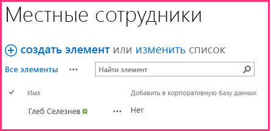

# <a name="include-a-custom-button-in-the-provider-hosted-add-in"></a><span data-ttu-id="69a0c-103">Добавление собственной кнопки в надстройку с размещением у поставщика</span><span class="sxs-lookup"><span data-stu-id="69a0c-103">Include a custom button in the provider-hosted add-in</span></span>

<span data-ttu-id="69a0c-104">Это третья часть серии статей, посвященной основам разработки надстроек SharePoint, размещаемых у поставщика. Для начала вам следует ознакомиться со статьей [Надстройки SharePoint](sharepoint-add-ins.md) и предыдущими статьями этой серии, представленными в разделе [Знакомство с созданием надстроек SharePoint, размещаемых у поставщика](get-started-creating-provider-hosted-sharepoint-add-ins.md#SP15createprovider_nextsteps).</span><span class="sxs-lookup"><span data-stu-id="69a0c-104">This is the third in a series of articles about the basics of developing provider-hosted SharePoint Add-ins. You should first be familiar with [SharePoint Add-ins](sharepoint-add-ins.md) and the previous articles in this series:</span></span> 
    
> [!NOTE]
> <span data-ttu-id="69a0c-105">Если вы изучали предыдущие статьи этой серии о размещаемых у поставщика надстройках, то у вас уже есть решение Visual Studio, которое можно использовать для работы с данной статьей.</span><span class="sxs-lookup"><span data-stu-id="69a0c-105">If you have been working through this series about provider-hosted add-ins, you have a Visual Studio solution that you can use to continue with this topic.</span></span> <span data-ttu-id="69a0c-106">Кроме того, вы можете скачать репозиторий [SharePoint_Provider-hosted_Add-Ins_Tutorials](https://github.com/OfficeDev/SharePoint_Provider-hosted_Add-ins_Tutorials) и открыть файл BeforeRibbonButton.sln.</span><span class="sxs-lookup"><span data-stu-id="69a0c-106">You can also download the repository at [SharePoint_Provider-hosted_Add-Ins_Tutorials](https://github.com/OfficeDev/SharePoint_Provider-hosted_Add-ins_Tutorials) and open the BeforeRibbonButton.sln file.</span></span>

<span data-ttu-id="69a0c-107">Надстройка SharePoint может включать дополнительные действия, представляющие собой термин SharePoint для специальных элементов меню или кнопок ленты.</span><span class="sxs-lookup"><span data-stu-id="69a0c-107">A SharePoint Add-in can include custom actions, which is the SharePoint term for custom menu items or ribbon buttons.</span></span> <span data-ttu-id="69a0c-108">В этой статье рассказано, как создать специальную кнопку, которая синхронизирует список SharePoint с удаленной базой данных.</span><span class="sxs-lookup"><span data-stu-id="69a0c-108">In this article, you'll learn how to create a custom button that synchronizes a SharePoint list with a remote database.</span></span>
 
## <a name="create-a-custom-list-on-the-host-website"></a><span data-ttu-id="69a0c-109">Создание специального списка на хост-сайте</span><span class="sxs-lookup"><span data-stu-id="69a0c-109">Create a custom list on the host website</span></span>

<span data-ttu-id="69a0c-p103">Предполагается, что настраиваемая кнопка будет размещена на ленте определенного списка, в котором записаны сведения о сотрудниках местного магазина. В одной из следующих статей этой серии вы узнаете, как программным способом добавить настраиваемый список на хост-сайт, а при изучении данной статьи вы добавите такой список вручную.</span><span class="sxs-lookup"><span data-stu-id="69a0c-p103">The custom button is going to be on the ribbon of a specific list that records the employees of the local store. In a later article in this series, you'll learn how to programmatically add a custom list to a host website, but for now you'll add one manually.</span></span> 

1. <span data-ttu-id="69a0c-112">На домашней странице магазина Fabrikam Hong Kong выберите пункты **Содержимое сайта** > **Добавить надстройку** > **Настраиваемый список**.</span><span class="sxs-lookup"><span data-stu-id="69a0c-112">From the home page of the Fabrikam Hong Kong Store, go to **Site Contents** > **Add an add-in** > **Custom List**.</span></span> 

2. <span data-ttu-id="69a0c-113">В диалоговом окне **Настраиваемый список — добавление** укажите имя **Local Employees** (Местные сотрудники) и нажмите кнопку **Создать**.</span><span class="sxs-lookup"><span data-stu-id="69a0c-113">In the **Adding Custom List** dialog, specify **Local Employees** as the name, and then select **Create**.</span></span> 

3. <span data-ttu-id="69a0c-114">На странице **Содержимое сайта** откройте список **Local Employees** (Местные сотрудники).</span><span class="sxs-lookup"><span data-stu-id="69a0c-114">On the **Site Contents** page, open the **Local Employees** list.</span></span>

4. <span data-ttu-id="69a0c-115">Откройте вкладку **Список** на ленте, а затем нажмите кнопку **Параметры списка**.</span><span class="sxs-lookup"><span data-stu-id="69a0c-115">On the **List** tab on the ribbon, select **List Settings**.</span></span>

5. <span data-ttu-id="69a0c-116">В разделе **Столбцы** на странице **Параметры списка** выберите столбец **Название**.</span><span class="sxs-lookup"><span data-stu-id="69a0c-116">In the **Columns** section of the **List Settings** page, select the **Title** column.</span></span>

6. <span data-ttu-id="69a0c-117">Откроется форма **Изменение столбца**. Замените значение **Название** в поле **Имя столбца** на **Имя**, а затем нажмите кнопку **ОК**.</span><span class="sxs-lookup"><span data-stu-id="69a0c-117">In the **Edit Column** form, change the **Column name** from **Title** to **Name**, and then select **OK**.</span></span>

7. <span data-ttu-id="69a0c-118">На странице **Параметры** выберите команду **Создать столбец**.</span><span class="sxs-lookup"><span data-stu-id="69a0c-118">On the **Settings** page, select **Create column**.</span></span>

8. <span data-ttu-id="69a0c-119">В форме **Создание столбца** выполните указанные ниже действия.</span><span class="sxs-lookup"><span data-stu-id="69a0c-119">In the **Create Column** form, do the following:</span></span>
    
   1. <span data-ttu-id="69a0c-120">В поле **Имя столбца** введите **Added to Corporate DB** (Добавлено в корпоративную базу данных).</span><span class="sxs-lookup"><span data-stu-id="69a0c-120">For **Column name**, enter **Added to Corporate DB**.</span></span>
   2. <span data-ttu-id="69a0c-121">В качестве **типа** укажите **Да/Нет (флажок)**.</span><span class="sxs-lookup"><span data-stu-id="69a0c-121">Set **type** to **Yes/No (check box)**.</span></span>
   3. <span data-ttu-id="69a0c-122">В поле **Значение по умолчанию** укажите значение **Нет**.</span><span class="sxs-lookup"><span data-stu-id="69a0c-122">Set **Default value** to **No**.</span></span>
   4. <span data-ttu-id="69a0c-123">Нажмите кнопку **ОК**.</span><span class="sxs-lookup"><span data-stu-id="69a0c-123">Select **OK**.</span></span> <span data-ttu-id="69a0c-124">Снова откроется страница **Параметры**.</span><span class="sxs-lookup"><span data-stu-id="69a0c-124">You are taken back to the **Settings** page.</span></span>
    
9. <span data-ttu-id="69a0c-125">Выберите **Содержимое сайта**, чтобы открыть страницу **Содержимое сайта**.</span><span class="sxs-lookup"><span data-stu-id="69a0c-125">Select **Site Contents** to open the **Site Contents** page.</span></span> <span data-ttu-id="69a0c-126">На ней отобразится плитка для нового списка.</span><span class="sxs-lookup"><span data-stu-id="69a0c-126">The tile for the new list is there.</span></span> <span data-ttu-id="69a0c-127">Откройте ее.</span><span class="sxs-lookup"><span data-stu-id="69a0c-127">Open it.</span></span>
    
10. <span data-ttu-id="69a0c-128">Щелкните **Создайте элемент** и в форме создания элемента введите имя, но *не* устанавливайте флажок **Added to Corporate DB** (Добавлено в корпоративную базу данных).</span><span class="sxs-lookup"><span data-stu-id="69a0c-128">Click **new item**, and on the create item form, enter a name, but do *not* select **Added to Corporate DB**.</span></span> <span data-ttu-id="69a0c-129">Нажмите кнопку **Сохранить**.</span><span class="sxs-lookup"><span data-stu-id="69a0c-129">Select **Save**.</span></span> <span data-ttu-id="69a0c-130">Список должен выглядеть примерно следующим образом:</span><span class="sxs-lookup"><span data-stu-id="69a0c-130">The list should look similar to the following.</span></span>

    <span data-ttu-id="69a0c-131">*Рис. 1. Список местных сотрудников с одним элементом*</span><span class="sxs-lookup"><span data-stu-id="69a0c-131">*Figure 1. Local Employees list with a single item*</span></span>

    

## <a name="add-the-custom-button"></a><span data-ttu-id="69a0c-135">Добавление специальной кнопки</span><span class="sxs-lookup"><span data-stu-id="69a0c-135">Add the custom button</span></span>

<span data-ttu-id="69a0c-136">В этом разделе показано, как добавить в надстройку часть кода, которая будет развертывать кнопку на ленте списка.</span><span class="sxs-lookup"><span data-stu-id="69a0c-136">In this section, you include markup in the add-in that deploys a button to the list's ribbon.</span></span> <span data-ttu-id="69a0c-137">Когда пользователь выделяет сотрудника в списке и нажимает кнопку, имя сотрудника добавляется в корпоративную базу данных, а в поле **Added to Corporate DB** (Добавлено в корпоративную базу данных) для этого сотрудника значение **Нет** заменяется на **Да**.</span><span class="sxs-lookup"><span data-stu-id="69a0c-137">When a user highlights an employee in the list and selects the button, the employee's name is added to the corporate database, and the **Added to Corporate DB** field for the employee switches from **No** to **Yes**.</span></span>

1.  <span data-ttu-id="69a0c-138">Если открыт редактор Visual Studio, вам необходимо будет закрыть его и повторно открыть решение Chain Store, чтобы Visual Studio обнаружил новый список. (Запустите Visual Studio от имени администратора.)</span><span class="sxs-lookup"><span data-stu-id="69a0c-138">If Visual Studio is open, you have to close it and reopen the Chain Store solution so that Visual Studio can discover your new list (run Visual Studio as an administrator).</span></span>
    
   > [!NOTE]
   > <span data-ttu-id="69a0c-139">Когда решение открывается повторно, для параметров раздела "Startup Projects" (Запускаемые проекты) в Visual Studio обычно возвращаются значения по умолчанию.</span><span class="sxs-lookup"><span data-stu-id="69a0c-139">The settings for Startup Projects in Visual Studio tend to revert to defaults whenever the solution is reopened.</span></span> <span data-ttu-id="69a0c-140">После повторного открытия примера решения, который рассматривается в этой серии статей, всегда выполняйте указанные ниже действия.</span><span class="sxs-lookup"><span data-stu-id="69a0c-140">Always take these steps immediately after reopening the sample solution in this series of articles:</span></span> 

   > 1. <span data-ttu-id="69a0c-141">В верхней части **обозревателя решений** щелкните узел решения правой кнопкой мыши и выберите пункт **Назначить запускаемые проекты**.</span><span class="sxs-lookup"><span data-stu-id="69a0c-141">Right-click the solution node at the top of **Solution Explorer**, and then select **Set startup projects**.</span></span>  
   > 2. <span data-ttu-id="69a0c-142">Убедитесь, что в столбце **Действие** для всех трех проектов указано значение **Запуск**.</span><span class="sxs-lookup"><span data-stu-id="69a0c-142">Ensure that all three projects are set to **Start** in the **Action** column.</span></span>

2. <span data-ttu-id="69a0c-143">В **обозревателе решений** щелкните правой кнопкой мыши проект **ChainStore** и выберите пункты **Добавить** > **Создать элемент**.</span><span class="sxs-lookup"><span data-stu-id="69a0c-143">Right-click the **ChainStore** project in **Solution Explorer**, and then select **Add** > **New Item**.</span></span> 
    
3. <span data-ttu-id="69a0c-144">В диалоговом окне **Добавить новый элемент** выберите **Настраиваемое действие ленты**, укажите имя **AddEmployeeToCorpDB**, а затем нажмите кнопку **Добавить**.</span><span class="sxs-lookup"><span data-stu-id="69a0c-144">In the **Add New Item** dialog, select **Ribbon Custom Action**, name it **AddEmployeeToCorpDB**, and then select **Add**.</span></span>

4. <span data-ttu-id="69a0c-p110">Откроется диалоговое окно с тремя вопросами. Выберите следующие ответы:</span><span class="sxs-lookup"><span data-stu-id="69a0c-p110">The dialog that opens asks three questions. Give the following answers:</span></span>

   |<span data-ttu-id="69a0c-147">**Вопрос**</span><span class="sxs-lookup"><span data-stu-id="69a0c-147">**Question**</span></span>|<span data-ttu-id="69a0c-148">**Ответ**</span><span class="sxs-lookup"><span data-stu-id="69a0c-148">**Give this answer:**</span></span>|
   |:-----|:-----|
   |<span data-ttu-id="69a0c-149">**Где требуется предоставить настраиваемое действие?**</span><span class="sxs-lookup"><span data-stu-id="69a0c-149">**Where do you want to expose the custom action?**</span></span>|<span data-ttu-id="69a0c-150">Хост-сайт</span><span class="sxs-lookup"><span data-stu-id="69a0c-150">Host Web</span></span>|
   |<span data-ttu-id="69a0c-151">**К какой области относится настраиваемое действие?**</span><span class="sxs-lookup"><span data-stu-id="69a0c-151">**Where is the custom action scoped to?**</span></span>|<span data-ttu-id="69a0c-152">Экземпляр списка</span><span class="sxs-lookup"><span data-stu-id="69a0c-152">List Instance</span></span>|
   |<span data-ttu-id="69a0c-153">**Каким конкретным элементом ограничена область настраиваемого действия?**</span><span class="sxs-lookup"><span data-stu-id="69a0c-153">**Which particular item is the custom action scoped to?**</span></span>|<span data-ttu-id="69a0c-154">Local Employees</span><span class="sxs-lookup"><span data-stu-id="69a0c-154">Local Employees</span></span>|

5. <span data-ttu-id="69a0c-155">Нажмите кнопку **Далее**. Появятся еще три вопроса.</span><span class="sxs-lookup"><span data-stu-id="69a0c-155">Select **Next** and you get three more questions:</span></span>

   |<span data-ttu-id="69a0c-156">**Вопрос**</span><span class="sxs-lookup"><span data-stu-id="69a0c-156">**Question**</span></span>|<span data-ttu-id="69a0c-157">**Ответ**</span><span class="sxs-lookup"><span data-stu-id="69a0c-157">**Give this answer:**</span></span>|
   |:-----|:-----|
   |<span data-ttu-id="69a0c-158">**Где расположен этот элемент управления?**</span><span class="sxs-lookup"><span data-stu-id="69a0c-158">**Where is the control located?**</span></span>|<span data-ttu-id="69a0c-159">Ribbon.ListItem.Actions</span><span class="sxs-lookup"><span data-stu-id="69a0c-159">Ribbon.ListItem.Actions</span></span>|
   |<span data-ttu-id="69a0c-160">**Какой текст должен отображаться на подписи этой кнопки?**</span><span class="sxs-lookup"><span data-stu-id="69a0c-160">**What is the label text for the button control?**</span></span>|<span data-ttu-id="69a0c-161">Add To Corporate DB</span><span class="sxs-lookup"><span data-stu-id="69a0c-161">Add to Corporate DB</span></span>|
   |<span data-ttu-id="69a0c-162">**Куда ведет элемент управления "Кнопка"?**</span><span class="sxs-lookup"><span data-stu-id="69a0c-162">**Where does the button control navigate to?**</span></span>|<span data-ttu-id="69a0c-163">ChainStoreWeb\Pages\EmployeeAdder.aspx</span><span class="sxs-lookup"><span data-stu-id="69a0c-163">ChainStoreWeb\Pages\EmployeeAdder.aspx</span></span><br/><span data-ttu-id="69a0c-164">(это страница, код программной части которой будет добавлять сотрудника в базу данных)</span><span class="sxs-lookup"><span data-stu-id="69a0c-164">(this is a page whose code-behind is going to add the employee to the database)</span></span>|

6. <span data-ttu-id="69a0c-165">Нажмите кнопку **Готово**.</span><span class="sxs-lookup"><span data-stu-id="69a0c-165">Click  **Finish**.</span></span>
    
   <span data-ttu-id="69a0c-166">Файл elements.xml, который определяет дополнительное действие, будет добавлен в проект и открыт.</span><span class="sxs-lookup"><span data-stu-id="69a0c-166">An elements.xml file that defines the custom action is added to the project and opened.</span></span> <span data-ttu-id="69a0c-167">Вы можете обращаться с этим файлом как с "черным ящиком". Вам не потребуется вносить в него изменения до знакомства со следующими статьями этой серии.</span><span class="sxs-lookup"><span data-stu-id="69a0c-167">For the most part, you can treat this file as a black box, and you won't need to make any changes in it until a later article in this series.</span></span> <span data-ttu-id="69a0c-168">А сейчас обратите внимание на указанные ниже моменты.</span><span class="sxs-lookup"><span data-stu-id="69a0c-168">For now, note only the following:</span></span>

   - <span data-ttu-id="69a0c-169">Атрибут **Location** элемента **CommandUIDefinition** имеет значение `Ribbon.ListItem.Actions.Controls_children`.</span><span class="sxs-lookup"><span data-stu-id="69a0c-169">The  **Location** attribute of the **CommandUIDefinition** element has the value `Ribbon.ListItem.Actions.Controls_children`.</span></span> <span data-ttu-id="69a0c-170">Его вторая часть (`ListItem`) идентифицирует *вкладку* на ленте, на которую будет помещена кнопка (но это может и не быть точным отображаемым именем вкладки).</span><span class="sxs-lookup"><span data-stu-id="69a0c-170">The second part of this, `ListItem`, identifies the *tab* on the ribbon where the button will be placed (but that may not be the exact display name of the tab).</span></span> <span data-ttu-id="69a0c-171">Третья часть (`Actions`) — это имя *раздела* ленты, в который будет помещена кнопка.</span><span class="sxs-lookup"><span data-stu-id="69a0c-171">The third part, `Actions`, is the name of the *section* of the ribbon where the button will be placed.</span></span>

   - <span data-ttu-id="69a0c-p113">Атрибут **CommandAction** элемента **CommandUIHandler** начинается с заполнителя `~remoteAppUrl`. При развертывании кнопки он будет заменен на URL-адрес удаленного веб-приложения.</span><span class="sxs-lookup"><span data-stu-id="69a0c-p113">The  **CommandAction** attribute of the **CommandUIHandler** element begins with the placeholder `~remoteAppUrl`. This will be replaced with the URL of the remote web application when the button is deployed.</span></span>

   - <span data-ttu-id="69a0c-174">В значение **CommandAction** с использованием значений заполнителей в фигурных скобках "{ }" добавлены несколько параметров запроса.</span><span class="sxs-lookup"><span data-stu-id="69a0c-174">A few query parameters have been added to the **CommandAction** value with placeholder values in braces "{ }".</span></span> <span data-ttu-id="69a0c-175">Эти заполнители разрешаются в среде выполнения.</span><span class="sxs-lookup"><span data-stu-id="69a0c-175">These placeholders are resolved at runtime.</span></span> <span data-ttu-id="69a0c-176">Обратите внимание, что один из них — идентификатор элемента списка, выбранного пользователем перед нажатием специальной кнопки на ленте.</span><span class="sxs-lookup"><span data-stu-id="69a0c-176">Note that one of them is the ID of the list item that is selected by the user before she selects the custom button on the ribbon.</span></span>

7. <span data-ttu-id="69a0c-177">В проекте **ChainStoreWeb** откройте файл **Pages/EmployeeAdder.aspx**.</span><span class="sxs-lookup"><span data-stu-id="69a0c-177">In the **ChainStoreWeb** project, open the **Pages/EmployeeAdder.aspx** file.</span></span> <span data-ttu-id="69a0c-178">Обратите внимание на то, что в нем нет пользовательского интерфейса.</span><span class="sxs-lookup"><span data-stu-id="69a0c-178">Notice that it doesn't have any UI.</span></span> <span data-ttu-id="69a0c-179">Предполагается, что надстройка будет использовать эту страницу в качестве веб-службы.</span><span class="sxs-lookup"><span data-stu-id="69a0c-179">The add-in is going to use this page as a kind of web service.</span></span> <span data-ttu-id="69a0c-180">Это возможно, так как класс ASP.NET **System.Web.UI.Page** реализует **System.Web.IHttpHandler** и при запрашивании страницы автоматически выполняется событие **Page\_Load**.</span><span class="sxs-lookup"><span data-stu-id="69a0c-180">This is possible because the ASP.NET **System.Web.UI.Page** class implements **System.Web.IHttpHandler** and because the **Page\_Load** event runs automatically when the page is requested.</span></span>  
 
8. <span data-ttu-id="69a0c-181">Откройте файл с кодом программной части **Pages/EmployeeAdder.aspx.cs**.</span><span class="sxs-lookup"><span data-stu-id="69a0c-181">Open the code-behind file **Pages/EmployeeAdder.aspx.cs**.</span></span> <span data-ttu-id="69a0c-182">В нем уже есть метод, который добавляет сотрудника в удаленную базу данных `AddLocalEmployeeToCorpDB`.</span><span class="sxs-lookup"><span data-stu-id="69a0c-182">The method that adds the employee to the remote database, `AddLocalEmployeeToCorpDB`, is already present.</span></span> <span data-ttu-id="69a0c-183">Он использует объект **SharePointContext** для получения URL-адреса хост-сайта, который надстройка использует в качестве своего дискриминатора клиента.</span><span class="sxs-lookup"><span data-stu-id="69a0c-183">It uses the **SharePointContext** object to get the host web's URL, which the add-in uses as its tenant discriminator.</span></span> <span data-ttu-id="69a0c-184">Первое, что должен сделать метод **Page_Load**, — инициализировать этот объект.</span><span class="sxs-lookup"><span data-stu-id="69a0c-184">The first thing the **Page_Load** method needs to do is initialize this object.</span></span> <span data-ttu-id="69a0c-185">Объект создается и помещается в кэш в сеансе, когда загружается начальная страница надстройки, поэтому добавьте указанный ниже код в метод **Page_Load**.</span><span class="sxs-lookup"><span data-stu-id="69a0c-185">The object is created and cached in the Session when the add-in's start page loads, so add the following code to the **Page_Load** method.</span></span> <span data-ttu-id="69a0c-186">(Объект **SharePointContext** определен в файле SharePointContext.cs, который пакет "Инструменты разработчика Office для Visual Studio" создает при создании решения надстройки.)</span><span class="sxs-lookup"><span data-stu-id="69a0c-186">(The **SharePointContext** object is defined in the SharePointContext.cs file that the Office Developer Tools for Visual Studio generates when the add-in solution is created.)</span></span>
    
    ```C#
      spContext = Session["SPContext"] as SharePointContext;
    ```

9. <span data-ttu-id="69a0c-187">Метод `AddLocalEmployeeToCorpDB` использует имя сотрудника в качестве параметра, поэтому добавьте указанную ниже строку в метод **Page_Load**.</span><span class="sxs-lookup"><span data-stu-id="69a0c-187">The `AddLocalEmployeeToCorpDB` method takes the employee's name as a parameter, so add the following line to the **Page_Load** method.</span></span> <span data-ttu-id="69a0c-188">Вы создадите метод `GetLocalEmployeeName` на одном из следующих этапов.</span><span class="sxs-lookup"><span data-stu-id="69a0c-188">You'll create the `GetLocalEmployeeName` method in a later step.</span></span>
    
    ```C#
      // Read from SharePoint 
    string employeeName = GetLocalEmployeeName();
    ```

10. <span data-ttu-id="69a0c-189">После этой строки добавьте вызов метода `AddLocalEmployeeToCorpDB`.</span><span class="sxs-lookup"><span data-stu-id="69a0c-189">Under this line, add the call to the `AddLocalEmployeeToCorpDB` method.</span></span>
    
    ```C#
      // Write to remote database 
    AddLocalEmployeeToCorpDB(employeeName);
    ```

11. <span data-ttu-id="69a0c-p118">Добавьте в файл оператор **using** для пространства имен `Microsoft.SharePoint.Client`. (При создании проекта **ChainStoreWeb**Инструменты разработчика Office для Visual Studio включил в него сборку Microsoft.SharePoint.Client.)</span><span class="sxs-lookup"><span data-stu-id="69a0c-p118">Add a **using** statement to file for the namespace `Microsoft.SharePoint.Client`. (The Office Developer Tools for Visual Studio included the Microsoft.SharePoint.Client assembly in the **ChainStoreWeb** project when it was created.)</span></span>
    
12. <span data-ttu-id="69a0c-192">Теперь добавьте указанный ниже метод в класс `EmployeeAdder`.</span><span class="sxs-lookup"><span data-stu-id="69a0c-192">Now add the following method to the `EmployeeAdder` class.</span></span> <span data-ttu-id="69a0c-193">Клиентская объектная модель (CSOM) .NET для SharePoint подробно задокументирована на MSDN. Рекомендуем изучить ее по завершении работы с этой серией статей.</span><span class="sxs-lookup"><span data-stu-id="69a0c-193">The SharePoint .NET Client-side Object Model (CSOM) is documented in detail elsewhere on MSDN, and we encourage you to explore it when you are finished with this series of articles.</span></span> <span data-ttu-id="69a0c-194">Обратите внимание на то, что класс **ListItem** представляет элемент в списке SharePoint и что на значение поля в элементе можно сослаться с помощью синтаксиса "индексатора".</span><span class="sxs-lookup"><span data-stu-id="69a0c-194">For this article, note that the **ListItem** class represents an item in a SharePoint list, and that the value of a field in the item can be referenced with "indexer" syntax.</span></span> <span data-ttu-id="69a0c-195">Кроме того, учтите, что код ссылается на поле, используя имя **Название**, даже если вы заменили его на **Имя**.</span><span class="sxs-lookup"><span data-stu-id="69a0c-195">Also notice that the code refers to the field as **Title** even though you changed the field name to **Name**.</span></span> <span data-ttu-id="69a0c-196">Это происходит из-за того, что в коде необходимо ссылаться на поля, используя их *внутренние*, а не отображаемые имена.</span><span class="sxs-lookup"><span data-stu-id="69a0c-196">This is because fields are always referred to in code by their *internal* name, not their display name.</span></span> <span data-ttu-id="69a0c-197">Внутреннее имя поля указывается при создании поля, и его невозможно изменить.</span><span class="sxs-lookup"><span data-stu-id="69a0c-197">The internal name of a field is set when the field is created and can never change.</span></span> <span data-ttu-id="69a0c-198">Вы выполните `TODO1` на одном из следующих этапов.</span><span class="sxs-lookup"><span data-stu-id="69a0c-198">You complete the `TODO1` in a later step.</span></span>
    
    ```C#
      private string GetLocalEmployeeName()
    {
        ListItem localEmployee;

        // TODO1: Initialize the localEmployee object by getting  
        // the item from SharePoint.

        return localEmployee["Title"].ToString();
    }
    ```

13. <span data-ttu-id="69a0c-199">Чтобы наш код смог получить элемент списка из SharePoint, ему потребуется идентификатор этого элемента.</span><span class="sxs-lookup"><span data-stu-id="69a0c-199">Our code will need the list item's ID before it can retrieve it from SharePoint.</span></span> <span data-ttu-id="69a0c-200">Добавьте указанное ниже объявление в класс `EmployeeAdder` сразу же после объявления для объекта `spContext`.</span><span class="sxs-lookup"><span data-stu-id="69a0c-200">Add the following declaration to the `EmployeeAdder` class just under the declaration for the `spContext` object.</span></span>
    
    ```C#
      private int listItemID;
    ```

14. <span data-ttu-id="69a0c-201">Теперь добавьте указанный ниже метод в класс `EmployeeAdder`, чтобы получить идентификатор элемента списка из параметра запроса.</span><span class="sxs-lookup"><span data-stu-id="69a0c-201">Now add the following method to the `EmployeeAdder` class to get the list item's ID from the query parameter.</span></span>
    
    ```C#
      private int GetListItemIDFromQueryParameter()
    {
        int result;
        Int32.TryParse(Request.QueryString["SPListItemId"], out result);
        return result;
    }
    ```

15. <span data-ttu-id="69a0c-202">Чтобы инициализировать переменную `listItemID`, добавьте указанную ниже строку в метод **Page_Load** сразу же за строкой, в которой выполняется инициализация переменной `spContext`.</span><span class="sxs-lookup"><span data-stu-id="69a0c-202">To initialize the `listItemID` variable, add the following line to the **Page_Load** method just under the line that initializes the `spContext` variable.</span></span>
    
    ```C#
      listItemID = GetListItemIDFromQueryParameter();
    ```

16. <span data-ttu-id="69a0c-203">В `GetLocalEmployeeName` замените `TODO1` указанным ниже кодом.</span><span class="sxs-lookup"><span data-stu-id="69a0c-203">In the `GetLocalEmployeeName`, replace the `TODO1` with the following code.</span></span> <span data-ttu-id="69a0c-204">На данный момент относитесь к этому коду как к "черному ящику", потому что сейчас нас интересует то, как заставить работать специальную кнопку.</span><span class="sxs-lookup"><span data-stu-id="69a0c-204">For the time being, just treat this code as a black box while we concentrate on getting the custom button working.</span></span> <span data-ttu-id="69a0c-205">Мы более подробно рассмотрим этот код в следующей статье серии, которая будет целиком посвящена клиентской объектной модели SharePoint.</span><span class="sxs-lookup"><span data-stu-id="69a0c-205">We'll learn more about this code in the next article in this series, which is all about the SharePoint client-side object model.</span></span>
    
    ```C#
      using (var clientContext = spContext.CreateUserClientContextForSPHost())
    {
        List localEmployeesList = clientContext.Web.Lists.GetByTitle("Local Employees");
        localEmployee = localEmployeesList.GetItemById(listItemID);
        clientContext.Load(localEmployee);
        clientContext.ExecuteQuery();
    }

    ```

   <span data-ttu-id="69a0c-206">Теперь весь метод должен выглядеть, как указано ниже.</span><span class="sxs-lookup"><span data-stu-id="69a0c-206">The entire method should now look like the following.</span></span>

    ```C#
      private string GetLocalEmployeeName()
     {
         ListItem localEmployee;

         using (var clientContext = spContext.CreateUserClientContextForSPHost())
         {
             List localEmployeesList = clientContext.Web.Lists.GetByTitle("Local Employees");
             selectedLocalEmployee = localEmployeesList.GetItemById(listItemID);
             clientContext.Load(selectedLocalEmployee);
             clientContext.ExecuteQuery();
         }
         return localEmployee["Title"].ToString();
     }
     ```

17. <span data-ttu-id="69a0c-207">Страница EmployeeAdder не должна отрисовываться, поэтому добавьте указанный ниже код в метод **Page_Load** в качестве последней строки.</span><span class="sxs-lookup"><span data-stu-id="69a0c-207">The EmployeeAdder page should not actually render, so add the following as the last line in the **Page_Load** method.</span></span> <span data-ttu-id="69a0c-208">Она будет перенаправлять браузер обратно на страницу представления списка для списка **Local Employees** (Местные сотрудники).</span><span class="sxs-lookup"><span data-stu-id="69a0c-208">This redirects the browser back to the list view page for the **Local Employees** list.</span></span>
    
    ```C#
      // Go back to the Local Employees page
    Response.Redirect(spContext.SPHostUrl.ToString() + "Lists/LocalEmployees/AllItems.aspx", true);

    ```

   <span data-ttu-id="69a0c-209">Теперь весь метод **Page_Load** должен выглядеть, как указано ниже.</span><span class="sxs-lookup"><span data-stu-id="69a0c-209">The entire **Page_Load** method should now look like the following.</span></span>

    ```C#
          protected void Page_Load(object sender, EventArgs e)
        {
            spContext = Session["SPContext"] as SharePointContext;
            listItemID = GetListItemIDFromQueryParameter();

            // Read from SharePoint
            string employeeName = GetLocalEmployeeName();

            // Write to remote database
            AddLocalEmployeeToCorpDB(employeeName);

            // Go back to the preceding page
            Response.Redirect(spContext.SPHostUrl.ToString() + "Lists/LocalEmployees/AllItems.aspx", true);
        }
    ```


## <a name="request-permission-to-read-the-host-web-list"></a><span data-ttu-id="69a0c-210">Запрашивание разрешения на чтение списка на хост-сайте</span><span class="sxs-lookup"><span data-stu-id="69a0c-210">Request permission to read the host web list</span></span>

<span data-ttu-id="69a0c-211">Как вы уже видели, при установке надстройки SharePoint предлагает предоставить ей разрешения на доступ к хост-сайту.</span><span class="sxs-lookup"><span data-stu-id="69a0c-211">As you have seen, SharePoint prompts you to grant the add-in permissions to the host web when it is installed.</span></span> <span data-ttu-id="69a0c-212">Каждый раз, когда вы нажимали клавишу F5, выполнялась переустановка надстройки.</span><span class="sxs-lookup"><span data-stu-id="69a0c-212">You have been re-installing the add-in every time you select F5.</span></span> <span data-ttu-id="69a0c-213">До настоящего момента у надстройки были только минимально необходимые разрешения, но методу `GetLocalEmployeeName` необходимо разрешение на чтение списков хост-сайта.</span><span class="sxs-lookup"><span data-stu-id="69a0c-213">So far, the add-in has only needed minimal permissions, but the `GetLocalEmployeeName` method requires permission to read the lists of the host website.</span></span> <span data-ttu-id="69a0c-214">Надстройка использует свой манифест, чтобы сообщить SharePoint, какие разрешения ей необходимы.</span><span class="sxs-lookup"><span data-stu-id="69a0c-214">The add-in uses its add-in manifest to tell SharePoint what permissions it needs.</span></span> <span data-ttu-id="69a0c-215">Выполните указанные ниже действия.</span><span class="sxs-lookup"><span data-stu-id="69a0c-215">Follow these steps.</span></span>

1. <span data-ttu-id="69a0c-216">В **обозревателе решений** откройте файл AppManifest.xml в проекте **ChainStore** (файл называется AppManifest и в нем использовано слово App, потому что ранее надстройки назывались приложениями).</span><span class="sxs-lookup"><span data-stu-id="69a0c-216">In **Solution Explorer**, open the AppManifest.xml file in the **ChainStore** project (the file is called AppManifest because add-ins used to be called "apps").</span></span> <span data-ttu-id="69a0c-217">Откроется конструктор манифестов.</span><span class="sxs-lookup"><span data-stu-id="69a0c-217">The manifest designer opens.</span></span>

2. <span data-ttu-id="69a0c-218">Откройте вкладку **Разрешения** и щелкните пустую ячейку в столбце **Область**. Затем в раскрывающемся списке выберите **Список**.</span><span class="sxs-lookup"><span data-stu-id="69a0c-218">Open the **Permissions** tab, select the empty cell under the **Scope** column, and then select **List** from the drop-down.</span></span>

3. <span data-ttu-id="69a0c-219">Щелкнув пустую ячейку в столбце **Разрешение**, в раскрывающемся списке выберите **Read**.</span><span class="sxs-lookup"><span data-stu-id="69a0c-219">In the **Permission** field, select **Read** from the drop-down.</span></span>

4. <span data-ttu-id="69a0c-220">Оставьте столбец **Свойства** пустым и сохраните файл.</span><span class="sxs-lookup"><span data-stu-id="69a0c-220">Leave the **Properties** field empty and save the file.</span></span> <span data-ttu-id="69a0c-221">Вкладка **Разрешения** должна иметь примерно следующий вид:</span><span class="sxs-lookup"><span data-stu-id="69a0c-221">The **Permissions** tab should look similar to the following.</span></span>

   <span data-ttu-id="69a0c-222">*Рис. 2. Вкладка "Разрешения"*</span><span class="sxs-lookup"><span data-stu-id="69a0c-222">*Figure 2. Permissions tab*</span></span>

   


## <a name="run-the-add-in-and-test-the-button"></a><span data-ttu-id="69a0c-224">Запуск надстройки и тестирование кнопки</span><span class="sxs-lookup"><span data-stu-id="69a0c-224">Run the add-in and test the button</span></span>

1. <span data-ttu-id="69a0c-225">Нажмите клавишу F5, чтобы развернуть и запустить надстройку.</span><span class="sxs-lookup"><span data-stu-id="69a0c-225">Use the F5 key to deploy and run your add-in.</span></span> <span data-ttu-id="69a0c-226">Редактор Visual Studio размещает удаленное веб-приложение в IIS Express, а базу данных SQL — в SQL Express.</span><span class="sxs-lookup"><span data-stu-id="69a0c-226">Visual Studio hosts the remote web application in IIS Express and hosts the SQL database in SQL Express.</span></span> <span data-ttu-id="69a0c-227">Кроме того, он выполняет временную установку надстройки на вашем тестовом сайте SharePoint и сразу же запускает ее.</span><span class="sxs-lookup"><span data-stu-id="69a0c-227">It also makes a temporary installation of the add-in on your test SharePoint site and immediately runs the add-in.</span></span> <span data-ttu-id="69a0c-228">Прежде чем откроется начальная страница надстройки, вам будет предложено предоставить надстройке необходимые разрешения.</span><span class="sxs-lookup"><span data-stu-id="69a0c-228">You are prompted to grant permissions to the add-in before its start page opens.</span></span> <span data-ttu-id="69a0c-229">В этот раз будет отображен раскрывающийся список, в котором вы можете выбрать список, данные из которого необходимо считывать приложению, как показано на снимке экрана ниже.</span><span class="sxs-lookup"><span data-stu-id="69a0c-229">This time the prompt has a drop-down where you select the list that the app needs to read as seen in the following screenshot.</span></span> 
  
   <span data-ttu-id="69a0c-230">*Рис. 3. Запрос на предоставление разрешения надстройке SharePoint*</span><span class="sxs-lookup"><span data-stu-id="69a0c-230">*Figure 3. SharePoint add-in permission prompt*</span></span>

   

2. <span data-ttu-id="69a0c-232">В списке выберите пункт **Local Employees** (Местные сотрудники), а затем нажмите кнопку **Сделать доверенным**.</span><span class="sxs-lookup"><span data-stu-id="69a0c-232">Select **Local Employees** from the list, and then select **Trust it**.</span></span>

3. <span data-ttu-id="69a0c-233">Когда откроется начальная страница надстройки, выберите **Вернуться на сайт** на размещенном в верхней части элементе управления хрома.</span><span class="sxs-lookup"><span data-stu-id="69a0c-233">When the add-in's start page opens, select **Back to Site** on the chrome control at the top.</span></span>

4. <span data-ttu-id="69a0c-234">На домашней странице веб-сайта выберите **Содержимое сайта** > **Local Employees** (Местные сотрудники).</span><span class="sxs-lookup"><span data-stu-id="69a0c-234">From the website's home page, go to **Site Contents** > **Local Employees**.</span></span> <span data-ttu-id="69a0c-235">Откроется страница представления списка.</span><span class="sxs-lookup"><span data-stu-id="69a0c-235">The list view page opens.</span></span>

5. <span data-ttu-id="69a0c-236">Добавьте несколько сотрудников в список.</span><span class="sxs-lookup"><span data-stu-id="69a0c-236">Add a few employees to the list.</span></span> <span data-ttu-id="69a0c-237">*Не устанавливайте флажок __Added to Corporate DB__ (Добавлено в корпоративную базу данных).*</span><span class="sxs-lookup"><span data-stu-id="69a0c-237">*Do not select the __Added to Corporate DB__ check box.*</span></span> 

6. <span data-ttu-id="69a0c-238">На ленте откройте вкладку **Элементы**. В разделе **Действия** вкладки есть специальная кнопка **Add to Corporate DB** (Добавить в корпоративную базу данных).</span><span class="sxs-lookup"><span data-stu-id="69a0c-238">On the ribbon, open the **Items** tab. In the **Actions** section of the tab is the custom button **Add to Corporate DB**.</span></span>

7. <span data-ttu-id="69a0c-239">Выберите элемент в списке.</span><span class="sxs-lookup"><span data-stu-id="69a0c-239">Select an item in the list.</span></span> <span data-ttu-id="69a0c-240">Страница и лента должны иметь примерно следующий вид:</span><span class="sxs-lookup"><span data-stu-id="69a0c-240">The page and ribbon should look similar to the following.</span></span>

   <span data-ttu-id="69a0c-241">*Рис. 4. Список местных сотрудников*</span><span class="sxs-lookup"><span data-stu-id="69a0c-241">*Figure 4. Local Employees list*</span></span>  

   

8. <span data-ttu-id="69a0c-245">Выбрав элемент в списке, нажмите кнопку **Add To Corporate DB** (Добавить в корпоративную базу данных).</span><span class="sxs-lookup"><span data-stu-id="69a0c-245">After selecting an item in the list, select **Add to Corporate DB**.</span></span> 

9. <span data-ttu-id="69a0c-246">Вам покажется, что страница перезагружается, так как метод **Page_Load** страницы EmployeeAdder выполняет перенаправление на нее.</span><span class="sxs-lookup"><span data-stu-id="69a0c-246">The page seems to reload because the **Page_Load** method of the EmployeeAdder page redirects back to it.</span></span>

10. <span data-ttu-id="69a0c-247">Дважды нажмите кнопку "Назад" в браузере, чтобы вернуться на начальную страницу надстройки.</span><span class="sxs-lookup"><span data-stu-id="69a0c-247">Use the browser's back button twice to go back to the add-in's start page.</span></span> 

11. <span data-ttu-id="69a0c-248">Нажмите кнопку **Show Employees** (Показать сотрудников), после чего список сотрудников будет заполнен добавленными вами сотрудниками.</span><span class="sxs-lookup"><span data-stu-id="69a0c-248">Select **Show Employees**, and the list of employees will be populated with the employee that you added.</span></span> <span data-ttu-id="69a0c-249">Он должен выглядеть примерно следующим образом:</span><span class="sxs-lookup"><span data-stu-id="69a0c-249">It should look similar to the following:</span></span>

   <span data-ttu-id="69a0c-250">*Рис. 5. Список сотрудников организации на начальной странице надстройки*</span><span class="sxs-lookup"><span data-stu-id="69a0c-250">*Figure 5. Corporate employees list on the add-in start page*</span></span> 

   

12. <span data-ttu-id="69a0c-252">Чтобы завершить сеанс отладки, закройте окно браузера или остановите отладку в Visual Studio.</span><span class="sxs-lookup"><span data-stu-id="69a0c-252">To end the debugging session, close the browser window or stop debugging in Visual Studio.</span></span> <span data-ttu-id="69a0c-253">При каждом нажатии клавиши F5 Visual Studio будет отзывать предыдущую версию надстройки и устанавливать ее последнюю версию.</span><span class="sxs-lookup"><span data-stu-id="69a0c-253">Each time that you select F5, Visual Studio retracts the previous version of the add-in and installs the latest one.</span></span>

13. <span data-ttu-id="69a0c-254">Вы будете работать с этой надстройкой и решением Visual Studio при изучении других статей, поэтому при перерывах в работе рекомендуем отзывать надстройку.</span><span class="sxs-lookup"><span data-stu-id="69a0c-254">You will work with this add-in and Visual Studio solution in other articles, and it's a good practice to retract the add-in one last time when you are done working with it for a while.</span></span> <span data-ttu-id="69a0c-255">В **обозревателе решений** щелкните проект правой кнопкой мыши и выберите пункт **Отозвать**.</span><span class="sxs-lookup"><span data-stu-id="69a0c-255">Right-click the project in **Solution Explorer** and select **Retract**.</span></span>

## <a name="next-steps"></a><span data-ttu-id="69a0c-256">Дальнейшие действия</span><span class="sxs-lookup"><span data-stu-id="69a0c-256">Next steps</span></span>
<span data-ttu-id="69a0c-257"><a name="Nextsteps"> </a></span><span class="sxs-lookup"><span data-stu-id="69a0c-257"></span></span>

<span data-ttu-id="69a0c-258">В следующей статье мы немного отвлечемся от программирования и [ознакомимся с клиентской объектной моделью SharePoint](get-a-quick-overview-of-the-sharepoint-object-model.md).</span><span class="sxs-lookup"><span data-stu-id="69a0c-258">In the next article, we'll take a brief break from coding to [get a quick overview of the SharePoint client-side object model](get-a-quick-overview-of-the-sharepoint-object-model.md).</span></span>
 

 

