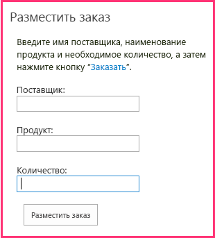

# Добавление веб-части надстройки в надстройку с размещением у поставщика

Это шестая часть серии статей, посвященной основам разработки надстроек SharePoint, размещаемых у поставщика. Для начала вам следует ознакомиться со статьей [Надстройки SharePoint](sharepoint-add-ins.md) и предыдущими статьями этой серии, представленными в разделе [Знакомство с созданием надстроек SharePoint, размещаемых у поставщика](get-started-creating-provider-hosted-sharepoint-add-ins.md#SP15createprovider_nextsteps). 
    
> [!NOTE]
> Если вы изучали предыдущие статьи этой серии о размещаемых у поставщика надстройках, то у вас уже есть решение Visual Studio, которое можно использовать для работы с данной статьей. Кроме того, вы можете скачать репозиторий на веб-странице [SharePoint_Provider-hosted_Add-Ins_Tutorials](https://github.com/OfficeDev/SharePoint_Provider-hosted_Add-ins_Tutorials) и открыть файл BeforeAdd-inPart.sln.

В этой статье показано добавление веб-части особого типа, называемой веб-частью надстройки, в надстройку SharePoint. Веб-часть надстройки предоставляет доступ к форме заказа надстройки на странице SharePoint.

## Создание веб-части надстройки

> [!NOTE]
> Когда решение открывается повторно, для параметров раздела "Запускаемые проекты" в Visual Studio обычно возвращаются значения по умолчанию. После повторного открытия примера решения, который рассматривается в этой серии статей, всегда выполняйте указанные ниже действия. 
> 1. В верхней части **обозревателя решений** щелкните узел решения правой кнопкой мыши и выберите пункт **Назначить запускаемые проекты**.  
> 2. Убедитесь, что в столбце **Действие** для всех трех проектов указано значение **Запуск**.

1. В **обозревателе решений** щелкните правой кнопкой мыши проект **ChainStore** и выберите пункты **Добавить** > **Новый элемент**.
    
2. Выберите **веб-часть клиента (хост-сайт)**, присвойте ей имя **Place Order** (Размещение заказа), а затем нажмите кнопку **Добавить**. ("Клиентская веб-часть" — это еще одно название веб-части надстройки.)
 
3. На следующей странице мастера выберите второй вариант (**Выберите или введите URL-адрес существующей веб-страницы для контента клиентской веб-части**).

4. В раскрывающемся списке выберите URL-адрес для страницы **OrderForm.aspx**, а затем нажмите кнопку **Готово**.
    
   В проект будет добавлен файл elements.xml, в котором определяется веб-часть надстройки. Затем этот файл будет открыт.
    
5. В элементе **ClientWebPart** измените указанные ниже атрибуты на следующие значения:
   
    |**Атрибут**|**Значение**|
    |:-----|:-----|
    |Название|Разместить заказ|
    |Описание|Форма размещения заказа|
    |DefaultHeight (Высота, используемая по умолчанию)|320|

    Для других атрибутов оставьте значения, используемые по умолчанию, и закройте файл.
    
## Запуск надстройки и тестирование веб-части надстройки

1. Нажмите клавишу F5, чтобы развернуть и запустить надстройку. Редактор Visual Studio размещает удаленное веб-приложение в IIS Express, а базу данных SQL — в SQL Express. Кроме того, он выполняет временную установку надстройки на вашем тестовом сайте SharePoint и сразу же запускает ее. Прежде чем откроется начальная страница надстройки, вам будет предложено предоставить надстройке необходимые разрешения.

2. Когда откроется начальная страница надстройки, сама надстройка будет уже развернута, и пользователи смогут добавлять веб-часть надстройки **Place Order** (Размещение заказа) в любую область веб-частей на любой странице SharePoint веб-сайта магазина в Гонконге. Чтобы добавить ее на начальную страницу, выполните указанные ниже действия.
    
   1. На расположенном в верхней части начальной страницы элементе управления хрома нажмите кнопку **Back to Site** (Вернуться на сайт). Откроется домашняя страница магазина в Гонконге.
   2. На ленте откройте вкладку **Страница** и нажмите кнопку **Изменить**.
   3. После перевода страницы в режим правки откройте вкладку **Вставка** на ленте и нажмите кнопку **Веб-часть надстройки** (она может по-прежнему называться **Веб-часть приложения**).
   4. В открывшемся элементе управления вставки веб-части выберите веб-часть надстройки **Размещение заказа**. Элемент управления будет выглядеть примерно так, как показано ниже.

      *Рис. 1. Элемент управления вставки веб-части в SharePoint*

      

   5. Щелкните какую-нибудь из зон веб-частей на форме. Это необходимо, чтобы задать расположение для веб-части надстройки. 
   6. На элементе управления вставки веб-части щелкните **Добавить**. Веб-часть надстройки **Place Order** (Размещение заказа) будет добавлена в зону веб-частей.
   7. На ленте нажмите кнопку **Сохранить**.
    
3. Теперь форма заказа отображается на странице. У нее такие же внешний вид и удобство использования, как и у остальной части страницы. Форма должна выглядеть указанным ниже образом. 
    
   *Рис. 2. Веб-часть надстройки Place Order (Размещение заказа)*

   

4. Введите значения для полей **Supplier** (Поставщик), **Product** (Продукт) и **Quantity** (Количество), а затем нажмите кнопку **Place Order** (Заказать). На экране ничего не произойдет, но заказ будет введен в корпоративную базу данных. При необходимости вы можете очистить поля веб-части надстройки, обновив страницу.

5. Нажимайте кнопку "Назад" в браузере, пока не вернетесь на начальную страницу надстройки Chain Store (Сетевой магазин), а затем нажмите кнопку **Show Orders** (Показать заказы). В списке будет отображаться ваш новый заказ.

6. Чтобы завершить сеанс отладки, закройте окно браузера или остановите отладку в Visual Studio. При каждом нажатии клавиши F5 Visual Studio отзывает предыдущую версию надстройки и устанавливает ее последнюю версию.

7. Вы будете работать с этой надстройкой и решением Visual Studio при изучении других статей, поэтому при перерывах в работе рекомендуем отзывать надстройку. В **обозревателе решений** щелкните проект правой кнопкой мыши и выберите пункт **Отозвать**.

## Дальнейшие действия

Надстройка зависит от двух списков, которые вы создали вручную. Но вы наверняка не хотите, чтобы пользователи тоже делали это вручную. В следующей статье показано автоматическое создание этих списков. Первое основное действие — создать пользовательские обработчики для событий установки надстройки: [Обработка событий надстроек в надстройках, размещаемых у поставщика](handle-add-in-events-in-the-provider-hosted-add-in.md).
 

 

