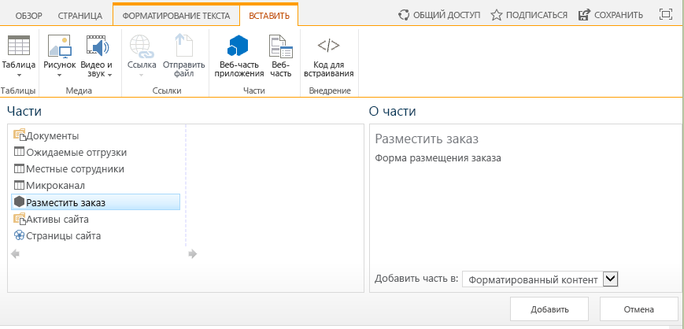

# Добавление веб-части надстройки в надстройку с размещением у поставщикаInclude an add-in part in the provider-hosted add-in

Это шестая часть серии статей, посвященной основам разработки надстроек SharePoint, размещаемых у поставщика. Для начала вам следует ознакомиться со статьей [Надстройки SharePoint](sharepoint-add-ins.md) и предыдущими статьями этой серии, представленными в разделе [Знакомство с созданием надстроек SharePoint, размещаемых у поставщика](get-started-creating-provider-hosted-sharepoint-add-ins.md#SP15createprovider_nextsteps).This is the sixth in a series of articles about the basics of developing provider-hosted SharePoint Add-ins. You should first be familiar with [SharePoint Add-ins](sharepoint-add-ins.md) and the previous articles in this series: 
    
> [!NOTE]
> Если вы изучали предыдущие статьи этой серии о размещаемых у поставщика надстройках, то у вас уже есть решение Visual Studio, которое можно использовать для работы с данной статьей.If you have been working through this series about provider-hosted add-ins, you have a Visual Studio solution that you can use to continue with this topic. Кроме того, вы можете скачать репозиторий на веб-странице [SharePoint_Provider-hosted_Add-Ins_Tutorials](https://github.com/OfficeDev/SharePoint_Provider-hosted_Add-ins_Tutorials) и открыть файл BeforeAdd-inPart.sln.You can also download the repository at [SharePoint_Provider-hosted_Add-Ins_Tutorials](https://github.com/OfficeDev/SharePoint_Provider-hosted_Add-ins_Tutorials) and open the BeforeAdd-inPart.sln file.

В этой статье показано добавление веб-части особого типа, называемой веб-частью надстройки, в надстройку SharePoint.In this article, you add a special kind of Web Part called an add-in part to the SharePoint Add-in. Веб-часть надстройки предоставляет доступ к форме заказа надстройки на странице SharePoint.The add-in part exposes the add-in's order form on a SharePoint page.

## Создание веб-части надстройкиCreate the add-in part

> [!NOTE]
> Когда решение открывается повторно, для параметров раздела "Запускаемые проекты" в Visual Studio обычно возвращаются значения по умолчанию.The settings for Startup Projects in Visual Studio tend to revert to defaults whenever the solution is reopened. После повторного открытия примера решения, который рассматривается в этой серии статей, всегда выполняйте указанные ниже действия.Always take these steps immediately after reopening the sample solution in this series of articles: 
> 1. В верхней части **обозревателя решений** щелкните узел решения правой кнопкой мыши и выберите пункт **Назначить запускаемые проекты**.Right-click the solution node at the top of **Solution Explorer**, and then select **Set startup projects**.  
> 2. Убедитесь, что в столбце **Действие** для всех трех проектов указано значение **Запуск**.Ensure that all three projects are set to **Start** in the **Action** column.

1. В **обозревателе решений** щелкните правой кнопкой мыши проект **ChainStore** и выберите пункты **Добавить** > **Новый элемент**.In **Solution Explorer**, right-click the **ChainStore** project, and then select **Add** > **New Item**.
    
2. Выберите **веб-часть клиента (хост-сайт)**, присвойте ей имя **Place Order** (Размещение заказа), а затем нажмите кнопку **Добавить**.Select **Client Web Part (Host Web)**, give it the name **Place Order**, and then select **Add**. ("Клиентская веб-часть" — это еще одно название веб-части надстройки.)("Client Web Part" is another name for "add-in part".)
 
3. На следующей странице мастера выберите второй вариант (**Выберите или введите URL-адрес существующей веб-страницы для контента клиентской веб-части**).On the next page of the wizard, select the second option: **Select or enter the URL of an existing web page for the client web part content**.

4. В раскрывающемся списке выберите URL-адрес для страницы **OrderForm.aspx**, а затем нажмите кнопку **Готово**.In the drop-down list, select the URL for the **OrderForm.aspx** page, and then select **Finish**.
    
   В проект будет добавлен файл elements.xml, в котором определяется веб-часть надстройки. Затем этот файл будет открыт.An elements.xml file that defines the add-in part is added to the project and opened.
    
5. В элементе **ClientWebPart** измените указанные ниже атрибуты на следующие значения:In the **ClientWebPart** element, change the following attributes to these values:
   
    |**Атрибут****Attribute**|**Значение****Value**|
    |:-----|:-----|
    |НазваниеTitle|Разместить заказPlace Order|
    |ОписаниеDescription|Форма размещения заказаForm to place an order|
    |DefaultHeight (Высота, используемая по умолчанию)DefaultHeight|320320 px|

    Для других атрибутов оставьте значения, используемые по умолчанию, и закройте файл.Leave all the other attributes with their defaults and save the file.
    
## Запуск надстройки и тестирование веб-части надстройкиRun the add-in and test the add-in part

1. Нажмите клавишу F5, чтобы развернуть и запустить надстройку.Use the F5 key to deploy and run your add-in. Редактор Visual Studio размещает удаленное веб-приложение в IIS Express, а базу данных SQL — в SQL Express.Visual Studio hosts the remote web application in IIS Express and hosts the SQL database in SQL Express. Кроме того, он выполняет временную установку надстройки на вашем тестовом сайте SharePoint и сразу же запускает ее.It also makes a temporary installation of the add-in on your test SharePoint site and immediately runs the add-in. Прежде чем откроется начальная страница надстройки, вам будет предложено предоставить надстройке необходимые разрешения.You are prompted to grant permissions to the add-in before its start page opens.

2. Когда откроется начальная страница надстройки, сама надстройка будет уже развернута, и пользователи смогут добавлять веб-часть надстройки **Place Order** (Размещение заказа) в любую область веб-частей на любой странице SharePoint веб-сайта магазина в Гонконге.When the add-in's start page opens, the add-in has been deployed, and the **Place Order** add-in part is available for users to add to any Web Part area on any SharePoint page on the Hong Kong store's website. Чтобы добавить ее на начальную страницу, выполните указанные ниже действия.Follow these steps to add it to the home page:
    
   1. На расположенном в верхней части начальной страницы элементе управления хрома нажмите кнопку **Back to Site** (Вернуться на сайт). Откроется домашняя страница магазина в Гонконге.Select **Back to Site** on the chrome control at the top of the start page to open the home page of the Hong Kong store.
   2. На ленте откройте вкладку **Страница** и нажмите кнопку **Изменить**.On the ribbon, open the **Page** tab and select **Edit**.
   3. После перевода страницы в режим правки откройте вкладку **Вставка** на ленте и нажмите кнопку **Веб-часть надстройки** (она может по-прежнему называться **Веб-часть приложения**).After the page is in edit mode, open the **Insert** tab on the ribbon, and then select **Add-in Part** (the button may still be called **App Part**).
   4. В открывшемся элементе управления вставки веб-части выберите веб-часть надстройки **Размещение заказа**.On the Web Part insertion control that opens, select the **Place Order** add-in part. Элемент управления будет выглядеть примерно так, как показано ниже.The control looks similar to the following.

      *Рис. 1. Элемент управления вставки веб-части в SharePoint**Figure 1. SharePoint's Web Part insertion control*

      

   5. Щелкните какую-нибудь из зон веб-частей на форме. Это необходимо, чтобы задать расположение для веб-части надстройки.Select somewhere in one of the Web Part zones of the form to set the location where the add-in part will go. 
   6. На элементе управления вставки веб-части щелкните **Добавить**.Select **Add** on the Web Part insertion control. Веб-часть надстройки **Place Order** (Размещение заказа) будет добавлена в зону веб-частей.The **Place Order** add-in part is added to the Web Part zone.
   7. На ленте нажмите кнопку **Сохранить**.On the ribbon, select **Save**.
    
3. Теперь форма заказа отображается на странице. У нее такие же внешний вид и удобство использования, как и у остальной части страницы.The order form now appears on the page, and it has the look-and-feel of the rest of the page. Форма должна выглядеть указанным ниже образом.It should look like the following. 
    
   *Рис. 2. Веб-часть надстройки Place Order (Размещение заказа)**Figure 2. Place Order add-in part*

   

4. Введите значения для полей **Supplier** (Поставщик), **Product** (Продукт) и **Quantity** (Количество), а затем нажмите кнопку **Place Order** (Заказать).Enter values for **Supplier**, **Product**, and **Quantity**, and then select **Place Order**. На экране ничего не произойдет, но заказ будет введен в корпоративную базу данных.Nothing appears to happen, but an order is entered in the corporate database. При необходимости вы можете очистить поля веб-части надстройки, обновив страницу.Optionally, you can empty the fields of the add-in part by refreshing the page.

5. Нажимайте кнопку "Назад" в браузере, пока не вернетесь на начальную страницу надстройки Chain Store (Сетевой магазин), а затем нажмите кнопку **Show Orders** (Показать заказы).Use the browser's back button until you are back at the Chain Store add-in's start page, and then select **Show Orders**. В списке будет отображаться ваш новый заказ.Your new order is listed.

6. Чтобы завершить сеанс отладки, закройте окно браузера или остановите отладку в Visual Studio.To end the debugging session, close the browser window or stop debugging in Visual Studio. При каждом нажатии клавиши F5 Visual Studio отзывает предыдущую версию надстройки и устанавливает ее последнюю версию.Each time you select F5, Visual Studio retracts the previous version of the add-in and installs the latest one.

7. Вы будете работать с этой надстройкой и решением Visual Studio при изучении других статей, поэтому при перерывах в работе рекомендуем отзывать надстройку.You will work with this add-in and Visual Studio solution in other articles, and it's a good practice to retract the add-in one last time when you are done working with it for a while. В **обозревателе решений** щелкните проект правой кнопкой мыши и выберите пункт **Отозвать**.Right-click the project in **Solution Explorer** and select **Retract**.

## Дальнейшие действияNext steps

Надстройка зависит от двух списков, которые вы создали вручную. Но вы наверняка не хотите, чтобы пользователи тоже делали это вручную.The add-in depends on two lists that you created manually; you don't want your users to have to do that. В следующей статье показано автоматическое создание этих списков.In the next article, you begin the process of automatically creating these lists. Первое основное действие — создать пользовательские обработчики для событий установки надстройки: [Обработка событий надстроек в надстройках, размещаемых у поставщика](handle-add-in-events-in-the-provider-hosted-add-in.md).The first major step is to create custom handlers for the event of installing an add-in: [Handle add-in events in the provider-hosted add-in](handle-add-in-events-in-the-provider-hosted-add-in.md).
 

 

