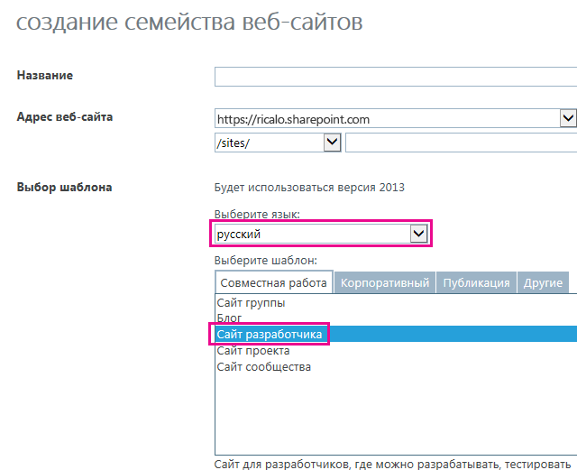

# <a name="localize-sharepoint-add-ins"></a>Локализация надстроек SharePoint
Узнайте, как локализовать надстройку SharePoint с помощью файлов ресурсов (в том числе JavaScript) и других методов.
 

 **Примечание.** В настоящее время идет процесс замены названия "приложения для SharePoint" названием "надстройки SharePoint". Во время этого процесса в документации и пользовательском интерфейсе некоторых продуктов SharePoint и средств Visual Studio может по-прежнему использоваться термин "приложения для SharePoint". Дополнительные сведения см. в статье [Новое название приложений для Office и SharePoint](new-name-for-apps-for-sharepoint.md#bk_newname).
 


 **Примечание.** В этой статье предполагается, что вы знакомы с основами создания надстроек SharePoint, компонентами SharePoint, разницей между сайтами надстроек и хост-сайтами, [типами компонентов SharePoint, которые можно размещать в надстройке](host-webs-add-in-webs-and-sharepoint-components-in-sharepoint.md#TypesOfSPComponentsInApps), и основами локализации с помощью RESX-файлов.
 


## <a name="get-ready-to-localize-a-sharepoint-add-in"></a>Подготовка к локализации надстройки SharePoint
<a name="Prerequisites"> </a>

Прежде чем начать, определите следующее: 
 

 

- Языковые стандарты, которые должна поддерживать надстройка. SharePoint Online и локальная система SharePoint с установленными языковыми пакетами позволяют создавать веб-сайты на определенном языке. Определите, какие локализованные веб-сайты будут использовать ваши клиенты и для каких из них необходимо локализовать компоненты надстройки.
    
 
- Компоненты, которые необходимо локализовать в надстройке.
    
 
Кроме того, обратите внимание на следующее:
 

 

-  В этой статье предполагается, что вы используете последнюю версию Инструментов разработчика Microsoft Office для [Visual Studio 2013](http://aka.ms/OfficeDevToolsForVS2013) или [Visual Studio 2015](http://aka.ms/OfficeDevToolsForVS2015).
    
     **Примечание.** Если тестовый веб-сайт SharePoint является локальной фермой SharePoint, а не сайтом разработчика Microsoft SharePoint Online, возможно, потребуется установить языковые пакеты для языков, на которые вы будете переводить надстройку SharePoint. Дополнительные сведения см. в статьях [Установка и удаление языковых пакетов для SharePoint](http://technet.microsoft.com/en-us/library/cc262108%28v=office.15%29.aspx) и [Языковые пакеты в SharePoint Server 2013](http://technet.microsoft.com/en-us/library/ff463597%28v=office.15%29.aspx), а также по ссылкам для загрузки в последней статье.
- Снимки экранов и примеры кода в этой статье демонстрируют пример  [SharePoint-Add-in-Localization](https://github.com/OfficeDev/SharePoint-Add-in-Localization). Вы можете скачать пример, чтобы увидеть результаты описанных здесь процедур.
    
 

## <a name="localize-the-add-in-web-components"></a>Локализация компонентов сайта надстройки
<a name="LocalizingAppWeb"> </a>

Сайт надстройки может содержать определенные типы компонентов SharePoint. Дополнительные сведения см. в разделе  [Типы компонентов SharePoint, которые могут находиться в надстройке для SharePoint](host-webs-add-in-webs-and-sharepoint-components-in-sharepoint.md#TypesOfSPComponentsInApps). Чтобы локализовать компоненты, развернутые на сайте надстройки, добавьте RESX-файлы в модули в компоненте, который содержит компонент сайта надстройки. Добавьте ссылки на ресурсы в разметку компонента. Ниже описано, как это сделать. Однако дополнительные страницы сайта в надстройке SharePoint используют файлы строковых переменных JavaScript, а не RESX-файлы, как описано ниже.
 

 

 **Примечание.** Несколько компонентов сайтов надстройки не могут использовать одни и те же файлы ресурсов. Для каждого компонента в WSP-файле необходимо создать отдельный набор файлов ресурсов.
 


### <a name="to-create-the-add-in-web-resource-files"></a>Создание файлов ресурсов для сайта надстройки


1. Откройте проект надстройки SharePoint в Visual Studio. Пример, из которого взяты снимки экрана в этом разделе, представляет из себя размещенную у поставщика надстройку с веб-формами ASP.NET в качестве удаленного веб-приложения, входящего в проект.
    
 
2. В **обозревателе решений** откройте контекстное меню для имени компонента, а затем выберите пункт **Добавить ресурс компонента**.
    
 
3. В диалоговом окне **Добавление ресурса** выберите **Инвариантный язык (Инвариантная страна)**, а затем нажмите кнопку **ОК**. Файл Resources.resx будет добавлен в папку компонента в **обозревателе решений** и откроется в **редакторе ресурсов** Visual Studio. 
    
    При редактировании этот файл "инвариантного языка" содержит строки, используемые в коллекции **компонентов** на всех сайтах на тех языках, для которых вы *не* собираетесь предоставлять локализованные версии строк. Следовательно, для строк в этом файле следует использовать язык, наиболее подходящий в качестве второго языка для пользователей SharePoint. Традиционно в этих целях используется английский, но в некоторых случаях может лучше подходить другой язык. Например, в некоторых регионах наиболее распространенным вторым языком может быть французский, а не английский. В примере из этого раздела в качестве инвариантного языка используется английский.
    
     **Примечание.** Надстройку SharePoint невозможно установить на веб-сайте, язык которого не указан в разделе **Поддерживаемые коды языков** манифеста надстройки. Помните, что даже если в этой статье рассматриваются языки, на которые вы *не* собираетесь локализовать надстройку, их все равно необходимо добавить в манифест надстройки. Дополнительные сведения о поддерживаемых языковых стандартах в манифесте надстройки см. в разделе **Создание файлов ресурсов для хост-сайта** этой статьи.
4. В столбце **Имя** верхней строки **редактора ресурсов** введите описательное имя строки (или другого ресурса), например OrdersListInstance_Title или OrdersListInstance_Description. Эти имена локализуемых ресурсов сами не локализуются. Каждому ресурсу необходимо присвоить собственное имя. 
    
 
5. В столбце **Значение** введите соответствующую строку (либо URL-адрес или другой ресурс) на инвариантном языке, например "Заказы" и "Список для хранения заказов".
    
 
6. Добавьте дополнительные пары имен и значений для всех строк и ресурсов, которые требуется локализовать в каких-либо компонентах.
    
 
7. Сохраните файл.
    
 
8. Добавьте в компонент еще один файл ресурсов, используя тот же способ, но выберите конкретный язык вместо значения **Инвариантный язык (Инвариантная страна)**. Например, можно выбрать **Испанский (Испания)**. Файл Resources.LL-CC.resx (где `LL` и `CC`[совместимы с IETF](http://tools.ietf.org/html/rfc1766)-кодами языка и региональных параметров) добавляется в папку компонента в **обозревателе решений** и открывается в **редакторе ресурсов** Visual Studio. 
    
 
9. С помощью **редактора ресурсов** скопируйте все строки из файла Resource.resx и вставьте их в новый файл Resources.LL-CC.resx. Если команда **Копировать** не включена в контекстном меню редактора ресурсов, скопируйте строки в буфер обмена с помощью клавиш CTRL+C.
    
 
10. В файле Resources.LL-CC.resx замените ячейки **Значение** на переведенные версии строковых значений. Для URL-адресов и других ресурсов, не являющихся строками, замените его на новое значение, соответствующее языку и региональным параметрам.
    
 
11. Сохраните новый файл.
    
 
12. Повторите последние четыре действия для каждого иностранного языка. 
    
     **Примечание.** Рекомендуем добавить языковой файл для того языка, который используется в качестве инвариантного. В этом случае строки можно скопировать, не меняя их значения. Во многих ситуациях наличие файла для языка, который используется в файле ресурсов как инвариантный, не требуется, особенно когда единственными ресурсами в файлах являются строки. Но файлы ресурсов также могут содержать изображения, значки, файлы и другие ресурсы. Иногда необходимо, чтобы в файле ресурсов для инвариантного языка использовалось изображение или другой ресурс, который отличается от соответствующего ресурса в *каком-либо* из языковых файлов.
13. Убедитесь, что для свойства **Действие при сборке** каждого файла задано значение **Содержимое**.
    
 

### <a name="to-call-the-localized-resources-in-custom-lists"></a>Вызов локализованных ресурсов в настраиваемых списках


1. Чтобы локализовать свойства заголовка и описания в настраиваемом списке, откройте файл **Elements.xml** экземпляра списка. Например, в примере из этой статьи необходимо выбрать элементы **BookstoreApp** > **Order Status** > **OrderStatusInstance** > **Elements.xml** в **обозревателе решений**.
    
 
2. Для атрибута **Title** укажите значение $Resources: _StringName_, где _StringName_ — это имя (не значение), которое в предыдущей процедуре вы назначили строке, задающей название настраиваемого списка, например $Resources: OrdersListInstance_Title. Обратите внимание: в отличие от некоторых ситуаций, в которых используются RESX-файлы, указываемые данные *не* включают имя файла ресурсов.
    
 
3. С помощью атрибута **Description** вызовите таким же образом строковый ресурс описания списка, например $Resources:OrdersListInstance_Description. Ниже представлена часть кода с использованием локализованных строк из файла Elements.xml этого экземпляра списка.
    
```XML
  <?xml version="1.0" encoding="utf-8"?>
<Elements xmlns="http://schemas.microsoft.com/sharepoint/">
  <ListInstance 
      Title="$Resources:OrdersListInstance_Title" 
      OnQuickLaunch="TRUE" 
      TemplateType="10000" 
      Url="Lists/Orders" 
      Description="$Resources:OrdersListInstance_Description">
  </ListInstance>
</Elements>
```


    The following image shows the localized custom list in English.
    

    **Localized custom list**

 

  
 

 

 

### <a name="to-localize-the-column-names-of-a-custom-list"></a>Локализация имен столбцов настраиваемого списка


1. Имена столбцов настраиваемого списка невозможно локализовать так же, как заголовок и описание. Чтобы локализовать имена столбцов, необходимо объявить поля списка в файле **Elements.xml**, а затем задать в качестве значения атрибута **DisplayName** ссылки в файлах ресурсов для сайта надстройки. Для начала откройте файл **Schema.xml** настраиваемого списка. Найдите узел **Fields** и скопируйте все его узлы **Field**.
    
 
2. Откройте файл **Elements.xml** настраиваемого списка. Убедитесь, что открыт файл Elements.xml определения списка, а не его экземпляра. Вставьте узлы из предыдущего этапа в качестве дочерних в узел **Elements**.
    
 
3. Для каждого узла **Field** укажите значение $Resources: _StringName_ в атрибуте **DisplayName**, где _StringName_ — это имя записи в файле ресурсов сайта надстройки.
    
 
4. В файле **Schema.xml** настраиваемого списка удалите атрибут **DisplayName** каждого ранее скопированного узла **Field**. Ниже приведен пример части кода с использованием локализованных строк в файле **Elements.xml** определения списка.
    
```
  <?xml version="1.0" encoding="utf-8"?>
<Elements xmlns="http://schemas.microsoft.com/sharepoint/">
    <ListTemplate
        Name="Orders"
        Type="10000"
        BaseType="0"
        OnQuickLaunch="TRUE"
        SecurityBits="11"
        Sequence="410"
        DisplayName="Orders"
        Description="My List Definition"
        Image="/_layouts/15/images/itgen.png"/>
    <Field
        Name="Bookname"
        ID="{2ef60a05-29b6-41db-9611-c0cf7d8e73c5}"
        DisplayName="$Resources:OrdersListColumn_Bookname"
        Type="Text"
        Required="TRUE" />
    <Field
        Name="Price"
        ID="{7af42815-d69e-426a-a1c8-9da5610e362c}"
        DisplayName="$Resources:OrdersListColumn_Price"
        Type="Currency"
        Required="FALSE" />
    <Field
        Name="Orderstatus"
        ID="{687ee751-2e0a-4099-966e-d2c225d48234}"
        DisplayName="$Resources:OrdersListColumn_Orderstatus"
        Type="Lookup"
        Required="FALSE"
        List="Lists/Order status"
        ShowField="Title" />
</Elements>
```


### <a name="to-create-javascript-resource-files-for-custom-pages"></a>Создание файлов ресурсов JavaScript для настраиваемых страниц


1. Настраиваемые страницы надстройки SharePoint используют файлы со строковыми переменными JavaScript вместо RESX-файлов. 
    
    Для начала в **обозревателе решений** добавьте папку Scripts в проект надстройки SharePoint (но не в проект веб-приложения), если такой папки еще нет. Щелкните папку **Scripts** правой кнопкой мыши и выберите **Добавить** > **Новый элемент** > **Интернет** > **Файл JavaScript**. Присвойте файлу имя Resources._LL_- _CC_.js (где _LL_ — это код языка, а _CC_ — код страны или региона либо региональных параметров). Пример: Resources.en-US.js.
    
 
2. Повторите это действие для каждого иностранного языка. У вас должны быть пустые файлы JavaScript для каждого языка.  *Не*  создавайте файл инвариантного языка с именем "Resources.js". Причина будет разъяснена в следующей процедуре.
    
 
3. Откройте первый из новых файлов JavaScript.
    
 
4. Для каждой локализуемой строки на каждой из настраиваемых страниц объявите в файле переменную с именем, которое идентифицирует цель строки, и назначьте ей значение, соответствующее языку. Ниже приведено содержимое файла Resources.en-US.js.
    
```
  var instructionstitle = "Instructions:";
var step01 = "Go to any document library in the host web.";
var step02 = "Go to the Library tab.";
var step03 = "Click \"Request a book\" in the Settings group.";
var step04 = "Click the contextual menu in any document.";
var step05 = "Click \"Buy this book\" in the contextual menu.";
var step06 = "Go to any SharePoint page in the host web and add the" +
    " Bookstore orders add-in part.";
var step07 = "Review the localized <a href=\"../Lists/Orders\">Orders</a>" +
    " and <a href=\"../Lists/Order status\">Order status</a> custom lists.";

```

5. Скопируйте содержимое этого файла во все остальные файлы JavaScript и сохраните их.
    
 
6. В каждом файле замените значение каждой переменной новым значением, соответствующим языку этого файла.  *Не изменяйте имена переменных.* 
    
 

### <a name="to-call-the-localized-variables-in-custom-aspx-pages"></a>Вызов локализованных переменных в настраиваемых страницах ASPX


1. В **обозревателе решений** откройте файл настраиваемой страницы ASPX.
    
 
2. Убедитесь, что при загрузке страницы загружается только один из локализованных файлов JavaScript, соответствующий языку сайта надстройки SharePoint. Для этого добавьте приведенную ниже часть кода в элемент **asp:content** страницы, которая содержит свойство `ContentPlaceholderId` со значением `PlaceholderAdditionalPageHead`. *В этой части кода нет заполнителей. Вводите часть кода в точности, как указано здесь.* 
    
```HTML
  <script type="text/javascript" src="../scripts/Resources.<SharePoint:EncodedLiteral runat='server' text='<%$Resources:wss,language_value%>' EncodeMethod='HtmlEncode' />.js"></script>
```


    This markup loads one of your JavaScript files. It determines which language file to load by reading the SharePoint resource named "language_value." This resource resolves to a language-culture name in the pattern  _LL_- _CC_ that was described in an earlier procedure. Specifically, it resolves to the language of the add-in web.
    
     **Note**  The SharePoint resource "language_value" is never null, so a file named "Resources.js" would never be called by this script. That is why you did not make one in the preceding procedure. When the value of "language_value" is a language for which there is no .js file, this script loads nothing. The next step explains how strings get an invariant language value in that situation.
3. Для каждого локализуемого элемента и значения атрибута на странице укажите значение по умолчанию на инвариантном языке, но затем назначьте его соответствующей переменной из файла Resources._LL_- _CC_.js с помощью JavaScript. Например, если название страницы содержится в элементе **h2**, добавьте к этому элементу атрибут **id**, а затем вставьте элемент **script** под локализованными элементами, чтобы назначить локализованные строки свойству **innerText** локализованных элементов. Этот код локализации должен запускаться, только если файл Resources._LL_- _CC_.js загружен и содержит объявления переменных. Поэтому вставьте его в условный блок, который скачала проверяет, определена ли одна из переменных. Если это не так, то скрипт ресурсов не загружен и значения по умолчанию (инвариантные) должны оставаться без изменений. Ниже приведен пример. 
    
     **Совет.** В первую из инвариантных строк добавлено слово INVARIANT. В рабочей надстройке так не делают, но при тестировании это помогает быстро проверить, используются ли строки на инвариантном языке, а также загружен ли файл Resources._LL_- _CC_.js для инвариантного языка.

```HTML
  <h2 id="instructionsheading">INVARIANT Instructions</h2>
<ol>
    <li id="step01">Go to any document library in the host web.</li>
    <li id="step02">Go to the Library tab.</li>
    <li id="step03">Click "Request a book" in the Settings group.</li>
    <li id="step04">Click the contextual menu in any document.</li>
    <li id="step05">Click "Buy this book" in the contextual menu.</li>
    <li id="step06">Go to any SharePoint page in the host web and add the Bookstore orders add-in part.</li>
    <li id="step07">Review the localized <a href="../Lists/Orders">Orders</a> and <a href="../Lists/Order status">Order status</a> custom lists.</li>
</ol>

<!-- Use the localized strings in the resource JavaScript file -->
<script type="text/javascript">
    window.onload = function () {
        <!-- Test whether a Resources.LL-CC.js loaded.
             If none was, the invariant values remain unchanged. -->
        if (typeof instructionstitle != 'undefined')  
        {
            document.getElementById("instructionsheading").innerText = instructionstitle;
            document.getElementById("step01").innerText = step01;
            document.getElementById("step02").innerText = step02;
            document.getElementById("step03").innerText = step03;
            document.getElementById("step04").innerText = step04;
            document.getElementById("step05").innerText = step05;
            document.getElementById("step06").innerText = step06;
            document.getElementById("step07").innerHTML = step07;
        }
    }
</script>

```


    The following image gives a preview of how the English version of the page will look when the add-in is completed. 
    

    **Webpage using localized strings from a JavaScript resource file**

 

  
 

 

 

## <a name="localize-the-host-web-components"></a>Локализация компонентов хост-сайта
<a name="LocalizingHostWeb"> </a>

Название надстройки, заданное в файле AppManifest.xml, можно локализовать. Это то, что видят пользователи на странице **Ваши надстройки**. Хост-сайт для надстройки SharePoint также может включать дополнительное действие и/или веб-часть приложения. Они развертываются в компоненте хост-сайта. Все эти компоненты могут содержать локализуемые строки.
 

 
Основной способ локализации компонентов хост-сайта такой же, что и для локализации компонентов сайта надстройки: локализованные ресурсы перечисляются в RESX-файле и вызываются из файлов разметки. Однако Visual Studio не имеет такого объема инструментальной поддержки этого процесса, который применяется для компонентов хост-сайта. Для этого использует выполняемый вручную процесс, который описан ниже в данном разделе.
 

 

### <a name="to-create-resource-files-for-the-host-web"></a>Создание файлов ресурсов для хост-сайта


1. В **обозревателе решений** выберите файл AppManifest.xml, чтобы открыть конструктор манифеста надстройки.
    
 
2. Откройте вкладку **Поддерживаемые коды языков**.
    
 
3. В пустой верхней ячейке столбца **Языки** откройте раскрывающийся список и выберите первый языковой стандарт, поддержку которого требуется обеспечить. Создаются два файла, которые добавляются в проект надстройки SharePoint: Resources.resx (файл ресурсов на инвариантном языке) и Resources._LL_- _CC_.resx, который будет содержать локализованные ресурсы. *Не меняйте имена этих файлов.* 
    
 
4. Повторите предыдущее действие для каждого языкового стандарта, который требуется поддерживать с помощью локализованной версии надстройки. Дополнительный файл Resources. _LL_- _CC_.resx создается для каждого языкового стандарта.
    
     **Примечание.** Для свойства **Действие при сборке** каждого из этих файлов задано значение **Содержимое**, а не **Ресурс**. *Не меняйте этот параметр.* 
5. Кроме того, добавьте записи языковых стандартов для каждого языкового стандарта, с которым должна устанавливаться надстройка, но для которого используется инвариантный язык; то есть языковые стандарты, для которых  *не*  будет предоставляться локализованная версия надстройки. *Удалите RESX-файлы, созданные для этих языковых стандартов.* 
    
 
6. Откройте файл Resources.resx и добавьте имена и значения ресурсов в файл, как это делалось в файлах ресурсов для сайта надстройки. Как минимум, необходим ресурс для названия надстройки. Компонент хост-сайта никак не отображается в интерфейсе пользователя SharePoint, поэтому вам не нужны локализованные строки для названия или описания этого компонента. Если компонент содержит дополнительное действие, то потребуется ресурс для атрибута **Title** элемента **CustomAction** и, возможно, других строк в части кода дополнительного действия. Если имеется веб-часть надстройки, то потребуются ресурсы для атрибутов **Title** и **Description** элемента **ClientWebPart**. Если веб-часть надстройки включает настраиваемые свойства, то у каждого элемента **Property** есть атрибуты, которые также необходимо локализовать. Для каждого из них потребуется строка в файле ресурсов.
    
 
7. Скопируйте содержимое файла Resources.resx во все остальные файлы Resources._LL_- _CC_.resx.
    
 
8. Локализуйте все ресурсы во всех файлах Resources._LL_- _CC_.resx, как это делалось для файлов ресурсов сайта надстройки.
    
 

### <a name="to-call-the-localized-resources-in-the-add-in-manifest-and-other-xml-files"></a>Вызов локализованных ресурсов в манифесте надстройки и других XML-файлах


1. Откройте файл AppManifest.xml и замените значение элемента **Title** на вызов соответствующей строки ресурса. Например, если строка получила имя Addin_Title, то элемент **Title** должен выглядеть так:
    
```XML
  <Title>$Resources:Addin_Title;</Title>
```


     **Caution**  The value of  **Title** can contain *only*  the call to the resource. There can be no other text, symbols, or white space.
2. Чтобы вызвать локализованные ресурсы в других файлах XML, таких как Elements.xml для веб-частей надстроек и дополнительных действий, вы можете использовать тот же формат, который вы использовали в файле манифеста надстройки.
    
 

## <a name="localize-remote-components-in-a-sharepoint-add-in"></a>Локализация удаленных компонентов в надстройке SharePoint
<a name="LocalizingAutohosted"> </a>

Если удаленные компоненты используют формат PHP или другой формат, не являющийся форматом Майкрософт, см. инструкции по локализации для соответствующей платформы. Если удаленные компоненты представляют из себя ASP.NET, они локализуются точно так же, как компоненты любого другого приложения ASP.NET. Дополнительные сведения см. в статье  [ASP.NET Globalization and Localization](http://msdn.microsoft.com/library/8ef3838e-9d05-4236-9dd0-ceecff9df80d.aspx).
 

 
Переопределите языки страницы и потока, чтобы они соответствовали языку хост-сайта. Для этого необходимо переопределить унаследованный метод **InitializeCulture** в коде страниц ASP.NET. Чтобы определить язык хост-сайта, используйте параметр запроса **SPLanguage**, который SharePoint передает на удаленную страницу. В приведенном ниже коде показано, как сделать это в ASP.NET. В веб-приложении PHP или на другой платформе используются подобные действия.
 

 


```C#
protected override void InitializeCulture()
{
    if (Request.QueryString["SPLanguage"] != null)
    {
        string selectedLanguage = Request.QueryString["SPLanguage"];
        
        // Override the page language.
        UICulture = selectedLanguage;
        Culture = selectedLanguage;

        // Reset the thread language.
        Thread.CurrentThread.CurrentCulture =
            CultureInfo.CreateSpecificCulture(selectedLanguage);
        Thread.CurrentThread.CurrentUICulture = new
            CultureInfo(selectedLanguage);
    }
    base.InitializeCulture();
}
```


## <a name="localize-remote-javascript-and-the-sharepoint-chrome-control"></a>Локализация удаленных ресурсов JavaScript и элемента управления хрома SharePoint
<a name="JSandChrome"> </a>

Если в JavaScript вашего веб-приложения имеются локализуемые строковые значения, их можно локализовать с помощью файлов ресурсов JavaScript. Особенно важный пример локализуемого JavaScript  [элемент управления хрома SharePoint](use-the-client-chrome-control-in-sharepoint-add-ins.md), с помощью которого удаленные страницы можно оформить как страницы SharePoint. В этом разделе в качестве примера будет использована локализация элемента управления хрома.
 

 

 **Примечание.** В этом разделе рассматривается только локализация строк. Если требуется выполнить более сложные задачи локализации, например локализовать форматы дат или денежных единиц, вы можете воспользоваться библиотекой локализации или глобализации, например [надстройкой глобализации для jQuery](https://github.com/jquery/globalize).
 


### <a name="to-localize-the-chrome-control"></a>Локализация элемента управления хрома


1. После того как элемент управления хрома заработает, вернитесь к методу `renderChrome`, в котором заданы параметры этого элемента.
    
```
  function renderChrome() {
    var options = {
        "appIconUrl": "siteicon.png",
        "appTitle": "My SharePoint add-in", // Localizable string
        "appHelpPageUrl": "Help.html?"
            + document.URL.split("?")[1],
        "onCssLoaded": "chromeLoaded()",
        "settingsLinks": [
            {
                "linkUrl": "Account.html?"
                    + document.URL.split("?")[1],
                "displayName": "Account settings" // Localizable string
            },
            {
                "linkUrl": "Contact.html?"
                    + document.URL.split("?")[1],
                "displayName": "Contact us" // Localizable string
            }
        ]
    };

```

2. Как указывалось в примечаниях, имеется по крайней мере три локализуемых строки. Замените каждую из них именем переменной, которое будет объявлено позже. 
    
```
  function renderChrome() {
    var options = {
        "appIconUrl": "siteicon.png",
        "appTitle": chromeAppTitle, // Localized value
        "appHelpPageUrl": "Help.html?"
            + document.URL.split("?")[1],
        "onCssLoaded": "chromeLoaded()",
        "settingsLinks": [
            {
                "linkUrl": "Account.html?"
                    + document.URL.split("?")[1],
                "displayName": chromeAccountLinkName // Localized value
            },
            {
                "linkUrl": "Contact.html?"
                    + document.URL.split("?")[1],
                "displayName": chromeContactUsLinkName // Localized value
            }
        ]
    };

```

3. Добавьте файл JavaScript с именем ChromeStrings.js в проект веб-приложения. В нем необходимо объявить переменные, использованные на предыдущем шаге, и назначить каждой из них значение на инвариантном языке. 
    
```
  var chromeAppTitle = "My SharePoint add-in";
var chromeAccountLinkName = "Account settings";
var chromeContactUsLinkName = "Contact us";

```

4. Для каждого языка, на который локализуется надстройка, добавьте еще один файл JavaScript с именем ChromeStrings. _LL-CC_.js, где  _LL-CC_ идентификатор языка. *Основа имени файла, в данном случае "ChromeStrings", должна совпадать с основой, использованной для файла инвариантного языка.*  Скопируйте содержимое файла инвариантного языка в каждый из локализованных файлов и замените значения на переведенные версии.
    
```
  var chromeAppTitle = "Mi aplicación SharePoint";
var chromeAccountLinkName = "Preferencias";
var chromeContactUsLinkName = "Contacto";

```

5. В любом файле страницы, содержащем вызов скрипта SP.UI.controls.js, добавьте вызов файла ChromeStrings.js над этим скриптом. Например, если вызов скрипта SP.UI.controls.js загружается в промежуточный файл с именем ChromeLoader.js, разметка на странице на данном этапе должна выглядеть, как показано ниже.
    
```
  <Scripts>
  <asp:ScriptReference Path="Scripts/ChromeStrings.js" />
  <asp:ScriptReference Path="Scripts/ChromeLoader.js" />
</Scripts>
```

6. Добавьте атрибут **ResourceUICultures** в элемент **ScriptReference**, вызывающий ваши строки. Его значение представляет собой разделенный запятыми список поддерживаемых языков.
    
```
  <Scripts>
  <asp:ScriptReference Path="Scripts/ChromeStrings.js" ResourceUICultures="en-US,es-ES" />
  <asp:ScriptReference Path="Scripts/ChromeLoader.js" />
</Scripts>
```


    The effect of the  **ResourceUICultures** attribute is that ASP.NET will look for a file with the name ChromeStrings. _LL-CC_.js, where  _LL-CC_ is the language of the page and load it. If it doesn't find such a file, it will load the ChromeStrings.js file.
    
 

## <a name="test-your-localized-sharepoint-add-in"></a>Тестирование локализованной надстройки SharePoint
<a name="TestingLocalizedApps"> </a>

Протестируйте надстройку перед тем, как развернуть ее на веб-сайте SharePoint, который подготовлен к работе на одном из языков, поддерживаемых надстройкой. Вы можете протестировать свою надстройку на веб-сайте SharePoint Online или локальном веб-сайте.
 

 

### <a name="to-test-your-add-in-on-a-sharepoint-online-website"></a>Тестирование надстройки на веб-сайте SharePoint Online


1. Откройте Центр администрирования Office 365.
    
 
2. В навигационном меню выберите пункт **Параметры службы**, а затем — **Сайты**.
    
 
3. В списке семейств веб-сайтов нажмите **Создать семейство веб-сайтов**.
    
 
4. В области **выбора языка** выберите язык, на котором требуется протестировать надстройку.
    
 
5. В области **выбора шаблона** выберите **Сайт разработчика**.
    
 
6. В проекте надстройки SharePoint обновите свойство **SiteUrl**, указав URL-адрес нового семейства веб-сайтов.
    
 
7. Нажмите клавишу F5, чтобы запустить надстройку.
    
 

**Страница создания семейства веб-сайтов**

 

 

 

### <a name="to-test-your-add-in-an-on-premises-website"></a>Тестирование надстройки на локальном веб-сайте


1. Установите языковой пакет, с которым требуется протестировать надстройку. Дополнительные сведения см. в статьях [Установка и удаление языковых пакетов для SharePoint](http://technet.microsoft.com/library/cc262108.aspx) и [Языковые пакеты в SharePoint Server 2013](http://technet.microsoft.com/en-us/library/ff463597%28v=office.15%29.aspx).
    
 
2. Откройте центр администрирования для фермы.
    
 
3. В области **Управление приложениями** нажмите **Создать семейство веб-сайтов**.
    
 
4. В области **выбора языка** выберите язык, на котором требуется протестировать надстройку.
    
 
5. В области **выбора шаблона** выберите **Сайт разработчика**.
    
 
6. В проекте надстройки SharePoint обновите свойство **SiteUrl**, указав URL-адрес недавно созданного семейства веб-сайтов.
    
 
7. Нажмите клавишу F5, чтобы запустить надстройку.
    
 

## <a name="additional-resources"></a>Дополнительные ресурсы
<a name="SP15Localizeapp_addlresources"> </a>

-  [Разработка надстроек SharePoint](develop-sharepoint-add-ins.md)
-  [Локализация надстроек Office](http://msdn.microsoft.com/library/5a1a1cd7-b716-4597-b51f-fa70357d0833%28Office.15%29.aspx)
-  [Глобализация и локализация ASP.NET](http://msdn.microsoft.com/library/8ef3838e-9d05-4236-9dd0-ceecff9df80d.aspx)
-  [SharePoint-Add-in-Localization](https://github.com/OfficeDev/SharePoint-Add-in-Localization)
    
 

