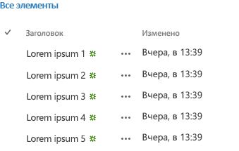

# Обзор экспериментальных мини-приложений Office для веб-страниц
Сведения об экспериментальных мини-приложениях Office для веб-страниц, которые можно использовать в надстройках Office и SharePoint, а также на веб-сайтах.
 

 **Примечание.** В настоящее время идет процесс замены названия "приложения для SharePoint" названием "надстройки SharePoint". Во время этого процесса в документации и пользовательском интерфейсе некоторых продуктов SharePoint и средств Visual Studio может по-прежнему использоваться термин "приложения для SharePoint". Дополнительные сведения см. в статье [Новое название приложений для Office и SharePoint](new-name-for-apps-for-sharepoint.md#bk_newname).
 

 **Внимание!** Экспериментальные мини-приложения Office для веб-страниц предоставляются только в целях исследований и обратной связи. Не следует использовать их в производственных сценариях. Режим работы мини-приложений Office для веб-страниц может существенно измениться в будущих выпусках. Ознакомьтесь с [условиями лицензии на экспериментальные мини-приложения Office для веб-страниц](office-web-widgetsexperimental-license-terms.md).
 

Клиентские элементы управления, такие как экспериментальная версия веб-виджетов Office, могут значительно ускорить разработку надстроек, а также повысить их качество. Для этого мы должны быть уверены, что виджеты отвечают определенным критериям:
 

- предназначены для использования на любой веб-странице, даже если она не указана в SharePoint;
    
 
- работают в среде выполнения элементов управления Office. Это позволяет нам предоставлять общий набор требований и согласованный синтаксис для использования виджетов;
    
 
- виджеты, которые обращаются к SharePoint, используют междоменную библиотеку. Виджеты не зависят от определенной платформы или технологии на стороне сервера. Вы можете использовать виджеты независимо от того, какая у вас серверная технология;
    
 
- должны сосуществовать с другими элементами на странице. Добавление виджета на страницу не должно изменять другие ее элементы;
    
 
- должны хорошо работать со всеми существующими платформами. Мы хотим, чтобы вы по-прежнему могли использовать привычные инструменты и технологии.
    
 

**Рис. 1. Надстройка, использующая экспериментальные мини-приложения Office для веб-страниц**

 

 

 
Мини-приложения можно использовать, установив пакет NuGet **Экспериментальные мини-приложения Office для веб-страниц** из Visual Studio. Дополнительные сведения см. в статье [Управление пакетами NuGet с помощью диалогового окна](http://docs.nuget.org/docs/start-here/managing-nuget-packages-using-the-dialog). Кроме того, просмотрите [страницу коллекции NuGet](http://www.nuget.org/packages/Microsoft.Office.WebWidgets.Experimental/).
 
Ваши отзывы и комментарии помогли нам решить, какие мини-приложения необходимы. Как показано на рисунке 1, вы уже можете испытать мини-приложения (1) "Выбор людей" и (2) "Представление списка на рабочем столе", а также поэкспериментировать с ними. Отправляйте свои отзывы на [сайт Office Developer Platform UserVoice](http://officespdev.uservoice.com/)
 
Кроме того, можно ознакомиться с примером кода [экспериментальной демоверсии мини-приложений Office для веб-страниц](http://code.msdn.microsoft.com/SharePoint-Office-Web-6d44aa9e).
 

## Мини-приложение "Выбор людей"

Используя в надстройках экспериментальный виджет "Выбор людей", вы можете помочь пользователям находить и выбирать людей и группы в клиенте. Когда пользователь вводит текст в текстовом поле, виджет загружает контакты, чьи имена или адреса электронной почты соответствуют запросу.
 

 

**Рис. 2. Обработка запроса мини-приложением "Выбор людей"**

 

 

 
Вы можете объявить мини-приложение в разметке HTML или программным путем, используя JavaScript. В любом случае необходимо использовать элемент **div** в качестве заполнителя для мини-приложения. Вы можете также установить для мини-приложения "Выбор людей" свойства и обработчики событий. В таблице ниже показаны свойства и события доступные в мини-приложении "Выбор людей".
 

 

|**Свойство/Событие**|**Тип**|**Описание**|
|:-----|:-----|:-----|
|**objectType**|Объект JSON (список строк)| Тип элементов, сопоставляемых мини-приложением. Параметры: только "Группа пользователя по умолчанию" и "Пользователь".|
|**allowMultipleSelections**|Логический|Истина/Ложь. Если задано значение "Ложь", мини-приложение позволяет выбирать только один элемент за раз. По умолчанию выбрано значение "Ложь".|
|**rootGroupName**|Строка|Если значение указано, мини-приложение будет выбирать элементы только из этой группы. В противном случае будут отправляться запросы объектам в рамках всего клиента.|
|**selectedItems**|Массив JSON|Список выбранных элементов. Каждый элемент возвращает объект, представляющий пользователя или группу.|
|**onAdded**|Функция|Событие, которое запускается при добавлении объекта к выделенному фрагменту. Функция обработчика получает добавленный объект.|
|**onRemoved**|Функция|Событие, которое запускается при удалении объекта из выделенного фрагмента. Функция обработчика получает удаленный объект.|
|**onChange**|Функция|Это событие вызывается как при добавлении, так и при удалении объектов. В функцию обработчика параметры не передаются.|
|**validationErrors**|Массив| Массив возможных ошибок проверки: пустое значение unresolvedItem, tooManyItems|
|**autoShowValidationMessage**|Логический|Значение "Истина" указывает, что сообщение о проверке отображается, а значение "Ложь" — не отображается|
|**hasErrors**|Логический|Значение "Истина" указывает, что имеется одна или несколько ошибок проверки. Значение "Ложь" — ошибки проверки отсутствуют|
|**errors**|Массив| Массив возможных ошибок проверки: пустое значение unresolvedItem, tooManyItems|
|**displayErrors**|Логический|Значение "Истина" указывает, что ошибки отображаются, значение "Ложь" — ошибки не отображаются|
Классы CSS для мини-приложения "Выбор людей" определены в таблице стилей **Office.Controls.css**. Вы можете переопределить классы и настроить стиль мини-приложения для своей надстройки.
 

 
Дополнительные сведения см. в статье  [Использование экспериментального мини-приложения "Выбор людей" в надстройках для SharePoint](use-the-experimental-people-picker-widget-in-sharepoint-add-ins.md) и примере кода [Использование экспериментального виджета "Выбор людей" в надстройке](http://code.msdn.microsoft.com/SharePoint-Use-the-57859f85.md).
 

 

## Мини-приложение "Представление списка на рабочем столе"

Пользователи получают все преимущества виджета "Представление списка" и могут представлять данные в списке, как в обычном виджете "Представление списка". Но вы можете использовать его в даже в тех надстройках, которые не размещены в SharePoint.
 

 

**Рис. 3. Мини-приложение "Представление списка на рабочем столе", отображающее данные в виде списка**

 

 

 
Вы можете указать существующее представление в списке, мини-приложение обрабатывает поля в том порядке, в котором они отображаются в представлении.
 

 

    
 **Примечание.** На данный момент мини-приложение "Представление списка на рабочем столе" отображает только данные. Оно не предлагает возможности редактирования.
 

Вы можете вставить для мини-приложения заполнитель, используя элемент **div**. Мини-приложение можно использовать программно или декларативно.
 

 
Вы также можете указать свойства или обработчики событий для виджета "Представление списка на рабочем столе". В следующей таблице показаны доступные свойства и события в виджете "Представление списка на рабочем столе".
 

 

|**Свойство/Событие**|**Тип**|**Описание**|
|:-----|:-----|:-----|
|**listUrl**|URL-адрес|URL-адрес списка, из которого необходимо получать элементы. Это может быть относительный URL-адрес (в таком случае он будет считаться расположенным на самом сайте надстройки) или абсолютный URL-адрес.|
|**viewName**|Строка|Имя представления, которое необходимо отобразить. Это программное, а не отображаемое, имя представления.|
|**onItemSelected**|Функция|Событие, возникающее при выборе элемента из списка.|
|**onItemAdded**|Функция|Событие, возникающее при добавлении элемента в список.|
|**onItemRemoved**|Функция|Событие, возникающее при удалении элемента из списка.|
|**selectedItems**|Массив|Список выбранных элементов в формате JSON.|
Для виджета требуется таблица стилей веб-сайта SharePoint. Вы можете непосредственно указать ссылку на таблицу стилей SharePoint или использовать виджет хрома. Подробнее о таблице стилей см. в статьях  [Использование таблицы стилей веб-сайта SharePoint в надстройках для SharePoint](use-a-sharepoint-website-s-style-sheet-in-sharepoint-add-ins.md) и [Использование клиентского элемента управления хрома в надстройках для SharePoint](use-the-client-chrome-control-in-sharepoint-add-ins.md). 
 

 
Чтобы увидеть виджет "Представление списка" в действии, см. пример кода  [Использование экспериментального виджета "Представление списка на рабочем столе" в надстройке](http://code.msdn.microsoft.com/SharePoint-Use-the-c3edb076). См. также  [Использование экспериментального мини-приложения "Просмотр списка на рабочем столе" в надстройках для SharePoint](use-the-experimental-desktop-list-view-widget-in-sharepoint-add-ins.md).
 

 

## Заключение

Виджеты могут помочь ускорить процесс разработки, а также сократить затраты на ваши надстройки и время их выхода на рынок. Вы можете использовать экспериментальные веб-виджеты Office в некоммерческих надстройках. Отправляйте свои отзывы и комментарии на  [сайт Office Developer Platform UserVoice](http://officespdev.uservoice.com/).
 

 

## Дополнительные ресурсы

-  [Условия лицензии на экспериментальные мини-приложения Office для веб-страниц](office-web-widgetsexperimental-license-terms.md)
    
 
-  [Страница коллекции NuGet "Экспериментальные мини-приложения Office для веб-страниц"](http://www.nuget.org/packages/Microsoft.Office.WebWidgets.Experimental/)
    
 
-  [Использование экспериментального мини-приложения "Выбор людей" в надстройках SharePoint](use-the-experimental-people-picker-widget-in-sharepoint-add-ins.md)
    
 
-  [Пример кода. Мини-приложения Office для веб-страниц — экспериментальная демоверсия](http://code.msdn.microsoft.com/SharePoint-Office-Web-6d44aa9e)
    
 
-  [Использование экспериментального мини-приложения "Представление списка на рабочем столе" в надстройках для SharePoint](use-the-experimental-desktop-list-view-widget-in-sharepoint-add-ins.md).
    
 
-  [Пример кода. Использование экспериментального мини-приложения "Выбор людей" в надстройке](http://code.msdn.microsoft.com/SharePoint-Use-the-57859f85).
    
 
-  [Пример кода. Использование экспериментального мини-приложения "Представление списка на рабочем столе"в надстройке](http://code.msdn.microsoft.com/SharePoint-Use-the-c3edb076)
    
 
