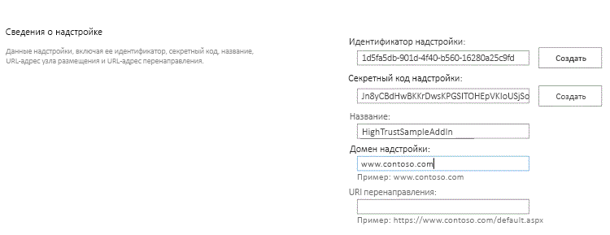

# <a name="package-and-publish-high-trust-sharepoint-add-ins"></a><span data-ttu-id="aa622-102">Упаковка и публикация надстроек SharePoint с высоким уровнем доверия</span><span class="sxs-lookup"><span data-stu-id="aa622-102">Package and publish high-trust SharePoint Add-ins</span></span>
<span data-ttu-id="aa622-103">Узнайте, как упаковать и опубликовать надстройку SharePoint с высоким уровнем доверия для локального использования.</span><span class="sxs-lookup"><span data-stu-id="aa622-103">Learn how to package and publish a high-trust SharePoint Add-in for on-premises use.</span></span>
 

 <span data-ttu-id="aa622-p101">**Примечание.** В настоящее время идет процесс замены названия "приложения для SharePoint" названием "надстройки SharePoint". Во время этого процесса в документации и пользовательском интерфейсе некоторых продуктов SharePoint и средств Visual Studio может по-прежнему использоваться термин "приложения для SharePoint". Дополнительные сведения см. в статье [Новое название приложений для Office и SharePoint](new-name-for-apps-for-sharepoint.md#bk_newname).</span><span class="sxs-lookup"><span data-stu-id="aa622-p101">**Note**  The name "apps for SharePoint" is changing to "SharePoint Add-ins". During the transition, the documentation and the UI of some SharePoint products and Visual Studio tools might still use the term "apps for SharePoint". For details, see  [New name for apps for Office and SharePoint](new-name-for-apps-for-sharepoint.md#bk_newname).</span></span>
 


## <a name="prerequisites-for-packaging-and-publishing-high-trust-add-ins"></a><span data-ttu-id="aa622-107">Предварительные требования для упаковки и публикации надстроек с высоким уровнем доверия</span><span class="sxs-lookup"><span data-stu-id="aa622-107">Prerequisites for packaging and publishing high-trust add-ins</span></span>
<span data-ttu-id="aa622-108"><a name="Prereqs"> </a></span><span class="sxs-lookup"><span data-stu-id="aa622-108"><a name="Prereqs"> </a></span></span>

<span data-ttu-id="aa622-109">Вам понадобится следующее:</span><span class="sxs-lookup"><span data-stu-id="aa622-109">You need the following:</span></span>
 

 

- <span data-ttu-id="aa622-p102">Локальная среда разработки для SharePoint. Инструкции по ее настройке см. в статье [Настройка локальной среды разработки надстроек SharePoint](set-up-an-on-premises-development-environment-for-sharepoint-add-ins.md).</span><span class="sxs-lookup"><span data-stu-id="aa622-p102">An on-premises SharePoint development environment. See  [Set up an on-premises development environment for SharePoint Add-ins](set-up-an-on-premises-development-environment-for-sharepoint-add-ins.md) for the setup instructions.</span></span>
    
 
- <span data-ttu-id="aa622-p103">Веб-сервер IIS для размещения удаленного веб-приложения. На нем должен быть установлен диспетчер IIS.</span><span class="sxs-lookup"><span data-stu-id="aa622-p103">An IIS web server to host the remote web application. IIS Manager should be installed.</span></span>
    
 
- <span data-ttu-id="aa622-114">Среда Visual Studio установлена удаленно или на компьютере с SharePoint.</span><span class="sxs-lookup"><span data-stu-id="aa622-114">Visual Studio installed either remotely or on the computer where you have installed SharePoint.</span></span>
    
 
- <span data-ttu-id="aa622-115">Инструменты разработчика Microsoft Office для Visual Studio</span><span class="sxs-lookup"><span data-stu-id="aa622-115">Microsoft Office Developer Tools for Visual Studio</span></span>
    
 
-  <span data-ttu-id="aa622-116">[Средство веб-развертывания](http://www.iis.net/downloads/microsoft/web-deploy), установленное на компьютере с Visual Studio, и такая же версия **средства веб-развертывания**, установленная на сервере удаленного веб-приложения.</span><span class="sxs-lookup"><span data-stu-id="aa622-116">[Web Deploy](http://www.iis.net/downloads/microsoft/web-deploy) installed on the Visual Studio computer, and the same version of **Web Deploy** installed on the remote web application server.</span></span>
    
 
<span data-ttu-id="aa622-117">В таблице 1 перечислены некоторые полезные статьи, которые помогут вам разобраться в понятиях, используемых при создании надстроек SharePoint.</span><span class="sxs-lookup"><span data-stu-id="aa622-117">Table 1 lists some useful articles that can help you to understand the concepts involved in creating SharePoint Add-ins.</span></span>
 

 

<span data-ttu-id="aa622-118">**Таблица 1. Основные понятия, связанные с публикацией надстроек с высоким уровнем доверия**</span><span class="sxs-lookup"><span data-stu-id="aa622-118">**Table 1. Core concepts for publishing high-trust add-ins**</span></span>


|<span data-ttu-id="aa622-119">**Название статьи**</span><span class="sxs-lookup"><span data-stu-id="aa622-119">**Article Title**</span></span>|<span data-ttu-id="aa622-120">**Описание**</span><span class="sxs-lookup"><span data-stu-id="aa622-120">**Description**</span></span>|
|:-----|:-----|
| [<span data-ttu-id="aa622-121">Знакомство с созданием надстроек SharePoint с размещением у поставщика</span><span class="sxs-lookup"><span data-stu-id="aa622-121">Get started creating provider-hosted SharePoint Add-ins</span></span>](get-started-creating-provider-hosted-sharepoint-add-ins.md)|<span data-ttu-id="aa622-122">Узнайте, как создать базовую надстройку SharePoint, размещаемую у поставщика, с помощью Инструментов разработчика Office для Visual Studio.</span><span class="sxs-lookup"><span data-stu-id="aa622-122">Learn how to create a basic provider-hosted SharePoint Add-in with the Office Developer Tools for Visual Studio.</span></span>|
| [<span data-ttu-id="aa622-123">Создание надстроек SharePoint с высоким уровнем доверия</span><span class="sxs-lookup"><span data-stu-id="aa622-123">Create high-trust SharePoint Add-ins</span></span>](create-high-trust-sharepoint-add-ins.md)|<span data-ttu-id="aa622-124">Узнайте, как создать простое Надстройка SharePoint с высоким уровнем доверия в Инструменты разработчика Office для Visual Studio с помощью самозаверяющего сертификата и соответствующего идентификатора издателя.</span><span class="sxs-lookup"><span data-stu-id="aa622-124">Learn how to create a basic high-trust SharePoint Add-in with the Office Developer Tools for Visual Studio by using a self-signed certificate and an associated issuer ID.</span></span>|
| [<span data-ttu-id="aa622-125">Веб-развертывание</span><span class="sxs-lookup"><span data-stu-id="aa622-125">Web Deploy</span></span>](http://www.iis.net/downloads/microsoft/web-deploy)|<span data-ttu-id="aa622-126">Веб-развертывание упрощает развертывание веб-приложений и веб-сайтов на серверах IIS.</span><span class="sxs-lookup"><span data-stu-id="aa622-126">Web Deploy simplifies deployment of web applications and websites to IIS servers.</span></span>|
| <span data-ttu-id="aa622-127">[Цифровые сертификаты](http://msdn.microsoft.com/library/e523b335-0156-4f47-b55c-b80495587c4f.aspx) и [Работа с сертификатами](http://msdn.microsoft.com/library/6ffb8682-8f07-4a45-afbb-8d2487e9dbc3.aspx)</span><span class="sxs-lookup"><span data-stu-id="aa622-127">[Digital Certificates](http://msdn.microsoft.com/library/e523b335-0156-4f47-b55c-b80495587c4f.aspx) and [Working with Certificates](http://msdn.microsoft.com/library/6ffb8682-8f07-4a45-afbb-8d2487e9dbc3.aspx)</span></span>|<span data-ttu-id="aa622-128">Изучите основы работы с цифровыми сертификатами.</span><span class="sxs-lookup"><span data-stu-id="aa622-128">Learn the basic ideas behind digital certificates.</span></span>|

 <span data-ttu-id="aa622-p104">**Примечание.** Надстройки SharePoint с высоким уровнем доверия можно устанавливать только в локальной среде SharePoint (но не в Microsoft SharePoint Online). В первую очередь они предназначены для использования с локальными, а не облачными веб-приложениями. В этих статьях описывается публикация надстройки для такого случая. Кроме того, в этой статье понятие "пользователь" относится к организации, в которой устанавливается надстройка SharePoint и размещаются удаленные компоненты надстройки.</span><span class="sxs-lookup"><span data-stu-id="aa622-p104">**Note**  High-trust SharePoint Add-ins can only be installed to on premises SharePoint, not to Microsoft SharePoint Online, and they are primarily intended for use with an on premises, rather than cloud-based, web application. This article explains how to publish the add-in in that scenario. Also, in this article 'customer' refers to the business that installs the SharePoint Add-in and hosts the remote components of the add-in.</span></span>
 


## <a name="register-the-high-trust-add-in"></a><span data-ttu-id="aa622-132">Регистрация надстройки с высоким уровнем доверия</span><span class="sxs-lookup"><span data-stu-id="aa622-132">Register the high-trust add-in</span></span>
<span data-ttu-id="aa622-133"><a name="Register"> </a></span><span class="sxs-lookup"><span data-stu-id="aa622-133"><a name="Register"> </a></span></span>

<span data-ttu-id="aa622-p105">Перед публикацией надстройки ее необходимо зарегистрировать на ферме SharePoint с помощью службы управления надстройками. Надстройки SharePoint с высоким уровнем доверия всегда регистрируются на ферме SharePoint, на которой установлена надстройка. (Они не могут продаваться через Магазин Office.) Регистрация осуществляется на странице http:// _веб-сайт_SharePoint_/_layouts/15/appregnew.aspx, как это описано в следующей процедуре.</span><span class="sxs-lookup"><span data-stu-id="aa622-p105">Before you can publish the add-in, it has to be registered with the SharePoint farm's add-in management service. High-trust SharePoint Add-ins are always registered on the SharePoint farm on which the add-in is to be installed. (They cannot be sold through the Office Store.) Registration is done on the page http:// _SharePoint_website_/_layouts/15/appregnew.aspx as described in the following procedure.</span></span>
 

 

### <a name="to-register-the-add-in"></a><span data-ttu-id="aa622-137">Регистрация надстройки:</span><span class="sxs-lookup"><span data-stu-id="aa622-137">To register the add-in</span></span>


1. <span data-ttu-id="aa622-p106">Перейдите на страницу http:// _веб-сайт_SharePoint_/_layouts/15/appregnew.aspx. Нажмите кнопки **Создать**, чтобы сгенерировать значения идентификатора и секрета надстройки. В настоящее время секрет не используется в надстройках SharePoint с высоким уровнем доверия, но он требуется для формы. Укажите базовый URL-адрес домена, где будет запущено удаленное веб-приложение надстройки. Не включайте в домен протокол (HTTPS), но укажите порт, который будут использовать удаленные компоненты для HTTPS-запросов, если он отличается от 443 (например, www.contoso.com:5555 или MyAppServer:4444).</span><span class="sxs-lookup"><span data-stu-id="aa622-p106">Navigate to the http:// _SharePoint_website_/_layouts/15/appregnew.aspx page. Choose the  **Generate** buttons to generate values for the add-in ID and secret. (The secret is not actually used in high-trust SharePoint Add-ins, but the form requires one.) Provide the base URL of the domain where the remote web application of the add-in will run. Do not include the protocol (HTTPS) in the domain, but you have to include the port that the remote components will use for HTTPS requests if it is not 443 (for example,www.contoso.com:5555 orMyAppServer:4444).</span></span>
    
    <span data-ttu-id="aa622-p107">Если вам необходим URI перенаправления, также укажите его значение. Ознакомьтесь со статьей  [Поток кода аутентификации OAuth для надстроек в SharePoint](authorization-code-oauth-flow-for-sharepoint-add-ins.md), чтобы понять, как можно использовать URI перенаправления.</span><span class="sxs-lookup"><span data-stu-id="aa622-p107">If you need a redirect URI, enter a value for that also. See  [Authorization Code OAuth flow for SharePoint Add-ins](authorization-code-oauth-flow-for-sharepoint-add-ins.md) for an explanation of how the redirect URI can be used.</span></span>
    
    <span data-ttu-id="aa622-p108">Форма на странице должна выглядеть аналогично рис. 1. В этом примере сервер удаленного веб-приложения прослушивает HTTPS-запросы на порте 443, который является портом по умолчанию, поэтому указывать его в домене надстройки не обязательно.</span><span class="sxs-lookup"><span data-stu-id="aa622-p108">The form on the page should look similar to Figure 1. In this example, the remote web application server is listening for HTTPS requests on the default port 443, so it's not necessary to specify the port in the add-in domain.</span></span>
    

    <span data-ttu-id="aa622-146">**Рис. 1. Регистрация надстройки на странице appregnew.aspx**</span><span class="sxs-lookup"><span data-stu-id="aa622-146">**Figure 1. Register add-in on appregnew.aspx**</span></span>

 

  
 

 

 
2. <span data-ttu-id="aa622-p109">Нажмите кнопку **Создать**. Указанные сведения будут показаны на следующей странице. Сохраните их, так как они потребуются для средств публикации Visual Studio. Для этого можно сделать снимок экрана со страницей.</span><span class="sxs-lookup"><span data-stu-id="aa622-p109">Choose  **Create**. The information that you entered for the add-in will be displayed on the next page. Be sure to keep this information available because you will need it when you use the Visual Studio publishing tools. Consider taking a quick screenshot of the page.</span></span>
    
 

## <a name="choose-a-strategy-for-obtaining-maintaining-and-deploying-certificates-for-high-trust-sharepoint-add-ins"></a><span data-ttu-id="aa622-152">Выбор стратегии получения, обслуживания и развертывания сертификатов для надстроек SharePoint с высоким уровнем доверия</span><span class="sxs-lookup"><span data-stu-id="aa622-152">Choose a strategy for obtaining, maintaining and deploying certificates for high-trust SharePoint Add-ins</span></span>
<span data-ttu-id="aa622-153"><a name="Certificate"> </a></span><span class="sxs-lookup"><span data-stu-id="aa622-153"><a name="Certificate"> </a></span></span>

<span data-ttu-id="aa622-p110">Когда разработчик использует клавишу **F5** в Visual Studio для разработки и отладки надстройки SharePoint с высоким уровнем доверия, он может применять самозаверяющий сертификат, как описано в статье [Создание надстроек SharePoint с высоким уровнем доверия](create-high-trust-sharepoint-add-ins.md). Однако если надстройка *опубликована*, то перед открытием начальной страницы удаленного веб-приложения в браузере появится страница с предупреждением. Пользователю придется решать, стоит ли продолжать. Пример такого предупреждения показан на рис. 2.</span><span class="sxs-lookup"><span data-stu-id="aa622-p110">When a developer is using  **F5** in Visual Studio to develop and debug a high-trust SharePoint Add-in, the developer can use a self-signed certificate, as described in [Create high-trust SharePoint Add-ins](create-high-trust-sharepoint-add-ins.md). However, when the add-in is  *published*  , using a self-signed certificate causes the browser to display a warning page before it will open the remote web application's start page. The user has to choose whether to proceed. Figure 2 shows examples of such warnings.</span></span>
 

 

<span data-ttu-id="aa622-157">**Рис. 2. Предупреждения о самозаверяющих сертификатах**</span><span class="sxs-lookup"><span data-stu-id="aa622-157">**Figure 2. Warnings for self-signed certificates**</span></span>

 

 

 
<span data-ttu-id="aa622-p111">Такая помеха может быть приемлема для разработчика, но не для клиентов. Поэтому перед окончательной публикацией в рабочую среду, клиент должен получить сертификат, подписанный доверенной третьей стороной. Это может быть коммерческий или локальный центр сертификации (ЦС). Что касается коммерческих ЦС, помните, что отрасль постепенно сокращает сертификаты для веб-серверов, предназначенные "только для интрасетей". Их по-прежнему можно купить, но срок действия всех подобных сертификатов истекает в ноябре 2016 года или ранее. Использовать такой тип сертификата для Надстройка SharePoint с высоким уровнем доверия необязательно, так как сертификаты для веб-серверов с выходом в Интернет могут использоваться и для веб-серверов интрасети, однако последние обычно стоят дороже.</span><span class="sxs-lookup"><span data-stu-id="aa622-p111">This annoyance might be acceptable for a developer, but it would be unacceptable for customers. So before final publication to a production environment, the customer has to get a certificate that is signed by a trusted third party. The third party can be a commercial Certificate Authority (CA) or an on-premises CA. In regard to commercial CAs, note that the industry is phasing out "intranet-only" certificates for web servers. They can still be purchased, but all such certificates will expire in November, 2016, or sooner. It is not necessary to have this kind of certificate for a high-trust SharePoint Add-in, because certificates that can be used for internet-facing web servers can also be used for intranet web servers, but the latter generally cost more.</span></span> 
 

 
<span data-ttu-id="aa622-p112">Сертификат должен находиться в двух форматах — в виде файла обмена личной информацией (PFX) и в виде сертификата безопасности (CER). Если изначально при получении один из этих форматов отсутствует, клиент может конвертировать его с помощью служебной программы. Кроме того, после получения версии в формате PFX, PFX-файл можно импортировать в IIS, а затем экспортировать версию CER согласно описанной ниже инструкции.</span><span class="sxs-lookup"><span data-stu-id="aa622-p112">The certificate should be in two formats, Personal Information Exchange (pfx) and Security Certificate (cer). If it is not in either of these formats when originally obtained, the customer can convert it using a utility. Also, once a pfx format version has been obtained, the pfx file can be imported into IIS and then the cer version exported as described below.</span></span>
 

 
<span data-ttu-id="aa622-p113">Если изначально при получении сертификат находится в формате CER, в нем будут находиться и закрытый, и открытый ключи. Согласно общепринятой практике, CER-файл, используемый SharePoint, не должен содержать закрытый ключ. Попробуйте согласно приведенной ниже инструкции импортировать оригинальный сертификат в IIS, а затем экспортировать новую CER-версию, которая не содержит закрытый ключ. Дополнительную информацию о CER- и PFX-файлах можно узнать в статье  [Сертификат издателя программного обеспечения](http://msdn.microsoft.com/ru-ru/library/windows/hardware/ff552299%28v=vs.85%29.aspx).</span><span class="sxs-lookup"><span data-stu-id="aa622-p113">If the certificate is originally obtained is a cer format, it will contain both the private and public keys. As a general practice, the .cer file that is used by SharePoint should not contain the private key. Consider importing the original certificate to IIS and then exporting a new cer version that does not include the private key as described below. For more information about .pfx and .cer files, see  [Software Publisher Certificate](http://msdn.microsoft.com/ru-ru/library/windows/hardware/ff552299%28v=vs.85%29.aspx).</span></span>
 

 
<span data-ttu-id="aa622-p114">Кроме того, клиент должен решить, использовать один сертификат для всех Надстройки SharePoint с высоким уровнем доверия или отдельные сертификаты для каждого из них. Дополнительные сведения об этом решении см. в статье  [Выбор между одним или несколькими сертификатами для Надстройки SharePoint с высоким уровнем доверия](creating-sharepoint-add-ins-that-use-high-trust-authorization.md#Deciding).</span><span class="sxs-lookup"><span data-stu-id="aa622-p114">In addition, the customer has to consider whether to use a single certificate for all high-trust SharePoint Add-ins or separate certificates for each. For more information about this decision, see  [Deciding between using one certificate or many for high-trust SharePoint Add-ins](creating-sharepoint-add-ins-that-use-high-trust-authorization.md#Deciding).</span></span>
 

 

## <a name="configure-the-remote-web-server-with-the-certificate"></a><span data-ttu-id="aa622-174">Настройка удаленного веб-сервера с помощью сертификата</span><span class="sxs-lookup"><span data-stu-id="aa622-174">Configure the remote web server with the certificate</span></span>
<span data-ttu-id="aa622-175"><a name="ConfigureRemote"> </a></span><span class="sxs-lookup"><span data-stu-id="aa622-175"><a name="ConfigureRemote"> </a></span></span>

<span data-ttu-id="aa622-176">Описанные ниже процедуры выполняются на удаленном веб-сервере, на котором размещено удаленное веб-приложение.</span><span class="sxs-lookup"><span data-stu-id="aa622-176">The following procedures are performed on the remote web server hosting the remote web application.</span></span>
 

 

### <a name="to-configure-the-remote-web-server-and-pfx-certificate"></a><span data-ttu-id="aa622-177">Настройка удаленного веб-сервера и сертификата PFX</span><span class="sxs-lookup"><span data-stu-id="aa622-177">To configure the remote web server and pfx certificate</span></span>


1. <span data-ttu-id="aa622-p115">Задайте для сертификата PFX надежный пароль. Дополнительные сведения см. в статьях [Рекомендации по созданию надежных паролей](http://msdn.microsoft.com/ru-ru/library/bb416446.aspx) и [Надежные пароли](http://msdn.microsoft.com/ru-ru/library/ms161962.aspx).</span><span class="sxs-lookup"><span data-stu-id="aa622-p115">Give the .pfx certificate a strong password. For more information, see  [Guidelines for creating strong passwords](http://msdn.microsoft.com/ru-ru/library/bb416446.aspx) and [Strong passwords](http://msdn.microsoft.com/ru-ru/library/ms161962.aspx).</span></span>
    
 
2. <span data-ttu-id="aa622-180">Импортируйте сертификат в IIS на удаленный веб-сервер, выполнив указанные ниже действия.</span><span class="sxs-lookup"><span data-stu-id="aa622-180">Import the certificate into IIS on the remote web server with these steps:</span></span>
    
      1. <span data-ttu-id="aa622-181">В диспетчере IIS выберите узел _Имя сервера_ в представлении в виде дерева слева.</span><span class="sxs-lookup"><span data-stu-id="aa622-181">In IIS Manager, select the  _ServerName_ node in the tree view on the left.</span></span>
    
 
  2. <span data-ttu-id="aa622-182">Дважды щелкните значок **Сертификаты сервера**.</span><span class="sxs-lookup"><span data-stu-id="aa622-182">Double-click the  **Server Certificates** icon.</span></span>
    
 
  3. <span data-ttu-id="aa622-183">Выберите **Импорт** в области **Действия** справа.</span><span class="sxs-lookup"><span data-stu-id="aa622-183">Select  **Import** in the **Actions** pane on the right.</span></span>
    
 
  4. <span data-ttu-id="aa622-184">В диалоговом окне **Импорт сертификата** нажмите кнопку "Обзор", найдите PFX-файл, а затем введите пароль сертификата.</span><span class="sxs-lookup"><span data-stu-id="aa622-184">On the  **Import Certificate** dialog, use the browse button to browse to the .pfx file, and then enter the password of the certificate.</span></span>
    
 
  5. <span data-ttu-id="aa622-p116">Если вы используете диспетчер служб IIS 8-й версии, в раскрывающемся списке **Выбор хранилища сертификата** выберите пункт **Личное**. (Речь идет о "личном" хранилище сертификатов компьютера, а не пользователя.)</span><span class="sxs-lookup"><span data-stu-id="aa622-p116">If you are using IIS Manager 8, there is a  **Select Certificate Store** drop down. Choose **Personal**. (This refers to the "personal" certificate storage of the computer, not the user.)</span></span>
    
 
  6. <span data-ttu-id="aa622-188">Если у вас еще нет сертификата CER или он содержит закрытый ключ, установите флажок **Разрешить экспортировать этот сертификат**.</span><span class="sxs-lookup"><span data-stu-id="aa622-188">If you don't already have a cer version, or you do but it includes the private key, enable  **Allow this certificate to be exported**.</span></span>
    
 
  7. <span data-ttu-id="aa622-189">Нажмите кнопку **ОК**.</span><span class="sxs-lookup"><span data-stu-id="aa622-189">Click  **OK**.</span></span>
    
 

### <a name="to-open-the-windows-certificate-store"></a><span data-ttu-id="aa622-190">Открытие хранилища сертификатов Windows</span><span class="sxs-lookup"><span data-stu-id="aa622-190">To open the Windows Certificate Store</span></span>


1. <span data-ttu-id="aa622-191">На этом же сервере откройте **консоль управления (MMC)**, как описано в статье [Запуск MMC 3.0](http://technet.microsoft.com/ru-ru/library/cc766121.aspx).</span><span class="sxs-lookup"><span data-stu-id="aa622-191">On the same server, open the  **Microsoft Management Console** and as described in [Open MMC 3.0](http://technet.microsoft.com/ru-ru/library/cc766121.aspx).</span></span>
    
 
2. <span data-ttu-id="aa622-p117">Добавьте для учетной записи компьютера оснастку **Сертификаты**, как описано в статье [Добавление оснастки "Сертификаты" в консоль MMC](http://technet.microsoft.com/ru-ru/library/cc754431.aspx). Убедитесь, что вы следуете процедуре, предназначенной для *компьютера*, а не для пользователя или службы. При появлении соответствующего запроса выберите *локальный*, а не "другой" компьютер.</span><span class="sxs-lookup"><span data-stu-id="aa622-p117">Add the  **Certificates** snap-in for the computer account as described in [Add the Certificates Snap-in to an MMC](http://technet.microsoft.com/ru-ru/library/cc754431.aspx). Be sure to use the procedure for the  *computer*  , not a user or service. Choose the *local*  computer, not "another" computer, when prompted.</span></span>
    
 
<span data-ttu-id="aa622-195">Если вы используете диспетчер служб ISS 8-й версии, следующую процедуру можно пропустить.</span><span class="sxs-lookup"><span data-stu-id="aa622-195">Skip the next procedure if you are using ISS Manager 8.</span></span>
 

 

### <a name="additional-steps-for-iss-manager-7-to-get-the-certificate-into-the-windows-certificate-store"></a><span data-ttu-id="aa622-196">Дополнительные действия для получения сертификата в хранилище сертификатов Windows с помощью диспетчера ISS 7</span><span class="sxs-lookup"><span data-stu-id="aa622-196">Additional steps for ISS Manager 7 to get the certificate into the Windows Certificate Store</span></span>


1. <span data-ttu-id="aa622-197">Создайте в файловой системе сервера папку, которая будет использоваться для кратковременного хранения сертификата.</span><span class="sxs-lookup"><span data-stu-id="aa622-197">Create a folder on the server file system to be used as a very temporary storage place for the certificate.</span></span>
    
 
2. <span data-ttu-id="aa622-198">В диспетчере IIS выберите узел _Имя сервера_ в представлении в виде дерева слева.</span><span class="sxs-lookup"><span data-stu-id="aa622-198">In IIS Manager, select the  _ServerName_ node in the tree view on the left.</span></span>
    
 
3. <span data-ttu-id="aa622-199">Дважды щелкните значок **Сертификаты сервера**.</span><span class="sxs-lookup"><span data-stu-id="aa622-199">Double-click the  **Server Certificates** icon.</span></span>
    
 
4. <span data-ttu-id="aa622-200">В списке **Сертификаты сервера** щелкните сертификат правой кнопкой мыши и выберите пункт **Экспорт**, как показано на рис. 3.</span><span class="sxs-lookup"><span data-stu-id="aa622-200">In the  **Server Certificates** list, right-click the certificate, and then select **Export**, as shown in Figure 3.</span></span>
    
    <span data-ttu-id="aa622-201">**Рис. 3. Экспорт сертификата**</span><span class="sxs-lookup"><span data-stu-id="aa622-201">**Figure 3. Exporting a certificate**</span></span>

 

  
 

 

 
5. <span data-ttu-id="aa622-203">Экспортируйте файл в созданную вами папку и введите ее пароль.</span><span class="sxs-lookup"><span data-stu-id="aa622-203">Export the file to the folder that you created and enter its password.</span></span>
    
 
6. <span data-ttu-id="aa622-p118">В **консоли управления (MMC)** импортируйте сертификат, как описано в статье [Импорт сертификата](http://technet.microsoft.com/ru-ru/library/cc754489.aspx). Не забудьте выбрать **личное** хранилище.</span><span class="sxs-lookup"><span data-stu-id="aa622-p118">In the  **Microsoft Management Console** import the certificate as described in [Import a Certificate](http://technet.microsoft.com/ru-ru/library/cc754489.aspx). Be sure to specify the  **Personal** store.</span></span>
    
 
7. <span data-ttu-id="aa622-206">Приступая к следующей процедуре, не закрывайте консоль.</span><span class="sxs-lookup"><span data-stu-id="aa622-206">Leave the console open for the next procedure.</span></span>
    
 
8.  <span data-ttu-id="aa622-p119">*Удалите папку, которую вы создали на первом шаге, вместе с файлом, находящимся в ней.*  Если сертификат находится в файловой системе, преимущества безопасности его хранения в хранилище сертификатов аннулируются.</span><span class="sxs-lookup"><span data-stu-id="aa622-p119">*Delete the folder that you created in the first step and the certificate file in it.*  The security advantages of keeping the certificate in the certificate store are defeated if it is also on the file system.</span></span>
    
 
<span data-ttu-id="aa622-209">Следующая процедура применима к диспетчеру служб IIS 7-й и 8-й версий.</span><span class="sxs-lookup"><span data-stu-id="aa622-209">The next procedure applies to both IIS Manager 7 and 8.</span></span>
 

 

### <a name="to-get-the-serial-number-of-the-certificate"></a><span data-ttu-id="aa622-210">Получение серийного номера сертификата</span><span class="sxs-lookup"><span data-stu-id="aa622-210">To get the serial number of the certificate</span></span>


1. <span data-ttu-id="aa622-211">В **консоли управления (MMC)** перейдите к папке **Сертификаты** в папке **Личные** оснастки **Сертификаты (локальный компьютер)**, если она еще не открыта.</span><span class="sxs-lookup"><span data-stu-id="aa622-211">In the  **Microsoft Management Console**, navigate to the  **Certificates** folder under the **Personal** folder of the **Certificates (Local Computer)** snap-in, if it is not already open.</span></span>
    
 
2. <span data-ttu-id="aa622-212">Дважды щелкните сертификат для вашей надстройки SharePoint, чтобы открыть его, а затем откройте вкладку **Сведения**.</span><span class="sxs-lookup"><span data-stu-id="aa622-212">Double-click the certificate for your SharePoint Add-in to open it, and then open the  **Details** tab.</span></span>
    
 
3. <span data-ttu-id="aa622-213">Выберите поле **Серийный номер**, чтобы серийный номер отображался полностью.</span><span class="sxs-lookup"><span data-stu-id="aa622-213">Select the  **Serial Number** field to make the entire serial number is visible in the box.</span></span>
    
 
4. <span data-ttu-id="aa622-214">Скопируйте серийный номер *без пробелов* в текстовый файл и передайте его разработчику надстройки SharePoint.</span><span class="sxs-lookup"><span data-stu-id="aa622-214">Copy the serial number,  *without the spaces*  , to a text file and give it to the developer of the SharePoint Add-in.</span></span>
    
     <span data-ttu-id="aa622-p120">**Совет.** В записях блогов разработчиков и в вопросах на форумах встречаются упоминания о том, что при копировании серийного номера непосредственно в буфер обмена создается строка со скрытыми символами, из-за чего надстройка SharePoint не может распознать серийный номер. Попробуйте не копировать код, а ввести его вручную. Затем создайте CER-версию сертификата. Она содержит закрытый ключ удаленного веб-сервера и используется средой SharePoint, чтобы расшифровывать запросы от удаленного веб-приложения и проверять маркеры доступа в этих запросах. Эта версия создается на удаленном веб-сервере, а затем перемещается в ферму SharePoint.</span><span class="sxs-lookup"><span data-stu-id="aa622-p120">**Tip**  Some developer blog posts and forum questions report that copying the serial number directly into the clipboard creates a string with hidden characters that makes the serial number unrecognizable to code in the SharePoint Add-in. Consider manually typing the number instead of copying it. Next you create a cer version of the certificate. This contains the public key of the remote web server and is used by SharePoint to unencrypt requests from the remote web application and validate the access tokens in those requests. It is created on the remote web server and then moved to the SharePoint farm.</span></span>
 

 

### <a name="to-create-the-cer-certificate"></a><span data-ttu-id="aa622-220">Создание CER-файла сертификата</span><span class="sxs-lookup"><span data-stu-id="aa622-220">To create the cer certificate</span></span>


1. <span data-ttu-id="aa622-221">В диспетчере IIS выберите узел _Имя сервера_ в представлении в виде дерева слева.</span><span class="sxs-lookup"><span data-stu-id="aa622-221">In IIS manager, select the  _ServerName_ node in the tree view on the left.</span></span>
    
 
2. <span data-ttu-id="aa622-222">Дважды щелкните элемент **Сертификаты сервера**.</span><span class="sxs-lookup"><span data-stu-id="aa622-222">Double-click  **Server Certificates**.</span></span>
    
 
3. <span data-ttu-id="aa622-223">В представлении **Сертификаты сервера** дважды щелкните сертификат, чтобы просмотреть сведения о нем.</span><span class="sxs-lookup"><span data-stu-id="aa622-223">In  **Server Certificates** view, double-click the certificate to display the certificate details.</span></span>
    
 
4. <span data-ttu-id="aa622-224">На вкладке **Сведения** нажмите кнопку **Копировать в файл**, чтобы запустить **мастер экспорта сертификатов**, а затем нажмите кнопку **Далее**.</span><span class="sxs-lookup"><span data-stu-id="aa622-224">On the  **Details** tab, choose **Copy to File** to launch the **Certificate Export Wizard**, and then choose  **Next**.</span></span>
    
 
5. <span data-ttu-id="aa622-225">Оставьте значение по умолчанию (**Нет, не экспортировать закрытый ключ**) и нажмите кнопку **Далее**.</span><span class="sxs-lookup"><span data-stu-id="aa622-225">Use the default value  **No, do not export the private key**, and then choose  **Next**.</span></span>
    
 
6. <span data-ttu-id="aa622-p121">На следующей странице используйте значения по умолчанию. Нажмите кнопку **Далее**.</span><span class="sxs-lookup"><span data-stu-id="aa622-p121">Use the default values on the next page. Choose  **Next**.</span></span>
    
 
7. <span data-ttu-id="aa622-p122">Нажмите кнопку **Обзор** и выберите любую папку. (CER-файл будет удален с компьютера в любом случае.) Задайте для этого файла то же имя, что и для PFX-файла, и нажмите кнопку **Сохранить**. Сертификат сохранится в виде CER-файла.</span><span class="sxs-lookup"><span data-stu-id="aa622-p122">Choose  **Browse** and browse to any folder. (The cer file is going to be moved off of this computer anyway.) Give the file the same name as the pfx file, and then choose **Save**. The certificate is saved as a .cer file.</span></span>
    
 
8. <span data-ttu-id="aa622-231">Нажмите кнопку **Далее**.</span><span class="sxs-lookup"><span data-stu-id="aa622-231">Choose  **Next**.</span></span>
    
 
9. <span data-ttu-id="aa622-232">Нажмите кнопку **Готово**.</span><span class="sxs-lookup"><span data-stu-id="aa622-232">Choose  **Finish**.</span></span>
    
 

## <a name="configure-sharepoint-to-use-the-certificate"></a><span data-ttu-id="aa622-233">Настройка использования сертификата в SharePoint</span><span class="sxs-lookup"><span data-stu-id="aa622-233">Configure SharePoint to use the certificate</span></span>
<span data-ttu-id="aa622-234"><a name="ConfigureSP"> </a></span><span class="sxs-lookup"><span data-stu-id="aa622-234"><a name="ConfigureSP"> </a></span></span>

<span data-ttu-id="aa622-235">Процедуры, описанные в этом разделе, можно выполнить на любом сервере SharePoint, на котором установлена **командная консоль SharePoint**.</span><span class="sxs-lookup"><span data-stu-id="aa622-235">The procedures in this section can be performed on any SharePoint server on which the  **SharePoint Management Shell** is installed.</span></span>
 

 

### <a name="to-distribute-the-cer-file-to-sharepoint"></a><span data-ttu-id="aa622-236">Размещение CER-файла в SharePoint</span><span class="sxs-lookup"><span data-stu-id="aa622-236">To distribute the cer file to SharePoint</span></span>


1. <span data-ttu-id="aa622-237">Создайте папку и убедитесь, что удостоверения следующих пулов надстроек IIS содержат разрешение на ее чтение:</span><span class="sxs-lookup"><span data-stu-id="aa622-237">Create a folder and be sure that the add-in pool identities for the following IIS add-in pools have Read right to it:</span></span>
    
      -  <span data-ttu-id="aa622-238">**SecurityTokenServiceApplicationPool**.</span><span class="sxs-lookup"><span data-stu-id="aa622-238">**SecurityTokenServiceApplicationPool**</span></span>
    
 
  - <span data-ttu-id="aa622-p123">Пул надстроек, обслуживающий веб-сайт IIS, на котором размещается родительское веб-приложение SharePoint для тестового веб-сайта SharePoint. Пул для веб-сайта IIS **SharePoint - 80** называется **OServerPortalAppPool**.</span><span class="sxs-lookup"><span data-stu-id="aa622-p123">The add-in pool that serves the IIS web site that hosts the parent SharePoint web application for your test SharePoint website. For the  **SharePoint - 80** IIS website, the pool is called **OServerPortalAppPool**.</span></span>
    
 
2.  <span data-ttu-id="aa622-p124">*Переместите*  (не просто скопируйте) CER-файл из удаленного веб-сервера в папку, которую вы только что создали на сервере SharePoint. Файл будет временно находиться в этой папке.</span><span class="sxs-lookup"><span data-stu-id="aa622-p124">*Move*  (don't merely copy) the .cer file from the remote web server to the folder you just created on the SharePoint server. The file will be in this folder only temporarily.</span></span>
    
 
<span data-ttu-id="aa622-p125">В следующей процедуре описывается настройка сертификата в качестве доверенного поставщика маркеров в SharePoint. Она выполняется только один раз (для каждой надстройки SharePoint с высоким уровнем доверия).</span><span class="sxs-lookup"><span data-stu-id="aa622-p125">The following procedure configures the certificate as a trusted token issuer in SharePoint. It is performed just once (for each high-trust SharePoint Add-in).</span></span>
 

 

### <a name="to-configure-the-certificate"></a><span data-ttu-id="aa622-245">Настройка сертификата</span><span class="sxs-lookup"><span data-stu-id="aa622-245">To configure the certificate</span></span>


1. <span data-ttu-id="aa622-246">Если вы этого еще не сделали, создайте скрипт или скрипты настройки высокого уровня доверия для Windows PowerShell, как это описано в статье  [Скрипты настройки высокого уровня доверия для SharePoint](high-trust-configuration-scripts-for-sharepoint.md).</span><span class="sxs-lookup"><span data-stu-id="aa622-246">If you have not done so already, create the high-trust configuration Windows PowerShell script or scripts that you need, as described in  [High-trust configuration scripts for SharePoint](high-trust-configuration-scripts-for-sharepoint.md).</span></span>
    
 
2. <span data-ttu-id="aa622-247">Скопируйте скрипты на сервер SharePoint.</span><span class="sxs-lookup"><span data-stu-id="aa622-247">Copy the scripts to the SharePoint server.</span></span>
    
 
3. <span data-ttu-id="aa622-248">Откройте **командную консоль SharePoint** от имени администратора и запустите соответствующие скрипты.</span><span class="sxs-lookup"><span data-stu-id="aa622-248">Open the  **SharePoint Management Shell** as an administrator and run the appropriate scripts.</span></span>
    
 
4. <span data-ttu-id="aa622-p126">Один из скриптов предназначен для использования в случае, когда клиент использует один сертификат для нескольких Надстройки SharePoint. Этот скрипт выводит файл, содержащий GUID для поставщика маркеров. Если вы используете этот скрипт, передайте выходной файл разработчику Надстройка SharePoint с высоким уровнем доверия.</span><span class="sxs-lookup"><span data-stu-id="aa622-p126">One of the scripts is intended for use when the customer is sharing a single certificate among multiple SharePoint Add-ins. That script outputs a file that contains the GUID for the token issuer. If you use that script, give the file that it outputs to the developer of the high-trust SharePoint Add-in.</span></span>
    
 
5.  <span data-ttu-id="aa622-251">*Удалите CER-файл из файловой системы сервера SharePoint.*</span><span class="sxs-lookup"><span data-stu-id="aa622-251">*Delete the cer file from the file system of the SharePoint server.*</span></span> 
    
 

 <span data-ttu-id="aa622-p127">**Примечание.** Регистрация сертификата в качестве поставщика маркеров не вступает в силу немедленно, и до этого времени надстройка работать не будет. Может потребоваться до 24 часов, чтобы все серверы SharePoint получили сведения о новом поставщике. Если вы уверены, что работа пользователей SharePoint не будет нарушена, выполните команду iisreset на всех серверах SharePoint для немедленной регистрации поставщика.</span><span class="sxs-lookup"><span data-stu-id="aa622-p127">**Note**  The registration of the certificate as a token issuer is not effective immediately and the add-in will not work until it is. It may take as long as 24 hours before all the SharePoint servers recognize the new token issuer. Running an iisreset on all the SharePoint servers, if you can do that without disturbing SharePoint users, would cause them to immediately recognize the issuer.</span></span>
 


## <a name="modify-the-webconfig-file"></a><span data-ttu-id="aa622-255">Изменение файла web.config</span><span class="sxs-lookup"><span data-stu-id="aa622-255">Modify the web.config file</span></span>
<span data-ttu-id="aa622-256"><a name="WebConfig"> </a></span><span class="sxs-lookup"><span data-stu-id="aa622-256"><a name="WebConfig"> </a></span></span>


 <span data-ttu-id="aa622-257">**Совет.** Пример кода, включающий изменения файла web.config, представлен на странице [PnP / Samples / Core.OnPrem.S2S.WindowsCertStore](https://github.com/OfficeDev/PnP/tree/dev/Samples/Core.OnPrem.S2S.WindowsCertStore).</span><span class="sxs-lookup"><span data-stu-id="aa622-257">**Tip**  For a code sample that includes a modified web.config, see  [PnP / Samples / Core.OnPrem.S2S.WindowsCertStore](https://github.com/OfficeDev/PnP/tree/dev/Samples/Core.OnPrem.S2S.WindowsCertStore)..</span></span>
 

<span data-ttu-id="aa622-258">Измените файл web.config так, чтобы узел `appSettings` содержал новые значения для следующих ключей:</span><span class="sxs-lookup"><span data-stu-id="aa622-258">Edit the web.config file so that it contains new values for the following keys in the  `appSettings` node:</span></span>
 

 

-  <span data-ttu-id="aa622-259">**ClientID.** Это идентификатор клиента (GUID) веб-приложения, которое было создано на странице appregnew.aspx.</span><span class="sxs-lookup"><span data-stu-id="aa622-259">**ClientID:** This is the web application's client ID (GUID) that was generated on appregnew.aspx.</span></span>
    
 
-  <span data-ttu-id="aa622-p128">**ClientSigningCertificateSerialNumber.** *(Вам необходимо добавить этот ключ, если он не был добавлен с помощью Инструменты разработчика Microsoft Office для Visual Studio.)*  Это серийный номер сертификата. В его значении не должно быть никаких пробелов или дефисов.</span><span class="sxs-lookup"><span data-stu-id="aa622-p128">**ClientSigningCertificateSerialNumber:** *(You will need to add this key, if the Microsoft Office Developer Tools for Visual Studio did not add it.)*  This is the serial number of the certificate. There should be no spaces or hyphens in the value.</span></span>
    
 
-  <span data-ttu-id="aa622-p129">**IssuerId.** Это GUID поставщика маркера (*который должен быть написан в нижнем регистре*). Это значение зависит от выбранной пользователем стратегии для сертификатов:</span><span class="sxs-lookup"><span data-stu-id="aa622-p129">**IssuerId:** This is the GUID of token issuer ( *which must be lower-case*  ). Its value depends on the certificate strategy of the customer:</span></span>
    
      - <span data-ttu-id="aa622-264">Если Надстройка SharePoint с высоким уровнем доверия имеет собственный сертификат, который не используется совместно с другими Надстройки SharePoint, значение  `IssuerId` совпадает с `ClientId`.</span><span class="sxs-lookup"><span data-stu-id="aa622-264">If the high-trust SharePoint Add-in has its own certificate that it is not sharing with other SharePoint Add-ins, the  `IssuerId` is the same as the `ClientId`.</span></span>
    
 
  - <span data-ttu-id="aa622-p130">Если Надстройка SharePoint использует тот же сертификат, что и остальные Надстройки SharePoint, значение  `IssuerId` это произвольный GUID. Скрипт для этого сценария можно найти в статье [Скрипты настройки высокого уровня доверия для SharePoint](high-trust-configuration-scripts-for-sharepoint.md); он создает текстовый файл с данным GUID. ИТ-персонал может передать этот файл разработчику надстройки, чтобы он вставил его в файл web.config в качестве значения  `IssuerId`.</span><span class="sxs-lookup"><span data-stu-id="aa622-p130">If the SharePoint Add-in is sharing the same certificate that other SharePoint Add-ins are using, the  `IssuerId` is an arbitrary GUID. The script for this scenario that you can find in [High-trust configuration scripts for SharePoint](high-trust-configuration-scripts-for-sharepoint.md) generates a text file with this GUID in it. The IT staff can pass the outputted file to the add-in developer for insertion as the `IssuerId` in the web.config file.</span></span>
    
 

 <span data-ttu-id="aa622-p131">**Примечание.** Инструменты разработчика Office для Visual Studio могут содержать дополнительные ключи параметров надстройки **ClientSigningCertificatePath** и **ClientSigningCertificatePassword**. Они не используются надстройкой в рабочей среде и могут быть удалены.</span><span class="sxs-lookup"><span data-stu-id="aa622-p131">**Note**  The Office Developer Tools for Visual Studio may have added add-in setting keys for  **ClientSigningCertificatePath** and **ClientSigningCertificatePassword**. These are not used in a production add-in and should be deleted.</span></span>
 

<span data-ttu-id="aa622-p132">Ниже представлен пример. Обратите внимание, что для надстройки SharePoint с высоким уровнем доверия нет ключа **ClientSecret**.</span><span class="sxs-lookup"><span data-stu-id="aa622-p132">The following is an example. Note that there is no  **ClientSecret** key for a high-trust SharePoint Add-in.</span></span>
 

 


```XML
<appSettings>
  <add key="ClientID" value="c1c12d4c-4900-43c2-8b89-c05725e0ba30" />
  <add key="ClientSigningCertificateSerialNumber" value="556a1c9c5a5415994941abd0ef2f947b" />
  <add key="IssuerId" value="f94591d5-89e3-47cd-972d-f1895cc158c6" />
</appSettings>

```


## <a name="modify-the-tokenhelper-file"></a><span data-ttu-id="aa622-272">Изменение файла TokenHelper</span><span class="sxs-lookup"><span data-stu-id="aa622-272">Modify the TokenHelper file</span></span>
<span data-ttu-id="aa622-273"><a name="WebConfig"> </a></span><span class="sxs-lookup"><span data-stu-id="aa622-273"><a name="WebConfig"> </a></span></span>

<span data-ttu-id="aa622-p133">Чтобы работать с сертификатами, находящимися в хранилище сертификатов Windows, и получать их по их серийному номеру, необходимо изменить файл TokenHelper.cs (возможно расширение VB), созданный Инструменты разработчика Office для Visual Studio. В представленном ниже примере описан один из способов на языке C#.</span><span class="sxs-lookup"><span data-stu-id="aa622-p133">The TokenHelper.cs (or .vb) file generated by Office Developer Tools for Visual Studio needs to be modified to work with the certificate stored in the Windows Certificate Store and to retrieve it by its serial number. The example below shows one way. The example uses C#.</span></span>
 

 

 <span data-ttu-id="aa622-277">**Совет.** Пример кода, включающий изменения файла tokenhelper.cs, представлен на странице [PnP / Samples / Core.OnPrem.S2S.WindowsCertStore](https://github.com/OfficeDev/PnP/tree/dev/Samples/Core.OnPrem.S2S.WindowsCertStore).</span><span class="sxs-lookup"><span data-stu-id="aa622-277">**Tip**  For a code sample that includes a modified tokenhelper.cs, see  [PnP / Samples / Core.OnPrem.S2S.WindowsCertStore](https://github.com/OfficeDev/PnP/tree/dev/Samples/Core.OnPrem.S2S.WindowsCertStore)..</span></span>
 


### <a name="to-modify-the-tokenhelper"></a><span data-ttu-id="aa622-278">Изменение файла TokenHelper</span><span class="sxs-lookup"><span data-stu-id="aa622-278">To modify the TokenHelper</span></span>


1. <span data-ttu-id="aa622-p134">Ближе к концу раздела `#region private fields` файла объявляются параметры `ClientSigningCertificatePath`, `ClientSigningCertificatePassword` и `ClientCertificate`. Удалите все три объявления.</span><span class="sxs-lookup"><span data-stu-id="aa622-p134">Near the bottom of the  `#region private fields` part of the file are declarations for `ClientSigningCertificatePath`,  `ClientSigningCertificatePassword`, and  `ClientCertificate`. Remove all three.</span></span>
    
 
2. <span data-ttu-id="aa622-281">На их месте добавьте следующую строку:</span><span class="sxs-lookup"><span data-stu-id="aa622-281">In their place, add the following line:</span></span>
    
```
  private static readonly string ClientSigningCertificateSerialNumber 
    = WebConfigurationManager.AppSettings.Get("ClientSigningCertificateSerialNumber");
```

3. <span data-ttu-id="aa622-p135">Найдите строку, в которой объявляется поле `SigningCredentials`. Замените ее на следующую строку:</span><span class="sxs-lookup"><span data-stu-id="aa622-p135">Find the line that declares the  `SigningCredentials` field. Replace it with the following line:</span></span>
    
```
  private static readonly X509SigningCredentials SigningCredentials 
    = GetSigningCredentials(GetCertificateFromStore());
```

4. <span data-ttu-id="aa622-284">Перейдите к разделу `#region private methods` файла и добавьте два следующих метода:</span><span class="sxs-lookup"><span data-stu-id="aa622-284">Go to the  `#region private methods` part of the file and add the following two methods:</span></span>
    
```
  private static X509SigningCredentials GetSigningCredentials(X509Certificate2 cert)
{
    return (cert == null) ? null 
                          : new X509SigningCredentials(cert, 
                                                       SecurityAlgorithms.RsaSha256Signature, 
                                                       SecurityAlgorithms.Sha256Digest);
}

private static X509Certificate2 GetCertificateFromStore()
{
    if (string.IsNullOrEmpty(ClientSigningCertificateSerialNumber))
    {
        return null;
    }  

    // Get the machine's personal store
    X509Certificate2 storedCert;
    X509Store store = new X509Store(StoreName.My, StoreLocation.LocalMachine); 

    try
    {
        // Open for read-only access                 
        store.Open(OpenFlags.ReadOnly);

        // Find the cert
        storedCert = store.Certificates.Find(X509FindType.FindBySerialNumber, 
                                             ClientSigningCertificateSerialNumber, 
                                             true)
                       .OfType<X509Certificate2>().SingleOrDefault();
    }
    finally
    {
        store.Close();
    }

    return storedCert;
}
```


## <a name="use-the-visual-studio-wizards-to-package-your-remote-web-application-and-sharepoint-add-in-for-publishing"></a><span data-ttu-id="aa622-285">Упаковка удаленного веб-приложения и надстройки SharePoint для публикации с помощью мастеров Visual Studio</span><span class="sxs-lookup"><span data-stu-id="aa622-285">Use the Visual Studio wizards to package your remote web application and SharePoint Add-in for publishing</span></span>
<span data-ttu-id="aa622-286"><a name="Package"> </a></span><span class="sxs-lookup"><span data-stu-id="aa622-286"><a name="Package"> </a></span></span>


 <span data-ttu-id="aa622-p136">**Совет.** Корпорация Майкрософт обновляет Visual Studio и Инструменты разработчика Office для Visual Studio чаще, чем раньше, а документация не всегда своевременно отражает эти изменения. Этот раздел был написан с использованием версии Visual Studio, выпущенной в октябре 2013 г., и включенной в нее версии Инструментов разработчика Office для Visual Studio. Если вы работаете с более ранними или более поздними версиями Visual Studio или средств разработчика, возможно, вам придется обратиться к справке Visual Studio или соответствующим записям блогов, чтобы найти действия, эквивалентные описанным в этих процедурах.</span><span class="sxs-lookup"><span data-stu-id="aa622-p136">**Tip**  Microsoft updates Visual Studio and Office Developer Tools for Visual Studio on a much more frequent schedule than in the past and documentation cannot always be updated to keep up with the changes. This section was written using the version of Visual Studio released in October, 2013, and the version of Office Developer Tools for Visual Studio that was included in it. If you are working with an earlier or later version of either Visual Studio or the tools, you may need to consult Visual Studio help and blog posts to find the equivalent ways of carrying out the steps in these procedures.</span></span>
 


### <a name="to-package-the-remote-web-application"></a><span data-ttu-id="aa622-290">Упаковка удаленного веб-приложения</span><span class="sxs-lookup"><span data-stu-id="aa622-290">To package the remote web application</span></span>


1. <span data-ttu-id="aa622-291">В **обозревателе решений** щелкните правой кнопкой мыши проект веб-приложения (не проект надстройки SharePoint) и выберите пункт **Опубликовать**.</span><span class="sxs-lookup"><span data-stu-id="aa622-291">In  **Solution Explorer**, right-click the web application project (not the SharePoint Add-in project), and select  **Publish**.</span></span> 
    
 
2. <span data-ttu-id="aa622-292">На вкладке **Профиль** выберите в раскрывающемся списке пункт **Новый профиль**.</span><span class="sxs-lookup"><span data-stu-id="aa622-292">On the  **Profile** tab, select **New Profile** on the drop-down list.</span></span>
    
 
3. <span data-ttu-id="aa622-p137">При появлении соответствующего запроса укажите для профиля подходящее имя, например "Надстройка для расчета заработной платы Payroll — удаленное веб-приложение".</span><span class="sxs-lookup"><span data-stu-id="aa622-p137">When prompted, give the profile an appropriate name. For example, Payroll SP add-in - Remote Web Application.</span></span>
    
 
4. <span data-ttu-id="aa622-295">На вкладке **Подключение** выберите пункт **Пакет веб-развертывания** в раскрывающемся списке **Публикация**.</span><span class="sxs-lookup"><span data-stu-id="aa622-295">On the  **Connection** tab, select **Web Deploy Package** in the **Publish** method drop-down list.</span></span>
    
 
5. <span data-ttu-id="aa622-p138">В поле **Расположение пакета** укажите любую папку. Чтобы упростить дальнейшие процедуры, используйте пустую папку. Обычно используется вложенная папка в папке bin проекта.</span><span class="sxs-lookup"><span data-stu-id="aa622-p138">For  **Package location**, use any folder. To simplify later procedures, this should be an empty folder. The subfolder of the bin folder of the project is typically used.</span></span>
    
 
6. <span data-ttu-id="aa622-p139">В качестве имени сайта укажите имя веб-сайта служб IIS, на котором будет размещено веб-приложение. Не включайте в имя протокол, порт или знаки косой черты. Пример: "PayrollSite". Если вы хотите, чтобы веб-приложение являлось дочерним по отношению к веб-сайту по умолчанию, используйте шаблон "Веб-сайт по умолчанию_/<website name>_, например "веб-сайт по умолчанию/PayrollSite." (Если веб-сайт IIS еще не существует, он будет создан при выполнении пакета веб-развертывания в процедуре, описанной ниже.)</span><span class="sxs-lookup"><span data-stu-id="aa622-p139">For the site name, enter the name of the IIS website that will host the web application. Do not include protocol or port or slashes in the name; for example "PayrollSite." If you want the web application to be a child of the Default Web Site, use Default Web Site _/<website name>_; for example, "Default Web Site/PayrollSite." (If the IIS website does not already exist, it is created when you execute the Web Deploy package in a later procedure.)</span></span>
    
 
7. <span data-ttu-id="aa622-303">Нажмите кнопку **Далее**.</span><span class="sxs-lookup"><span data-stu-id="aa622-303">Click  **Next**.</span></span>
    
 
8. <span data-ttu-id="aa622-304">На вкладке **Параметры** выберите пункт **Выпуск** или **Отладка** в раскрывающемся списке **Конфигурация**.</span><span class="sxs-lookup"><span data-stu-id="aa622-304">On the  **Settings** tab select either **Release** or **Debug** on the **Configuration** drop down.</span></span>
    
 
9. <span data-ttu-id="aa622-p140">Нажмите кнопку **Далее**, а затем — **Опубликовать**. В папке, где находится пакет, будет создан ZIP-файл и другие файлы, которые будут использоваться для установки веб-приложения в последующей процедуре.</span><span class="sxs-lookup"><span data-stu-id="aa622-p140">Click  **Next** and then **Publish**. A zip file and various other files that will be used in to install the web application in a later procedure are created in the package location.</span></span>
    
 

### <a name="to-create-a-sharepoint-add-in-package"></a><span data-ttu-id="aa622-307">Создание пакета надстройки SharePoint</span><span class="sxs-lookup"><span data-stu-id="aa622-307">To create a SharePoint Add-in package</span></span>


1. <span data-ttu-id="aa622-308">Щелкните правой кнопкой мыши проект надстройки SharePoint в решении и выберите пункт **Опубликовать**.</span><span class="sxs-lookup"><span data-stu-id="aa622-308">Right-click the SharePoint Add-in project in your solution, and then choose  **Publish**.</span></span>
    
 
2. <span data-ttu-id="aa622-309">В раскрывающемся списке **Текущий профиль** выберите профиль, созданный в предыдущей процедуре.</span><span class="sxs-lookup"><span data-stu-id="aa622-309">In the  **Current profile** drop-down, select the profile that you created in the last procedure.</span></span>
    
 
3. <span data-ttu-id="aa622-p141">Если рядом с кнопкой **Изменить** появится маленький желтый значок предупреждения, нажмите кнопку **Изменить**. Откроется окно с предложением указать некоторые сведения, которые содержатся в файле web.config. Эти сведения не требуются, если вы используете метод публикации **Пакет веб-развертывания**, но оставлять эту форму пустой тоже нельзя. Введите в четырех текстовых полях любые символы и нажмите кнопку **Готово**.</span><span class="sxs-lookup"><span data-stu-id="aa622-p141">If a small yellow warning symbol appears next to the  **Edit** button, click the **Edit** button. A form opens asking for the same information that you included in the web.config file. This information is not required since you are using the **Web Deploy Package** publishing method, but you cannot leave the form blank. Enter any characters in the four text boxes and click **Finish**.</span></span>
    
 
4. <span data-ttu-id="aa622-p142">Нажмите кнопку **Упаковать надстройку**. (Не нажимайте кнопку **Развернуть веб-проект**. Она просто повторяет последний этап предыдущей процедуры.) Откроется окно **Упаковка надстройки**.</span><span class="sxs-lookup"><span data-stu-id="aa622-p142">Click the  **Package the add-in** button. (Do not click **Deploy your web project**. This button simply repeats what you did in the final step of the last procedure.) A  **Package the add-in** form opens.</span></span>
    
 
5. <span data-ttu-id="aa622-p143">В текстовом поле **Где размещен ваш веб-сайт?** введите URL-адрес домена удаленного веб-приложения. Обязательно укажите протокол HTTPS, а также порт, если веб-приложение прослушивает HTTPS-запросы на порте, отличном от 443. Пример: https://MyServer:4444. (Инструменты разработчика Office для Visual Studio используют это значение вместо маркера ~remoteAppUrl в манифесте надстройки SharePoint.)</span><span class="sxs-lookup"><span data-stu-id="aa622-p143">In the  **Where is your website hosted?** text box, enter the URL of the domain of the remote web application. You must include the protocol, HTTPS, and if the port that the web application will listen for HTTPS requests is not 443, then you must include the port as well; for example,https://MyServer:4444. (This is the value that Office Developer Tools for Visual Studio uses to replace the ~remoteAppUrl token in the add-in manifest for the SharePoint Add-in.)</span></span>
    
 
6. <span data-ttu-id="aa622-320">В текстовом поле **Идентификатор клиента надстройки** введите идентификатор клиента, который был создан на странице appregnew.aspx, а также указан в файле web.config.</span><span class="sxs-lookup"><span data-stu-id="aa622-320">In the  **What is the add-in's Client ID?** text box, enter the client ID that was generated on the appregnew.aspx page, and which you also entered in the web.config file.</span></span>
    
 
7. <span data-ttu-id="aa622-p144">Нажмите кнопку **Готово**. Будет создан пакет надстройки.</span><span class="sxs-lookup"><span data-stu-id="aa622-p144">Click  **Finish**. Your add-in package is created.</span></span>
    
 

## <a name="publish-the-remote-web-application-and-install-the-sharepoint-add-in"></a><span data-ttu-id="aa622-323">Публикация удаленного веб-приложения и установка надстройки SharePoint</span><span class="sxs-lookup"><span data-stu-id="aa622-323">Publish the remote web application and install the SharePoint Add-in</span></span>
<span data-ttu-id="aa622-324"><a name="PublishRemote"> </a></span><span class="sxs-lookup"><span data-stu-id="aa622-324"><a name="PublishRemote"> </a></span></span>


 

 

### <a name="to-publish-the-web-application"></a><span data-ttu-id="aa622-325">Публикация веб-приложения</span><span class="sxs-lookup"><span data-stu-id="aa622-325">To publish the web application</span></span>


1. <span data-ttu-id="aa622-326">Перейдите к папке, которую вы указали в поле **Расположение пакета** при упаковке удаленного веб-приложения, а затем скопируйте все файлы из нее в папку на удаленном сервере.</span><span class="sxs-lookup"><span data-stu-id="aa622-326">Navigate to the folder you used as the  **Package location** when you packaged the remote web application, and then copy all the files in it to a folder on the remote server.</span></span>
    
 
2. <span data-ttu-id="aa622-327">В этой папке откройте файл _имя_проекта_.deploy-readme.txt (где _имя_проекта_ — это имя проекта веб-приложения vsnv) и следуйте инструкциям в файле, чтобы установить веб-приложение, используя файл _имя_проекта_.deploy.cmd.</span><span class="sxs-lookup"><span data-stu-id="aa622-327">In this folder, open the  _project_name_.deploy-readme.txt file (where  _project_name_ is the name of the Visual Studio web application project), and follow the instructions in the file to install the web application using the _project_name_.deploy.cmd file.</span></span>
    
 

### <a name="to-configure-protocol-binding-for-the-web-application"></a><span data-ttu-id="aa622-328">Настройка привязки протокола для веб-приложения</span><span class="sxs-lookup"><span data-stu-id="aa622-328">To configure protocol binding for the web application</span></span>


1. <span data-ttu-id="aa622-p145">В диспетчере IIS выделите новый веб-сайт в области **Подключения**. (Если новое веб-приложение является дочерним по отношению к **веб-сайту по умолчанию**, выделите **Веб-сайт по умолчанию** и выполните эту процедуру для элемента **Веб-сайт по умолчанию**.)</span><span class="sxs-lookup"><span data-stu-id="aa622-p145">In IIS Manager, highlight the new website in the  **Connections** pane. (If the new web application is a child of the **Default Web Site**, highlight the  **Default Web Site** and carry out this procedure for the **Default Web Site**.)</span></span>
    
 
2. <span data-ttu-id="aa622-331">Нажмите **Привязки** в области **Действия**.</span><span class="sxs-lookup"><span data-stu-id="aa622-331">Click  **Bindings** in the **Actions** pane.</span></span>
    
 
3. <span data-ttu-id="aa622-p146">В диалоговом окне **Привязки сайта** нажмите кнопку **Добавить**. В открывшемся диалоговом окне **Добавление привязки сайта** выполните указанные ниже действия.</span><span class="sxs-lookup"><span data-stu-id="aa622-p146">Click  **Add** on the **Site Bindings** dialog. On the **Add Site Binding** dialog that opens, take the following steps.</span></span>
    
      1. <span data-ttu-id="aa622-334">Выберите пункт **HTTPS** в раскрывающемся списке **Тип**.</span><span class="sxs-lookup"><span data-stu-id="aa622-334">Select  **HTTPS** in the **Type** drop down list.</span></span>
    
 
  2. <span data-ttu-id="aa622-335">Выберите пункт **Все неназначенные** в раскрывающемся списке **IP-адрес**.</span><span class="sxs-lookup"><span data-stu-id="aa622-335">Select  **All Unassigned** in the **IP address** drop down list.</span></span>
    
 
  3. <span data-ttu-id="aa622-p147">Укажите порт в текстовом поле **Порт**. Если вы указали порт в домене надстройки при регистрации надстройки SharePoint на странице appregnew.aspx (как описано в разделе [Регистрация надстройки с высоким уровнем доверия](#Register)), то здесь необходимо использовать тот же номер. Если вы не указывали его на странице appregnew, введите номер 443.</span><span class="sxs-lookup"><span data-stu-id="aa622-p147">Enter the port in the  **Port** text box. If you specified a port in the add-in domain when you registered the SharePoint Add-in on appregnew.aspx (as described in [Register the high-trust add-in](#Register)), then you have to use the same number here. If you did not specify a port on appregnew, then use 443 here.</span></span>
    
 
  4. <span data-ttu-id="aa622-339">В раскрывающемся списке **Сертификат SSL** выберите сертификат, который вы использовали ранее для настройки сервера в разделе [Настройка удаленного веб-сервера с помощью сертификата](#ConfigureRemote).</span><span class="sxs-lookup"><span data-stu-id="aa622-339">In the  **SSL certificate** drop down list, select the certificate that you used to configure the server in [Configure the remote web server with the certificate](#ConfigureRemote) above.</span></span>
    
 
  5. <span data-ttu-id="aa622-340">Нажмите кнопку **ОК**.</span><span class="sxs-lookup"><span data-stu-id="aa622-340">Click  **OK**.</span></span>
    
 
4. <span data-ttu-id="aa622-341">Нажмите кнопку **Закрыть**.</span><span class="sxs-lookup"><span data-stu-id="aa622-341">Click  **Close**.</span></span>
    
 

### <a name="to-configure-authentication-for-the-web-application"></a><span data-ttu-id="aa622-342">Настройка проверки подлинности для веб-приложения</span><span class="sxs-lookup"><span data-stu-id="aa622-342">To configure authentication for the web application</span></span>


1. <span data-ttu-id="aa622-p148">Когда в службах IIS устанавливается новое приложение, его исходная конфигурация разрешает анонимный доступ. Однако почти все надстройки SharePoint с высоким уровнем доверия создаются таким образом, чтобы проверка подлинности пользователей была обязательной, поэтому конфигурацию необходимо изменить. В диспетчере IIS выделите веб-приложение в области **Подключения**. Это будет либо веб-сайт одного ранга с веб-сайтом по умолчанию, либо его дочерний сайт.</span><span class="sxs-lookup"><span data-stu-id="aa622-p148">When a new web application is installed in IIS, it is initially configured for anonymous access, but almost all high-trust SharePoint Add-in are designed to require authentication of users, so you need to change it. In IIS Manager, highlight the web application in the  **Connections** pane. It will be either a peer website of the Default Web Site or a child of the Default Web Site.</span></span>
    
 
2. <span data-ttu-id="aa622-346">Дважды щелкните значок **Проверка подлинности** на центральной панели, чтобы открыть панель **Проверка подлинности**.</span><span class="sxs-lookup"><span data-stu-id="aa622-346">Double-click the  **Authentication** icon in the center pane to open the **Authentication** pane.</span></span>
    
 
3. <span data-ttu-id="aa622-347">Выделите элемент **Анонимная проверка подлинности**, а затем в области **Действия** нажмите **Отключить**.</span><span class="sxs-lookup"><span data-stu-id="aa622-347">Highlight  **Anonymous Authentication** and then click **Disable** in the **Actions** pane.</span></span>
    
 
4. <span data-ttu-id="aa622-348">Выделите систему проверки подлинности, на которую рассчитано ваше веб-приложение, а затем в области **Действия** нажмите **Включить**.</span><span class="sxs-lookup"><span data-stu-id="aa622-348">Highlight the authentication system that the web application is designed to use and click  **Enable** in the **Actions** pane.</span></span>
    
    <span data-ttu-id="aa622-349">Если файлы TokenHelper и SharePointContext веб-приложения содержат сгенерированный код без изменений в разделах, связанных с проверкой подлинности пользователей, то веб-приложение использует **проверку подлинности Windows** и вам нужно выбрать этот вариант.</span><span class="sxs-lookup"><span data-stu-id="aa622-349">If the web application's code uses the generated code in the TokenHelper and SharePointContext files without modifications to the user authentication parts of the files, then the web application is using  **Windows Authentication**, so that is the option you should enable.</span></span>
    
 
5. <span data-ttu-id="aa622-350">Если вы используете файлы со сгенерированным кодом, в которые не были внесены изменения, касающиеся проверки подлинности пользователей, вам также необходимо настроить поставщика проверки подлинности с помощью следующих действий:</span><span class="sxs-lookup"><span data-stu-id="aa622-350">If you are using the generated code files without modifications to the user authentication parts of the files, you also need to configure the authentication provider with the following steps:</span></span>
    
      1. <span data-ttu-id="aa622-351">Выделите пункт **Проверка подлинности Windows** в области **Проверка подлинности**.</span><span class="sxs-lookup"><span data-stu-id="aa622-351">Highlight  **Windows Authentication** in the **Authentication** pane.</span></span>
    
 
  2. <span data-ttu-id="aa622-352">Нажмите **Поставщики**.</span><span class="sxs-lookup"><span data-stu-id="aa622-352">Click  **Providers**.</span></span>
    
 
  3. <span data-ttu-id="aa622-353">Убедитесь, что в диалоговом окне **Поставщики** пункт **NTLM** находится *выше* пункта **С согласованием**.</span><span class="sxs-lookup"><span data-stu-id="aa622-353">In the  **Providers** dialog, ensure that **NTLM** is listed *above*  **Negotiate**.</span></span>
    
 
  4. <span data-ttu-id="aa622-354">Нажмите кнопку **ОК**.</span><span class="sxs-lookup"><span data-stu-id="aa622-354">Click  **OK**.</span></span>
    
 

### <a name="to-upload-and-install-the-sharepoint-add-in"></a><span data-ttu-id="aa622-355">Отправка и установки надстройки SharePoint</span><span class="sxs-lookup"><span data-stu-id="aa622-355">To upload and install the SharePoint Add-in</span></span>


1. <span data-ttu-id="aa622-p149">Отправьте APP-файл пакета Надстройка SharePoint в каталог надстроек организации. (Надстройки SharePoint с высоким уровнем доверия нельзя распространять через Магазин Office.) Подробные сведения см. в статье  [Добавление надстроек в каталог надстроек](http://technet.microsoft.com/ru-ru/library/fp161234.aspx#AddApps).</span><span class="sxs-lookup"><span data-stu-id="aa622-p149">Upload the *.app package file of the SharePoint Add-in to the organization add-in catalog. (High-trust SharePoint Add-ins cannot be distributed through the Office Store.) For details, see  [Add add-ins to the Add-in Catalog](http://technet.microsoft.com/ru-ru/library/fp161234.aspx#AddApps).</span></span>
    
 
2. <span data-ttu-id="aa622-p150">Установите надстройку на любом веб-сайте в рамках одного родителя веб-приложения SharePoint, которое содержит каталог надстроек. Дополнительную информацию об отправке и установке Надстройка SharePoint можно узнать в статье  [Добавление надстроек SharePoint на сайт SharePoint](http://technet.microsoft.com/ru-ru/library/fp161231).</span><span class="sxs-lookup"><span data-stu-id="aa622-p150">Install the add-in on any website within the same parent SharePoint web application that contains the add-in catalog. For details about uploading and installing the SharePoint Add-in, see  [Add SharePoint Add-ins to a SharePoint site](http://technet.microsoft.com/ru-ru/library/fp161231).</span></span>
    
 

## <a name="additional-resources"></a><span data-ttu-id="aa622-360">Дополнительные ресурсы</span><span class="sxs-lookup"><span data-stu-id="aa622-360">Additional resources</span></span>
<span data-ttu-id="aa622-361"><a name="bk_addresources"> </a></span><span class="sxs-lookup"><span data-stu-id="aa622-361"><a name="bk_addresources"> </a></span></span>


-  [<span data-ttu-id="aa622-362">Создание надстроек SharePoint с высоким уровнем доверия</span><span class="sxs-lookup"><span data-stu-id="aa622-362">Create high-trust SharePoint Add-ins</span></span>](create-high-trust-sharepoint-add-ins.md)
    
 
-  [<span data-ttu-id="aa622-363">Публикация надстройки для SharePoint с помощью Visual Studio</span><span class="sxs-lookup"><span data-stu-id="aa622-363">Publish SharePoint Add-ins by using Visual Studio</span></span>](publish-sharepoint-add-ins-by-using-visual-studio.md)
    
 
-  [<span data-ttu-id="aa622-364">Регистрация надстроек SharePoint 2013</span><span class="sxs-lookup"><span data-stu-id="aa622-364">Register SharePoint Add-ins 2013</span></span>](register-sharepoint-add-ins.md)
    
 
-  [<span data-ttu-id="aa622-365">Знакомство с созданием надстроек SharePoint с размещением у поставщика</span><span class="sxs-lookup"><span data-stu-id="aa622-365">Get started creating provider-hosted SharePoint Add-ins</span></span>](get-started-creating-provider-hosted-sharepoint-add-ins.md)
    
 

