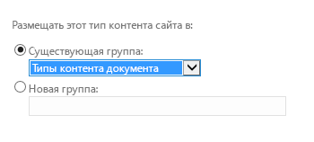
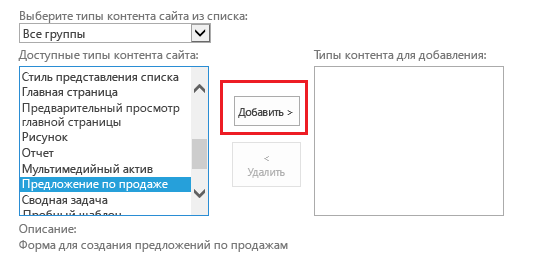

# Предоставление шаблона для библиотеки документов в облачной бизнес-надстройке
Кроме шаблонов Office, которые доступны при добавлении документа в библиотеку документов SharePoint, вы можете предоставлять собственные шаблоны. Например, у вас может быть собственный шаблон предложения о продаже, который вы хотите использовать при добавлении новых заказов.
 

 **Примечание.** В настоящее время идет процесс замены названия "приложения для SharePoint" названием "надстройки SharePoint". Во время этого процесса в документации и пользовательском интерфейсе некоторых продуктов SharePoint и средств Visual Studio может по-прежнему использоваться термин "приложения для SharePoint". Дополнительные сведения см. в статье [Новое название приложений для Office и SharePoint](new-name-for-apps-for-sharepoint.md#bk_newname).
 

## 

Если вы еще не сделали этого, сопоставьте библиотеку документов с облачной бизнес-надстройкой. См. статью [Сопоставление библиотеки документов с объектом](associate-a-document-library-with-an-entity.md).
 

 

### Добавление шаблона

1. Перейдите на свой сайт разработчика SharePoint и на странице **Разработчик** выберите **Содержимое сайта**.
    
 
2. На странице **Содержимое сайта** выберите **Параметры**, как показано на рис. 1.
    
    **Рис. 1. Ссылка "Параметры"**

 

  
 

 

 
3. На странице **Параметры сайта** выберите в списке **Коллекции веб-дизайнера** пункт **Типы контента сайта**, как показано на рис. 2.
    
    **Рис. 2. Ссылка "Типы контента сайта"**

 

  
 

 

 
4. На странице **Типы контента сайта** нажмите **Создать**, как показано на рис. 3.
    
    **Рис. 3. Ссылка "Создать"**

 

  
 

 

 
5. На странице **Создание типа контента сайта** укажите имя и описание шаблона. В поле **Родительский тип контента** выберите **Типы контента документа** и **Документ**, как показано на рис. 4.
    
    **Рис. 4. Выбор родительского типа контента**

 

  
 

 

 
6. В разделе **Группа** выберите в списке **Существующая группа** пункт **Типы контента документа**, как показано на рис. 5, а затем нажмите кнопку **ОК**.
    
    **Рис. 5. Параметр группы**

 

  
 

 

 
7. На странице **Тип контента сайта** выберите **Дополнительные параметры**.
    
 
8. На странице **Дополнительные параметры** введите URL-адрес существующего шаблона документа или отправьте новый шаблон документа, как показано на рис. 6, а затем нажмите кнопку **ОК**.
    
    **Рис. 6. Указание шаблона документа**

 

  
 

 

 
9. Перейдите на страницу **Содержимое сайта** и выберите библиотеку документов, а затем перейдите на страницу **Параметры**.
    
 
10. На странице **Параметры** выберите команду **Добавить из существующих типов контента сайта**.
    
 
11. На странице **Добавление типов конвента** добавьте свой шаблон, как показано на рис. 7, а затем нажмите кнопку **ОК**.
    
    **Рис. 7. Добавление шаблона**

 

  
 

 

 
12. Запустите надстройку и добавьте документ. Он должен появиться в диалоговом окне **Создание нового файла**, как показано на рис. 8.
    
    **Рис. 8. Диалоговое окно создания файла с новым шаблоном**

 

  
 

 

 

## Дополнительные ресурсы

-  [Разработка облачных бизнес-надстроек](develop-cloud-business-add-ins.md)
    
 
-  [Сопоставление библиотеки документов с объектом](associate-a-document-library-with-an-entity.md)
    
 

