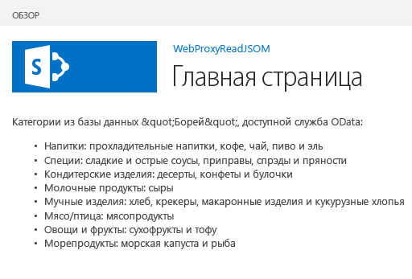

# <a name="query-a-remote-service-using-the-web-proxy-in-sharepoint"></a>Отправка запросов удаленной службе с помощью веб-прокси в SharePoint
Узнайте, как получить доступ к данным на удаленном домене со страницы, размещенной в SharePoint с помощью веб-прокси.
 

 **Примечание.** В настоящее время идет процесс замены названия "приложения для SharePoint" названием "надстройки SharePoint". Во время этого процесса в документации и пользовательском интерфейсе некоторых продуктов SharePoint и средств Visual Studio может по-прежнему использоваться термин "приложения для SharePoint". Дополнительные сведения см. в статье [Новое название приложений для Office и SharePoint](new-name-for-apps-for-sharepoint.md#bk_newname).
 

При создании надстроек SharePoint обычно необходимо объединять данные из различных источников. Из соображений безопасности связь между доменами блокируется. Если вы используете веб-прокси, веб-страницам в надстройке доступны данные на удаленном домене и домене SharePoint.
 

Как разработчик, вы можете использовать веб-прокси, предоставляемый в клиентских API, например клиентских объектных моделях JavaScript и .NET. Если вы используете веб-прокси, первый запрос отправляется в SharePoint. В свою очередь, SharePoint запрашивает данные в указанной конечной точке и пересылает отклик обратно на вашу страницу. Используйте веб-прокси, если нужно, чтобы связь осуществлялось на уровне сервера. Дополнительные сведения см. в статье [Безопасный доступ к данным и клиентские объектные модели для надстроек SharePoint](secure-data-access-and-client-object-models-for-sharepoint-add-ins.md).
 


**Веб-прокси SharePoint — это посредник между вашим кодом и внешним источником данных**

 

 

 

 

 

## <a name="prerequisites-for-using-the-examples-in-this-article"></a>Необходимые условия для использования примеров в этой статье
<a name="SP15Queryremoteservice_Prereq"> </a>

Для выполнения действий, описанных в этом примере, вам необходимо следующее:
 

 

-  [Visual Studio 2015 и Инструменты разработчика Microsoft Office последней версии](https://www.visualstudio.com/features/office-tools-vs.aspx)
    
 
- Среда разработки SharePoint (для локальных сценариев необходимо изолировать надстройку).
    
 

### <a name="core-concepts-to-know-before-using-the-web-proxy"></a>Ключевые понятия, с которыми необходимо ознакомиться до использования веб-прокси

В приведенной ниже таблице перечислены полезные статьи, которые помогут вам разобраться с понятиями, используемыми в междоменных сценариях для надстроек SharePoint.
 

 

**Таблица 1. Основные понятия для веб-прокси**


|**Название статьи**|**Описание**|
|:-----|:-----|
| [Надстройки SharePoint](sharepoint-add-ins.md)|Сведения о новой модели надстроек в SharePoint, с помощью которой можно создавать небольшие и удобные в использовании надстройки для пользователей.|
| [Безопасный доступ к данным и клиентские объектные модели для надстроек SharePoint](secure-data-access-and-client-object-models-for-sharepoint-add-ins.md)|Узнайте о вариантах доступа к данным в надстройках SharePoint. В этой статье представлена информация о вариантах работы с данными в надстройке.|
| [Хост-сайты, сайты надстроек и компоненты SharePoint в SharePoint](host-webs-add-in-webs-and-sharepoint-components-in-sharepoint.md)|Узнайте, в чем разница между хост-сайтами и сайтами надстроек. Узнайте, какие компоненты SharePoint можно включить в Надстройка SharePoint, какие компоненты можно развернуть на хост-сайтах, а какие на сайтах надстроек, а также узнайте, как развертывать сайты надстроек в изолированном домене.|
| [Междоменная безопасность на стороне клиента](http://msdn.microsoft.com/en-us/library/cc709423%28v=vs.85%29.aspx)|Ознакомьтесь с междоменными угрозами, случаями использования и принципами безопасности для междоменных запросов, а также оцените риски для разработчиков, возникающие при расширении междоменного доступа из веб-приложений, которые запускаются в браузере.|

## <a name="code-example-access-data-in-a-remote-service-using-the-web-proxy"></a>Пример кода: доступ к данным в удаленной службе с помощью веб-прокси
<a name="SP15Queryremoteservice_Codeexample"> </a>

Чтобы прочитать данные из удаленной службы, необходимо выполнить указанные ниже действия. 
 

 

1. Создайте проект надстройки SharePoint.
    
 
2. Измените страницу **Default.aspx**, чтобы использовать веб-прокси для запроса удаленной службы.
    
 
3. Измените манифест надстройки, чтобы разрешить связь с удаленным доменом.
    
 
На рис. 1 показано окно браузера с данными из удаленной службы на веб-странице SharePoint.
 

 

**Рис. 1. Веб-страница SharePoint с данными из удаленной службы**

 

 

 

### <a name="to-create-the-sharepoint-add-in-project"></a>Создание проекта надстройки SharePoint


1. Откройте Visual Studio 2015 от имени администратора. Для этого щелкните правой кнопкой значок Visual Studio 2015 в меню **Пуск** и выберите **Запуск от имени администратора**.
    
 
2. Создайте проект с использованием шаблона **Надстройка SharePoint**.
    
    На рис. 2 показано расположение шаблона **Надстройка SharePoint** в Visual Studio 2015: **Шаблоны**, **Visual C#**, **Office/SharePoint**, **Надстройки Office**.
    

    **Рис. 2. Шаблон надстройки SharePoint в Visual Studio**

 

  
 

 

 
3. Укажите URL-адрес веб-сайта SharePoint, который планируется использовать для отладки.
    
 
4. Выберите вариант размещения надстройки **Размещено в SharePoint**.
    
 

### <a name="to-modify-the-defaultaspx-page-to-use-the-web-proxy-by-using-the-javascript-object-model"></a>Изменение страницы Default.aspx для использования веб-прокси с помощью объектной модели JavaScript


1. Дважды щелкните страницу **Default.aspx** в папке **Страницы**.
    
 
2. Скопируйте приведенную ниже часть кода и вставьте ее в тег содержимого **PlaceHolderMain** страницы. Эта часть кода выполняет указанные ниже задачи.
    
      - Предоставление заполнителя для удаленных данных.
    
 
  - Создание ссылки на файлы JavaScript в SharePoint.
    
 
  - Подготовка запроса с объектом **WebRequestInfo**.
    
 
  - Подготовка заголовка запроса **Accept** для указания отклика в формате JSON (нотации объектов JavaScript).
    
 
  - Отправка вызова удаленной конечной точке.
    
 
  - Обработка успешного выполнения с отображением удаленных данных на веб-странице SharePoint.
    
 
  - Обработка любых ошибок с отображением сообщения об ошибке на веб-странице SharePoint.
    
 

```
  Categories from the Northwind database exposed as an OData service: 
    
<!-- Placeholder for the remote content -->
<span id="categories"></span>

<!-- Add references to the JavaScript libraries. -->
<script 
    type="text/javascript" 
    src="../_layouts/15/SP.Runtime.js">
</script>
<script 
    type="text/javascript" 
    src="../_layouts/15/SP.js">
</script>
<script type="text/javascript">
(function () {
    "use strict";

    // Prepare the request to an OData source
    // using the GET verb.
    var context = SP.ClientContext.get_current();
    var request = new SP.WebRequestInfo();
    request.set_url(
        "http://services.odata.org/Northwind/Northwind.svc/Categories"
        );
    request.set_method("GET");

    // We need the response formatted as JSON.
    request.set_headers({ "Accept": "application/json;odata=verbose" });
    var response = SP.WebProxy.invoke(context, request);

    // Let users know that there is some
    // processing going on.
    document.getElementById("categories").innerHTML =
                "<P>Loading categories...</P>";

    // Set the event handlers and invoke the request.
    context.executeQueryAsync(successHandler, errorHandler);

    // Event handler for the success event.
    // Get the totalResults node in the response.
    // Render the value in the placeholder.
    function successHandler() {

        // Check for status code == 200
        // Some other status codes, such as 302 redirect
        // do not trigger the errorHandler. 
        if (response.get_statusCode() == 200) {
            var categories;
            var output;

            // Load the OData source from the response.
            categories = JSON.parse(response.get_body());

            // Extract the CategoryName and Description
            // from each result in the response.
            // Build the output as a list.
            output = "<UL>";
            for (var i = 0; i < categories.d.results.length; i++) {
                var categoryName;
                var description;
                categoryName = categories.d.results[i].CategoryName;
                description = categories.d.results[i].Description;
                output += "<LI>" + categoryName + ":&amp;nbsp;" +
                    description + "</LI>";
            }
            output += "</UL>";

            document.getElementById("categories").innerHTML = output;
        }
        else {
            var errordesc;

            errordesc = "<P>Status code: " +
                response.get_statusCode() + "<br/>";
            errordesc += response.get_body();
            document.getElementById("categories").innerHTML = errordesc;
        }
    }

    // Event handler for the error event.
    // Render the response body in the placeholder.
    // The body includes the error message.
    function errorHandler() {
        document.getElementById("categories").innerHTML =
            response.get_body();
    }
})();
</script>
```


### <a name="optional-to-modify-the-defaultaspx-page-to-use-the-web-proxy-by-using-the-rest-endpoint"></a>(Необязательно) Изменение страницы Default.aspx для использования веб-прокси с помощью конечной точки REST


1. Дважды щелкните страницу **Default.aspx** в папке **Страницы**.
    
 
2. Скопируйте приведенную ниже часть кода и вставьте ее в тег содержимого **PlaceHolderMain** страницы. Эта часть кода выполняет указанные ниже задачи.
    
      - Предоставление заполнителя для удаленных данных.
    
 
  - Обращение к библиотеке jQuery.
    
 
  - Подготовка запроса к конечной точке **SP.WebRequest.Invoke**.
    
 
  - Подготовка текста запроса с объектом **SP.WebrequestInfo**. Он включает заголовок **Accept** для указания отклика в формате JSON (нотации объектов JavaScript).
    
 
  - Отправка вызова удаленной конечной точке.
    
 
  - Обработка успешного выполнения с отображением удаленных данных на веб-странице SharePoint.
    
 
  - Обработка любых ошибок с отображением сообщения об ошибке на веб-странице SharePoint.
    
 

```
  Categories from the Northwind database exposed as an OData service: 
    
<!-- Placeholder for the remote content -->
<span id="categories"></span>

<script 
    type="text/javascript" 
    src="//ajax.aspnetcdn.com/ajax/jQuery/jquery-1.8.0.min.js">
</script>

<script type="text/javascript">
(function () {
    "use strict";

    // The Northwind categories endpoint.
    var url =
        "http://services.odata.org/Northwind/Northwind.svc/Categories";

    // Let users know that there is some
    // processing going on.
    document.getElementById("categories").innerHTML =
                "<P>Loading categories...</P>";

    // Issue a POST request to the SP.WebProxy.Invoke endpoint.
    // The body has the information to issue a GET request
    // to the Northwind service.
    $.ajax({
        url: "../_api/SP.WebProxy.invoke",
        type: "POST",
        data: JSON.stringify(
            {
                "requestInfo": {
                    "__metadata": { "type": "SP.WebRequestInfo" },
                    "Url": url,
                    "Method": "GET",
                    "Headers": {
                        "results": [{
                            "__metadata": { "type": "SP.KeyValue" },
                            "Key": "Accept",
                            "Value": "application/json;odata=verbose",
                            "ValueType": "Edm.String"
                        }]
                    }
                }
            }),
        headers: {
            "Accept": "application/json;odata=verbose",
            "Content-Type": "application/json;odata=verbose",
            "X-RequestDigest": $("#__REQUESTDIGEST").val()
        },
        success: successHandler,
        error: errorHandler
    });

    // Event handler for the success event.
    // Get the totalResults node in the response.
    // Render the value in the placeholder.
    function successHandler(data) {
        // Check for status code == 200
        // Some other status codes, such as 302 redirect,
        // do not trigger the errorHandler. 
        if (data.d.Invoke.StatusCode == 200) {
            var categories;
            var output;

            // Load the OData source from the response.
            categories = JSON.parse(data.d.Invoke.Body);

            // Extract the CategoryName and Description
            // from each result in the response.
            // Build the output as a list
            output = "<UL>";
            for (var i = 0; i < categories.d.results.length; i++) {
                var categoryName;
                var description;
                categoryName = categories.d.results[i].CategoryName;
                description = categories.d.results[i].Description;
                output += "<LI>" + categoryName + ":&amp;nbsp;" +
                    description + "</LI>";
            }
            output += "</UL>";

            document.getElementById("categories").innerHTML = output;
        }
        else {
            var errordesc;

            errordesc = "<P>Status code: " +
                data.d.Invoke.StatusCode + "<br/>";
            errordesc += response.get_body();
            document.getElementById("categories").innerHTML = errordesc;
        }
    }

    // Event handler for the error event.
    // Render the response body in the placeholder.
    // The 2nd argument includes the error message.
    function errorHandler() {
        document.getElementById("categories").innerHTML =
            arguments[2];
    }
})();
</script>

```


### <a name="to-edit-the-add-in-manifest-file"></a>Изменение файла манифеста надстройки


1. В **обозревателе решений** щелкните правой кнопкой мыши файл **AppManifest.xml** и выберите пункт **Перейти к коду**.
    
 
2. Скопируйте приведенное ниже определение **RemoteEndPoints** в качестве дочернего элемента узла **App**.
    
```XML
  <RemoteEndpoints>
    <RemoteEndpoint Url=" http://services.odata.org" />
</RemoteEndpoints>
```


    The  **RemoteEndpoint** element is used to specify the remote domain. The web proxy validates that the requests issued to remote domains are declared in the add-in manifest. You can create up to 20 entries in the **RemoteEndpoints** element. Only the authority part is considered; `http://domain:port` and `http://domain:port/website` are considered the same endpoint. You can issue calls to many different endpoints within the same domain with just one **RemoteEndpoint** definition.
    
 

### <a name="to-build-and-run-the-solution"></a>Создание и запуск решения


1. Нажмите клавишу F5.
    
     **Примечание.** При нажатии клавиши F5 Visual Studio выполняет сборку решения, развертывает надстройку и открывает для нее страницу разрешений.
2. Нажмите кнопку **Доверять**.
    
 
3. Щелкните значок надстройки на странице "Содержимое сайта".
    
    На рис. 3 представлены удаленные данные на веб-странице SharePoint.
    

    **Рис. 3. Удаленные данные на веб-странице SharePoint**

 

  
 

 

 

**Таблица 2. Устранение неполадок в решении**


|**Проблема**|**Решение**|
|:-----|:-----|
|Visual Studio не открывает браузер после нажатия клавиши F5.|Задайте проект Надстройка SharePoint в качестве запускаемого.|
|Комбинация "схема-порт" не поддерживается.|Комбинация "схема-порт" для вызова должна отвечать следующим критериям:|**Схема**|**Порт**|
|:-----|:-----|
|http|80|
|https|443|
|http или https|7000–10000|

 **Важно!** На исходящие порты влияет доступность брандмауэра узла. В частности, в SharePoint Online доступны только порты http-80 и https-443.
 

| |Необработанное исключение **SP не определен**.|Убедитесь, что вы можете получить доступ к файлу SP.RequestExecutor.js в окне браузера. Если в качестве среды разработки используется локальный сервер, необходимо отключить проверку обратной связи IIS. Выполните приведенную ниже команду с помощью командной строки Windows PowerShell.```New-ItemProperty HKLM:\System\CurrentControlSet\Control\Lsa -Name "DisableLoopbackCheck" -value "1" -PropertyType dword``` **Внимание!** Не рекомендуется отключать проверку обратной связи IIS в рабочей среде. | |Размер отклика от удаленной конечной точки превышает заданный предел.|Размер отклика для запросов веб-прокси не должен превышать 200 КБ.|

## <a name="next-steps"></a>Дальнейшие действия
<a name="SP15Queryremoteservice_Next"> </a>

В этой статье показано, каким образом осуществляется считывание данных в удаленной службе с веб-страницы SharePoint. В качестве следующего шага вы можете ознакомиться с другими возможностями доступа к данным, которые существуют в Надстройки SharePoint. Чтобы узнать больше, см. следующие разделы:
 

 

-  [Пример кода: получение данных из удаленной службы с помощью веб-прокси](http://code.msdn.microsoft.com/SharePoint-Get-data-705bdcd5)
    
 
-  [Создание настраиваемой страницы прокси для междоменной библиотеки в SharePoint](create-a-custom-proxy-page-for-the-cross-domain-library-in-sharepoint.md)
    
 
-  [Доступ к данным SharePoint из надстроек с помощью междоменной библиотеки](access-sharepoint-data-from-add-ins-using-the-cross-domain-library.md)
    
 
-  [Доступ ко внешним данным с помощью REST в SharePoint](http://msdn.microsoft.com/library/0663cc8c-a736-434d-9858-6ce12ce7f748%28Office.15%29.aspx)
    
 

## <a name="additional-resources"></a>Дополнительные ресурсы
<a name="SP15Queryremoteservice_Addresources"> </a>


-  [Настройка локальной среды разработки надстроек SharePoint](set-up-an-on-premises-development-environment-for-sharepoint-add-ins.md)
    
 
-  [Работа с внешними данными в SharePoint](work-with-external-data-in-sharepoint.md)
    
 
-  [Безопасный доступ к данным и клиентские объектные модели для надстроек SharePoint](secure-data-access-and-client-object-models-for-sharepoint-add-ins.md)
    
 
-  [Авторизация и проверка подлинности для надстроек в SharePoint](authorization-and-authentication-of-sharepoint-add-ins.md)
    
 
-  [Использование операций запросов OData в запросах REST SharePoint](use-odata-query-operations-in-sharepoint-rest-requests.md)
    
 
-  [Что следует рассмотреть, прежде чем приступать к разработке надстроек SharePoint](three-ways-to-think-about-design-options-for-sharepoint-add-ins.md)
    
 
-  [Важные аспекты разработки и архитектуры для надстроек SharePoint](important-aspects-of-the-sharepoint-add-in-architecture-and-development-landscap.md)
    
 
-  [Хранение данных в надстройках SharePoint](important-aspects-of-the-sharepoint-add-in-architecture-and-development-landscap.md#Data)
    
 
