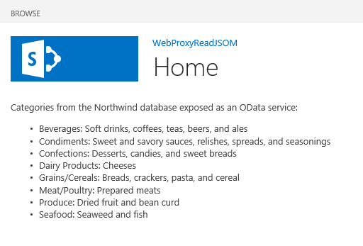

# <a name="query-a-remote-service-using-the-web-proxy-in-sharepoint"></a><span data-ttu-id="cca43-101">Отправка запросов удаленной службе с помощью веб-прокси в SharePoint</span><span class="sxs-lookup"><span data-stu-id="cca43-101">Query a remote service using the web proxy in SharePoint</span></span>
<span data-ttu-id="cca43-102">Узнайте, как получить доступ к данным на удаленном домене со страницы, размещенной в SharePoint с помощью веб-прокси.</span><span class="sxs-lookup"><span data-stu-id="cca43-102">Learn how to access data in a remote domain from a page that is hosted in SharePoint by using the web proxy.</span></span>
 

 <span data-ttu-id="cca43-p101">**Примечание.** В настоящее время идет процесс замены названия "приложения для SharePoint" названием "надстройки SharePoint". Во время этого процесса в документации и пользовательском интерфейсе некоторых продуктов SharePoint и средств Visual Studio может по-прежнему использоваться термин "приложения для SharePoint". Дополнительные сведения см. в статье [Новое название приложений для Office и SharePoint](new-name-for-apps-for-sharepoint#bk_newname).</span><span class="sxs-lookup"><span data-stu-id="cca43-p101">The name "apps for SharePoint" is changing to "SharePoint Add-ins". During the transition, the documentation and the UI of some SharePoint products and Visual Studio tools might still use the term "apps for SharePoint". For details, see [New name for apps for Office and SharePoint](new-name-for-apps-for-sharepoint#bk_newname).</span></span>
 

<span data-ttu-id="cca43-p102">При создании надстроек SharePoint обычно необходимо объединять данные из различных источников. Из соображений безопасности связь между доменами блокируется. Если вы используете веб-прокси, веб-страницам в надстройке доступны данные на удаленном домене и домене SharePoint.</span><span class="sxs-lookup"><span data-stu-id="cca43-p102">When you are building spappplural, you usually have to incorporate data from various sources. For security reasons, there are blocking mechanisms that prevent cross-domain communication. When you use the web proxy, the webpages in your add-in can access data in your remote domain and the SharePoint domain.</span></span>
 

<span data-ttu-id="cca43-p103">Как разработчик, вы можете использовать веб-прокси, предоставляемый в клиентских API, например клиентских объектных моделях JavaScript и .NET. Если вы используете веб-прокси, первый запрос отправляется в SharePoint. В свою очередь, SharePoint запрашивает данные в указанной конечной точке и пересылает отклик обратно на вашу страницу. Используйте веб-прокси, если нужно, чтобы связь осуществлялось на уровне сервера. Дополнительные сведения см. в статье [Безопасный доступ к данным и клиентские объектные модели для надстроек SharePoint](secure-data-access-and-client-object-models-for-sharepoint-add-ins).</span><span class="sxs-lookup"><span data-stu-id="cca43-p103">As a developer, you can use the web proxy exposed in client APIs, such as the JavaScript and .NET client object models. When you use the web proxy, you issue the initial request to SharePoint. In turn, SharePoint requests the data to the specified endpoint and forwards the response back to your page. Use the web proxy when you want the communication to occur at the server level. For more information, see  [Secure data access and client object models for SharePoint Add-ins. SharePoint Web Proxy is middle man between your code and external data source](secure-data-access-and-client-object-models-for-sharepoint-add-ins)</span></span>
 


<span data-ttu-id="cca43-114">**Веб-прокси SharePoint — это посредник между вашим кодом и внешним источником данных**</span><span class="sxs-lookup"><span data-stu-id="cca43-114">**SharePoint Web Proxy is middle man between your code and external data source**</span></span>

 

 

 

 

 

## <a name="prerequisites-for-using-the-examples-in-this-article"></a><span data-ttu-id="cca43-116">Необходимые условия для использования примеров в этой статье</span><span class="sxs-lookup"><span data-stu-id="cca43-116">Prerequisites for using the examples in this article</span></span>
<span data-ttu-id="cca43-117"><a name="SP15Queryremoteservice_Prereq"> </a></span><span class="sxs-lookup"><span data-stu-id="cca43-117"></span></span>

<span data-ttu-id="cca43-118">Для выполнения действий, описанных в этом примере, вам необходимо следующее:</span><span class="sxs-lookup"><span data-stu-id="cca43-118">To follow the steps in this example, you need the following:</span></span>
 

 

-  [<span data-ttu-id="cca43-119">Visual Studio 2015 и Инструменты разработчика Microsoft Office последней версии</span><span class="sxs-lookup"><span data-stu-id="cca43-119">Visual Studio 2015 and the latest Microsoft Office Developer Tools</span></span>](https://www.visualstudio.com/features/office-tools-vs.aspx)
    
 
- <span data-ttu-id="cca43-120">Среда разработки SharePoint (для локальных сценариев необходимо изолировать надстройку).</span><span class="sxs-lookup"><span data-stu-id="cca43-120">A SharePoint development environment (add-in isolation required for on-premises scenarios)</span></span>
    
 

### <a name="core-concepts-to-know-before-using-the-web-proxy"></a><span data-ttu-id="cca43-121">Ключевые понятия, с которыми необходимо ознакомиться до использования веб-прокси</span><span class="sxs-lookup"><span data-stu-id="cca43-121">Core concepts to know before using the web proxy</span></span>

<span data-ttu-id="cca43-122">В приведенной ниже таблице перечислены полезные статьи, которые помогут вам разобраться с понятиями, используемыми в междоменных сценариях для надстроек SharePoint.</span><span class="sxs-lookup"><span data-stu-id="cca43-122">The following table lists some useful articles that can help you understand the concepts involved in a cross-domain scenario in SharePoint Add-ins.</span></span>
 

 

<span data-ttu-id="cca43-123">**Таблица 1. Основные понятия для веб-прокси**</span><span class="sxs-lookup"><span data-stu-id="cca43-123">**Table 1. Core concepts for the web proxy**</span></span>


|<span data-ttu-id="cca43-124">**Название статьи**</span><span class="sxs-lookup"><span data-stu-id="cca43-124">**Article title**</span></span>|<span data-ttu-id="cca43-125">**Описание**</span><span class="sxs-lookup"><span data-stu-id="cca43-125">**Description**</span></span>|
|:-----|:-----|
| [<span data-ttu-id="cca43-126">Надстройки SharePoint</span><span class="sxs-lookup"><span data-stu-id="cca43-126">SharePoint Add-ins</span></span>](sharepoint-add-ins)|<span data-ttu-id="cca43-127">Сведения о новой модели надстроек в SharePoint, с помощью которой можно создавать небольшие и удобные в использовании надстройки для пользователей.</span><span class="sxs-lookup"><span data-stu-id="cca43-127">Learn about the new add-in model in SharePoint that enables you to create add-ins, which are small, easy-to-use solutions for end users.</span></span>|
| [<span data-ttu-id="cca43-128">Безопасный доступ к данным и клиентские объектные модели для надстроек SharePoint</span><span class="sxs-lookup"><span data-stu-id="cca43-128">Secure data access and client object models for SharePoint Add-ins</span></span>](secure-data-access-and-client-object-models-for-sharepoint-add-ins)|<span data-ttu-id="cca43-p104">Узнайте о вариантах доступа к данным в надстройках SharePoint. В этой статье представлена информация о вариантах работы с данными в надстройке.</span><span class="sxs-lookup"><span data-stu-id="cca43-p104">Learn about data access options in SharePoint Add-ins. This article provides guidance on the high-level alternatives you have to choose from when working with data in your add-in.</span></span>|
| [<span data-ttu-id="cca43-131">Хост-сайты, сайты надстроек и компоненты SharePoint в SharePoint</span><span class="sxs-lookup"><span data-stu-id="cca43-131">Host webs, add-in webs, and SharePoint components in SharePoint</span></span>](host-webs-add-in-webs-and-sharepoint-components-in-sharepoint-2013)|<span data-ttu-id="cca43-p105">Узнайте, в чем разница между хост-сайтами и сайтами надстроек. Узнайте, какие компоненты SharePoint можно включить в Надстройка SharePoint, какие компоненты можно развернуть на хост-сайтах, а какие на сайтах надстроек, а также узнайте, как развертывать сайты надстроек в изолированном домене.</span><span class="sxs-lookup"><span data-stu-id="cca43-p105">Learn about the difference between host webs and add-in webs. Find out which SharePoint components can be included in a SharePoint Add-in, which components are deployed to the host web, which components are deployed to the add-in web, and how the add-in web is deployed in an isolated domain.</span></span>|
| [<span data-ttu-id="cca43-134">Междоменная безопасность на стороне клиента</span><span class="sxs-lookup"><span data-stu-id="cca43-134">Client-side Cross-domain Security</span></span>](http://msdn.microsoft.com/en-us/library/cc709423%28v=vs.85%29.aspx)|<span data-ttu-id="cca43-135">Ознакомьтесь с междоменными угрозами, случаями использования и принципами безопасности для междоменных запросов, а также оцените риски для разработчиков, возникающие при расширении междоменного доступа из веб-приложений, которые запускаются в браузере.</span><span class="sxs-lookup"><span data-stu-id="cca43-135">Explore cross-domain threats and use cases, security principles for cross-origin requests, and weigh the risks for developers to enhance cross-domain access from web applications that run in the browser.</span></span>|

## <a name="code-example-access-data-in-a-remote-service-using-the-web-proxy"></a><span data-ttu-id="cca43-136">Пример кода: доступ к данным в удаленной службе с помощью веб-прокси</span><span class="sxs-lookup"><span data-stu-id="cca43-136">Code example: Access data in a remote service using the web proxy</span></span>
<span data-ttu-id="cca43-137"><a name="SP15Queryremoteservice_Codeexample"> </a></span><span class="sxs-lookup"><span data-stu-id="cca43-137"></span></span>

<span data-ttu-id="cca43-138">Чтобы прочитать данные из удаленной службы, необходимо выполнить указанные ниже действия.</span><span class="sxs-lookup"><span data-stu-id="cca43-138">To read data from a remote service, you must do the following:</span></span> 
 

 

1. <span data-ttu-id="cca43-139">Создайте проект надстройки SharePoint.</span><span class="sxs-lookup"><span data-stu-id="cca43-139">Create a SharePoint Add-in project.</span></span>
    
 
2. <span data-ttu-id="cca43-140">Измените страницу **Default.aspx**, чтобы использовать веб-прокси для запроса удаленной службы.</span><span class="sxs-lookup"><span data-stu-id="cca43-140">Modify the **Default.aspx** page to use the web proxy to query the remote service.</span></span>
    
 
3. <span data-ttu-id="cca43-141">Измените манифест надстройки, чтобы разрешить связь с удаленным доменом.</span><span class="sxs-lookup"><span data-stu-id="cca43-141">Modify the add-in manifest to allow communication to the remote domain.</span></span>
    
 
<span data-ttu-id="cca43-142">На рис. 1 показано окно браузера с данными из удаленной службы на веб-странице SharePoint.</span><span class="sxs-lookup"><span data-stu-id="cca43-142">Figure 1 shows the browser window with data from the remote service in a SharePoint webpage.</span></span>
 

 

<span data-ttu-id="cca43-143">**Рис. 1. Веб-страница SharePoint с данными из удаленной службы**</span><span class="sxs-lookup"><span data-stu-id="cca43-143">**Figure 1. SharePoint webpage with data from the remote service**</span></span>

 

 

 

### <a name="to-create-the-sharepoint-add-in-project"></a><span data-ttu-id="cca43-145">Создание проекта надстройки SharePoint</span><span class="sxs-lookup"><span data-stu-id="cca43-145">To create the SharePoint Add-in project</span></span>


1. <span data-ttu-id="cca43-p106">Откройте Visual Studio 2015 от имени администратора. Для этого щелкните правой кнопкой значок Visual Studio 2015 в меню **Пуск** и выберите **Запуск от имени администратора**.</span><span class="sxs-lookup"><span data-stu-id="cca43-p106">Open 2015 as administrator. (To do this, right-click the 2015 icon in the **Start** menu, and choose **Run as administrator**.)</span></span>
    
 
2. <span data-ttu-id="cca43-148">Создайте проект с использованием шаблона **Надстройка SharePoint**.</span><span class="sxs-lookup"><span data-stu-id="cca43-148">Create a new project using the **SharePoint Add-in** template.</span></span>
    
    <span data-ttu-id="cca43-149">На рис. 2 показано расположение шаблона **Надстройка SharePoint** в Visual Studio 2015: **Шаблоны**, **Visual C#**, **Office/SharePoint**, **Надстройки Office**.</span><span class="sxs-lookup"><span data-stu-id="cca43-149">Figure 2 shows the location of the  **SharePoint Add-in** template in 2015, under **Templates**,  **Visual C#**,  **Office/SharePoint**,  **Office Add-ins**.</span></span>
    

    <span data-ttu-id="cca43-150">**Рис. 2. Шаблон надстройки SharePoint в Visual Studio**</span><span class="sxs-lookup"><span data-stu-id="cca43-150">**Figure 2. SharePoint Add-in Visual Studio template**</span></span>

 

  
 

 

 
3. <span data-ttu-id="cca43-152">Укажите URL-адрес веб-сайта SharePoint, который планируется использовать для отладки.</span><span class="sxs-lookup"><span data-stu-id="cca43-152">Provide the URL of the SharePoint website that you want to use for debugging.</span></span>
    
 
4. <span data-ttu-id="cca43-153">Выберите вариант размещения надстройки **Размещено в SharePoint**.</span><span class="sxs-lookup"><span data-stu-id="cca43-153">Select **SharePoint-hosted** as the hosting option for your add-in.</span></span>
    
 

### <a name="to-modify-the-defaultaspx-page-to-use-the-web-proxy-by-using-the-javascript-object-model"></a><span data-ttu-id="cca43-154">Изменение страницы Default.aspx для использования веб-прокси с помощью объектной модели JavaScript</span><span class="sxs-lookup"><span data-stu-id="cca43-154">To modify the Default.aspx page to use the web proxy by using the JavaScript object model</span></span>


1. <span data-ttu-id="cca43-155">Дважды щелкните страницу **Default.aspx** в папке **Страницы**.</span><span class="sxs-lookup"><span data-stu-id="cca43-155">Double-click the **Default.aspx** page in the **Pages** folder.</span></span>
    
 
2. <span data-ttu-id="cca43-p107">Скопируйте приведенную ниже часть кода и вставьте ее в тег содержимого **PlaceHolderMain** страницы. Эта часть кода выполняет указанные ниже задачи.</span><span class="sxs-lookup"><span data-stu-id="cca43-p107">Copy the following markup and paste it in the **PlaceHolderMain** content tag of the page. The markup performs the following tasks:</span></span>
    
      - <span data-ttu-id="cca43-158">Предоставление заполнителя для удаленных данных.</span><span class="sxs-lookup"><span data-stu-id="cca43-158">Provides a placeholder for the remote data.</span></span>
    
 
  - <span data-ttu-id="cca43-159">Создание ссылки на файлы JavaScript в SharePoint.</span><span class="sxs-lookup"><span data-stu-id="cca43-159">References the SharePoint JavaScript files.</span></span>
    
 
  - <span data-ttu-id="cca43-160">Подготовка запроса с объектом **WebRequestInfo**.</span><span class="sxs-lookup"><span data-stu-id="cca43-160">Prepares the request with a **WebRequestInfo** object.</span></span>
    
 
  - <span data-ttu-id="cca43-161">Подготовка заголовка запроса **Accept** для указания отклика в формате JSON (нотации объектов JavaScript).</span><span class="sxs-lookup"><span data-stu-id="cca43-161">Prepares the request **Accept** header to specify the response in the JavaScript Object Notation (JSON) format.</span></span>
    
 
  - <span data-ttu-id="cca43-162">Отправка вызова удаленной конечной точке.</span><span class="sxs-lookup"><span data-stu-id="cca43-162">Issues a call to the remote endpoint.</span></span>
    
 
  - <span data-ttu-id="cca43-163">Обработка успешного выполнения с отображением удаленных данных на веб-странице SharePoint.</span><span class="sxs-lookup"><span data-stu-id="cca43-163">Handles successful completion, rendering the remote data in the SharePoint webpage.</span></span>
    
 
  - <span data-ttu-id="cca43-164">Обработка любых ошибок с отображением сообщения об ошибке на веб-странице SharePoint.</span><span class="sxs-lookup"><span data-stu-id="cca43-164">Handles any errors, rendering the error message in the SharePoint webpage.</span></span>
    
 

```
  Categories from the Northwind database exposed as an OData service: 
    
<!-- Placeholder for the remote content -->
<span id="categories"></span>

<!-- Add references to the JavaScript libraries. -->
<script 
    type="text/javascript" 
    src="../_layouts/15/SP.Runtime.js">
</script>
<script 
    type="text/javascript" 
    src="../_layouts/15/SP.js">
</script>
<script type="text/javascript">
(function () {
    "use strict";

    // Prepare the request to an OData source
    // using the GET verb.
    var context = SP.ClientContext.get_current();
    var request = new SP.WebRequestInfo();
    request.set_url(
        "http://services.odata.org/Northwind/Northwind.svc/Categories"
        );
    request.set_method("GET");

    // We need the response formatted as JSON.
    request.set_headers({ "Accept": "application/json;odata=verbose" });
    var response = SP.WebProxy.invoke(context, request);

    // Let users know that there is some
    // processing going on.
    document.getElementById("categories").innerHTML =
                "<P>Loading categories...</P>";

    // Set the event handlers and invoke the request.
    context.executeQueryAsync(successHandler, errorHandler);

    // Event handler for the success event.
    // Get the totalResults node in the response.
    // Render the value in the placeholder.
    function successHandler() {

        // Check for status code == 200
        // Some other status codes, such as 302 redirect
        // do not trigger the errorHandler. 
        if (response.get_statusCode() == 200) {
            var categories;
            var output;

            // Load the OData source from the response.
            categories = JSON.parse(response.get_body());

            // Extract the CategoryName and Description
            // from each result in the response.
            // Build the output as a list.
            output = "<UL>";
            for (var i = 0; i < categories.d.results.length; i++) {
                var categoryName;
                var description;
                categoryName = categories.d.results[i].CategoryName;
                description = categories.d.results[i].Description;
                output += "<LI>" + categoryName + ":&amp;nbsp;" +
                    description + "</LI>";
            }
            output += "</UL>";

            document.getElementById("categories").innerHTML = output;
        }
        else {
            var errordesc;

            errordesc = "<P>Status code: " +
                response.get_statusCode() + "<br/>";
            errordesc += response.get_body();
            document.getElementById("categories").innerHTML = errordesc;
        }
    }

    // Event handler for the error event.
    // Render the response body in the placeholder.
    // The body includes the error message.
    function errorHandler() {
        document.getElementById("categories").innerHTML =
            response.get_body();
    }
})();
</script>
```


### <a name="optional-to-modify-the-defaultaspx-page-to-use-the-web-proxy-by-using-the-rest-endpoint"></a><span data-ttu-id="cca43-165">(Необязательно) Изменение страницы Default.aspx для использования веб-прокси с помощью конечной точки REST</span><span class="sxs-lookup"><span data-stu-id="cca43-165">(Optional) To modify the Default.aspx page to use the web proxy by using the REST endpoint</span></span>


1. <span data-ttu-id="cca43-166">Дважды щелкните страницу **Default.aspx** в папке **Страницы**.</span><span class="sxs-lookup"><span data-stu-id="cca43-166">Double-click the **Default.aspx** page in the **Pages** folder.</span></span>
    
 
2. <span data-ttu-id="cca43-p108">Скопируйте приведенную ниже часть кода и вставьте ее в тег содержимого **PlaceHolderMain** страницы. Эта часть кода выполняет указанные ниже задачи.</span><span class="sxs-lookup"><span data-stu-id="cca43-p108">Copy the following markup and paste it in the **PlaceHolderMain** content tag of the page. The markup performs the following tasks:</span></span>
    
      - <span data-ttu-id="cca43-169">Предоставление заполнителя для удаленных данных.</span><span class="sxs-lookup"><span data-stu-id="cca43-169">Provides a placeholder for the remote data.</span></span>
    
 
  - <span data-ttu-id="cca43-170">Обращение к библиотеке jQuery.</span><span class="sxs-lookup"><span data-stu-id="cca43-170">References the jQuery library.</span></span>
    
 
  - <span data-ttu-id="cca43-171">Подготовка запроса к конечной точке **SP.WebRequest.Invoke**.</span><span class="sxs-lookup"><span data-stu-id="cca43-171">Prepares the request to the **SP.WebRequest.Invoke** endpoint.</span></span>
    
 
  - <span data-ttu-id="cca43-p109">Подготовка текста запроса с объектом **SP.WebrequestInfo**. Он включает заголовок **Accept** для указания отклика в формате JSON (нотации объектов JavaScript).</span><span class="sxs-lookup"><span data-stu-id="cca43-p109">Prepares the body of the request with a **SP.WebrequestInfo** object. The object includes an **Accept** header to specify the response in the JavaScript Object Notation (JSON) format.</span></span>
    
 
  - <span data-ttu-id="cca43-174">Отправка вызова удаленной конечной точке.</span><span class="sxs-lookup"><span data-stu-id="cca43-174">Issues a call to the remote endpoint.</span></span>
    
 
  - <span data-ttu-id="cca43-175">Обработка успешного выполнения с отображением удаленных данных на веб-странице SharePoint.</span><span class="sxs-lookup"><span data-stu-id="cca43-175">Handles successful completion, rendering the remote data in the SharePoint webpage.</span></span>
    
 
  - <span data-ttu-id="cca43-176">Обработка любых ошибок с отображением сообщения об ошибке на веб-странице SharePoint.</span><span class="sxs-lookup"><span data-stu-id="cca43-176">Handles any errors, rendering the error message in the SharePoint webpage.</span></span>
    
 

```
  Categories from the Northwind database exposed as an OData service: 
    
<!-- Placeholder for the remote content -->
<span id="categories"></span>

<script 
    type="text/javascript" 
    src="//ajax.aspnetcdn.com/ajax/jQuery/jquery-1.8.0.min.js">
</script>

<script type="text/javascript">
(function () {
    "use strict";

    // The Northwind categories endpoint.
    var url =
        "http://services.odata.org/Northwind/Northwind.svc/Categories";

    // Let users know that there is some
    // processing going on.
    document.getElementById("categories").innerHTML =
                "<P>Loading categories...</P>";

    // Issue a POST request to the SP.WebProxy.Invoke endpoint.
    // The body has the information to issue a GET request
    // to the Northwind service.
    $.ajax({
        url: "../_api/SP.WebProxy.invoke",
        type: "POST",
        data: JSON.stringify(
            {
                "requestInfo": {
                    "__metadata": { "type": "SP.WebRequestInfo" },
                    "Url": url,
                    "Method": "GET",
                    "Headers": {
                        "results": [{
                            "__metadata": { "type": "SP.KeyValue" },
                            "Key": "Accept",
                            "Value": "application/json;odata=verbose",
                            "ValueType": "Edm.String"
                        }]
                    }
                }
            }),
        headers: {
            "Accept": "application/json;odata=verbose",
            "Content-Type": "application/json;odata=verbose",
            "X-RequestDigest": $("#__REQUESTDIGEST").val()
        },
        success: successHandler,
        error: errorHandler
    });

    // Event handler for the success event.
    // Get the totalResults node in the response.
    // Render the value in the placeholder.
    function successHandler(data) {
        // Check for status code == 200
        // Some other status codes, such as 302 redirect,
        // do not trigger the errorHandler. 
        if (data.d.Invoke.StatusCode == 200) {
            var categories;
            var output;

            // Load the OData source from the response.
            categories = JSON.parse(data.d.Invoke.Body);

            // Extract the CategoryName and Description
            // from each result in the response.
            // Build the output as a list
            output = "<UL>";
            for (var i = 0; i < categories.d.results.length; i++) {
                var categoryName;
                var description;
                categoryName = categories.d.results[i].CategoryName;
                description = categories.d.results[i].Description;
                output += "<LI>" + categoryName + ":&amp;nbsp;" +
                    description + "</LI>";
            }
            output += "</UL>";

            document.getElementById("categories").innerHTML = output;
        }
        else {
            var errordesc;

            errordesc = "<P>Status code: " +
                data.d.Invoke.StatusCode + "<br/>";
            errordesc += response.get_body();
            document.getElementById("categories").innerHTML = errordesc;
        }
    }

    // Event handler for the error event.
    // Render the response body in the placeholder.
    // The 2nd argument includes the error message.
    function errorHandler() {
        document.getElementById("categories").innerHTML =
            arguments[2];
    }
})();
</script>

```


### <a name="to-edit-the-add-in-manifest-file"></a><span data-ttu-id="cca43-177">Изменение файла манифеста надстройки</span><span class="sxs-lookup"><span data-stu-id="cca43-177">To edit the add-in manifest file</span></span>


1. <span data-ttu-id="cca43-178">В **обозревателе решений** щелкните правой кнопкой мыши файл **AppManifest.xml** и выберите пункт **Перейти к коду**.</span><span class="sxs-lookup"><span data-stu-id="cca43-178">In **Solution Explorer**, open the shortcut menu for the **AppManifest.xml** file, and choose **View code**.</span></span>
    
 
2. <span data-ttu-id="cca43-179">Скопируйте приведенное ниже определение **RemoteEndPoints** в качестве дочернего элемента узла **App**.</span><span class="sxs-lookup"><span data-stu-id="cca43-179">Copy the following **RemoteEndPoints** definition as a child of the **App** node.</span></span>
    
```XML
  <RemoteEndpoints>
    <RemoteEndpoint Url=" http://services.odata.org" />
</RemoteEndpoints>
```


    The  **RemoteEndpoint** element is used to specify the remote domain. The web proxy validates that the requests issued to remote domains are declared in the add-in manifest. You can create up to 20 entries in the **RemoteEndpoints** element. Only the authority part is considered; `http://domain:port` and `http://domain:port/website` are considered the same endpoint. You can issue calls to many different endpoints within the same domain with just one **RemoteEndpoint** definition.
    
 

### <a name="to-build-and-run-the-solution"></a><span data-ttu-id="cca43-180">Создание и запуск решения</span><span class="sxs-lookup"><span data-stu-id="cca43-180">To build and run the solution</span></span>


1. <span data-ttu-id="cca43-181">Нажмите клавишу F5.</span><span class="sxs-lookup"><span data-stu-id="cca43-181">Press the F5 key.</span></span>
    
     <span data-ttu-id="cca43-182">**Примечание.** При нажатии клавиши F5 Visual Studio выполняет сборку решения, развертывает надстройку и открывает для нее страницу разрешений.</span><span class="sxs-lookup"><span data-stu-id="cca43-182">**Note** When you press F5, Visual Studio builds the solution, deploys the add-in, and opens the permissions page for the add-in.</span></span>
2. <span data-ttu-id="cca43-183">Нажмите кнопку **Доверять**.</span><span class="sxs-lookup"><span data-stu-id="cca43-183">Choose the **Trust It** button.</span></span>
    
 
3. <span data-ttu-id="cca43-184">Щелкните значок надстройки на странице "Содержимое сайта".</span><span class="sxs-lookup"><span data-stu-id="cca43-184">Click the add-in icon in the Site Contents page.</span></span>
    
    <span data-ttu-id="cca43-185">На рис. 3 представлены удаленные данные на веб-странице SharePoint.</span><span class="sxs-lookup"><span data-stu-id="cca43-185">Figure 3 shows the remote data in the SharePoint webpage.</span></span>
    

    <span data-ttu-id="cca43-186">**Рис. 3. Удаленные данные на веб-странице SharePoint**</span><span class="sxs-lookup"><span data-stu-id="cca43-186">**Figure 3. Remote data in the SharePoint webpage**</span></span>

 

  
 

 

 

<span data-ttu-id="cca43-188">**Таблица 2. Устранение неполадок в решении**</span><span class="sxs-lookup"><span data-stu-id="cca43-188">**Table 2. Troubleshooting the solution**</span></span>


|<span data-ttu-id="cca43-189">**Проблема**</span><span class="sxs-lookup"><span data-stu-id="cca43-189">**Problem**</span></span>|<span data-ttu-id="cca43-190">**Решение**</span><span class="sxs-lookup"><span data-stu-id="cca43-190">**Solution**</span></span>|
|:-----|:-----|
|<span data-ttu-id="cca43-191">Visual Studio не открывает браузер после нажатия клавиши F5.</span><span class="sxs-lookup"><span data-stu-id="cca43-191">Visual Studio does not open the browser after you press the F5 key.</span></span>|<span data-ttu-id="cca43-192">Задайте проект Надстройка SharePoint в качестве запускаемого.</span><span class="sxs-lookup"><span data-stu-id="cca43-192">Set the SharePoint Add-in project as the startup project.</span></span>|
|<span data-ttu-id="cca43-193">Комбинация "схема-порт" не поддерживается.</span><span class="sxs-lookup"><span data-stu-id="cca43-193">The scheme-port combination is not supported.</span></span>|<span data-ttu-id="cca43-194">Комбинация "схема-порт" для вызова должна отвечать следующим критериям:</span><span class="sxs-lookup"><span data-stu-id="cca43-194">The call schema-port combination must fall within the following criteria:</span></span>|<span data-ttu-id="cca43-195">**Схема**</span><span class="sxs-lookup"><span data-stu-id="cca43-195">**Scheme**</span></span>|<span data-ttu-id="cca43-196">**Порт**</span><span class="sxs-lookup"><span data-stu-id="cca43-196">**Port**</span></span>|
|<span data-ttu-id="cca43-197">:-----</span><span class="sxs-lookup"><span data-stu-id="cca43-197"></span></span>|<span data-ttu-id="cca43-198">:-----</span><span class="sxs-lookup"><span data-stu-id="cca43-198"></span></span>|
|<span data-ttu-id="cca43-199">http</span><span class="sxs-lookup"><span data-stu-id="cca43-199">http</span></span>|<span data-ttu-id="cca43-200">80</span><span class="sxs-lookup"><span data-stu-id="cca43-200">80</span></span>|
|<span data-ttu-id="cca43-201">https</span><span class="sxs-lookup"><span data-stu-id="cca43-201">https</span></span>|<span data-ttu-id="cca43-202">443</span><span class="sxs-lookup"><span data-stu-id="cca43-202">443</span></span>|
|<span data-ttu-id="cca43-203">http или https</span><span class="sxs-lookup"><span data-stu-id="cca43-203">http or https</span></span>|<span data-ttu-id="cca43-204">7000–10000</span><span class="sxs-lookup"><span data-stu-id="cca43-204">7000-10000</span></span>|

 <span data-ttu-id="cca43-p110">**Важно!** На исходящие порты влияет доступность брандмауэра узла. В частности, в SharePoint Online доступны только порты http-80 и https-443.</span><span class="sxs-lookup"><span data-stu-id="cca43-p110">**Important** The outbound ports are subject to host firewall availability. In particular, only http-80 and https-443 are available on SharePoint Online.</span></span>
 

<span data-ttu-id="cca43-p111">| |Необработанное исключение **SP не определен**.|Убедитесь, что вы можете получить доступ к файлу SP.RequestExecutor.js в окне браузера. Если в качестве среды разработки используется локальный сервер, необходимо отключить проверку обратной связи IIS. Выполните приведенную ниже команду с помощью командной строки Windows PowerShell.```New-ItemProperty HKLM:\System\CurrentControlSet\Control\Lsa -Name "DisableLoopbackCheck" -value "1" -PropertyType dword``` **Внимание!** Не рекомендуется отключать проверку обратной связи IIS в рабочей среде. | |Размер отклика от удаленной конечной точки превышает заданный предел.|Размер отклика для запросов веб-прокси не должен превышать 200 КБ.|</span><span class="sxs-lookup"><span data-stu-id="cca43-p111">| |Unhandled exception  **SP is undefined**.|Make sure you can access the SP.RequestExecutor.js file in a browser window.If you are using your local server as your development environment, you must disable IIS loopback check. Run the following command from a Windows PowerShell command prompt.```New-ItemProperty HKLM:\System\CurrentControlSet\Control\Lsa -Name "DisableLoopbackCheck" -value "1" -PropertyType dword``` **Caution**  Disabling the IIS loopback check is not recommended in a production environment. | |The size of the response from the remote endpoint exceeds the configured limit.|The response's size of web proxy requests must not be larger than 200 KB.|</span></span>

## <a name="next-steps"></a><span data-ttu-id="cca43-211">Дальнейшие действия</span><span class="sxs-lookup"><span data-stu-id="cca43-211">Next steps</span></span>
<span data-ttu-id="cca43-212"><a name="SP15Queryremoteservice_Next"> </a></span><span class="sxs-lookup"><span data-stu-id="cca43-212"></span></span>

<span data-ttu-id="cca43-p112">В этой статье показано, каким образом осуществляется считывание данных в удаленной службе с веб-страницы SharePoint. В качестве следующего шага вы можете ознакомиться с другими возможностями доступа к данным, которые существуют в Надстройки SharePoint. Чтобы узнать больше, см. следующие разделы:</span><span class="sxs-lookup"><span data-stu-id="cca43-p112">This article demonstrated how to read data in a remote service from a SharePoint webpage. As a next step, you can learn about other data access options that are available in SharePoint Add-ins. To learn more, see the following:</span></span>
 

 

-  [<span data-ttu-id="cca43-216">Пример кода: получение данных из удаленной службы с помощью веб-прокси</span><span class="sxs-lookup"><span data-stu-id="cca43-216">Code sample: Get data from a remote service using the web proxy</span></span>](http://code.msdn.microsoft.com/SharePoint-2013-Get-data-705bdcd5)
    
 
-  [<span data-ttu-id="cca43-217">Создание настраиваемой страницы прокси для междоменной библиотеки в SharePoint</span><span class="sxs-lookup"><span data-stu-id="cca43-217">Create a custom proxy page for the cross-domain library in SharePoint</span></span>](create-a-custom-proxy-page-for-the-cross-domain-library-in-sharepoint-2013)
    
 
-  [<span data-ttu-id="cca43-218">Доступ к данным SharePoint из надстроек с помощью междоменной библиотеки</span><span class="sxs-lookup"><span data-stu-id="cca43-218">Access SharePoint data from add-ins using the cross-domain library</span></span>](access-sharepoint-2013-data-from-add-ins-using-the-cross-domain-library)
    
 
-  [<span data-ttu-id="cca43-219">Доступ ко внешним данным с помощью REST в SharePoint</span><span class="sxs-lookup"><span data-stu-id="cca43-219">How to: Access external data with REST in SharePoint</span></span>](http://msdn.microsoft.com/library/0663cc8c-a736-434d-9858-6ce12ce7f748%28Office.15%29.aspx)
    
 

## <a name="additional-resources"></a><span data-ttu-id="cca43-220">Дополнительные ресурсы</span><span class="sxs-lookup"><span data-stu-id="cca43-220">Additional resources</span></span>
<span data-ttu-id="cca43-221"><a name="SP15Queryremoteservice_Addresources"> </a></span><span class="sxs-lookup"><span data-stu-id="cca43-221"></span></span>


-  [<span data-ttu-id="cca43-222">Настройка локальной среды разработки для надстроек SharePoint</span><span class="sxs-lookup"><span data-stu-id="cca43-222">Set up an on-premises development environment for SharePoint Add-ins</span></span>](set-up-an-on-premises-development-environment-for-sharepoint-add-ins)
    
 
-  [<span data-ttu-id="cca43-223">Работа с внешними данными в SharePoint</span><span class="sxs-lookup"><span data-stu-id="cca43-223">Work with external data in SharePoint</span></span>](work-with-external-data-in-sharepoint-2013)
    
 
-  [<span data-ttu-id="cca43-224">Безопасный доступ к данным и клиентские объектные модели для надстроек SharePoint</span><span class="sxs-lookup"><span data-stu-id="cca43-224">Secure data access and client object models for SharePoint Add-ins</span></span>](secure-data-access-and-client-object-models-for-sharepoint-add-ins)
    
 
-  [<span data-ttu-id="cca43-225">Авторизация и проверка подлинности надстроек SharePoint</span><span class="sxs-lookup"><span data-stu-id="cca43-225">Authorization and authentication of SharePoint Add-ins</span></span>](authorization-and-authentication-of-sharepoint-add-ins)
    
 
-  [<span data-ttu-id="cca43-226">Использование операций запросов OData в запросах REST SharePoint</span><span class="sxs-lookup"><span data-stu-id="cca43-226">Use OData query operations in SharePoint REST requests</span></span>](use-odata-query-operations-in-sharepoint-rest-requests)
    
 
-  [<span data-ttu-id="cca43-227">Что следует рассмотреть, прежде чем приступать к разработке надстроек SharePoint</span><span class="sxs-lookup"><span data-stu-id="cca43-227">Three ways to think about design options for SharePoint Add-ins</span></span>](three-ways-to-think-about-design-options-for-sharepoint-add-ins)
    
 
-  [<span data-ttu-id="cca43-228">Важные аспекты разработки и архитектуры для надстроек SharePoint</span><span class="sxs-lookup"><span data-stu-id="cca43-228">Important aspects of the SharePoint Add-in architecture and development landscape</span></span>](important-aspects-of-the-sharepoint-add-in-architecture-and-development-landscape)
    
 
-  [<span data-ttu-id="cca43-229">Хранение данных в надстройках SharePoint</span><span class="sxs-lookup"><span data-stu-id="cca43-229">Data storage in SharePoint Add-ins</span></span>](important-aspects-of-the-sharepoint-add-in-architecture-and-development-landscape#Data)
    
 
