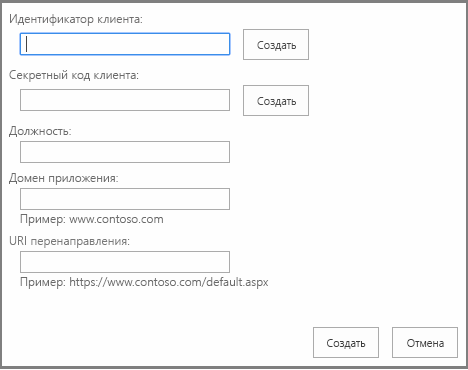

# <a name="register-sharepoint-add-ins-2013"></a><span data-ttu-id="67b9f-102">Регистрация надстроек SharePoint 2013</span><span class="sxs-lookup"><span data-stu-id="67b9f-102">Register SharePoint Add-ins 2013</span></span>
<span data-ttu-id="67b9f-103">В этой статье рассказывается, как зарегистрировать надстройку SharePoint в Azure ACS с использованием Visual Studio, Панели мониторинга продаж или страницы AppRegNew.aspx и получить регистрационную информацию.</span><span class="sxs-lookup"><span data-stu-id="67b9f-103">Register your SharePoint Add-ins in Azure ACS by using Visual Studio, the Seller Dashboard, or an AppRegNew.aspx page, and retrieve registration information.</span></span>
 

 <span data-ttu-id="67b9f-p101">**Примечание.** В настоящее время идет процесс замены названия "приложения для SharePoint" названием "надстройки SharePoint". Во время этого процесса в документации и пользовательском интерфейсе некоторых продуктов SharePoint и средств Visual Studio может по-прежнему использоваться термин "приложения для SharePoint". Дополнительные сведения см. в статье [Новое название приложений для Office и SharePoint](new-name-for-apps-for-sharepoint.md#bk_newname).</span><span class="sxs-lookup"><span data-stu-id="67b9f-p101">**Note**  The name "apps for SharePoint" is changing to "SharePoint Add-ins". During the transition, the documentation and the UI of some SharePoint products and Visual Studio tools might still use the term "apps for SharePoint". For details, see  [New name for apps for Office and SharePoint](new-name-for-apps-for-sharepoint.md#bk_newname).</span></span>
 

<span data-ttu-id="67b9f-p102">Чтобы удаленные компоненты надстройки SharePoint, размещаемой у поставщика, могли взаимодействовать с SharePoint с помощью OAuth, прежде всего необходимо зарегистрировать надстройку в облачной службе [Azure ACS](https://msdn.microsoft.com/ru-RU/library/azure/gg429788.aspx) и службе управления приложениями SharePoint тенантности или фермы. (Она называется службой управления приложениями, так как изначально надстройки SharePoint назывались приложениями для SharePoint.)</span><span class="sxs-lookup"><span data-stu-id="67b9f-p102">For the remote components of a provider-hosted SharePoint Add-in to interact with SharePoint using OAuth, the add-in must first register with the  [Azure ACS](https://msdn.microsoft.com/ru-RU/library/azure/gg429788.aspx) cloud-based service and the SharePoint App Management Service of the tenancy or farm. (It is called "App Management Service" because SharePoint Add-ins were originally called "apps for SharePoint".)</span></span>
 

 <span data-ttu-id="67b9f-109">**Примечание.** Это не требуется для надстроек, размещаемых в SharePoint.</span><span class="sxs-lookup"><span data-stu-id="67b9f-109">**Note**  This is not required for SharePoint-hosted add-ins.</span></span>
 

<span data-ttu-id="67b9f-110">Чтобы зарегистрировать надстройку в Azure ACS, укажите следующие сведения:</span><span class="sxs-lookup"><span data-stu-id="67b9f-110">To register your add-in with Azure ACS, you specify the following information:</span></span>
 

- <span data-ttu-id="67b9f-111">GUID надстройки, называемый идентификатором клиента;</span><span class="sxs-lookup"><span data-stu-id="67b9f-111">A GUID for the add-in, called a client ID.</span></span>
    
 
- <span data-ttu-id="67b9f-112">пароль для надстройки, называемый секретом клиента;</span><span class="sxs-lookup"><span data-stu-id="67b9f-112">A password for the add-in, called a client secret.</span></span>
    
 
- <span data-ttu-id="67b9f-113">отображаемое имя надстройки, используемое на странице согласия, на которой пользователь указывает, доверяет ли он надстройке;</span><span class="sxs-lookup"><span data-stu-id="67b9f-113">A display name of the add-in that is used on the consent page where the user is prompted to trust the add-in.</span></span>
    
 
- <span data-ttu-id="67b9f-114">URL-адрес домена, в котором размещена удаленная надстройка;</span><span class="sxs-lookup"><span data-stu-id="67b9f-114">A URL for the domain where the remote add-in is hosted.</span></span>
    
 
- <span data-ttu-id="67b9f-115">URL-адрес перенаправления.</span><span class="sxs-lookup"><span data-stu-id="67b9f-115">A redirect URL.</span></span>
    
 
<span data-ttu-id="67b9f-p103">После того как вы зарегистрируете свою надстройку, она получит удостоверение надстройки и станет *субъектом безопасности*, называемым субъектом надстройки. Когда вы будете устанавливать свою надстройку, администраторы SharePoint смогут получить информацию об этом субъекте надстройки.</span><span class="sxs-lookup"><span data-stu-id="67b9f-p103">After you register your add-in, it has an add-in identity and is a  *security principal*  , referred to as anadd-in principal. When you install your add-in, SharePoint administrators can retrieve information about that particular add-in principal.</span></span>
 
<span data-ttu-id="67b9f-p104">Когда пользователь в первый раз предоставляет надстройке разрешения на доступ к ресурсам SharePoint (что может произойти как на этапе установки, так и во время выполнения в зависимости от конструкции надстройки), SharePoint получает сведения о надстройке из Azure ACS. Затем SharePoint сохраняет эти сведения в базе данных службы управления приложениями тенантности или фермы SharePoint. Секрет клиента хранится только в Azure ACS. SharePoint никогда не получает секрет надстройки. Служба базы данных контента и другие компоненты, например служба профилей пользователей, может получить отображаемое имя и другие основные сведения о надстройке непосредственно из общей службы управления приложениями. Дополнительные сведения см. в разделе [Получение регистрационной информации надстройки и информации о субъекте надстройки ](register-sharepoint-add-ins.md#Retrieve) в этой статье.</span><span class="sxs-lookup"><span data-stu-id="67b9f-p104">When a user first grants an add-in permissions to access SharePoint resources (which can happen either at installation or runtime, depending on the design of the app), SharePoint gets information about the add-in from Azure ACS. SharePoint then stores this information in the App Management Service database of the SharePoint tenancy or farm. The client secret is stored only with Azure ACS. SharePoint never knows the add-in's secret. The content database service and other components, such as the user profile service, can get the display name and other basic information about the add-in directly from the app management shared service. For more information, see  [Retrieve add-in registration and add-in principal information ](register-sharepoint-add-ins.md#Retrieve) in this article.</span></span>
 

 <span data-ttu-id="67b9f-p105">**Примечание.** В этой статье предполагается, что вы знакомы с основными понятиями и принципами платформы OAuth 2.0. Дополнительные сведения см. на веб-сайте [OAuth.net](http://oauth.net/) и на веб-странице [Протокол веб-авторизации (oauth)](http://datatracker.ietf.org/doc/active/).</span><span class="sxs-lookup"><span data-stu-id="67b9f-p105">**Note**  This article assumes that you are familiar with the basic concepts and principles behind the OAuth 2.0 Framework. For more information, see  [OAuth.net](http://oauth.net/) and [Web Authorization Protocol (oauth)](http://datatracker.ietf.org/doc/active/).</span></span>
 


## <a name="register-your-sharepoint-add-in-in-azure-acs"></a><span data-ttu-id="67b9f-126">Регистрация надстройки SharePoint в Azure ACS</span><span class="sxs-lookup"><span data-stu-id="67b9f-126">Register your SharePoint Add-in in Azure ACS</span></span>

<span data-ttu-id="67b9f-127">Вы можете зарегистрировать вашу надстройку тремя способами в зависимости от текущего этапа ее разработки, ее архитектуры и от того, где вы собираетесь ее публиковать.</span><span class="sxs-lookup"><span data-stu-id="67b9f-127">You can register your add-in in one of three ways, depending on where you are in the add-in development life cycle, the architecture of your add-in, and how you plan to market it.</span></span>
 

 


|<span data-ttu-id="67b9f-128">**Метод регистрации**</span><span class="sxs-lookup"><span data-stu-id="67b9f-128">**Registration method**</span></span>|<span data-ttu-id="67b9f-129">**Сведения**</span><span class="sxs-lookup"><span data-stu-id="67b9f-129">**Details**</span></span>|
|:-----|:-----|
|<span data-ttu-id="67b9f-130">Использование Visual Studio и Инструментов разработчика Microsoft Office для Visual Studio для создания временного удостоверения надстройки.</span><span class="sxs-lookup"><span data-stu-id="67b9f-130">Use Visual Studio and Microsoft Office Developer Tools for Visual Studio to create a temporary add-in identity.</span></span>|<span data-ttu-id="67b9f-p106">Мастер Инструментов разработчика Microsoft Office для Visual Studio создает временную регистрацию для надстройки в ACS и службе управления приложениями вашего тестового веб-сайта SharePoint. Когда вы запускаете надстройку в Visual Studio (с помощью клавиши F5), используется это удостоверение. Кроме того, пакет Инструментов разработчика Microsoft Office для Visual Studio вставляет идентификатор и секрет клиента в файлы web.config и AppManifest.xml. Когда вы будете готовы опубликовать свою надстройку, воспользуйтесь мастером публикации Visual Studio. С его помощью вы перейдете на Панель мониторинга продаж и зарегистрируете надстройку. Если вы не хотите продавать свою надстройку SharePoint в Магазине Office, зарегистрируйте ее с помощью страницы AppRegNew.aspx. (Действия, которые необходимо выполнить, см. ниже.) **Примечание.** Если ваша надстройка запрашивает разрешение на динамический доступ к ресурсам SharePoint во время ее выполнения, а не при установке, вам не удастся использовать Visual Studio для создания удостоверений надстройки.</span><span class="sxs-lookup"><span data-stu-id="67b9f-p106">The Office Developer Tools for Visual Studio wizard creates a temporary registration for your add-in with ACS and the App Management Service of your SharePoint test website. When you run the add-in from Visual Studio (F5), this identity is used. The tools also insert the client ID and secret in the web.config and AppManifest.xml files.When you're ready to publish your add-in, you can use the Visual Studio publish wizard to go to the Seller Dashboard to register it. If you are not marketing your SharePoint Add-in in the Office Store, use AppRegNew.aspx to register it. (Exact steps are below.) **Note**  If your add-in requests permission to access SharePoint resources dynamically at run time, instead of on add-in installation, you cannot use Visual Studio to create add-in identities.</span></span> |
|<span data-ttu-id="67b9f-136">Зарегистрируйте надстройку на Панели мониторинга продаж.</span><span class="sxs-lookup"><span data-stu-id="67b9f-136">Register the add-in through the Seller Dashboard.</span></span>|<span data-ttu-id="67b9f-p107">Если вы собираетесь использовать свою надстройку в нескольких клиентах или фермах SharePoint, используйте Панель мониторинга продаж для регистрации надстройки независимо от того, будете ли вы продавать ее в Магазине Office или сделаете ее доступной в каталоге надстроек. После регистрации на Панели мониторинга продаж вы сможете разрабатывать свою надстройку с использованием архитектуры мультитенантности, не требуя от администраторов клиента или фермы регистрировать ее отдельно. Кроме того, если вы планируете публиковать свою надстройку в Магазине Office, то для регистрации надстройки вам придется использовать Панель мониторинга продаж. Для публикации надстройки, зарегистрированной на Панели мониторинга продаж, необязательно использовать Магазин. Дополнительные сведения см. в статье [Создание и обновление идентификаторов и секретов клиента на Панели мониторинга продаж](http://msdn.microsoft.com/library/create-or-update-client-ids-and-secrets-in-the-seller-dashboard%28Office.15%29.aspx).</span><span class="sxs-lookup"><span data-stu-id="67b9f-p107">If you're going to use your add-in in more than one SharePoint tenant or farm, use the Seller Dashboard to register your add-in, regardless of whether you will market it in the Office Store or make it available via the add-in catalog. When you register in the Seller Dashboard, you can design your add-in with a multitenant architecture without requiring tenant or farm administrators to register it separately. Also, if you plan to publish your add-in in the Office Store, you have to use the Seller Dashboard to register your add-in. You don't have to use the store to publish an add-in that is registered with the Seller Dashboard.For more information, see  [Create or update client IDs and secrets in the Seller Dashboard](http://msdn.microsoft.com/library/create-or-update-client-ids-and-secrets-in-the-seller-dashboard%28Office.15%29.aspx).</span></span>|
|<span data-ttu-id="67b9f-141">Использование страницы AppRegNew.aspx.</span><span class="sxs-lookup"><span data-stu-id="67b9f-141">Use the AppRegNew.aspx page.</span></span>|<span data-ttu-id="67b9f-p108">Если вы собираетесь применять свою надстройку SharePoint только в одном клиенте или ферме, то для регистрации надстройки используйте форму AppRegNew. Например, если вы создаете надстройки для одной организации и планируете распространять их через каталог надстроек этой организации, то для регистрации надстроек вы можете использовать страницу AppRegNew.aspx любого веб-сайта в тенантности или ферме. Вам не удастся опубликовать надстройку, зарегистрированную с помощью страницы AppRegNew.aspx, в Магазине Office. Для надстроек, публикуемых в Магазине Office, вы должны получить удостоверение на Панели управления продажами.</span><span class="sxs-lookup"><span data-stu-id="67b9f-p108">Use the AppRegNew form to register your SharePoint Add-in if you are going to use the add-in only in one tenant or farm. For example, if you're creating add-ins for a single organization and you're going to distribute them via the organization add-in catalog, you can use the AppRegNew.aspx page of any website in a tenancy or farm to register the add-in.You cannot publish an add-in that is registered with AppRegNew.aspx to the Office Store. For add-ins that are published to the Office Store, you must get an identity from the Seller Dashboard.</span></span>|

### <a name="to-register-by-using-appregnewaspx"></a><span data-ttu-id="67b9f-145">Регистрация с использованием страницы AppRegNew.aspx</span><span class="sxs-lookup"><span data-stu-id="67b9f-145">To register by using AppRegNew.aspx</span></span>


1.  <span data-ttu-id="67b9f-146">В тенантности или ферме перейдите по адресу `http://` *<SharePointWebsite>* `/_layouts/15/AppRegNew.aspx`.</span><span class="sxs-lookup"><span data-stu-id="67b9f-146">Navigate to `http://` *<SharePointWebsite>*  `/_layouts/15/AppRegNew.aspx` on the tenancy or farm.</span></span>
    
    <span data-ttu-id="67b9f-147">**Форма на странице AppRegNew**</span><span class="sxs-lookup"><span data-stu-id="67b9f-147">**AppRegNew page form**</span></span>

 

  
 

 

 
2. <span data-ttu-id="67b9f-151">Введите значения для указанных ниже полей формы.</span><span class="sxs-lookup"><span data-stu-id="67b9f-151">Enter values for the follow form fields:</span></span>
    
      -  <span data-ttu-id="67b9f-p110">**Идентификатор надстройки**. Он также называется идентификатором клиента и представляет собой GUID, который можно создать (нажав кнопку **Создать**) или вставить на странице AppRegNew.aspx. Значение должно быть уникальным для каждой надстройки и  *содержать только строчные символы*  .</span><span class="sxs-lookup"><span data-stu-id="67b9f-p110">**Add-in ID** - Also known as client ID, is a GUID that can be generated (when you choose **Generate**) or pasted into AppRegNew.aspx. The value must be unique for each add-in, and  *must be lower case*  .</span></span>
    
 
  -  <span data-ttu-id="67b9f-p111">**Секрет надстройки**. Он также называется секретом клиента и представляет собой непрозрачную строку. Он создается на странице AppRegNew.aspx с помощью кнопки **Создать**. Вот пример секрета надстройки: **xvVpG0AgVIJfch6ldu4dLUlcZyysmGqBRbpFDu6AfJw=**.</span><span class="sxs-lookup"><span data-stu-id="67b9f-p111">**Add-in Secret** - Also known as the client secret, an opaque string. It is generated on the AppRegNew.aspx page by using the **Generate** button. The following is an example of an add-in secret: **xvVpG0AgVIJfch6ldu4dLUlcZyysmGqBRbpFDu6AfJw=**.</span></span>
    
     <span data-ttu-id="67b9f-p112">**Важно!** Секреты надстроек имеют ограниченный срок действия. Если вы зарегистрировали надстройку на Панели мониторинга продаж, вы можете задать срок ее действия в пределах трех лет. Кроме того, по мере истечения срока действия старых секретов на панели мониторинга можно добавлять новые секреты. Новый секрет будет включен во всех экземплярах надстройки. Если вы зарегистрировали надстройку с помощью страницы AppRegNew.aspx, срок действия секрета истечет через один год. Подробные сведения см. в статье [Замена секрета клиента с истекающим сроком действия в надстройке SharePoint](replace-an-expiring-client-secret-in-a-sharepoint-add-in.md).</span><span class="sxs-lookup"><span data-stu-id="67b9f-p112">**Important**  Add-in secrets expire. If you register the add-in on the Seller Dashboard, you can set the expiration for up to three years. In the dashboard, you can also add new secrets when the old ones reach their expiration date. The new secret will be enabled in all instances of the add-in. If you register the add-in with AppRegNew.aspx, the secret expires in one year. For details, see  [Replace an expiring client secret in a SharePoint Add-in](replace-an-expiring-client-secret-in-a-sharepoint-add-in.md).</span></span>
  -  <span data-ttu-id="67b9f-p113">**Название** понятное название, напримерНадстройка для фотопечати Contoso. Когда для пользователя отображается запрос на предоставление надстройке необходимых разрешений, это название используется в качестве имени надстройки в запросе на продолжение.</span><span class="sxs-lookup"><span data-stu-id="67b9f-p113">**Title** - A user-friendly title; for example,Contoso photo printing add-in. Users are prompted to grant or deny the add-in the permissions that the add-in is requesting. This title appears as the name of the add-in on the consent prompt.</span></span> 
    
 
  -  <span data-ttu-id="67b9f-p114">**Домен надстройки** имя узла удаленного компонента, входящего в надстройку SharePoint. Если удаленное приложение не использует порт 443, то домен надстройки должен включать номер порта. Домен надстройки должен совпадать с привязками URL-адресов, используемыми для веб-приложения. В этом значении не следует указывать протокол (https:) или символы /. (Если для узла веб-приложения применяется псевдоним DNS CNAME, используйте его.) Примеры:</span><span class="sxs-lookup"><span data-stu-id="67b9f-p114">**Add-in Domain** - The host name of the remote component of the SharePoint Add-in. If the remote application isn't using port 443, the add-in domain must also include the port number. The add-in domain must match the URL bindings you use for your web application. Do not include protocol ("https:") or "/" characters in this value. If your web application host is using a DNS CNAME alias, use the alias. Some examples:</span></span>
    
      - <span data-ttu-id="67b9f-172">www.contoso.com:3333</span><span class="sxs-lookup"><span data-stu-id="67b9f-172">www.contoso.com:3333</span></span>
    
 
  - <span data-ttu-id="67b9f-173">www.fabrikam.com</span><span class="sxs-lookup"><span data-stu-id="67b9f-173">www.fabrikam.com</span></span>
    
 
  -  <span data-ttu-id="67b9f-p115">**URI перенаправления** конечная точка в вашем удаленном приложении или службе, на которую ACS отправляет код проверки подлинности. Строго говоря, Надстройки SharePoint не используют это значение. URI перенаправления требуется для веб-приложений, запускаемых за пределами SharePoint и использующих [поток кода проверки подлинности](creating-sharepoint-add-ins-that-use-low-trust-authorization.md#Flows) для получения авторизованного доступа к данным SharePoint. URI перенаправления игнорируется для истинных надстроек SharePoint (которые запускаются из SharePoint и используют [поток маркера контекста](creating-sharepoint-add-ins-that-use-low-trust-authorization.md#Flows)). Обычно URI перенаправления представляет собой ту же страницу, метод контроллера или метод веб-службы, которые запрашивали код проверки подлинности у ACS, но он может быть другой конечной точкой. У конечной точки должна быть логика, получающая код авторизации из отклика HTTP, отправленного ACS, а затем использующая этот код для запроса доступа и обновления маркера. Дополнительные сведения см. в разделе  [Поток кода аутентификации OAuth для надстроек в SharePoint](authorization-code-oauth-flow-for-sharepoint-add-ins.md). В форму необходимо вводить допустимое значение (даже для истинных надстроек SharePoint), хотя оно и не используется.</span><span class="sxs-lookup"><span data-stu-id="67b9f-p115">**Redirect URI:** - The endpoint in your remote application or service to which ACS sends an authentication code. Strictly speaking, SharePoint Add-ins don't use this value. The redirect URI is required for web applications that are launched outside of SharePoint and that use the [Authentication Code flow](creating-sharepoint-add-ins-that-use-low-trust-authorization.md#Flows) to get authorized access to SharePoint data. The Redirect URI is ignored for true SharePoint Add-ins (which are launched from SharePoint and use the [Context Token flow](creating-sharepoint-add-ins-that-use-low-trust-authorization.md#Flows)). The Redirect URI is usually the same page, controller method, web service method that requested the authentication code from ACS, but it can be a different endpoint. The endpoint must have logic that gets the authorization code from the HTTP Response that is sent by ACS and then uses that code to request an access and refresh token. For more information, see  [Authorization Code OAuth flow for SharePoint Add-ins](authorization-code-oauth-flow-for-sharepoint-add-ins.md). The form requires that you enter a valid value even for true SharePoint Add-ins, although it is not used.</span></span>
    
    <span data-ttu-id="67b9f-p116">Значение должно представлять собой полный URL-адрес конечной точки, включая протокол (*HTTPS*). Пример:</span><span class="sxs-lookup"><span data-stu-id="67b9f-p116">The value must be a complete endpoint URL including the protocol,  *which must be HTTPS*  . For example:</span></span>
    
      - <span data-ttu-id="67b9f-183">https://www.contoso.com/Default.aspx</span><span class="sxs-lookup"><span data-stu-id="67b9f-183">https://www.contoso.com/Default.aspx</span></span>
    
 
  - <span data-ttu-id="67b9f-184">https://www.fabrikam.com/RedirectAccept.aspx</span><span class="sxs-lookup"><span data-stu-id="67b9f-184">https://www.fabrikam.com/RedirectAccept.aspx</span></span>
    
 
  - <span data-ttu-id="67b9f-185">https://www.northwindtraders.com/home/index</span><span class="sxs-lookup"><span data-stu-id="67b9f-185">https://www.northwindtraders.com/home/index</span></span>
    
 
  - <span data-ttu-id="67b9f-186">https://adventureworks.com/vacationdata.svc</span><span class="sxs-lookup"><span data-stu-id="67b9f-186">https://adventureworks.com/vacationdata.svc</span></span>
    
 
3. <span data-ttu-id="67b9f-p117">В форме нажмите кнопку **Создать**. Страница будет перезагружена, и на ней отобразится подтверждение введенных вами значений. Сохраните эти значения в виде, удобном для копирования и вставки. Вам потребуется указать эти значения в файлах web.config и AppManifest.xml или в мастере **публикации** Visual Studio.</span><span class="sxs-lookup"><span data-stu-id="67b9f-p117">Choose  **Create** on the form. The page will reload and show a confirmation of the values you entered. Make a record of these values in a form that is eay to copy and paste. You will need to enter the values in web.config and AppManifest.xml files or in the Visual Studio **Publish** wizard.</span></span>
    
 
<span data-ttu-id="67b9f-p118">Независимо от того, как вы зарегистрируете свою надстройку SharePoint, когда вы будете готовы развернуть надстройку в промежуточной или рабочей среде, вам потребуется  [Ввод данных регистрации в файлы web.config и AppManifest.xml](#EditConfigFiles). Если вы используете Visual Studio, Инструменты разработчика Microsoft Office для Visual Studio сделает это автоматически.</span><span class="sxs-lookup"><span data-stu-id="67b9f-p118">Regardless of how you register your SharePoint Add-in, when you are ready to deploy the add-in to staging or production, you'll need to  [Enter the registration values into the web.config and AppManifest.xml files](#EditConfigFiles). If you are using Visual Studio, the Microsoft Office Developer Tools for Visual Studio do this configuration for you.</span></span>
 

 

## <a name="enter-the-registration-values-into-the-webconfig-and-appmanifestxml-files"></a><span data-ttu-id="67b9f-193">Ввод регистрационных значений в файлы web.config и AppManifest.xml</span><span class="sxs-lookup"><span data-stu-id="67b9f-193">Enter the registration values into the web.config and AppManifest.xml files</span></span>
<span data-ttu-id="67b9f-194"><a name="EditConfigFiles"> </a></span><span class="sxs-lookup"><span data-stu-id="67b9f-194"></span></span>

<span data-ttu-id="67b9f-195">Прежде чем упаковывать надстройку SharePoint и развертывать ее удаленные компоненты, необходимо указать некоторые регистрационные данные в файлах AppManifest.xml и web.config.</span><span class="sxs-lookup"><span data-stu-id="67b9f-195">Before you package the SharePoint Add-in and before you deploy its remote components, enter some of the registration values in the AppManifest.xml and the web.config file.</span></span>
 

 

 <span data-ttu-id="67b9f-196">**Совет.** Если вы будете публиковать свою надстройку SharePoint с помощью мастера публикации Visual Studio, то во время процесса публикации Visual Studio запросит идентификатор и секрет клиента и автоматически поместит эту информацию в нужные места.</span><span class="sxs-lookup"><span data-stu-id="67b9f-196">**Tip**  If you publish your SharePoint Add-in by using the Visual Studio publish wizard, Visual Studio will prompt you for a client ID and client secret during the publishing process, and it will put the information in the correct places for you.</span></span>
 


1. <span data-ttu-id="67b9f-197">В файле Web.config в проекте Visual Studio укажите значение идентификатора надстройки в качестве значения параметра **ClientId** (заменив временное значение, введенное средством).</span><span class="sxs-lookup"><span data-stu-id="67b9f-197">In the Web.config file in your Visual Studio project, enter the add-in ID value as the  **ClientId** value (replacing the temporary value that the tools entered).</span></span>
    
     <span data-ttu-id="67b9f-198">**Важно!** Все буквы в GUID идентификатора клиента должны быть строчными.</span><span class="sxs-lookup"><span data-stu-id="67b9f-198">**Important**  All the letters in the client ID GUID must be lowercase.</span></span>

    <span data-ttu-id="67b9f-199">Ниже приведен пример.</span><span class="sxs-lookup"><span data-stu-id="67b9f-199">The following is an example.</span></span>
    


```XML
  <appSettings>
  <add key="ClientId" value="a044e184-7de2-4d05-aacf-52118008c44e " />
   .  .  .
</appSettings>
```

2. <span data-ttu-id="67b9f-200">В качестве значения параметра **ClientSecret** введите секрет надстройки (заменив временное значение, введенное средством).</span><span class="sxs-lookup"><span data-stu-id="67b9f-200">Enter the add-in secret value as the  **ClientSecret** value (replacing the temporary value that the tools entered).</span></span>
    
    <span data-ttu-id="67b9f-201">В примере ниже показано, как используются значения в файле Web.config или в веб-приложении.</span><span class="sxs-lookup"><span data-stu-id="67b9f-201">The following is an example of how the values are used in the Web.config file of a web application.</span></span>
    


```XML
  <appSettings>
  <add key="ClientId" value="a044e184-7de2-4d05-aacf-52118008c44e " />
  <add key="ClientSecret" value="l0z/8TzWN0yQBzMBSEZtYts2Vt3Eo/oE3rfCdPaogKQ= " />
</appSettings>
```

3. <span data-ttu-id="67b9f-202">В файле AppManifest.xml в проекте Visual Studio введите значение идентификатора надстройки в качестве значения параметра **ClientId**, *используя строчные буквы*.</span><span class="sxs-lookup"><span data-stu-id="67b9f-202">In the AppManifest.xml file in your Visual Studio project, enter the add-in ID value as the  **ClientId** value, *with lower case letters*  .</span></span>
    
     <span data-ttu-id="67b9f-p119">**Примечание.** Манифест надстройки не применяется к веб-приложениям, которым требуется разрешение на динамический доступ к ресурсам SharePoint. Они не являются настоящими надстройками SharePoint. Они не устанавливаются в SharePoint, и у них нет манифеста надстройки. Дополнительные сведения см. в статье [Поток OAuth кода авторизации для надстроек SharePoint](authorization-code-oauth-flow-for-sharepoint-add-ins.md).</span><span class="sxs-lookup"><span data-stu-id="67b9f-p119">**Note**  The add-in manifest does not apply to web applications that request permission to access SharePoint resources on the fly. These are not really "SharePoint Add-ins". They are not installed on SharePoint and do not have an add-in manifest. For more information, see  [Authorization Code OAuth flow for SharePoint Add-ins](authorization-code-oauth-flow-for-sharepoint-add-ins.md).</span></span>

    <span data-ttu-id="67b9f-207">В примере ниже показано, как использовать значение **ClientId** в файле AppManifest.xml.</span><span class="sxs-lookup"><span data-stu-id="67b9f-207">The following example shows how the  **ClientId** value is used in the AppManifest.xml file.</span></span>
    


```XML
  <AppPrincipal>
  <RemoteWebApplication ClientId="a044e184-7de2-4d05-aacf-52118008c44e "/>
</AppPrincipal>
```

4. <span data-ttu-id="67b9f-p120">В пакете Инструменты разработчика Office для Visual Studio используется маркер `~remoteAppUrl` в элементе **StartPage**. (Например, `<StartPage>~remoteAppUrl/Pages/Default.aspx?{StandardTokens}</StartPage>`.) Если вы используете мастер **публикации** в Visual Studio, то этот маркер сопоставляется с URL-адресом удаленного компонента. Если вы не используете мастер (или если вы все-таки используете его, но публикуете удаленный компонент в Azure), вам придется вручную заменить маркер значением **домена надстройки**, которое вы использовали при регистрации этой надстройки. Это должно быть *точно такое же* значение, включающее помимо протокола HTTPS номер порта (если он имеется). Ниже указан пример такого значения.</span><span class="sxs-lookup"><span data-stu-id="67b9f-p120">The Office Developer Tools for Visual Studio use the token  `~remoteAppUrl` in **StartPage** element. (For example, `<StartPage>~remoteAppUrl/Pages/Default.aspx?{StandardTokens}</StartPage>`.) This token resolves to the URL of the remote component if you are using the  **Publish** wizard in Visual Studio. If you don't use the wizard (or if you do but you are publishing the remote component to Azure), you have to manually replace the token with the **Add-in Domain** value that you used when registering the add-in. It must be *exactly*  the same value, including port number, if any, except that you include the HTTPS protocol as well. The following is an example.</span></span>
    
```XML
  <StartPage>https://www.contoso.com/Pages/Default.aspx?{StandardTokens}</StartPage>
```

5. <span data-ttu-id="67b9f-p121">Для элемента **Title** (Название) в файле AppManifest.xml рекомендуется использовать то же значение, которое вы указывали в поле **Title** (Название) на странице AppRegNew.aspx. Значение элемента **Title** (Название) представляет собой имя надстройки, которое отображается для пользователей после ее установки. Если в диалоговом окне предоставления согласия надстройка будет иметь имя, отличающееся от ее имени в пользовательском интерфейсе SharePoint, это может ввести пользователя в заблуждение.</span><span class="sxs-lookup"><span data-stu-id="67b9f-p121">Consider using the same value for the  **Title** element in the AppManifest.xml file that you used for the **Title** field in AppRegNew.aspx. The **Title** element value is the name of the add-in that users see after it is installed. It might be confusing to users for the add-in to have a different name in the consent dialog than it has in the SharePoint UI.</span></span>
    
    <span data-ttu-id="67b9f-216">В примере ниже показаны эти значения в манифесте надстройки.</span><span class="sxs-lookup"><span data-stu-id="67b9f-216">The following example shows these values in the add-in manifest.</span></span>
    


```XML
  <Properties>
  <Title>Contoso photo printing app</Title>
  <StartPage>https://www.contoso.com/Pages/Default.aspx?{StandardTokens}</StartPage>
</Properties>
```


## <a name="use-the-redirect-url-in-an-add-in-that-asks-for-permissions-on-the-fly"></a><span data-ttu-id="67b9f-217">Использование URL-адреса перенаправления в надстройке, запрашивающей разрешения в динамическом режиме</span><span class="sxs-lookup"><span data-stu-id="67b9f-217">Use the redirect URL in an add-in that asks for permissions on the fly</span></span>
<span data-ttu-id="67b9f-218"><a name="UseRedirectUrl"> </a></span><span class="sxs-lookup"><span data-stu-id="67b9f-218"></span></span>

<span data-ttu-id="67b9f-p122">Если веб-приложение запускается за пределами SharePoint (и, таким образом, не является истинной надстройкой SharePoint), то необходимо разработать его так, чтобы во время своей работы оно запрашивало разрешения у SharePoint. Оно должно содержать код, использующий URI перенаправления и другие сведения, чтобы получить маркер доступа от ACS. Найдите место, в котором указан этот URI и используйте  *именно то*  значение, которое вы ввели в поле **URI перенаправления** на странице AppRegNew.aspx или в Панель мониторинга продаж. Это может быть файл кода или файл конфигурации.</span><span class="sxs-lookup"><span data-stu-id="67b9f-p122">If your web application is launched from outside SharePoint (and is, thus, not a true SharePoint Add-in), then it has to be designed to ask for permissions from SharePoint at runtime. It has to have code that uses the redirect URI, along with other information, to obtain an access token from ACS. Find the place where this URI is set and use the  *exact*  value that you used for the **Redirect URI** field on AppRegNew.aspx or in the Seller Dashboard. This might be in a code file or a configuration file.</span></span>
 

 

## <a name="retrieve-add-in-registration-and-add-in-principal-information"></a><span data-ttu-id="67b9f-223">Получение сведений о регистрации надстройки и субъекте надстройки</span><span class="sxs-lookup"><span data-stu-id="67b9f-223">Retrieve add-in registration and add-in principal information</span></span>
<span data-ttu-id="67b9f-224"><a name="Retrieve"> </a></span><span class="sxs-lookup"><span data-stu-id="67b9f-224"></span></span>

<span data-ttu-id="67b9f-225">Вы можете получить регистрационную информацию и информацию о субъекте для надстроек, которые вы установили или зарегистрировали в SharePoint.</span><span class="sxs-lookup"><span data-stu-id="67b9f-225">You can retrieve add-in registration information and add-in principal information for the add-ins you've installed or registered on SharePoint.</span></span> 
 

 
<span data-ttu-id="67b9f-226">Чтобы найти регистрационную информацию для зарегистрированной вами надстройки, перейдите по адресу `http://` *<SharePointWebsite>* `/_layouts/15/AppInv.aspx`.</span><span class="sxs-lookup"><span data-stu-id="67b9f-226">To look up registration information for an add-in that you have registered, go to  `http://` *<SharePointWebsite>*  `/_layouts/15/AppInv.aspx`.</span></span>
 

 
<span data-ttu-id="67b9f-p123">Для поиска необходимо использовать идентификатор клиента (идентификатор надстройки), указанный при регистрации надстройки. Результаты поиска будут содержать указанные ниже сведения для заданного идентификатора клиента.</span><span class="sxs-lookup"><span data-stu-id="67b9f-p123">To do a lookup, you have to remember the client ID (also known as the add-in ID) that was used to register the add-in. The lookup returns the following information for a particular client ID:</span></span>
 

 

- <span data-ttu-id="67b9f-229">Название</span><span class="sxs-lookup"><span data-stu-id="67b9f-229">Title</span></span>
    
 
- <span data-ttu-id="67b9f-230">Домен надстройки</span><span class="sxs-lookup"><span data-stu-id="67b9f-230">Add-in domain</span></span>
    
 
- <span data-ttu-id="67b9f-231">URL-адрес перенаправления (то же, что и URI перенаправления)</span><span class="sxs-lookup"><span data-stu-id="67b9f-231">Redirect URL (this is the same as the redirect URI.)</span></span>
    
 
<span data-ttu-id="67b9f-232">При поиске не будет возвращено значение секрета надстройки.</span><span class="sxs-lookup"><span data-stu-id="67b9f-232">The lookup does not return the add-in secret value.</span></span>
 

 
<span data-ttu-id="67b9f-233">Чтобы отобразить список субъектов зарегистрированных надстроек, перейдите по следующему адресу:</span><span class="sxs-lookup"><span data-stu-id="67b9f-233">To see a list of registered add-in principals, go to:</span></span>
 

 
 <span data-ttu-id="67b9f-234">`http://` *<SharePointWebsite>*  `/_layouts/15/AppPrincipals.aspx`</span><span class="sxs-lookup"><span data-stu-id="67b9f-234"></span></span>
 

 

## <a name="additional-resources"></a><span data-ttu-id="67b9f-235">Дополнительные ресурсы</span><span class="sxs-lookup"><span data-stu-id="67b9f-235">Additional resources</span></span>
<span data-ttu-id="67b9f-236"><a name="AR"> </a></span><span class="sxs-lookup"><span data-stu-id="67b9f-236"></span></span>


-  [<span data-ttu-id="67b9f-237">Авторизация и проверка подлинности для надстроек в SharePoint</span><span class="sxs-lookup"><span data-stu-id="67b9f-237">Authorization and authentication of SharePoint Add-ins</span></span>](authorization-and-authentication-of-sharepoint-add-ins.md)
    
 
-  [<span data-ttu-id="67b9f-238">Три системы авторизации для надстроек SharePoint</span><span class="sxs-lookup"><span data-stu-id="67b9f-238">Three authorization systems for SharePoint Add-ins</span></span>](three-authorization-systems-for-sharepoint-add-ins.md)
    
 
-  [<span data-ttu-id="67b9f-239">Знакомство с созданием надстроек SharePoint с размещением у поставщика</span><span class="sxs-lookup"><span data-stu-id="67b9f-239">Get started creating provider-hosted SharePoint Add-ins</span></span>](get-started-creating-provider-hosted-sharepoint-add-ins.md)
    
 
