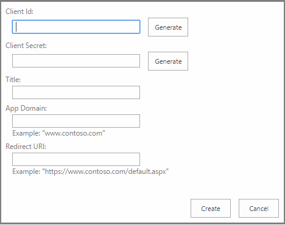

# <a name="register-sharepoint-add-ins-2013"></a>Регистрация надстроек SharePoint 2013
В этой статье рассказывается, как зарегистрировать надстройку SharePoint в Azure ACS с использованием Visual Studio, Панели мониторинга продаж или страницы AppRegNew.aspx и получить регистрационную информацию.
 

 **Примечание.** В настоящее время идет процесс замены названия "приложения для SharePoint" названием "надстройки SharePoint". Во время этого процесса в документации и пользовательском интерфейсе некоторых продуктов SharePoint и средств Visual Studio может по-прежнему использоваться термин "приложения для SharePoint". Дополнительные сведения см. в статье [Новое название приложений для Office и SharePoint](new-name-for-apps-for-sharepoint#bk_newname).
 

Чтобы удаленные компоненты надстройки SharePoint, размещаемой у поставщика, могли взаимодействовать с SharePoint с помощью OAuth, прежде всего необходимо зарегистрировать надстройку в облачной службе [Azure ACS](https://msdn.microsoft.com/en-us/library/azure/gg429788.aspx) и службе управления приложениями SharePoint тенантности или фермы. (Она называется службой управления приложениями, так как изначально надстройки SharePoint назывались приложениями для SharePoint.)
 

 **Примечание.** Это не требуется для надстроек, размещаемых в SharePoint.
 

Чтобы зарегистрировать надстройку в Azure ACS, укажите следующие сведения:
 

- GUID надстройки, называемый идентификатором клиента;
    
 
- пароль для надстройки, называемый секретом клиента;
    
 
- отображаемое имя надстройки, используемое на странице согласия, на которой пользователь указывает, доверяет ли он надстройке;
    
 
- URL-адрес домена, в котором размещена удаленная надстройка;
    
 
- URL-адрес перенаправления.
    
 
После того как вы зарегистрируете свою надстройку, она получит удостоверение надстройки и станет *субъектом безопасности*, называемым субъектом надстройки. Когда вы будете устанавливать свою надстройку, администраторы SharePoint смогут получить информацию об этом субъекте надстройки.
 
Когда пользователь в первый раз предоставляет надстройке разрешения на доступ к ресурсам SharePoint (что может произойти как на этапе установки, так и во время выполнения в зависимости от конструкции надстройки), SharePoint получает сведения о надстройке из Azure ACS. Затем SharePoint сохраняет эти сведения в базе данных службы управления приложениями тенантности или фермы SharePoint. Секрет клиента хранится только в Azure ACS. SharePoint никогда не получает секрет надстройки. Служба базы данных контента и другие компоненты, например служба профилей пользователей, может получить отображаемое имя и другие основные сведения о надстройке непосредственно из общей службы управления приложениями. Дополнительные сведения см. в разделе [Получение регистрационной информации надстройки и информации о субъекте надстройки ](register-sharepoint-add-ins-2013#Retrieve) в этой статье.
 

 **Примечание.** В этой статье предполагается, что вы знакомы с основными понятиями и принципами платформы OAuth 2.0. Дополнительные сведения см. на веб-сайте [OAuth.net](http://oauth.net/) и на веб-странице [Протокол веб-авторизации (oauth)](http://datatracker.ietf.org/doc/active/).
 


## <a name="register-your-sharepoint-add-in-in-azure-acs"></a>Регистрация надстройки SharePoint в Azure ACS

Вы можете зарегистрировать вашу надстройку тремя способами в зависимости от текущего этапа ее разработки, ее архитектуры и от того, где вы собираетесь ее публиковать.
 

 


|**Метод регистрации**|**Сведения**|
|:-----|:-----|
|Использование Visual Studio и Инструментов разработчика Microsoft Office для Visual Studio для создания временного удостоверения надстройки.|Мастер Инструментов разработчика Microsoft Office для Visual Studio создает временную регистрацию для надстройки в ACS и службе управления приложениями вашего тестового веб-сайта SharePoint. Когда вы запускаете надстройку в Visual Studio (с помощью клавиши F5), используется это удостоверение. Кроме того, пакет Инструментов разработчика Microsoft Office для Visual Studio вставляет идентификатор и секрет клиента в файлы web.config и AppManifest.xml. Когда вы будете готовы опубликовать свою надстройку, воспользуйтесь мастером публикации Visual Studio. С его помощью вы перейдете на Панель мониторинга продаж и зарегистрируете надстройку. Если вы не хотите продавать свою надстройку SharePoint в Магазине Office, зарегистрируйте ее с помощью страницы AppRegNew.aspx. (Действия, которые необходимо выполнить, см. ниже.) **Примечание.** Если ваша надстройка запрашивает разрешение на динамический доступ к ресурсам SharePoint во время ее выполнения, а не при установке, вам не удастся использовать Visual Studio для создания удостоверений надстройки. |
|Зарегистрируйте надстройку на Панели мониторинга продаж.|Если вы собираетесь использовать свою надстройку в нескольких клиентах или фермах SharePoint, используйте Панель мониторинга продаж для регистрации надстройки независимо от того, будете ли вы продавать ее в Магазине Office или сделаете ее доступной в каталоге надстроек. После регистрации на Панели мониторинга продаж вы сможете разрабатывать свою надстройку с использованием архитектуры мультитенантности, не требуя от администраторов клиента или фермы регистрировать ее отдельно. Кроме того, если вы планируете публиковать свою надстройку в Магазине Office, то для регистрации надстройки вам придется использовать Панель мониторинга продаж. Для публикации надстройки, зарегистрированной на Панели мониторинга продаж, необязательно использовать Магазин. Дополнительные сведения см. в статье [Создание и обновление идентификаторов и секретов клиента на Панели мониторинга продаж](http://msdn.microsoft.com/library/create-or-update-client-ids-and-secrets-in-the-seller-dashboard%28Office.15%29.aspx).|
|Использование страницы AppRegNew.aspx.|Если вы собираетесь применять свою надстройку SharePoint только в одном клиенте или ферме, то для регистрации надстройки используйте форму AppRegNew. Например, если вы создаете надстройки для одной организации и планируете распространять их через каталог надстроек этой организации, то для регистрации надстроек вы можете использовать страницу AppRegNew.aspx любого веб-сайта в тенантности или ферме. Вам не удастся опубликовать надстройку, зарегистрированную с помощью страницы AppRegNew.aspx, в Магазине Office. Для надстроек, публикуемых в Магазине Office, вы должны получить удостоверение на Панели управления продажами.|

### <a name="to-register-by-using-appregnewaspx"></a>Регистрация с использованием страницы AppRegNew.aspx


1.  В тенантности или ферме перейдите по адресу `http://` *<SharePointWebsite>* `/_layouts/15/AppRegNew.aspx`.
    
    **Форма на странице AppRegNew**

 

  
 

 

 
2. Введите значения для указанных ниже полей формы.
    
      -  **Идентификатор надстройки**. Он также называется идентификатором клиента и представляет собой GUID, который можно создать (нажав кнопку **Создать**) или вставить на странице AppRegNew.aspx. Значение должно быть уникальным для каждой надстройки и  *содержать только строчные символы*  .
    
 
  -  **Секрет надстройки**. Он также называется секретом клиента и представляет собой непрозрачную строку. Он создается на странице AppRegNew.aspx с помощью кнопки **Создать**. Вот пример секрета надстройки: **xvVpG0AgVIJfch6ldu4dLUlcZyysmGqBRbpFDu6AfJw=**.
    
     **Важно!** Секреты надстроек имеют ограниченный срок действия. Если вы зарегистрировали надстройку на Панели мониторинга продаж, вы можете задать срок ее действия в пределах трех лет. Кроме того, по мере истечения срока действия старых секретов на панели мониторинга можно добавлять новые секреты. Новый секрет будет включен во всех экземплярах надстройки. Если вы зарегистрировали надстройку с помощью страницы AppRegNew.aspx, срок действия секрета истечет через один год. Подробные сведения см. в статье [Замена секрета клиента с истекающим сроком действия в надстройке SharePoint](replace-an-expiring-client-secret-in-a-sharepoint-add-in).
  -  **Название** понятное название, напримерНадстройка для фотопечати Contoso. Когда для пользователя отображается запрос на предоставление надстройке необходимых разрешений, это название используется в качестве имени надстройки в запросе на продолжение. 
    
 
  -  **Домен надстройки** имя узла удаленного компонента, входящего в надстройку SharePoint. Если удаленное приложение не использует порт 443, то домен надстройки должен включать номер порта. Домен надстройки должен совпадать с привязками URL-адресов, используемыми для веб-приложения. В этом значении не следует указывать протокол (https:) или символы /. (Если для узла веб-приложения применяется псевдоним DNS CNAME, используйте его.) Примеры:
    
      - www.contoso.com:3333
    
 
  - www.fabrikam.com
    
 
  -  **URI перенаправления** конечная точка в вашем удаленном приложении или службе, на которую ACS отправляет код проверки подлинности. Строго говоря, Надстройки SharePoint не используют это значение. URI перенаправления требуется для веб-приложений, запускаемых за пределами SharePoint и использующих [поток кода проверки подлинности](creating-sharepoint-add-ins-that-use-low-trust-authorization#Flows) для получения авторизованного доступа к данным SharePoint. URI перенаправления игнорируется для истинных надстроек SharePoint (которые запускаются из SharePoint и используют [поток маркера контекста](creating-sharepoint-add-ins-that-use-low-trust-authorization#Flows)). Обычно URI перенаправления представляет собой ту же страницу, метод контроллера или метод веб-службы, которые запрашивали код проверки подлинности у ACS, но он может быть другой конечной точкой. У конечной точки должна быть логика, получающая код авторизации из отклика HTTP, отправленного ACS, а затем использующая этот код для запроса доступа и обновления маркера. Дополнительные сведения см. в разделе  [Поток кода аутентификации OAuth для надстроек в SharePoint](authorization-code-oauth-flow-for-sharepoint-add-ins). В форму необходимо вводить допустимое значение (даже для истинных надстроек SharePoint), хотя оно и не используется.
    
    Значение должно представлять собой полный URL-адрес конечной точки, включая протокол (*HTTPS*). Пример:
    
      - https://www.contoso.com/Default.aspx
    
 
  - https://www.fabrikam.com/RedirectAccept.aspx
    
 
  - https://www.northwindtraders.com/home/index
    
 
  - https://adventureworks.com/vacationdata.svc
    
 
3. В форме нажмите кнопку **Создать**. Страница будет перезагружена, и на ней отобразится подтверждение введенных вами значений. Сохраните эти значения в виде, удобном для копирования и вставки. Вам потребуется указать эти значения в файлах web.config и AppManifest.xml или в мастере **публикации** Visual Studio.
    
 
Независимо от того, как вы зарегистрируете свою надстройку SharePoint, когда вы будете готовы развернуть надстройку в промежуточной или рабочей среде, вам потребуется  [Ввод данных регистрации в файлы web.config и AppManifest.xml](#EditConfigFiles). Если вы используете Visual Studio, Инструменты разработчика Microsoft Office для Visual Studio сделает это автоматически.
 

 

## <a name="enter-the-registration-values-into-the-webconfig-and-appmanifestxml-files"></a>Ввод регистрационных значений в файлы web.config и AppManifest.xml
<a name="EditConfigFiles"> </a>

Прежде чем упаковывать надстройку SharePoint и развертывать ее удаленные компоненты, необходимо указать некоторые регистрационные данные в файлах AppManifest.xml и web.config.
 

 

 **Совет.** Если вы будете публиковать свою надстройку SharePoint с помощью мастера публикации Visual Studio, то во время процесса публикации Visual Studio запросит идентификатор и секрет клиента и автоматически поместит эту информацию в нужные места.
 


1. В файле Web.config в проекте Visual Studio укажите значение идентификатора надстройки в качестве значения параметра **ClientId** (заменив временное значение, введенное средством).
    
     **Важно!** Все буквы в GUID идентификатора клиента должны быть строчными.

    Ниже приведен пример.
    


```XML
  <appSettings>
  <add key="ClientId" value="a044e184-7de2-4d05-aacf-52118008c44e " />
   .  .  .
</appSettings>
```

2. В качестве значения параметра **ClientSecret** введите секрет надстройки (заменив временное значение, введенное средством).
    
    В примере ниже показано, как используются значения в файле Web.config или в веб-приложении.
    


```XML
  <appSettings>
  <add key="ClientId" value="a044e184-7de2-4d05-aacf-52118008c44e " />
  <add key="ClientSecret" value="l0z/8TzWN0yQBzMBSEZtYts2Vt3Eo/oE3rfCdPaogKQ= " />
</appSettings>
```

3. В файле AppManifest.xml в проекте Visual Studio введите значение идентификатора надстройки в качестве значения параметра **ClientId**, *используя строчные буквы*.
    
     **Примечание.** Манифест надстройки не применяется к веб-приложениям, которым требуется разрешение на динамический доступ к ресурсам SharePoint. Они не являются настоящими надстройками SharePoint. Они не устанавливаются в SharePoint, и у них нет манифеста надстройки. Дополнительные сведения см. в статье [Поток OAuth кода авторизации для надстроек SharePoint](authorization-code-oauth-flow-for-sharepoint-add-ins).

    В примере ниже показано, как использовать значение **ClientId** в файле AppManifest.xml.
    


```XML
  <AppPrincipal>
  <RemoteWebApplication ClientId="a044e184-7de2-4d05-aacf-52118008c44e "/>
</AppPrincipal>
```

4. В пакете Инструменты разработчика Office для Visual Studio используется маркер `~remoteAppUrl` в элементе **StartPage**. (Например, `<StartPage>~remoteAppUrl/Pages/Default.aspx?{StandardTokens}</StartPage>`.) Если вы используете мастер **публикации** в Visual Studio, то этот маркер сопоставляется с URL-адресом удаленного компонента. Если вы не используете мастер (или если вы все-таки используете его, но публикуете удаленный компонент в Azure), вам придется вручную заменить маркер значением **домена надстройки**, которое вы использовали при регистрации этой надстройки. Это должно быть *точно такое же* значение, включающее помимо протокола HTTPS номер порта (если он имеется). Ниже указан пример такого значения.
    
```XML
  <StartPage>https://www.contoso.com/Pages/Default.aspx?{StandardTokens}</StartPage>
```

5. Для элемента **Title** (Название) в файле AppManifest.xml рекомендуется использовать то же значение, которое вы указывали в поле **Title** (Название) на странице AppRegNew.aspx. Значение элемента **Title** (Название) представляет собой имя надстройки, которое отображается для пользователей после ее установки. Если в диалоговом окне предоставления согласия надстройка будет иметь имя, отличающееся от ее имени в пользовательском интерфейсе SharePoint, это может ввести пользователя в заблуждение.
    
    В примере ниже показаны эти значения в манифесте надстройки.
    


```XML
  <Properties>
  <Title>Contoso photo printing app</Title>
  <StartPage>https://www.contoso.com/Pages/Default.aspx?{StandardTokens}</StartPage>
</Properties>
```


## <a name="use-the-redirect-url-in-an-add-in-that-asks-for-permissions-on-the-fly"></a>Использование URL-адреса перенаправления в надстройке, запрашивающей разрешения в динамическом режиме
<a name="UseRedirectUrl"> </a>

Если веб-приложение запускается за пределами SharePoint (и, таким образом, не является истинной надстройкой SharePoint), то необходимо разработать его так, чтобы во время своей работы оно запрашивало разрешения у SharePoint. Оно должно содержать код, использующий URI перенаправления и другие сведения, чтобы получить маркер доступа от ACS. Найдите место, в котором указан этот URI и используйте  *именно то*  значение, которое вы ввели в поле **URI перенаправления** на странице AppRegNew.aspx или в Панель мониторинга продаж. Это может быть файл кода или файл конфигурации.
 

 

## <a name="retrieve-add-in-registration-and-add-in-principal-information"></a>Получение сведений о регистрации надстройки и субъекте надстройки
<a name="Retrieve"> </a>

Вы можете получить регистрационную информацию и информацию о субъекте для надстроек, которые вы установили или зарегистрировали в SharePoint. 
 

 
Чтобы найти регистрационную информацию для зарегистрированной вами надстройки, перейдите по адресу `http://` *<SharePointWebsite>* `/_layouts/15/AppInv.aspx`.
 

 
Для поиска необходимо использовать идентификатор клиента (идентификатор надстройки), указанный при регистрации надстройки. Результаты поиска будут содержать указанные ниже сведения для заданного идентификатора клиента.
 

 

- Название
    
 
- Домен надстройки
    
 
- URL-адрес перенаправления (то же, что и URI перенаправления)
    
 
При поиске не будет возвращено значение секрета надстройки.
 

 
Чтобы отобразить список субъектов зарегистрированных надстроек, перейдите по следующему адресу:
 

 
 `http://` *<SharePointWebsite>*  `/_layouts/15/AppPrincipals.aspx`
 

 

## <a name="additional-resources"></a>Дополнительные ресурсы
<a name="AR"> </a>


-  [Авторизация и проверка подлинности надстроек SharePoint](authorization-and-authentication-of-sharepoint-add-ins)
    
 
-  [Три системы авторизации для надстроек SharePoint](three-authorization-systems-for-sharepoint-add-ins)
    
 
-  [Знакомство с созданием надстроек SharePoint с размещением у поставщика](get-started-creating-provider-hosted-sharepoint-add-ins)
    
 
