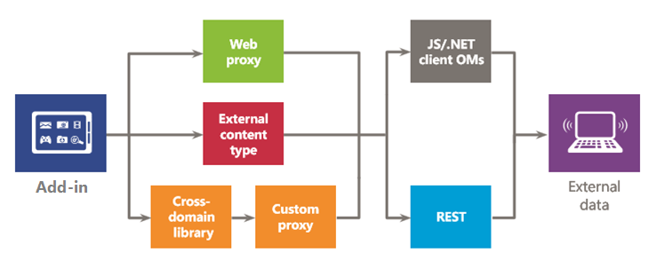

# Безопасный доступ к данным и клиентские объектные модели для надстроек SharePointSecure data access and client object models for SharePoint Add-ins
В этой статье рассказывается о вариантах доступа к данным, которые вы можете использовать при создании надстроек SharePoint (включая варианты подключения для доступа к данным в SharePoint и во внешних системах) и об API, которые можно использовать при доступе к данным из надстройки.Learn about the data access options you have when you build spappplural, including connectivity options for accessing data on spnv and on external systems, as well as the APIs that are available when you want to access data from your add-in.
 

 **Примечание.** В настоящее время идет процесс замены названия "приложения для SharePoint" названием "надстройки SharePoint". Во время этого процесса в документации и пользовательском интерфейсе некоторых продуктов SharePoint и средств Visual Studio может по-прежнему использоваться термин "приложения для SharePoint". Дополнительные сведения см. в статье [Новое название приложений для Office и SharePoint](new-name-for-apps-for-sharepoint#bk_newname).The name "apps for SharePoint" is changing to "SharePoint Add-ins". During the transition, the documentation and the UI of some SharePoint products and Visual Studio tools might still use the term "apps for SharePoint". For details, see [New name for apps for Office and SharePoint](new-name-for-apps-for-sharepoint#bk_newname).
 

При оценке вариантов доступа к данным для надстроек SharePoint вам потребуется оценить среду своей надстройки и учесть несколько факторов, например канал связи между клиентом и сервером, а также необходимый уровень разрешений, чтобы ваша надстройка могла выполнять поставленные перед ней задачи. Кроме того, вам придется оценить API, доступные в модели для надстроек SharePoint Add.In evaluating your data access options for spappplural, you have to assess your add-in environment and consider several factors, such as communication between the client and server, and the permission level that is required for your add-in to perform the required tasks. You also have to evaluate the APIs that are available in the spappmodel.
 

## Общие сведения о данных в надстройках SharePointHigh-level overview of data in SharePoint Add-ins

Трудно представить себе Надстройка SharePoint (или, собственно говоря, любую надстройку), которой не требуется запрашивать, хранить данные или управлять ими. При работе с надстройкой часто требуется извлекать данные SharePoint и управлять ими, включая элементы в библиотеках документов и списках, метаданные и профили пользователей. Кроме того, могут возникать сценарии, в которых необходимо получать доступ к внешним данным, в вашей надстройке. Модель для надстроек SharePoint предоставляет несколько вариантов подключения и обширный набор API-интерфейсов для доступа к полноформатным данным и службам, которые находятся в SharePoint и во внешних системах.It is hard to imagine a SharePoint Add-in (or any add-in for that matter) that does not need to query, store, or manipulate data. In your add-in, you will frequently have to retrieve and manipulate SharePoint data, such as items in document libraries and lists, metadata, or user profiles. Similarly, you might have scenarios where you need to access external data in your add-in. The model for SharePoint Add-ins provides multiple connectivity options and a rich set of APIs for accessing the data and services that reside on SharePoint and on external systems.
 

 
Когда вы разрабатываете свою надстройку и планируете доступ к данным, необходимо принять два ключевых решения:As you design your add-in and plan for data access, you have to make two key decisions:
 

 

1. Какой вариант подключения следует использовать?Which connectivity option should I use?
    
 
2. Какие API-интерфейсы следует использовать для доступа к необходимым данным?What APIs should I use for accessing the data I need?
    
 
На следующих рисунках приведена сводная информация о различных вариантах, которые предоставляются Модель для надстроек SharePoint. В следующих разделах мы подробно рассмотрим каждый вариант и узнаем, когда следует их использовать.The following figures summarize the different options that are provided by the model for SharePoint Add-ins. In the sections that follow, you will examine each option in detail and learn when to use them.
 

 
На рис. 1 представлены имеющиеся в наличии варианты для доступа к данным SharePoint из надстройки. При работе с этими сценариями необходимо выбрать способ проверки подлинности и связи с SharePoint: с использованием (1) OAuth или (2)междоменной библиотеки. Затем, когда речь идет об API-интерфейсе доступа к данным, необходимо выбрать между (3) клиентской объектной моделью (клиентские объектные модели JavaScript/.NET) или (4)службой REST.Figure 1 illustrates the options you have for accessing SharePoint data in your add-in. When you are dealing with these scenarios, you have to decide whether you want to authenticate and communicate to SharePoint by using (1) OAuth, or (2) the cross-domain library. Then, for the data access API, you must decide between (3) the client object model (JavaScript/.NET client object models), or (4) Representational State Transfer (REST).
 

 
Помните, что вы также можете получить доступ к определенным данным с помощью (5)  *удаленных приемников событий*  , однако основной сценарий для удаленных приемников событий удаленное выполнение кода.Keep in mind that you can also access certain data using (5)  *remote event receivers*  , however, the main scenario for remote event receivers is remote code execution.
 

 

**Рис. 1. Варианты использования данных SharePoint в надстройке****Figure 1. Options for using SharePoint data in your add-in**

 

 

 
На рис. 2 представлены варианты доступа к внешним данным в надстройке. При работе с этими сценариями необходимо выбрать использование (1)  *веб-прокси*  , (2) *внешних типов контента*  или (3) *междоменной библиотеки с пользовательской прокси-страницей*  для проверки подлинности и взаимодействия с внешними службами или системами. Также можно использовать (4)клиентскую объектную модель (клиентские объектные модели JavaScript или .NET) или (5)REST.Figure 2 shows the options that you have for accessing external data on your add-in. When you are working with these scenarios, you have to decide whether you want to use (1) the  *web proxy*  , (2) *external content types*  , or (3) the *cross-domain library with a custom proxy page*  to authenticate and communicate with external services or systems. You can also use (4) theclient object model (JavaScript/.NET client object models), or (5) Representational State Transfer (REST).
 

 

**Рис. 2. Варианты использования внешних данных в надстройке****Figure 2. Options for using external data in your add-in**

 

 

 

 

 

## Варианты подключения к данным для надстроек SharePointData connectivity options for SharePoint Add-ins

При работе с данными в надстройке следует учитывать ряд аспектов. Например, какой маршрут используется для передачи данных? Передаются ли данные с сервера или проходят через него? Проходят ли данные через клиента? Можно ли проходить проверку подлинности в качестве пользователя, вошедшего в систему? Требуются ли надстройке повышенные полномочия? Следующие разделы помогут вам ответить на эти и другие вопросы, которые могут у вас возникнуть.You have to consider several aspects when you work with data in your add-in. For example, what route is the data using? Is it coming from or going through the server? Is it going through the client? Is it OK to authenticate as the logged-on user? Does the add-in need elevated privileges? The following sections can help you with these and other questions you may have.
 

 

### Возможности подключения к данным SharePointSharePoint data connectivity

Указанные ниже варианты подключения можно использовать при доступе к данным SharePoint (см. рис. 1).The following connectivity options are available when accessing SharePoint data (see Figure 1):
 

 

-  **OAuth:** открытый протокол, который позволяет выполнять безопасную авторизацию простым и стандартным способом. OAuth позволяет пользователям утверждать заявки на выполнение действий от их имени без раскрытия имени пользователя и пароля. Вы можете использовать OAuth с серверным кодом. Это отличный вариант, если необходимо выполнять неинтерактивный процесс или повышать привилегии, предоставляя вошедшему в систему пользователю расширенные полномочия. Для получения информации о OAuth см. [Авторизация и проверка подлинности для надстроек в SharePoint](authorization-and-authentication-of-sharepoint-add-ins).**OAuth:** An open protocol that enables secure authorization in a simple and standard way. OAuth enables users to approve an application to act on their behalf without sharing their user name and password. You can use OAuth with server-side code. It is a good option if you need to run a non-interactive process, or if you need to elevate privileges to other than those of the logged-on user. For information about OAuth, see [Authorization and authentication of SharePoint Add-ins](authorization-and-authentication-of-sharepoint-add-ins).
    
 
-  **Междоменная библиотека:** клиентская альтернатива в форме файла JavaScript ( **SP.RequestExecutor.js** ), который размещается на веб-сайте SharePoint и ссылку на который может содержать удаленная надстройка. Междоменная библиотека позволяет взаимодействовать с несколькими доменами на удаленной странице надстройки через прокси-сервер. Это отличный вариант, если вы предпочитаете, чтобы код надстройки выполнялся в клиенте, а не на сервере, или если существуют препятствия для подключения, такие как брандмауэры, между SharePoint и удаленной инфраструктурой. Дополнительные сведения см. в статье [Обращение к данным SharePoint из надстроек с помощью междоменной библиотеки](access-sharepoint-2013-data-from-add-ins-using-the-cross-domain-library).**Cross-domain library:** A client-side alternative in the form of a JavaScript file ( **SP.RequestExecutor.js** ) hosted in the SharePoint website that you can reference in your remote add-in. The cross-domain library allows you to interact with more than one domain in your remote add-in page through a proxy. This is a good option if you prefer your add-in code to run in the client rather than in the server, or if there are connectivity barriers, such as firewalls, between SharePoint and your remote infrastructure. For more information, see [Access SharePoint data from add-ins using the cross-domain library](access-sharepoint-2013-data-from-add-ins-using-the-cross-domain-library).
    
 
-  **Приемники удаленных событий.** Они обрабатывают события, которые происходят с элементом в надстройке (например, это может быть список, элемент списка или веб-страница). Эти события похожи на события в традиционном решении SharePoint, однако поддерживают также работу с удаленными компонентами Надстройка SharePoint. Обратите внимание на то, что некоторые свойства элемента доступны приемнику удаленных событий. Дополнительные сведения см. в статье [Создание удаленного приемника событий в надстройках SharePoint](create-a-remote-event-receiver-in-sharepoint-add-ins). Аналогичным образом с помощью приемников событий можно настраивать установку, обновление и удаление надстройки. Дополнительные сведения см. в статье  [Создание приемника событий надстройки в надстройках для SharePoint](create-an-add-in-event-receiver-in-sharepoint-add-ins).**Remote event receivers:** You can use remote event receivers to handle events that occur to an item in the add-in, such as a list, a list item, or a web. These events resemble those in a traditional SharePoint solution, except that they can work with the remote components of the SharePoint Add-in. Note that some properties of the item are available to the remote event receiver. For more information, see [Create a remote event receiver in SharePoint Add-ins](create-a-remote-event-receiver-in-sharepoint-add-ins). In a similar way, you can use add-in event receivers to customize how your add-in is installed, updated, and uninstalled. For more information, see  [Create an add-in event receiver in SharePoint Add-ins](create-an-add-in-event-receiver-in-sharepoint-add-ins).
    
 

### Варианты подключения к данным SharePoint: выбор подходящего вариантаSharePoint data connectivity options: Which one should I use?

В таблице ниже перечислены стандартные требования и сценарии, с которыми вы можете столкнуться при создании надстроек. Знак **x** в столбце указывает, какой вариант вы можете использовать в каждом случае.The following table lists the common requirements and scenarios you might encounter when you are building add-ins. An **x** in the column indicates which option you can use in each case.
 

 

**Табл. 1. Варианты подключения к данным SharePoint****Table 1. SharePoint data connectivity options**

|**Требование или сценарий****Requirement/Scenario**|**OAuth****OAuth**|**Междоменная библиотека****Cross-domain library**|
|:-----|:-----|:-----|
|Я использую клиентские технологии (HTML и JavaScript).I use client-side technologies (HTML + JavaScript).||xx|
|Я хочу использовать интерфейсы REST.I want to use REST interfaces.|xx|xx|
|Между SharePoint и удаленной надстройкой имеется брандмауэр, и необходимо осуществлять вызовы через браузер.There is a firewall between SharePoint and my remote add-in, and I need to issue the calls through the browser.||xx|
|Надстройка должна осуществлять доступ к ресурсам как вошедший в систему пользователь.My add-in needs to access resources as the logged-on user.|xx|xx|
|Надстройка должна повышать уровень разрешений, предоставляя вошедшему в систему пользователю расширенные полномочия.My add-in needs to elevate privileges to other than those of the current logged-on user.|xx||
|Надстройка должна действовать от имени пользователя, отличного от пользователя, который вошел в систему.My add-in needs to act on behalf of a user other than the one who is logged on.|xx||
|Надстройка должна выполнять операции только в том случае, если пользователь вошел в систему.My add-in needs to perform operations only while the user is logged on.|xx|xx|
|Надстройка должна выполнять операции, даже если пользователь не вошел в систему.My add-in needs to perform operations even when the user is not logged on.|xx||
|Надстройка должна выполнять удаленный код в ответ на событие в SharePoint.My add-in needs to execute remote code as a response to an event in SharePoint.|||
Так как удаленные приемники событий основаны на OAuth, сравнение в этой таблице не представляет собой лучший способ для принятия решения об использовании того или иного варианта. Используйте удаленные приемники событий, если вам нужно выполнить удаленный код в дополнение к обмену данными.Since Remote Event Receivers are built on top of OAuth, a comparison in this table is not the best way to decide whether you should use them or not. Use Remote Event Receivers when you need to execute remote code in addition to data exchange.
 

 

### Подключение к внешним даннымExternal data connectivity

При доступе к внешним данным можно использовать указанные ниже варианты подключения (см. рис. 2).The following connectivity options are available when accessing external data (see Figure 2):
 

 

-  **Веб-прокси:** как разработчик, вы можете использовать веб-прокси, предоставляемый в API-интерфейсах клиента, такие как JSOM. Если вы используете веб-прокси, вы отправляете первоначальный запрос на SharePoint. В свою очередь, SharePoint запрашивает данные на определенной конечной точке и передает ответ обратно на свою страницу. Используйте веб-прокси, если вы хотите, чтобы связь осуществлялась на уровне сервера. Веб-прокси предназначен для доступа к неструктурированным данным, не требующим проверки подлинности. Дополнительные сведения см. в статье [Отправка запросов удаленной службе с помощью веб-прокси в SharePoint](query-a-remote-service-using-the-web-proxy-in-sharepoint-2013).**Web proxy:** As a developer, you can use the web proxy exposed in client APIs such as the JSOM. When you use the web proxy, you issue the initial request to SharePoint. In turn, SharePoint requests the data to the specified endpoint and forwards the response back to your page. Use the web proxy when you want the communication to occur at the server level. The web proxy is designed to access unstructured data that doesn't require authentication. For more information, see [Query a remote service using the web proxy in SharePoint](query-a-remote-service-using-the-web-proxy-in-sharepoint-2013).
    
 
-  **Внешние типы контента:** вы можете создавать надстройки, получающие доступ к внешним данным из SAP, Netflix и другим типам данных без администратора клиента. Доступ к внешним приложениям осуществляется с помощью служб Business Connectivity Services (BCS), которые предоставляют согласованный интерфейс, доступный другим приложениям SharePoint. ECT с разрешениями на уровне приложения хороший вариант, если вы используете модель BCS и получаете доступ к данным, требующим проверки подлинности. Дополнительные сведения см. в статье [Добавьте в пределах внешних типов контента в SharePoint](http://msdn.microsoft.com/library/a34cbbba-dc38-4d3d-b796-d54b5848bdfb%28Office.15%29.aspx).**External content types:** You can create add-ins that access external data from SAP, Netflix, and proprietary and other types of data without involving the tenant administrator.Access to external applications is maintained through Business Connectivity Services (BCS), which provides a consistent and uniform interface that can be used by other SharePoint applications. App-scoped ECTs are a good option when you are using a BCS model and access to the data requires authentication. For more information, see [Add-in-scoped external content types in SharePoint](http://msdn.microsoft.com/library/a34cbbba-dc38-4d3d-b796-d54b5848bdfb%28Office.15%29.aspx).
    
 
-  **Пользовательская прокси-страница для междоменной библиотеки:** вы можете использовать междоменную библиотеку для доступа к данным в удаленной надстройке, если вы предоставляете пользовательскую прокси-страницу, которая размещается в инфраструктуре удаленной надстройки. Как разработчик, вы несете ответственность за реализацию пользовательской прокси-страницы и должны использовать настраиваемую логику, например механизм проверки подлинности, для удаленной надстройки Используйте междоменную библиотеку с пользовательской прокси-страницей, если требуется, чтобы связь осуществлялась на уровне клиента. Для получения дополнительной информации см. [Создание пользовательской прокси-страницы для междоменной библиотеки в SharePoint](create-a-custom-proxy-page-for-the-cross-domain-library-in-sharepoint-2013).**Custom proxy page for the cross-domain library:** You can use the cross-domain library to access data in your remote add-in if you provide a custom proxy page that is hosted in the remote add-in infrastructure. As the developer, you are responsible for the custom proxy page implementation and must provide custom logic, such as the authentication mechanism to the remote add-in. Use the cross-domain library with a custom proxy page if you want the communication to occur at the client level. For more information, see [Create a custom proxy page for the cross-domain library in SharePoint](create-a-custom-proxy-page-for-the-cross-domain-library-in-sharepoint-2013).
    
 

### Варианты подключения к внешним данным: выбор подходящего вариантаExternal data connectivity options: Which one should I use?

В таблице ниже перечислены стандартные требования и сценарии, с которыми вы можете столкнуться при создании надстроек. Знак **x** в столбце указывает, какой вариант вы можете использовать в каждом случае.The following table lists the common requirements and scenarios you might encounter when you are building add-ins. An **x** in the column indicates which option you can use in each case.
 

 

**Табл. 2. Варианты подключения к внешним данным****Table 2. External data connectivity options**

|**Требование или сценарий****Requirement/Scenario**|**Веб-прокси****Web proxy**|**Внешние типы контента****External content types**|**Междоменная библиотека с настраиваемой страницей прокси****Cross-domain library with custom proxy page**|
|:-----|:-----|:-----|:-----|
|Я использую клиентские технологии (HTML и JavaScript).I use client-side technologies (HTML + JavaScript).|xx|xx|xx|
|Не удается добавлять страницы или компоненты в удаленную надстройку или службу.I cannot add pages or components to the remote add-in or service.|xx|xx||
|Я хочу использовать интерфейсы REST.I want to use REST interfaces.|xx|xx|xx|
|Я хочу использовать JavaScript CSOM.I want to use the JavaScript CSOM.|xx|xx|xx|
|Я хочу использовать .NET CSOM.I want to use the .NET CSOM.|xx|xx||
|Прямая связь между инфраструктурой SharePoint и надстройкой отсутствует, и мне необходимо осуществлять вызовы через браузер.There is no direct connectivity between the SharePoint infrastructure and my add-in. I need to issue calls through the browser.||xx|xx|
|Надстройка должна осуществлять доступ к ресурсам как вошедший в систему пользователь.My add-in needs to access resources as the logged-on user.|xx|xx|xx|

## API доступа к данным, которые можно использовать в надстройках SharePointAvailable data access APIs for SharePoint Add-ins

Для доступа к данным SharePoint из надстройки можно использовать указанные ниже API.The following API choices are available when you want to access SharePoint data from your add-in:
 

 

-  **Служба REST:** для сценариев, в которых требуется доступ к сущностям SharePoint из клиентских технологий, которые не используют JavaScript и созданы не на основе платформы .NET Framework, SharePoint предоставляет реализацию веб-службы REST, которая использует [протокол Open Data (OData)](http://www.odata.org/) для выполнения операций CRUDQ (Create, Read, Update, Delete, Query создание, чтение, обновление, удаление, запрос) с данными SharePoint. Кроме того, практически каждый API-интерфейс в клиентских объектных моделях обладает соответствующей конечной точкой REST. Это позволяет коду взаимодействовать напрямую с SharePoint с использованием любой технологии, которая поддерживает стандартные возможности REST. Для использования возможностей REST, которые встроены в SharePoint, код создает запрос RESTful HTTP, передаваемый на конечную точку, которая соответствует необходимому объекту SharePoint. Служба REST обрабатывает запрос HTTP и запрос в формате Atom или Нотация объектов JavaScript (JSON). Для получения более подробных сведений о REST в SharePoint см. [Использование операций запросов OData в запросах SharePoint REST](use-odata-query-operations-in-sharepoint-rest-requests).**Representational State Transfer (REST):** For scenarios in which you need to access SharePoint entities from client technologies that do not use JavaScript and are not built on the .NET Framework platform, SharePoint provides an implementation of a REST web service that uses the [Open Data (OData) protocol](http://www.odata.org/) to perform CRUDQ (Create, Read, Update, Delete, and Query) operations on SharePoint data. In addition, nearly every API in the client object models has a corresponding REST endpoint. This enables your code to interact directly with SharePoint by using any technology that supports standard REST capabilities. To use the REST capabilities that are built into SharePoint, your code constructs a RESTful HTTP request to an endpoint that corresponds to the desired SharePoint object. The REST service handles the HTTP request and serves a response in either Atom or JavaScript Object Notation (JSON) format. To learn more about REST in SharePoint, see [Use OData query operations in SharePoint REST requests](use-odata-query-operations-in-sharepoint-rest-requests).
    
 
-  **Клиентская объектная модель .NET Framework (.NET client OM):** практически каждый класс на основном узле и в объектной модели на стороне сервера обладают соответствующим классом в клиентской объектной модели .NET Framework. Кроме того, клиентская объектная модель .NET Framework также предоставляет полный набор API-интерфейсов для расширения других функций, включая некоторые функции уровня SharePoint, в том числе ECM, таксономию, профили пользователей, расширенный поиск, аналитику, BCS и т. д. Для получения дополнительных сведений об объектных моделях на стороне клиента см. [Выбор правильного набора API в SharePoint](http://msdn.microsoft.com/library/f36645da-77c5-47f1-a2ca-13d4b62b320d%28Office.15%29.aspx).**.NET Framework client object model (.NET client OM):** Almost every class in the core site and list server-side object model has a corresponding class in the .NET Framework client object model. In addition, the .NET Framework client object model also exposes a full set of APIs for extending other features, including some SharePoint-level features such as ECM, taxonomy, user profiles, advanced search, analytics, BCS, and others. To learn more about client-side object models, see [Choose the right API set in SharePoint](http://msdn.microsoft.com/library/f36645da-77c5-47f1-a2ca-13d4b62b320d%28Office.15%29.aspx).
    
 
-  **Клиентская объектная модель JavaScript (JSOM):** SharePoint предоставляет объектную модель JavaScript для использования во встроенном скрипте или отдельных JS-файлах. Она включает те же функциональные возможности, что и клиентская объектная модель .NET Framework. JSOM это удобный способ включения пользовательского кода SharePoint в надстройку, особенно в Надстройки, размещаемые в SharePoint, где пользовательский код на стороне сервера не разрешен. Эта модель также позволяет веб-разработчикам использовать существующие навыки работы с JavaScript для создания Надстройки SharePoint при прохождении минимального обучения. Дополнительные сведения о клиентских объектных моделях см. в статье [Выбор правильного набора API в SharePoint](http://msdn.microsoft.com/library/f36645da-77c5-47f1-a2ca-13d4b62b320d%28Office.15%29.aspx).**JavaScript client object model (JSOM):** SharePoint provides a JavaScript object model for use in either inline script or separate .js files. It includes all the same functionality as the .NET Framework client object model. The JSOM is a useful way of including custom SharePoint code in an add-in, especially in a SharePoint-hosted add-in, where custom server-side code is not allowed. It also enables web developers to use their existing JavaScript skills to create SharePoint Add-ins with a minimal learning curve. To learn more about client-side object models, see [Choose the right API set in SharePoint](http://msdn.microsoft.com/library/f36645da-77c5-47f1-a2ca-13d4b62b320d%28Office.15%29.aspx).
    
 
Возможно, существуют другие API, которые можно использовать в Надстройка SharePoint при доступе к внешним данным. Это зависит от интерфейсов с внешними системами и возможностями этих систем. Данные интерфейсы также следует учитывать при создании приложения.There might be additional APIs that you can use in your SharePoint Add-in when accessing external data. It depends on what interfaces the external services and systems have to offer. You should also consider these interfaces in your design.
 

 

## Дополнительные ресурсыAdditional resources

-  [Авторизация и проверка подлинности надстроек SharePointAuthorization and authentication of SharePoint Add-ins](authorization-and-authentication-of-sharepoint-add-ins)
    
 
-  [Доступ к данным SharePoint из надстроек с помощью междоменной библиотекиAccess SharePoint data from add-ins using the cross-domain library](access-sharepoint-2013-data-from-add-ins-using-the-cross-domain-library)
    
 
-  [Создание настраиваемой страницы прокси для междоменной библиотеки в SharePointCreate a custom proxy page for the cross-domain library in SharePoint](create-a-custom-proxy-page-for-the-cross-domain-library-in-sharepoint-2013)
    
 
-  [Отправка запросов удаленной службе с помощью веб-прокси в SharePointQuery a remote service using the web proxy in SharePoint](query-a-remote-service-using-the-web-proxy-in-sharepoint-2013)
    
 
-  [Создание удаленного приемника событий в надстройках SharePointCreate a remote event receiver in SharePoint Add-ins](create-a-remote-event-receiver-in-sharepoint-add-ins)
    
 
-  [Выбор правильного набора API в SharePointChoose the right API set in SharePoint](http://msdn.microsoft.com/library/f36645da-77c5-47f1-a2ca-13d4b62b320d%28Office.15%29.aspx)
    
 
-  [Использование операций запросов OData в запросах REST SharePointUse OData query operations in SharePoint REST requests](use-odata-query-operations-in-sharepoint-rest-requests)
    
 

