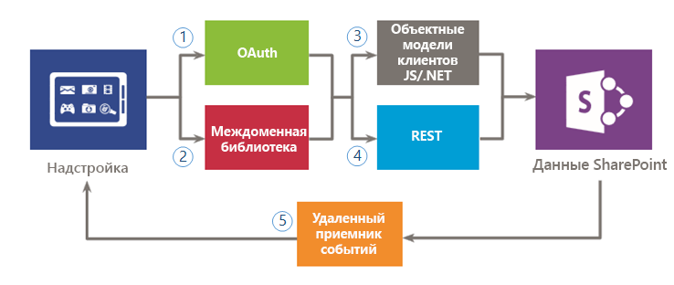

# Безопасный доступ к данным и клиентские объектные модели для надстроек SharePoint

При оценке вариантов доступа к данным для надстроек SharePoint вам потребуется оценить среду своей надстройки и учесть несколько факторов, например канал связи между клиентом и сервером, а также необходимый уровень разрешений, чтобы ваша надстройка могла выполнять поставленные перед ней задачи. Кроме того, вам придется оценить API, доступные в модели для надстроек SharePoint Add.

## Общие сведения о данных в надстройках SharePoint

Трудно представить себе надстройку SharePoint (или, собственно говоря, любую надстройку), которой не требуется запрашивать, хранить данные или управлять ими. При работе с надстройкой часто требуется извлекать данные SharePoint и управлять ими, включая элементы в библиотеках документов и списках, метаданные и профили пользователей. Кроме того, при работе с надстройкой могут возникать сценарии, в которых необходим доступ к внешним данным. Модель для надстроек SharePoint предоставляет несколько вариантов подключения и обширный набор API для доступа к данным и службам, которые находятся в SharePoint и во внешних системах.

Когда вы разрабатываете свою надстройку и планируете доступ к данным, необходимо принять два ключевых решения:

1. Какой вариант подключения следует использовать?
2. Какие API следует использовать для доступа к необходимым данным?

На следующих рисунках приведена сводная информация о различных вариантах, которые предоставляются Модель для надстроек SharePoint. В следующих разделах мы подробно рассмотрим каждый вариант и узнаем, когда следует их использовать.

На рисунке 1 представлены имеющиеся в наличии варианты для доступа к данным SharePoint из надстройки. При работе с этими сценариями необходимо выбрать способ проверки подлинности и связи с SharePoint: с использованием (1) OAuth или (2) междоменной библиотеки. Что касается API доступа к данным, необходимо выбрать между (3) клиентской объектной моделью (клиентские объектные модели JavaScript/.NET) или (4) службой REST.

Помните, что вы также можете получить доступ к определенным данным с помощью (5) приемников удаленных событий, но основной сценарий для этих приемников — удаленное выполнение кода.

*Рис. 1. Варианты использования данных SharePoint в надстройке*

 
На рисунке 2 представлены варианты доступа к внешним данным из надстройки. При работе с этими сценариями необходимо выбрать использование (1) веб-прокси, (2) внешних типов контента или (3) междоменной библиотеки с пользовательской прокси-страницей для проверки подлинности и взаимодействия с внешними службами или системами. Вы также можете использовать (4) клиентскую объектную модель (клиентские объектные модели JavaScript или .NET) или (5) службу REST.

*Рис. 2. Варианты использования внешних данных в надстройке*

## Варианты подключения к данным для надстроек SharePoint

При работе с данными в надстройке следует учитывать ряд аспектов. Например, какой маршрут используется для передачи данных? Поступают ли данные с сервера или через него? Проходят ли данные через клиент? Можно ли проходить проверку подлинности в качестве пользователя, вошедшего в систему? Требуется ли надстройке более высокий уровень привилегий? В разделах ниже вы можете найти ответы на эти и другие вопросы, которые могут у вас возникнуть.

### Возможности подключения к данным SharePoint

Указанные ниже варианты подключения можно использовать при доступе к данным SharePoint (см. рис. 1).

- **OAuth:** открытый протокол, обеспечивающий безопасную авторизацию простым и стандартным способом. Протокол OAuth позволяет пользователям утверждать заявки на выполнение действий от их имени, не раскрывая имя пользователя и пароль. Вы можете использовать протокол OAuth с серверным кодом. Это отличный вариант, если необходимо выполнить неинтерактивный процесс или предоставить вошедшему в систему пользователю более высокий уровень привилегий. Дополнительные сведения о протоколе OAuth см. в статье [Авторизация и аутентификация надстроек SharePoint](authorization-and-authentication-of-sharepoint-add-ins.md).  
 
- **Междоменная библиотека:** клиентская альтернатива в форме файла JavaScript (**SP.RequestExecutor.js**), размещенного на веб-сайте SharePoint, на который вы можете указать ссылку в своей удаленной надстройке. Междоменная библиотека позволяет взаимодействовать с несколькими доменами на удаленной странице надстройки через прокси-сервер. Это отличный вариант, если вы предпочитаете, чтобы код надстройки выполнялся в клиенте, а не на сервере, или если между SharePoint и удаленной инфраструктурой существуют препятствия для подключения, такие как брандмауэры. Дополнительные сведения см. в статье [Обращение к данным SharePoint из надстроек с помощью междоменной библиотеки](access-sharepoint-data-from-add-ins-using-the-cross-domain-library.md).
     
- **Удаленные приемники событий:** с их помощью вы можете обрабатывать события, которые происходят с элементом в надстройке, например списком, элементом списка или сайтом. Эти события похожи на события в традиционном решении SharePoint, но они также поддерживают работу с удаленными компонентами надстройки SharePoint. Обратите внимание, что удаленному приемнику событий доступны некоторые свойства элемента. Дополнительные сведения см. в статье [Создание удаленного приемника событий в надстройках SharePoint](create-a-remote-event-receiver-in-sharepoint-add-ins.md). Аналогичным образом с помощью приемников событий надстройки можно настраивать ее установку, обновление и удаление. Дополнительные сведения см. в статье [Создание приемника событий надстройки в надстройках для SharePoint](create-an-add-in-event-receiver-in-sharepoint-add-ins.md).

### Варианты подключения к данным SharePoint: выбор подходящего варианта

В следующей таблице представлен список основных требований и сценариев, с которыми вы можете столкнуться при создании надстроек. Символ **x** в столбце указывает, какой вариант можно использовать в каждом отдельном случае.

**Табл. 1. Варианты подключения к данным SharePoint**

|**Требование или сценарий**|**OAuth**|**Междоменная библиотека**|
|:-----|:-----:|:-----:|
|Я использую клиентские технологии (HTML и JavaScript).||x|
|Я хочу использовать интерфейсы REST.|x|x|
|Между SharePoint и удаленной надстройкой имеется брандмауэр, и вызовы необходимо осуществлять через браузер.||x|
|Надстройка должна осуществлять доступ к ресурсам как пользователь, вошедший в систему.|x|x|
|Надстройка должна предоставлять более высокий уровень привилегий вошедшему в систему пользователю.|x||
|Надстройка должна действовать от имени другого пользователя, чем тот, который вошел в систему.|x||
|Надстройка должна выполнять операции, только если пользователь вошел в систему.|x|x|
|Надстройка должна выполнять операции, даже если пользователь не вошел в систему.|x||
|Надстройка должна выполнять удаленный код в ответ на событие в SharePoint.|||

Так как удаленные приемники событий основаны на протоколе OAuth, сравнение в этой таблице не представляет собой лучший способ для принятия решения об использовании того или иного варианта. Используйте удаленные приемники событий, если вам нужно выполнить удаленный код в дополнение к обмену данными.

### Подключение к внешним данным

При доступе к внешним данным можно использовать указанные ниже варианты подключения (см. рис. 2).

-  **Веб-прокси:** как разработчик, вы можете использовать веб-прокси, предоставляемый в API клиента, такие как JSOM. Если вы используете веб-прокси, вы отправляете первоначальный запрос на SharePoint. В свою очередь, SharePoint запрашивает данные на определенной конечной точке и передает ответ обратно на свою страницу. Используйте веб-прокси, если вы хотите, чтобы связь осуществлялась на уровне сервера. Веб-прокси предназначен для доступа к неструктурированным данным, не требующим проверки подлинности. Дополнительные сведения см. в статье [Отправка запросов удаленной службе с помощью веб-прокси в SharePoint](query-a-remote-service-using-the-web-proxy-in-sharepoint.md).

-  **Внешние типы контента:** вы можете создавать надстройки, получающие доступ к внешним данным из SAP и Netflix, частным данным и сведениям других типов без администратора клиента. Доступ к внешним приложениям поддерживать через Службы Business Connectivity Services (BCS), который предоставляет согласованную и универсальный интерфейс, который может использоваться другими приложениями SharePoint. ECT с разрешениями на уровне приложения — отличный вариант, если вы используете модель BCS и получаете доступ к данным, требующим проверки подлинности. Дополнительные сведения см. в статье [Внешние типы контента из области надстроек в SharePoint](http://msdn.microsoft.com/library/a34cbbba-dc38-4d3d-b796-d54b5848bdfb%28Office.15%29.aspx).

-  **Пользовательская прокси-страница для междоменной библиотеки:** вы можете использовать междоменную библиотеку для доступа к данным в удаленной надстройке, если вы предоставляете пользовательскую прокси-страницу, которая размещается в инфраструктуре удаленной надстройки. Как разработчик, вы несете ответственность за реализацию пользовательской прокси-страницы и должны использовать настраиваемую логику, например механизм проверки подлинности, для удаленной надстройки Используйте междоменную библиотеку с пользовательской прокси-страницей, если требуется, чтобы связь осуществлялась на уровне клиента. Для получения дополнительной информации см. [Создание пользовательской прокси-страницы для междоменной библиотеки в SharePoint](create-a-custom-proxy-page-for-the-cross-domain-library-in-sharepoint.md).

### Варианты подключения к внешним данным: выбор подходящего варианта

В следующей таблице представлен список основных требований и сценариев, с которыми вы можете столкнуться при создании надстроек. Символ **x** в столбце указывает, какой вариант можно использовать в каждом отдельном случае.

**Табл. 2. Варианты подключения к внешним данным**

|**Требование или сценарий**|**Веб-прокси**|**Внешние типы контента**|**Междоменная библиотека с настраиваемой страницей прокси**|
|:-----|:-----:|:-----:|:-----:|
|Я использую клиентские технологии (HTML и JavaScript).|x|x|x|
|Не удается добавлять страницы или компоненты в удаленную надстройку или службу.|x|x||
|Я хочу использовать интерфейсы REST.|x|x|x|
|Я хочу использовать JavaScript CSOM.|x|x|x|
|Я хочу использовать .NET CSOM.|x|x||
|Прямая связь между инфраструктурой SharePoint и надстройкой отсутствует, и мне необходимо осуществлять вызовы через браузер.||x|x|
|Надстройка должна осуществлять доступ к ресурсам как пользователь, вошедший в систему.|x|x|x|

## API доступа к данным, которые можно использовать в надстройках SharePoint

Для доступа к данным SharePoint из надстройки можно использовать указанные ниже API.

- **Служба REST:** для сценариев, в которых требуется доступ к сущностям SharePoint из клиентских технологий, которые не используют JavaScript и созданы не на основе платформы .NET Framework, SharePoint предоставляет реализацию веб-службы REST, которая использует [протокол Open Data (OData)](http://www.odata.org/) для выполнения операций CRUDQ (Create, Read, Update, Delete, Query создание, чтение, обновление, удаление, запрос) с данными SharePoint. Кроме того, практически каждый API в клиентских объектных моделях обладает соответствующей конечной точкой REST. Это позволяет коду взаимодействовать напрямую с SharePoint с использованием любой технологии, которая поддерживает стандартные возможности REST. Для использования возможностей REST, которые встроены в SharePoint, код создает запрос RESTful HTTP, передаваемый на конечную точку, которая соответствует необходимому объекту SharePoint. Служба REST обрабатывает запрос HTTP и запрос в формате Atom или Нотация объектов JavaScript (JSON). Для получения более подробных сведений о REST в SharePoint см. [Использование операций запросов OData в запросах SharePoint REST](use-odata-query-operations-in-sharepoint-rest-requests.md).
    
- **Клиентская объектная модель .NET Framework (.NET client OM):** практически каждый класс на основном узле и в объектной модели на стороне сервера обладают соответствующим классом в клиентской объектной модели .NET Framework. Кроме того, клиентская объектная модель .NET Framework также предоставляет полный набор API для расширения других функций, включая некоторые функции уровня SharePoint, в том числе ECM, таксономию, профили пользователей, расширенный поиск, аналитику, BCS и т. д. Для получения дополнительных сведений об объектных моделях на стороне клиента см. [Выбор правильного набора API в SharePoint](http://msdn.microsoft.com/library/f36645da-77c5-47f1-a2ca-13d4b62b320d%28Office.15%29.aspx). 
 
- **Клиентская объектная модель JavaScript (JSOM):** SharePoint предоставляет объектную модель JavaScript для использования во встроенном скрипте или отдельных JS-файлах. Она включает те же функциональные возможности, что и клиентская объектная модель .NET Framework. JSOM это удобный способ включения пользовательского кода SharePoint в надстройку, особенно в Надстройки, размещаемые в SharePoint, где пользовательский код на стороне сервера не разрешен. Эта модель также позволяет веб-разработчикам использовать существующие навыки работы с JavaScript для создания Надстройки SharePoint при прохождении минимального обучения. Дополнительные сведения о клиентских объектных моделях см. в статье [Выбор правильного набора API в SharePoint](http://msdn.microsoft.com/library/f36645da-77c5-47f1-a2ca-13d4b62b320d%28Office.15%29.aspx).
    
Возможно, существуют другие API, которые можно использовать в Надстройка SharePoint при доступе к внешним данным. Это зависит от интерфейсов с внешними системами и возможностями этих систем. Данные интерфейсы также следует учитывать при создании приложения.

## См. также

-  [Авторизация и проверка подлинности для надстроек в SharePoint](authorization-and-authentication-of-sharepoint-add-ins.md)
-  [Доступ к данным SharePoint из надстроек с помощью междоменной библиотеки](access-sharepoint-data-from-add-ins-using-the-cross-domain-library.md)
-  [Создание настраиваемой страницы прокси для междоменной библиотеки в SharePoint](create-a-custom-proxy-page-for-the-cross-domain-library-in-sharepoint.md)
-  [Отправка запросов удаленной службе с помощью веб-прокси в SharePoint](query-a-remote-service-using-the-web-proxy-in-sharepoint.md)
-  [Создание удаленного приемника событий в надстройках SharePoint](create-a-remote-event-receiver-in-sharepoint-add-ins.md)
-  [Выбор правильного набора API в SharePoint](http://msdn.microsoft.com/library/f36645da-77c5-47f1-a2ca-13d4b62b320d%28Office.15%29.aspx)
-  [Использование операций запросов OData в запросах REST SharePoint](use-odata-query-operations-in-sharepoint-rest-requests.md)
    
 

