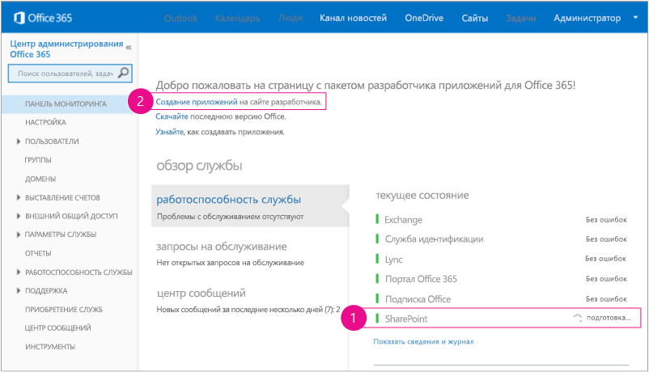
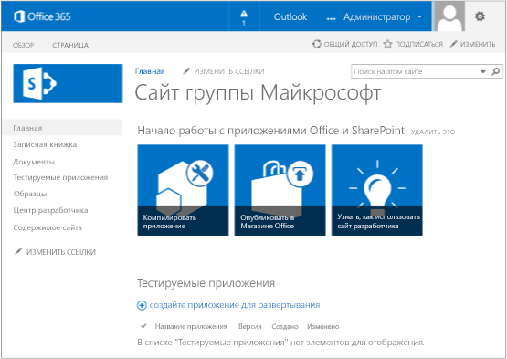

# Настройка среды разработки надстроек SharePoint в Office 365Set up a development environment for SharePoint Add-ins on Office 365

Чтобы получить представление о доступных вариантах, прежде чем выполнять описанные в этой статье действия, см. статью [Средства и среды для разработки надстроек SharePoint](tools-and-environments-for-developing-sharepoint-add-ins.md).To get an understanding of your options before you carry out any procedures in this article, see [Tools and environments for developing SharePoint Add-ins](tools-and-environments-for-developing-sharepoint-add-ins.md). 

Если вы не уверены, какие надстройки SharePoint требуется создавать, см. статью [Надстройки SharePoint](sharepoint-add-ins.md).If you are not sure what kinds of SharePoint Add-ins you want to create, see [SharePoint Add-ins](sharepoint-add-ins.md).
 

## Установка Visual Studio и инструментов на компьютереInstall Visual Studio and tools on your computer

- Если вы еще не установили **Visual Studio** 2013 или более поздней версии, сделайте это согласно инструкциям из статьи [Установка Visual Studio](https://docs.microsoft.com/ru-RU/visualstudio/install/install-visual-studio).If you don't already have **Visual Studio** 2013 or later installed, install it with the instructions at [Install Visual Studio](https://docs.microsoft.com/ru-RU/visualstudio/install/install-visual-studio). Рекомендуем использовать [последнюю версию из Центра загрузки Майкрософт](https://www.visualstudio.com/downloads/download-visual-studio-vs).We recommend using the [latest version from the Microsoft Download Center](https://www.visualstudio.com/downloads/download-visual-studio-vs).

- В состав Visual Studio входят **Инструменты разработчика Microsoft Office для Visual Studio**, но иногда выход новой версии инструментов не совпадает с выходом обновлений Visual Studio.Visual Studio includes the  **Microsoft Office Developer Tools for Visual Studio**, but sometimes a version of the tools is released between updates of Visual Studio. Чтобы убедиться, что вы используете последнюю версию инструментов, запустите [установщик Инструментов разработчика Office для Visual Studio 2013](http://aka.ms/OfficeDevToolsForVS2013) или [установщик Инструментов разработчика Office для Visual Studio 2015](http://aka.ms/OfficeDevToolsForVS2015).To be sure that you have the latest version of the tools, run the [installer for Office Developer Tools for Visual Studio 2013](http://aka.ms/OfficeDevToolsForVS2013) or the [installer for Office Developer Tools for Visual Studio 2015](http://aka.ms/OfficeDevToolsForVS2015). 

### Подробное ведение журнала в Visual StudioVerbose logging in Visual Studio

Выполните указанные ниже действия, чтобы включить подробное ведение журнала.Follow these steps if you want to turn on verbose logging:

1. Откройте реестр и перейдите к разделу **HKEY_CURRENT_USER\Software\Microsoft\VisualStudio\ _nn.n_\SharePointTools**, где _nn.n_ — это номер версии Visual Studio, например 12.0 или 14.0.Open the registry, and go to **HKEY_CURRENT_USER\Software\Microsoft\VisualStudio\ _nn.n_\SharePointTools**, where _nn.n_ is the version of Visual Studio, such as 12.0 or 14.0.

2. Добавьте ключ DWORD под названием **EnableDiagnostics**.Add a DWORD key named **EnableDiagnostics**.

3. Присвойте ключу значение **1**.Give the key the value **1**.

Путь реестра в будущих версиях Visual Studio изменится.The registry path will change in future versions of Visual Studio.

## Получение шаблона "Сайт разработчика" для Office 365Sign up for an Office 365 Developer Site

> [!NOTE]
> Возможно, у вас уже есть доступ к сайту разработчика Office 365.You might already have access to an Office 365 Developer Site: 
> - **Вы подписчик MSDN?** Visual Studio Enterprise с подпиской MSDN предоставляет льготное право на подписку разработчика приложений для Office 365. [Воспользуйтесь этим преимуществом уже сегодня.](https://msdn.microsoft.com/subscriptions/manage/default.aspx)**Are you an MSDN subscriber?** Visual Studio Enterprise with MSDN subscribers receive an Office 365 Developer Subscription as a benefit. [Redeem your benefit today.](https://msdn.microsoft.com/subscriptions/manage/default.aspx) 
> - **У вас есть один из указанных ниже планов подписки на Office 365?****Do you have one of the following Office 365 subscription plans?** В таком случае администратор подписки на Office 365 может создать сайт разработчика с помощью [Центра администрирования Office 365](https://portal.microsoftonline.com/admin/default.aspx).If so, an administrator of the Office 365 subscription can create a Developer Site by using the [Office 365 admin center](https://portal.microsoftonline.com/admin/default.aspx). Дополнительные сведения см. в статье [Создание сайта разработчика с использованием имеющейся подписки на Office 365](create-a-developer-site-on-an-existing-office-365-subscription.md).For more information, see  [Create a developer site on an existing Office 365 subscription](create-a-developer-site-on-an-existing-office-365-subscription.md). 
 

Получить план Office 365 можно тремя способами:There are three ways to get an Office 365 plan:

- Начните с [бесплатной 30-дневной пробной подписки](https://portal.microsoftonline.com/Signup/MainSignUp.aspx?OfferId=6881A1CB-F4EB-4db3-9F18-388898DAF510&amp;DL=DEVELOPERPACK), предусматривающей лицензию для одного пользователя.Start with a [free 30-day trial](https://portal.microsoftonline.com/Signup/MainSignUp.aspx?OfferId=6881A1CB-F4EB-4db3-9F18-388898DAF510&amp;DL=DEVELOPERPACK) with one user license.

- Приобретите [подписку разработчика приложений для Office 365](https://portal.microsoftonline.com/Signup/MainSignUp.aspx?OfferId=C69E7747-2566-4897-8CBA-B998ED3BAB88&amp;DL=DEVELOPERPACK).Buy an [Office 365 developer subscription](https://portal.microsoftonline.com/Signup/MainSignUp.aspx?OfferId=C69E7747-2566-4897-8CBA-B998ED3BAB88&amp;DL=DEVELOPERPACK). 

- Зарегистрируйте учетную запись разработчика на один год по специальной программе для разработчиков Office 365.Sign up for a free, one-year Office 365 developer account through the Office 365 Developer Program. Вы можете [узнать больше](http://dev.office.com/devprogram) или сразу заполнить [регистрационную форму](https://profile.microsoft.com/RegSysProfileCenter/wizardnp.aspx?wizid=14b845d0-938c-45af-b061-f798fbb4d170).[Get more information](http://dev.office.com/devprogram), or go straight to [the sign-up form](https://profile.microsoft.com/RegSysProfileCenter/wizardnp.aspx?wizid=14b845d0-938c-45af-b061-f798fbb4d170). После регистрации в программе для разработчиков вы получите электронное сообщение со ссылкой для регистрации учетной записи разработчика.You'll get an email after you sign up for the developer program with a link to sign up for the developer account. Следуйте приведенным ниже инструкциям.Use the following instructions.

> [!TIP]
> Откройте страницы, на которые указывают эти ссылки, в новом окне или на новой вкладке, чтобы работать с ними было удобнее.Open these links in another window or tab to keep the following instructions handy.

1. Первая страница регистрационной формы не требует объяснений. Укажите нужные сведения и нажмите кнопку **Далее**.The first page of the sign-up form is self-explanatory; supply the requested information, and then select **Next**.
    
2. На второй странице (рис. 1) укажите ИД пользователя, принадлежащий администратору подписки.On the second page, shown in Figure 1, specify a user ID for the administrator of the subscription.
    
   *Рис. 1. Доменное имя сайта разработчика Office 365**Figure 1. Office 365 Developer Site domain name*

    

3. Создайте поддомен **.onmicrosoft.com**, например contoso.onmicrosoft.com.Create a subdomain of **.onmicrosoft.com**; for example, contoso.onmicrosoft.com. 
    
    После регистрации вы воспользуетесь полученными учетными данными (в формате *UserID@ваш_домен.onmicrosoft.com*), чтобы войти на сайт портала Office 365, используемого для администрирования учетной записи.After you sign up, you use the resulting credentials (in the format *UserID@yourdomain.onmicrosoft.com*) to sign in to your Office 365 portal site where you administer your account. Ваш сайт разработчика SharePoint Online будет подготовлен к работе в вашем новом домене: `http://yourdomain.sharepoint.com`.Your SharePoint Online Developer Site is provisioned at your new domain: `http://yourdomain.sharepoint.com`.

4. Нажмите кнопку **Далее** и заполните последнюю страницу формы.Select **Next** and fill out the final page of the form. Если вы хотите указать номер телефона, чтобы получить код подтверждения, можно ввести номер мобильного или стационарного телефона, но *не* номер VoIP.If you choose to provide a telephone number to get a confirmation code, you can provide a mobile or landline number, but *not* a VoIP (Voice over Internet Protocol) number.

   > [!NOTE]
   > Если при попытке зарегистрировать учетную запись разработчика уже выполнен вход в другую учетную запись Майкрософт, может появиться сообщение "К сожалению, указанный вами ИД пользователя не работает.If you're signed in to another Microsoft account when you try to sign up for a developer account, you might see this message: "Sorry, that user ID you entered didn't work. Возможно, он недействителен.It looks like it's not valid. Убедитесь, что вы вводите ИД пользователя, назначенный вам организацией.Be sure you enter the user ID that your organization assigned to you. Как правило, ИД пользователя представлен в формате *proverka@example.com* или *proverka@example.onmicrosoft.com*".Your user ID usually looks like *someone@example.com* or *someone@example.onmicrosoft.com*." 
   
   > Если появляется это сообщение, выйдите из используемой учетной записи Майкрософт и повторите попытку.If you see that message, sign out of the Microsoft account you were using and try again. Если сообщение продолжает отображаться, очистите кэш браузера или переключитесь в режим **просмотра InPrivate**, а затем заполните форму.If you still get the message, clear your browser cache or switch to **InPrivate Browsing** and then fill out the form.

   По завершении регистрации в браузере открывается страница установки Office 365.After you finish the sign-up process, your browser opens the Office 365 installation page. Щелкните значок **Администратор**, чтобы открыть страницу центра администрирования.Select the **Admin** icon to open the admin center page.

   *Рис. 2. Страница Центра администрирования Office 365**Figure 2. Office 365 admin center page*

   

5. Подождите, пока завершится настройка шаблона "Сайт разработчика". После этого обновите страницу центра администрирования в браузере.Wait for your Developer Site to finish setting up. After provisioning is complete, refresh the admin center page in your browser.
    
6. Перейдите по ссылке **Создание надстроек** в левом верхнем углу страницы, чтобы открыть "Сайт разработчика".Select the **Build Add-ins** link in the upper-left corner of the page to open your Developer Site. Открывшийся сайт должен выглядеть так, как показано на рис. 3.You should see a site that looks like the one in Figure 3. Наличие на странице списка **Тестируемые надстройки** подтверждает, что веб-сайт был создан с помощью шаблона "Сайт разработчика" SharePoint.The **Add-ins in Testing** list on the page confirms that the website was made with the SharePoint Developer Site template. Если вместо этого отображается обычный сайт группы, подождите несколько минут и перезагрузите сайт.If you see a regular team site instead, wait a few minutes and then restart your site.
 
7. Запишите URL-адрес сайта. Он используется при создании проектов надстроек SharePoint в Visual Studio.Make a note of the site's URL; it's used when you create SharePoint Add-ins projects in Visual Studio.

   *Рис. 3. Домашняя страница сайта разработчика со списком "Тестируемые надстройки"**Figure 3. Your Developer Site home page with the Add-ins in Testing list*

   
 

## См. такжеSee also

- [Надстройки SharePointSharePoint Add-ins](sharepoint-add-ins.md)
- [Знакомство с созданием надстроек SharePoint с размещением у поставщикаGet started creating provider-hosted SharePoint Add-ins](get-started-creating-provider-hosted-sharepoint-add-ins.md)
- [Знакомство с созданием надстроек SharePoint, размещаемых в SharePointGet started creating SharePoint-hosted SharePoint Add-ins](get-started-creating-sharepoint-hosted-sharepoint-add-ins.md) 
- [Документация по Visual StudioVisual Studio documentation](https://docs.microsoft.com/ru-RU/visualstudio/)
- [Установка более ранних версий Visual StudioInstall earlier versions of Visual Studio](https://msdn.microsoft.com/library/da049020-cfda-40d7-8ff4-7492772b620f.aspx)
    
 
