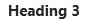
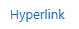
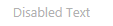
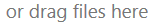
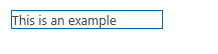
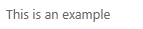
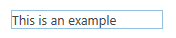
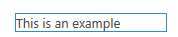
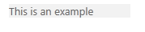

# <a name="sharepoint-add-ins-ux-design-guidelines"></a><span data-ttu-id="a467a-101">Рекомендации по проектированию пользовательского интерфейса надстроек SharePoint</span><span class="sxs-lookup"><span data-stu-id="a467a-101">SharePoint Add-ins UX design guidelines</span></span>
<span data-ttu-id="a467a-102">Ознакомьтесь с общими рекомендациями по проектированию пользовательского интерфейса для надстроек в SharePoint, включая выбор хрома, использование CSS, управление лицензиями пользователей и другие задачи проектирования.</span><span class="sxs-lookup"><span data-stu-id="a467a-102">Learn about general user experience (UX) design guidelines for add-ins in sp15allshort, including choosing the chrome, using CSS, managing user licenses, and other design tasks.</span></span>
 

 <span data-ttu-id="a467a-p101">**Примечание.** В настоящее время идет процесс замены названия "приложения для SharePoint" названием "надстройки SharePoint". Во время этого процесса в документации и пользовательском интерфейсе некоторых продуктов SharePoint и средств Visual Studio может по-прежнему использоваться термин "приложения для SharePoint". Дополнительные сведения см. в статье [Новое название приложений для Office и SharePoint](new-name-for-apps-for-sharepoint#bk_newname).</span><span class="sxs-lookup"><span data-stu-id="a467a-p101">The name "apps for SharePoint" is changing to "SharePoint Add-ins". During the transition, the documentation and the UI of some SharePoint products and Visual Studio tools might still use the term "apps for SharePoint". For details, see [New name for apps for Office and SharePoint](new-name-for-apps-for-sharepoint#bk_newname).</span></span>
 

<span data-ttu-id="a467a-p102">Надстройки — это новая концепция в SharePoint, позволяющая конечным пользователям добавлять новые функции на свои сайты, при этом обеспечивая надежность самого сайта SharePoint. Для создания качественный надстройки необходим не только обширный набор функций (хотя это, конечно, важно), но и внешний вид надстройки, органично вписывающийся на сайт, где она устанавливается.</span><span class="sxs-lookup"><span data-stu-id="a467a-p102">Add-ins are a new concept for sp15allshort, empowering end users to add new functionality to their sites while still ensuring reliability for the SharePoint site itself. Creating a good add-in requires not only making great functionality (although that’s obviously important), but also ensuring that the add-in looks right and fits seamlessly into the site where it’s installed.</span></span>
 

## <a name="choosing-the-chrome-for-your-add-in"></a><span data-ttu-id="a467a-108">Выбор хрома для надстройки</span><span class="sxs-lookup"><span data-stu-id="a467a-108">Choosing the chrome for your add-in</span></span>
<span data-ttu-id="a467a-109"><a name="UXGuide_AppChrome"> </a></span><span class="sxs-lookup"><span data-stu-id="a467a-109"></span></span>

<span data-ttu-id="a467a-p103">Первое, что следует определить при построении надстройки, это в какой степени вы хотите оформить ваши страницы с использованием фирменной символики и где планируете их размещать. В зависимости от выбранных вариантов станет довольно очевидной технология, которую следует использовать для поддержки вашего хрома.</span><span class="sxs-lookup"><span data-stu-id="a467a-p103">The first thing you have to determine when you are building an add-in is how much or how little you want to brand your pages and where you want them to be hosted. Depending on those choices, which technology you use to power your chrome will be relatively obvious:</span></span>
 

 

-  <span data-ttu-id="a467a-112">**ASPX-страницы, размещенные в SharePoint:** используйте шаблон приложения.</span><span class="sxs-lookup"><span data-stu-id="a467a-112">**ASPX pages hosted in SharePoint:** Use the add-in template.</span></span>
    
 
-  <span data-ttu-id="a467a-113">**HTML-страницы, размещенные в SharePoint, или любые страницы вне SharePoint:** используйте элемент управления хрома.</span><span class="sxs-lookup"><span data-stu-id="a467a-113">**HTML pages hosted in SharePoint or any pages outside SharePoint:** Use the chrome control.</span></span>
    
 
-  <span data-ttu-id="a467a-114">**Специальные страницы с фирменной символикой:** используйте собственный хром.</span><span class="sxs-lookup"><span data-stu-id="a467a-114">**Custom branded pages:** Use your own chrome.</span></span>
    
 

### <a name="using-the-add-in-template-for-sharepoint-hosted-pages"></a><span data-ttu-id="a467a-115">Использование шаблона надстройки для страниц, размещенных в SharePoint</span><span class="sxs-lookup"><span data-stu-id="a467a-115">Using the add-in template for SharePoint-hosted pages</span></span>
<span data-ttu-id="a467a-116"><a name="UXGuide_AppTemplate"> </a></span><span class="sxs-lookup"><span data-stu-id="a467a-116"></span></span>

<span data-ttu-id="a467a-p104">Шаблон надстройки можно использовать только для страниц ASPX, размещенных в SharePoint. Этот шаблон включает эталонную страницу **app.master** (содержащую подходящий для надстройки хром и оформленную в соответствии с темой хост-сайта) и скрывает некоторые функции SharePoint, которые либо не будут работать, либо не имеют отношения к сайту надстройки. На рис. 1 показана страница, размещенная в SharePoint и использующая шаблон надстройки.</span><span class="sxs-lookup"><span data-stu-id="a467a-p104">The add-in template can be used only for SharePoint-hosted ASPX pages. The template includes the **app.master** master page (which contains chrome appropriate for an add-in and is designed to theme with the host site), and it hides some SharePoint functionality that either wouldn't work or doesn't make sense inside of an add-in web. Figure 1 shows a SharePoint-hosted page that uses the add-in template.</span></span>
 

 

<span data-ttu-id="a467a-120">**Рис. 1. Страница, размещенная в SharePoint и использующая шаблон надстройки**</span><span class="sxs-lookup"><span data-stu-id="a467a-120">**Figure 1. SharePoint-hosted page using the add-in template**</span></span>

 

 

 
<span data-ttu-id="a467a-122">Шаблон надстройки используется в Visual Studio по умолчанию при создании сайта надстройки и страниц этого сайта.</span><span class="sxs-lookup"><span data-stu-id="a467a-122">The add-in template is the default in Visual Studio when you create an add-in web and pages within that web.</span></span>
 

 

### <a name="using-the-chrome-control-in-sharepoint-add-ins"></a><span data-ttu-id="a467a-123">Использование элемента управления хрома в надстройках SharePoint</span><span class="sxs-lookup"><span data-stu-id="a467a-123">Using the chrome control in SharePoint Add-ins</span></span>
<span data-ttu-id="a467a-124"><a name="UXGuide_ChromeControl"> </a></span><span class="sxs-lookup"><span data-stu-id="a467a-124"></span></span>

<span data-ttu-id="a467a-p105">Если вы не создаете размещенные в SharePoint страницы ASPX, но хотите, чтобы ваша надстройка естественно вписывалась в хост-сайт, на котором она будет использоваться, то правильным выбором будет элемент управления хрома. На рисунке 2 показан элемент управления хрома.</span><span class="sxs-lookup"><span data-stu-id="a467a-p105">If you're not building SharePoint-hosted ASPX pages, but you still want your add-in to fit in naturally with the host site that it is used from, the chrome control is the right choice. Figure 2 shows the chrome control.</span></span>
 

 

<span data-ttu-id="a467a-127">**Рис. 2. Элемент управления хрома на веб-странице**</span><span class="sxs-lookup"><span data-stu-id="a467a-127">**Figure 2. Chrome control in a webpage**</span></span>

 

 

 

 

 

<span data-ttu-id="a467a-129">**Смотреть видео "Элемент управления хрома SharePoint"**</span><span class="sxs-lookup"><span data-stu-id="a467a-129">**Watch the video: SharePoint chrome control**</span></span>

 

 

 

 

 

 

 

### <a name="to-use-the-chrome-control"></a><span data-ttu-id="a467a-131">Использование элемента управления хрома</span><span class="sxs-lookup"><span data-stu-id="a467a-131">To use the chrome control</span></span>


1. <span data-ttu-id="a467a-p106">Добавьте ссылку в библиотеку элементов управления. Это можно сделать двумя способами.</span><span class="sxs-lookup"><span data-stu-id="a467a-p106">Add a reference to the controls library. There are two ways to do this:</span></span>
    
      - <span data-ttu-id="a467a-134">Поместите указатель в библиотеку в корне папки макетов, как показано в следующем примере.</span><span class="sxs-lookup"><span data-stu-id="a467a-134">Point to the library at the root of the layouts folder, as shown in the following example.</span></span>
    
```
  <script 
    type="text/javascript" 
    src="http://{server URL}/_layouts/15/sp.ui.controls.js">
</script>
```

  - <span data-ttu-id="a467a-135">Скопируйте библиотеку на свой веб-сайт и ссылайтесь на нее с этого веб-сайта.</span><span class="sxs-lookup"><span data-stu-id="a467a-135">Copy the library to your own website, and reference it from there.</span></span>
    
     <span data-ttu-id="a467a-136">**Внимание!** При выборе этого варианта для вашей надстройки не будут доступны обновления этого элемента управления.</span><span class="sxs-lookup"><span data-stu-id="a467a-136">**Caution** If you opt for this alternative your add-in will not benefit from updates to the control.</span></span>
2. <span data-ttu-id="a467a-137">Добавьте замещающий элемент DOM в то место, где будет отображаться элемент управления, как показано в этом примере.</span><span class="sxs-lookup"><span data-stu-id="a467a-137">Add the placeholder DOM element where the control will be rendered, as shown in this example.</span></span>
    
```
  <div id='chromeControlContainer'></div>
```

3. <span data-ttu-id="a467a-138">Создайте экземпляр элемента управления.</span><span class="sxs-lookup"><span data-stu-id="a467a-138">Instantiate the control.</span></span>
    
```
  function addchromecontrol(){
    var options = {};
    options.siteTitle ="{host site title}";
    options.siteUrl = "{host URL}";
    options.appHelpPageUrl = "{help page URL}";
    options.appIconUrl = "{app icon URL}";
    options.appTitle = "add-in Title";
    nav = new SP.UI.Controls.Navigation("chromeControlContainer", options);
    nav.setVisible(true);
}
```

4. <span data-ttu-id="a467a-139">(Необязательно) Если на странице не нужна область заголовка, ее можно удалить с помощью приведенного ниже кода JavaScript.</span><span class="sxs-lookup"><span data-stu-id="a467a-139">(Optional) If you don't want to have the title area on your page, you can remove it by running the following JavaScript code.</span></span>
    
```
  nav.setBottomHeaderVisible(false);
```

<span data-ttu-id="a467a-p107">Элемент управления хрома предоставляет два дополнительных значка надстройки (на верхней панели навигации и в области заголовка). Размер значка надстройки в верхней области навигации: 24 x 24 пикселя (пкс), размер же второго значка такой же, как и у значков на веб-сайте SharePoint (до 64 пкс в высоту и до 180 пкс в ширину). Рекомендуем использовать изображение PNG, протестированное на белом, черном, сером, ярком и приглушенном фонах, так как пользователи и администраторы могут изменить тему веб-сайта. Дополнительные сведения об использовании элемента управления хрома см. в статье  [Использование клиентского элемента управления хрома в надстройках для SharePoint](use-the-client-chrome-control-in-sharepoint-add-ins).</span><span class="sxs-lookup"><span data-stu-id="a467a-p107">The chrome control provides for two optional add-in icons: one on the top navigation bar and one in the title area. The add-in icon on the top navigation bar is 24 x 24 pixels (px), and the icon in the title area is the same size as SharePoint site icons—up to 64 px high by up to 180 px long. We recommend you use a PNG image that you have tested on white, black, gray, bright, and muted backgrounds because users and admins can change the site theme. For more information about using the chrome control, see  [Use the client chrome control in SharePoint Add-ins](use-the-client-chrome-control-in-sharepoint-add-ins).</span></span>
 

 

### <a name="creating-a-custom-branded-ui-in-sharepoint-add-ins"></a><span data-ttu-id="a467a-144">Создание пользовательского интерфейса с фирменной символикой в надстройках SharePoint</span><span class="sxs-lookup"><span data-stu-id="a467a-144">Creating a custom branded UI in SharePoint Add-ins</span></span>
<span data-ttu-id="a467a-145"><a name="UXGuide_CustomUI"> </a></span><span class="sxs-lookup"><span data-stu-id="a467a-145"></span></span>

<span data-ttu-id="a467a-p108">Если вместо согласования с темой сайта и встраивания в сайт SharePoint, на котором устанавливается надстройка, в этой надстройке планируется использовать собственную фирменную символику, придется создать собственный хром с нуля. Однако в верхнем левом (или в верхнем правом для языков с написанием справа налево) углу страницы по-прежнему будет находиться ссылка "назад к сайту", возвращающая пользователя на сайт, на котором установлена надстройка.</span><span class="sxs-lookup"><span data-stu-id="a467a-p108">If, instead of aligning to the host site's theme and fitting into the SharePoint site where your add-in is installed, you want to use your own brand inside your add-in, you will have to build your chrome from scratch. However, you should still have a "back to site" link in the upper-left corner of the page (upper-right in right-to-left [RTL] languages) that redirects the user back to the site where the add-in is installed.</span></span>
 

 

## <a name="using-the-host-web-css-in-sharepoint-add-ins"></a><span data-ttu-id="a467a-148">Использование CSS хост-сайта в надстройках SharePoint</span><span class="sxs-lookup"><span data-stu-id="a467a-148">Using the host web CSS in SharePoint Add-ins</span></span>
<span data-ttu-id="a467a-149"><a name="UXGuide_CSS"> </a></span><span class="sxs-lookup"><span data-stu-id="a467a-149"></span></span>

<span data-ttu-id="a467a-p109">Применяя те же стили, которые используются на хост-сайте, можно обеспечить соответствие ваших надстроек сайту SharePoint, с которого они вызываются. Фактические стили могут изменяться в зависимости от конструкции сайта, но ссылаясь на файл CSS хост-сайта, можно быть уверенным, что надстройка будет соответствовать хост-сайту, независимо от того, где она установлена.</span><span class="sxs-lookup"><span data-stu-id="a467a-p109">By using the same styles that are used on the host web, you can ensure that your add-ins will remain consistent with the SharePoint site that they came from. The actual styles may change based on the design of the site, but by referencing the CSS file of the host web, you will know that your add-in will fit in no matter where it's installed.</span></span>
 

 
<span data-ttu-id="a467a-p110">Чтобы получать стили CSS с хост-сайта, необходимо сослаться на его файл CSS. Это можно сделать несколькими разными способами.</span><span class="sxs-lookup"><span data-stu-id="a467a-p110">To get the CSS styles from the host web, you have to reference its CSS file. You can do this in several different ways.</span></span>
 

 

### <a name="to-reference-the-host-webs-css-file"></a><span data-ttu-id="a467a-154">Ссылка на файл CSS хост-сайта</span><span class="sxs-lookup"><span data-stu-id="a467a-154">To reference the host web's CSS file</span></span>


1. <span data-ttu-id="a467a-155">Если вы используете шаблон надстройки или элемент управления хрома для нее, это выполняется автоматически.</span><span class="sxs-lookup"><span data-stu-id="a467a-155">If you're using the add-in template or add-in chrome control, this is automatically taken care of for you.</span></span>
    
 
2. <span data-ttu-id="a467a-156">На сайте надстройки можно ссылаться на файл CSS с помощью элементов управления **CssRegistration** и **CssLink**, добавив следующий код в эталонную страницу или страницу ASPX:</span><span class="sxs-lookup"><span data-stu-id="a467a-156">If you're inside the add-in web, you can use the **CssRegistration** and **CssLink** controls to reference the CSS file by putting the following code on either your master page or ASPX page:</span></span>
    
```HTML
  <SharePoint:CssRegistration runat="server" name="default" />
<SharePoint:CssLink runat="server />

```

3. <span data-ttu-id="a467a-157">Для ссылки на файл CSS можно использовать элемент <link>, построив URL-адрес из URL-адреса хост-сайта, как показано в следующем примере.</span><span class="sxs-lookup"><span data-stu-id="a467a-157">You can use a <link> element to reference the CSS file by building a URL off of the host web's URL, as shown in this example.</span></span>
    
```HTML
  <link rel="stylesheet" href="{host web URL}/_layouts/15/defaultcss.ashx" />
```


    If you use this approach, you have to run JavaScript in the page to get the host web's URL off the query string. Then you can insert the host web's URL into the  **link** element before you write the element to the page's DOM.
    
 
<span data-ttu-id="a467a-p111">При определении стиля надстройки в первую очередь следует по мере возможности применять семантический код HTML. Это означает использование тегов **H1**, **H2**, **H3** и т. п. для разных заголовков и теги входных данных для кнопок. Кроме того, постарайтесь как можно больше использовать основные стили SharePoint, чтобы при изменении темы хост-сайта надстройки автоматически и органично подстраивались под эти изменения. В приведенной ниже таблице показано использование стилей в теме по умолчанию.</span><span class="sxs-lookup"><span data-stu-id="a467a-p111">The first thing to do when you are styling your add-in is to use semantic HTML as much as possible. That means using **H1**, **H2**, **H3**, and so on, for the various headings, and input tags for buttons. You should also try to use SharePoint core styles as much as possible so that when the theme of the host site changes, your add-in picks up those changes seamlessly and automatically. The following tables show how styles are used in the default theme.</span></span>
 

 

<span data-ttu-id="a467a-162">**Таблица 1. Стили основного текста**</span><span class="sxs-lookup"><span data-stu-id="a467a-162">**Table 1. Body text styles**</span></span>


|<span data-ttu-id="a467a-163">**Пример**</span><span class="sxs-lookup"><span data-stu-id="a467a-163">**Example**</span></span>|<span data-ttu-id="a467a-164">**Область применения**</span><span class="sxs-lookup"><span data-stu-id="a467a-164">**Used for**</span></span>|<span data-ttu-id="a467a-165">**Стиль**</span><span class="sxs-lookup"><span data-stu-id="a467a-165">**Style**</span></span>|
|:-----|:-----|:-----|
||<span data-ttu-id="a467a-167">Очень большой блок основного текста</span><span class="sxs-lookup"><span data-stu-id="a467a-167">Extra large body text</span></span>|<span data-ttu-id="a467a-168">.ms-textXLarge</span><span class="sxs-lookup"><span data-stu-id="a467a-168">.ms-textXLarge</span></span>|
||<span data-ttu-id="a467a-170">Большой блок основного текста</span><span class="sxs-lookup"><span data-stu-id="a467a-170">Large body text</span></span>|<span data-ttu-id="a467a-171">.ms-textLarge</span><span class="sxs-lookup"><span data-stu-id="a467a-171">ms-textlarge</span></span>|
||<span data-ttu-id="a467a-173">Средний блок основного текста</span><span class="sxs-lookup"><span data-stu-id="a467a-173">Normal body text</span></span>|<span data-ttu-id="a467a-174">Наследуется автоматически</span><span class="sxs-lookup"><span data-stu-id="a467a-174">Inherited automatically</span></span>|
||<span data-ttu-id="a467a-176">Небольшой блок основного текста</span><span class="sxs-lookup"><span data-stu-id="a467a-176">Small body text</span></span>|<span data-ttu-id="a467a-177">.ms-textSmall</span><span class="sxs-lookup"><span data-stu-id="a467a-177">ms-textsmall</span></span>|
||<span data-ttu-id="a467a-179">Текст метаданных</span><span class="sxs-lookup"><span data-stu-id="a467a-179">Metadata text</span></span>|<span data-ttu-id="a467a-180">.ms-metadata</span><span class="sxs-lookup"><span data-stu-id="a467a-180">ms-metadata</span></span>|

<span data-ttu-id="a467a-181">**Таблица 2. Стили названий и заголовков**</span><span class="sxs-lookup"><span data-stu-id="a467a-181">**Table 2. Title and header styles**</span></span>


|<span data-ttu-id="a467a-182">**Пример**</span><span class="sxs-lookup"><span data-stu-id="a467a-182">**Example**</span></span>|<span data-ttu-id="a467a-183">**Область применения**</span><span class="sxs-lookup"><span data-stu-id="a467a-183">**Used for**</span></span>|<span data-ttu-id="a467a-184">**Стиль**</span><span class="sxs-lookup"><span data-stu-id="a467a-184">**Style**</span></span>|
|:-----|:-----|:-----|
||<span data-ttu-id="a467a-186">Основной заголовок страницы</span><span class="sxs-lookup"><span data-stu-id="a467a-186">Main title on the page</span></span>|<span data-ttu-id="a467a-187">.ms-core-pageTitle</span><span class="sxs-lookup"><span data-stu-id="a467a-187">ms-core-pagetitle</span></span>|
||<span data-ttu-id="a467a-p112">Заголовки для диалоговых окон, форм, блогов и записей обсуждения. Это альтернативный "основной" заголовок для особых типов содержимого или надстроек, занимающих целую страницу, которые требуется сделать отличными от обычных вики-страниц или страниц веб-частей.</span><span class="sxs-lookup"><span data-stu-id="a467a-p112">Title for dialog boxes, forms, blogs, and discussion posts. It's an alternative "primary" title for special content types or add-ins that take up the entire pagethat you want to be different from a regular wiki or Web Parts page.</span></span>|<span data-ttu-id="a467a-191">H1</span><span class="sxs-lookup"><span data-stu-id="a467a-191">H1</span></span>|
||<span data-ttu-id="a467a-p113">Подзаголовок по отношению к H1. Например, в сообществах используется H1 Accent для названия публикации и H2 Accent для лучшего "отклика" на публикацию.</span><span class="sxs-lookup"><span data-stu-id="a467a-p113">Secondary heading in relation to H1. For example, Communities uses H1 Accent for the title of a post, and H2 Accent for the best "response" to the post.</span></span>|<span data-ttu-id="a467a-195">H2</span><span class="sxs-lookup"><span data-stu-id="a467a-195">H2</span></span>|
||<span data-ttu-id="a467a-197">Обычно подзаголовок по отношению к H2.</span><span class="sxs-lookup"><span data-stu-id="a467a-197">Generally a subheading under H2.</span></span>|<span data-ttu-id="a467a-198">H3</span><span class="sxs-lookup"><span data-stu-id="a467a-198">H3</span></span>|
||<span data-ttu-id="a467a-200">Подзаголовок по отношению к H3.</span><span class="sxs-lookup"><span data-stu-id="a467a-200">Subheadings under H3.</span></span>|<span data-ttu-id="a467a-201">H4</span><span class="sxs-lookup"><span data-stu-id="a467a-201">H4</span></span>|
||<span data-ttu-id="a467a-203">Заголовок для главной или основной веб-части на странице или для основных разделов.</span><span class="sxs-lookup"><span data-stu-id="a467a-203">Title of the main/primary Web Part on a page, or for main section headers.</span></span>|<span data-ttu-id="a467a-204">.ms-webpart-titleText</span><span class="sxs-lookup"><span data-stu-id="a467a-204">ms-webpart-titletext</span></span>|
||<span data-ttu-id="a467a-206">Заголовки в диалоговых окнах или выносках.</span><span class="sxs-lookup"><span data-stu-id="a467a-206">Title for headings within dialog boxes or callouts.</span></span>|<span data-ttu-id="a467a-207">.ms-dlg-heading</span><span class="sxs-lookup"><span data-stu-id="a467a-207">ms-dlg-heading</span></span>|

<span data-ttu-id="a467a-208">**Таблица 3. Стили навигации**</span><span class="sxs-lookup"><span data-stu-id="a467a-208">**Table 3. Navigation styles**</span></span>


|<span data-ttu-id="a467a-209">**Пример**</span><span class="sxs-lookup"><span data-stu-id="a467a-209">**Example**</span></span>|<span data-ttu-id="a467a-210">**Область применения**</span><span class="sxs-lookup"><span data-stu-id="a467a-210">**Used for**</span></span>|<span data-ttu-id="a467a-211">**Стиль**</span><span class="sxs-lookup"><span data-stu-id="a467a-211">**Style**</span></span>|
|:-----|:-----|:-----|
||<span data-ttu-id="a467a-213">Заголовок левой панели навигации.</span><span class="sxs-lookup"><span data-stu-id="a467a-213">Heading of the left navigation bar.</span></span>|<span data-ttu-id="a467a-214">.ms-core-listMenu-verticalBox > .ms-core-listMenu-root > li > .ms-core-listMenu-item</span><span class="sxs-lookup"><span data-stu-id="a467a-214">.ms-core-listMenu-verticalBox > .ms-core-listMenu-root > li > .ms-core-listMenu-item</span></span>|
||<span data-ttu-id="a467a-216">Ссылка в левой панели навигации.</span><span class="sxs-lookup"><span data-stu-id="a467a-216">Link in the left navigation bar.</span></span>|<span data-ttu-id="a467a-217">.ms-core-listMenu-verticalBox</span><span class="sxs-lookup"><span data-stu-id="a467a-217">.ms-core-listMenu-verticalBox</span></span>|
||<span data-ttu-id="a467a-219">Выбранный элемент в левой панели навигации.</span><span class="sxs-lookup"><span data-stu-id="a467a-219">Selected item in the left navigation bar.</span></span>|<span data-ttu-id="a467a-220">.ms-core-listMenu-verticalBox + .ms-accentText</span><span class="sxs-lookup"><span data-stu-id="a467a-220">.ms-core-listMenu-verticalBox + .ms-accentText</span></span>|
||<span data-ttu-id="a467a-222">Элемент в верхней панели навигации.</span><span class="sxs-lookup"><span data-stu-id="a467a-222">Item in the top navigation bar.</span></span>||
||<span data-ttu-id="a467a-224">Выбранный элемент в верхней панели навигации.</span><span class="sxs-lookup"><span data-stu-id="a467a-224">Selected item in the top navigation bar.</span></span>||

<span data-ttu-id="a467a-225">**Таблица 4. Стили команд**</span><span class="sxs-lookup"><span data-stu-id="a467a-225">**Table 4. Command styles**</span></span>


|<span data-ttu-id="a467a-226">**Пример**</span><span class="sxs-lookup"><span data-stu-id="a467a-226">**Example**</span></span>|<span data-ttu-id="a467a-227">**Область применения**</span><span class="sxs-lookup"><span data-stu-id="a467a-227">**Used for**</span></span>|<span data-ttu-id="a467a-228">**Стиль**</span><span class="sxs-lookup"><span data-stu-id="a467a-228">**Style**</span></span>|
|:-----|:-----|:-----|
||<span data-ttu-id="a467a-p114">Ссылки основных действий, которые, как ожидается, будут выполнять пользователи в данном контейнере или на странице. Например, этот стиль может использоваться для команд внизу выноски. Использованные и неиспользованные ссылки команд будут всегда отображаться одним и тем же цветом.</span><span class="sxs-lookup"><span data-stu-id="a467a-p114">Primary action links you expect the user to take within a given container or page. For example, this would be used to style the commands underneath a callout. This will always be the same color for visited and non-visited commands.</span></span>|<span data-ttu-id="a467a-233">.ms-commandLink</span><span class="sxs-lookup"><span data-stu-id="a467a-233">ms-commandlink</span></span>|
||<span data-ttu-id="a467a-p115">Также используется для задания стиля действий, но действий, которые являются дополнительными по отношению к контенту. Этот стиль используется для дополнительных действий, чтобы они не конкурировали с основным контентом.</span><span class="sxs-lookup"><span data-stu-id="a467a-p115">Also used to style action links, but for actions that are secondary to the content. This style is used for these secondary actions, so they don't compete with content for attention.</span></span>|<span data-ttu-id="a467a-237">.ms-secondaryCommandLink</span><span class="sxs-lookup"><span data-stu-id="a467a-237">ms-secondarycommandlink</span></span>|
||<span data-ttu-id="a467a-239">Ссылки в выноске.</span><span class="sxs-lookup"><span data-stu-id="a467a-239">Links in the callout.</span></span>|<span data-ttu-id="a467a-240">.ms-calloutLink</span><span class="sxs-lookup"><span data-stu-id="a467a-240">ms-calloutlink</span></span>|

<span data-ttu-id="a467a-241">**Таблица 5. Стили модификаторов**</span><span class="sxs-lookup"><span data-stu-id="a467a-241">**Table 5. Modifier styles**</span></span>


|<span data-ttu-id="a467a-242">**Пример**</span><span class="sxs-lookup"><span data-stu-id="a467a-242">**Example**</span></span>|<span data-ttu-id="a467a-243">**Область применения**</span><span class="sxs-lookup"><span data-stu-id="a467a-243">**Used for**</span></span>|<span data-ttu-id="a467a-244">**Стиль**</span><span class="sxs-lookup"><span data-stu-id="a467a-244">**Style**</span></span>|
|:-----|:-----|:-----|
||<span data-ttu-id="a467a-246">Вспомогательный класс, который будет предоставлять для текста цветовую тему из текущей темы.</span><span class="sxs-lookup"><span data-stu-id="a467a-246">Helper class that will provide the accent color from the current theme for text.</span></span>|<span data-ttu-id="a467a-247">.ms-accentText</span><span class="sxs-lookup"><span data-stu-id="a467a-247">ms-accenttext</span></span>|
||<span data-ttu-id="a467a-p116">Ссылки в контенте должны наследовать от стиля и поведения гиперссылок, установленного по умолчанию. В стиле гиперссылок используется цветовой эффект и эффект наведения для указания, что это ссылка, а не обычный текст.</span><span class="sxs-lookup"><span data-stu-id="a467a-p116">Links in the content should inherit from default hyperlink styling and behavior. Hyperlink styling applies a color and a hover effect to indicate that it's a link instead of normal text.</span></span>|<span data-ttu-id="a467a-251">Наследуется с помощью оператора <a>.</span><span class="sxs-lookup"><span data-stu-id="a467a-251">Inherited from using <a>.</span></span>|
||<span data-ttu-id="a467a-253">Сообщения об ошибках, которые возникают в формах.</span><span class="sxs-lookup"><span data-stu-id="a467a-253">Error messages that occur in forms.</span></span>|<span data-ttu-id="a467a-254">.ms-error</span><span class="sxs-lookup"><span data-stu-id="a467a-254">ms-error</span></span>|
||<span data-ttu-id="a467a-256">Вспомогательный класс предоставляющий смягченный серый цвет для текста, который должен быть менее выражен, чем основной текст.</span><span class="sxs-lookup"><span data-stu-id="a467a-256">Helper class that provides a softened gray for text that should be less emphasized than normal body text.</span></span>|<span data-ttu-id="a467a-257">.ms-soften</span><span class="sxs-lookup"><span data-stu-id="a467a-257">ms-soften</span></span>|
||<span data-ttu-id="a467a-259">Вспомогательный класс, предоставляющий для текста цвет "отключения", который используется для обозначения отключенных состояний.</span><span class="sxs-lookup"><span data-stu-id="a467a-259">Helper class that applies the "disabled" color to text, which is used for denoting disabled states.</span></span>|<span data-ttu-id="a467a-260">.ms-disabled</span><span class="sxs-lookup"><span data-stu-id="a467a-260">ms-disabled</span></span>|
||<span data-ttu-id="a467a-262">Вспомогательный класс, который преобразует текст в написанный прописными буквами.</span><span class="sxs-lookup"><span data-stu-id="a467a-262">Helper class that transforms the text to all caps.</span></span>|<span data-ttu-id="a467a-263">.ms-uppercase</span><span class="sxs-lookup"><span data-stu-id="a467a-263">ms-uppercase</span></span>|
||<span data-ttu-id="a467a-265">Вспомогательный класс для задания стиля текста как в формах.</span><span class="sxs-lookup"><span data-stu-id="a467a-265">Helper class to style text like forms.</span></span>|<span data-ttu-id="a467a-266">.ms-helper</span><span class="sxs-lookup"><span data-stu-id="a467a-266">ms-helper</span></span>|
||<span data-ttu-id="a467a-268">Разделитель в виде пунктирной линии, использующийся для отделения разделов в панели быстрого запуска и в меню.</span><span class="sxs-lookup"><span data-stu-id="a467a-268">Dashed line divider that is used to divide sections in the Quick Launch and in menus.</span></span>|<span data-ttu-id="a467a-269">HR</span><span class="sxs-lookup"><span data-stu-id="a467a-269">HR</span></span>|

<span data-ttu-id="a467a-270">**Таблица 6. Стили частей пользовательского интерфейса**</span><span class="sxs-lookup"><span data-stu-id="a467a-270">**Table 6. Part user interface styles**</span></span>


|<span data-ttu-id="a467a-271">**Пример**</span><span class="sxs-lookup"><span data-stu-id="a467a-271">**Example**</span></span>|<span data-ttu-id="a467a-272">**Область применения**</span><span class="sxs-lookup"><span data-stu-id="a467a-272">**Used for**</span></span>|<span data-ttu-id="a467a-273">**Стиль**</span><span class="sxs-lookup"><span data-stu-id="a467a-273">**Style**</span></span>|
|:-----|:-----|:-----|
||<span data-ttu-id="a467a-275">Основной встроенный текст вверху части.</span><span class="sxs-lookup"><span data-stu-id="a467a-275">Main inline text at the top of a part.</span></span>|<span data-ttu-id="a467a-276">.ms-textXLarge + .ms-soften</span><span class="sxs-lookup"><span data-stu-id="a467a-276">.ms-textXLarge + .ms-soften</span></span>|
||<span data-ttu-id="a467a-278">Команды в верхней строке части; чаще всего их будет одна или две на часть.</span><span class="sxs-lookup"><span data-stu-id="a467a-278">Commands in the top line of a part; at most there should be only one or two of these per part.</span></span>|<span data-ttu-id="a467a-279">.ms-heroCommandLink</span><span class="sxs-lookup"><span data-stu-id="a467a-279">ms-herocommandlink</span></span>|
||<span data-ttu-id="a467a-281">Текст, который отображается, чтобы побудить пользователя к взаимодействию с частью, когда в ней отсутствуют данные.</span><span class="sxs-lookup"><span data-stu-id="a467a-281">Text shown to entice the user to interact with the part when it doesn't contain data.</span></span>|<span data-ttu-id="a467a-282">.ms-attractMode</span><span class="sxs-lookup"><span data-stu-id="a467a-282">ms-attractmode</span></span>|
||<span data-ttu-id="a467a-284">Текст, который отображается пользователю, когда нет доступных данных.</span><span class="sxs-lookup"><span data-stu-id="a467a-284">Text shown to the user when there is no data available.</span></span>|<span data-ttu-id="a467a-285">.ms-emptyMode</span><span class="sxs-lookup"><span data-stu-id="a467a-285">ms-emptymode</span></span>|
||<span data-ttu-id="a467a-287">Элементы управления представления, такие как сводка.</span><span class="sxs-lookup"><span data-stu-id="a467a-287">View controls, such as a pivot.</span></span>|<span data-ttu-id="a467a-288">.ms-pivot-link</span><span class="sxs-lookup"><span data-stu-id="a467a-288">mspivotlink</span></span>|
||<span data-ttu-id="a467a-290">Элементы списка, являющиеся ссылками.</span><span class="sxs-lookup"><span data-stu-id="a467a-290">List items that are also links.</span></span>|<span data-ttu-id="a467a-291">.ms-listLink</span><span class="sxs-lookup"><span data-stu-id="a467a-291">ms-listlink</span></span>|

<span data-ttu-id="a467a-292">**Таблица 7. Стили границ и фона**</span><span class="sxs-lookup"><span data-stu-id="a467a-292">**Table 7. Background and border styles**</span></span>


|<span data-ttu-id="a467a-293">**Пример**</span><span class="sxs-lookup"><span data-stu-id="a467a-293">**Example**</span></span>|<span data-ttu-id="a467a-294">**Область применения**</span><span class="sxs-lookup"><span data-stu-id="a467a-294">**Used for**</span></span>|<span data-ttu-id="a467a-295">**Стиль**</span><span class="sxs-lookup"><span data-stu-id="a467a-295">**Style**</span></span>|
|:-----|:-----|:-----|
||<span data-ttu-id="a467a-297">Для определения стиля прямоугольника, который необходимо сильно выделить на странице.</span><span class="sxs-lookup"><span data-stu-id="a467a-297">To style a rectangle that should be heavily emphasized on the page.</span></span>|<span data-ttu-id="a467a-298">.ms-emphasis</span><span class="sxs-lookup"><span data-stu-id="a467a-298">ms-emphasis</span></span>|
||<span data-ttu-id="a467a-300">Граница выделенного элемента.</span><span class="sxs-lookup"><span data-stu-id="a467a-300">Border of an emphasized element.</span></span>|<span data-ttu-id="a467a-301">.ms-emphasisBorder</span><span class="sxs-lookup"><span data-stu-id="a467a-301">ms-emphasisborder</span></span>|
||<span data-ttu-id="a467a-303">Более тонкое выделение элемента.</span><span class="sxs-lookup"><span data-stu-id="a467a-303">A more subtle emphasis of an element.</span></span>|<span data-ttu-id="a467a-304">.ms-subtleEmphasis</span><span class="sxs-lookup"><span data-stu-id="a467a-304">ms-subtleemphasis</span></span>|
||<span data-ttu-id="a467a-306">Команды в элементе со стилем ms-subtleEmphasis.</span><span class="sxs-lookup"><span data-stu-id="a467a-306">Commands in an element styled with ms-subtleEmphasis.</span></span>|<span data-ttu-id="a467a-307">.ms-subtleEmphasisCommand</span><span class="sxs-lookup"><span data-stu-id="a467a-307">ms-subtleemphasiscommand</span></span>|
||<span data-ttu-id="a467a-309">Отключенная команда в элементе со стилем ms-subtleEmphasis.</span><span class="sxs-lookup"><span data-stu-id="a467a-309">Disabled command in an element styled with ms-subtleEmphasis.</span></span>|<span data-ttu-id="a467a-310">.ms-subtleEmphasisCommand-disabled</span><span class="sxs-lookup"><span data-stu-id="a467a-310">ms-subtleemphasiscommand-disabled</span></span>|
||<span data-ttu-id="a467a-312">Элементы боковой панели навигации.</span><span class="sxs-lookup"><span data-stu-id="a467a-312">Side navigation elements.</span></span>|<span data-ttu-id="a467a-313">.ms-sideNav</span><span class="sxs-lookup"><span data-stu-id="a467a-313">ms-sidenav</span></span>|
||<span data-ttu-id="a467a-315">Для выделения выбранного элемента боковой панели навигации.</span><span class="sxs-lookup"><span data-stu-id="a467a-315">To style the selected side navigation element.</span></span>|<span data-ttu-id="a467a-316">.ms-sideNav-selected</span><span class="sxs-lookup"><span data-stu-id="a467a-316">ms-sidenav-selected</span></span>|
||<span data-ttu-id="a467a-318">Для выделения элемента с помощью границы.</span><span class="sxs-lookup"><span data-stu-id="a467a-318">To emphasize an element using a border.</span></span>|<span data-ttu-id="a467a-319">.ms-lines</span><span class="sxs-lookup"><span data-stu-id="a467a-319">ms-lines</span></span>|
||<span data-ttu-id="a467a-321">Для выделения элемента с помощью тонкой границы.</span><span class="sxs-lookup"><span data-stu-id="a467a-321">To emphasize an element using a subtle border.</span></span>|<span data-ttu-id="a467a-322">.ms-subtleLines</span><span class="sxs-lookup"><span data-stu-id="a467a-322">ms-subtlelines</span></span>|
||<span data-ttu-id="a467a-324">Для выделения элемента с помощью толстой или цветной границы.</span><span class="sxs-lookup"><span data-stu-id="a467a-324">To emphasize an element using a strong or colored border.</span></span>|<span data-ttu-id="a467a-325">.ms-strongLines</span><span class="sxs-lookup"><span data-stu-id="a467a-325">ms-stronglines</span></span>|
||<span data-ttu-id="a467a-327">Для выделения отключенного элемента с помощью границы.</span><span class="sxs-lookup"><span data-stu-id="a467a-327">To emphasize a disabled element using a border.</span></span>|<span data-ttu-id="a467a-328">.ms-disabledLines</span><span class="sxs-lookup"><span data-stu-id="a467a-328">ms-disabledlines</span></span>|
||<span data-ttu-id="a467a-330">Для выделения элемента с помощью акцентированной границы.</span><span class="sxs-lookup"><span data-stu-id="a467a-330">To emphasize an element using an accent border.</span></span>|<span data-ttu-id="a467a-331">.ms-accentLines</span><span class="sxs-lookup"><span data-stu-id="a467a-331">ms-accentlines</span></span>|
||<span data-ttu-id="a467a-333">Для содержания всплывающих окон.</span><span class="sxs-lookup"><span data-stu-id="a467a-333">To contain pop-up windows.</span></span>|<span data-ttu-id="a467a-334">.ms-popupBorder</span><span class="sxs-lookup"><span data-stu-id="a467a-334">ms-popupborder</span></span>|
||<span data-ttu-id="a467a-336">Для применения перекрытия в элементе фона.</span><span class="sxs-lookup"><span data-stu-id="a467a-336">To apply an overlay on the background element.</span></span>|<span data-ttu-id="a467a-337">.ms-bgOverlay</span><span class="sxs-lookup"><span data-stu-id="a467a-337">ms-bgoverlay</span></span>|
||<span data-ttu-id="a467a-339">Для отключения фона элемента.</span><span class="sxs-lookup"><span data-stu-id="a467a-339">To make the background of an element appear disabled.</span></span>|<span data-ttu-id="a467a-340">.ms-bgDisabled</span><span class="sxs-lookup"><span data-stu-id="a467a-340">.ms-bgDisabled</span></span>|
||<span data-ttu-id="a467a-342">Для применения фонового цвета заголовка.</span><span class="sxs-lookup"><span data-stu-id="a467a-342">To apply the header background color.</span></span>|<span data-ttu-id="a467a-343">.ms-bgHeader</span><span class="sxs-lookup"><span data-stu-id="a467a-343">ms-bgheader</span></span>|
||<span data-ttu-id="a467a-345">Для применения фонового цвета нижнего колонтитула.</span><span class="sxs-lookup"><span data-stu-id="a467a-345">To apply the footer background color.</span></span>|<span data-ttu-id="a467a-346">.ms-bgFooter</span><span class="sxs-lookup"><span data-stu-id="a467a-346">ms-bgfooter</span></span>|
||<span data-ttu-id="a467a-p117">Элементы, которые должны выделяться цветом при наведении курсора мыши. В примере показан элемент, на который не наведен курсор мыши.</span><span class="sxs-lookup"><span data-stu-id="a467a-p117">Elements that should have a highlighted color on hover. The example shows the element when the mouse is not hovering over it.</span></span>|<span data-ttu-id="a467a-350">.ms-bgHoverable</span><span class="sxs-lookup"><span data-stu-id="a467a-350">.ms-bgHoverable</span></span>|
||<span data-ttu-id="a467a-p118">Элементы, которые должны выделяться цветом при наведении курсора мыши. В примере показан элемент, на который наведен курсор мыши.</span><span class="sxs-lookup"><span data-stu-id="a467a-p118">Elements that should have a highlighted color on hover. The example shows the element when the mouse is hovering over it.</span></span>|<span data-ttu-id="a467a-354">.ms-bgHoverable</span><span class="sxs-lookup"><span data-stu-id="a467a-354">.ms-bgHoverable</span></span>|
||<span data-ttu-id="a467a-356">Чтобы показать выделение в элементе.</span><span class="sxs-lookup"><span data-stu-id="a467a-356">To show selection on an element.</span></span>|<span data-ttu-id="a467a-357">.ms-bgSelected</span><span class="sxs-lookup"><span data-stu-id="a467a-357">ms-bgselected</span></span>|
||<span data-ttu-id="a467a-359">Элементы в полосе вверху страницы.</span><span class="sxs-lookup"><span data-stu-id="a467a-359">Elements in the top bar of the page.</span></span>|<span data-ttu-id="a467a-360">.ms-topBar</span><span class="sxs-lookup"><span data-stu-id="a467a-360">ms-topbar</span></span>|
<span data-ttu-id="a467a-361">Дополнительные сведения см. в статье [Использование таблицы стилей веб-сайта SharePoint в надстройках SharePoint](use-a-sharepoint-website-s-style-sheet-in-sharepoint-add-ins).</span><span class="sxs-lookup"><span data-stu-id="a467a-361">For more information, see  [Use a SharePoint website's style sheet in SharePoint Add-ins](use-a-sharepoint-website-s-style-sheet-in-sharepoint-add-ins).</span></span>
 

 

## <a name="styling-common-items-consistently-in-sharepoint-add-ins"></a><span data-ttu-id="a467a-362">Согласованный стиль общих элементов в надстройках SharePoint</span><span class="sxs-lookup"><span data-stu-id="a467a-362">Styling common items consistently in SharePoint Add-ins</span></span>
<span data-ttu-id="a467a-363"><a name="UXGuide_Styling"> </a></span><span class="sxs-lookup"><span data-stu-id="a467a-363"></span></span>

<span data-ttu-id="a467a-364">Чтобы помочь пользователям освоить навыки, применимые как в SharePoint, так и в надстройках, следует обеспечить согласованность стиля нескольких общих элементов.</span><span class="sxs-lookup"><span data-stu-id="a467a-364">To help users learn skills that translate between SharePoint and add-ins, you should style several common elements consistently.</span></span>
 

 

### <a name="internal-navigation"></a><span data-ttu-id="a467a-365">Внутренняя навигация</span><span class="sxs-lookup"><span data-stu-id="a467a-365">Internal navigation</span></span>

<span data-ttu-id="a467a-p119">Существует два главных шаблона для обеспечения навигации внутри надстройки: левая панель навигации и верхняя панель навигации. Используемый вариант зависит от содержимого в остальной части надстройки. В большинстве случаев рекомендуется выбирать левую панель навигации, в частности, для переключения между разными списками, или если надстройка в основном является иерархическим представлением. С другой стороны, если навигация в основном состоит в переключении между разными представлениями одного списка, то следует использовать верхнюю панель навигации.</span><span class="sxs-lookup"><span data-stu-id="a467a-p119">To provide navigation within your add-in, there are two main patterns to follow: left navigation and top navigation. Which option you use depends somewhat on what the content is in the rest of your add-in. In general, left navigation will be the correct choice, particularly if you're switching between different lists, or the focus of your add-in is a master-detail view. On the other hand, if your navigation mainly switches between what could be considered different views of the same list, you could choose to use top navigation instead.</span></span>
 

 
<span data-ttu-id="a467a-p120">И левая, и верхняя панели навигации имеют представления объектной модели, стиль которых будет задаваться правильно при их установке в SharePoint. Вне страниц SharePoint придется выполнить дополнительные действия, чтобы самостоятельно создать разметку для верхней или левой панели навигации, а затем добавить соответствующие классы CSS для задания правильного стиля панели навигации.</span><span class="sxs-lookup"><span data-stu-id="a467a-p120">Both left navigation and top navigation have object model representations that will be styled correctly when they are set in SharePoint. Outside of SharePoint pages, you'll have to do a bit more work to create the markup for the top or left navigation yourself, and then add the appropriate CSS classes so that it's styled correctly.</span></span>
 

 

### <a name="toolbars"></a><span data-ttu-id="a467a-372">Панели инструментов</span><span class="sxs-lookup"><span data-stu-id="a467a-372">Toolbars</span></span>

<span data-ttu-id="a467a-p121">В большинстве случаев у вас будет немного команд, которые потребуется быстро добавить для пользователя. Если на странице уже используется лента, то рекомендуется добавить эти команды в подходящие места на существующей ленте. Однако в случае, когда на странице нет ленты, скорее всего не будет смысла добавлять ее ради нескольких команд. В таком случае рекомендуется добавить панель инструментов, зависящую от контекста элемента, в котором будут применяться команды. Следует использовать глиф, текст со стилем ms-commandLink или и то, и другое для представления команд в панели инструментов, которая должна иметь тот же цвет фона, что и остальная часть страницы.</span><span class="sxs-lookup"><span data-stu-id="a467a-p121">In many cases, you will have a small number of commands that you want to surface quickly to the user. If you are using the ribbon on your page already, the best choice is to add those commands to logical locations within the existing ribbon. However, in the case where you don't already have a ribbon on the page, it probably doesn't make sense to add one for a handful of commands. In that case, we recommend that you add a toolbar contextual to the item where the commands will apply. You should use either glyph, text styled with ms-commandLink, or both, to represent your commands on the toolbar, which should have the same background color as the rest of the page.</span></span>
 

 

### <a name="lists"></a><span data-ttu-id="a467a-378">Списки</span><span class="sxs-lookup"><span data-stu-id="a467a-378">Lists</span></span>

<span data-ttu-id="a467a-p122">Списки являются распространенным способом представления данных пользователям. Если надстройка использует страницы SharePoint, то можно применять веб-часть представления списка для представления данных пользователям и получения включенного в нее стиля и взаимодействия. Однако если страницы находятся где-нибудь в другом месте, или требуется большая степень контроля над взаимодействием пользователей со списком, следует воспроизвести стили из списков в SharePoint, обеспечив собственное отображение и взаимодействие. Далее приводятся некоторые проблемы стилей, которые необходимо учитывать при использовании списков в надстройках.</span><span class="sxs-lookup"><span data-stu-id="a467a-p122">Lists are a common way to represent data to users. If your add-in is using SharePoint pages, you could use the List View Web Part to represent the data to users and get the styling and interaction that comes with it. However, if you have your pages elsewhere, or you want more control over the interaction that users have with your list, you should mimic the styling of lists in SharePoint while providing your own rendering and interaction. The following are some style issues to keep in mind when you are using lists in your add-in:</span></span>
 

 

-  <span data-ttu-id="a467a-p123">**Представления.** При отображении нескольких представлений в одном списке необходимо использовать сводку вверху списка, как это делается в обычных списках SharePoint. Никогда не следует использовать сводки в качестве способа представления иерархических данных.</span><span class="sxs-lookup"><span data-stu-id="a467a-p123">**Views:** When representing multiple views on a single list, you should use a pivot at the top of the list, just as regular SharePoint lists do. You should never use pivots as a way of representing master-detail data.</span></span>
    
 
-  <span data-ttu-id="a467a-p124">**Фильтры.** При предоставлении фильтра для существующего списка или иерархического размещения необходимо использовать боковую панель, которая находится на одном уровне с левой стороной области контента и имеет ширину не менее 300 пикселей. Следует также скопировать стили выбора SharePoint, чтобы указывать пользователю, какие фильтры или элементы выбраны.</span><span class="sxs-lookup"><span data-stu-id="a467a-p124">**Filters:** When providing a filter on an existing list or a master-detail arrangement, you should use a sidebar that is flush with the left side of the content area and that is at least 300-pixels wide. You should also copy the SharePoint selection styling to indicate to the user which filters or items are selected.</span></span>
    
 
-  <span data-ttu-id="a467a-387">**Формы.** Когда пользователь просматривает или изменяет один элемент, необходимо использовать встроенные формы SharePoint либо копировать их стиль, чтобы обеспечить последовательность взаимодействия.</span><span class="sxs-lookup"><span data-stu-id="a467a-387">**Forms:** When a user is viewing or editing a single item, you should either use the built-in SharePoint forms or mimic their styling for a consistent experience.</span></span>
    
 

### <a name="forms-dialog-boxes-and-callouts"></a><span data-ttu-id="a467a-388">Формы, диалоговые окна и выноски</span><span class="sxs-lookup"><span data-stu-id="a467a-388">Forms, dialog boxes, and callouts</span></span>

<span data-ttu-id="a467a-p125">Существует три разных шаблона предоставления пользователям дополнительной информации об объекте или пользовательского интерфейса для ввода: формы на всю страницу, диалоговые окна и выноски. Выбор используемого шаблона зависит от намерений пользователя и объема сведений, которые будут отображаться или запрашиваться.</span><span class="sxs-lookup"><span data-stu-id="a467a-p125">There are three distinct patterns for providing the user with more information about an object, or for providing a user interface (UI) for user input: full-page forms, dialog boxes, and callouts. Whichever one you use depends on the user intent and how much information will be shown or requested.</span></span>
 

 

-  <span data-ttu-id="a467a-p126">**Полностраничные формы.** Это лучший вариант, когда требуется, чтобы пользователи вводили несколько разных частей информации, или когда требуется показывать им большой объем структурированной информации за один раз. Полностраничные формы также имеет смысл использовать, когда требуются более сложные модели взаимодействия, такие как ленты. В таком случае при необходимости можно направлять пользователя на страницу формы. Необходимо убедиться, что существует четкий путь для сохранения или отмены изменений пользователя с помощью кнопок или ленты. В очень длинных формах, для которых может потребоваться прокрутка, рекомендуется помещать элементы **Сохранить** и **Отмена** как вверху, так и внизу формы.</span><span class="sxs-lookup"><span data-stu-id="a467a-p126">**Full-page forms:** This is the best choice when you want users to enter several different pieces of information, or you want to show them a lot of structured information at one time. Full-page forms also make the most sense in scenarios where more complex interaction models, such as the ribbon, are required. In this case, you would point the user to the form page when necessary. You should make sure that there is a clear way to save or cancel their changes, by using either buttons or the ribbon. In very long forms that might require scrolling, it's a good idea to place the **Save** and **Cancel** options at both the top and bottom of the form.</span></span>
    
 
-  <span data-ttu-id="a467a-p127">**Диалоговые окна.** Это модальные контейнеры пользовательского интерфейса, которые обычно используются для контекстного отображения дополнительных сведений или действий. Они также используются для более коротких форм или для пользовательского ввода. В целом, пользовательский интерфейс в диалоговых окнах должен быть простым и хорошо подходящим для небольшой поверхности отображения. Более длинные формы и более сложные модели взаимодействия, такие как ленты, лучше обслуживаются в полностраничных формах.</span><span class="sxs-lookup"><span data-stu-id="a467a-p127">**Dialog boxes:** These are modal UI containers that are typically used to show more information or actions in a contextual manner. They are also used for shorter forms or user input. In general, the UI that is hosted within a dialog box should be simple and well suited for a smaller rendering surface. Longer forms or more complex interaction models, such as the ribbon, are better served by full-page forms instead.</span></span>
    
 
-  <span data-ttu-id="a467a-p128">**Выноски.** Выноски предоставляют соответствующую контекстную информацию и действия по конкретному объекту. Обычно выноски используются для предоставления пользователю дополнительных сведений или действий для элемента в упрощенном пользовательском интерфейсе. Если требуются полосы прокрутки или ввод пользователей, то использование выноски не рекомендуется.</span><span class="sxs-lookup"><span data-stu-id="a467a-p128">**Callouts:** These provide relevant contextual information and actions around a particular item. Callouts are generally used to show the user more information or actions about an item in a lightweight UI. If scrollbars or user input are necessary, the callout is probably not a good choice.</span></span>
    
 

### <a name="animation"></a><span data-ttu-id="a467a-403">Анимация</span><span class="sxs-lookup"><span data-stu-id="a467a-403">Animation</span></span>

<span data-ttu-id="a467a-p129">Хотя анимация может дать более яркое и интересное взаимодействие, применять ее следует с осторожностью и не злоупотреблять анимацией в пользовательском интерфейсе. Хорошо сделанная анимация будет не слишком бросаться в глаза, но создаст впечатление более быстрого и эффективного пользовательского интерфейса. При использовании анимации необходимо учитывать физические свойства и инерцию, чтобы предоставлять пользовательский интерфейс, выглядящий естественным и изящным. Мы настоятельно не рекомендуем использовать гипертрофированную анимацию, например, чрезмерные подпрыгивания или деформации, или заставлять объекты летать по экрану при малейшем действии пользователя. Как правило, объекты должны прямо двигаться к своему назначению, и часто достаточно анимировать первые или последние 10 процентов фактического изменения, чтобы показать пользователю, что он перемещается.</span><span class="sxs-lookup"><span data-stu-id="a467a-p129">Although animation can lead to a more vibrant and engaging experience, you should be careful to not overuse it in your UI. Animation that is done well will be hardly noticeable by the user, but it will give the impression of faster, better-performing UI. When using animation, you should make sure to respect concepts like physics and inertia and provide UI that seems natural and graceful. We strongly recommend against exaggerated animations like excessive bouncing or elasticity, or having objects fly around the screen at the slightest user action. Objects should generally take a direct path to their destination, and often will only need the first or last 10 percent of the actual change to be animated in order to give the user the sense that it has moved.</span></span>
 

 

### <a name="tabs-and-pivots"></a><span data-ttu-id="a467a-409">Вкладки и сводки</span><span class="sxs-lookup"><span data-stu-id="a467a-409">Tabs and pivots</span></span>

<span data-ttu-id="a467a-p130">В SharePoint вкладки следует использовать только на ленте. Во всех остальных областях SharePoint для выражения концепции изменений области контента необходимо использовать сводки.</span><span class="sxs-lookup"><span data-stu-id="a467a-p130">In SharePoint, the only place where you should use tabs is on the ribbon. Everywhere else in SharePoint should use pivots to express the concept of changing the content area.</span></span>
 

 

## <a name="office-ui-fabric-with-sharepoint-add-ins-faq"></a><span data-ttu-id="a467a-412">Office UI Fabric с надстройками SharePoint: вопросы и ответы</span><span class="sxs-lookup"><span data-stu-id="a467a-412">Office UI Fabric with SharePoint Add-ins FAQ</span></span>
<span data-ttu-id="a467a-413"><a name="Fabric"> </a></span><span class="sxs-lookup"><span data-stu-id="a467a-413"></span></span>

<span data-ttu-id="a467a-414">Ознакомьтесь с ответами, чтобы понять, как использовать структуру пользовательского интерфейса Office и придать надстройке SharePoint внешний вид, характерный Office 365.</span><span class="sxs-lookup"><span data-stu-id="a467a-414">Use this FAQ to understand how to use Office UI Fabric and make your SharePoint Add-in look and feel like the rest of the Office 365.</span></span>
 

 
 <span data-ttu-id="a467a-415">**1. Что такое Office UI Fabric?**</span><span class="sxs-lookup"><span data-stu-id="a467a-415">**1. What is Office UI Fabric?**</span></span>
 

 
<span data-ttu-id="a467a-p131">Структура пользовательского интерфейса Office это гибкая, ориентированная на мобильные устройства платформа, позволяющая создавать веб-интерфейс с помощью языка дизайна Office. Она поставляется с набором шрифтов и классами CSS, которые содержат компоненты пользовательского интерфейса, значки, анимацию и официальную цветовую палитру Office. Дополнительные сведения см. в разделе  [Структура пользовательского интерфейса Office](https://github.com/OfficeDev/Office-UI-Fabric).</span><span class="sxs-lookup"><span data-stu-id="a467a-p131">Office UI Fabric is a responsive, mobile-first, front-end framework that enables you to create web experiences by using the Office Design Language. It is implemented with a set of fonts and with CSS classes that provide UI components, icons, animation, and the official Office color palette. For details, see  [Office UI Fabric](https://github.com/OfficeDev/Office-UI-Fabric).</span></span>
 

 
 <span data-ttu-id="a467a-419">**2. Можно ли использовать Office UI Fabric в надстройках SharePoint?**</span><span class="sxs-lookup"><span data-stu-id="a467a-419">**2. Can I use Office UI Fabric in my SharePoint Add-ins?**</span></span>
 

 
<span data-ttu-id="a467a-p132">Да. Страницы надстроек могут ссылаться на файлы Office UI Fabric так же, как и на другие платформы CSS, например bootstrap.</span><span class="sxs-lookup"><span data-stu-id="a467a-p132">Yes. Your add-in pages can reference the Office UI Fabric files in the same way that other CSS frameworks, like bootstrap, are referenced.</span></span>
 

 
 <span data-ttu-id="a467a-422">**3. В каких случаях следует использовать Office UI Fabric с надстройками SharePoint?**</span><span class="sxs-lookup"><span data-stu-id="a467a-422">**3. When should I use Office UI Fabric with SharePoint Add-ins?**</span></span>
 

 
<span data-ttu-id="a467a-p133">Используйте ее, когда хотите, чтобы надстройка имела внешний вид, характерный Office 365. Ее можно использовать вместо файла CSS хост-сайта SharePoint.</span><span class="sxs-lookup"><span data-stu-id="a467a-p133">Use it when you want your add-in to have the look and feel of Office 365. It is an alternative to using the CSS file of the SharePoint host web.</span></span>
 

 
 <span data-ttu-id="a467a-425">**4. Как можно использовать Office UI Fabric в надстройках SharePoint?**</span><span class="sxs-lookup"><span data-stu-id="a467a-425">**4. How can Office UI Fabric be used in SharePoint Add-ins?**</span></span>
 

 
<span data-ttu-id="a467a-p134">Просто добавьте файлы структуры пользовательского интерфейса Office в проект разработки и добавьте ссылку на библиотеку fabric.css library на страницу HTML или ASPX. Дополнительные сведения см. в разделе  [Приступая к работе](https://github.com/OfficeDev/Office-UI-Fabric#get-started).</span><span class="sxs-lookup"><span data-stu-id="a467a-p134">Just add the Office UI Fabric files to your development project, and include a reference to the fabric.css library to your HTML or ASPX page. For details, see  [Getting started](https://github.com/OfficeDev/Office-UI-Fabric#get-started).</span></span>
 

 
 <span data-ttu-id="a467a-428">**5. Как можно использовать компоненты Office UI Fabric в надстройках SharePoint?**</span><span class="sxs-lookup"><span data-stu-id="a467a-428">**5. How can Office UI Fabric Components be used in SharePoint Add-ins?**</span></span>
 

 
<span data-ttu-id="a467a-p135">Просто добавьте ссылку на библиотеку fabric.components.css на страницу HTML или ASPX. Дополнительные сведения см. на странице [Начало работы](https://github.com/OfficeDev/Office-UI-Fabric/blob/master/ghdocs/GETTINGSTARTED).</span><span class="sxs-lookup"><span data-stu-id="a467a-p135">Just add a reference to the fabric.components.css library to your HTML or ASPX page. For details, see  [Getting started](https://github.com/OfficeDev/Office-UI-Fabric/blob/master/ghdocs/GETTINGSTARTED).</span></span>
 

 
 <span data-ttu-id="a467a-431">**6. Можно ли использовать Office UI Fabric с CSS хост-сайта надстройки SharePoint?**</span><span class="sxs-lookup"><span data-stu-id="a467a-431">**6. Can I use Office UI Fabric along with a SharePoint Add-in's host web CSS?**</span></span>
 

 
<span data-ttu-id="a467a-p136">В настоящее время не рекомендуется совмещать Office UI Fabric с CSS хост-сайта. Это позволит избежать конфликтов имен классов и несовпадения стилей.</span><span class="sxs-lookup"><span data-stu-id="a467a-p136">Currently, we recommend against mixing Office UI Fabric with host web CSS. This is to prevent class name collisions and style mismatches.</span></span>
 

 
 <span data-ttu-id="a467a-434">**7. Поддерживает ли Office UI Fabric темы SharePoint?**</span><span class="sxs-lookup"><span data-stu-id="a467a-434">**7. Does Office UI Fabric support SharePoint themes?**</span></span>
 

 
<span data-ttu-id="a467a-p137">Нет. Office UI Fabric не поддерживает темы SharePoint. Однако примененные темы Office UI Fabric не будут конфликтовать с темами SharePoint.</span><span class="sxs-lookup"><span data-stu-id="a467a-p137">No. Office UI Fabric does not support SharePoint themes. However, applying Office UI Fabric theming will not conflict with SharePoint themes.</span></span>
 

 

## <a name="extending-sharepoint-ui-in-add-ins"></a><span data-ttu-id="a467a-438">Расширение пользовательского интерфейса SharePoint в надстройках</span><span class="sxs-lookup"><span data-stu-id="a467a-438">Extending SharePoint UI in add-ins</span></span>
<span data-ttu-id="a467a-439"><a name="UXGuide_Extending"> </a></span><span class="sxs-lookup"><span data-stu-id="a467a-439"></span></span>

<span data-ttu-id="a467a-p138">SharePoint позволяет расширять некоторые из существующих пользовательских интерфейсов в надстройках, что дает возможность сделать надстройки доступными в тех местах, где они могут потребоваться пользователям. Для расширения пользовательского интерфейса хост-сайта можно использовать следующие методы.</span><span class="sxs-lookup"><span data-stu-id="a467a-p138">SharePoint allows add-ins to extend some of the existing UI, which enables you to make your add-in available in the places where users might need it. You can extend the host web's UI by using the following methods:</span></span>
 

 

-  <span data-ttu-id="a467a-442">**Веб-части надстроек.** Позволяют отображать элемент **iframe** с содержимым из надстройки.</span><span class="sxs-lookup"><span data-stu-id="a467a-442">**Add-in parts:** Enable you to surface an **iframe** element to contain content from your add-in.</span></span>
    
 
-  <span data-ttu-id="a467a-p139">**Дополнительные действия.** Можно расширить ленту или контекстное меню дополнительными действиями. Дополнительные действия делают надстройки доступными в элементах списка или документах, а также везде, где отображается лента.</span><span class="sxs-lookup"><span data-stu-id="a467a-p139">**Custom actions:** You can extend the ribbon or contextual menu through custom actions. Custom actions make your add-in available on list items or documents, or anywhere else the ribbon is shown.</span></span>
    
 

### <a name="adding-add-in-parts-to-the-host-web"></a><span data-ttu-id="a467a-445">Добавление веб-частей надстроек на хост-сайт</span><span class="sxs-lookup"><span data-stu-id="a467a-445">Adding add-in parts to the host web</span></span>

<span data-ttu-id="a467a-p140">Веб-части это способ размещения некоторых сведений или небольшого пункта взаимодействия надстройки на хост-сайте, на котором установлена надстройка. Конечные пользователи могут включать эти веб-части в свои страницы с помощью инфраструктуры веб-частей в SharePoint. На рисунке 3 в качестве примера веб-части показана веб-часть облака тегов.</span><span class="sxs-lookup"><span data-stu-id="a467a-p140">Parts are a way for your add-in to surface some information or a small interaction point in the host web where the add-in is installed. End users can embed those parts in their pages by using the Web Part framework in SharePoint. Figure 3 shows the tag cloud part as an example of a part.</span></span>
 

 

<span data-ttu-id="a467a-449">**Рисунок 3. Веб-часть облака тегов**</span><span class="sxs-lookup"><span data-stu-id="a467a-449">**Figure 3. Tag cloud part**</span></span>

 

 

 
<span data-ttu-id="a467a-p141">Представленная на рис. 3 веб-часть называется **Tag Cloud from UX Design add-in** (Облако тегов из надстройки UX Design). Само облако тегов обслуживается из содержимого надстройки, размещается в элементе **iframe** и полностью изолировано от основной страницы. Так как содержимое надстройки использует CSS-файл хост-сайта, оно органично вписывается в страницу, на которой размещается надстройка.</span><span class="sxs-lookup"><span data-stu-id="a467a-p141">In Figure 3, the **Tag Cloud from UX Design add-in** is the title of the part. The tag cloud itself is served from the add-in content, and it is hosted in an **iframe** element and fully isolated from the hosting page. Because the add-in content is using the host web's CSS file, it fits in seamlessly with the host page.</span></span>
 

 
<span data-ttu-id="a467a-p142">Некоторые виды арендованного пользовательского интерфейса хорошо предоставляются через пользовательский интерфейс веб-части. Например, может потребоваться предоставить ряд ярлыков для разных вариантов взаимодействия с надстройкой, или даже одну точку вызова, которую пользователи могут включать в свои страницы. Можно также использовать их для отображения небольшой части данных в надстройке или самых последних изменений чего-либо. Возможно, вы захотите предоставить небольшую интерактивную зону для выполнения быстрых действий с надстройкой без ее открытия. Вид предоставляемой веб-части будет определяться сценариями, которые поддерживает надстройка. Следует помнить, что не все надстройки будут иметь веб-части, их следует предоставлять, только если это необходимо для взаимодействия с пользователем.</span><span class="sxs-lookup"><span data-stu-id="a467a-p142">Some kinds of UI lend themselves well to being exposed through part UI. For example, you might want to provide a set of shortcuts into different experiences of your add-in, or even a single launch point that users can embed on other pages. Another use might be to show a small subset of the data in the add-in, or show the most recent changes to something. You might want to provide a small interactive zone for performing quick actions with the add-in without having to open it to do so. What type of part you provide will be driven by the scenarios your add-in supports. You should keep in mind that not all add-ins will have parts, you should only provide them if they make sense for the user experience.</span></span>
 

 
<span data-ttu-id="a467a-p143">Страница, отображаемая в веб-части, будет размещаться в объекте **iframe**, поэтому следует убедиться, что это учитывается в любом создаваемом вами коде JavaScript и используются эффективные способы доступа к таким элементам, как объект окна. Даже если остальные компоненты надстройки содержат много фирменной символики, следует рассмотреть возможность использования стиля хост-сайта для веб-части, так как она встраивается в страницы хост-сайта и будет выглядеть неуместно и непривлекательно в случае несоответствия стилей. Чтобы использовать стиль хост-сайта, необходимо вручную создать ссылку на CSS-файл по умолчанию. Дополнительные сведения см. в разделе [Ссылка на файл CSS хост-сайта](sharepoint-add-ins-ux-design-guidelines#UXGuide_CSSHowto) этой статьи. На странице также не должно быть никакого хрома, так как она будет встраиваться в страницу, которая уже содержит хром.</span><span class="sxs-lookup"><span data-stu-id="a467a-p143">The page you display inside the part will be hosted in an **iframe**, so you should make sure that any JavaScript you write is aware of that and is smart about accessing things like the window object. Even if the rest of your add-in is heavily branded, you should consider adopting the host web's styling for your part, because it will be embedded within the host web's pages and will look jarring and unappealing if it doesn't fit in. In order to use the host web's styling, you'll have to build the link to the default CSS file manually. For more information, see  [How to: Reference the host web's CSS file](sharepoint-add-ins-ux-design-guidelines#UXGuide_CSSHowto) in this article. There also should not be any chrome on the page, because it will be embedded on a page that already has chrome itself.</span></span>
 

 
<span data-ttu-id="a467a-p144">Страница должна хорошо работать в объекте **iframe** в разных доменах, поэтому необходимо убедиться, что в заголовке X-Framing-Options этой страницы не указан только единый домен. По умолчанию указывается, что страницы SharePoint должны находиться в объекте **iframe** только в рамках одного домена. Поэтому в случае страниц, размещенных в SharePoint, придется отказаться от такого поведения для страниц, которые должны отображаться в веб-частях, добавив веб-часть **AllowFraming** в любом месте страницы, как показано в приведенном ниже примере.</span><span class="sxs-lookup"><span data-stu-id="a467a-p144">The page has to work nicely in an **iframe** across different domains, so you'll have to make sure that you do not specify same-origin only for X-Framing-Options of this page. By default, SharePoint pages do specify that they should only be in an **iframe** within the same domain. So for pages that are hosted in SharePoint, you'll have to opt out of that behavior for the pages you want to show in parts by adding the **AllowFraming** Web Part somewhere on the page, as shown in the following example.</span></span>
 

 


```
<WebPartPages:AllowFraming ID="AllowFraming1" runat="server" />
```

<span data-ttu-id="a467a-p145">Поскольку невозможно указать домен, во фреймы которого будут включены ваши страницы, размещенные в веб-частях надстройки страницы будут уязвимы для атак типа Clickjacking. При таких атаках страницы могут включаться во фреймы на вредоносной странице, и кнопки или ссылки, на которые нажимают пользователи, подменяются кнопками, выполняющими действия, о которых пользователь не подозревает. При разработке страниц необходимо это учитывать и не предоставлять никакую функциональность на странице для веб-части, которая может оказаться опасной в случае подмены вредоносной страницей.</span><span class="sxs-lookup"><span data-stu-id="a467a-p145">Because you cannot enforce which domains your pages are iframed into, the pages you host in add-in parts are vulnerable to a clickjacking security attack. In clickjacking attacks, pages can be in an iframe on a malicious page, and users could be tricked into choosing buttons to take actions they're not aware of. When designing your page, you should be aware of this and make sure you're not exposing any functionality in the page for the part that would be dangerous if surfaced in a malicious page.</span></span>
 

 
<span data-ttu-id="a467a-p146">Хотя пользователи могут вручную регулировать размер веб-части, вы можете задать конкретный размер веб-части в ее определении. Кроме того, вы можете запрашивать динамическое изменение размера веб-части с помощью **postmessages**. Рекомендуем, чтобы по умолчанию размер веб-части выбирался с шагом в 30 пикселей (например, 150 или 210 пикселей), чтобы в случае, когда на одной странице размещаются веб-части разных надстроек, у пользователя создавалось ощущение, что все веб-части созданы для работы в одном и том же пространстве. Если веб-часть должна имитировать плитку из начального интерфейса, то ее высота и ширина должны составлять 150 пикселей. Если веб-часть должна показывать сведения в боковом столбце, то ее ширина должна составлять 300 пикселей.</span><span class="sxs-lookup"><span data-stu-id="a467a-p146">Although users can manually set a different size on your part, you are able to set a particular size for the part in the part definition. You also have the ability to request that your part is resized dynamically through **postmessages**. By default, we recommend that your part choose sizes in increments of 30px (for example, 150px or 210px) so that when parts from different add-ins are mixed on the same page, the user can still get a sense that each of the parts was built to work in the same space. If your part is meant to mimic a tile from the getting started experience, it should have a height and width of 150px. If the part is meant to display in a side column to show details, it should have a width of 300px.</span></span>
 

 
<span data-ttu-id="a467a-p147">Если в веб-части отображается динамическое содержимое, то рекомендуется запрашивать изменение размера, чтобы на странице не было лишних полос прокрутки. В приведенном ниже примере показывается, как использовать **postmessages** для изменения размера веб-части.</span><span class="sxs-lookup"><span data-stu-id="a467a-p147">If your part displays dynamic content, it's a good idea to request a resize to reduce having scrollbars embedded within a page. The following example shows you how to use **postmessages** to resize the part:</span></span>
 

 


```
window.parent.postMessage('<message senderId={your ID}>resize(120, 300)</message>', {hostweburl});
```

<span data-ttu-id="a467a-p148">В приведенном выше примере код веб-части автоматически задает значение **senderId** в строке запроса страницы при ее отрисовке. Странице достаточно прочитать значение **SenderId** из строки запроса и использовать его, когда она запрашивает изменение размера. Вы можете получить URL-адрес хост-сайта из строки запроса, добавив маркер **StandardTokens** или **HostUrl** к атрибуту **Src** в определении веб-части надстройки.</span><span class="sxs-lookup"><span data-stu-id="a467a-p148">In the example above, the **senderId** value will be set on the query string of the page automatically by the add-in part code when the page is rendered. Your page would just need to read the **SenderId** value off of the query string and use it when requesting a resize. You can retrieve the host web URL from the query string by appending the **StandardTokens** or **HostUrl** tokens to the **Src** attribute in your add-in part definition.</span></span>
 

 
<span data-ttu-id="a467a-p149">Чтобы указать веб-часть для хост-сайта, необходимо задать веб-часть клиента в файле возможностей из пакета надстройки (а не из WSP-файла пакета). Вы можете создать веб-часть, которую пользователь сможет настраивать, например указывать почтовый индекс или код. В приведенной ниже части кода задается веб-часть надстройки, а элемент **Properties** указывать необязательно.</span><span class="sxs-lookup"><span data-stu-id="a467a-p149">To specify a part for the host web, you must specify a client Web Part in the feature file in the add-in package (not the feature file in the WSP in the package). You can create a part that could be configurable by the end user, such as by specifying a ZIP or postal code. The following markup specifies an add-in part, and the **Properties** element is optional:</span></span>
 

 


```XML
<ClientWebPart 
    Name="Sample Add-in Part" 
    DefaultWidth="600" 
    DefaultHeight="300" 
    Title="Sample Add-in Part" 
    Description="This is a sample part with properties.">
    <Content Type="html" Src="~appWebUrl/Pages/Part.aspx?Property1=_prop1_&amp;amp;Property2=_prop2_&amp;amp;Property3=_prop3_&amp;amp;Property4=_prop4_" />
    <Properties>
        <Property 
            Name="prop1" 
            Type="string" 
            WebBrowsable="true" 
            WebDisplayName="First Property" 
            WebDescription="Description 1" 
            WebCategory="Custom Properties" 
            DefaultValue="String Property" 
            RequiresDesignerPermission="true" />
        <Property 
            Name="prop2" 
            Type="boolean" 
            WebBrowsable="true" 
            WebDisplayName="Second Property" 
            WebDescription="Description 2" 
            WebCategory="Custom Properties" 
            DefaultValue="TRUE" 
            RequiresDesignerPermission="true" />
        <Property 
            Name="prop3" 
            Type="int" 
            WebBrowsable="true" 
            WebDisplayName="Third Property" 
            WebDescription="Description 3" 
            WebCategory="Custom Properties" 
            DefaultValue="1" 
            RequiresDesignerPermission="true" />
        <Property 
            Name="prop4" 
            Type="enum" 
            WebBrowsable="true" 
            WebDisplayName="Fourth Property" 
            WebDescription="Description 4" 
            WebCategory="Custom Properties" 
            DefaultValue="one" 
            RequiresDesignerPermission="true" >
            <EnumItems>
                <EnumItem Value="one" WebDisplayName="One" />
                <EnumItem Value="two" WebDisplayName="Two" />
                <EnumItem Value="three" WebDisplayName="Three" />
            </EnumItems>
        </Property>
    </Properties>
</ClientWebPart>
```

<span data-ttu-id="a467a-484">В элементе **ClientWebPart** может потребоваться указать следующие параметры:</span><span class="sxs-lookup"><span data-stu-id="a467a-484">In your **ClientWebPart** element, you'll want to specify the following things:</span></span>
 

 

 

-  <span data-ttu-id="a467a-485">**Name.** Внутреннее имя, используемое для идентификации надстройки. Оно должно быть уникальным.</span><span class="sxs-lookup"><span data-stu-id="a467a-485">**Name:** An internal name that is used to identify the add-in; must be unique.</span></span>
    
 
-  <span data-ttu-id="a467a-p150">**DefaultWidth и DefaultHeight.** Размер веб-части по умолчанию. При необходимости вы можете менять размер страницы внутри веб-части.</span><span class="sxs-lookup"><span data-stu-id="a467a-p150">**DefaultWidth/DefaultHeight:** The default size of the Web Part. If necessary, you can resize the page inside the part.</span></span>
    
 
-  <span data-ttu-id="a467a-488">**Title.** Имя, которое видит пользователь при добавлении веб-части на страницу с помощью средства добавления веб-частей.</span><span class="sxs-lookup"><span data-stu-id="a467a-488">**Title:** The name that is displayed to end users when they add your part to a page through the Web Part adder.</span></span>
    
 
-  <span data-ttu-id="a467a-489">**Description.** Описание, которое видит пользователь при добавлении веб-части на страницу с помощью средства добавления веб-частей.</span><span class="sxs-lookup"><span data-stu-id="a467a-489">**Description:** The description that is shown to end users when they add your part to a page through the Web Part adder.</span></span>
    
 
<span data-ttu-id="a467a-p151">Вы можете задавать для веб-части свойства типов **string**, **enum**, **int** и **Boolean**. Вы можете задать категорию **toolpart**, в которой должны отображаться эти свойства, с помощью атрибута **WebCategory**. У элемента **Property**, который требуется задать, есть следующие атрибуты:</span><span class="sxs-lookup"><span data-stu-id="a467a-p151">You can specify part properties of type **string**, **enum**, **int**, and **Boolean**. You can specify the **toolpart** category that you want your properties to appear in by using the **WebCategory** attribute. The attributes on the **Property** element that you want to specify are as follows:</span></span>
 

 

 

-  <span data-ttu-id="a467a-493">**Name.** Имя, используемое для сопоставления этого свойства с маркером в заменяемой строке запроса.</span><span class="sxs-lookup"><span data-stu-id="a467a-493">**Name:** The name used to match this property with a token on the query string to replace.</span></span>
    
 
-  <span data-ttu-id="a467a-494">**WebDisplayName.** Имя, используемое в инструментальной части.</span><span class="sxs-lookup"><span data-stu-id="a467a-494">**WebDisplayName:** The name used in the tool part.</span></span>
    
 
-  <span data-ttu-id="a467a-495">**WebCategory.** Инструментальная часть в панели инструментов, на которую требуется добавить это свойство.</span><span class="sxs-lookup"><span data-stu-id="a467a-495">**WebCategory:** The tool part in the toolpane to add this property to.</span></span>
    
 
-  <span data-ttu-id="a467a-p152">**Type.** Тип входных данных, которые ожидаются от пользователя. Это может быть тип **string**, **enum**, **int** или **Boolean**.</span><span class="sxs-lookup"><span data-stu-id="a467a-p152">**Type:** The input data type that is expected from the user. Type can be **string**, **enum**, **int**, or **Boolean**.</span></span>
    
 
-  <span data-ttu-id="a467a-498">**DefaultValue.** Значение свойства по умолчанию.</span><span class="sxs-lookup"><span data-stu-id="a467a-498">**DefaultValue:** The default value for your property.</span></span>
    
 
<span data-ttu-id="a467a-p153">Когда веб-часть добавляется на страницу, все строки в строке запроса, соответствующие шаблону _propertyName_, автоматически заменяются значением свойства с этим именем в экземпляре веб-части, или значением по умолчанию, если пользователь не указал этот экземпляр. Затем следует выполнить код внутри страницы, чтобы проанализировать строку запроса и вытащить свойства, которые будут использоваться при отрисовке страницы и взаимодействии на ней.</span><span class="sxs-lookup"><span data-stu-id="a467a-p153">When the part is added to the page, any strings in the query string that match the pattern _propertyName_ are automatically replaced with the value of the property with that Name on the Web Part instance, or the default value if the user hasn't set it. You would then run code inside the page to parse through the query string and pull out the properties to use them in rendering and interaction on your page.</span></span>
 

 
<span data-ttu-id="a467a-p154">Вы также можете предпочесть отправку идентификатора веб-части в строке запроса, используя строку _wpid_ для указания, где его следует заменить в строке запроса. Это может быть удобно при разграничении разных экземпляров веб-части, если требуется возможность сохранения сведений о выборах или взаимодействиях пользователей на уровне экземпляра. Дополнительные сведения см. в статье  [Создание веб-частей надстройки для установки совместно с надстройкой для SharePoint](create-add-in-parts-to-install-with-your-sharepoint-add-in).</span><span class="sxs-lookup"><span data-stu-id="a467a-p154">You can also choose to have the Web Part ID sent on the query string by using the _wpid_ string to represent where you want it to be replaced on the query string. This can be helpful in differentiating different part instances if you want to be able to store information about user choices or interactions on a per-instance basis. For more information, see  [Create add-in parts to install with your SharePoint Add-in](create-add-in-parts-to-install-with-your-sharepoint-add-in).</span></span>
 

 

### <a name="adding-custom-actions-to-the-host-web"></a><span data-ttu-id="a467a-504">Добавление дополнительных действий на хост-сайт</span><span class="sxs-lookup"><span data-stu-id="a467a-504">Adding custom actions to the host web</span></span>

<span data-ttu-id="a467a-p155">Если у надстройки есть функции, которые стоит размещать в контексте элементов списка или документов либо на определенных вкладках ленты хост-сайта, то вы можете добавить их в контекстное меню или на ленту с помощью дополнительных действий. Чтобы разместить дополнительные действия на хост-сайте, необходимо определить их в свободном файле возможностей пакета надстройки, аналогичном файлу, содержащему определения **ClientWebPart**.</span><span class="sxs-lookup"><span data-stu-id="a467a-p155">If you have functionality that would make sense to surface in the context of list items or documents, or on particular ribbon tabs in the host web, you can add those to the context menu or the ribbon by using custom actions. To surface custom actions in the host web, you'll need to define them in the same kind of loose feature file in the add-in package as the one that contains **ClientWebPart** definitions.</span></span>
 

 

<span data-ttu-id="a467a-507">**Рисунок 4. Дополнительное действие в контекстном меню**</span><span class="sxs-lookup"><span data-stu-id="a467a-507">**Figure 4. A custom action in the contextual menu**</span></span>

 

 

 
<span data-ttu-id="a467a-509">Код для дополнительных действий, которые размещаются на хост-сайте, такой же, как в предыдущих версиях SharePoint, со следующими ограничениями.</span><span class="sxs-lookup"><span data-stu-id="a467a-509">The code for custom actions that are surfaced in the host web is the same as in previous versions of SharePoint, with the following restrictions:</span></span>
 

 

 

- <span data-ttu-id="a467a-510">Для атрибута **Location** должно быть задано значение **CommandUI.Ribbon** или **EditControlBlock**.</span><span class="sxs-lookup"><span data-stu-id="a467a-510">The **Location** attribute must be either **CommandUI.Ribbon** or **EditControlBlock**.</span></span>
    
 
-  <span data-ttu-id="a467a-511">Объект **CustomAction** не может содержать код JavaScript.</span><span class="sxs-lookup"><span data-stu-id="a467a-511">**CustomAction** cannot contain JavaScript:</span></span>
    
      - <span data-ttu-id="a467a-p156">Каждый атрибут **UrlActions** или **CommandActions** должен быть URL-адресом для перехода. Этот URL-адрес можно настраивать не только с помощью маркеров, относящихся к приложениям, но и с помощью обычных маркеров дополнительных действий.</span><span class="sxs-lookup"><span data-stu-id="a467a-p156">Any **UrlActions** or **CommandActions** must be a URL to navigate to. The URL can be parameterized with normal custom actions tokens in addition to the app-specific tokens.</span></span>
    
 
  -  <span data-ttu-id="a467a-514">В модификациях ленты не допускается использование атрибута **EnabledScript**.</span><span class="sxs-lookup"><span data-stu-id="a467a-514">**EnabledScript** is not allowed in ribbon customizations.</span></span>
    
 
<span data-ttu-id="a467a-p157">Как правило, когда пользователь выбирает дополнительное действие, происходит переход на URL-адрес, указанный с помощью маркеров, которые разрешаются в соответствии с выбором пользователя. Однако в некоторых случаях может потребоваться, чтобы пользователь оставался в контексте страницы, например, для быстрых действиях в конкретном документе. Если требуется, чтобы дополнительное действие открывало диалоговое окно, а не выполняло переход, то необходимо добавить в элемент **CustomAction** указанные ниже атрибуты.</span><span class="sxs-lookup"><span data-stu-id="a467a-p157">Normally when a user chooses a custom action, it will navigate them to the URL you have specified with any tokens resolved based on their selections. However, there are some cases where you might want the user to stay in context on the page, such as for quick actions on a particular document. If you want to have your custom action open a dialog box instead of navigating, you should add the following attributes to the **CustomAction** element.</span></span>
 

 


```
HostWebDialog="TRUE"
HostWebDialogHeight="500" 
HostWebDialogWidth="500"
```

<span data-ttu-id="a467a-p158">Атрибуты **HostWebDialogHeight** и **HostWebDialogWidth** являются необязательными. Если они не указаны, то используется размер диалогового окна, заданный по умолчанию в SharePoint. Однако в общем случае следует задавать размеры диалогового окна, чтобы при оно выглядело правильно и не содержало полос прокрутки.</span><span class="sxs-lookup"><span data-stu-id="a467a-p158">The **HostWebDialogHeight** attribute and the **HostWebDialogWidth** attribute are optional. If the attributes are not specified, the default size for a dialog box in SharePoint will be used. In general, though, you should specify the size of your dialog box so that it looks right and doesn't use scrollbars when it is displayed to the user.</span></span>
 

 
<span data-ttu-id="a467a-p159">Хром диалогового окна всегда содержит кнопку **Закрыть**. На страницу также можно добавить кнопки, которые будут закрывать диалоговое окно и сообщать исходной странице, когда ее следует обновить. При выполнении действий, которые могут отражаться в представлении, просматриваемом пользователем (например, при обновлении свойств документа), необходимо обновить страницу. С другой стороны, если выполняется действие, не связанное с какими-либо обновлениями (например, действие отмены или отправка файла в архив без изменения свойств), то можно сообщить странице, что обновление не требуется. В приведенных ниже примерах показано, как отправлять сообщения POST для закрытия диалогового окна.</span><span class="sxs-lookup"><span data-stu-id="a467a-p159">The dialog box always includes a **Close** button in the dialog box chrome. You can also include buttons on your page that will close the dialog box and tell the originating page whether it needs to refresh. If you've done something that could be reflected in the view the user is looking at (for example: updating properties on a document), you should refresh the page. On the other hand, if you didn't update anything (for example: a "cancel" action or sending a file to an archive without updating any properties), you can tell the page that no refresh is necessary. The following examples show you how to send POST messages to close the dialog box.</span></span>
 

 


```
window.parent.postMessage('CloseCustomActionDialogRefresh', '*');
window.parent.postMessage('CloseCustomActionDialogNoRefresh', '*');
```

<span data-ttu-id="a467a-526">В зависимости от того, какой метод используется для закрытия диалогового окна (**CloseCustomActionDialogRefresh** или **CloseCustomActionDialogNoRefresh**), страница за ним может быть обновлена.</span><span class="sxs-lookup"><span data-stu-id="a467a-526">Depending on whether you use **CloseCustomActionDialogRefresh** or **CloseCustomActionDialogNoRefresh**, the dialog box closes, and it either refreshes the page behind it or it does not.</span></span>
 

 
<span data-ttu-id="a467a-p160">Нельзя добавить дополнительную вкладку на ленту хост-сайта из надстройки. Можно добавлять только дополнительные группы или отдельные элементы управления. Не следует переопределять какие-либо элементы управления ленты SharePoint по умолчанию. Ваши элементы управления должны существовать параллельно с элементами управления SharePoint.</span><span class="sxs-lookup"><span data-stu-id="a467a-p160">You cannot add a custom tab to the ribbon of the host web from your add-in. You can only add custom groups or individual controls. You should not override any of the default SharePoint ribbon controls. You should have your controls exist side-by-side with the SharePoint controls.</span></span>
 

 
<span data-ttu-id="a467a-p161">Если имеется несколько элементов управления, которые связаны друг с другом, или которые пользователь, скорее всего, будет связывать с использованием вашей надстройки, то следует объединить их в собственную дополнительную группу, чтобы пользователю было проще найти их. С другой стороны, если добавляемая функциональность будет, скорее всего, рассматриваться пользователями как часть основного взаимодействия сайта, следует попытаться логично вставить этот элемент управления в существующие места на ленте. Дополнительные сведения см. в статье  [Выполнение пользовательских действий для развертывания надстроек для SharePoint](create-custom-actions-to-deploy-with-sharepoint-add-ins).</span><span class="sxs-lookup"><span data-stu-id="a467a-p161">If you have a few controls that are related to each other, or that the user will likely associate with using your add-in, you should group them in their own custom group so that the user is more likely to find them. If, on the other hand, the functionality you're adding is more likely to be something the user considers part of the core experience of their site, you should try to fit that control into a logical spot in the existing ribbon locations. For more information, see  [Create custom actions to deploy with SharePoint Add-ins](create-custom-actions-to-deploy-with-sharepoint-add-ins).</span></span>
 

 

## <a name="providing-a-settings-page-for-add-in-configuration"></a><span data-ttu-id="a467a-534">Предоставление страницы параметров для конфигурации надстройки</span><span class="sxs-lookup"><span data-stu-id="a467a-534">Providing a settings page for add-in configuration</span></span>
<span data-ttu-id="a467a-535"><a name="UXGuide_Settings"> </a></span><span class="sxs-lookup"><span data-stu-id="a467a-535"></span></span>

<span data-ttu-id="a467a-p162">В большинстве случаев бывает оправданно предоставить пользователям возможность изменения некоторых сведений о конфигурации надстройки с помощью страницы параметров. В идеале можно указать обоснованные значения по умолчанию для этих параметров, и пользователи будут переходить на эту страницу параметров, только если им нужно будет изменить эти значения по умолчанию. В некоторых случаях, чтобы приложение могло функционировать, ему будут требоваться определенные сведения или выбранные варианты. Если ваша надстройка перед началом функционирования запрашивает сведения, то необходимо предоставить пользовательский интерфейс, который будет направлять пользователя на страницу параметров для обновления конфигурации.</span><span class="sxs-lookup"><span data-stu-id="a467a-p162">In many cases, it makes sense for your add-in to have some configuration information that the user can change, and to expose this information through the use of a settings page. Ideally, you can choose reasonable defaults for those settings, and users can choose to go to the settings UI only if they need to modify those defaults. In some cases, the add-in will require certain information or choices to be provided before the add-in can function. When your add-in requires information before it can function, you should provide a user experience that guides the user to the settings page to update the configuration.</span></span>
 

 
<span data-ttu-id="a467a-p163">Если страница параметров используется, то ее URL-адрес необходимо добавить в меню вверху справа, чтобы пользователи могли легко находить его. Если в надстройке имеется начальное взаимодействие с пользователем или другие параметры, их также необходимо добавить. Дополнительные сведения см. в статье  [Использование клиентского элемента управления хрома в надстройках для SharePoint](use-the-client-chrome-control-in-sharepoint-add-ins).</span><span class="sxs-lookup"><span data-stu-id="a467a-p163">You should add the settings page URL to the app's top-right menu if appropriate so that users can find it easily. If your add-in has a getting started experience or other settings, you can add those also. For more information, see  [Use the client chrome control in SharePoint Add-ins](use-the-client-chrome-control-in-sharepoint-add-ins).</span></span>
 

 
<span data-ttu-id="a467a-p164">Необходимо также учитывать, что пользователь, посетивший надстройку, может не иметь возможности настраивать ее. Ваш пользовательский интерфейс не должен функционировать исходя из предположения, что текущий пользователь может выполнить настройку. Надстройка должна помочь пользователям найти нужного человека, если они не могут настроить эту надстройку.</span><span class="sxs-lookup"><span data-stu-id="a467a-p164">You should also keep in mind that the user who is currently visiting the add-in might not be able to configure it. Your UI should also not assume that the current user is able to complete the configuration. Your add-in should guide the user to find the right person if they cannot configure it.</span></span>
 

 

## <a name="managing-user-licenses-in-add-ins"></a><span data-ttu-id="a467a-546">Управление лицензиями пользователей в надстройках</span><span class="sxs-lookup"><span data-stu-id="a467a-546">Managing user licenses in add-ins</span></span>
<span data-ttu-id="a467a-547"><a name="UXGuide_License"> </a></span><span class="sxs-lookup"><span data-stu-id="a467a-547"></span></span>

<span data-ttu-id="a467a-548">Если надстройка не предоставляется бесплатно, то необходимо найти правильный баланс между доступными или ограниченными функциями в пробной или нелицензированной версии по сравнению с полной платной версией.</span><span class="sxs-lookup"><span data-stu-id="a467a-548">If your add-in is not free, you should find a good balance between the features that are available or restricted in the trial or unlicensed modes versus the fully paid version.</span></span>
 

 
<span data-ttu-id="a467a-p165">Если вы предлагаете пробную версию с ограничением по времени, то в течение пробного периода она должна работать в точности как платная версия. Предоставьте пользователям реальное представление того, что они получат, оплатив надстройку. Если вы решаете ограничить что-либо в течение пробного периода, то необходимо очень четко представить, каким образом пользователь может получить больше, оплатив надстройку. В неограниченных пробных версиях следует предоставить столько функциональных возможностей, сколько необходимо пользователю, чтобы понять ценность вашей надстройки. Проясните, какие дополнительные преимущества получит пользователь, оплатив надстройку.</span><span class="sxs-lookup"><span data-stu-id="a467a-p165">If you provide a time-limited trial, the trial version should act just like the paid version during the trial period. Give users a realistic expectation of what they will get when they pay for the add-in. If you choose to restrict anything during the trial period, be very clear about how the user can get more when they pay. For unlimited trials, you should expose as much functionality as you think is needed for the user to get a good sense of the value of your add-in. Make it clear what extra benefits they would get by paying for it.</span></span>
 

 
<span data-ttu-id="a467a-p166">Когда пользователи впервые видят вашу надстройки, у них может не быть лицензии для нее. Например, один пользователь может добавить надстройку на сайт группы, но забыть лицензировать кого-либо еще. Другие пользователи на сайте группы будут использовать надстройку без лицензии, пока диспетчер лицензий не исправит эту ситуацию. Вы должны обеспечить им хорошее впечатление, чтобы они с большей вероятностью затребовали или купили лицензию. Рекомендуется всегда предоставлять пользователям возможность просматривать данные в надстройке и выполнять по ним навигацию. Проясните, как получение лицензии включит дополнительные функции, но не напоминайте об этом чаще, чем один раз за сеанс.</span><span class="sxs-lookup"><span data-stu-id="a467a-p166">When people first see your add-in, they may not have a license for it. For example, one user might add your add-in to a team site, but forget to license anyone else. Other users on the team site would be using your add-in without a license until the license manager fixes the situation. You should make sure they get a good impression so they will be more likely to demand or buy a license. It is a good idea to always let users view and navigate through the data in your add-in. Be clear about how having a license will enable more features, but don't remind them more than once per session.</span></span>
 

 
<span data-ttu-id="a467a-p167">Если основная ценность надстройки состоит в отображении данных (и вы не хотите предоставлять это бесплатно), то следует отображать ограниченное подмножество данных или отображать данные без возможности взаимодействия. Не следует блокировать нелицензированным пользователям возможность просмотра вашей надстройки. Нелицензированные пользователи должны осознать то, чем полезна для них надстройка, и тогда они с большей вероятностью приобретут ее.</span><span class="sxs-lookup"><span data-stu-id="a467a-p167">If your app's core value is in displaying data (and you don't want to give that away for free), you should show a limited subset of the data, or show the data without any interactivity. You should not block unlicensed users from viewing your add-in. Unlicensed users should get a taste of what your add-in can do for them so that they are more likely to buy it.</span></span>
 

 

### <a name="encouraging-users-to-get-a-license"></a><span data-ttu-id="a467a-563">Побуждение пользователей на получение лицензии</span><span class="sxs-lookup"><span data-stu-id="a467a-563">Encouraging users to get a license</span></span>

<span data-ttu-id="a467a-p168">В случае, когда нелицензированный или имеющий пробную лицензию пользователь использует вашу надстройку, следует побуждать его на получение полной лицензии. Для этого существует два способа:</span><span class="sxs-lookup"><span data-stu-id="a467a-p168">In the case where an unlicensed or trial license user is using your add-in, you should encourage them to get a full license. There are two ways to encourage users to get a full license:</span></span>
 

 

- <span data-ttu-id="a467a-566">с помощью строки состояния вверху страницы, которая указывает состояние лицензии пользователя;</span><span class="sxs-lookup"><span data-stu-id="a467a-566">With a status bar at the top of the page that indicates their license state.</span></span>
    
 
- <span data-ttu-id="a467a-567">в условиях, когда пользователь пытается получить доступ к контенту или функциональным возможностям, для которых требуется лицензия.</span><span class="sxs-lookup"><span data-stu-id="a467a-567">In context when the user tries to access content or functionality that requires a license.</span></span>
    
 
<span data-ttu-id="a467a-p169">Следует с осторожностью использовать второй вариант предупреждения о необходимости лицензии. На пользователя производит лучшее впечатление, когда используется сообщение о состоянии лицензии верхнего уровня и отключены все функциональные возможности, для которых требуется лицензия, чем когда он бывает неприятно удивлен невозможностью сделать что-либо. В любом случае сообщение должно быть дружелюбным и иметь скорее поощряющий, а не указывающий тон. Вы должны предоставить пользователю ссылку на страницу сведений о надстройке в магазине, где пользователь может приобрести лицензию.</span><span class="sxs-lookup"><span data-stu-id="a467a-p169">You should be very careful about overusing the second case of license warnings. It is a better experience for the user when you use the top-level status message and disable any unlicensed functionality than to let the user be unpleasantly surprised by an inability to do something. In either case, your message should be friendly and encouraging rather than stern. You should give the user a link to the storefront add-in details page for your add-in, where they can get a license.</span></span>
 

 

### <a name="licensing-status-bar"></a><span data-ttu-id="a467a-572">Строка состояния лицензии</span><span class="sxs-lookup"><span data-stu-id="a467a-572">Licensing status bar</span></span>

<span data-ttu-id="a467a-p170">В SharePoint имеется встроенная строка состояния, которую можно использовать на страницах SharePoint путем вызова API JavaScript. Можно также скопировать стиль встроенной строки состояния. Следует использовать желтый "предупреждающий" цвет и сообщения, подходящие к ситуации пользователя, например следующие.</span><span class="sxs-lookup"><span data-stu-id="a467a-p170">SharePoint has a built-in status bar that you can use on SharePoint pages by calling the JavaScript API. You can also copy the styling of the built-in status bar. You should use the yellow "warning"" color, with a message appropriate to the situation the user is in, for example:</span></span>
 

 

- <span data-ttu-id="a467a-p171">Для пользователей **неограниченной пробной версии**: "Это пробная версия _<app name>_. Чтобы приобрести полную версию и разблокировать _<paid functionality>_, перейдите по этому адресу".</span><span class="sxs-lookup"><span data-stu-id="a467a-p171">For users of an unlimited trial: This is a trial version of  app name . Go here to purchase the full version and unlock   paid functionality .</span></span>
    
 
- <span data-ttu-id="a467a-p172">Для пользователей **непросроченной ограниченной по времени пробной версии**: "Осталось _<количество времени, выраженное в удобных для человеческого восприятия единицах, например "3 дня", а не "73:42:12">_ использования пробной версии _<app name>_. Чтобы приобрести полную версию и ни на мгновение не потерять доступ ко всем функциям, перейдите по этому адресу".</span><span class="sxs-lookup"><span data-stu-id="a467a-p172">For users of an unexpired time-limited trial: There [is|are]  amount of time, expressed in a human-readable metric like "3 days" not "73:42:12"  left in this trial of  app name . Go here to purchase the full version and ensure you don't miss a moment of full functionality.</span></span>
    
 
- <span data-ttu-id="a467a-p173">Для пользователей **просроченной ограниченной по времени пробной версии**: "К сожалению, время использования пробной версии _<app name>_ истекло. Чтобы приобрести полную версию и снова получить доступ ко всем функциям, перейдите по этому адресу".</span><span class="sxs-lookup"><span data-stu-id="a467a-p173">For users of an expired time-limited trial: Unfortunately, there is no more time left in this trial of  app name . Go here to purchase the full version and return to full functionality.</span></span>
    
 
- <span data-ttu-id="a467a-p174">Для пользователей **без какой-либо лицензии**: "К сожалению, у вас нет лицензии на _<app name>_. Чтобы приобрести полную версию и активировать _<paid functionality>_, перейдите по этому адресу".</span><span class="sxs-lookup"><span data-stu-id="a467a-p174">For users without any license: Unfortunately, you don't have a license for  app name . Go here to purchase the full version and enable   paid functionality .</span></span>
    
 

## <a name="other-design-considerations-for-sharepoint-add-ins"></a><span data-ttu-id="a467a-584">Другие замечания по проектированию надстроек SharePoint</span><span class="sxs-lookup"><span data-stu-id="a467a-584">Other design considerations for SharePoint Add-ins</span></span>
<span data-ttu-id="a467a-585"><a name="UXGuide_Other"> </a></span><span class="sxs-lookup"><span data-stu-id="a467a-585"></span></span>

<span data-ttu-id="a467a-586">Помимо вышеизложенного, при создании надстройки SharePoint необходимо учитывать описанные ниже моменты.</span><span class="sxs-lookup"><span data-stu-id="a467a-586">In addition to what has already been explored, you should keep these things in mind when you are creating your SharePoint Add-in.</span></span>
 

 

### <a name="persisting-necessary-information-in-cookies"></a><span data-ttu-id="a467a-587">Сохранение необходимой информации в файлах cookie</span><span class="sxs-lookup"><span data-stu-id="a467a-587">Persisting necessary information in cookies</span></span>

<span data-ttu-id="a467a-p175">Вашей надстройке может требоваться много информации для взаимодействия с SharePoint, например, URL-адрес хост-сайта или сообщение POST с учетными данными SharePoint. Сохранение этой информации в клиентском файле cookie означает, что надстройке не придется постоянно запрашивать информацию в SharePoint, и это обеспечивает более гладкое и эффективное взаимодействие с конечным пользователем.</span><span class="sxs-lookup"><span data-stu-id="a467a-p175">There will be a lot of information that your add-in will need to be able to interact with SharePoint, such as the URL of the host site or the POST message with SharePoint credentials. Persisting information in a client cookie means that your add-in doesn't have to keep requesting the information from SharePoint, which leads to a smoother, better-performing experience for the end user.</span></span>
 

 

### <a name="requesting-a-new-oauth-token"></a><span data-ttu-id="a467a-590">Запрос нового маркера OAuth</span><span class="sxs-lookup"><span data-stu-id="a467a-590">Requesting a new OAuth token</span></span>

<span data-ttu-id="a467a-p176">Если надстройка не имеет учетных данных, можно запросить новые, направив пользователя на страницу перенаправления с идентификатором вашей надстройки и URL-адресом, на который пользователь пытается перейти. Этот URL-адрес должен быть в домене URL-адреса перенаправления, который зарегистрирован для используемого вами идентификатора надстройки OAuth. Следующий URL-адрес служит в качестве примера перенаправления пользователей вашей надстройки. (Заполнители находятся в фигурных скобках.)</span><span class="sxs-lookup"><span data-stu-id="a467a-p176">If your add-in doesn't have credentials, you can request a new one by redirecting the user to the redirect page with your add-in ID and the URL that the user is trying to go to. The URL must be under the domain of the redirect URL that is registered for the OAuth add-in ID that you are using. The following URL is an example of how to redirect your add-in users. (Placeholders are in braces.)</span></span>
 

 
 `{hostWebURL}/_layouts/15/appredirect.aspx?client_id={OAuth_app_ID}&amp;redirect_uri={redirectUrl}`
 

 

### <a name="checking-for-read-only-mode-on-sharepoint-sites"></a><span data-ttu-id="a467a-595">Проверка режима только чтения на сайтах SharePoint</span><span class="sxs-lookup"><span data-stu-id="a467a-595">Checking for read-only mode on SharePoint sites</span></span>

<span data-ttu-id="a467a-p177">В некоторых ситуациях, например связанных с обновлениями или обслуживанием сайтов, могут быть периоды, когда при вызове пользователем надстройки SharePoint находится в режиме только чтения. Если вы предоставляете пользователям возможность управлять данными SharePoint, следует убедиться, что пользователям не разрешается вносить изменения, которые не могут быть сохранены на сервере. Отключите пользовательский интерфейс редактирования для режима только чтения. Для проверки, находится ли сайт в режиме только чтения, можно вызвать следующий API:</span><span class="sxs-lookup"><span data-stu-id="a467a-p177">Due to upgrades or site maintenance, there might be times when SharePoint is in read-only mode at the moment the user accesses your add-in. If you're going to allow the user to manipulate SharePoint data, you should make sure you don't let the user make changes that can't be saved back to the server. Disable the editing UI when in read-only mode. To check if the site is in read-only mode, you can call this API:</span></span>
 

 
 `{hostWebUrl}/_api/site/ReadOnly`
 

 

## <a name="additional-resources"></a><span data-ttu-id="a467a-600">Дополнительные ресурсы</span><span class="sxs-lookup"><span data-stu-id="a467a-600">Additional resources</span></span>
<span data-ttu-id="a467a-601"><a name="bk_addresources"> </a></span><span class="sxs-lookup"><span data-stu-id="a467a-601"></span></span>


-  [<span data-ttu-id="a467a-602">Разработка пользовательского интерфейса для надстроек SharePoint</span><span class="sxs-lookup"><span data-stu-id="a467a-602">UX design for SharePoint Add-ins</span></span>](ux-design-for-sharepoint-add-ins)
    
 
-  [<span data-ttu-id="a467a-603">Создание компонентов пользовательского интерфейса в SharePoint</span><span class="sxs-lookup"><span data-stu-id="a467a-603">Create UX components in SharePoint</span></span>](create-ux-components-in-sharepoint-2013)
    
 
-  [<span data-ttu-id="a467a-604">Использование таблицы стилей веб-сайта SharePoint в надстройках SharePoint</span><span class="sxs-lookup"><span data-stu-id="a467a-604">Use a SharePoint website's style sheet in SharePoint Add-ins</span></span>](use-a-sharepoint-website-s-style-sheet-in-sharepoint-add-ins)
    
 
-  [<span data-ttu-id="a467a-605">Использование клиентского элемента управления хрома в надстройках SharePoint</span><span class="sxs-lookup"><span data-stu-id="a467a-605">Use the client chrome control in SharePoint Add-ins</span></span>](use-the-client-chrome-control-in-sharepoint-add-ins)
    
 
-  [<span data-ttu-id="a467a-606">Создание веб-частей надстроек для установки вместе с надстройкой SharePoint</span><span class="sxs-lookup"><span data-stu-id="a467a-606">Create add-in parts to install with your SharePoint Add-in</span></span>](create-add-in-parts-to-install-with-your-sharepoint-add-in)
    
 
-  [<span data-ttu-id="a467a-607">Создание дополнительных действий для развертывания с надстройками SharePoint</span><span class="sxs-lookup"><span data-stu-id="a467a-607">Create custom actions to deploy with SharePoint Add-ins</span></span>](create-custom-actions-to-deploy-with-sharepoint-add-ins)
    
 
-  [<span data-ttu-id="a467a-608">Настройка представления списка в надстройках SharePoint с использованием клиентской обработки</span><span class="sxs-lookup"><span data-stu-id="a467a-608">Customize a list view in SharePoint Add-ins using client-side rendering</span></span>](customize-a-list-view-in-sharepoint-add-ins-using-client-side-rendering)
    
 

 

 

