# <a name="sharepoint-add-ins-ux-design-guidelines"></a>Рекомендации по обеспечению взаимодействия с пользователем в надстройках SharePoint

Надстройки — это новая концепция в SharePoint, позволяющая конечным пользователям добавлять новые функции на свои сайты, при этом обеспечивая надежность самого сайта SharePoint. Для создания качественный надстройки необходим не только обширный набор функций (хотя это, конечно, важно), но и внешний вид надстройки, органично вписывающийся на сайт, где она устанавливается.

<a name="UXGuide_AppChrome"> </a>
## <a name="choosing-the-chrome-for-your-add-in"></a>Выбор хрома для надстройки

Первое, что следует определить при построении надстройки, это в какой степени вы хотите оформить ваши страницы с использованием фирменной символики и где планируете их размещать. В зависимости от выбранных вариантов станет довольно очевидной технология, которую следует использовать для поддержки вашего хрома.

- **ASPX-страницы, размещенные в SharePoint:** используйте шаблон приложения.
- **HTML-страницы, размещенные в SharePoint, или любые страницы вне SharePoint:** используйте элемент управления хрома.
- **Специальные страницы с фирменной символикой:** используйте собственный хром.

<a name="UXGuide_AppTemplate"> </a>
### <a name="using-the-add-in-template-for-sharepoint-hosted-pages"></a>Использование шаблона надстройки для страниц, размещенных в SharePoint

Шаблон надстройки может использоваться только для страниц ASPX, размещенных в SharePoint. Этот шаблон включает главную страницу **app.master** (содержащую подходящий для надстройки хром и разработанную в соответствии с темой хост-сайта) и скрывает часть функциональных возможностей SharePoint, которая либо не будет работать, либо не имеет смысла на сайте надстройки. На рисунке 1 показана страница, размещенная в SharePoint и использующая шаблон надстройки. 

*Рисунок 1. Страница, размещенная в SharePoint и использующая шаблон надстройки*


 
Шаблон надстройки используется в Visual Studio по умолчанию при создании сайта надстройки и страниц этого сайта.

<a name="UXGuide_ChromeControl"> </a>
### <a name="using-the-chrome-control-in-sharepoint-add-ins"></a>Использование элемента управления хрома в надстройках SharePoint

Если вы не создаете размещенные в SharePoint страницы ASPX, но хотите, чтобы ваша надстройка естественно вписывалась в хост-сайт, на котором она будет использоваться, то правильным выбором будет элемент управления хрома. На рисунке 2 показан элемент управления хрома.

*Рис. 2. Элемент управления хрома на веб-странице*


### <a name="to-use-the-chrome-control"></a>Использование элемента управления хрома

1. Добавьте ссылку в библиотеку элементов управления. Это можно сделать двумя способами.
    
   - Поместите указатель в библиотеку в корне папки макетов, как показано в следующем примере.
    
      ```
        <script 
          type="text/javascript" 
          src="http://{server URL}/_layouts/15/sp.ui.controls.js">
      </script>
      ```

   - Скопируйте библиотеку на собственный веб-сайт и ссылайтесь на библиотеку с этого веб-сайта.
    
   > [!CAUTION]
   > При выборе этого варианта ваша надстройка не будет пользоваться обновлениями этого элемента управления.

2. Добавьте замещающий элемент DOM в то место, где будет отображаться элемент управления, как показано в следующем примере.
    
    ```
      <div id='chromeControlContainer'></div>
    ```

3. Создайте экземпляр элемента управления.
    
    ```
      function addchromecontrol(){
        var options = {};
        options.siteTitle ="{host site title}";
        options.siteUrl = "{host URL}";
        options.appHelpPageUrl = "{help page URL}";
        options.appIconUrl = "{app icon URL}";
        options.appTitle = "add-in Title";
        nav = new SP.UI.Controls.Navigation("chromeControlContainer", options);
        nav.setVisible(true);
    }
    ```

4. (Необязательно) Если на странице не нужна область заголовка, ее можно удалить с помощью приведенного ниже кода JavaScript.
    
    ```
      nav.setBottomHeaderVisible(false);
    ```

Элемент управления хрома предоставляет два дополнительных значка надстройки: на верхней панели навигации и в области заголовка. Размер значка надстройки в верхней области навигации: 24 x 24 пикселя (пкс), размер же второго значка такой же, как и у значков на сайте SharePoint (до 64 пкс в высоту и до 180 пкс в ширину). Рекомендуем использовать изображение в формате PNG, протестированное на белом, черном, сером, ярком и приглушенном фонах, так как пользователи и администраторы могут изменить тему сайта. Дополнительные сведения об использовании элемента управления хрома см. в статье [Использование клиентского элемента управления хрома в надстройках SharePoint](use-the-client-chrome-control-in-sharepoint-add-ins.md).

<a name="UXGuide_CustomUI"> </a>
### <a name="creating-a-custom-branded-ui-in-sharepoint-add-ins"></a>Создание пользовательского интерфейса с фирменной символикой в надстройках SharePoint

Если вместо согласования с темой сайта и встраивания в сайт SharePoint, на котором устанавливается надстройка, в этой надстройке планируется использовать собственную фирменную символику, придется создать собственный хром с нуля. Однако в верхнем левом (или в верхнем правом для языков с написанием справа налево) углу страницы по-прежнему будет находиться ссылка "назад к сайту", возвращающая пользователя на сайт, на котором установлена надстройка.

<a name="UXGuide_CSS"> </a>
## <a name="using-the-host-web-css-in-sharepoint-add-ins"></a>Использование CSS хост-сайта в надстройках SharePoint

Применяя те же стили, которые используются на хост-сайте, можно обеспечить соответствие ваших надстроек сайту SharePoint, с которого они вызываются. Фактические стили могут изменяться в зависимости от конструкции сайта, но ссылаясь на файл CSS хост-сайта, можно быть уверенным, что надстройка будет соответствовать хост-сайту, независимо от того, где она установлена.

Чтобы получать стили CSS с хост-сайта, необходимо сослаться на его файл CSS. Это можно сделать несколькими разными способами.

### <a name="to-reference-the-host-webs-css-file"></a>Ссылка на файл CSS хост-сайта

1. Если вы используете шаблон надстройки или элемент управления хрома для нее, это выполняется автоматически.

2. На сайте надстройки для ссылки на файл CSS можно использовать элементы управления **CssRegistration** и **CssLink**, добавив следующий код в главную страницу или в страницу ASPX:
    
    ```HTML
      <SharePoint:CssRegistration runat="server" name="default" />
    <SharePoint:CssLink runat="server />

    ```

3. Для ссылки на файл CSS можно использовать элемент <link>, построив URL-адрес из URL-адреса хост-сайта, как показано в следующем примере.

    ```HTML
      <link rel="stylesheet" href="{host web URL}/_layouts/15/defaultcss.ashx" />
    ```

   Если вы используете такой подход, необходимо запустить JavaScript на странице, чтобы получить URL-адрес хост-сайта из строки запроса. Затем этот URL-адрес хост-сайта можно вставить в элемент **link**, прежде чем записать его в модель DOM страницы.
    
 
Определяя стиль надстройки, в первую очередь следует применять семантический HTML везде, где это возможно. Это значит, что нужно использовать **H1**, **H2**, **H3** и т. д. для разных заголовков и теги входных данных для кнопок. Кроме того, необходимо пытаться как можно чаще использовать основные стили SharePoint, чтобы при изменении темы хост-сайта надстройки автоматически и органично подстраивались бы под эти изменения. В таблице ниже показано, как используются стили в стандартной теме.

**Таблица 1. Стили основного текста**

|**Пример**|**Область применения**|**Стиль**|
|:-----|:-----|:-----|
||Очень большой блок основного текста|.ms-textXLarge|
||Большой блок основного текста|.ms-textLarge|
|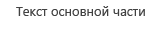|Средний блок основного текста|Наследуется автоматически|
||Небольшой блок основного текста|.ms-textSmall|
|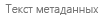|Текст метаданных|.ms-metadata|

<br/>

**Таблица 2. Стили названий и заголовков**

|**Пример**|**Область применения**|**Стиль**|
|:-----|:-----|:-----|
||Основной заголовок страницы.|.ms-core-pageTitle|
|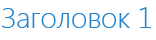|Заголовки для диалоговых окон, форм, блогов и записей обсуждения. Это альтернативный "основной" заголовок для особых типов контента или надстроек, занимающих целую страницу, которые требуется сделать отличными от обычных вики-страниц или страниц веб-частей.|H1|
||Подзаголовок по отношению к H1. Например, в сообществах используется H1 Accent для названия публикации и H2 Accent для лучшего "отклика" на публикацию.|H2|
||Обычно подзаголовок по отношению к H2.|H3|
||Подзаголовок по отношению к H3.|H4|
||Заголовок для главной или основной веб-части на странице или для основных разделов.|.ms-webpart-titleText|
|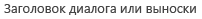|Заголовки в диалоговых окнах или выносках.|.ms-dlg-heading|

<br/>

**Таблица 3. Стили навигации**

|**Пример**|**Область применения**|**Стиль**|
|:-----|:-----|:-----|
||Заголовок левой панели навигации.|.ms-core-listMenu-verticalBox > .ms-core-listMenu-root > li > .ms-core-listMenu-item|
|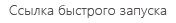|Ссылка в левой панели навигации.|.ms-core-listMenu-verticalBox|
|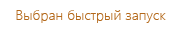|Выбранный элемент в левой панели навигации.|.ms-core-listMenu-verticalBox + .ms-accentText|
|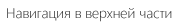|Элемент в верхней панели навигации.||
||Выбранный элемент в верхней панели навигации.||

<br/>

**Таблица 4. Стили команд**

|**Пример**|**Область применения**|**Стиль**|
|:-----|:-----|:-----|
||Ссылки на основные действия, которые, как ожидается, будут выполнять пользователи в данном контейнере или на странице. Например, этот стиль может использоваться для команд под выноской. Использованные и неиспользованные команды будут всегда отображаться одним цветом.|.ms-commandLink|
||Также используется для задания стиля действий, но действий, которые являются дополнительными по отношению к контенту. Этот стиль используется для дополнительных действий, чтобы они не конкурировали с основным контентом.|.ms-secondaryCommandLink|
||Ссылки в выноске.|.ms-calloutLink|

<br/>

**Таблица 5. Стили модификаторов**

|**Пример**|**Область применения**|**Стиль**|
|:-----|:-----|:-----|
||Вспомогательный класс, который будет предоставлять для текста цветовую тему из текущей темы.|.ms-accentText|
||Ссылки в контенте должны наследовать от стиля и поведения гиперссылок, установленного по умолчанию. В стиле гиперссылок используется цветовой эффект и эффект наведения для указания, что это ссылка, а не обычный текст.|Наследуется с помощью оператора <a>.|
|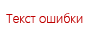|Сообщения об ошибках, которые возникают в формах.|.ms-error|
||Вспомогательный класс предоставляющий смягченный серый цвет для текста, который должен быть менее выражен, чем основной текст.|.ms-soften|
||Вспомогательный класс, предоставляющий для текста цвет "отключения", который используется для обозначения отключенных состояний.|.ms-disabled|
|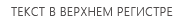|Вспомогательный класс, который преобразует текст в написанный прописными буквами.|.ms-uppercase|
||Вспомогательный класс для задания стиля текста как в формах.|.ms-helper|
||Разделитель в виде пунктирной линии, использующийся для отделения разделов в панели быстрого запуска и в меню.|HR|

<br/>

**Таблица 6. Стили частей пользовательского интерфейса**

|**Пример**|**Область применения**|**Стиль**|
|:-----|:-----|:-----|
|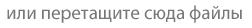|Основной встроенный текст вверху части.|.ms-textXLarge + .ms-soften|
|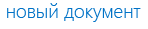|Команды в верхней строке части; чаще всего их будет одна или две на часть.|.ms-heroCommandLink|
||Текст, который отображается, чтобы побудить пользователя к взаимодействию с частью, когда в ней отсутствуют данные.|.ms-attractMode|
|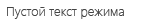|Текст, который отображается пользователю, когда нет доступных данных.|.ms-emptyMode|
|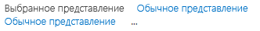|Элементы управления представления, такие как сводка.|.ms-pivot-link|
||Элементы списка, являющиеся ссылками.|.ms-listLink|

<br/>

**Таблица 7. Стили границ и фона**

|**Пример**|**Область применения**|**Стиль**|
|:-----|:-----|:-----|
||Для определения стиля прямоугольника, который необходимо сильно выделить на странице.|.ms-emphasis|
||Граница выделенного элемента.|.ms-emphasisBorder|
||Более тонкое выделение элемента.|.ms-subtleEmphasis|
|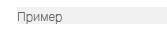|Команды в элементе со стилем ms-subtleEmphasis.|.ms-subtleEmphasisCommand|
||Отключенная команда в элементе со стилем ms-subtleEmphasis.|.ms-subtleEmphasisCommand-disabled|
||Элементы боковой панели навигации.|.ms-sideNav|
||Для выделения выбранного элемента боковой панели навигации.|.ms-sideNav-selected|
||Для выделения элемента с помощью границы.|.ms-lines|
||Для выделения элемента с помощью тонкой границы.|.ms-subtleLines|
||Для выделения элемента с помощью толстой или цветной границы.|.ms-strongLines|
||Для выделения отключенного элемента с помощью границы.|.ms-disabledLines|
||Для выделения элемента с помощью акцентированной границы.|.ms-accentLines|
||Для содержания всплывающих окон.|.ms-popupBorder|
||Для применения перекрытия в элементе фона.|.ms-bgOverlay|
|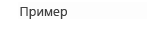|Для отключения фона элемента.|.ms-bgDisabled|
||Для применения фонового цвета заголовка.|.ms-bgHeader|
||Для применения фонового цвета нижнего колонтитула.|.ms-bgFooter|
||Элементы, которые должны выделяться цветом при наведении курсора мыши. В примере показан элемент, на который не наведен курсор мыши.|.ms-bgHoverable|
||Элементы, которые должны выделяться цветом при наведении курсора мыши. В примере показан элемент, на который наведен курсор мыши.|.ms-bgHoverable|
||Чтобы показать выделение в элементе.|.ms-bgSelected|
||Элементы в полосе вверху страницы.|.ms-topBar|
Дополнительные сведения см. в статье [Использование таблицы стилей веб-сайта SharePoint в надстройках SharePoint](use-a-sharepoint-website-s-style-sheet-in-sharepoint-add-ins.md).

<a name="UXGuide_Styling"> </a>
## <a name="styling-common-items-consistently-in-sharepoint-add-ins"></a>Согласованный стиль общих элементов в надстройках SharePoint

Чтобы помочь пользователям освоить навыки, применимые как в SharePoint, так и в надстройках, следует обеспечить согласованность стиля нескольких общих элементов.

### <a name="internal-navigation"></a>Внутренняя навигация

Есть два главных шаблона для обеспечения навигации внутри надстройки: **левая панель навигации** и **верхняя панель навигации**. Используемый вариант зависит от содержимого в остальной части надстройки. В большинстве случаев рекомендуется выбирать левую панель навигации, в частности, для переключения между разными списками, или если надстройка в основном является иерархическим представлением. С другой стороны, если навигация в основном состоит в переключении между разными представлениями одного списка, то следует использовать верхнюю панель навигации.

И левая, и верхняя панели навигации имеют представления объектной модели, стиль которых будет задаваться правильно при их установке в SharePoint. Вне страниц SharePoint придется выполнить дополнительные действия, чтобы самостоятельно создать разметку для верхней или левой панели навигации, а затем добавить соответствующие классы CSS для задания правильного стиля панели навигации.

### <a name="toolbars"></a>Панели инструментов

В большинстве случаев у вас будет немного команд, которые потребуется быстро добавить для пользователя. Если на странице уже используется **лента**, то эти команды рекомендуется добавить в подходящие места на существующей ленте. Однако в случае, когда на странице нет ленты, скорее всего не будет смысла добавлять ее ради нескольких команд. В таком случае рекомендуется добавить **панель инструментов**, зависящую от контекста элемента, в котором будут применяться команды. Следует использовать глиф, текст со стилем ms-commandLink или и то, и другое для представления команд на панели инструментов, которая должна иметь тот же цвет фона, что и остальная часть страницы.

### <a name="lists"></a>Списки

Списки являются распространенным способом представления данных пользователям. Если надстройка использует страницы SharePoint, то можно применять веб-часть представления списка для представления данных пользователям и получения включенного в нее стиля и взаимодействия. Однако если страницы находятся где-нибудь в другом месте, или требуется большая степень контроля над взаимодействием пользователей со списком, следует воспроизвести стили из списков в SharePoint, обеспечив собственное отображение и взаимодействие. Далее приводятся некоторые проблемы стилей, которые необходимо учитывать при использовании списков в надстройках.

- **Представления.** При отображении нескольких представлений в одном списке необходимо использовать сводку вверху списка, как это делается в обычных списках SharePoint. Никогда не следует использовать сводки в качестве способа представления иерархических данных.

- **Фильтры.** При предоставлении фильтра для существующего списка или иерархического размещения необходимо использовать боковую панель, которая находится на одном уровне с левой стороной области контента и имеет ширину не менее 300 пикселей. Следует также скопировать стили выбора SharePoint, чтобы указывать пользователю, какие фильтры или элементы выбраны.
 
- **Формы.** Когда пользователь просматривает или изменяет один элемент, необходимо использовать встроенные формы SharePoint либо копировать их стиль, чтобы обеспечить последовательность взаимодействия.

### <a name="forms-dialog-boxes-and-callouts"></a>Формы, диалоговые окна и выноски

Существует три разных шаблона предоставления пользователям дополнительной информации об объекте или пользовательского интерфейса для ввода: формы на всю страницу, диалоговые окна и выноски. Выбор используемого шаблона зависит от намерений пользователя и объема сведений, которые будут отображаться или запрашиваться.

- **Полностраничные формы.** Это лучший вариант, когда требуется, чтобы пользователи вводили несколько разных частей информации, или когда требуется показывать им большой объем структурированной информации за один раз. Полностраничные формы также имеет смысл использовать, когда требуются более сложные модели взаимодействия, такие как ленты. В таком случае при необходимости можно направлять пользователя на страницу формы. Необходимо убедиться, что существует четкий путь для сохранения или отмены изменений пользователя с помощью кнопок или ленты. В очень длинных формах, для которых может потребоваться прокрутка, рекомендуется помещать элементы **Сохранить** и **Отмена** как вверху, так и внизу формы.

- **Диалоговые окна.** Это модальные контейнеры пользовательского интерфейса, которые обычно используются для контекстного отображения дополнительных сведений или действий. Они также используются для более коротких форм или для пользовательского ввода. В целом, пользовательский интерфейс в диалоговых окнах должен быть простым и хорошо подходящим для небольшой поверхности отображения. Более длинные формы и более сложные модели взаимодействия, такие как ленты, лучше обслуживаются в полностраничных формах.

- **Выноски.** Выноски предоставляют соответствующую контекстную информацию и действия по конкретному объекту. Обычно выноски используются для предоставления пользователю дополнительных сведений или действий для элемента в упрощенном пользовательском интерфейсе. Если требуются полосы прокрутки или ввод пользователей, то использование выноски не рекомендуется.

### <a name="animation"></a>Анимация

Хотя анимация может дать более яркое и интересное взаимодействие, применять ее следует с осторожностью и не злоупотреблять анимацией в пользовательском интерфейсе. Хорошо сделанная анимация будет не слишком бросаться в глаза, но создаст впечатление более быстрого и эффективного пользовательского интерфейса. При использовании анимации необходимо учитывать физические свойства и инерцию, чтобы предоставлять пользовательский интерфейс, выглядящий естественным и изящным. Мы настоятельно не рекомендуем использовать гипертрофированную анимацию, например, чрезмерные подпрыгивания или деформации, или заставлять объекты летать по экрану при малейшем действии пользователя. Как правило, объекты должны прямо двигаться к своему назначению, и часто достаточно анимировать первые или последние 10 процентов фактического изменения, чтобы показать пользователю, что он перемещается.

### <a name="tabs-and-pivots"></a>Вкладки и сводки

В SharePoint вкладки следует использовать только на ленте. Во всех остальных областях SharePoint для выражения концепции изменений области контента необходимо использовать сводки.

<a name="Fabric"> </a>
## <a name="office-ui-fabric-with-sharepoint-add-ins-faq"></a>Office UI Fabric с надстройками SharePoint: вопросы и ответы

Ознакомьтесь с ответами, чтобы понять, как использовать структуру пользовательского интерфейса Office и придать надстройке SharePoint внешний вид, характерный Office 365.

**1. Что такое Office UI Fabric?**

Office UI Fabric — это гибкая, ориентированная на мобильные устройства платформа, позволяющая создавать веб-интерфейс с помощью языка дизайна Office. Она поставляется с набором шрифтов и классами CSS, которые содержат компоненты пользовательского интерфейса, значки, анимацию и официальную цветовую палитру Office. Дополнительные сведения см. в статье [Office UI Fabric](https://github.com/OfficeDev/Office-UI-Fabric).

**2. Можно ли использовать Office UI Fabric в надстройках SharePoint?**

Да. Страницы надстроек могут ссылаться на файлы Office UI Fabric так же, как и на другие платформы CSS, например bootstrap.

**3. В каких случаях следует использовать Office UI Fabric с надстройками SharePoint?**

Используйте ее, когда хотите, чтобы надстройка имела внешний вид, характерный Office 365. Ее можно использовать вместо файла CSS хост-сайта SharePoint.

**4. Как можно использовать Office UI Fabric в надстройках SharePoint?**

Просто добавьте файлы Office UI Fabric в проект разработки и включите ссылку на библиотеку fabric.css на страницу HTML или ASPX. Дополнительные сведения см. в разделе [Приступая к работе](https://github.com/OfficeDev/Office-UI-Fabric#get-started).

**5. Как можно использовать компоненты Office UI Fabric в надстройках SharePoint?**

Просто добавьте ссылку на библиотеку fabric.components.css на страницу HTML или ASPX. Дополнительные сведения см. в разделе [Приступая к работе](https://github.com/OfficeDev/Office-UI-Fabric/blob/master/ghdocs/GETTINGSTARTED).

**6. Можно ли использовать Office UI Fabric с CSS хост-сайта надстройки SharePoint?**

В настоящее время не рекомендуется совмещать Office UI Fabric с CSS хост-сайта. Это позволит избежать конфликтов имен классов и несовпадения стилей.

**7. Поддерживает ли Office UI Fabric темы SharePoint?**

Нет. Но применение тем структуры Office UI Fabric не приведет к конфликту с темами SharePoint.

<a name="UXGuide_Extending"> </a>
## <a name="extending-sharepoint-ui-in-add-ins"></a>Расширение пользовательского интерфейса SharePoint в надстройках

SharePoint позволяет расширять некоторые из существующих пользовательских интерфейсов в надстройках, что дает возможность сделать надстройки доступными в тех местах, где они могут потребоваться пользователям. Для расширения пользовательского интерфейса хост-сайта можно использовать следующие методы.

- **Веб-части надстроек.** Позволяют отображать элемент **iframe** с содержимым из надстройки.

- **Дополнительные действия.** Можно расширить ленту или контекстное меню дополнительными действиями. Дополнительные действия делают надстройки доступными в элементах списка или документах, а также везде, где отображается лента.

### <a name="adding-add-in-parts-to-the-host-web"></a>Добавление веб-частей надстроек на хост-сайт

Веб-части это способ размещения некоторых сведений или небольшого пункта взаимодействия надстройки на хост-сайте, на котором установлена надстройка. Конечные пользователи могут включать эти веб-части в свои страницы с помощью инфраструктуры веб-частей в SharePoint. На рисунке 3 в качестве примера веб-части показана веб-часть облака тегов.

*Рисунок 3. Веб-часть облака тегов*


 
На рисунке 3 веб-часть называется **Облако тегов из надстройки UX Design**. Само облако тегов обслуживается из содержимого надстройки, размещается в элементе **iframe** и полностью изолировано от страницы размещения. Поскольку содержимое надстройки использует файл CSS хост-сайта, он органично вписывается в страницу размещения.

Некоторые виды арендованного пользовательского интерфейса хорошо предоставляются через пользовательский интерфейс веб-части. Например, может потребоваться предоставить ряд ярлыков для разных вариантов взаимодействия с надстройкой, или даже одну точку вызова, которую пользователи могут включать в свои страницы. Можно также использовать их для отображения небольшой части данных в надстройке или самых последних изменений чего-либо. Возможно, вы захотите предоставить небольшую интерактивную зону для выполнения быстрых действий с надстройкой без ее открытия. Вид предоставляемой веб-части будет определяться сценариями, которые поддерживает надстройка. Следует помнить, что не все надстройки будут иметь веб-части, их следует предоставлять, только если это необходимо для взаимодействия с пользователем.

Страница, отображаемая в веб-части, будет размещаться в **iframe**, поэтому обязательно учтите это в любом созданном вами JavaScript, качественно подготовив его для доступа к таким элементам, как объект окна. Даже если остальная часть надстройки в значительной степени имеет фирменное оформление, следует подумать о принятии стиля хост-сайта для вашей веб-части, так как она встраивается в страницы хост-сайта, поэтому будет выглядеть дисгармонично и непривлекательно без такого соответствия стилей. Чтобы использовать стиль хост-сайта, необходимо вручную создать ссылку на стандартный файл CSS. Дополнительные сведения см. в разделе [Ссылка на файл CSS хост-сайта](#UXGuide_CSS) в этой статье. На странице также не должно быть никакого хрома, так как она будет встраиваться в страницу, которая уже имеет свой хром.

Страница должна хорошо работать в **iframe** в разных доменах, поэтому необходимо убедиться, что для параметров X-Framing-Option этой страницы не указан только единый домен. По умолчанию указывается, что страницы SharePoint должны быть в **iframe** только в рамках одного домена. Поэтому для страниц, размещенных в SharePoint, придется явно отказаться от такого поведения для страниц, которые должны отображаться в веб-частях, путем добавления веб-части **AllowFraming** где-либо в странице, как показано в следующем примере.

   ```
   <WebPartPages:AllowFraming ID="AllowFraming1" runat="server" />
   ```

Поскольку невозможно указать домен, во фреймы которого будут включены ваши страницы, размещенные в веб-частях надстройки страницы будут уязвимы для атак типа Clickjacking. При таких атаках страницы могут включаться во фреймы на вредоносной странице, и кнопки или ссылки, на которые нажимают пользователи, подменяются кнопками, выполняющими действия, о которых пользователь не подозревает. При разработке страниц необходимо это учитывать и не предоставлять никакую функциональность на странице для веб-части, которая может оказаться опасной в случае подмены вредоносной страницей.

Хотя пользователи могут вручную устанавливать другой размер веб-части, можно устанавливать определенный размер веб-части в ее определении. Кроме того, можно запрашивать динамическое изменение размера веб-части с помощью **postmessages**. Мы рекомендуем по умолчанию задавать выбор размера веб-части с шагом в 30 пикселей (например, 150 или 210 пикселей), чтобы в случае, когда веб-части разных надстроек смешиваются на одной странице, пользователь мог разобраться, что каждая из веб-частей была построена для работы в одном и том же пространстве. Если веб-часть предназначена для имитации плитки из начального взаимодействия, то она должна иметь высоту и ширину в 150 пикселей. Если веб-часть предназначена для отображения подробностей в боковом столбце, то она должна иметь ширину в 300 пикселей.

Если веб-часть отображает динамический контент, то рекомендуется запрашивать изменение размера для уменьшения полос прокрутки, включенных в страницу. В следующем примере показывается, как использовать **postmessages** для изменения размера веб-части.


   ```
   window.parent.postMessage('<message senderId={your ID}>resize(120, 300)</message>', {hostweburl});
   ```

В примере выше значение **senderId** будет устанавливаться в строке запроса страницы автоматически кодом веб-части надстройки при отрисовке страницы. Странице будет достаточно прочитать значение **SenderId** в строке запроса и использовать его при запросе изменения размера. Вы можете получить URL-адрес хост-сайта из строки запроса, добавив маркер **StandardTokens** или **HostUrl** к атрибуту **Src** в определении веб-части надстройки.

Чтобы указать веб-часть для хост-сайта, необходимо задать веб-часть клиента в файле FEATURE в пакете надстройки (не в файле FEATURE в WSP-файле пакета). Можно создавать веб-часть, которую может настраивать конечный пользователь, например, указывая почтовый индекс или почтовый код. В следующей разметке задается веб-часть надстройки, и элемент **Properties** является необязательным.
 
   ```XML
   <ClientWebPart 
       Name="Sample Add-in Part" 
       DefaultWidth="600" 
       DefaultHeight="300" 
       Title="Sample Add-in Part" 
       Description="This is a sample part with properties.">
       <Content Type="html" Src="~appWebUrl/Pages/Part.aspx?Property1=_prop1_&amp;amp;Property2=_prop2_&amp;amp;Property3=_prop3_&amp;amp;Property4=_prop4_" />
       <Properties>
           <Property 
               Name="prop1" 
               Type="string" 
               WebBrowsable="true" 
               WebDisplayName="First Property" 
               WebDescription="Description 1" 
               WebCategory="Custom Properties" 
               DefaultValue="String Property" 
               RequiresDesignerPermission="true" />
           <Property 
               Name="prop2" 
               Type="boolean" 
               WebBrowsable="true" 
               WebDisplayName="Second Property" 
               WebDescription="Description 2" 
               WebCategory="Custom Properties" 
               DefaultValue="TRUE" 
               RequiresDesignerPermission="true" />
           <Property 
               Name="prop3" 
               Type="int" 
               WebBrowsable="true" 
               WebDisplayName="Third Property" 
               WebDescription="Description 3" 
               WebCategory="Custom Properties" 
               DefaultValue="1" 
               RequiresDesignerPermission="true" />
           <Property 
               Name="prop4" 
               Type="enum" 
               WebBrowsable="true" 
               WebDisplayName="Fourth Property" 
               WebDescription="Description 4" 
               WebCategory="Custom Properties" 
               DefaultValue="one" 
               RequiresDesignerPermission="true" >
               <EnumItems>
                   <EnumItem Value="one" WebDisplayName="One" />
                   <EnumItem Value="two" WebDisplayName="Two" />
                   <EnumItem Value="three" WebDisplayName="Three" />
               </EnumItems>
           </Property>
       </Properties>
   </ClientWebPart>
   ```

В элементе **ClientWebPart** может потребоваться указать следующие параметры.

- **Name.** Внутреннее имя, используемое для идентификации надстройки. Оно должно быть уникальным.
- **DefaultWidth и DefaultHeight.** Размер веб-части по умолчанию. При необходимости вы можете менять размер страницы внутри веб-части.
- **Title.** Имя, которое видит пользователь при добавлении веб-части на страницу с помощью средства добавления веб-частей.
- **Description.** Описание, которое видит пользователь при добавлении веб-части на страницу с помощью средства добавления веб-частей.

Можно задавать свойства веб-части с типом **string**, **enum**, **int** и **Boolean**. Можно задавать категорию **toolpart**, в которой должны отображаться эти свойства, с помощью атрибута **WebCategory**. Элемент **Property** имеет следующие свойства.

-  **Name.** Имя, используемое для сопоставления этого свойства с маркером в заменяемой строке запроса.
-  **WebDisplayName.** Имя, используемое в инструментальной части.
-  **WebCategory.** Инструментальная часть в панели инструментов, на которую требуется добавить это свойство.
-  **Type:** тип входных данных, которые ожидаются от пользователя. Это может быть тип **string**, **enum**, **int** или **Boolean**.
-  **DefaultValue.** Значение свойства по умолчанию.

Когда веб-часть добавляется на страницу, все строки в строке запроса, соответствующие шаблону _propertyName_, автоматически заменяются значением свойства с этим именем в экземпляре веб-части, или значением по умолчанию, если пользователь не указал этот экземпляр. Затем следует выполнить код внутри страницы, чтобы проанализировать строку запроса и вытащить свойства, которые будут использоваться при отрисовке страницы и взаимодействии на ней.

Вы также можете предпочесть отправку идентификатора веб-части в строке запроса, указав с помощью строки _wpid_, где его следует заменить в строке запроса. Это может быть удобно при разграничении разных экземпляров веб-части, если вы хотите сохранять сведения о выборах или взаимодействиях пользователей на уровне экземпляра. Дополнительные сведения см. в статье [Создание веб-частей надстройки для установки с надстройкой SharePoint](create-add-in-parts-to-install-with-your-sharepoint-add-in.md).

### <a name="adding-custom-actions-to-the-host-web"></a>Добавление дополнительных действий на хост-сайт

Если имеются функциональные возможности, которые стоит размещать в контексте элементов списка или документов или на конкретных вкладках ленты хост-сайта, можно добавить их в контекстное меню или на ленту с помощью дополнительных действий. Чтобы расположить дополнительные действия на хост-сайте, необходимо определить их в таком же свободном файле FEATURE пакета надстройки, что и содержащий определения **ClientWebPart**.

*Рисунок 4. Дополнительное действие в контекстном меню*


 
Код для дополнительных действий, которые размещаются на хост-сайте, такой же, как в предыдущих версиях SharePoint, со следующими ограничениями.

- Атрибут **Location** должен иметь значение **CommandUI.Ribbon** или **EditControlBlock**.
- Объект **CustomAction** не может содержать код JavaScript.
   - каждый атрибут **UrlActions** или **CommandActions** должен быть URL-адресом для навигации; этот URL-адрес может быть параметризованным с использованием обычных маркеров дополнительных действий в дополнение к маркерам приложения;
   - В модификациях ленты не допускается использование атрибута **EnabledScript**.
    
Обычно когда пользователь выбирает дополнительное действие, происходит навигация на URL-адрес, указанный с помощью маркеров, которые разрешаются на основе выбора пользователя. Однако в некоторых случаях может потребоваться, чтобы пользователь оставался в контексте страницы, например, при быстрых действиях в конкретном документе. Если требуется, чтобы дополнительное действие открывало диалоговое окно вместо выполнения навигации, необходимо добавить в элемент **CustomAction** следующие атрибуты.

   ```
   HostWebDialog="TRUE"
   HostWebDialogHeight="500" 
   HostWebDialogWidth="500"
   ```

Атрибуты **HostWebDialogHeight** и **HostWebDialogWidth** являются необязательными. Если они не указаны, то используется размер по умолчанию диалогового окна в SharePoint. Однако в целом следует задавать размеры диалогового окна, чтобы при отображении пользователю оно выглядело правильно и не использовало полосы прокрутки.

Диалоговое окно всегда имеет кнопку **Закрыть** в хроме диалогового окна. На странице также можно включить кнопки, которые будут закрывать диалоговое окно и сообщать исходной странице, когда ее следует обновить. Если выполняется что-либо, что может быть отражено в представлении, которое просматривает пользователь (например, обновление свойств в документе), то необходимо обновить страницу. С другой стороны, если выполняется действие, не связанное с какими-либо обновлениями (например, действие отмены или отправка файла в архив без изменения свойств), то можно сообщить странице, что обновление не требуется. В следующих примерах показано, как отправлять сообщения POST для закрытия диалогового окна.

   ```
   window.parent.postMessage('CloseCustomActionDialogRefresh', '*');
   window.parent.postMessage('CloseCustomActionDialogNoRefresh', '*');
   ```

В зависимости от того, используется ли **CloseCustomActionDialogRefresh** или **CloseCustomActionDialogNoRefresh**, диалоговое окно закрывается, а страница за ним либо обновляется, либо нет.

Нельзя добавить дополнительную вкладку на ленту хост-сайта из надстройки. Можно добавлять только дополнительные группы или отдельные элементы управления. Не следует переопределять какие-либо элементы управления ленты SharePoint по умолчанию. Ваши элементы управления должны существовать параллельно с элементами управления SharePoint.

Если есть несколько элементов управления, которые связаны друг с другом, или которые пользователь, скорее всего, будет связывать с использованием вашей надстройки, то их следует объединить в собственную дополнительную группу, чтобы облегчить их поиск. С другой стороны, если добавляемая функциональность будет, скорее всего, рассматриваться пользователями как часть основного взаимодействия сайта, следует попытаться логично вставить этот элемент управления в существующие места на ленте. Дополнительные сведения см. в статье [Создание дополнительных действий для развертывания с надстройками SharePoint](create-custom-actions-to-deploy-with-sharepoint-add-ins.md).

<a name="UXGuide_Settings"> </a>
## <a name="providing-a-settings-page-for-add-in-configuration"></a>Предоставление страницы параметров для конфигурации надстройки

В большинстве случаев бывает оправданно предоставить пользователям возможность изменения некоторых сведений о конфигурации надстройки с помощью страницы параметров. В идеале можно указать обоснованные значения по умолчанию для этих параметров, и пользователи будут переходить на эту страницу параметров, только если им нужно будет изменить эти значения по умолчанию. В некоторых случаях, чтобы приложение могло функционировать, ему будут требоваться определенные сведения или выбранные варианты. Если ваша надстройка перед началом функционирования запрашивает сведения, то необходимо предоставить пользовательский интерфейс, который будет направлять пользователя на страницу параметров для обновления конфигурации.

Если страница параметров используется, то ее URL-адрес необходимо добавить в меню вверху справа, чтобы пользователи могли легко находить его. Если в надстройке имеется начальное взаимодействие с пользователем или другие параметры, их также необходимо добавить. Дополнительные сведения см. в статье [Использование клиентского элемента управления хрома в надстройках SharePoint](use-the-client-chrome-control-in-sharepoint-add-ins.md).

Необходимо также учитывать, что пользователь, посетивший надстройку, может не иметь возможности настраивать ее. Ваш пользовательский интерфейс не должен функционировать исходя из предположения, что текущий пользователь может выполнить настройку. Надстройка должна помочь пользователям найти нужного человека, если они не могут настроить эту надстройку.

<a name="UXGuide_License"> </a>
## <a name="managing-user-licenses-in-add-ins"></a>Управление лицензиями пользователей в надстройках

Если надстройка не предоставляется бесплатно, то необходимо найти правильный баланс между доступными или ограниченными функциями в пробной или нелицензированной версии по сравнению с полной платной версией.

Если вы предлагаете пробную версию с ограничением по времени, то в течение пробного периода она должна работать в точности как платная версия. Предоставьте пользователям реальное представление того, что они получат, оплатив надстройку. Если вы решаете ограничить что-либо в течение пробного периода, то необходимо очень четко представить, каким образом пользователь может получить больше, оплатив надстройку. В неограниченных пробных версиях следует предоставить столько функциональных возможностей, сколько необходимо пользователю, чтобы понять ценность вашей надстройки. Проясните, какие дополнительные преимущества получит пользователь, оплатив надстройку.

Когда пользователи впервые видят вашу надстройки, у них может не быть лицензии для нее. Например, один пользователь может добавить надстройку на сайт группы, но забыть лицензировать кого-либо еще. Другие пользователи на сайте группы будут использовать надстройку без лицензии, пока диспетчер лицензий не исправит эту ситуацию. Вы должны обеспечить им хорошее впечатление, чтобы они с большей вероятностью затребовали или купили лицензию. Рекомендуется всегда предоставлять пользователям возможность просматривать данные в надстройке и выполнять по ним навигацию. Проясните, как получение лицензии включит дополнительные функции, но не напоминайте об этом чаще, чем один раз за сеанс.

Если основная ценность надстройки состоит в отображении данных (и вы не хотите предоставлять это бесплатно), то следует отображать ограниченное подмножество данных или отображать данные без возможности взаимодействия. Не следует блокировать нелицензированным пользователям возможность просмотра вашей надстройки. Нелицензированные пользователи должны осознать то, чем полезна для них надстройка, и тогда они с большей вероятностью приобретут ее.

### <a name="encouraging-users-to-get-a-license"></a>Побуждение пользователей на получение лицензии

В случае, когда нелицензированный или имеющий пробную лицензию пользователь использует вашу надстройку, следует побуждать его на получение полной лицензии. Для этого существует два способа:

- с помощью строки состояния вверху страницы, которая указывает состояние лицензии пользователя;
- в условиях, когда пользователь пытается получить доступ к контенту или функциональным возможностям, для которых требуется лицензия.

Следует с осторожностью использовать второй вариант предупреждения о необходимости лицензии. На пользователя производит лучшее впечатление, когда используется сообщение о состоянии лицензии верхнего уровня и отключены все функциональные возможности, для которых требуется лицензия, чем когда он бывает неприятно удивлен невозможностью сделать что-либо. В любом случае сообщение должно быть дружелюбным и иметь скорее поощряющий, а не указывающий тон. Вы должны предоставить пользователю ссылку на страницу сведений о надстройке в магазине, где пользователь может приобрести лицензию.

### <a name="licensing-status-bar"></a>Строка состояния лицензии

В SharePoint имеется встроенная строка состояния, которую можно использовать на страницах SharePoint путем вызова API JavaScript. Вы также можете скопировать стиль встроенной строки состояния. Следует использовать желтый "предупреждающий" цвет и подходящие сообщения, например вот какие:

- Для пользователей **неограниченной пробной версии**: 

   "Это пробная версия _\<имя приложения\>_. Чтобы приобрести полную версию и разблокировать _\<платная функциональность\>_, перейдите по этому адресу".

- Для пользователей **непросроченной ограниченной по времени пробной версии**: 

   «Осталось _\<количество времени, выраженное в удобных для человеческого восприятия единицах, например "3 дня", а не "73:42:12"\>_ использования пробной версии _\<имя приложения\>_. Чтобы приобрести полную версию и не пропустить момент получения полной функциональности, перейдите по этому адресу».

- Для пользователей **просроченной ограниченной по времени пробной версии**: 

   "К сожалению, время использования пробной версии _\<имя приложения\>_ истекло. Чтобы приобрести полную версию и вернуть полную функциональность, перейдите по этому адресу".

- Для пользователей **без лицензии**: 

   "К сожалению, у вас отсутствует лицензия на _\<имя приложения\>_. Чтобы приобрести полную версию и включить _\<платная функциональность\>_, перейдите по этому адресу".

<a name="UXGuide_Other"> </a>
## <a name="other-design-considerations-for-sharepoint-add-ins"></a>Другие замечания по проектированию надстроек SharePoint

Помимо изложенного выше, при создании надстройки SharePoint необходимо учитывать вот какие моменты.

### <a name="persisting-necessary-information-in-cookies"></a>Сохранение необходимой информации в файлах cookie

Вашей надстройке может требоваться много информации для взаимодействия с SharePoint, например, URL-адрес хост-сайта или сообщение POST с учетными данными SharePoint. Сохранение этой информации в клиентском файле cookie означает, что надстройке не придется постоянно запрашивать информацию в SharePoint, и это обеспечивает более гладкое и эффективное взаимодействие с конечным пользователем.

### <a name="requesting-a-new-oauth-token"></a>Запрос нового маркера OAuth

Если надстройка не имеет учетных данных, можно запросить новые, направив пользователя на страницу перенаправления с идентификатором вашей надстройки и URL-адресом, на который пользователь пытается перейти. Этот URL-адрес должен быть в домене URL-адреса перенаправления, который зарегистрирован для используемого вами идентификатора надстройки OAuth. Следующий URL-адрес служит в качестве примера перенаправления пользователей вашей надстройки. (Заполнители находятся в фигурных скобках.)

   `{hostWebURL}/_layouts/15/appredirect.aspx?client_id={OAuth_app_ID}&amp;redirect_uri={redirectUrl}`
 
### <a name="checking-for-read-only-mode-on-sharepoint-sites"></a>Проверка режима только чтения на сайтах SharePoint

В некоторых ситуациях, например связанных с обновлениями или обслуживанием сайтов, могут быть периоды, когда при вызове пользователем надстройки SharePoint находится в режиме только чтения. Если вы предоставляете пользователям возможность управлять данными SharePoint, следует убедиться, что пользователям не разрешается вносить изменения, которые не могут быть сохранены на сервере. Отключите пользовательский интерфейс редактирования для режима только чтения. Для проверки, находится ли сайт в режиме только чтения, можно вызвать следующий API:

   `{hostWebUrl}/_api/site/ReadOnly`

## <a name="see-also"></a>См. также
<a name="bk_addresources"> </a>

-  [Разработка пользовательского интерфейса для надстроек SharePoint](ux-design-for-sharepoint-add-ins.md)
-  [Создание компонентов пользовательского интерфейса в SharePoint](create-ux-components-in-sharepoint.md)
-  [Использование таблицы стилей веб-сайта SharePoint в надстройках SharePoint](use-a-sharepoint-website-s-style-sheet-in-sharepoint-add-ins.md)
-  [Использование клиентского элемента управления хрома в надстройках SharePoint](use-the-client-chrome-control-in-sharepoint-add-ins.md)
-  [Создание веб-частей надстроек для установки вместе с надстройкой SharePoint](create-add-in-parts-to-install-with-your-sharepoint-add-in.md)
-  [Создание дополнительных действий для развертывания с надстройками SharePoint](create-custom-actions-to-deploy-with-sharepoint-add-ins.md)
-  [Настройка представления списка в надстройках SharePoint с использованием клиентской обработки](customize-a-list-view-in-sharepoint-add-ins-using-client-side-rendering.md)
    
 
