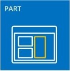
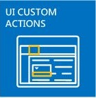

# Надстройки SharePointSharePoint Add-ins
Надстройки SharePoint — это создаваемые вами автономные расширения для веб-сайтов SharePoint, работающие без пользовательского кода на сервере SharePoint.SharePoint Add-ins are self-contained extensions of SharePoint websites that you create, and that run without custom code on the SharePoint server.
 

 **Примечание.** В настоящее время идет процесс замены названия "приложения для SharePoint" названием "надстройки SharePoint". Во время этого процесса в документации и пользовательском интерфейсе некоторых продуктов SharePoint и средств Visual Studio может по-прежнему использоваться термин "приложения для SharePoint". Дополнительные сведения см. в статье [Новое название приложений для Office и SharePoint](new-name-for-apps-for-sharepoint#bk_newname).The name "apps for SharePoint" is changing to "SharePoint Add-ins". During the transition, the documentation and the UI of some SharePoint products and Visual Studio tools might still use the term "apps for SharePoint". For details, see [New name for apps for Office and SharePoint](new-name-for-apps-for-sharepoint#bk_newname).
 

## Общие сведения о надстройках SharePointSharePoint Add-ins overview

Существует два основных типа надстроек SharePoint надстройки с размещением в SharePoint и у поставщика. Чтобы выбрать наиболее подходящий вариант для своего сценария, сначала узнайте, что общего у обоих типов таких надстроек.There are two basic kinds of SharePoint Add-ins — SharePoint-hosted and provider-hosted. To make the best decision about the right kind to develop for your scenario, start by learning what both types of SharePoint Add-ins have in common.
 

 

 **Примечание.** Приложение для устройства, например мобильное приложение, не является настоящей надстройкой SharePoint, даже если оно получает доступ к SharePoint. Это касается и веб-приложений, запускаемых не из SharePoint. Если вам нужно разработать такое приложение, см. статью [Доступ к SharePoint с мобильных устройств и из собственных приложений устройств](http://msdn.microsoft.com/library/42014171-5ee5-421d-9cde-413efc3aecef%28Office.15%29.aspx).**Note** A device app, such as mobile app, isn't really a "SharePoint Add-in" even when it accesses SharePoint. The same is true of a web application that is launched from outside of SharePoint. If you want to develop any of these kinds of apps, see  [Access SharePoint from mobile and native device apps](http://msdn.microsoft.com/library/42014171-5ee5-421d-9cde-413efc3aecef%28Office.15%29.aspx).
 

-  **Надстройка SharePoint — это автономный функциональный модуль**, расширяющий возможности веб-сайтов SharePoint для решения определенной бизнес-задачи.**A SharePoint Add-in is a self-contained pieces of functionality** that extends the capabilities of SharePoint websites to solve a well-defined business problem.
    
 
-  **Надстройки не содержат пользовательский код, который запускается на серверах SharePoint**. Вместо этого вся пользовательская логика перемещается в облако, на клиентские компьютеры или же на локальный сервер, который не входит в ферму SharePoint или подписку на SharePoint Online. Если пользовательский код находится за пределами серверов SharePoint, администраторы SharePoint могут не беспокоиться, что надстройка причинит вред их серверам или снизит производительность веб-сайтов SharePoint Online.**Add-ins don't have custom code that runs on the SharePoint servers**. Instead, all custom logic moves "up" to the cloud, or "down" to client computers, or "over" to an on-premise server that is outside the SharePoint farm or SharePoint Online subscription. Keeping custom code off SharePoint servers provides reassurance to SharePoint administrators that the add-in can't harm their servers or reduce the performance of their SharePoint Online websites.
    
 
-  **Бизнес-логика надстройки SharePoint может получить доступ к данным SharePoint через один из клиентских API в составе SharePoint**. Какой API нужно использовать для своей надстройки, зависит от того, каким вы разработаете это приложение.**Business logic in a SharePoint Add-in can access SharePoint data through one of the several client APIs included in SharePoint**. Which API you use for your add-in depends on certain other design decisions you make.
    
 
-  **Практически все основные типы компонентов SharePoint могут быть частью надстройки**, в том числе страницы, списки, рабочие процессы, настраиваемые типы контента, шаблоны списков и веб-части.**Almost all major types of SharePoint components can be part of a SharePoint Add-in**, including pages, lists, workflows, custom content types, list templates, Web Parts, and more.
    
 
-  **Веб-сайты SharePoint, где установлены Надстройки SharePoint и где пользователи запускают их, называются хост-сайтами.** Но компоненты SharePoint обычно находятся на отдельном дочернем сайте хост-сайта сайте надстройки.**The SharePoint websites where SharePoint Add-ins are installed, and from which users launch them, are called host webs.** The SharePoint components, however, are generally in a special child web of the host web called theadd-in web.
    
 
-  **Надстройки SharePoint можно разместить на веб-сайте SharePoint несколькими указанными ниже способами**.**SharePoint Add-ins can fit into a SharePoint website in several ways**:
    
|||
|:-----|:-----|
||**В виде иммерсивного полностраничного интерфейса**, который может выглядеть, как страница SharePoint.**As an immersive full-page experience** that can have the look and feel of a SharePoint page.|
||**как часть веб-страницы, то есть с использованием специального элемента управления (веб-части надстройки)**, для отображения элемента iframe, содержащего такую надстройку;**As part of a webpage, using a special kind of control, called an add-in part**, to surface an iframe element that contains the add-in.|
||**В виде команд пользовательского интерфейса, расширяющих возможности лент и меню** для списков, документов и многих других объектов.**As UI commands that extend ribbons and menus** for lists, documents, and more.|
-  **Для всех надстроек SharePoint, устанавливаемых пользователями, предусмотрена плитка на странице **Содержимое сайта** веб-сайта SharePoint.** Если щелкнуть какую-либо плитку, запустится соответствующая ей надстройка.**All SharePoint Add-ins that users install get a tile on the **Site Contents** page of the SharePoint website.** Clicking the tile runs the add-in.
    
 
-  **Надстройка SharePoint настраивается с помощью  *манифеста надстройки***. Это XML-файл, в котором указаны основные свойства надстройки, место запуска, а также действия, которые должна предпринять служба SharePoint после запуска надстройки. Кроме того, в манифесте можно определить языки, поддерживаемые надстройкой, службы и функции SharePoint, от которых она зависит, а также разрешения дляхост-сайта, необходимые этой надстройке (Надстройки SharePoint полностью контролируют собственные сайты надстроек).**A SharePoint Add-in is configured using an  *add-in manifest*** —an XML file that declares the add-in's basic properties, where it runs, and what SharePoint should do when the add-in starts. Among other things, the manifest can specify what languages the add-in supports, what SharePoint services and functionality it depends on, and the permissions to thehost web that the add-in needs. (SharePoint Add-ins have full control of their ownadd-in web.)
    
 
-  **Распространять Надстройки SharePoint следует в пакетах надстроек**, которые содержат по крайней мере манифест надстройки. (Если компоненты SharePoint отсутствуют, пакет надстройки может содержать только ее манифест.) Если для надстройки предусмотрены компоненты SharePoint на сайте надстройки, они включаются в пакет как набор XML-файлов. Удаленные компоненты, размещенные не на серверах SharePoint (например, удаленное веб-приложение или база данных), не входят в пакет и разворачиваются отдельно от пакета надстройки. Однако в этом случае нужно указать URL-адреса удаленных компонентов в манифесте надстройки.**You distribute SharePoint Add-ins in add-in packages** that always include at least the add-in manifest. (If there are no SharePoint components, the add-in manifest may be the only thing in the add-in package. ) If the add-in has SharePoint components in an add-in web, these are included in the package as a set of XML files. Remote components that are hosted outside of SharePoint, such as a remote web application or database, are not included in the package and are deployed separately from the add-in package. (However, the add-in manifest does specify the URLs of the remote components.)
    
 
-  **Пакеты надстроек могут также содержать Надстройки Office.** Когда устанавливается Надстройка SharePoint, в каталог надстроек Office в SharePoint добавляется Надстройка Office. Пользователи могут установить ее в приложения Office (например, Word или Excel).**Add-in packages can also include Office Add-ins.** When the SharePoint Add-in is installed, the Office Add-in is added to an Office Add-ins catalog in SharePoint. Users can install it from the catalog into the Office applications like Word or Excel.
    
 

 **Совет.** **Ознакомьтесь с несколькими надстройками SharePoint в** [Магазине Office](https://store.office.com/appshome.aspx?productgroup=SharePoint), чтобы получить представление о том, что вы можете разрабатывать. Кроме того, вы можете открыть веб-сайт SharePoint и установить какие-либо бесплатные надстройки SharePoint. Просто выберите пункты **Содержимое сайта \| добавить надстройку \| Магазин SharePoint**.TIP  Take a look at a few SharePoint Add-ins in the Office Store to get a sense of what you can develop. Or open a SharePoint website and install some of the free SharePoint Add-ins. Just navigate to Site Contents | add an add-in | SharePoint Store.
 

### Несколько заметок для опытных разработчиков SharePointA couple of points for veteran SharePoint developers

Мы объявили нерекомендуемыми изолированные решения, содержащие пользовательский серверный код. Мы по-прежнему поддерживаем изолированные решения "без кода" и изолированные решения, содержащие только JavaScript.We've deprecated sandboxed solutions that contain custom server-side code. We still support "No code" sandboxed solutions and sandboxed solutions that contain only JavaScript.
 

 
Надстройки SharePoint не используют серверную объектную модель SharePoint. Клиентские объектные модели значительно расширены в SharePoint. Хотя некоторые API серверной объектной модели SharePoint недоступны в клиентских объектных моделях, они в основном принадлежат к административным или связанным с безопасностью классам. Пользовательская логика SharePoint, которая обращается к этим областям, больше подходит для сценария Windows PowerShell или классического изолированного решения для SharePoint. Из статьи  [Сравнение надстроек SharePoint с решениями SharePoint](http://msdn.microsoft.com/library/0e9efadb-aaf2-4c0d-afd5-d6cf25c4e7a8%28Office.15%29.aspx) можно узнать о том, что выбрать Надстройки SharePoint, классические решения ферм SharePoint или изолированные решения.SharePoint Add-ins don't use the server-side SharePoint object model. The client-side object models are greatly expanded in SharePoint. Although some APIs in the SharePoint server object model aren't available in the client object models, these are almost entirely administrative and security-related classes. Custom SharePoint logic that addresses these areas is more appropriate for a Windows PowerShell script or classic SharePoint farm solution. To learn how to choose among SharePoint Add-ins, classic SharePoint farm solutions, and sandboxed solutions, see  [SharePoint Add-ins compared with SharePoint solutions](http://msdn.microsoft.com/library/0e9efadb-aaf2-4c0d-afd5-d6cf25c4e7a8%28Office.15%29.aspx).
 

 

## Два способа распространения или продажи пакета надстройкиTwo ways to distribute or sell an add-in package

Вы можете распространять пакеты надстроек двумя указанными ниже способами.You can distribute an add-in package in two ways:
 

 

-  **Через каталог надстроек организации** специальное семейство веб-сайтов SharePoint в локальной ферме или в составе подписки на SharePoint Online. Этот метод используется, если надстройка разработана для конкретной организации.**To an organization's add-in catalog**, which is a dedicated SharePoint site collection in the SharePoint Online subscription or on-premise farm. This method is used when the add-in is custom-made for a particular organization.
    
 
-  **Через  [Магазин Office](https://store.office.com/appshome.aspx?productgroup=SharePoint)**. Маркетинговые операции, связанные с обнаружением, покупкой и обновлениями, выполняет магазин, а не вы. Чтобы помочь вам продавать надстройки через Магазин Office, корпорация Майкрософт предоставляет **Панель мониторинга продаж**.**To the  [Office Store](https://store.office.com/appshome.aspx?productgroup=SharePoint)**. The store handles the marketing process for you, from discovery to purchase to updates. Microsoft has a **Seller Dashboard** to help you sell add-ins through the Office Store.
    
 
После того как вы развернете надстройку одним из указанных способов, она станет доступной для установки на странице **добавления надстроек** на веб-сайтах SharePoint. Если надстройке требуются разрешения для хост-сайта или его родительской подписки, то при установке этой надстройки SharePoint запросит у пользователя такие разрешения.After you deploy the add-in in either way, it's available for installation on the **add an add-in** page of SharePoint websites. If the add-in needs permissions to the host web or its parent subscription, SharePoint prompts the user who installs the add-in to grant those permissions.
 

 
Если вам потребуется обновить надстройку, чтобы исправить ошибку или добавить функцию, внесите изменения и обновите версию надстройки в ее манифесте. Затем повторно разверните пакет надстройки в магазине или каталоге надстроек. Пользователи получат уведомление о доступности обновления через пользовательский интерфейс SharePoint в течение 24 часов. Обновление можно установить одним щелчком мыши.When you need to update an add-in to fix a bug or to add functionality, make the changes and raise the add-in's version number in the add-in manifest. Then redeploy the add-in package to the store or add-in catalog. Within 24 hours, users get a notice in the SharePoint UI that an update is available. They can install the update with a single click. 
 

 

## Два типа надстроек SharePoint (с размещением в SharePoint и у поставщика)Two types of SharePoint Add-ins: SharePoint-hosted and provider-hosted

 

 

### Надстройки SharePoint с размещением в SharePointSharePoint-hosted SharePoint Add-ins

Надстройки, размещаемые в SharePoint, почти целиком состоят из компонентов SharePoint на сайте надстройки. Иногда говорят, что их центр находится в SharePoint.SharePoint-hosted add-ins consist almost entirely of SharePoint components in an add-in web. They are sometimes said to have their center in SharePoint.
 

 
Как и все надстройки SharePoint, пользователь может запустить надстройку, размещаемую в SharePoint, с помощью плитки на странице **Содержимое сайта** того веб-сайта SharePoint, на котором она установлена. При необходимости на хост-сайте надстройка может поддерживать два других типа компонентов пользовательского интерфейса: части надстройки и дополнительные действия (то есть настраиваемые кнопки ленты или элементы меню). **Остальные компоненты надстройки, размещаемой в SharePoint, разворачиваются на сайте надстройки.** Эти компоненты определяются декларативно с помощью XML-файлов и (помимо прочего) могут содержать указанные ниже элементы.Like all SharePoint Add-ins, a user can run a SharePoint-hosted add-in from a tile on the **Site Contents** page of the SharePoint websites to which it's installed. Optionally, it can also have two other kinds of UI components in the host web; add-in parts and custom actions (that is, custom ribbon buttons or menu items). **Everything else in a SharePoint-hosted add-in is deployed to the add-in web.** These components are defined declaratively using XML files, and they can include, among others:
 

 

||||
|:-----|:-----|:-----|
|Настраиваемые страницыCustom pages| Рабочие процессыWorkflows|Модули (наборы файлов)Modules (sets of files)|
|Шаблоны спискаList templates|Экземпляры списков и библиотекList and library instances|Настраиваемые формы и представления списковCustom list forms and views|
|Настраиваемые типы контентаCustom content types|Веб-шаблоныWeb templates|Встроенные столбцы (не настраиваемые столбцы)Built-in columns (not custom columns)|
|Встроенные веб-части (не настраиваемые веб-части)Built-in Web Parts (not custom Web Parts)|файлы JavaScript;JavaScript files|Настраиваемые кнопки и элементы меню для сайта надстройкиCustom buttons and menu items for the add-in web|

 

 
Вся бизнес-логика надстройки с размещением в SharePoint использует JavaScript непосредственно на настраиваемой странице или в файле JavaScript, на который ссылается такая страница. Версия JavaScript объектной модели SharePoint (JSOM) создана для того, чтобы упростить для надстройки выполнение операций создания, чтения, обновления и удаления (CRUD) данных SharePoint.All business logic in a SharePoint-hosted add-in uses JavaScript either directly on a custom page or in a JavaScript file that is referenced from a custom page. A JavaScript version of the SharePoint object model (JSOM) is available to make it simple for the add-in to perform create, read, update, and delete (CRUD) operations on SharePoint data.
 

 
Настраиваемые страницы в надстройке с размещением в SharePoint это в основном страницы ASP.NET (ASPX), которые могут декларативно ссылаться на ASP.NET и встроенные элементы управления SharePoint, но не могут содержать код. Но вы можете настроить элементы управления SharePoint, используя клиентскую обработку и настраиваемое JavaScript.Custom pages in a SharePoint-hosted add-in are generally ASP.NET pages (ASPX) and they can declaratively reference ASP.NET and in-the-box SharePoint controls, but there can be no code behind. However, you can customize the SharePoint controls using a client-side rendering option and custom JavaScript.
 

 
JavaScript надстроек с размещением в SharePoint может получать доступ к данным и ресурсам, размещенным за пределами сайта надстройки, с помощью любого из двух методов безопасного обхода политики одинаковых источников браузера использования специальной междоменной библиотеки JavaScript или определенного класса WebProxy JavaScript. Эти методы позволяют надстройке с размещением в SharePoint работать с данными хост-сайта, ее родительской подписки или в Интернете.The JavaScript in SharePoint-hosted add-ins can access data and resources that are outside of the add-in web by using either of two techniques for safely working around the browser's same origin policy: a special JavaScript cross-domain library or a specific JavaScript WebProxy class. Using these techniques a SharePoint-hosted add-in can work with data on the host web, its parent subscription, or anywhere on the Internet.
 

 

### Надстройки SharePoint с размещением у поставщикаProvider-hosted SharePoint Add-ins

Любой компонент SharePoint, который может быть частью надстройки с размещением в SharePoint, может входить и в состав надстройки с размещением у поставщика. Эти два типа надстроек отличаются тем, что надстройки с размещением у поставщика содержат по крайней мере один удаленный компонент (например, веб-приложение, службу или базу данных), размещенный за пределами фермы SharePoint или не входящий в подписку на SharePoint Online. Это может быть сервер, находящийся в той же корпоративной сети, что и ферма SharePoint или облачная служба. Внешние компоненты могут размещаться в любом стеке веб-хостинга, включая стеки Linux, Apache, MySQL и PHP (LAMP).Any SharePoint component that can be in a SharePoint-hosted add-in can also be in a provider-hosted add-in. But provider-hosted add-ins are distinguished from SharePoint-hosted add-ins because they include at least one remote component; such as a web application, service, or database that is hosted externally from the SharePoint farm or SharePoint Online subscription. This could be a server in the same corporate network as a SharePoint farm or a cloud service. The external components can be hosted on any web hosting stack, including the Linux, Apache, MySQL, PHP (LAMP) stack. 
 

 

 **Примечание**   **"Поставщиком" считается любой владелец сервера или облачной учетной записи.** Это может быть та же компания или организация, владеющая фермой SharePoint или областью клиентов SharePoint Online, в которой должна быть установлена надстройка. Разработчик надстройки также может быть поставщиком. Если надстройка создается для организации, обычно она размещает надстройку на своих серверах. Но если надстройка создается для нескольких организаций, вероятно, удаленные компоненты будут размещены на сервере разработчика. Размещение у разработчика обязательно, если Надстройка SharePoint распространяется через Магазин Office, так как у разработчика нет контактных данных покупателей надстроек. В этом случае разным экземплярам надстройки известен универсальный код ресурса (URI) удаленного компонента, потому что он указан в манифесте надстройки.**Note**   **The "provider" is whoever owns the server or cloud account.** It can be the same company or organization that owns the SharePoint farm or SharePoint Online tenancy where the add-in is to be installed. But the developer of the add-in can also be the provider. Typically, when an add-in is created for an organization, the organization provides the hosting. However, when an add-in is created for multiple organizations, it's more likely that the developer hosts the remote components. Developer-hosting is mandatory if the SharePoint Add-in is being marketed through the Office Store, because the developer doesn't have any contact information for the add-in purchasers. In this scenario, the various instances of the add-in know the URI of the remote component because it is specified in the add-in manifest.
 

Вы абсолютно свободны в выборе платформы для размещения удаленных компонентов. Не обязательно использовать стек Майкрософт. Вы можете использовать любую платформу для веб-хостинга, в том числе LAMP (Linux, сервер Apache, MySQL, PHP), MEAN (MongoDB, ExpressJS, AngularJS, Nodejs), Java, Python и другие, а также сторонние средства разработки. Кроме того, удаленные компоненты можно разместить в сторонних облачных службах.You have complete flexibility for the hosting framework that you use for the remote components. You don't have to use a Microsoft stack. Any web hosting framework can be used, including LAMP (Linux, Apache server, MySQL, PHP), MEAN (MongoDB, ExpressJS, AngularJS, Nodejs), Java, Python, and others; and you are welcome to use non-Microsoft development tools. In addition, the remote components can be hosted in non-Microsoft cloud services.
 

 
 **Вы можете сделать так, чтобы удаленные страницы в надстройке выглядели как страницы SharePoint**, использовав особый элемент управления хрома.**You can give remote pages in the add-in the look and feel of SharePoint pages** by using a special chrome control.
 

 
 **К удаленным данным могут, среди прочих, относиться большие двоичные объекты, кэш, очереди сообщений, сети доставки содержимого (CDN) и базы данных**. Базы данных могут быть любых типов, в том числе релятивными и объектно-ориентированными. К удаленным данным можно получать доступ несколькими способами. Например, используя Службы Business Connectivity Services (BCS) для их включения в список SharePoint или представляя данные в сетке на странице удаленного веб-приложения.**Remote data can be blobs, caches, message queues, content delivery networks (CDN), and databases**, among others. And databases can be any type including relational and object-oriented. The remote data can be accessed in a variety of ways. For example, you can use Business Connectivity Services (BCS) to surface the data in a SharePoint list. Another option is to expose data in a grid on a page of a remote web application.
 

 
 **Надстройки SharePoint используют API SharePoint для подключения и интеграции функций SharePoint** поиска, рабочих процессов, социальных сетей, таксономии, профилей пользователей, BCS и не только. Это позволяет им считывать документы, выполнять поиск и операции CRUD, а также обеспечивать общение пользователей. Существует несколько наборов API:**SharePoint Add-ins use SharePoint APIs to connect and integrate with SharePoint** features—search, workflow, social networking, taxonomy, user profiles, BCS, and more. This lets them read documents, do searches, connect people, and perform CRUD operations. There is more than one set of the APIs:
 

 

- Если удаленные компоненты реализованы с использованием платформы .NET, будет доступна библиотека **клиентской объектной модели SharePoint (CSOM)** для управляемого кода.When the remote components are implemented with .NET, the managed code **SharePoint Client-Side Object Model (CSOM)** library is available.
    
 
- Если удаленные компоненты созданы без использования платформы .NET, для них существуют **API REST или OData**, которые можно использовать для доступа к данным SharePoint. Их также можно использовать в клиенте .NET, если вы предпочитаете работать с интерфейсом OData.For remote components that are not based on .NET, there is a set of **REST/OData APIs** that can be used to access SharePoint data. These can also be used from a .NET client if you prefer working with an OData interface.
    
 
- Вам не удастся использовать упомянутую выше **библиотеку JSOM** на удаленной странице. Тем не менее надстройки, размещаемые у поставщика, могут содержать настраиваемые страницы SharePoint на сайте надстройки, и в коде JavaScript этих страниц можно использовать библиотеку JSOM.The **JSOM library**, mentioned earlier, cannot be used on a remote page, but provider-hosted add-ins can have custom SharePoint pages in an add-in web and JavaScript on these pages can use the JSOM library.
    
 
 **Надстройки с размещением у поставщика, у которых есть доступ к SharePoint, такие же субъекты безопасности, как пользователи и группы**. Субъект надстройки, как и пользователь, должен пройти проверку подлинности и авторизацию. Для выполнения операций с данными SharePoint на хост-сайте надстройке требуются разрешения. В большинстве случаев эффективная реализация разрешений для пользователя, работающего с SharePoint при помощи надстройки, предусматривает применение сразу двух типов разрешений для пользователя и для надстройки. Хотя иногда при работе с надстройкой пользователь может выполнять такие действия, на которые у него нет разрешений.**Provider-hosted add-ins that access SharePoint are security principals just as users and groups are**. The add-in principal has to be authenticated and authorized, just as the user does. The add-in needs permissions to perform operations on SharePoint data in the host web. In most scenarios, the effective permissions of a user working with SharePoint through a SharePoint Add-in are the intersection of the user's and the add-in's permissions, although there are some scenarios in which a user can do things with an add-in that she wouldn't otherwise have permission to do.
 

 
 **Надстройки с размещением у поставщика могут подключаться к любой внутренней или общедоступной веб-службе** и, в отличие от надстроек с размещением в SharePoint, **обрабатывать список SharePoint и события элементов списка**, например добавление элемента в библиотеку документов.**Provider-hosted add-ins can connect to any internal or public web service**; and, unlike SharePoint-hosted add-ins, they can **handle SharePoint list and list item events**, such as adding an item to a document library.
 

 

## Выбор пути разработки решений для SharePointChoose your SharePoint development path

Готовы приступить к работе?Ready to get started?
 

 

-  **Если вы опытный разработчик решений для SharePoint, рекомендуем начать с надстроек с размещением в SharePoint.** Они больше всего похожи на те расширения SharePoint, которые вы создавали ранее.**If you are an experienced SharePoint developer, we recommend that you start with SharePoint-hosted add-ins.** They're the most similar to the kinds of SharePoint extensions that you have made in the past.
    
     [Знакомство с созданием надстроек SharePoint с размещением в SharePointGet started creating SharePoint-hosted SharePoint Add-ins](get-started-creating-sharepoint-hosted-sharepoint-add-ins)
    
 
-  **Если вы опытный разработчик веб-приложений на базе ASP.NET, рекомендуем начать с надстроек, размещаемых у поставщика.** Они создаются на основе веб-приложений.**If you are an experienced ASP.NET web application developer, we recommend that you start with provider-hosted add-ins.** They're built around web applications.
    
     [Знакомство с созданием надстроек SharePoint с размещением у поставщикаGet started creating provider-hosted SharePoint Add-ins](get-started-creating-provider-hosted-sharepoint-add-ins)
    
 
-  **Если вы хотите разработать надстройку, размещаемую у поставщика, в стеке, отличном от стека Майкрософт, выполните указанные ниже действия.****If you want to develop a provider-hosted add-in on a non-Microsoft stack, here's how to get started:**
    
      -  Установите средства, соответствующие вашему стеку (если их у вас еще нет).Install tools that are appropriate for your stack, if you don't already have them.
    
 
  - Получите учетную запись разработчика в Office 365 для тестирования и отладки. Подробности см. в статье  [Настройка среды для разработки надстроек SharePoint в Office 365](set-up-a-development-environment-for-sharepoint-add-ins-on-office-365). Если у вас уже есть подписка на Office 365, вам нужно просто  [создать с ее помощью Сайт разработчика.](create-a-developer-site-on-an-existing-office-365-subscription)Get a developer account on Office 365 for testing and debugging purposes. For details, go to  [Set up a development environment for SharePoint Add-ins on Office 365](set-up-a-development-environment-for-sharepoint-add-ins-on-office-365), or if you already have an Office 365 subscription, you just need to  [create a Developer Site on it.](create-a-developer-site-on-an-existing-office-365-subscription).
    
 
  - Ваша надстройка будет использовать API REST или OData SharePoint для выполнения операций CRUD с данными SharePoint.Your add-in will use SharePoint's REST/OData APIs to perform CRUD operations on SharePoint data:
    
      - Разъяснения см. в статье [Знакомство со службой REST SharePoint](get-to-know-the-sharepoint-2013-rest-service) и в других статьях, на которые в ней есть ссылки.Find our explanatory documentation in the article  [Get to know the SharePoint REST service](get-to-know-the-sharepoint-2013-rest-service) and other articles to which it links.
    
 
  - Найдите справочную документацию в статье [Справочная документация REST API для SharePoint](http://msdn.microsoft.com/library/3514e753-19f9-4b41-a1ae-f35c5ffc17d2%28Office.15%29.aspx).Find reference documentation at  [REST API reference for SharePoint](http://msdn.microsoft.com/library/3514e753-19f9-4b41-a1ae-f35c5ffc17d2%28Office.15%29.aspx).
    
 
  - Если вы не используете Visual Studio, вам потребуется создать файл манифеста надстройки и пакет надстройки. Сведения об этом см. в статье  [Изучите структуру манифеста надстройки и пакет надстройки для SharePoint](explore-the-app-manifest-structure-and-the-package-of-a-sharepoint-add-in). Использование Visual Studio и Инструменты разработчика Microsoft Office для Visual Studio для создания манифеста и пакета значительно экономит время. Рекомендуем принимать их во внимание, даже если для создания удаленного веб-приложения вы используете другое средство.  [Выпуск Visual Studio Community](https://www.visualstudio.com/news/vs2013-community-vs.aspx) предоставляется бесплатно.If you are not using Visual Studio, you have to create the add-in manifest file and the add-in package. For information, see  [Explore the app manifest structure and the package of a SharePoint Add-in](explore-the-app-manifest-structure-and-the-package-of-a-sharepoint-add-in). There are a lot of time-saving advantages to using Visual Studio and Microsoft Office Developer Tools for Visual Studio to make your manifest and package. We recommend that you consider them, even if you use another tool to create the remote web application itself. The  [Community edition of Visual Studio](https://www.visualstudio.com/news/vs2013-community-vs.aspx) is free.
    
 
  - В [разделе OfficeDev на GitHub](https://github.com/OfficeDev) есть примеры надстроек, размещаемых у поставщика, для некоторых языков и платформ сторонних поставщиков; пример: [PHP-App-for-SharePoint](https://github.com/OfficeDev/PHP-App-for-SharePoint).There are sample provider-hosted add-ins for some non-Microsoft languages and platforms in the  [OfficeDev section of GitHub](https://github.com/OfficeDev); for example,  [PHP-App-for-SharePoint](https://github.com/OfficeDev/PHP-App-for-SharePoint).
    
 

 **Примечание.** Если вы начинающий разработчик надстроек SharePoint и веб-сайтов, рекомендуем начать с бесплатного курса в Microsoft Virtual Academy или изучить книгу о разработке решений для SharePoint.**Note** If you're a beginner at both SharePoint and web development, you'd benefit most by starting with the free course at Microsoft's Virtual Academy, or working through a book about SharePoint development.
 

## См. такжеSee also

#### Другие ресурсыOther resources

 
 [Быстрое начало разработки основных решений для Microsoft SharePoint Server 2013Developing Microsoft SharePoint Server 2013 Core Solutions Jump Start](http://www.microsoftvirtualacademy.com/training-courses/developing-microsoft-sharepoint-server-2013-core-solutions-jump-start)
