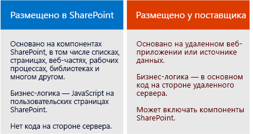

# Надстройки SharePoint

Существует два основных типа надстроек SharePoint: надстройки, размещаемые в SharePoint, и надстройки, размещаемые у поставщика. Чтобы выбрать наиболее подходящий вариант для своего сценария, сначала узнайте, что общего у обоих типов надстроек SharePoint.

> [!NOTE]
> Приложение для устройства, например мобильное приложение, — это не совсем надстройка SharePoint, даже если оно получает доступ к SharePoint. Это касается и веб-приложений, запускаемых не из SharePoint. Сведения о том, как разрабатывать приложения любого из указанных ниже типов, см. в статье [Доступ к SharePoint из мобильных и собственных приложений для устройств](http://msdn.microsoft.com/library/42014171-5ee5-421d-9cde-413efc3aecef%28Office.15%29.aspx).

- **Надстройка SharePoint — это автономный функциональный модуль**, расширяющий возможности веб-сайтов SharePoint для решения определенной бизнес-задачи.

- **Надстройки не содержат пользовательский код, выполняемый на серверах SharePoint**. Вместо этого всю пользовательскую логику перемещают в облако, на клиентские компьютеры или на локальный сервер, который не входит в ферму SharePoint или в подписку SharePoint Online. Если пользовательский код находится за пределами серверов SharePoint, администраторы SharePoint могут быть уверены, что надстройка не причинит вреда их серверам и не снизит производительность веб-сайтов SharePoint Online.

- **Бизнес-логика надстройки SharePoint может получить доступ к данным SharePoint через один из клиентских API в составе SharePoint**. Какой API нужно использовать для своей надстройки, зависит от того, каким вы разработаете это приложение.    
 
- **Практически все основные типы компонентов SharePoint могут быть частью надстройки**, в том числе страницы, списки, рабочие процессы, настраиваемые типы контента, шаблоны списков и веб-части.
    
- **Веб-сайты SharePoint, на которых установлены надстройки SharePoint и на которых пользователи запускают эти надстройки, называют хост-сайтами.** Компоненты SharePoint обычно находятся на отдельном дочернем сайте хост-сайта — сайте надстройки.   
 
- **Надстройки SharePoint можно разместить на веб-сайте SharePoint несколькими указанными ниже способами**.
    
   |||
   |:-----|:-----|
   ||**В виде иммерсивного полностраничного интерфейса**, который может выглядеть, как страница SharePoint.|
   ||**В виде части веб-страницы, то есть с использованием специального элемента управления (веб-части надстройки)**, для отображения элемента iframe, содержащего такую надстройку.|
   ||**В виде команд пользовательского интерфейса, расширяющих возможности лент и меню** для списков, документов и многих других объектов.|

-  **Для всех надстроек SharePoint, устанавливаемых пользователями, предусмотрена плитка на странице "Содержимое сайта" веб-сайта SharePoint.** Если щелкнуть плитку, запустится соответствующая надстройка.

- **Для настройки надстройки SharePoint используется _манифест надстройки_**, который представляет собой XML-файл, в котором объявлены базовые свойства надстройки, указано, где можно запускать ее и что нужно делать SharePoint при ее запуске. Кроме того, в манифесте можно указать языки, поддерживаемые надстройкой, службы и функции SharePoint, от которых она зависит, а также разрешения для хост-сайта, необходимые этой надстройке. (Надстройки SharePoint имеют полный контроль над своими сайтами надстроек.)   
 
- **Распространять надстройки SharePoint следует в пакетах надстроек**, которые всегда включают по крайней мере манифест надстройки. (Если отсутствуют компоненты SharePoint, манифест надстройки может быть единственным элементом в пакете надстройки.) Если на сайте надстройки есть компоненты SharePoint, они включаются в пакет в виде набора XML-файлов. Удаленные компоненты, размещенные за пределами SharePoint (например, удаленные веб-приложения или базы данных), не входят в пакет и развертываются отдельно от пакета надстройки. (В этом случае необходимо указать URL-адреса удаленных компонентов в манифесте надстройки.)
 
- **Кроме того, пакеты надстроек могут включать надстройки Office.** При установке надстройки SharePoint надстройка Office добавляется в каталог надстроек Office в SharePoint. Пользователи могут установить надстройку из каталога в приложениях Office, например в Word или Excel.

> [!TIP]
> **Изучите несколько надстроек SharePoint в** [Магазине Office](https://store.office.com/appshome.aspx?productgroup=SharePoint), чтобы получить представление о том, что вы можете разрабатывать. Кроме того, вы можете открыть веб-сайт SharePoint и установить бесплатные надстройки SharePoint. Просто выберите **"Содержимое сайта" > "Добавить надстройку" > "Магазин SharePoint"**.

## Несколько заметок для опытных разработчиков решений для SharePoint

Мы объявили нерекомендуемыми изолированные решения, содержащие пользовательский серверный код. Мы по-прежнему поддерживаем изолированные решения "без кода" и изолированные решения, содержащие только код JavaScript.

В надстройках SharePoint не используется серверная объектная модель SharePoint. В SharePoint значительно расширены клиентские объектные модели. Несмотря на то что некоторые API серверной объектной модели SharePoint недоступны в клиентских объектных моделях, они почти полностью принадлежат к административным или связанным с безопасностью классам. Пользовательская логика SharePoint, которая обращается к этим областям, больше подходит для сценария Windows PowerShell или классического изолированного решения для фермы SharePoint. Сведения о том, как сделать выбор между надстройками SharePoint, классическими решениями для ферм SharePoint и изолированными решениями, см. в статье [Сравнение надстроек SharePoint с решениями SharePoint](http://msdn.microsoft.com/library/0e9efadb-aaf2-4c0d-afd5-d6cf25c4e7a8%28Office.15%29.aspx).

## Два способа распространения или продажи пакета надстройки

Вы можете распространять пакеты надстроек двумя указанными ниже способами.

- **Через каталог надстроек организации**, который представляет собой выделенное семейство веб-сайтов SharePoint в локальной ферме или в подписке на SharePoint Online. Этот метод используется, если надстройка разработана для конкретной организации. 
 
- **Через [Магазин Office](https://store.office.com/appshome.aspx?productgroup=SharePoint)**. В этом случае маркетинговые операции, связанные с обнаружением, покупкой и обновлениями, выполняет магазин, а не вы. Чтобы помочь вам продавать надстройки через Магазин Office, корпорация Майкрософт предоставляет **Панель мониторинга продаж**.
    
После развертывания надстройки одним из указанных способов она станет доступной для установки на странице **добавления надстроек** веб-сайтов SharePoint. Если надстройке требуются разрешения для хост-сайта или его родительской подписки, при установке этой надстройки SharePoint запросит у пользователя эти разрешения.

Если вам потребуется обновить надстройку, чтобы исправить ошибку или добавить функцию, внесите изменения и обновите версию надстройки в ее манифесте. Затем повторно разверните пакет надстройки в магазине или каталоге надстроек. Пользователи получат уведомление о доступности обновления через пользовательский интерфейс SharePoint в течение 24 часов. Обновление можно установить одним щелчком мыши. 

## Два типа надстроек SharePoint (с размещением в SharePoint и у поставщика)

 

### Надстройки SharePoint с размещением в SharePoint

Надстройки, размещаемые в SharePoint, почти целиком состоят из компонентов SharePoint на сайте надстройки. Иногда говорят, что их центр находится в SharePoint.

Как и любые другие надстройки SharePoint, надстройку, размещаемую в SharePoint, можно запустить с помощью плитки на странице **Содержимое сайта** веб-сайта SharePoint, на котором установлена надстройка. При необходимости у надстройки могут быть компоненты пользовательского интерфейса двух других типов на хост-сайте: веб-части надстройки и дополнительные действия (пользовательские кнопки ленты или элементы меню). **Остальные компоненты надстройки, размещаемой в SharePoint, развертываются на сайте надстройки.** Эти компоненты определяются в декларативном порядке с помощью XML-файлов и могут содержать указанные ниже элементы.

||||
|:-----|:-----|:-----|
|Пользовательские страницы| Рабочие процессы|Модули (наборы файлов)|
|Шаблоны списка|Экземпляры списков и библиотек|Настраиваемые формы и представления списков|
|Настраиваемые типы контента|Веб-шаблоны|Встроенные столбцы (не настраиваемые столбцы)|
|Встроенные веб-части (не настраиваемые веб-части)|файлы JavaScript;|Настраиваемые кнопки и элементы меню для сайта надстройки|

Для всей бизнес-логики в надстройке, размещаемой в SharePoint, используется JavaScript: либо непосредственно на пользовательской странице, либо в файле JavaScript, на который указывает ссылка на пользовательской странице. Версия JavaScript объектной модели SharePoint (JSOM) создана, чтобы упростить выполнение операций создания, чтения, обновления и удаления (CRUD) данных SharePoint для надстройки.
 
Пользовательские страницы в надстройке, размещаемой в SharePoint, — это в основном страницы ASP.NET (ASPX-страницы), которые могут в декларативном порядке ссылаться на ASP.NET и встроенные элементы управления SharePoint, но не могут содержать код. Вы можете настроить элементы управления SharePoint, используя клиентскую обработку и настраиваемый JavaScript.

Код JavaScript в надстройках, размещаемых в SharePoint, может получать доступ к данным и ресурсам, находящимся за пределами сайта надстройки, с помощью любого из двух методов безопасного обхода политики одинаковых источников браузера: с использованием специальной междоменной библиотеки JavaScript или определенного класса WebProxy JavaScript. Эти методы позволяют надстройке, размещаемой в SharePoint, работать с данными на хост-сайте, в ее родительской подписке или в Интернете.

### Надстройки SharePoint, размещаемые у поставщика

Любой компонент SharePoint, который можно использовать в надстройке, размещаемой в SharePoint, можно применять и в составе надстройки, размещаемой у поставщика. Эти два типа надстроек отличаются тем, что надстройки, размещаемые у поставщика, содержат по крайней мере один удаленный компонент (например, веб-приложение, службу или базу данных), размещенный за пределами фермы SharePoint или не входящий в подписку SharePoint Online. Это может быть сервер, находящийся в той же корпоративной сети, что и ферма SharePoint или облачная служба. Внешние компоненты могут размещаться в любом стеке веб-хостинга, включая стеки Linux, Apache, MySQL и PHP (LAMP). 

> [!NOTE]
> **Поставщиком считается любой владелец сервера или облачной учетной записи.** Это может быть та же компания или организация, которая владеет фермой SharePoint или областью клиентов SharePoint Online, в которой необходимо установить надстройку. Кроме того, поставщиком может быть и разработчик надстройки. Если надстройка создается для организации, обычно она размещает надстройку на своих серверах. Если надстройка создается для нескольких организаций, скорее всего, удаленные компоненты будут размещены на сервере разработчика. Если надстройка SharePoint распространяется через Магазин Office, то необходимо размещать надстройку у разработчика, так как у него нет контактных данных покупателей надстроек. В этом случае разным экземплярам надстройки будет известен универсальный код ресурса (URI) удаленного компонента, потому что он указан в манифесте надстройки.
 
Вы можете выбрать любую платформу для размещения удаленных компонентов. Необязательно использовать стек Майкрософт. Вы можете использовать любую платформу для веб-хостинга, в том числе LAMP (Linux, сервер Apache, MySQL, PHP), MEAN (MongoDB, ExpressJS, AngularJS, Nodejs), Java, Python и другие, а также сторонние средства разработки. Кроме того, удаленные компоненты можно разместить в сторонних облачных службах.

**Вы можете сделать так, чтобы удаленные страницы в надстройке выглядели как страницы SharePoint**, использовав особый элемент управления хрома.

**К удаленным данным могут, среди прочих, относиться большие двоичные объекты, кэш, очереди сообщений, сети доставки содержимого (CDN) и базы данных**. Базы данных могут быть любых типов, в том числе релятивными и объектно-ориентированными. К удаленным данным можно получать доступ несколькими способами. Например, используя Службы Business Connectivity Services (BCS) для их включения в список SharePoint или представляя данные в сетке на странице удаленного веб-приложения.

**Надстройки SharePoint используют API SharePoint для подключения и интеграции функций SharePoint** поиска, рабочих процессов, социальных сетей, таксономии, профилей пользователей, BCS и не только. Это позволяет им считывать документы, выполнять поиск и операции CRUD, а также обеспечивать общение пользователей. Существует несколько наборов API:

- Если удаленные компоненты реализованы с помощью .NET, будет доступна библиотека **клиентской объектной модели (CSOM) SharePoint** для управляемого кода.

- Если удаленные компоненты созданы не на основе .NET, для них можно использовать набор **REST API и API OData**, который можно применять для доступа к данным SharePoint. Его также можно использовать в клиенте .NET, если вы предпочитаете работать с интерфейсом OData.

- Вам не удастся использовать упомянутую выше **библиотеку JSOM** на удаленной странице. Тем не менее надстройки, размещаемые у поставщика, могут содержать пользовательские страницы SharePoint на сайте надстройки, и в коде JavaScript этих страниц можно использовать библиотеку JSOM.

**Надстройки с размещением у поставщика, у которых есть доступ к SharePoint, такие же субъекты безопасности, как пользователи и группы**. Субъект надстройки, как и пользователь, должен пройти проверку подлинности и авторизацию. Для выполнения операций с данными SharePoint на хост-сайте надстройке требуются разрешения. В большинстве случаев эффективная реализация разрешений для пользователя, работающего с SharePoint при помощи надстройки, предусматривает применение сразу двух типов разрешений для пользователя и для надстройки. Хотя иногда при работе с надстройкой пользователь может выполнять такие действия, на которые у него нет разрешений.

**Надстройки, размещаемые у поставщика, могут подключаться к любой внутренней или общедоступной веб-службе** и, в отличие от надстроек, размещаемых в SharePoint, **обрабатывать список SharePoint и события элементов списка**, например событие добавления элемента в библиотеку документов.

## Выбор пути разработки решений для SharePoint

Готовы приступить к работе?

- **Если вы опытный разработчик решений для SharePoint, рекомендуем начать с надстроек с размещением в SharePoint.** Они больше всего похожи на те расширения SharePoint, которые вы создавали ранее.
    
    [Знакомство с созданием надстроек SharePoint с размещением в SharePoint](get-started-creating-sharepoint-hosted-sharepoint-add-ins.md)
     
- **Если вы опытный разработчик веб-приложений на базе ASP.NET, рекомендуем начать с надстроек, размещаемых у поставщика.** Они создаются на основе веб-приложений.
    
    [Знакомство с созданием надстроек SharePoint с размещением у поставщика](get-started-creating-provider-hosted-sharepoint-add-ins.md)
    
- **Если вы хотите разработать надстройку, размещаемую у поставщика, в стеке, отличном от стека Майкрософт, выполните указанные ниже действия.**
    
   -  Установите средства, соответствующие используемому вами стеку (если их у вас еще нет).
 
   - Получите учетную запись разработчика в Office 365 для тестирования и отладки. Дополнительные сведения см. в статье [Настройка среды для разработки надстроек SharePoint в Office 365](set-up-a-development-environment-for-sharepoint-add-ins-on-office-365.md). Если у вас уже есть подписка на Office 365, вам нужно просто [создать с ее помощью Сайт разработчика](create-a-developer-site-on-an-existing-office-365-subscription.md).
    
   - Для выполнения операций CRUD над данными в SharePoint ваша надстройка будет использовать REST API или API OData в SharePoint.
    
     - Разъяснения см. в статье [Знакомство со службой REST SharePoint](get-to-know-the-sharepoint-rest-service.md) и в других статьях, на которые в ней есть ссылки.
     - Справочную документацию см. в статье [Справочная документация REST API для SharePoint](http://msdn.microsoft.com/library/3514e753-19f9-4b41-a1ae-f35c5ffc17d2%28Office.15%29.aspx).
 
   - Если вы не используете Visual Studio, вам потребуется создать файл манифеста надстройки и пакет надстройки. Дополнительные сведения см. в статье [Изучение структуры манифеста приложения и пакета надстройки SharePoint](explore-the-app-manifest-structure-and-the-package-of-a-sharepoint-add-in.md). Вы сэкономите много времени, если при создании манифеста и пакета вы будете использовать Visual Studio и "Инструменты разработчика Microsoft Office для Visual Studio". Рекомендуем иметь их в виду, даже если для создания удаленного веб-приложения вы используете другое средство. Выпуск [Visual Studio Community Edition](https://www.visualstudio.com/news/vs2013-community-vs.aspx) — бесплатный.

   - В [разделе OfficeDev на GitHub](https://github.com/OfficeDev) есть примеры надстроек, размещаемых у поставщика, для ряда языков и платформ сторонних разработчиков. Пример: [PHP-App-for-SharePoint](https://github.com/OfficeDev/PHP-App-for-SharePoint).

> [!NOTE]
> Начинающим разработчикам надстроек SharePoint и веб-сайтов рекомендуем начать с бесплатного курса в Microsoft Virtual Academy или изучить книгу о разработке решений для SharePoint.

## См. также

[Быстрое начало разработки основных решений для Microsoft SharePoint Server 2013](http://www.microsoftvirtualacademy.com/training-courses/developing-microsoft-sharepoint-server-core-solutions-jump-start)
