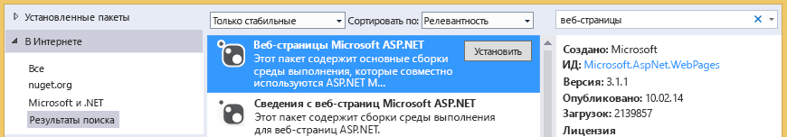

# Устранение неполадок библиотек документовTroubleshooting document libraries
В этой статье описываются проблемы, которые могут возникнуть при доступе к библиотеке документов SharePoint из облачной бизнес-надстройки, а также способы их устранения.In this topic, you can learn about problems that may occur when you access a SharePoint document library from a cloud business add-in and the techniques that you can use to resolve those problems.
 

 **Примечание.** В настоящее время идет процесс замены названия "приложения для SharePoint" названием "надстройки SharePoint". Во время этого процесса в документации и пользовательском интерфейсе некоторых продуктов SharePoint и средств Visual Studio может по-прежнему использоваться термин "приложения для SharePoint". Дополнительные сведения см. в статье [Новое название приложений для Office и SharePoint](new-name-for-apps-for-sharepoint.md#bk_newname).**Note**  The name "apps for SharePoint" is changing to "SharePoint Add-ins". During the transition, the documentation and the UI of some SharePoint products and Visual Studio tools might still use the term "apps for SharePoint". For details, see  [New name for apps for Office and SharePoint](new-name-for-apps-for-sharepoint.md#bk_newname).
 

 

## Ошибка: эта надстройка не поддерживает отправку документов из текущего браузераError: This add-in does not support uploading documents from your current browser

При попытке отправить документ в связанную библиотеку документов из облачной бизнес-надстройки, отображается сообщение об ошибке "Эта надстройка не поддерживает отправку документов из текущего браузера. Используйте последнюю версию". Эта проблема возникает только в определенных старых браузерах, которые не поддерживают API-интерфейс FileReader HTML5. Чтобы ее устранить, добавьте в проект пакет NuGet и повторно разверните надстройку.When attempting to upload a document to an associated document library in a cloud business add-in, the upload fails with the error message "This add-in does not support uploading documents from your current browser. Please use the latest version". This issue only occurs on certain older browsers that don't support the HTML5 FileReader API. It can be fixed by adding a NuGet package to your project and redeploying the add-in.
 

 

### Как избежать этой ошибкиTo prevent the error

1. В **обозревателе решений** откройте контекстное меню проекта **Сервер** и выберите пункт **Управление пакетами NuGet**.In  **Solution Explorer**, open the shortcut menu for the  **Server** project and choose **Manage NuGet Packages**.
    
 
2. В диалоговом окне **Управление пакетами NuGet** разверните узел **В сети**, а затем в поле **Поиск в сети** укажите веб-страницы, как показано на рисунке 1.In the  **Manage NuGet Packages** dialog box, expand the **Online** node, and then in the **Search Online** box enter web pages, as shown in Figure 1.
    
    **Рисунок 1. Параметры, выбранные в диалоговом окне "Управление пакетами NuGet"****Figure 1. Selections in the Manage NuGet Packages dialog box**

 

  
 

 

 
3. В списке результатов выберите **Веб-страницы Microsoft ASP.NET**, а затем нажмите кнопку **Установить**.In the list of results, choose  **Microsoft ASP.NET Web Pages**, and then choose the  **Install** button.
    
    Откроется диалоговое окно **Согласие с условиями лицензионного соглашения**.The  **License Acceptance** dialog box opens.
    
 
4. В диалоговом окне **Согласие с условиями лицензионного соглашения** изучите условия лицензионного соглашения и нажмите кнопку **Принимаю**, если вы принимаете их.In the  **License Acceptance** dialog box, review the license terms, and if you agree to the terms choose the **I Accept** button.
    
 
5. По завершении установки пакета нажмите кнопку **Закрыть**.When the package finishes installing, choose the  **Close** button.
    
 
6. Опубликуйте обновленную надстройку на сайте SharePoint.Publish the updated add-in to your SharePoint site.
    
 

## Дополнительные ресурсыAdditional resources

-  [Сопоставление библиотеки документов с объектомAssociate a document library with an entity](associate-a-document-library-with-an-entity.md)
    
 

