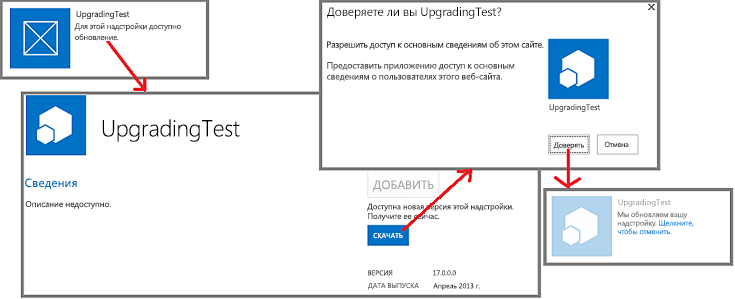
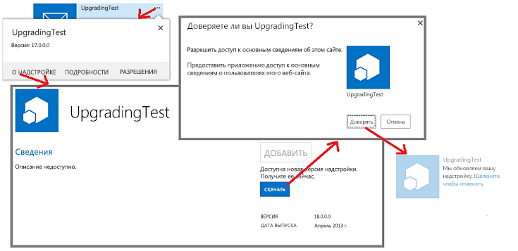

# Обновление надстроек SharePointUpdate SharePoint Add-ins

Вы можете обновить свою надстройку SharePoint, используя встроенную в SharePoint систему обновления.You can update your SharePoint Add-in by using the updating support built into SharePoint. В течение 24 часов после отправки обновленной версии надстройки в каталог надстроек организации или приема надстройки в Магазин Office рядом с надстройкой на странице **Контент сайта** каждого веб-сайта, на котором она установлена, появится уведомление о доступном обновлении.You can update your SharePoint Add-in by using the updating support built into SharePoint. Within 24 hours after you upload an updated version of the add-in to the organization's add-in catalog or the add-in is accepted at the Office Store, a notification that an update is available appears next to the add-in on  **Site Contents** page of every website where it is installed. As you can see in Figure 1, a link is provided for users to immediately install the update. Как видно на рисунке 1, пользователи могут немедленно установить обновление по предоставленной ссылке.As you can see in Figure 1, a link is provided for users to immediately install the update.
 
*Рис. 1. Процесс обновления надстройки SharePoint**Figure 1. Add-in for SharePoint update process*

 
Пользователь может установить обновление, не удаляя предыдущую версию. Инфраструктура обновления проверяет установку обновления и выполняет ее откат в случае каких-либо ошибок.A user can install the update without first uninstalling the earlier version. The update infrastructure tests the update installation and rolls it back if there are any errors.
 
> [!IMPORTANT]
> С помощью системы обновления нельзя изменить *тип надстройки*.You cannot change the *add-in type* by using the update system. Например, надстройку с размещением в SharePoint нельзя преобразовать в надстройку с размещением у поставщика.For example, you cannot change an add-in from SharePoint-hosted to provider-hosted with an update. Чтобы изменить тип, необходимо [перенести данные из старой надстройки в новую](sharepoint-add-ins-update-process.md#Major).To make a change of type, you need to [migrate from an old add-in to a new one](sharepoint-add-ins-update-process.md#Major). В частности, так как [программа тестирования надстроек с автоматически размещением закрыта](http://blogs.office.com/2014/05/16/update-on-autohosted-apps-preview-program/.md), надстройку с автоматически размещением нельзя обновить до надстройки с размещением у поставщика.In particular, because [the preview program for autohosted add-ins has been closed](http://blogs.office.com/2014/05/16/update-on-autohosted-apps-preview-program/.md), you should be aware that you cannot update an autohosted add-in to a provider-hosted add-in. Преобразуйте надстройку согласно инструкциям в [этой статье](convert-an-autohosted-sharepoint-add-in-to-a-provider-hosted-add-in.md).You have to convert the add-in as explained in [Convert an autohosted SharePoint Add-in to a provider-hosted add-in](convert-an-autohosted-sharepoint-add-in-to-a-provider-hosted-add-in.md).

## Необходимые условия для обновления надстройки SharePointPrerequisites for updating a SharePoint Add-in

Для обновления надстройки SharePoint необходимы вот какие компоненты:Before you update a SharePoint Add-in, you need:

- Тестовая установка SharePoint, которая поддерживает изоляцию.A test SharePoint installation that is configured for add-in isolation. Инструкции по настройке Сайта разработчика Office 365 см. в статье [Настройка среды для разработки надстроек SharePoint в Office 365](set-up-a-development-environment-for-sharepoint-add-ins-on-office-365.md).For instructions about how to set up an Office 365 Developer Site, see [Set up a development environment for SharePoint Add-ins on Office 365](set-up-a-development-environment-for-sharepoint-add-ins-on-office-365.md).

- Инструменты, используемые для создания надстройки SharePoint, которые, как правило, также используются для ее обновления.Tools that are used in creating a SharePoint Add-in are usually also used in updating it. For example, most developers use Visual Studio and Microsoft Office Developer Tools for Visual Studio to create SharePoint Add-ins. Например, для создания надстроек SharePoint многие разработчики используют Visual Studio и Инструменты разработчика Microsoft Office для Visual Studio.Tools that are used in creating a SharePoint Add-in are usually also used in updating it. For example, most developers use Visual Studio and Microsoft Office Developer Tools for Visual Studio to create SharePoint Add-ins.

### Основные понятия, касающиеся обновления надстройки SharePointCore concepts to know to update a SharePoint Add-in

Прежде чем обновлять надстройку, ознакомьтесь с понятиями в приведенной ниже таблице.Review the concepts in the following table before updating your add-in.

**Таблица 1. Основные понятия, касающиеся обновления надстроек SharePoint****Table 1. Core concepts for updating a SharePoint Add-in**

|**Название статьи****Article title**|**Описание****Description**|
|:-----|:-----|
| [Выбор шаблонов для разработки и размещения надстройки SharePointChoose patterns for developing and hosting your SharePoint Add-in](choose-patterns-for-developing-and-hosting-your-sharepoint-add-in.md)|Сведения о различных типах надстроек SharePoint. Процесс обновления для разных типов отличается.Learn about the different types of SharePoint Add-ins. The updating process varies depending on the type.|
| [Процесс обновления надстроек SharePointSharePoint Add-ins update process](sharepoint-add-ins-update-process.md)|Описание процесса обновления надстроек SharePoint.Learn about the process for updating SharePoint Add-ins.|
| [Обновление компонентовUpgrading Features](http://msdn.microsoft.com/library/e917f709-6491-4d50-adbe-2ab8f35da990%28Office.15%29.aspx)|Узнайте, как обновлять компоненты (пакет SDK SharePoint 2010).Learn how to update Features (SharePoint 2010 SDK).|
| [Развертывание и установка надстроек SharePoint: методы и параметрыDeploying and installing SharePoint Add-ins: methods and options](deploying-and-installing-sharepoint-add-ins-methods-and-options.md)|Сведения о методах публикации, установки и удаления надстроек SharePoint.Learn about the methods for publishing, installing, and uninstalling a SharePoint Add-in.|
| [Обработка событий в надстройках SharePointHandle events in SharePoint Add-ins](handle-events-in-sharepoint-add-ins.md)|Сведения о приемниках удаленных событий в SharePoint.Learn about remote event receivers in SharePoint.|

## Основные шаги по обновлению надстройкиMajor steps in updating an add-in

Ниже описаны основные шаги по созданию обновления для надстройки SharePoint.The following are the major steps that may be needed when you create an update for a SharePoint Add-in. Каждый шаг подробно описан в разделах или статьях, на которые указывают ссылки.Each step is discussed in detail in linked sections or articles. Не все они являются обязательными в каждом проекте обновления.Not all the steps are required in every update project. Необходимые действия зависят от того, какие компоненты уже содержатся в надстройке, а какие нужно добавить.What you must do depends on what components are already in your add-in and what components you are adding. Обязательными являются только действия, отмеченные знаком `**`.Only the items marked with `**` are always required.

- Обновите манифест надстройки.Update the add-in manifest.

   - `**` Увеличьте номер **Version** в элементе [App](http://msdn.microsoft.com/library/d5f30dfe-7500-5f85-0f08-f4f220c0c692%28Office.15%29.aspx) файла appmanifest.xml (в первом выпуске схемы надстройки назывались "приложениями").***** Raise the **Version** number in the App element of the appmanifest.xml file. (Add-ins were called "apps" when the schema was first released.) Do [not](http://msdn.microsoft.com/library/d5f30dfe-7500-5f85-0f08-f4f220c0c692%28Office.15%29.aspx)  change the ProductID number. *Не* изменяйте номер **ProductID**.Do *not* change the **ProductID** number.
   
   - Измените раздел [AppPermissionRequests](http://msdn.microsoft.com/library/4e617622-78d3-3d23-677d-9957eb1fb107%28Office.15%29.aspx) файла appmanifest.xml.Change the  [AppPermissionRequests](http://msdn.microsoft.com/library/4e617622-78d3-3d23-677d-9957eb1fb107%28Office.15%29.aspx) section of the appmanifest.xml file.
   
   - Измените раздел [AppPrerequisites](http://msdn.microsoft.com/library/7622b55f-01a1-2c39-9daa-7cfb1a3c890f%28Office.15%29.aspx) файла appmanifest.xml.Change the  [AppPrerequisites](http://msdn.microsoft.com/library/7622b55f-01a1-2c39-9daa-7cfb1a3c890f%28Office.15%29.aspx) section of the appmanifest.xml file.
    
   Дополнительные сведения см. в разделе [Обновление версии надстройки, запросов разрешений и необходимых условий](#UpdateManifest).For more information, see  [Update the add-in version, permission requests, and prerequisites](#UpdateManifest).

- Добавьте или обновите разметку для компонентов сайта надстройки.Add or update the markup for add-in web components. For more information, see  Update add-in web components in SharePoint. Дополнительные сведения см. в статье [Обновление компонентов сайта с надстройкой в SharePoint](update-add-in-web-components-in-sharepoint.md).Add or update the markup for add-in web components. For more information, see  [Update add-in web components in SharePoint](update-add-in-web-components-in-sharepoint.md).

- Добавьте или обновите разметку для компонентов хост-сайта.Add or update the markup for host web components. For more information, see  Update host web components in SharePoint. Дополнительные сведения см. в статье [Обновление компонентов хост-сайта с надстройкой в SharePoint](update-host-web-components-in-sharepoint.md).Add or update the markup for host web components. For more information, see  [Update host web components in SharePoint](update-host-web-components-in-sharepoint.md).

- Добавьте пользовательскую логику в [UpgradedEventEndpoint](http://msdn.microsoft.com/library/09a93d44-d295-47bb-f91c-d243178b0f53%28Office.15%29.aspx) и зарегистрируйте ее в файле appmanifest.xml.Add custom logic to an [UpgradedEventEndpoint](http://msdn.microsoft.com/library/09a93d44-d295-47bb-f91c-d243178b0f53%28Office.15%29.aspx) and register it in the appmanifest.xml file. For more information, see How to: Create an UpgradedEventEndpoint handler for SharePoint 2013. Дополнительные сведения см. в статье [Создание обработчика для события обновления надстройки SharePoint](create-a-handler-for-the-update-event-in-sharepoint-add-ins.md).Add custom logic to an  UpgradedEventEndpoint and register it in the appmanifest.xml file. For more information, see [Create a handler for the update event in SharePoint Add-ins](create-a-handler-for-the-update-event-in-sharepoint-add-ins.md).
    
- Обновите удаленные компоненты.Update the remote components:
    
   - Для надстройки с размещением у поставщика обновите удаленные компоненты с помощью методов, соответствующих платформам, которые используются для размещения.For a provider-hosted add-in, update the remote components using the techniques appropriate for the hosting platform stack. 
   
   Дополнительные сведения см. в статье [Обновление удаленных компонентов в надстройках SharePoint](update-remote-components-in-sharepoint-add-ins.md).For more information, see  [Update remote components in SharePoint Add-ins](update-remote-components-in-sharepoint-add-ins.md).
    
- `**` Отправьте пакет надстройки в Магазин Office или каталог надстроек организации.`**`***** Upload the add-in package to the Office Store or the organization's add-in catalog.

## Рекомендации по обновлению надстроекBest practices for add-in updates

В следующих разделах рассматриваются процедуры, которым нужно следовать, и важные вопросы, на которые следует обратить внимание при планировании обновления.The following sections discuss practices you should follow and important points to consider as you are planning an update.

### Решите, действительно ли нужно обновлениеDecide whether you really have to update

Улучшить надстройку SharePoint с размещением у поставщика можно и без обновления.For a provider-hosted SharePoint Add-in, improvements to the add-in do not necessarily require updating the add-in. Если изменения касаются только удаленных компонентов и не должны отражаться в компонентах SharePoint, можно изменить удаленные компоненты, не обновляя надстройку.If all the changes are to remote components, and those changes don't have to be reflected in SharePoint components, you can change the remote components without updating the add-in. Если URL-адреса и строки, используемые компонентами SharePoint для доступа к удаленным компонентам, не изменяются, надстройка SharePoint продолжает работать.As long as the URLs and connection strings that the SharePoint components use to access the remote components do not change, the SharePoint Add-in continues to work. 

Допустим, вы добавили кнопку в удаленное веб-приложение, которая считывает столбец из нового списка SharePoint.For example, suppose that you add a button to a remote web application that reads a column from a SharePoint list that the web application did not previously read. Если столбец уже существует в списке, вам не нужно ничего менять в SharePoint.If the column already exists on the list, you do not have to change anything in SharePoint. Вы можете отправить измененную веб-страницу, измененный код или данные JavaScript в удаленное веб-приложение.You can upload the revised webpage, and the revised code-behind or JavaScript, to the remote web application. Новые функции мгновенно станут доступны пользователям при запуске надстройки SharePoint.The new functionality is immediately available to users when they start the SharePoint Add-in.

### Помните, что обновление не является обязательным для пользователейRemember that updating is optional for users

Когда новая версия надстройки SharePoint становится доступна в Магазине Office или каталоге надстроек организации, на плитке надстройки на странице **Контент сайта** появляется сообщение о доступном обновлении.When a new version of your SharePoint Add-in becomes available in the Office Store or the organization's add-in catalog, a message appears on the add-in's tile on the **Site Contents** page informing users that an update is available. Оно появляется в течение 24 часов.It takes no more than 24 hours for this message to appear. Но обновление не является обязательным.But nothing in the SharePoint infrastructure forces users to update. Поэтому изменения, которые вы вносите в удаленные компоненты, не должны нарушать работу предыдущих версий надстройки.So changes that you make to remote components must not break the older versions of the add-in. Общее, но не универсальное, правило гласит: *добавляйте* новые элементы в удаленные компоненты, но не удаляйте, не переименовывайте, не перемещайте и не изменяйте схему, строку подключения или URL-адрес существующего компонента.A general, but not quite universal, rule is that you should *add* things to remote components, but avoid deleting, renaming, moving, or changing the schema, connection string, or URL of any existing component.

Если удаленному компоненту нужна версия экземпляра надстройки, который его вызывает, вы можете отправить эти сведения из SharePoint.If a remote component needs to know the version of the add-in instance that is calling it, you can pass this information from SharePoint. For example, you can add the add-in version as a query parameter on the  StartPage URL of the add-in. Например, можно добавить версию надстройки как параметр запроса в URL-адрес элемента [StartPage](http://msdn.microsoft.com/library/3092674c-a6c3-9021-3d7e-e716562a4a4f%28Office.15%29.aspx) надстройки.If a remote component needs to know the version of the add-in instance that is calling it, you can pass this information from SharePoint. For example, you can add the add-in version as a query parameter on the  [StartPage](http://msdn.microsoft.com/library/3092674c-a6c3-9021-3d7e-e716562a4a4f%28Office.15%29.aspx) URL of the add-in.

### Создайте и отладьте новую версию, как будто это новая надстройкаCreate and debug the new version as if it were a brand new add-in

Следует отделять разработку и отладку новой версии надстройки от отладки разметки и логики обновления. Для этого удалите предыдущую версию надстройки из тестового сайта SharePoint для разработки. Сохраните резервную копию файла пакета надстройки для предыдущей версии. Необходимым образом добавьте и измените компоненты надстройки, а затем проверьте и отладьте их с использованием тестового сайта, как будто это новая надстройка, созданная с нуля.You should separate the development and debugging of the new version of the add-in from the debugging of the update markup and logic. To do this, uninstall the earlier version of the add-in from your development test SharePoint site. Save a backup copy of the add-in package file for the earlier version. Add and change components of the add-in as needed, and then test and debug them against the test site as if it is a brand new add-in you are creating from scratch.

### Протестируйте обновление с каждой предыдущей версией надстройкиTest the update with each earlier version of the add-in

Когда новая версия надстройки будет правильно работать как "новая" надстройка, измените код и разметку так, чтобы проект представлял собой обновление старой надстройки.When the new version of the add-in is functioning correctly as a "new" add-in, restructure the code and markup so that the project is an update of the old add-in. For example, increment the add-in version number as indicated in Major steps in updating an add-in. For more information about turning the project into an update, see the child topics of this topic. Например, увеличьте номер версии надстройки, как указано в разделе [Основные шаги по обновлению надстройки](#MajorAppUpgradeSteps).For example, increment the add-in version number as indicated in [Major steps in updating an add-in](#MajorAppUpgradeSteps). Дополнительные сведения о преобразовании проекта в обновление см. в разделах этой статьи.For more information about turning the project into an update, see the child topics of this topic.

Когда вы будете готовы проверить свое обновление, уберите новую версию с тестового сайта и повторно разверните предыдущую версию, чтобы проверить логику обновления.When you are ready to test your update, retract the new version from the test site and redeploy the earlier version so you can test update logic. Если существует несколько предыдущих версий надстройки, установите каждую из них на отдельный дочерний веб-сайт тестового сайта.If you have shipped multiple previous versions of the add-in, install each earlier version on a different subweb of your test site. Затем отправьте последнюю версию надстройки в каталог надстроек тестового сайта и обновите каждый экземпляр надстройки.Then upload the latest version of the add-in to your test site's add-in catalog and update every instance of the add-in. Убедитесь, что каждый из них имеет последний номер версии и новейшие версии всех компонентов.Verify that each has the latest add-in version number and the latest version of all components. Если в надстройке используется сайт надстройки, убедитесь, что его компоненты развернуты в соответствии с процедурой, описанной в разделе [Проверка развертывания веб-компонентов надстройки](update-add-in-web-components-in-sharepoint.md#VerifyDeployAppWebComp).If there is an add-in web in the add-in, verify that the add-in web components have been deployed by using the procedure in [Verify deployment of add-in web components](update-add-in-web-components-in-sharepoint.md#VerifyDeployAppWebComp).

### Обновите надстройку раньше чем через 24 часаUpdate an add-in without waiting 24 hours

Разрабатывая обновление для надстройки на тестовом сайте SharePoint, нет смысла ждать 24 часа между обновлениями.When developing an update for an add-in on your SharePoint test site, it is impractical to wait 24 hours between updates. You (and users on a production SharePoint site) can update an add-in immediately after it is uploaded to the spstore or the organization's add-in catalog with these steps: Вы (и пользователи производственного сайта SharePoint) можете обновить надстройку сразу после ее отправки в Магазин Office или каталог надстроек организации. Для этого выполните указанные ниже действия.When developing an update for an add-in on your SharePoint test site, it is impractical to wait 24 hours between updates. You (and users on a production SharePoint site) can update an add-in immediately after it is uploaded to the Office Store or the organization's add-in catalog with these steps:

#### Немедленное обновление надстройкиTo immediately update an add-in

1. Отправив последнее обновление в каталог надстроек, откройте страницу **Контент сайта** на веб-сайте, на котором установлена надстройка, и нажмите кнопку **...** на плитке надстройки.After the latest update is uploaded to the add-in catalog, open the  **Site Contents** page on the website where the add-in is installed and choose the **...** button on the add-in's tile.

2. В появившейся выноске выберите вкладку **О программе**. На открывшейся странице **О программе** отобразится сообщение о доступности новой версии.On the callout that opens, choose the  **About** tab. On the **About** page that opens, there is a notice that a new version is available.

3. Нажмите кнопку **Получить**.Select the **Get It** button. Снова откроется страница **Контент сайта**, а на плитке надстройки появится сообщение о текущем обновлении надстройки.Choose the  Get It button. The **Site Contents** page reopens, and there is a notice on the add-in's tile that the add-in is being updated.

Эти действия показаны на рисунке 2.Figure 2 illustrates these steps.

*Рис. 2. Процесс мгновенного обновления надстройки SharePoint**Figure 2. Process of immediately updating a SharePoint Add-in*

> [!NOTE]
> Чтобы сообщение о доступности обновления на плитке надстройки отображалось чаще, чем каждые 24 часа, вы можете использовать метод, описанный в статье [Процесс обновления надстройки SharePoint](sharepoint-add-ins-update-process.md#Minor), чтобы оно появлялось мгновенно.If you need to see the "update available" notice on the add-in's tile more frequently than every 24 hours, you can use the method described in [Update process for a SharePoint Add-in](sharepoint-add-ins-update-process.md#Minor) to make the notice appear immediately.

## Обновление версии надстройки, запросов разрешений и необходимых условийUpdate the add-in version, permission requests, and prerequisites

Создав резервную копию папки проекта Visual Studio, откройте проект надстройки.After making a backup copy of the Visual Studio project folder, open the add-in project. Open add-in manifest and raise the version number on the  General tab of the manifest designer. Откройте манифест надстройки и на вкладке **Общие** конструктора манифеста увеличьте номер версии.After making a backup copy of the vsnv project folder, open the add-in project. Open add-in manifest and raise the version number on the **General** tab of the manifest designer.

Если обновленной версии надстройки требуется больше (или меньше) разрешений для компонентов хост-сайта, внесите необходимые изменения в разделе надстройки [AppPermissionRequests](http://msdn.microsoft.com/library/4e617622-78d3-3d23-677d-9957eb1fb107%28Office.15%29.aspx).If the updated version of the app needs more (or fewer) permissions to components of the host web, make changes as needed to the [AppPermissionRequests](http://msdn.microsoft.com/library/4e617622-78d3-3d23-677d-9957eb1fb107%28Office.15%29.aspx) section of the app. In vsdev11short, use the Permissions tab of the manifest designer. В Visual Studio откройте вкладку **Разрешения** конструктора манифеста.In Visual Studio, use the **Permissions** tab of the manifest designer. 

После обновления надстройки пользователю всегда предлагается предоставить разрешения, независимо от того, изменились ли они по сравнению с предыдущей версией.When an add-in is updated, the user is always prompted to grant permissions, whether the permissions have changed or not since the previous version. Если в новой версии требуется *меньше* разрешений по сравнению с предыдущей, дополнительные разрешения *не отзываются*.If the new version requests *fewer* permissions than the preceding version, the additional permissions of the preceding version *are not revoked*. Чтобы отозвать эти разрешения, после обновления надстройки пользователь должен перейти на страницу *{SharePointDomain}* `/_layouts/15/appinv.aspx` и вручную ввести разрешения, соответствующие схеме [AppPermissionRequests](http://msdn.microsoft.com/library/4e617622-78d3-3d23-677d-9957eb1fb107%28Office.15%29.aspx).The only way to restrict the add-in to the permissions that the latest version needs is for a user to open the page *{SharePointDomain}* `/_layouts/15/appinv.aspx` after the add-in has been updated, and then manually enter permission markup that conforms to the [AppPermissionRequests](http://msdn.microsoft.com/library/4e617622-78d3-3d23-677d-9957eb1fb107%28Office.15%29.aspx) schema.

Если обновленной версии надстройки требуются определенные компоненты, которых не было в предыдущей версии (или отсутствуют компоненты, которые были в предыдущей версии), внесите необходимые изменения в разделе надстройки [AppPrerequisites](http://msdn.microsoft.com/library/7622b55f-01a1-2c39-9daa-7cfb1a3c890f%28Office.15%29.aspx).If the updated version of the add-in has prerequisites that the earlier versions did not have (or no longer has some prerequisites that earlier versions had), make changes as needed to the  [AppPrerequisites](http://msdn.microsoft.com/library/7622b55f-01a1-2c39-9daa-7cfb1a3c890f%28Office.15%29.aspx) section of the add-in. In Visual Studio, use the Prerequisites tab of the manifest designer. В Visual Studio откройте вкладку **Необходимые компоненты** в конструкторе манифеста.In Visual Studio, use the **Prerequisites** tab of the manifest designer.

## Дальнейшие действияNext steps

Перейдите к следующему пункту в разделе [Основные шаги по обновлению надстройки](#MajorAppUpgradeSteps) или непосредственно к одной из следующих статей:Continue with the next bullet in the section  [Major steps in updating an add-in](#MajorAppUpgradeSteps) or go directly to one of the following articles:

-  [Обновление компонентов сайта надстройки в SharePointUpdate add-in web components in SharePoint](update-add-in-web-components-in-sharepoint.md)
-  [Обновление компонентов хост-сайта в SharePointUpdate host web components in SharePoint](update-host-web-components-in-sharepoint.md)
-  [Создание обработчика для события обновления надстройки SharePointCreate a handler for the update event in SharePoint Add-ins](create-a-handler-for-the-update-event-in-sharepoint-add-ins.md)
-  [Обновление удаленных компонентов в надстройках SharePoint](update-remote-components-in-sharepoint-add-ins.md) [Update remote components in SharePoint Add-ins](update-remote-components-in-sharepoint-add-ins.md)
    
## Дополнительные ресурсыAdditional resources

-  [Разработка надстроек SharePointDevelop SharePoint Add-ins](develop-sharepoint-add-ins.md)
-  [Процесс обновления надстроек SharePointSharePoint Add-ins update process](sharepoint-add-ins-update-process.md) 
    
 

