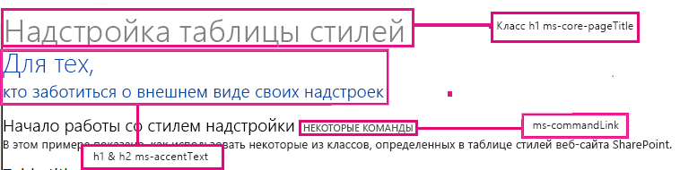
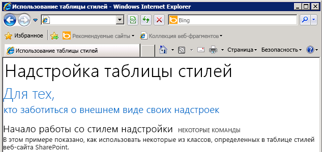

# <a name="use-a-sharepoint-websites-style-sheet-in-sharepoint-add-ins"></a><span data-ttu-id="cc887-103">Использование таблицы стилей веб-сайта SharePoint в надстройках SharePoint</span><span class="sxs-lookup"><span data-stu-id="cc887-103">Use a SharePoint website's style sheet in SharePoint Add-ins</span></span>

<span data-ttu-id="cc887-p101">Вы можете ссылаться на таблицу стилей веб-сайта SharePoint в вашей надстройке SharePoint и использовать ее для настройки стиля ваших веб-страниц с помощью таблицы стилей в SharePoint. Кроме того, если кто-либо изменяет таблицу стилей или тему веб-сайта SharePoint, то вы сможете применить новый набор стилей, не меняя ссылку на таблицу стилей в вашей надстройке.</span><span class="sxs-lookup"><span data-stu-id="cc887-p101">You can reference the style sheet of a SharePoint website in your SharePoint Add-in and use it to style your webpages by using the style sheet in SharePoint. In addition, if someone changes the SharePoint website's style sheet or theme, you can adopt the new set of styles in your add-in without modifying the style sheet reference in your add-in.</span></span>
 
> [!IMPORTANT] 
> <span data-ttu-id="cc887-106">Если на ваших веб-страницах используется элемент управления хрома или эталонная страница надстройки, стили уже доступны и ссылаться на таблицу стилей вручную, используя инструкции из этой статьи, не требуется.</span><span class="sxs-lookup"><span data-stu-id="cc887-106">If your webpages use the chrome control or the add-in master page, the styles are already available for you to use, and you don’t have to reference the style sheet manually by using the procedure in this article.</span></span> 
 
<span data-ttu-id="cc887-107"><a name="SP15Usestylesheetcontrol_Prereq"> </a></span><span class="sxs-lookup"><span data-stu-id="cc887-107"></span></span>

## <a name="prerequisites-for-using-the-examples-in-this-article"></a><span data-ttu-id="cc887-108">Необходимые условия для использования примеров в этой статье</span><span class="sxs-lookup"><span data-stu-id="cc887-108">Prerequisites for using the examples in this article</span></span>

<span data-ttu-id="cc887-109">Вам необходима среда разработки, описанная в разделе [Два типа надстроек SharePoint (с размещением в SharePoint и у поставщика)](sharepoint-add-ins.md#two-types-of-sharepoint-add-ins-sharepoint-hosted-and-provider-hosted).</span><span class="sxs-lookup"><span data-stu-id="cc887-109">You need a development environment as explained in [Two types of SharePoint Add-ins: SharePoint-hosted and provider-hosted](sharepoint-add-ins.md#two-types-of-sharepoint-add-ins-sharepoint-hosted-and-provider-hosted).</span></span>

### <a name="core-concepts-to-know-before-using-the-sharepoint-style-sheet-in-a-sharepoint-add-in"></a><span data-ttu-id="cc887-110">Ключевые понятия, с которыми необходимо ознакомиться перед использованием таблицы стилей SharePoint в надстройке SharePoint</span><span class="sxs-lookup"><span data-stu-id="cc887-110">Core concepts to know before using the SharePoint style sheet in a SharePoint Add-in</span></span>

<span data-ttu-id="cc887-111">Ниже перечислены полезные статьи, в которых описано, как использовать таблицы стилей SharePoint.</span><span class="sxs-lookup"><span data-stu-id="cc887-111">The following table lists useful articles that can help you understand the concepts involved in a scenario that uses the SharePoint style sheet.</span></span>

|<span data-ttu-id="cc887-112">**Название статьи**</span><span class="sxs-lookup"><span data-stu-id="cc887-112">**Article title**</span></span>|<span data-ttu-id="cc887-113">**Описание**</span><span class="sxs-lookup"><span data-stu-id="cc887-113">**Description**</span></span>|
|:-----|:-----|
| [<span data-ttu-id="cc887-114">Надстройки SharePoint</span><span class="sxs-lookup"><span data-stu-id="cc887-114">SharePoint Add-ins</span></span>](sharepoint-add-ins.md)|<span data-ttu-id="cc887-115">Сведения о новой модели надстроек в SharePoint, с помощью которой можно создавать надстройки — небольшие и удобные в использовании решения для пользователей.</span><span class="sxs-lookup"><span data-stu-id="cc887-115">Learn about the new add-in model in SharePoint that enables you to create add-ins, which are small, easy-to-use solutions for end users.</span></span>|
| [<span data-ttu-id="cc887-116">Разработка пользовательского интерфейса для надстроек SharePoint</span><span class="sxs-lookup"><span data-stu-id="cc887-116">UX design for SharePoint Add-ins</span></span>](ux-design-for-sharepoint-add-ins.md)|<span data-ttu-id="cc887-117">Сведения о параметрах и вариантах построения пользовательского интерфейса при создании надстроек SharePoint.</span><span class="sxs-lookup"><span data-stu-id="cc887-117">Learn about the user experience (UX) options and alternatives that you have when building SharePoint Add-ins.</span></span>|
| [<span data-ttu-id="cc887-118">Хост-сайты, сайты надстроек и компоненты SharePoint в SharePoint</span><span class="sxs-lookup"><span data-stu-id="cc887-118">Host webs, add-in webs, and SharePoint components in SharePoint</span></span>](host-webs-add-in-webs-and-sharepoint-components-in-sharepoint.md)|<span data-ttu-id="cc887-p102">Изучите различия между хост-сайтами и сайтами надстроек. Узнайте, какие компоненты SharePoint можно включать в надстройку для SharePoint, какие компоненты необходимо разворачивать на хост-сайте, а какие на сайте надстройки, и как выполнить развертывание сайта надстройки в изолированном домене.</span><span class="sxs-lookup"><span data-stu-id="cc887-p102">Learn about the difference between host webs and add-in webs. Find out which SharePoint components can be included in a SharePoint Add-in, which components are deployed to the host web, which components are deployed to the add-in web, and how the add-in web is deployed in an isolated domain.</span></span>|

<span data-ttu-id="cc887-121"><a name="SP15Usestylesheetcontrol_Example"> </a></span><span class="sxs-lookup"><span data-stu-id="cc887-121"></span></span>

## <a name="code-example-use-a-sharepoint-websites-style-sheet-in-a-sharepoint-add-in"></a><span data-ttu-id="cc887-122">Пример кода. Использование таблицы стилей веб-сайта SharePoint в надстройке SharePoint</span><span class="sxs-lookup"><span data-stu-id="cc887-122">Code example: Use a SharePoint website's style sheet in a SharePoint Add-in</span></span>

<span data-ttu-id="cc887-123">В этом примере кода показано, как использовать таблицу стилей веб-сайта SharePoint.</span><span class="sxs-lookup"><span data-stu-id="cc887-123">This code example shows you how to use the SharePoint website’s stylesheet.</span></span> <span data-ttu-id="cc887-124">Это позволяет сделать страницы удаленного веб-приложения похожими на страницы хост-сайта SharePoint.</span><span class="sxs-lookup"><span data-stu-id="cc887-124">This code example shows you how to use the SharePoint website's stylesheet. This enables your remote web application pages to match the look-and-feel of the pages in the SharePoint host web.</span></span>

### <a name="to-use-the-style-sheet-in-a-sharepoint-add-in"></a><span data-ttu-id="cc887-125">Использование таблицы стилей в надстройке SharePoint</span><span class="sxs-lookup"><span data-stu-id="cc887-125">To use the style sheet in a SharePoint Add-in, follow these steps:</span></span>

1. <span data-ttu-id="cc887-126">Создайте надстройку SharePoint с размещением у поставщика.</span><span class="sxs-lookup"><span data-stu-id="cc887-126">Create the provider-hosted SharePoint Add-in..</span></span>

2. <span data-ttu-id="cc887-127">Подготовьте сайт надстройки, создав пустую страницу.</span><span class="sxs-lookup"><span data-stu-id="cc887-127">Force the add-in web provisioning by creating a blank page.</span></span>

3. <span data-ttu-id="cc887-128">Добавьте в веб-проект страницу со ссылкой на таблицу стилей.</span><span class="sxs-lookup"><span data-stu-id="cc887-128">Add a webpage to the web project, and reference the style sheet.</span></span>

4. <span data-ttu-id="cc887-129">Измените элемент в манифесте надстройки.</span><span class="sxs-lookup"><span data-stu-id="cc887-129">Edit the element in the add-in manifest.</span></span>

<span data-ttu-id="cc887-130">На следующем рисунке показана веб-страница SharePoint, на которой используется таблица стилей.</span><span class="sxs-lookup"><span data-stu-id="cc887-130">Figure 1 shows a SharePoint webpage that is using the style sheet.</span></span>

<span data-ttu-id="cc887-131">**Веб-страница, на которой используется таблица стилей**</span><span class="sxs-lookup"><span data-stu-id="cc887-131">**Figure 1. Webpage using the style sheet**</span></span>


 
<br/>

### <a name="to-create-the-sharepoint-add-in-and-remote-web-projects"></a><span data-ttu-id="cc887-133">Создание надстройки SharePoint и удаленных веб-проектов</span><span class="sxs-lookup"><span data-stu-id="cc887-133">To create the SharePoint Add-in and remote web projects</span></span>

1. <span data-ttu-id="cc887-134">Откройте Visual Studio от имени администратора.</span><span class="sxs-lookup"><span data-stu-id="cc887-134">Open Visual Studio 2015 as administrator.</span></span> <span data-ttu-id="cc887-135">(Для этого щелкните правой кнопкой мыши значок Visual Studio в меню **Пуск** и выберите **Запуск от имени администратора**.)</span><span class="sxs-lookup"><span data-stu-id="cc887-135">(To do this, right-click the Visual Studio 2015 icon on the **Start** menu, and select **Run as administrator**.)</span></span>

2. <span data-ttu-id="cc887-136">Создайте надстройку SharePoint с размещением у поставщика, как описано в [этой статье](get-started-creating-provider-hosted-sharepoint-add-ins.md), и назовите ее **StylesheetAdd-in**.</span><span class="sxs-lookup"><span data-stu-id="cc887-136">Create the provider-hosted SharePoint Add-in as explained in  [Get started creating provider-hosted SharePoint Add-ins](get-started-creating-provider-hosted-sharepoint-add-ins.md) and name itStylesheetAdd-in.</span></span> 

### <a name="to-force-the-add-in-web-provisioning-by-creating-a-blank-page"></a><span data-ttu-id="cc887-137">Подготовка сайта надстройки путем создания пустой страницы</span><span class="sxs-lookup"><span data-stu-id="cc887-137">To force the add-in web provisioning by creating a blank page</span></span>

1. <span data-ttu-id="cc887-138">Щелкните правой кнопкой мыши проект Надстройка SharePoint и добавьте новый модуль.</span><span class="sxs-lookup"><span data-stu-id="cc887-138">Right-click the SharePoint Add-in project, and add a new module.</span></span>
    
2. <span data-ttu-id="cc887-139">Щелкните правой кнопкой мыши новый модуль и добавьте новый элемент.</span><span class="sxs-lookup"><span data-stu-id="cc887-139">Right-click the new module, and add a new item.</span></span>

3. <span data-ttu-id="cc887-140">В разделе **Элементы Visual C#** > **Интернет** выберите **HTML-страница**.</span><span class="sxs-lookup"><span data-stu-id="cc887-140">Under **Visual C# items**, **Web**, select **HTML Page**.</span></span> <span data-ttu-id="cc887-141">Переименуйте страницу в **blank.html**.</span><span class="sxs-lookup"><span data-stu-id="cc887-141">Under  Visual C# items,  Web, choose  HTML Page. Rename the page to  **blank.html**.</span></span>

4. <span data-ttu-id="cc887-142">Удалите содержимое файла blank.html.</span><span class="sxs-lookup"><span data-stu-id="cc887-142">Delete the contents of blank.html.</span></span>

### <a name="to-add-a-webpage-that-references-the-style-sheet-in-the-web-project"></a><span data-ttu-id="cc887-143">Чтобы добавить веб-страницу со ссылками на таблицу стилей в веб-проекте, выполните следующие действия</span><span class="sxs-lookup"><span data-stu-id="cc887-143">To add a webpage that references the style sheet in the web project</span></span>

1. <span data-ttu-id="cc887-p106">Щелкните правой кнопкой мыши веб-проект и добавьте новую веб-форму. Переименуйте ее в **StyleConsumer.aspx**.</span><span class="sxs-lookup"><span data-stu-id="cc887-p106">Right-click the web project, and add a new Web Form. Rename the Web Form to **StyleConsumer.aspx**.</span></span>

2. <span data-ttu-id="cc887-p107">Замените содержимое Web Form.aspx следующим кодом, который выполняет перечисленные далее задачи.</span><span class="sxs-lookup"><span data-stu-id="cc887-p107">Replace the contents of the Web Form .aspx file with the following code. The code performs the following tasks:</span></span>
    
    - <span data-ttu-id="cc887-148">Загружает страницу blank.html с сайта надстройки в невидимом фрейме IFrame.</span><span class="sxs-lookup"><span data-stu-id="cc887-148">Loads the blank.html page from the add-in web in an invisible IFrame.</span></span>

    - <span data-ttu-id="cc887-149">Загружает файл defaultcss.ashx с сайта надстройки.</span><span class="sxs-lookup"><span data-stu-id="cc887-149">Loads the defaultcss.ashx file from the add-in web.</span></span>

    - <span data-ttu-id="cc887-150">Использует доступные стили.</span><span class="sxs-lookup"><span data-stu-id="cc887-150">Uses the available styles.</span></span>

    ```
        <%@ Page Language="C#" AutoEventWireup="true" CodeBehind="StyleConsumer.aspx.cs" Inherits="StylesheetAppWeb.StyleConsumer" %>

        <!DOCTYPE html>
        <html>
        <head>
            <title>Add-in using stylesheet</title>
        </head>
        <body>

            <!-- The main page title -->
            <h1 class="ms-core-pageTitle">Stylesheet add-in</h1>

            <!-- Some subtitle -->
            <h1 class="ms-accentText">For people</h1>

            <!-- Subtitle comments -->
            <h2 class="ms-accentText">who care about the style in their add-ins</h2>
            <p></p>
            <div>
                <h2 class="ms-webpart-titleText">Get started with style in your add-in... </h2>
                <a class="ms-commandLink" href="#">some command</a>
                <br />
                This sample shows you how to use some of the classes defined in the SharePoint website's style sheet.
            </div>

            <!-- Script to load SharePoint resources
                and load the blank.html page in
                the invisible iframe
                -->
            <script type="text/javascript">
                "use strict";
                var appweburl;

                (function () {
                    var ctag;

                    // Get the URI decoded add-in web URL.
                    appweburl =
                        decodeURIComponent(
                            getQueryStringParameter("SPAppWebUrl")
                    );
                    // Get the ctag from the SPClientTag token.
                    ctag =
                        decodeURIComponent(
                            getQueryStringParameter("SPClientTag")
                    );

                    // The resource files are in a URL in the form:
                    // web_url/_layouts/15/Resource.ashx
                    var scriptbase = appweburl + "/_layouts/15/";

                    // Dynamically create the invisible iframe.
                    var blankiframe;
                    var blankurl;
                    var body;
                    blankurl = appweburl + "/Pages/blank.html";
                    blankiframe = document.createElement("iframe");
                    blankiframe.setAttribute("src", blankurl);
                    blankiframe.setAttribute("style", "display: none");
                    body = document.getElementsByTagName("body");
                    body[0].appendChild(blankiframe);

                    // Dynamically create the link element.
                    var dclink;
                    var head;
                    dclink = document.createElement("link");
                    dclink.setAttribute("rel", "stylesheet");
                    dclink.setAttribute("href", scriptbase + "defaultcss.ashx?ctag=" + ctag);
                    head = document.getElementsByTagName("head");
                    head[0].appendChild(dclink);
                })();

                // Function to retrieve a query string value.
                // For production purposes you may want to use
                //  a library to handle the query string.
                function getQueryStringParameter(paramToRetrieve) {
                    var params;
                    var strParams;

                    params = document.URL.split("?")[1].split("&amp;");
                    strParams = "";
                    for (var i = 0; i < params.length; i = i + 1) {
                        var singleParam = params[i].split("=");
                        if (singleParam[0] == paramToRetrieve)
                            return singleParam[1];
                    }
                }
            </script>
        </body>
        </html>

    ```

    <br/>

В некоторых случаях, чтобы скачать CSS-файл и изображения для применения стиля, пользователь должен сначала пройти проверку подлинности в SharePoint. Теги link не позволяют пользователю, не вошедшему в систему, пройти аутентификацию автоматически. Загружайте ресурс страницы с сайта надстройки на вашу веб-страницу для принудительной аутентификации перед связыванием с CSS-файлом. <span data-ttu-id="cc887-154">В этом примере страница blank.html загружается в невидимом фрейме IFrame.</span><span class="sxs-lookup"><span data-stu-id="cc887-154">In this example, the blank.html page is loaded in an invisible IFrame.</span></span>
    
### <a name="to-edit-the-startpage-element-in-the-add-in-manifest"></a><span data-ttu-id="cc887-155">Изменение элемента StartPage в манифесте надстройки</span><span class="sxs-lookup"><span data-stu-id="cc887-155">To edit the StartPage element in the add-in manifest</span></span>

1. <span data-ttu-id="cc887-156">Дважды щелкните файл **AppManifest.xml** в **обозревателе решений**.</span><span class="sxs-lookup"><span data-stu-id="cc887-156">Double-click the **AppManifest.xml** file in **Solution Explorer**.</span></span>
  
2. <span data-ttu-id="cc887-157">В раскрывающемся меню **Начальная страница** выберите веб-страницу, использующую таблицу стилей.</span><span class="sxs-lookup"><span data-stu-id="cc887-157">On the  **Start page** drop-down menu, choose the webpage that uses the style sheet.</span></span>
    
### <a name="to-build-and-run-the-solution"></a><span data-ttu-id="cc887-158">Сборка и запуск решения</span><span class="sxs-lookup"><span data-stu-id="cc887-158">To build and run the solution</span></span>

1. <span data-ttu-id="cc887-159">Убедитесь, что проект надстройки SharePoint выбран как запускаемый проект.</span><span class="sxs-lookup"><span data-stu-id="cc887-159">Make sure that the SharePoint Add-in project is set as the startup project.</span></span>

2. <span data-ttu-id="cc887-160">Нажмите клавишу F5.</span><span class="sxs-lookup"><span data-stu-id="cc887-160">Select the F5 key.</span></span>
    
    > [!NOTE] 
    > <span data-ttu-id="cc887-161">После нажатия клавиши F5 Visual Studio выполняет сборку решения, развертывает надстройку и открывает страницу разрешений.</span><span class="sxs-lookup"><span data-stu-id="cc887-161">Note  When you press F5, Visual Studio builds the solution, deploys the add-in, and opens the permissions page for the add-in.</span></span>

3. <span data-ttu-id="cc887-162">Нажмите кнопку **Доверять**.</span><span class="sxs-lookup"><span data-stu-id="cc887-162">Select the **Trust It** button.</span></span>
    
4. <span data-ttu-id="cc887-163">Выберите значок надстройки **StylesheetBasic**.</span><span class="sxs-lookup"><span data-stu-id="cc887-163">Click the  **StylesheetBasic** add-in icon.</span></span>
 
5. <span data-ttu-id="cc887-164">На следующем рисунке показана готовая веб-страница, на которой используются стили SharePoint.</span><span class="sxs-lookup"><span data-stu-id="cc887-164">Figure 2 shows the resulting webpage using the SharePoint styles.</span></span>
    
    <span data-ttu-id="cc887-165">**Таблица стилей, используемая на странице**</span><span class="sxs-lookup"><span data-stu-id="cc887-165">**Figure 2. Style sheet used in the page**</span></span>
  
    

6. <span data-ttu-id="cc887-p109">Вы также можете перейти на хост-сайт и изменить тему. Обновите веб-страницу надстройки, чтобы использовать новые стили.</span><span class="sxs-lookup"><span data-stu-id="cc887-p109">You can also go to the host web and change the theme. Then reload the add-in webpage to use the new styles.</span></span>
    
#### <a name="troubleshooting-the-solution"></a><span data-ttu-id="cc887-169">Устранение неполадок в решении</span><span class="sxs-lookup"><span data-stu-id="cc887-169">Table 2. Troubleshooting the solution</span></span>

|<span data-ttu-id="cc887-170">**Проблема**</span><span class="sxs-lookup"><span data-stu-id="cc887-170">**Problem**</span></span>|<span data-ttu-id="cc887-171">**Решение**</span><span class="sxs-lookup"><span data-stu-id="cc887-171">**Solution**</span></span>|
|:-----|:-----|
|<span data-ttu-id="cc887-172">Visual Studio не открывает браузер после нажатия клавиши F5.</span><span class="sxs-lookup"><span data-stu-id="cc887-172">Visual Studio does not open the browser after you press the F5 key.</span></span>|<span data-ttu-id="cc887-173">Установите проект надстройки для SharePoint в качестве запускаемого проекта.</span><span class="sxs-lookup"><span data-stu-id="cc887-173">Set the SharePoint Add-in project as the startup project.</span></span>|
|<span data-ttu-id="cc887-174">Ошибка сертификата.</span><span class="sxs-lookup"><span data-stu-id="cc887-174">Certificate error.</span></span>|<span data-ttu-id="cc887-p110">Задайте для свойства **SSL включен** веб-проекта значение **false**. В проекте надстройки SharePoint задайте для свойства **Веб-проект** значение **None**, а затем снова укажите в нем имя веб-проекта.</span><span class="sxs-lookup"><span data-stu-id="cc887-p110">Set the  SSL Enabled property of your web project to false. In the SharePoint Add-in project, set the Web Project property toNone, and then set the property back to your web project's name.</span></span>|

## <a name="see-also"></a><span data-ttu-id="cc887-177">Дополнительные ресурсы</span><span class="sxs-lookup"><span data-stu-id="cc887-177">See also</span></span>
<span data-ttu-id="cc887-178"><a name="SP15Usestylesheetcontrol_Addresources"> </a></span><span class="sxs-lookup"><span data-stu-id="cc887-178"><a name="SP15Usestylesheetcontrol_Addresources"> </a></span></span>

- [<span data-ttu-id="cc887-179">Пример кода. Использование таблицы стилей SharePoint в надстройке</span><span class="sxs-lookup"><span data-stu-id="cc887-179">Code sample: Use the SharePoint style sheet in an add-in</span></span>](https://code.msdn.microsoft.com/office/SharePoint-2013-Use-the-7a8684e2/view/Discussions)
- [<span data-ttu-id="cc887-180">Создание компонентов взаимодействия с пользователем в SharePoint</span><span class="sxs-lookup"><span data-stu-id="cc887-180">Create UX components in SharePoint</span></span>](create-ux-components-in-sharepoint.md)

 

