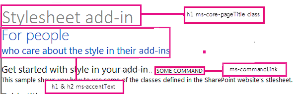
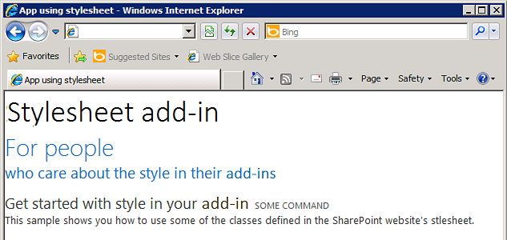

# <a name="use-a-sharepoint-websites-style-sheet-in-sharepoint-add-ins"></a><span data-ttu-id="47eec-101">Использование таблицы стилей веб-сайта SharePoint в надстройках SharePoint</span><span class="sxs-lookup"><span data-stu-id="47eec-101">Use a SharePoint website's style sheet in SharePoint Add-ins</span></span>
<span data-ttu-id="47eec-102">Узнайте, как использовать таблицы стилей веб-сайта SharePoint в надстройке SharePoint.</span><span class="sxs-lookup"><span data-stu-id="47eec-102">Learn how to use a SharePoint website's style sheet in an SharePoint Add-in.</span></span>
 

 <span data-ttu-id="47eec-p101">**Примечание.** Название "приложения для SharePoint" меняется на "надстройки SharePoint". Пока изменения не будут внесены полностью, в документации и пользовательском интерфейсе некоторых продуктов SharePoint и средств Visual Studio по-прежнему может встречаться термин "приложение". Дополнительные сведения см. в разделе [Новое название приложений для Office и SharePoint](new-name-for-apps-for-sharepoint#bk_newname).</span><span class="sxs-lookup"><span data-stu-id="47eec-p101">The name "apps for SharePoint" is changing to "SharePoint Add-ins". During the transition, the documentation and the UI of some SharePoint products and Visual Studio tools might still use the term "apps for SharePoint". For details, see [New name for apps for Office and SharePoint](new-name-for-apps-for-sharepoint#bk_newname).</span></span>
 

<span data-ttu-id="47eec-p102">Вы можете ссылаться на таблицу стилей веб-сайта SharePoint в вашей надстройке SharePoint и использовать ее для настройки стиля ваших веб-страниц с помощью таблицы стилей в SharePoint. Кроме того, если кто-либо изменяет таблицу стилей или тему веб-сайта SharePoint, то вы сможете применить новый набор стилей, не меняя ссылку на таблицу стилей в вашей надстройке.</span><span class="sxs-lookup"><span data-stu-id="47eec-p102">You can reference the style sheet of a SharePoint website in your SharePoint Add-in and use it to style your webpages by using the style sheet in SharePoint. In addition, if someone changes the SharePoint website's style sheet or theme, you can adopt the new set of styles in your add-in without modifying the style sheet reference in your add-in.</span></span>
 

 <span data-ttu-id="47eec-108">**Важно!** Если на ваших веб-страницах используется элемент управления хрома или эталонная страница надстройки, то стили уже доступны для использования, и ссылаться на таблицу стилей вручную, используя инструкции из этой статьи, не требуется.</span><span class="sxs-lookup"><span data-stu-id="47eec-108">**Important** If your webpages use the chrome control or the add-in master page, the styles are already available for you to use, and you don't have to reference the style sheet manually by using the procedure in this article.</span></span> 
 


## <a name="prerequisites-for-using-the-examples-in-this-article"></a><span data-ttu-id="47eec-109">Необходимые условия для использования примеров в этой статье</span><span class="sxs-lookup"><span data-stu-id="47eec-109">Prerequisites for using the examples in this article</span></span>
<span data-ttu-id="47eec-110"><a name="SP15Usestylesheetcontrol_Prereq"> </a></span><span class="sxs-lookup"><span data-stu-id="47eec-110"></span></span>

<span data-ttu-id="47eec-111">Вам необходима среда разработки, описанная в статье [Знакомство с созданием надстроек SharePoint с размещением у поставщика](get-started-creating-provider-hosted-sharepoint-add-ins).</span><span class="sxs-lookup"><span data-stu-id="47eec-111">You need a development environment as explained in  [Get started creating provider-hosted SharePoint Add-ins](get-started-creating-provider-hosted-sharepoint-add-ins).</span></span>
 

 

### <a name="core-concepts-to-know-before-using-the-sharepoint-style-sheet-in-a-sharepoint-add-in"></a><span data-ttu-id="47eec-112">Основные понятия, связанные с использованием таблицы стилей SharePoint в надстройке SharePoint</span><span class="sxs-lookup"><span data-stu-id="47eec-112">Core concepts to know before using the SharePoint style sheet in a SharePoint Add-in</span></span>

<span data-ttu-id="47eec-113">В приведенной ниже таблице перечислены полезные статьи с описанием основных понятий, связанных с использованием таблиц стилей SharePoint.</span><span class="sxs-lookup"><span data-stu-id="47eec-113">The following table lists useful articles that can help you understand the concepts involved in a scenario that uses the SharePoint style sheet.</span></span>
 

 

<span data-ttu-id="47eec-114">**Таблица 1. Основные понятия, связанные с использованием таблиц стилей**</span><span class="sxs-lookup"><span data-stu-id="47eec-114">**Table 1. Core concepts before using the style sheet**</span></span>


|<span data-ttu-id="47eec-115">**Название статьи**</span><span class="sxs-lookup"><span data-stu-id="47eec-115">**Article title**</span></span>|<span data-ttu-id="47eec-116">**Описание**</span><span class="sxs-lookup"><span data-stu-id="47eec-116">**Description**</span></span>|
|:-----|:-----|
| [<span data-ttu-id="47eec-117">Надстройки SharePoint</span><span class="sxs-lookup"><span data-stu-id="47eec-117">SharePoint Add-ins</span></span>](sharepoint-add-ins)|<span data-ttu-id="47eec-118">Сведения о новой модели надстроек в SharePoint, с помощью которой можно создавать надстройки — небольшие и удобные в использовании решения для пользователей.</span><span class="sxs-lookup"><span data-stu-id="47eec-118">Learn about the new add-in model in SharePoint that enables you to create add-ins, which are small, easy-to-use solutions for end users.</span></span>|
| [<span data-ttu-id="47eec-119">Дизайн пользовательского интерфейса надстроек SharePoint</span><span class="sxs-lookup"><span data-stu-id="47eec-119">UX design for SharePoint Add-ins</span></span>](ux-design-for-sharepoint-add-ins)|<span data-ttu-id="47eec-120">Сведения о параметрах и вариантах построения пользовательского интерфейса при создании надстроек SharePoint.</span><span class="sxs-lookup"><span data-stu-id="47eec-120">Learn about the user experience (UX) options and alternatives that you have when building SharePoint Add-ins.</span></span>|
| [<span data-ttu-id="47eec-121">Хост-сайты, сайты надстроек и компоненты в SharePoint</span><span class="sxs-lookup"><span data-stu-id="47eec-121">Host webs, add-in webs, and SharePoint components in SharePoint</span></span>](host-webs-add-in-webs-and-sharepoint-components-in-sharepoint-2013)|<span data-ttu-id="47eec-p103">Узнайте, в чем разница между хост-сайтами и сайтами надстроек. Узнайте, какие компоненты SharePoint можно включить в Надстройка SharePoint, какие компоненты можно развернуть на хост-сайтах, а какие на сайтах надстроек, а также узнайте, как развертывать сайты надстроек в изолированном домене.</span><span class="sxs-lookup"><span data-stu-id="47eec-p103">Learn about the difference between host webs and add-in webs. Find out which SharePoint components can be included in a SharePoint Add-in, which components are deployed to the host web, which components are deployed to the add-in web, and how the add-in web is deployed in an isolated domain.</span></span>|

## <a name="code-example-use-a-sharepoint-websites-style-sheet-in-a-sharepoint-add-in"></a><span data-ttu-id="47eec-124">Пример кода. Использование таблицы стилей веб-сайта SharePoint в надстройке SharePoint</span><span class="sxs-lookup"><span data-stu-id="47eec-124">Code example: Use a SharePoint website's style sheet in a SharePoint Add-in</span></span>
<span data-ttu-id="47eec-125"><a name="SP15Usestylesheetcontrol_Example"> </a></span><span class="sxs-lookup"><span data-stu-id="47eec-125"></span></span>

<span data-ttu-id="47eec-p104">В этом примере кода показано, как использовать таблицу стилей веб-сайта SharePoint. Это позволит сделать страницы удаленного веб-приложения похожими на страницы хост-сайта SharePoint.</span><span class="sxs-lookup"><span data-stu-id="47eec-p104">This code example shows you how to use the SharePoint website's stylesheet. This enables your remote web application pages to match the look-and-feel of the pages in the SharePoint host web.</span></span>
 

 
<span data-ttu-id="47eec-128">Чтобы применить таблицу стилей в надстройке SharePoint, сделайте следующее:</span><span class="sxs-lookup"><span data-stu-id="47eec-128">To use the style sheet in a SharePoint Add-in, follow these steps:</span></span>
 

 

1. <span data-ttu-id="47eec-129">Создайте надстройку SharePoint с размещением у поставщика.</span><span class="sxs-lookup"><span data-stu-id="47eec-129">Create the provider-hosted SharePoint Add-in..</span></span> 
    
 
2. <span data-ttu-id="47eec-130">Подготовьте сайт надстройки, создав пустую страницу.</span><span class="sxs-lookup"><span data-stu-id="47eec-130">Force the add-in web provisioning by creating a blank page.</span></span>
    
 
3. <span data-ttu-id="47eec-131">Добавьте в веб-проект страницу со ссылкой на таблицу стилей.</span><span class="sxs-lookup"><span data-stu-id="47eec-131">Add a webpage to the web project, and reference the style sheet.</span></span>
    
 
4. <span data-ttu-id="47eec-132">Измените элемент в манифесте надстройки.</span><span class="sxs-lookup"><span data-stu-id="47eec-132">Edit the element in the add-in manifest.</span></span>
    
 
<span data-ttu-id="47eec-133">На рис. 1 показана веб-страница SharePoint с использованием таблицы стилей.</span><span class="sxs-lookup"><span data-stu-id="47eec-133">Figure 1 shows a SharePoint webpage that is using the style sheet.</span></span>
 

 

<span data-ttu-id="47eec-134">**Рис. 1. Веб-страница с использованием таблицы стилей**</span><span class="sxs-lookup"><span data-stu-id="47eec-134">**Figure 1. Webpage using the style sheet**</span></span>

 

 

 

### <a name="to-create-the-sharepoint-add-in-and-remote-web-projects"></a><span data-ttu-id="47eec-136">Создание надстройки SharePoint и удаленных веб-проектов</span><span class="sxs-lookup"><span data-stu-id="47eec-136">To create the SharePoint Add-in and remote web projects</span></span>


1. <span data-ttu-id="47eec-p105">Откройте Visual Studio от имени администратора. Для этого щелкните правой кнопкой мыши значок Visual Studio в меню **Пуск** и выберите пункт **Запуск от имени администратора**.</span><span class="sxs-lookup"><span data-stu-id="47eec-p105">Open Visual Studio as administrator. (To do this, right-click the Visual Studio icon on the **Start** menu, and choose **Run as administrator**.)</span></span>
    
 
2. <span data-ttu-id="47eec-139">Создайте надстройку SharePoint с размещением у поставщика, как описано в статье [Знакомство с созданием надстроек SharePoint с размещением у поставщика](get-started-creating-provider-hosted-sharepoint-add-ins), и задайте для нее имя itStylesheetAdd-in.</span><span class="sxs-lookup"><span data-stu-id="47eec-139">Create the provider-hosted SharePoint Add-in as explained in  [Get started creating provider-hosted SharePoint Add-ins](get-started-creating-provider-hosted-sharepoint-add-ins) and name itStylesheetAdd-in.</span></span> 
    
 

### <a name="to-force-the-add-in-web-provisioning-by-creating-a-blank-page"></a><span data-ttu-id="47eec-140">Подготовка сайта надстройки путем создания пустой страницы</span><span class="sxs-lookup"><span data-stu-id="47eec-140">To force the add-in web provisioning by creating a blank page</span></span>


1. <span data-ttu-id="47eec-141">Щелкните правой кнопкой мыши проект Надстройка SharePoint и добавьте новый модуль.</span><span class="sxs-lookup"><span data-stu-id="47eec-141">Right-click the SharePoint Add-in project, and add a new module.</span></span>
    
 
2. <span data-ttu-id="47eec-142">Щелкните правой кнопкой мыши новый модуль и добавьте новый элемент.</span><span class="sxs-lookup"><span data-stu-id="47eec-142">Right-click the new module, and add a new item.</span></span>
    
 
3. <span data-ttu-id="47eec-p106">В разделе **Элементы Visual C#** > **Интернет** выберите пункт **HTML-страница**. Переименуйте страницу в **blank.html**.</span><span class="sxs-lookup"><span data-stu-id="47eec-p106">Under **Visual C# items**, **Web**, choose **HTML Page**. Rename the page to **blank.html**.</span></span>
    
 
4. <span data-ttu-id="47eec-145">Удалите содержимое файла blank.html.</span><span class="sxs-lookup"><span data-stu-id="47eec-145">Delete the contents of blank.html.</span></span>
    
 

### <a name="to-add-a-webpage-that-references-the-style-sheet-in-the-web-project"></a><span data-ttu-id="47eec-146">Добавление веб-страницы, ссылающейся на таблицу стилей в веб-проекте</span><span class="sxs-lookup"><span data-stu-id="47eec-146">To add a webpage that references the style sheet in the web project</span></span>


1. <span data-ttu-id="47eec-p107">Щелкните веб-проект правой кнопкой мыши и добавьте новую веб-форму. Переименуйте ее в **StyleConsumer.aspx**.</span><span class="sxs-lookup"><span data-stu-id="47eec-p107">Right-click the web project, and add a new Web Form. Rename the Web Form to **StyleConsumer.aspx**.</span></span>
    
 
2. <span data-ttu-id="47eec-p108">Замените содержимое Web Form.aspx на приведенный ниже код, который выполняет перечисленные далее задачи.</span><span class="sxs-lookup"><span data-stu-id="47eec-p108">Replace the contents of the Web Form .aspx file with the following code. The code performs the following tasks:</span></span>
    
      - <span data-ttu-id="47eec-151">Загружает страницу blank.html с сайта надстройки в невидимом фрейме IFrame.</span><span class="sxs-lookup"><span data-stu-id="47eec-151">Loads the blank.html page from the add-in web in an invisible IFrame.</span></span>
    
 
  - <span data-ttu-id="47eec-152">Загружает файл defaultcss.ashx с сайта надстройки.</span><span class="sxs-lookup"><span data-stu-id="47eec-152">Loads the defaultcss.ashx file from the add-in web.</span></span>
    
 
  - <span data-ttu-id="47eec-153">Использует доступные стили.</span><span class="sxs-lookup"><span data-stu-id="47eec-153">Uses the available styles.</span></span>
    
 

```
  <%@ Page Language="C#" AutoEventWireup="true" CodeBehind="StyleConsumer.aspx.cs" Inherits="StylesheetAppWeb.StyleConsumer" %>

<!DOCTYPE html>
<html>
<head>
    <title>Add-in using stylesheet</title>
</head>
<body>

    <!-- The main page title -->
    <h1 class="ms-core-pageTitle">Stylesheet add-in</h1>

    <!-- Some subtitle -->
    <h1 class="ms-accentText">For people</h1>

    <!-- Subtitle comments -->
    <h2 class="ms-accentText">who care about the style in their add-ins</h2>
    <p></p>
    <div>
        <h2 class="ms-webpart-titleText">Get started with style in your add-in... </h2>
        <a class="ms-commandLink" href="#">some command</a>
        <br />
        This sample shows you how to use some of the classes defined in the SharePoint website's style sheet.
    </div>

    <!-- Script to load SharePoint resources
        and load the blank.html page in
        the invisible iframe
        -->
    <script type="text/javascript">
        "use strict";
        var appweburl;

        (function () {
            var ctag;

            // Get the URI decoded add-in web URL.
            appweburl =
                decodeURIComponent(
                    getQueryStringParameter("SPAppWebUrl")
            );
            // Get the ctag from the SPClientTag token.
            ctag =
                decodeURIComponent(
                    getQueryStringParameter("SPClientTag")
            );

            // The resource files are in a URL in the form:
            // web_url/_layouts/15/Resource.ashx
            var scriptbase = appweburl + "/_layouts/15/";

            // Dynamically create the invisible iframe.
            var blankiframe;
            var blankurl;
            var body;
            blankurl = appweburl + "/Pages/blank.html";
            blankiframe = document.createElement("iframe");
            blankiframe.setAttribute("src", blankurl);
            blankiframe.setAttribute("style", "display: none");
            body = document.getElementsByTagName("body");
            body[0].appendChild(blankiframe);

            // Dynamically create the link element.
            var dclink;
            var head;
            dclink = document.createElement("link");
            dclink.setAttribute("rel", "stylesheet");
            dclink.setAttribute("href", scriptbase + "defaultcss.ashx?ctag=" + ctag);
            head = document.getElementsByTagName("head");
            head[0].appendChild(dclink);
        })();

        // Function to retrieve a query string value.
        // For production purposes you may want to use
        //  a library to handle the query string.
        function getQueryStringParameter(paramToRetrieve) {
            var params;
            var strParams;

            params = document.URL.split("?")[1].split("&amp;");
            strParams = "";
            for (var i = 0; i < params.length; i = i + 1) {
                var singleParam = params[i].split("=");
                if (singleParam[0] == paramToRetrieve)
                    return singleParam[1];
            }
        }
    </script>
</body>
</html>

```


    In some cases, the user has to be authenticated to SharePoint before your page will be able to download the CSS and images for styling. Link tags do not automatically authenticate a user who is not already signed in. Consider loading a page resource from the add-in web in your webpage to force the user's authentication before linking to the CSS file. In this example, the blank.html page is loaded in an invisible IFrame.
    
 

### <a name="to-edit-the-startpage-element-in-the-add-in-manifest"></a><span data-ttu-id="47eec-154">Изменение элемента StartPage в манифесте надстройки</span><span class="sxs-lookup"><span data-stu-id="47eec-154">To edit the StartPage element in the add-in manifest</span></span>


1. <span data-ttu-id="47eec-155">Дважды щелкните файл **AppManifest.xml** в **обозревателе решений**.</span><span class="sxs-lookup"><span data-stu-id="47eec-155">Double-click the **AppManifest.xml** file in **Solution Explorer**.</span></span>
    
 
2. <span data-ttu-id="47eec-156">В раскрывающемся меню **Начальная страница** выберите веб-страницу, использующую таблицу стилей.</span><span class="sxs-lookup"><span data-stu-id="47eec-156">On the **Start page** drop-down menu, choose the webpage that uses the style sheet.</span></span>
    
 

### <a name="to-build-and-run-the-solution"></a><span data-ttu-id="47eec-157">Сборка и запуск решения</span><span class="sxs-lookup"><span data-stu-id="47eec-157">To build and run the solution</span></span>


1. <span data-ttu-id="47eec-158">Убедитесь, что проект Надстройка SharePoint выбран как запускаемый проект.</span><span class="sxs-lookup"><span data-stu-id="47eec-158">Make sure that the SharePoint Add-in project is set as the startup project.</span></span>
    
 
2. <span data-ttu-id="47eec-159">Нажмите клавишу F5.</span><span class="sxs-lookup"><span data-stu-id="47eec-159">Press the F5 key.</span></span>
    
     <span data-ttu-id="47eec-160">**Примечание.** При нажатии клавиши F5 Visual Studio собирает решение, развертывает надстройку и открывает страницу ее разрешений.</span><span class="sxs-lookup"><span data-stu-id="47eec-160">**Note** When you press F5, Visual Studio builds the solution, deploys the add-in, and opens the permissions page for the add-in.</span></span>
3. <span data-ttu-id="47eec-161">Нажмите кнопку **Доверять**.</span><span class="sxs-lookup"><span data-stu-id="47eec-161">Choose the **Trust It** button.</span></span>
    
 
4. <span data-ttu-id="47eec-162">Щелкните значок надстройки **StylesheetBasic**.</span><span class="sxs-lookup"><span data-stu-id="47eec-162">Click the **StylesheetBasic** add-in icon.</span></span>
    
 
5. <span data-ttu-id="47eec-163">На рис. 2 показана готовая веб-страница, использующая стили SharePoint.</span><span class="sxs-lookup"><span data-stu-id="47eec-163">Figure 2 shows the resulting webpage using the SharePoint styles.</span></span>
    
    <span data-ttu-id="47eec-164">**Рис. 2. Таблица стилей, используемая на странице**</span><span class="sxs-lookup"><span data-stu-id="47eec-164">**Figure 2. Style sheet used in the page**</span></span>

 

  
 

 

 
6. <span data-ttu-id="47eec-p109">Вы также можете перейти на хост-сайт и изменить тему. Затем обновите веб-страницу надстройки, чтобы использовать новые стили.</span><span class="sxs-lookup"><span data-stu-id="47eec-p109">You can also go to the host web and change the theme. Then reload the add-in webpage to use the new styles.</span></span>
    
 

<span data-ttu-id="47eec-168">**Таблица 2. Устранение неполадок в решении**</span><span class="sxs-lookup"><span data-stu-id="47eec-168">**Table 2. Troubleshooting the solution**</span></span>


|<span data-ttu-id="47eec-169">**Проблема**</span><span class="sxs-lookup"><span data-stu-id="47eec-169">**Problem**</span></span>|<span data-ttu-id="47eec-170">**Решение**</span><span class="sxs-lookup"><span data-stu-id="47eec-170">**Solution**</span></span>|
|:-----|:-----|
|<span data-ttu-id="47eec-171">Visual Studio не открывает браузер после нажатия клавиши F5.</span><span class="sxs-lookup"><span data-stu-id="47eec-171">Visual Studio does not open the browser after you press the F5 key.</span></span>|<span data-ttu-id="47eec-172">Установите проект Надстройка SharePoint в качестве запускаемого.</span><span class="sxs-lookup"><span data-stu-id="47eec-172">Set the SharePoint Add-in project as the startup project.</span></span>|
|<span data-ttu-id="47eec-173">Ошибка сертификата.</span><span class="sxs-lookup"><span data-stu-id="47eec-173">Certificate error.</span></span>|<span data-ttu-id="47eec-p110">Задайте для свойства **SSL включен** веб-проекта значение false. В проекте надстройки SharePoint задайте для свойства **Веб-проект** значение None, а затем снова укажите в нем имя веб-проекта.</span><span class="sxs-lookup"><span data-stu-id="47eec-p110">Set the **SSL Enabled** property of your web project to false. In the SharePoint Add-in project, set the **Web Project** property toNone, and then set the property back to your web project's name.</span></span>|

## <a name="next-steps"></a><span data-ttu-id="47eec-176">Дальнейшие действия</span><span class="sxs-lookup"><span data-stu-id="47eec-176">Next steps</span></span>
<span data-ttu-id="47eec-177"><a name="SP15Usestylesheetcontrol_Nextsteps"> </a></span><span class="sxs-lookup"><span data-stu-id="47eec-177"></span></span>

<span data-ttu-id="47eec-p111">В этой статье показано, как использовать таблицу стилей в надстройке SharePoint. Далее вы можете узнать о других компонентах UX, доступных для надстроек SharePoint. Дополнительные сведения см. в следующих источниках:</span><span class="sxs-lookup"><span data-stu-id="47eec-p111">This article demonstrated how to use the style sheet in a SharePoint Add-in. As a next step, you can learn about other UX components that are available for SharePoint Add-ins. To learn more, see the following:</span></span>
 

 

-  [<span data-ttu-id="47eec-181">Пример кода. Использование таблицы стилей SharePoint в надстройке</span><span class="sxs-lookup"><span data-stu-id="47eec-181">Code sample: Use the SharePoint style sheet in an add-in</span></span>](http://code.msdn.microsoft.com/SharePoint-2013-Use-the-7a8684e2)
    
 
-  [<span data-ttu-id="47eec-182">Использование клиентского элемента управления хрома в надстройках SharePoint</span><span class="sxs-lookup"><span data-stu-id="47eec-182">Use the client chrome control in SharePoint Add-ins</span></span>](use-the-client-chrome-control-in-sharepoint-add-ins)
    
 
-  [<span data-ttu-id="47eec-183">Создание дополнительных действий для развертывания с надстройками SharePoint</span><span class="sxs-lookup"><span data-stu-id="47eec-183">Create custom actions to deploy with SharePoint Add-ins</span></span>](create-custom-actions-to-deploy-with-sharepoint-add-ins)
    
 
-  [<span data-ttu-id="47eec-184">Создание веб-частей надстроек для установки вместе с надстройкой SharePoint</span><span class="sxs-lookup"><span data-stu-id="47eec-184">Create add-in parts to install with your SharePoint Add-in</span></span>](create-add-in-parts-to-install-with-your-sharepoint-add-in)
    
 

## <a name="additional-resources"></a><span data-ttu-id="47eec-185">Дополнительные ресурсы</span><span class="sxs-lookup"><span data-stu-id="47eec-185">Additional resources</span></span>
<span data-ttu-id="47eec-186"><a name="SP15Usestylesheetcontrol_Addresources"> </a></span><span class="sxs-lookup"><span data-stu-id="47eec-186"></span></span>


-  [<span data-ttu-id="47eec-187">Дизайн пользовательского интерфейса надстроек SharePoint</span><span class="sxs-lookup"><span data-stu-id="47eec-187">UX design for SharePoint Add-ins</span></span>](ux-design-for-sharepoint-add-ins)
    
 
-  [<span data-ttu-id="47eec-188">Рекомендации по проектированию пользовательского интерфейса надстроек SharePoint</span><span class="sxs-lookup"><span data-stu-id="47eec-188">SharePoint Add-ins UX design guidelines</span></span>](sharepoint-add-ins-ux-design-guidelines)
    
 
-  [<span data-ttu-id="47eec-189">Создание компонентов пользовательского интерфейса в SharePoint</span><span class="sxs-lookup"><span data-stu-id="47eec-189">Create UX components in SharePoint</span></span>](create-ux-components-in-sharepoint-2013)
    
 
-  [<span data-ttu-id="47eec-190">Три представления о вариантах разработки надстроек SharePoint</span><span class="sxs-lookup"><span data-stu-id="47eec-190">Three ways to think about design options for SharePoint Add-ins</span></span>](three-ways-to-think-about-design-options-for-sharepoint-add-ins)
    
 
-  [<span data-ttu-id="47eec-191">Важные аспекты архитектуры и разработки надстроек SharePoint</span><span class="sxs-lookup"><span data-stu-id="47eec-191">Important aspects of the SharePoint Add-in architecture and development landscape</span></span>](important-aspects-of-the-sharepoint-add-in-architecture-and-development-landscape)
    
 

