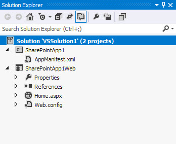

# <a name="use-the-client-chrome-control-in-sharepoint-add-ins"></a><span data-ttu-id="0a382-101">Использование клиентского элемента управления хрома в надстройках SharePoint</span><span class="sxs-lookup"><span data-stu-id="0a382-101">Use the client chrome control in SharePoint Add-ins</span></span>
<span data-ttu-id="0a382-102">Узнайте, как использовать элемент управления хрома в надстройках в SharePoint.</span><span class="sxs-lookup"><span data-stu-id="0a382-102">Learn how to use the chrome control in add-ins in sp15allshort.</span></span>
 

 <span data-ttu-id="0a382-p101">**Примечание.** Название "приложения для SharePoint" меняется на "надстройки SharePoint". Пока изменения не будут внесены полностью, в документации и пользовательском интерфейсе некоторых продуктов SharePoint и средств Visual Studio по-прежнему может встречаться термин "приложение". Дополнительные сведения см. в разделе [Новое название приложений для Office и SharePoint](new-name-for-apps-for-sharepoint#bk_newname).</span><span class="sxs-lookup"><span data-stu-id="0a382-p101">The name "apps for SharePoint" is changing to "SharePoint Add-ins". During the transition, the documentation and the UI of some SharePoint products and Visual Studio tools might still use the term "apps for SharePoint". For details, see [New name for apps for Office and SharePoint](new-name-for-apps-for-sharepoint#bk_newname).</span></span>
 

<span data-ttu-id="0a382-p102">Элемент управления хрома в SharePoint позволяет использовать стили заголовков определенного сайта SharePoint в вашей надстройке без необходимости регистрировать серверную библиотеку или использовать специальные методы и средства. Чтобы использовать эту функцию, необходимо зарегистрировать библиотеку SharePoint JavaScript с помощью стандартного тега <script>. Вы можете использовать заполнитель с помощью HTML-элемента **div** и в дальнейшем настраивать этот элемент управления с использованием доступных параметров. Элемент управления наследует свой внешний вид от указанного веб-сайта SharePoint. </span><span class="sxs-lookup"><span data-stu-id="0a382-p102">The chrome control in SharePoint enables you to use the header styling of a specific SharePoint site in your add-in without needing to register a server library or use a specific technology or tool. To use this functionality, you must register a SharePoint JavaScript library through a standard <script> tag. You can provide a placeholder by using an HTML **div** element and further customize the control by using the available options. The control inherits its appearance from the specified SharePoint website.</span></span>
 

## <a name="prerequisites-for-using-the-examples-in-this-article"></a><span data-ttu-id="0a382-110">Необходимые условия для использования примеров в этой статье</span><span class="sxs-lookup"><span data-stu-id="0a382-110">Prerequisites for using the examples in this article</span></span>
<span data-ttu-id="0a382-111"><a name="SP15Usechromecontrol_Prereq"> </a></span><span class="sxs-lookup"><span data-stu-id="0a382-111"></span></span>

<span data-ttu-id="0a382-112">Для выполнения действий, описанных в этом примере, вам потребуется следующее:</span><span class="sxs-lookup"><span data-stu-id="0a382-112">To follow the steps in this example, you need the following:</span></span>
 

 

- <span data-ttu-id="0a382-113">Visual Studio 2015;</span><span class="sxs-lookup"><span data-stu-id="0a382-113">Visual Studio 2015</span></span>
    
 
- <span data-ttu-id="0a382-114">среда разработки для SharePoint (в случае локальных сценариев необходимо изолировать надстройку).</span><span class="sxs-lookup"><span data-stu-id="0a382-114">A SharePoint development environment (add-in isolation required for on-premises scenarios)</span></span>
    
 
<span data-ttu-id="0a382-115">Руководство по настройке среды разработки согласно вашим потребностям см. в статье, посвященной [началу создания надстроек Office и SharePoint](http://msdn.microsoft.com/library/187f8c8c-1b15-471c-80b5-69a40e67deea.aspx).</span><span class="sxs-lookup"><span data-stu-id="0a382-115">For guidance on how to set up a development environment that fits your needs, see  [Start building Office and SharePoint Add-ins](http://msdn.microsoft.com/library/187f8c8c-1b15-471c-80b5-69a40e67deea.aspx).</span></span>
 

 

### <a name="core-concepts-to-know-before-using-the-chrome-control"></a><span data-ttu-id="0a382-116">Основные понятия, связанные с использованием элемента управления хрома</span><span class="sxs-lookup"><span data-stu-id="0a382-116">Core concepts to know before using the chrome control</span></span>

<span data-ttu-id="0a382-117">В приведенной ниже таблице перечислены полезные статьи, которые могут помочь вам ознакомиться с основными понятиями, связанными с использованием элемента управления хрома.</span><span class="sxs-lookup"><span data-stu-id="0a382-117">The following table lists useful articles that can help you understand the concepts involved in a scenario that uses the chrome control.</span></span>
 

 

<span data-ttu-id="0a382-118">**Таблица 1. Основные понятия, связанные с использованием элемента управления хрома**</span><span class="sxs-lookup"><span data-stu-id="0a382-118">**Table 1. Core concepts for using the chrome control**</span></span>


|<span data-ttu-id="0a382-119">**Название статьи**</span><span class="sxs-lookup"><span data-stu-id="0a382-119">**Article title**</span></span>|<span data-ttu-id="0a382-120">**Описание**</span><span class="sxs-lookup"><span data-stu-id="0a382-120">**Description**</span></span>|
|:-----|:-----|
| [<span data-ttu-id="0a382-121">Надстройки SharePoint</span><span class="sxs-lookup"><span data-stu-id="0a382-121">SharePoint Add-ins</span></span>](sharepoint-add-ins)|<span data-ttu-id="0a382-122">Сведения о новой модели надстроек в SharePoint, с помощью которой можно создавать надстройки — небольшие и удобные в использовании решения для пользователей.</span><span class="sxs-lookup"><span data-stu-id="0a382-122">Learn about the new add-in model in SharePoint that enables you to create add-ins, which are small, easy-to-use solutions for end users.</span></span>|
| [<span data-ttu-id="0a382-123">Дизайн пользовательского интерфейса надстроек SharePoint</span><span class="sxs-lookup"><span data-stu-id="0a382-123">UX design for SharePoint Add-ins</span></span>](ux-design-for-sharepoint-add-ins)|<span data-ttu-id="0a382-124">Сведения о параметрах и вариантах построения пользовательского интерфейса при создании надстроек SharePoint.</span><span class="sxs-lookup"><span data-stu-id="0a382-124">Learn about the user experience (UX) options and alternatives that you have when building SharePoint Add-ins.</span></span>|
| [<span data-ttu-id="0a382-125">Хост-сайты, сайты надстроек и компоненты в SharePoint</span><span class="sxs-lookup"><span data-stu-id="0a382-125">Host webs, add-in webs, and SharePoint components in SharePoint</span></span>](host-webs-add-in-webs-and-sharepoint-components-in-sharepoint-2013)|<span data-ttu-id="0a382-p103">Узнайте, в чем разница между хост-сайтами и сайтами надстроек. Узнайте, какие компоненты SharePoint можно включать в надстройку SharePoint, какие компоненты развертываются на хост-сайте, а какие на сайте надстройки и как развертывается сайт надстройки в изолированном домене.</span><span class="sxs-lookup"><span data-stu-id="0a382-p103">Learn about the distinction between host webs and add-in webs. Find out which SharePoint components can be included in a SharePoint Add-in, which components are deployed to the host web, which components are deployed to the add-in web, and how the add-in web is deployed in an isolated domain.</span></span>|

## <a name="code-example-use-the-chrome-control-in-your-cloud-hosted-add-in"></a><span data-ttu-id="0a382-128">Пример кода. Использование элемента управления хрома в надстройке, размещаемой в облаке</span><span class="sxs-lookup"><span data-stu-id="0a382-128">Code example: Use the chrome control in your cloud-hosted add-in</span></span>
<span data-ttu-id="0a382-129"><a name="SP15Usechromecontrol_Codeexample"> </a></span><span class="sxs-lookup"><span data-stu-id="0a382-129"></span></span>

<span data-ttu-id="0a382-p104">Размещенная в облаке надстройка включает по крайней мере один удаленный компонент. Чтобы узнать больше, см.  [Выбор шаблонов для разработки и размещения надстройки SharePoint](choose-patterns-for-developing-and-hosting-your-sharepoint-add-in). Чтобы использовать элемент управления хрома в размещенной в облаке надстройке, сделайте следующее:</span><span class="sxs-lookup"><span data-stu-id="0a382-p104">A cloud-hosted add-in includes at least one remote component. For more information, see  [Choose patterns for developing and hosting your SharePoint Add-in](choose-patterns-for-developing-and-hosting-your-sharepoint-add-in). To use the chrome control in your cloud-hosted add-in, follow these steps:</span></span>
 

 

1. <span data-ttu-id="0a382-133">Создайте надстройку SharePoint и удаленные веб-проекты.</span><span class="sxs-lookup"><span data-stu-id="0a382-133">Create the SharePoint Add-in and remote web projects.</span></span>
    
 
2. <span data-ttu-id="0a382-134">Отправьте параметры конфигурации по умолчанию в строке запроса.</span><span class="sxs-lookup"><span data-stu-id="0a382-134">Send default configuration options in the query string.</span></span>
    
 
3. <span data-ttu-id="0a382-135">Добавьте в веб-проект веб-страницу.</span><span class="sxs-lookup"><span data-stu-id="0a382-135">Add a webpage to the web project.</span></span>
    
 
<span data-ttu-id="0a382-136">На рис. 1 показана удаленная веб-страница с элементом управления хрома.</span><span class="sxs-lookup"><span data-stu-id="0a382-136">Figure 1 shows a remote webpage with the chrome control.</span></span>
 

 

<span data-ttu-id="0a382-137">**Рис. 1. Удаленная веб-страница с элементом управления хрома**</span><span class="sxs-lookup"><span data-stu-id="0a382-137">**Figure 1. Remote webpage with the chrome control**</span></span>

 

 

 

### <a name="to-create-the-sharepoint-add-in-and-remote-web-projects"></a><span data-ttu-id="0a382-139">Создание надстройки SharePoint и удаленных веб-проектов</span><span class="sxs-lookup"><span data-stu-id="0a382-139">To create the SharePoint Add-in and remote web projects</span></span>


1. <span data-ttu-id="0a382-p105">Откройте Visual Studio 2015 от имени администратора. Для этого щелкните правой кнопкой мыши значок Visual Studio 2015 в меню **Пуск** и выберите пункт **Запуск от имени администратора**.</span><span class="sxs-lookup"><span data-stu-id="0a382-p105">Open Visual Studio 2015 as administrator. (To do this, right-click the Visual Studio 2015 icon on the **Start** menu, and choose **Run as administrator**.)</span></span>
    
 
2. <span data-ttu-id="0a382-142">Создайте проект, используя шаблон **Надстройка SharePoint**.</span><span class="sxs-lookup"><span data-stu-id="0a382-142">Create a new project using the **SharePoint Add-in** template.</span></span>
    
    <span data-ttu-id="0a382-143">На рис. 2 показано расположение шаблона **Надстройка SharePoint** в Visual Studio 2015: **Шаблоны**, **Visual C#**, **Office/SharePoint**, **Надстройки Office**.</span><span class="sxs-lookup"><span data-stu-id="0a382-143">Figure 2 shows the location of the **SharePoint Add-in** template in Visual Studio 2015, under **Templates**, **Visual C#**, **Office/SharePoint**, **Office Add-ins**.</span></span>
    

    <span data-ttu-id="0a382-144">**Рис. 2. Шаблон надстройки SharePoint в Visual Studio**</span><span class="sxs-lookup"><span data-stu-id="0a382-144">**Figure 2. SharePoint Add-in Visual Studio template**</span></span>

 

  
 

 

 
3. <span data-ttu-id="0a382-146">Укажите URL-адрес веб-сайта SharePoint, который планируется использовать для отладки.</span><span class="sxs-lookup"><span data-stu-id="0a382-146">Provide the URL of the SharePoint website that you want to use for debugging.</span></span>
    
 
4. <span data-ttu-id="0a382-p106">Выберите **Размещение у поставщика** в качестве варианта размещения надстройки. Пример кода с размещением в SharePoint: [SharePoint-Add-in-JSOM-BasicDataOperations](https://github.com/OfficeDev/SharePoint-Add-in-JSOM-BasicDataOperations).</span><span class="sxs-lookup"><span data-stu-id="0a382-p106">Select **Provider-hosted** as the hosting option for your add-in. For a SharePoint-hosted code sample, see [SharePoint-Add-in-JSOM-BasicDataOperations](https://github.com/OfficeDev/SharePoint-Add-in-JSOM-BasicDataOperations).</span></span>
    
    <span data-ttu-id="0a382-149">После завершения работы мастера в **обозревателе решений** появится структура, подобная представленной на рис. 3.</span><span class="sxs-lookup"><span data-stu-id="0a382-149">After the wizard finishes, you should have a structure in **Solution Explorer** that resembles Figure 3.</span></span>
    

    <span data-ttu-id="0a382-150">**Рис. 3. Проекты надстроек SharePoint в обозревателе решений**</span><span class="sxs-lookup"><span data-stu-id="0a382-150">**Figure 3. Add-in for SharePoint projects in Solution Explorer**</span></span>

 

  
 

 

 

### <a name="to-send-default-configuration-options-in-the-query-string"></a><span data-ttu-id="0a382-152">Отправка параметров конфигурации по умолчанию в строке запроса</span><span class="sxs-lookup"><span data-stu-id="0a382-152">To send default configuration options in the query string</span></span>


1. <span data-ttu-id="0a382-153">Откройте файл Appmanifest.xml в редакторе манифеста.</span><span class="sxs-lookup"><span data-stu-id="0a382-153">Open the Appmanifest.xml file in the manifest editor.</span></span>
    
 
2. <span data-ttu-id="0a382-p107">Добавьте в строку запроса маркер **{StandardTokens}** и дополнительный параметр _SPHostTitle_. На рис. 4 показан редактор манифеста с настроенными параметрами строки запроса.</span><span class="sxs-lookup"><span data-stu-id="0a382-p107">Add the **{StandardTokens}** token and an additional _SPHostTitle_ parameter to the query string. Figure 4 shows the manifest editor with the configured query string parameters.</span></span>
    
    <span data-ttu-id="0a382-156">**Рис. 4. Редактор манифеста с параметрами строки запроса для элемента управления хрома**</span><span class="sxs-lookup"><span data-stu-id="0a382-156">**Figure 4. Manifest editor with query string parameters for the chrome control**</span></span>

 

  
 

    <span data-ttu-id="0a382-158">Элемент управления хрома автоматически принимает из строки запроса следующие значения:</span><span class="sxs-lookup"><span data-stu-id="0a382-158">The chrome control automatically takes the following values from the query string:</span></span>
    
 

      -  <span data-ttu-id="0a382-159">**SPHostUrl**;</span><span class="sxs-lookup"><span data-stu-id="0a382-159">**SPHostUrl**</span></span>
    
 
  -  <span data-ttu-id="0a382-160">**SPHostTitle**;</span><span class="sxs-lookup"><span data-stu-id="0a382-160">**SPHostTitle**</span></span>
    
 
  -  <span data-ttu-id="0a382-161">**SPAppWebUrl**;</span><span class="sxs-lookup"><span data-stu-id="0a382-161">**SPAppWebUrl**</span></span>
    
 
  -  <span data-ttu-id="0a382-162">**SPLanguage**.</span><span class="sxs-lookup"><span data-stu-id="0a382-162">**SPLanguage**</span></span>
    
 

     <span data-ttu-id="0a382-163">Маркер **{StandardTokens}** включает маркеры **SPHostUrl** и **SPAppWebUrl**.</span><span class="sxs-lookup"><span data-stu-id="0a382-163">**{StandardTokens}** include **SPHostUrl** and **SPAppWebUrl**.</span></span>
    
 

### <a name="to-add-a-page-that-uses-the-chrome-control-in-the-web-project"></a><span data-ttu-id="0a382-164">Добавление в веб-проект страницы с элементом управления хрома</span><span class="sxs-lookup"><span data-stu-id="0a382-164">To add a page that uses the chrome control in the web project</span></span>


1. <span data-ttu-id="0a382-165">Щелкните правой кнопкой мыши веб-проект и добавьте новую веб-форму.</span><span class="sxs-lookup"><span data-stu-id="0a382-165">Right-click the web project, and add a new Web Form.</span></span>
    
 
2. <span data-ttu-id="0a382-p108">Скопируйте следующие исправления и вставьте их на страницу ASPX. Часть кода выполняет следующие действия:</span><span class="sxs-lookup"><span data-stu-id="0a382-p108">Copy the following markup, and paste it in the ASPX page. The markup performs the following tasks:</span></span>
    
      - <span data-ttu-id="0a382-168">загружает библиотеку AJAX из сети доставки содержимого Майкрософт (CDN);</span><span class="sxs-lookup"><span data-stu-id="0a382-168">Loads the AJAX library from the Microsoft CDN (Content Delivery Network).</span></span>
    
 
  - <span data-ttu-id="0a382-169">загружает библиотеку jQuery из сети CDN корпорации Майкрософт;</span><span class="sxs-lookup"><span data-stu-id="0a382-169">Loads the jQuery library from the Microsoft CDN.</span></span>
    
 
  - <span data-ttu-id="0a382-170">загружает файл SP.UI.Controls.js с помощью функции jQuery **getScript**;</span><span class="sxs-lookup"><span data-stu-id="0a382-170">Loads the SP.UI.Controls.js file using the jQuery function **getScript**.</span></span>
    
 
  - <span data-ttu-id="0a382-171">определяет функцию обратного вызова для события **onCssLoaded**;</span><span class="sxs-lookup"><span data-stu-id="0a382-171">Defines a callback function for the **onCssLoaded** event.</span></span>
    
 
  - <span data-ttu-id="0a382-172">подготавливает параметры для элемента управления хрома;</span><span class="sxs-lookup"><span data-stu-id="0a382-172">Prepares the options for the chrome control.</span></span>
    
 
  - <span data-ttu-id="0a382-173">инициализирует элемент управления хрома.</span><span class="sxs-lookup"><span data-stu-id="0a382-173">Initializes the chrome control.</span></span>
    
 

```HTML
  <!DOCTYPE html>
<html xmlns="http://www.w3.org/1999/xhtml">
<head>
    <title>Chrome control host page</title>
    <script 
        src="//ajax.aspnetcdn.com/ajax/4.0/1/MicrosoftAjax.js" 
        type="text/javascript">
    </script>
    <script 
        type="text/javascript" 
        src="//ajax.aspnetcdn.com/ajax/jQuery/jquery-1.7.2.min.js">
    </script>      
    <script 
        type="text/javascript"
        src="ChromeLoader.js">
    </script>
<script type="text/javascript">
"use strict";

var hostweburl;

//load the SharePoint resources
$(document).ready(function () {
    //Get the URI decoded URL.
    hostweburl =
        decodeURIComponent(
            getQueryStringParameter("SPHostUrl")
    );

    // The SharePoint js files URL are in the form:
    // web_url/_layouts/15/resource
    var scriptbase = hostweburl + "/_layouts/15/";

    // Load the js file and continue to the 
    //   success handler
    $.getScript(scriptbase + "SP.UI.Controls.js", renderChrome)
});

// Callback for the onCssLoaded event defined
//  in the options object of the chrome control
function chromeLoaded() {
    // When the page has loaded the required
    //  resources for the chrome control,
    //  display the page body.
    $("body").show();
}

//Function to prepare the options and render the control
function renderChrome() {
    // The Help, Account and Contact pages receive the 
    //   same query string parameters as the main page
    var options = {
        "appIconUrl": "siteicon.png",
        "appTitle": "Chrome control add-in",
        "appHelpPageUrl": "Help.html?"
            + document.URL.split("?")[1],
        // The onCssLoaded event allows you to 
        //  specify a callback to execute when the
        //  chrome resources have been loaded.
        "onCssLoaded": "chromeLoaded()",
        "settingsLinks": [
            {
                "linkUrl": "Account.html?"
                    + document.URL.split("?")[1],
                "displayName": "Account settings"
            },
            {
                "linkUrl": "Contact.html?"
                    + document.URL.split("?")[1],
                "displayName": "Contact us"
            }
        ]
    };

    var nav = new SP.UI.Controls.Navigation(
                            "chrome_ctrl_placeholder",
                            options
                        );
    nav.setVisible(true);
}

// Function to retrieve a query string value.
// For production purposes you may want to use
//  a library to handle the query string.
function getQueryStringParameter(paramToRetrieve) {
    var params =
        document.URL.split("?")[1].split("&amp;");
    var strParams = "";
    for (var i = 0; i < params.length; i = i + 1) {
        var singleParam = params[i].split("=");
        if (singleParam[0] == paramToRetrieve)
            return singleParam[1];
    }
}
</script>
</head>

<!-- The body is initally hidden. 
     The onCssLoaded callback allows you to 
     display the content after the required
     resources for the chrome control have
     been loaded.  -->
<body style="display: none">

    <!-- Chrome control placeholder -->
    <div id="chrome_ctrl_placeholder"></div>

    <!-- The chrome control also makes the SharePoint
          Website stylesheet available to your page -->
    <h1 class="ms-accentText">Main content</h1>
    <h2 class="ms-accentText">The chrome control</h2>
    <div id="MainContent">
        This is the page's main content. 
        You can use the links in the header to go to the help, 
        account or contact pages.
    </div>
</body>
</html>
```

3. <span data-ttu-id="0a382-p109">Элемент управления хрома также можно использовать декларативным способом. В следующем примере кода в разметке HTML элемент управления объявляется без использования кода JavaScript для его настройки и инициализации. Эта разметка выполняет следующие задачи:</span><span class="sxs-lookup"><span data-stu-id="0a382-p109">You can also use the chrome control in a declarative way. In the following code example, the HTML markup declares the control without using JavaScript code to configure and initialize the control. The following markup performs the following tasks:</span></span>
    
      - <span data-ttu-id="0a382-177">предоставляет заполнитель для файла SP.UI.Controls.js JavaScript;</span><span class="sxs-lookup"><span data-stu-id="0a382-177">Provides a placeholder for the SP.UI.Controls.js JavaScript file.</span></span>
    
 
  - <span data-ttu-id="0a382-178">динамически загружает файл SP.UI.Controls.js;</span><span class="sxs-lookup"><span data-stu-id="0a382-178">Dynamically loads the SP.UI.Controls.js file</span></span>
    
 
  - <span data-ttu-id="0a382-179">предоставляет заполнитель для элемента управления хрома и задает его параметры.</span><span class="sxs-lookup"><span data-stu-id="0a382-179">Provides a placeholder for the chrome control and specifies the options inline with the HTML markup.</span></span>
    
 

```HTML
  <!DOCTYPE html>
<html xmlns="http://www.w3.org/1999/xhtml">
<head>
    <title>Chrome control host page</title>
    <script 
        src="http://ajax.aspnetcdn.com/ajax/4.0/1/MicrosoftAjax.js" 
        type="text/javascript">
    </script>
    <script 
        type="text/javascript" 
        src="http://ajax.aspnetcdn.com/ajax/jQuery/jquery-1.7.2.min.js">
    </script>      
    <script type="text/javascript">
    var hostweburl;

    // Load the SharePoint resources.
    $(document).ready(function () {

        // Get the URI decoded add-in web URL.
        hostweburl =
            decodeURIComponent(
                getQueryStringParameter("SPHostUrl")
        );

        // The SharePoint js files URL are in the form:
        // web_url/_layouts/15/resource.js
        var scriptbase = hostweburl + "/_layouts/15/";

        // Load the js file and continue to the 
        // success handler.
        $.getScript(scriptbase + "SP.UI.Controls.js")
    });

    // Function to retrieve a query string value.
    // For production purposes you may want to use
    // a library to handle the query string.
    function getQueryStringParameter(paramToRetrieve) {
        var params =
            document.URL.split("?")[1].split("&amp;");
        var strParams = "";
        for (var i = 0; i < params.length; i = i + 1) {
            var singleParam = params[i].split("=");
            if (singleParam[0] == paramToRetrieve)
                return singleParam[1];
        }
    }
    </script>
</head>
<body>

    <!-- Chrome control placeholder 
           Options are declared inline.  -->
    <div 
        id="chrome_ctrl_container"
        data-ms-control="SP.UI.Controls.Navigation"  
        data-ms-options=
            '{  
                "appHelpPageUrl" : "Help.html",
                "appIconUrl" : "siteIcon.png",
                "appTitle" : "Chrome control add-in",
                "settingsLinks" : [
                    {
                        "linkUrl" : "Account.html",
                        "displayName" : "Account settings"
                    },
                    {
                        "linkUrl" : "Contact.html",
                        "displayName" : "Contact us"
                    }
                ]
             }'>
    </div>
    
    <!-- The chrome control also makes the SharePoint
          Website style sheet available to your page. -->
    <h1 class="ms-accentText">Main content</h1>
    <h2 class="ms-accentText">The chrome control</h2>
    <div id="MainContent">
        This is the page's main content. 
        You can use the links in the header to go to the help, 
        account or contact pages.
    </div>
</body>
</html>
```


    The SP.UI.Controls.js library automatically renders the control if it finds the  **data-ms-control="SP.UI.Controls.Navigation"** attribute in a **div** element.
    
 

### <a name="to-edit-the-startpage-element-in-the-add-in-manifest"></a><span data-ttu-id="0a382-180">Изменение элемента StartPage в манифесте надстройки</span><span class="sxs-lookup"><span data-stu-id="0a382-180">To edit the StartPage element in the add-in manifest</span></span>


1. <span data-ttu-id="0a382-181">Дважды щелкните файл **AppManifest.xml** в **обозревателе решений**.</span><span class="sxs-lookup"><span data-stu-id="0a382-181">Double-click the **AppManifest.xml** file in **Solution Explorer**.</span></span>
    
 
2. <span data-ttu-id="0a382-182">В раскрывающемся меню **Начальная страница** выберите веб-страницу, на которой используется элемент управления хрома.</span><span class="sxs-lookup"><span data-stu-id="0a382-182">On the **Start page** drop-down menu, choose the webpage that uses the chrome control.</span></span>
    
 

### <a name="to-build-and-run-the-solution"></a><span data-ttu-id="0a382-183">Сборка и запуск решения</span><span class="sxs-lookup"><span data-stu-id="0a382-183">To build and run the solution</span></span>


1. <span data-ttu-id="0a382-184">Убедитесь, что проект Надстройка SharePoint выбран как запускаемый проект.</span><span class="sxs-lookup"><span data-stu-id="0a382-184">Make sure that the SharePoint Add-in project is set as the startup project.</span></span>
    
 
2. <span data-ttu-id="0a382-185">Нажмите клавишу F5.</span><span class="sxs-lookup"><span data-stu-id="0a382-185">Press the F5 key.</span></span>
    
     <span data-ttu-id="0a382-186">**Примечание.** При нажатии клавиши F5 Visual Studio собирает решение, развертывает надстройку и открывает страницу ее разрешений.</span><span class="sxs-lookup"><span data-stu-id="0a382-186">**Note** When you press F5, Visual Studio builds the solution, deploys the add-in, and opens the permissions page for the add-in.</span></span>
3. <span data-ttu-id="0a382-187">Нажмите кнопку **Доверять**.</span><span class="sxs-lookup"><span data-stu-id="0a382-187">Choose the **Trust It** button.</span></span>
    
 
4. <span data-ttu-id="0a382-188">Нажмите значок надстройки **ChromeControlCloudhosted**.</span><span class="sxs-lookup"><span data-stu-id="0a382-188">Click the **ChromeControlCloudhosted** add-in icon.</span></span>
    
 
5. <span data-ttu-id="0a382-189">При использовании элемента управления хрома на веб-страницах вы также можете использовать таблицу стилей веб-сайта SharePoint, как показано на рис. 4.</span><span class="sxs-lookup"><span data-stu-id="0a382-189">When you use the chrome control in your webpages, you can also use the SharePoint website style sheet, as shown in Figure 4.</span></span>
    
    <span data-ttu-id="0a382-190">**Рис. 5. Таблица стилей веб-сайта SharePoint на странице**</span><span class="sxs-lookup"><span data-stu-id="0a382-190">**Figure 5. SharePoint website style sheet used in the page**</span></span>

 

  
 

 

 

<span data-ttu-id="0a382-192">**Таблица 2. Устранение неполадок в решении**</span><span class="sxs-lookup"><span data-stu-id="0a382-192">**Table 2. Troubleshooting the solution**</span></span>


|<span data-ttu-id="0a382-193">**Проблема**</span><span class="sxs-lookup"><span data-stu-id="0a382-193">**Problem**</span></span>|<span data-ttu-id="0a382-194">**Решение**</span><span class="sxs-lookup"><span data-stu-id="0a382-194">**Solution**</span></span>|
|:-----|:-----|
|<span data-ttu-id="0a382-195">Необработанное исключение **SP не определен**.</span><span class="sxs-lookup"><span data-stu-id="0a382-195">Unhandled exception **SP is undefined**.</span></span>|<span data-ttu-id="0a382-196">Убедитесь, что браузер загружает файл SP.UI.Controls.js.</span><span class="sxs-lookup"><span data-stu-id="0a382-196">Make sure your browser loads SP.UI.Controls.js file.</span></span>|
|<span data-ttu-id="0a382-197">Элемент управления хрома не выполняет обработку должным образом.</span><span class="sxs-lookup"><span data-stu-id="0a382-197">The chrome control does not render properly.</span></span>|<span data-ttu-id="0a382-p110">Элемент управления хрома поддерживает только режимы документов Internet Explorer 8 и более поздних версий. Убедитесь, что браузер отображает страницу в режиме документов Internet Explorer 8 и более поздних версий.</span><span class="sxs-lookup"><span data-stu-id="0a382-p110">The chrome control only supports document modes Internet Explorer 8 and superior. Make sure your browser renders your page in document mode Internet Explorer 8 or superior.</span></span>|
|<span data-ttu-id="0a382-200">Ошибка сертификата.</span><span class="sxs-lookup"><span data-stu-id="0a382-200">Certificate error.</span></span>|<span data-ttu-id="0a382-p111">Задайте для свойства **SSL включен** веб-проекта значение false. В проекте надстройки SharePoint задайте для свойства **Веб-проект** значение None, а затем снова укажите в нем имя веб-проекта.</span><span class="sxs-lookup"><span data-stu-id="0a382-p111">Set the **SSL Enabled** property of your web project to false. In the SharePoint Add-in project, set the **Web Project** property toNone, and then set the property back to your web project's name.</span></span>|

## <a name="next-steps"></a><span data-ttu-id="0a382-203">Дальнейшие действия</span><span class="sxs-lookup"><span data-stu-id="0a382-203">Next steps</span></span>
<span data-ttu-id="0a382-204"><a name="SP15Usechromecontrol_Nextsteps"> </a></span><span class="sxs-lookup"><span data-stu-id="0a382-204"></span></span>

<span data-ttu-id="0a382-p112">В этой статье показано, как использовать элемент управления хрома в надстройке SharePoint. Далее вы можете узнать о других компонентах UX, доступных для надстроек SharePoint. Дополнительные сведения см. в следующих статьях:</span><span class="sxs-lookup"><span data-stu-id="0a382-p112">This article demonstrated how to use the chrome control in a SharePoint Add-in. As a next step, you can learn about other UX components that are available for SharePoint Add-ins. To learn more, see the following:</span></span>
 

 

-  [<span data-ttu-id="0a382-208">Пример кода. Использование элемента управления хрома в надстройке, размещаемой в облаке</span><span class="sxs-lookup"><span data-stu-id="0a382-208">Code sample: Use the chrome control in a cloud-hosted add-in</span></span>](http://code.msdn.microsoft.com/SharePoint-2013-Work-with-089ecc6f)
    
 
-  [<span data-ttu-id="0a382-209">Пример кода. Использование элемента управления хрома и междоменной библиотеки (CSOM)</span><span class="sxs-lookup"><span data-stu-id="0a382-209">Code sample: Use the chrome control and the cross-domain library (CSOM)</span></span>](http://code.msdn.microsoft.com/SharePoint-2013-Use-the-97c30a2e)
    
 
-  [<span data-ttu-id="0a382-210">Пример кода. Использование элемента управления хрома и междоменной библиотеки (REST)</span><span class="sxs-lookup"><span data-stu-id="0a382-210">Code sample: Use the chrome control and the cross-domain library (REST)</span></span>](http://code.msdn.microsoft.com/SharePoint-2013-Use-the-a759e9f8)
    
 
-  [<span data-ttu-id="0a382-211">Использование таблицы стилей веб-сайта SharePoint в надстройках SharePoint</span><span class="sxs-lookup"><span data-stu-id="0a382-211">Use a SharePoint website's style sheet in SharePoint Add-ins</span></span>](use-a-sharepoint-website-s-style-sheet-in-sharepoint-add-ins)
    
 
-  [<span data-ttu-id="0a382-212">Создание дополнительных действий для развертывания с надстройками SharePoint</span><span class="sxs-lookup"><span data-stu-id="0a382-212">Create custom actions to deploy with SharePoint Add-ins</span></span>](create-custom-actions-to-deploy-with-sharepoint-add-ins)
    
 
-  [<span data-ttu-id="0a382-213">Создание веб-частей надстроек для установки вместе с надстройкой SharePoint</span><span class="sxs-lookup"><span data-stu-id="0a382-213">Create add-in parts to install with your SharePoint Add-in</span></span>](create-add-in-parts-to-install-with-your-sharepoint-add-in)
    
 

## <a name="additional-resources"></a><span data-ttu-id="0a382-214">Дополнительные ресурсы</span><span class="sxs-lookup"><span data-stu-id="0a382-214">Additional resources</span></span>
<span data-ttu-id="0a382-215"><a name="SP15Usechromecontrol_Addresources"> </a></span><span class="sxs-lookup"><span data-stu-id="0a382-215"></span></span>


-  [<span data-ttu-id="0a382-216">Настройка локальной среды разработки для надстроек SharePoint</span><span class="sxs-lookup"><span data-stu-id="0a382-216">Set up an on-premises development environment for SharePoint Add-ins</span></span>](set-up-an-on-premises-development-environment-for-sharepoint-add-ins)
    
 
-  [<span data-ttu-id="0a382-217">Дизайн пользовательского интерфейса надстроек SharePoint</span><span class="sxs-lookup"><span data-stu-id="0a382-217">UX design for SharePoint Add-ins</span></span>](ux-design-for-sharepoint-add-ins)
    
 
-  [<span data-ttu-id="0a382-218">Рекомендации по проектированию пользовательского интерфейса надстроек SharePoint</span><span class="sxs-lookup"><span data-stu-id="0a382-218">SharePoint Add-ins UX design guidelines</span></span>](sharepoint-add-ins-ux-design-guidelines)
    
 
-  [<span data-ttu-id="0a382-219">Создание компонентов пользовательского интерфейса в SharePoint</span><span class="sxs-lookup"><span data-stu-id="0a382-219">Create UX components in SharePoint</span></span>](create-ux-components-in-sharepoint-2013)
    
 
-  [<span data-ttu-id="0a382-220">Три представления о вариантах разработки надстроек SharePoint</span><span class="sxs-lookup"><span data-stu-id="0a382-220">Three ways to think about design options for SharePoint Add-ins</span></span>](three-ways-to-think-about-design-options-for-sharepoint-add-ins)
    
 
-  [<span data-ttu-id="0a382-221">Важные аспекты архитектуры и разработки надстроек SharePoint</span><span class="sxs-lookup"><span data-stu-id="0a382-221">Important aspects of the SharePoint Add-in architecture and development landscape</span></span>](important-aspects-of-the-sharepoint-add-in-architecture-and-development-landscape)
    
 

