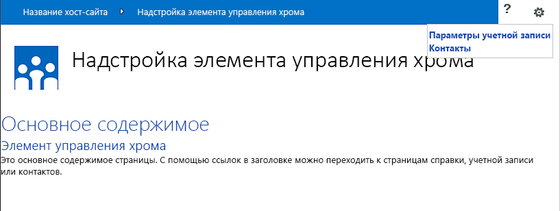

# <a name="use-the-client-chrome-control-in-sharepoint-add-ins"></a><span data-ttu-id="15251-102">Использование клиентского элемента управления хрома в надстройках SharePoint</span><span class="sxs-lookup"><span data-stu-id="15251-102">Use the client chrome control in SharePoint Add-ins</span></span>

<span data-ttu-id="15251-103">Узнайте, как использовать элемент управления хрома в надстройках в SharePoint.</span><span class="sxs-lookup"><span data-stu-id="15251-103">Learn how to use the chrome control in add-ins in SharePoint.</span></span>
 
> [!NOTE]
> <span data-ttu-id="15251-104">Название "приложения для SharePoint" изменяется на "надстройки SharePoint".</span><span class="sxs-lookup"><span data-stu-id="15251-104">The name "apps for SharePoint" is changing to "SharePoint Add-ins."</span></span> <span data-ttu-id="15251-105">В переходный период в документации и пользовательском интерфейсе некоторых продуктов SharePoint и средствах Visual Studio по-прежнему может использоваться термин "приложения для SharePoint".</span><span class="sxs-lookup"><span data-stu-id="15251-105">Note  The name "apps for SharePoint" is changing to "SharePoint Add-ins". During the transition, the documentation and the UI of some SharePoint products and Visual Studio tools might still use the term "apps for SharePoint". For details, see  New name for apps for Office and SharePoint.</span></span> <span data-ttu-id="15251-106">Подробнее см. в статье [Новое название приложений для SharePoint](new-name-for-apps-for-sharepoint.md).</span><span class="sxs-lookup"><span data-stu-id="15251-106">For details, see [New name for apps for SharePoint](new-name-for-apps-for-sharepoint.md).</span></span>

<span data-ttu-id="15251-p102">Элемент управления хрома в SharePoint позволяет использовать стили заголовков определенного сайта SharePoint в вашей надстройке без необходимости регистрировать серверную библиотеку или использовать специальные методы и средства. Чтобы использовать эту функцию, необходимо зарегистрировать библиотеку SharePoint JavaScript с помощью стандартного тега `<script>`. Вы можете использовать заполнитель с помощью HTML-элемента **div** и в дальнейшем настраивать этот элемент управления с использованием доступных параметров. Элемент управления наследует свой внешний вид от указанного веб-сайта SharePoint. </span><span class="sxs-lookup"><span data-stu-id="15251-p102">The chrome control in SharePoint enables you to use the header styling of a specific SharePoint site in your add-in without needing to register a server library or use a specific technology or tool. To use this functionality, you must register a SharePoint JavaScript library through a standard `<script>` tag. You can provide a placeholder by using an HTML **div** element and further customize the control by using the available options. The control inherits its appearance from the specified SharePoint website.</span></span>

## <a name="prerequisites-for-using-the-examples-in-this-article"></a><span data-ttu-id="15251-111">Необходимые условия для использования примеров в этой статье</span><span class="sxs-lookup"><span data-stu-id="15251-111">Prerequisites for using the examples in this article</span></span>
<span data-ttu-id="15251-112"><a name="SP15Usechromecontrol_Prereq"> </a></span><span class="sxs-lookup"><span data-stu-id="15251-112"></span></span>

<span data-ttu-id="15251-113">Для выполнения действий, описанных в этом примере, вам потребуется следующее:</span><span class="sxs-lookup"><span data-stu-id="15251-113">To follow the steps in this example, you need the following:</span></span>

- <span data-ttu-id="15251-114">Visual Studio 2015;</span><span class="sxs-lookup"><span data-stu-id="15251-114">Visual Studio 2015</span></span>
- <span data-ttu-id="15251-115">Среда разработки SharePoint (для локальных сценариев необходимо изолировать надстройку).</span><span class="sxs-lookup"><span data-stu-id="15251-115">A SharePoint development environment (add-in isolation required for on-premises scenarios)</span></span>
 
<span data-ttu-id="15251-116">Руководство по настройке среды разработки согласно вашим потребностям см. в статье о том, как [приступить к созданию надстроек Office и SharePoint](http://msdn.microsoft.com/library/187f8c8c-1b15-471c-80b5-69a40e67deea.aspx).</span><span class="sxs-lookup"><span data-stu-id="15251-116">For guidance on how to set up a development environment that fits your needs, see  [Start building Office and SharePoint Add-ins](http://msdn.microsoft.com/library/187f8c8c-1b15-471c-80b5-69a40e67deea.aspx).</span></span>

### <a name="core-concepts-to-know-before-using-the-chrome-control"></a><span data-ttu-id="15251-117">Основные понятия, которые необходимо знать, перед тем как использовать элемент управления хрома</span><span class="sxs-lookup"><span data-stu-id="15251-117">Core concepts to know before using the chrome control</span></span>

<span data-ttu-id="15251-118">В приведенной ниже таблице перечислены полезные статьи, которые могут помочь вам ознакомиться с основными понятиями, связанными с использованием элемента управления хрома.</span><span class="sxs-lookup"><span data-stu-id="15251-118">The following table lists useful articles that can help you understand the concepts involved in a scenario that uses the chrome control.</span></span>

<span data-ttu-id="15251-119">**Таблица 1. Основные понятия, связанные с использованием элемента управления хрома**</span><span class="sxs-lookup"><span data-stu-id="15251-119">**Table 1. Core concepts for using the chrome control**</span></span>

|<span data-ttu-id="15251-120">**Название статьи**</span><span class="sxs-lookup"><span data-stu-id="15251-120">**Article title**</span></span>|<span data-ttu-id="15251-121">**Описание**</span><span class="sxs-lookup"><span data-stu-id="15251-121">**Description**</span></span>|
|:-----|:-----|
| [<span data-ttu-id="15251-122">Надстройки SharePoint</span><span class="sxs-lookup"><span data-stu-id="15251-122">SharePoint Add-ins</span></span>](sharepoint-add-ins.md)|<span data-ttu-id="15251-123">Сведения о новой модели надстроек в SharePoint, с помощью которой можно создавать надстройки — небольшие и удобные в использовании решения для пользователей.</span><span class="sxs-lookup"><span data-stu-id="15251-123">Learn about the new add-in model in SharePoint that enables you to create add-ins, which are small, easy-to-use solutions for end users.</span></span>|
| [<span data-ttu-id="15251-124">Разработка пользовательского интерфейса для надстроек SharePoint</span><span class="sxs-lookup"><span data-stu-id="15251-124">UX design for SharePoint Add-ins</span></span>](ux-design-for-sharepoint-add-ins.md)|<span data-ttu-id="15251-125">Сведения о параметрах и вариантах построения пользовательского интерфейса при создании надстроек SharePoint.</span><span class="sxs-lookup"><span data-stu-id="15251-125">Learn about the user experience (UX) options and alternatives that you have when building SharePoint Add-ins.</span></span>|
| [<span data-ttu-id="15251-126">Хост-сайты, сайты надстроек и компоненты SharePoint в SharePoint</span><span class="sxs-lookup"><span data-stu-id="15251-126">Host webs, add-in webs, and SharePoint components in SharePoint</span></span>](host-webs-add-in-webs-and-sharepoint-components-in-sharepoint.md)|<span data-ttu-id="15251-p103">Узнайте, в чем разница между хост-сайтами и сайтами надстроек. Узнайте, какие компоненты SharePoint можно включать в надстройку SharePoint, какие компоненты развертываются на хост-сайте, а какие на сайте надстройки и как развертывается сайт надстройки в изолированном домене.</span><span class="sxs-lookup"><span data-stu-id="15251-p103">Learn about the distinction between host webs and add-in webs. Find out which SharePoint components can be included in a SharePoint Add-in, which components are deployed to the host web, which components are deployed to the add-in web, and how the add-in web is deployed in an isolated domain.</span></span>|

## <a name="code-example-use-the-chrome-control-in-your-cloud-hosted-add-in"></a><span data-ttu-id="15251-129">Пример кода. Использование элемента управления хрома в надстройке, размещаемой в облаке</span><span class="sxs-lookup"><span data-stu-id="15251-129">Code example: Use the chrome control in your cloud-hosted add-in</span></span>
<span data-ttu-id="15251-130"><a name="SP15Usechromecontrol_Codeexample"> </a></span><span class="sxs-lookup"><span data-stu-id="15251-130"></span></span>

<span data-ttu-id="15251-131">Размещенная в облаке надстройка включает по крайней мере один удаленный компонент.</span><span class="sxs-lookup"><span data-stu-id="15251-131">A cloud-hosted add-in includes at least one remote component.</span></span> <span data-ttu-id="15251-132">Дополнительные сведения см. в статье [Выбор шаблонов для разработки и размещения надстройки SharePoint](choose-patterns-for-developing-and-hosting-your-sharepoint-add-in.md).</span><span class="sxs-lookup"><span data-stu-id="15251-132">For more detailed information about the hosting options of SharePoint Add-ins, see  [Choose patterns for developing and hosting your SharePoint Add-in](choose-patterns-for-developing-and-hosting-your-sharepoint-add-in.md).</span></span> <span data-ttu-id="15251-133">Чтобы использовать элемент управления хрома в надстройке, размещенной в облаке, сделайте вот что:</span><span class="sxs-lookup"><span data-stu-id="15251-133">To use the chrome control in your cloud-hosted add-in, follow these steps:</span></span>

1. <span data-ttu-id="15251-134">Создайте надстройку SharePoint и удаленные веб-проекты.</span><span class="sxs-lookup"><span data-stu-id="15251-134">Create the SharePoint Add-in and remote web projects.</span></span>
2. <span data-ttu-id="15251-135">Отправьте параметры конфигурации по умолчанию в строке запроса.</span><span class="sxs-lookup"><span data-stu-id="15251-135">Send default configuration options in the query string.</span></span>
3. <span data-ttu-id="15251-136">Добавьте в веб-проект веб-страницу.</span><span class="sxs-lookup"><span data-stu-id="15251-136">Add a webpage to the web project.</span></span>

<span data-ttu-id="15251-137">На рис. 1 показана удаленная веб-страница с элементом управления хрома.</span><span class="sxs-lookup"><span data-stu-id="15251-137">Figure 1 shows a remote webpage with the chrome control.</span></span>

<span data-ttu-id="15251-138">*Рис. 1. Удаленная веб-страница с элементом управления хрома*</span><span class="sxs-lookup"><span data-stu-id="15251-138">*Figure 1. Remote webpage with the chrome control*</span></span>


 

### <a name="to-create-the-sharepoint-add-in-and-remote-web-projects"></a><span data-ttu-id="15251-140">Создание надстройки SharePoint и удаленных веб-проектов</span><span class="sxs-lookup"><span data-stu-id="15251-140">To create the SharePoint Add-in and remote web projects</span></span>

1. <span data-ttu-id="15251-141">Откройте Visual Studio 2015 от имени администратора.</span><span class="sxs-lookup"><span data-stu-id="15251-141">Open Visual Studio 2015 as administrator.</span></span> <span data-ttu-id="15251-142">Для этого щелкните правой кнопкой мыши значок Visual Studio 2015 в меню **Пуск** и выберите **Запуск от имени администратора**.</span><span class="sxs-lookup"><span data-stu-id="15251-142">Open Visual Studio 2015 as administrator. (To do this, right-click the Visual Studio 2015 icon on the **Start** menu, and choose **Run as administrator**.)</span></span>

2. <span data-ttu-id="15251-143">Создайте проект с помощью шаблона **Надстройка SharePoint**.</span><span class="sxs-lookup"><span data-stu-id="15251-143">Create a new project using the **SharePoint Add-in** template.</span></span>
    
   <span data-ttu-id="15251-144">На рис. 2 показано расположение шаблона **Надстройка SharePoint** в Visual Studio 2015: **Шаблоны** > **Visual C#** > **Office/SharePoint** > **Надстройки Office**.</span><span class="sxs-lookup"><span data-stu-id="15251-144">Figure 2 shows the location of the **SharePoint Add-in** template in Visual Studio 2015, under **Templates** > **Visual C#** > **Office/SharePoint** > **Office Add-ins**.</span></span>    

   <span data-ttu-id="15251-145">*Рис. 2. Шаблон надстройки SharePoint в Visual Studio*</span><span class="sxs-lookup"><span data-stu-id="15251-145">*Figure 2. SharePoint Add-in Visual Studio template*</span></span>

   

3. <span data-ttu-id="15251-147">Укажите URL-адрес веб-сайта SharePoint, который планируется использовать для отладки.</span><span class="sxs-lookup"><span data-stu-id="15251-147">Provide the URL of the SharePoint website that you want to use for debugging.</span></span>
 
4. <span data-ttu-id="15251-p106">Выберите **Размещено у поставщика** в качестве варианта размещения надстройки. Пример кода с размещением в SharePoint: [SharePoint-Add-in-JSOM-BasicDataOperations](https://github.com/OfficeDev/SharePoint-Add-in-JSOM-BasicDataOperations).</span><span class="sxs-lookup"><span data-stu-id="15251-p106">Select **Provider-hosted** as the hosting option for your add-in. For a SharePoint-hosted code sample, see [SharePoint-Add-in-JSOM-BasicDataOperations](https://github.com/OfficeDev/SharePoint-Add-in-JSOM-BasicDataOperations).</span></span>
    
   <span data-ttu-id="15251-150">После завершения работы мастера вы получите в **Обозревателе решений** структуру, которая напоминает структуру, показанную на рис. 3.</span><span class="sxs-lookup"><span data-stu-id="15251-150">After the wizard finishes, you should have a structure in **Solution Explorer** that resembles Figure 3.</span></span>
    
   <span data-ttu-id="15251-151">*Рис. 3. Надстройка для проектов SharePoint в обозревателе решений*</span><span class="sxs-lookup"><span data-stu-id="15251-151">*Figure 3. Add-in for SharePoint projects in Solution Explorer*</span></span>

   

### <a name="to-send-default-configuration-options-in-the-query-string"></a><span data-ttu-id="15251-153">Отправка параметров конфигурации по умолчанию в строке запроса</span><span class="sxs-lookup"><span data-stu-id="15251-153">To send default configuration options in the query string</span></span>

1. <span data-ttu-id="15251-154">Откройте файл Appmanifest.xml в редакторе манифеста.</span><span class="sxs-lookup"><span data-stu-id="15251-154">Open the Appmanifest.xml file in the manifest editor.</span></span>

2. <span data-ttu-id="15251-p107">Добавьте в строку запроса маркер **{StandardTokens}** и дополнительный параметр _SPHostTitle_. На рис. 4 показан редактор манифеста с настроенными параметрами строки запроса.</span><span class="sxs-lookup"><span data-stu-id="15251-p107">Add the **{StandardTokens}** token and an additional _SPHostTitle_ parameter to the query string. Figure 4 shows the manifest editor with the configured query string parameters.</span></span>
    
   <span data-ttu-id="15251-157">*Рис. 4. Редактор манифеста с параметрами строки запроса для элемента управления хрома*</span><span class="sxs-lookup"><span data-stu-id="15251-157">*Figure 4. Manifest editor with query string parameters for the chrome control*</span></span>

   
 
   <span data-ttu-id="15251-159">Элемент управления хрома автоматически принимает из строки запроса следующие значения:</span><span class="sxs-lookup"><span data-stu-id="15251-159">The chrome control automatically takes the following values from the query string:</span></span>
   
   -  <span data-ttu-id="15251-160">**SPHostUrl**;</span><span class="sxs-lookup"><span data-stu-id="15251-160">**SPHostUrl**</span></span>
   -  <span data-ttu-id="15251-161">**SPHostTitle**;</span><span class="sxs-lookup"><span data-stu-id="15251-161">**SPHostTitle**</span></span>
   -  <span data-ttu-id="15251-162">**SPAppWebUrl**;</span><span class="sxs-lookup"><span data-stu-id="15251-162">**SPAppWebUrl**</span></span>
   -  <span data-ttu-id="15251-163">**SPLanguage**.</span><span class="sxs-lookup"><span data-stu-id="15251-163">**SPLanguage**</span></span>
    
   <span data-ttu-id="15251-164">Маркер **{StandardTokens}** включает маркеры **SPHostUrl** и **SPAppWebUrl**.</span><span class="sxs-lookup"><span data-stu-id="15251-164">**{StandardTokens}** include **SPHostUrl** and **SPAppWebUrl**.</span></span>

### <a name="to-add-a-page-that-uses-the-chrome-control-in-the-web-project"></a><span data-ttu-id="15251-165">Добавление в веб-проект страницы с элементом управления хрома</span><span class="sxs-lookup"><span data-stu-id="15251-165">To add a page that uses the chrome control in the web project</span></span>

1. <span data-ttu-id="15251-166">Щелкните правой кнопкой мыши веб-проект и добавьте новую веб-форму.</span><span class="sxs-lookup"><span data-stu-id="15251-166">Right-click the web project, and add a new Web Form.</span></span>

2. <span data-ttu-id="15251-p108">Скопируйте следующие исправления и вставьте их на страницу ASPX. Часть кода выполняет следующие действия:</span><span class="sxs-lookup"><span data-stu-id="15251-p108">Copy the following markup, and paste it in the ASPX page. The markup performs the following tasks:</span></span>
    
   - <span data-ttu-id="15251-169">загружает библиотеку AJAX из сети доставки содержимого Майкрософт (CDN);</span><span class="sxs-lookup"><span data-stu-id="15251-169">Loads the AJAX library from the Microsoft CDN (Content Delivery Network).</span></span>
   
   - <span data-ttu-id="15251-170">Загружает библиотеку jQuery из сети CDN Майкрософт.</span><span class="sxs-lookup"><span data-stu-id="15251-170">Loads the jQuery library from the Microsoft CDN.</span></span>
   
   - <span data-ttu-id="15251-171">загружает файл SP.UI.Controls.js с помощью функции jQuery **getScript**;</span><span class="sxs-lookup"><span data-stu-id="15251-171">Loads the SP.UI.Controls.js file using the jQuery function **getScript**.</span></span>
   
   - <span data-ttu-id="15251-172">определяет функцию обратного вызова для события **onCssLoaded**;</span><span class="sxs-lookup"><span data-stu-id="15251-172">Defines a callback function for the **onCssLoaded** event.</span></span>
   
   - <span data-ttu-id="15251-173">подготавливает параметры для элемента управления хрома;</span><span class="sxs-lookup"><span data-stu-id="15251-173">Prepares the options for the chrome control.</span></span>
   
   - <span data-ttu-id="15251-174">инициализирует элемент управления хрома.</span><span class="sxs-lookup"><span data-stu-id="15251-174">Initializes the chrome control.</span></span>

    ```HTML
       <!DOCTYPE html>
     <html xmlns="http://www.w3.org/1999/xhtml">
     <head>
         <title>Chrome control host page</title>
         <script 
             src="//ajax.aspnetcdn.com/ajax/4.0/1/MicrosoftAjax.js" 
             type="text/javascript">
         </script>
         <script 
             type="text/javascript" 
             src="//ajax.aspnetcdn.com/ajax/jQuery/jquery-1.7.2.min.js">
         </script>      
         <script 
             type="text/javascript"
             src="ChromeLoader.js">
         </script>
     <script type="text/javascript">
     "use strict";

     var hostweburl;

     //load the SharePoint resources
     $(document).ready(function () {
         //Get the URI decoded URL.
         hostweburl =
             decodeURIComponent(
                 getQueryStringParameter("SPHostUrl")
         );

         // The SharePoint js files URL are in the form:
         // web_url/_layouts/15/resource
         var scriptbase = hostweburl + "/_layouts/15/";

         // Load the js file and continue to the 
         //   success handler
         $.getScript(scriptbase + "SP.UI.Controls.js", renderChrome)
     });

     // Callback for the onCssLoaded event defined
     //  in the options object of the chrome control
     function chromeLoaded() {
         // When the page has loaded the required
         //  resources for the chrome control,
         //  display the page body.
         $("body").show();
     }

     //Function to prepare the options and render the control
     function renderChrome() {
         // The Help, Account and Contact pages receive the 
         //   same query string parameters as the main page
         var options = {
             "appIconUrl": "siteicon.png",
             "appTitle": "Chrome control add-in",
             "appHelpPageUrl": "Help.html?"
                 + document.URL.split("?")[1],
             // The onCssLoaded event allows you to 
             //  specify a callback to execute when the
             //  chrome resources have been loaded.
             "onCssLoaded": "chromeLoaded()",
             "settingsLinks": [
                 {
                     "linkUrl": "Account.html?"
                         + document.URL.split("?")[1],
                     "displayName": "Account settings"
                 },
                 {
                     "linkUrl": "Contact.html?"
                         + document.URL.split("?")[1],
                     "displayName": "Contact us"
                 }
             ]
         };

         var nav = new SP.UI.Controls.Navigation(
                                 "chrome_ctrl_placeholder",
                                 options
                             );
         nav.setVisible(true);
     }

     // Function to retrieve a query string value.
     // For production purposes you may want to use
     //  a library to handle the query string.
     function getQueryStringParameter(paramToRetrieve) {
         var params =
             document.URL.split("?")[1].split("&amp;");
         var strParams = "";
         for (var i = 0; i < params.length; i = i + 1) {
             var singleParam = params[i].split("=");
             if (singleParam[0] == paramToRetrieve)
                 return singleParam[1];
         }
     }
     </script>
     </head>

     <!-- The body is initally hidden. 
          The onCssLoaded callback allows you to 
          display the content after the required
          resources for the chrome control have
          been loaded.  -->
     <body style="display: none">

         <!-- Chrome control placeholder -->
         <div id="chrome_ctrl_placeholder"></div>

         <!-- The chrome control also makes the SharePoint
               Website stylesheet available to your page -->
         <h1 class="ms-accentText">Main content</h1>
         <h2 class="ms-accentText">The chrome control</h2>
         <div id="MainContent">
             This is the page's main content. 
             You can use the links in the header to go to the help, 
             account or contact pages.
         </div>
     </body>
     </html>
    ```

3. <span data-ttu-id="15251-p109">Элемент управления хрома также можно использовать декларативным способом. В следующем примере кода в разметке HTML элемент управления объявляется без использования кода JavaScript для его настройки и инициализации. Эта разметка выполняет следующие задачи:</span><span class="sxs-lookup"><span data-stu-id="15251-p109">You can also use the chrome control in a declarative way. In the following code example, the HTML markup declares the control without using JavaScript code to configure and initialize the control. The following markup performs the following tasks:</span></span>
   
   - <span data-ttu-id="15251-178">предоставляет заполнитель для файла JavaScript SP.UI.Controls.js;</span><span class="sxs-lookup"><span data-stu-id="15251-178">Provides a placeholder for the SP.UI.Controls.js JavaScript file.</span></span>
   
   - <span data-ttu-id="15251-179">динамически загружает файл SP.UI.Controls.js;</span><span class="sxs-lookup"><span data-stu-id="15251-179">Dynamically loads the SP.UI.Controls.js file</span></span>
   
   - <span data-ttu-id="15251-180">предоставляет заполнитель для элемента управления хрома и задает его параметры (разметку HTML).</span><span class="sxs-lookup"><span data-stu-id="15251-180">Provides a placeholder for the chrome control and specifies the options inline with the HTML markup.</span></span>

    ```HTML
       <!DOCTYPE html>
     <html xmlns="http://www.w3.org/1999/xhtml">
     <head>
         <title>Chrome control host page</title>
         <script 
             src="http://ajax.aspnetcdn.com/ajax/4.0/1/MicrosoftAjax.js" 
             type="text/javascript">
         </script>
         <script 
             type="text/javascript" 
             src="http://ajax.aspnetcdn.com/ajax/jQuery/jquery-1.7.2.min.js">
         </script>      
         <script type="text/javascript">
         var hostweburl;

         // Load the SharePoint resources.
         $(document).ready(function () {

             // Get the URI decoded add-in web URL.
             hostweburl =
                 decodeURIComponent(
                     getQueryStringParameter("SPHostUrl")
             );

             // The SharePoint js files URL are in the form:
             // web_url/_layouts/15/resource.js
             var scriptbase = hostweburl + "/_layouts/15/";

             // Load the js file and continue to the 
             // success handler.
             $.getScript(scriptbase + "SP.UI.Controls.js")
         });

         // Function to retrieve a query string value.
         // For production purposes you may want to use
         // a library to handle the query string.
         function getQueryStringParameter(paramToRetrieve) {
             var params =
                 document.URL.split("?")[1].split("&amp;");
             var strParams = "";
             for (var i = 0; i < params.length; i = i + 1) {
                 var singleParam = params[i].split("=");
                 if (singleParam[0] == paramToRetrieve)
                     return singleParam[1];
             }
         }
         </script>
     </head>
     <body>

         <!-- Chrome control placeholder 
                Options are declared inline.  -->
         <div 
             id="chrome_ctrl_container"
             data-ms-control="SP.UI.Controls.Navigation"  
             data-ms-options=
                 '{  
                     "appHelpPageUrl" : "Help.html",
                     "appIconUrl" : "siteIcon.png",
                     "appTitle" : "Chrome control add-in",
                     "settingsLinks" : [
                         {
                             "linkUrl" : "Account.html",
                             "displayName" : "Account settings"
                         },
                         {
                             "linkUrl" : "Contact.html",
                             "displayName" : "Contact us"
                         }
                     ]
                  }'>
         </div>

         <!-- The chrome control also makes the SharePoint
               Website style sheet available to your page. -->
         <h1 class="ms-accentText">Main content</h1>
         <h2 class="ms-accentText">The chrome control</h2>
         <div id="MainContent">
             This is the page's main content. 
             You can use the links in the header to go to the help, 
             account or contact pages.
         </div>
     </body>
     </html>
    ```

   <span data-ttu-id="15251-181">Библиотека SP.UI.Controls.js автоматически отображает элемент управления, если обнаруживает атрибут **data-ms-control="SP.UI.Controls.Navigation"** в элементе **div**.</span><span class="sxs-lookup"><span data-stu-id="15251-181">The SP.UI.Controls.js library automatically renders the control if it finds the **data-ms-control="SP.UI.Controls.Navigation"** attribute in a **div** element.</span></span>

### <a name="to-edit-the-startpage-element-in-the-add-in-manifest"></a><span data-ttu-id="15251-182">Изменение элемента StartPage в манифесте надстройки</span><span class="sxs-lookup"><span data-stu-id="15251-182">To edit the StartPage element in the add-in manifest</span></span>

1. <span data-ttu-id="15251-183">Дважды щелкните файл **AppManifest.xml** в **обозревателе решений**.</span><span class="sxs-lookup"><span data-stu-id="15251-183">Double-click the **AppManifest.xml** file in **Solution Explorer**.</span></span>

2. <span data-ttu-id="15251-184">В раскрывающемся меню **Начальная страница** выберите веб-страницу, на которой используется элемент управления хрома.</span><span class="sxs-lookup"><span data-stu-id="15251-184">On the **Start page** drop-down menu, choose the webpage that uses the chrome control.</span></span>

### <a name="to-build-and-run-the-solution"></a><span data-ttu-id="15251-185">Сборка и запуск решения</span><span class="sxs-lookup"><span data-stu-id="15251-185">To build and run the solution</span></span>

1. <span data-ttu-id="15251-186">Убедитесь, что проект надстройки SharePoint выбран как запускаемый проект.</span><span class="sxs-lookup"><span data-stu-id="15251-186">Make sure that the SharePoint Add-in project is set as the startup project.</span></span>

2. <span data-ttu-id="15251-187">Нажмите клавишу F5.</span><span class="sxs-lookup"><span data-stu-id="15251-187">Press the F5 key.</span></span> <span data-ttu-id="15251-188">(Обратите внимание, что после нажатия клавиши F5 Visual Studio выполняет сборку решения, развертывает надстройку и открывает для нее страницу разрешений.)</span><span class="sxs-lookup"><span data-stu-id="15251-188">Note  When you press F5, Visual Studio builds the solution, deploys the add-in, and opens the permissions page for the add-in.</span></span>

3. <span data-ttu-id="15251-189">Нажмите кнопку **Доверять**.</span><span class="sxs-lookup"><span data-stu-id="15251-189">Choose the  **Trust It** button.</span></span>

4. <span data-ttu-id="15251-190">Выберите значок надстройки **ChromeControlCloudhosted**.</span><span class="sxs-lookup"><span data-stu-id="15251-190">Click the  **ChromeControlCloudhosted** add-in icon.</span></span>

5. <span data-ttu-id="15251-191">При использовании элемента управления хрома на веб-страницах вы также можете использовать таблицу стилей веб-сайта SharePoint, как показано на рис. 5.</span><span class="sxs-lookup"><span data-stu-id="15251-191">When you use the chrome control in your webpages, you can also use the SharePoint website style sheet, as shown in Figure 4.</span></span>
    
   <span data-ttu-id="15251-192">*Рис. 5. Таблица стилей веб-сайта SharePoint на странице*</span><span class="sxs-lookup"><span data-stu-id="15251-192">*Figure 5. SharePoint website style sheet used in the page*</span></span>

   
 

<span data-ttu-id="15251-194">**Таблица 2. Устранение неполадок в решении**</span><span class="sxs-lookup"><span data-stu-id="15251-194">**Table 2. Troubleshooting the solution**</span></span>

|<span data-ttu-id="15251-195">**Проблема**</span><span class="sxs-lookup"><span data-stu-id="15251-195">**Problem**</span></span>|<span data-ttu-id="15251-196">**Решение**</span><span class="sxs-lookup"><span data-stu-id="15251-196">**Solution**</span></span>|
|:-----|:-----|
|<span data-ttu-id="15251-197">Необработанное исключение **SP не определен**.</span><span class="sxs-lookup"><span data-stu-id="15251-197">Unhandled exception **SP is undefined**.</span></span>|<span data-ttu-id="15251-198">Убедитесь, что в браузере загружается файл SP.UI.Controls.js.</span><span class="sxs-lookup"><span data-stu-id="15251-198">Make sure your browser loads SP.UI.Controls.js file.</span></span>|
|<span data-ttu-id="15251-199">Элемент управления хрома не выполняет обработку должным образом.</span><span class="sxs-lookup"><span data-stu-id="15251-199">The chrome control does not render properly.</span></span>|<span data-ttu-id="15251-200">Элемент управления хрома поддерживает только режимы документов Internet Explorer 8 и более поздних версий.</span><span class="sxs-lookup"><span data-stu-id="15251-200">The chrome control only supports document modes Internet Explorer 8 and later.</span></span> <span data-ttu-id="15251-201">Убедитесь, что браузер отображает страницу в режиме документов Internet Explorer 8 или более поздних версий.</span><span class="sxs-lookup"><span data-stu-id="15251-201">The chrome control only supports document modes Internet Explorer 8 and superior. Make sure your browser renders your page in document mode Internet Explorer 8 or superior.</span></span>|
|<span data-ttu-id="15251-202">Ошибка сертификата.</span><span class="sxs-lookup"><span data-stu-id="15251-202">Certificate error.</span></span>|<span data-ttu-id="15251-203">Установите для свойства **SSL включен** веб-проекта значение **false**.</span><span class="sxs-lookup"><span data-stu-id="15251-203">Set the **SSL Enabled** property of your web project to **false**.</span></span> <span data-ttu-id="15251-204">В проекте надстройки SharePoint задайте для свойства **Веб-проект** значение **None**, а затем снова укажите в нем имя веб-проекта.</span><span class="sxs-lookup"><span data-stu-id="15251-204">Set the  **SSL Enabled** property of your web project to false. In the SharePoint Add-in project, set the **Web Project** property toNone, and then set the property back to your web project's name.</span></span>|

## <a name="next-steps"></a><span data-ttu-id="15251-205">Дальнейшие действия</span><span class="sxs-lookup"><span data-stu-id="15251-205">Next steps</span></span>
<span data-ttu-id="15251-206"><a name="SP15Usechromecontrol_Nextsteps"> </a></span><span class="sxs-lookup"><span data-stu-id="15251-206"></span></span>

<span data-ttu-id="15251-p113">В этой статье показано, как использовать элемент управления хрома в надстройке SharePoint. Далее вы можете узнать о других компонентах UX, доступных для надстроек SharePoint. Дополнительные сведения см. в следующих статьях:</span><span class="sxs-lookup"><span data-stu-id="15251-p113">This article demonstrated how to use the chrome control in a SharePoint Add-in. As a next step, you can learn about other UX components that are available for SharePoint Add-ins. To learn more, see the following:</span></span>

-  [<span data-ttu-id="15251-209">Пример кода. Использование элемента управления хрома в надстройке, размещаемой в облаке</span><span class="sxs-lookup"><span data-stu-id="15251-209">Code sample: Use the chrome control in a cloud-hosted add-in</span></span>](http://code.msdn.microsoft.com/SharePoint-Work-with-089ecc6f)
-  [<span data-ttu-id="15251-210">Пример кода. Использование элемента управления хрома и междоменной библиотеки (CSOM)</span><span class="sxs-lookup"><span data-stu-id="15251-210">Code sample: Use the chrome control and the cross-domain library (CSOM)</span></span>](http://code.msdn.microsoft.com/SharePoint-Use-the-97c30a2e)
-  [<span data-ttu-id="15251-211">Пример кода: использование элемента управления хрома и междоменной библиотеки (REST)</span><span class="sxs-lookup"><span data-stu-id="15251-211">Code sample: Use the chrome control and the cross-domain library (REST)</span></span>](http://code.msdn.microsoft.com/SharePoint-Use-the-a759e9f8)
-  [<span data-ttu-id="15251-212">Использование таблицы стилей веб-сайта SharePoint в надстройках SharePoint</span><span class="sxs-lookup"><span data-stu-id="15251-212">Use a SharePoint website's style sheet in SharePoint Add-ins</span></span>](use-a-sharepoint-website-s-style-sheet-in-sharepoint-add-ins.md)
-  [<span data-ttu-id="15251-213">Создание дополнительных действий для развертывания с надстройками SharePoint</span><span class="sxs-lookup"><span data-stu-id="15251-213">Create custom actions to deploy with SharePoint Add-ins</span></span>](create-custom-actions-to-deploy-with-sharepoint-add-ins.md)
-  [<span data-ttu-id="15251-214">Создание веб-частей надстроек для установки вместе с надстройкой SharePoint</span><span class="sxs-lookup"><span data-stu-id="15251-214">Create add-in parts to install with your SharePoint Add-in</span></span>](create-add-in-parts-to-install-with-your-sharepoint-add-in.md)

## <a name="additional-resources"></a><span data-ttu-id="15251-215">Дополнительные ресурсы</span><span class="sxs-lookup"><span data-stu-id="15251-215">Additional resources</span></span>
<span data-ttu-id="15251-216"><a name="SP15Usechromecontrol_Addresources"> </a></span><span class="sxs-lookup"><span data-stu-id="15251-216"></span></span>

-  [<span data-ttu-id="15251-217">Настройка локальной среды разработки надстроек SharePoint</span><span class="sxs-lookup"><span data-stu-id="15251-217">Set up an on-premises development environment for SharePoint Add-ins</span></span>](set-up-an-on-premises-development-environment-for-sharepoint-add-ins.md)
-  [<span data-ttu-id="15251-218">Разработка пользовательского интерфейса для надстроек SharePoint</span><span class="sxs-lookup"><span data-stu-id="15251-218">UX design for SharePoint Add-ins</span></span>](ux-design-for-sharepoint-add-ins.md)
-  [<span data-ttu-id="15251-219">Рекомендации по проектированию пользовательского интерфейса надстроек SharePoint</span><span class="sxs-lookup"><span data-stu-id="15251-219">SharePoint Add-ins UX design guidelines</span></span>](sharepoint-add-ins-ux-design-guidelines.md)
-  [<span data-ttu-id="15251-220">Создание компонентов пользовательского интерфейса в SharePoint</span><span class="sxs-lookup"><span data-stu-id="15251-220">Create UX components in SharePoint</span></span>](create-ux-components-in-sharepoint.md)
-  [<span data-ttu-id="15251-221">Что следует рассмотреть, прежде чем приступать к разработке надстроек SharePoint</span><span class="sxs-lookup"><span data-stu-id="15251-221">Three ways to think about design options for SharePoint Add-ins</span></span>](three-ways-to-think-about-design-options-for-sharepoint-add-ins.md)
-  [<span data-ttu-id="15251-222">Важные аспекты архитектуры и разработки надстроек SharePoint</span><span class="sxs-lookup"><span data-stu-id="15251-222">Important aspects of the SharePoint Add-in architecture and development landscape</span></span>](important-aspects-of-the-sharepoint-add-in-architecture-and-development-landscap.md)
    
 

