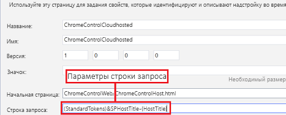

# <a name="use-the-client-chrome-control-in-sharepoint-add-ins"></a><span data-ttu-id="0232e-103">Использование клиентского элемента управления хрома в надстройках SharePoint</span><span class="sxs-lookup"><span data-stu-id="0232e-103">Use the client chrome control in SharePoint Add-ins</span></span>

<span data-ttu-id="0232e-p101">Элемент управления хрома в SharePoint позволяет использовать стили заголовков определенного сайта SharePoint в вашей надстройке без необходимости регистрировать серверную библиотеку или использовать специальные методы и средства. Чтобы использовать эту функцию, необходимо зарегистрировать библиотеку SharePoint JavaScript с помощью стандартного тега `<script>`. Вы можете использовать заполнитель с помощью HTML-элемента **div** и в дальнейшем настраивать этот элемент управления с использованием доступных параметров. Элемент управления наследует свой внешний вид от указанного веб-сайта SharePoint. </span><span class="sxs-lookup"><span data-stu-id="0232e-p101">The chrome control in SharePoint enables you to use the header styling of a specific SharePoint site in your add-in without needing to register a server library or use a specific technology or tool. To use this functionality, you must register a SharePoint JavaScript library through a standard `<script>` tag. You can provide a placeholder by using an HTML **div** element and further customize the control by using the available options. The control inherits its appearance from the specified SharePoint website.</span></span>

<span data-ttu-id="0232e-108"><a name="SP15Usechromecontrol_Prereq"> </a></span><span class="sxs-lookup"><span data-stu-id="0232e-108"></span></span>

## <a name="prerequisites-for-using-the-examples-in-this-article"></a><span data-ttu-id="0232e-109">Необходимые условия для использования примеров в этой статье</span><span class="sxs-lookup"><span data-stu-id="0232e-109">Prerequisites for using the examples in this article</span></span>

<span data-ttu-id="0232e-110">Для выполнения действий, описанных в этом примере, вам необходимо следующее:</span><span class="sxs-lookup"><span data-stu-id="0232e-110">To follow the steps in this example, you need the following:</span></span>

- <span data-ttu-id="0232e-111">Visual Studio 2015;</span><span class="sxs-lookup"><span data-stu-id="0232e-111">Visual Studio 2015</span></span>
- <span data-ttu-id="0232e-112">среда разработки SharePoint (для локальных сценариев необходимо изолировать надстройку).</span><span class="sxs-lookup"><span data-stu-id="0232e-112">A SharePoint development environment (add-in isolation required for on-premises scenarios)</span></span>
 
<span data-ttu-id="0232e-113">Инструкции по настройке подходящей вам среды разработки см. в разделе [Два типа надстроек SharePoint (с размещением в SharePoint и у поставщика)](sharepoint-add-ins.md#two-types-of-sharepoint-add-ins-sharepoint-hosted-and-provider-hosted).</span><span class="sxs-lookup"><span data-stu-id="0232e-113">Note  For guidance about how to set up a development environment that fits your needs, see  Start building Office and SharePoint Add-ins.</span></span>

### <a name="core-concepts-to-know-before-using-the-chrome-control"></a><span data-ttu-id="0232e-114">Ключевые понятия, с которыми необходимо ознакомиться перед использованием элемента управления хрома</span><span class="sxs-lookup"><span data-stu-id="0232e-114">Core concepts to know before using the chrome control</span></span>

<span data-ttu-id="0232e-115">Ниже перечислены полезные статьи, в которых описано, как использовать элемент управления хрома.</span><span class="sxs-lookup"><span data-stu-id="0232e-115">The following table lists useful articles that can help you understand the concepts involved in a scenario that uses the chrome control.</span></span>

|<span data-ttu-id="0232e-116">**Название статьи**</span><span class="sxs-lookup"><span data-stu-id="0232e-116">**Article title**</span></span>|<span data-ttu-id="0232e-117">**Описание**</span><span class="sxs-lookup"><span data-stu-id="0232e-117">**Description**</span></span>|
|:-----|:-----|
| [<span data-ttu-id="0232e-118">Надстройки SharePoint</span><span class="sxs-lookup"><span data-stu-id="0232e-118">SharePoint Add-ins</span></span>](sharepoint-add-ins.md)|<span data-ttu-id="0232e-119">Сведения о новой модели надстроек в SharePoint, с помощью которой можно создавать надстройки — небольшие и удобные в использовании решения для пользователей.</span><span class="sxs-lookup"><span data-stu-id="0232e-119">Learn about the new add-in model in SharePoint that enables you to create add-ins, which are small, easy-to-use solutions for end users.</span></span>|
| [<span data-ttu-id="0232e-120">Разработка пользовательского интерфейса для надстроек SharePoint</span><span class="sxs-lookup"><span data-stu-id="0232e-120">UX design for SharePoint Add-ins</span></span>](ux-design-for-sharepoint-add-ins.md)|<span data-ttu-id="0232e-121">Сведения о параметрах и вариантах построения пользовательского интерфейса при создании надстроек SharePoint.</span><span class="sxs-lookup"><span data-stu-id="0232e-121">Learn about the user experience (UX) options and alternatives that you have when building SharePoint Add-ins.</span></span>|
| [<span data-ttu-id="0232e-122">Хост-сайты, сайты надстроек и компоненты SharePoint в SharePoint</span><span class="sxs-lookup"><span data-stu-id="0232e-122">Host webs, add-in webs, and SharePoint components in SharePoint</span></span>](host-webs-add-in-webs-and-sharepoint-components-in-sharepoint.md)|<span data-ttu-id="0232e-p102">Узнайте, в чем разница между хост-сайтами и сайтами надстроек. Узнайте, какие компоненты SharePoint можно включать в надстройку SharePoint, какие компоненты развертываются на хост-сайте, а какие на сайте надстройки и как развертывается сайт надстройки в изолированном домене.</span><span class="sxs-lookup"><span data-stu-id="0232e-p102">Learn about the distinction between host webs and add-in webs. Find out which SharePoint components can be included in a SharePoint Add-in, which components are deployed to the host web, which components are deployed to the add-in web, and how the add-in web is deployed in an isolated domain.</span></span>|

<span data-ttu-id="0232e-125"><a name="SP15Usechromecontrol_Codeexample"> </a></span><span class="sxs-lookup"><span data-stu-id="0232e-125"></span></span>

## <a name="code-example-use-the-chrome-control-in-your-cloud-hosted-add-in"></a><span data-ttu-id="0232e-126">Пример кода. Использование элемента управления хрома в надстройке, размещенной в облаке</span><span class="sxs-lookup"><span data-stu-id="0232e-126">Code example: Use the chrome control in your cloud-hosted add-in</span></span>

<span data-ttu-id="0232e-127">Размещенная в облаке надстройка включает по крайней мере один удаленный компонент.</span><span class="sxs-lookup"><span data-stu-id="0232e-127">A cloud-hosted add-in includes at least one remote component.</span></span> <span data-ttu-id="0232e-128">Дополнительные сведения см. в статье [Выбор шаблонов для разработки и размещения надстройки SharePoint](choose-patterns-for-developing-and-hosting-your-sharepoint-add-in.md).</span><span class="sxs-lookup"><span data-stu-id="0232e-128">For more information, see [Choose patterns for developing and hosting your SharePoint Add-in](choose-patterns-for-developing-and-hosting-your-sharepoint-add-in.md).</span></span> <span data-ttu-id="0232e-129">Чтобы использовать элемент управления хрома в надстройке, размещенной в облаке, сделайте вот что:</span><span class="sxs-lookup"><span data-stu-id="0232e-129">To use the chrome control in your cloud-hosted add-in, follow these steps:</span></span>

1. <span data-ttu-id="0232e-130">Создайте надстройку SharePoint и удаленные веб-проекты.</span><span class="sxs-lookup"><span data-stu-id="0232e-130">Create the SharePoint Add-in and remote web projects.</span></span>
2. <span data-ttu-id="0232e-131">Отправьте параметры конфигурации по умолчанию в строке запроса.</span><span class="sxs-lookup"><span data-stu-id="0232e-131">Send default configuration options in the query string.</span></span>
3. <span data-ttu-id="0232e-132">Добавьте в веб-проект веб-страницу.</span><span class="sxs-lookup"><span data-stu-id="0232e-132">Add a webpage to the web project.</span></span>

<span data-ttu-id="0232e-133">На следующем рисунке показана удаленная веб-страница с элементом управления хрома.</span><span class="sxs-lookup"><span data-stu-id="0232e-133">Figure 1 shows a remote webpage with the chrome control.</span></span>

<span data-ttu-id="0232e-134">**Удаленная веб-страница с элементом управления хрома**</span><span class="sxs-lookup"><span data-stu-id="0232e-134">**Figure 1. Remote webpage with the chrome control**</span></span>


 
<br/>

### <a name="to-create-the-sharepoint-add-in-and-remote-web-projects"></a><span data-ttu-id="0232e-136">Создание надстройки SharePoint и удаленных веб-проектов</span><span class="sxs-lookup"><span data-stu-id="0232e-136">To create the SharePoint Add-in and remote web projects</span></span>

1. <span data-ttu-id="0232e-137">Откройте Visual Studio 2015 от имени администратора.</span><span class="sxs-lookup"><span data-stu-id="0232e-137">Open Visual Studio 2015 as administrator.</span></span> <span data-ttu-id="0232e-138">Для этого щелкните правой кнопкой мыши значок Visual Studio 2015 в меню **Пуск** и выберите **Запуск от имени администратора**.</span><span class="sxs-lookup"><span data-stu-id="0232e-138">(To do this, right-click the Visual Studio 2015 icon on the **Start** menu, and select **Run as administrator**.)</span></span>

2. <span data-ttu-id="0232e-139">Создайте проект, используя шаблон **Надстройка SharePoint**.</span><span class="sxs-lookup"><span data-stu-id="0232e-139">Create a new project by using the **SharePoint Add-in** template.</span></span>
    
   <span data-ttu-id="0232e-140">На следующем рисунке показано расположение шаблона **Надстройка SharePoint** в Visual Studio 2015: **Шаблоны** > **Visual C#** > **Office/SharePoint** > **Надстройки Office**.</span><span class="sxs-lookup"><span data-stu-id="0232e-140">Figure 2 shows the location of the **SharePoint Add-in** template in Visual Studio 2015, under **Templates** > **Visual C#** > **Office/SharePoint** > **Office Add-ins**.</span></span>    

   <span data-ttu-id="0232e-141">**Шаблон надстройки SharePoint в Visual Studio**</span><span class="sxs-lookup"><span data-stu-id="0232e-141">**Figure 2. SharePoint Add-in Visual Studio template**</span></span>

   

   <br/>

3. <span data-ttu-id="0232e-143">Укажите URL-адрес веб-сайта SharePoint, который планируется использовать для отладки.</span><span class="sxs-lookup"><span data-stu-id="0232e-143">Provide the URL of the SharePoint website that you want to use for debugging.</span></span>
 
4. <span data-ttu-id="0232e-p105">Выберите **Размещено у поставщика** в качестве варианта размещения надстройки. Пример кода с размещением в SharePoint см. на странице [SharePoint-Add-in-JSOM-BasicDataOperations](https://github.com/OfficeDev/SharePoint-Add-in-JSOM-BasicDataOperations).</span><span class="sxs-lookup"><span data-stu-id="0232e-p105">Select **Provider-hosted** as the hosting option for your add-in. For a SharePoint-hosted code sample, see [SharePoint-Add-in-JSOM-BasicDataOperations](https://github.com/OfficeDev/SharePoint-Add-in-JSOM-BasicDataOperations).</span></span>
    
   <span data-ttu-id="0232e-146">Когда мастер завершит работу, структура в **обозревателе решений** будет напоминать структуру, показанную на следующем рисунке.</span><span class="sxs-lookup"><span data-stu-id="0232e-146">After the wizard finishes, you should have a structure in **Solution Explorer** that resembles Figure 3.</span></span>
    
   <span data-ttu-id="0232e-147">**Проекты "Надстройка для SharePoint" в обозревателе решений**</span><span class="sxs-lookup"><span data-stu-id="0232e-147">**Figure 3. Add-in for SharePoint projects in Solution Explorer**</span></span>

   

   <br/>

### <a name="to-send-default-configuration-options-in-the-query-string"></a><span data-ttu-id="0232e-149">Отправка параметров конфигурации по умолчанию в строке запроса</span><span class="sxs-lookup"><span data-stu-id="0232e-149">To send default configuration options in the query string</span></span>

1. <span data-ttu-id="0232e-150">Откройте файл Appmanifest.xml в редакторе манифеста.</span><span class="sxs-lookup"><span data-stu-id="0232e-150">Open the Appmanifest.xml file in the manifest editor.</span></span>

2. <span data-ttu-id="0232e-151">Добавьте в строку запроса маркер **{StandardTokens}** и дополнительный параметр _SPHostTitle_.</span><span class="sxs-lookup"><span data-stu-id="0232e-151">Add the **{StandardTokens}** token and an additional _SPHostTitle_ parameter to the query string. Figure 4 shows the manifest editor with the configured query string parameters.</span></span> <span data-ttu-id="0232e-152">На следующем рисунке показан редактор манифеста с настроенными параметрами строки запроса.</span><span class="sxs-lookup"><span data-stu-id="0232e-152">The following figure shows the manifest editor with the configured query string parameters.</span></span>
    
   <span data-ttu-id="0232e-153">**Редактор манифеста с параметрами строки запроса для элемента управления хрома**</span><span class="sxs-lookup"><span data-stu-id="0232e-153">**Figure 4. Manifest editor with query string parameters for the chrome control**</span></span>

   

   <br/>
 
   <span data-ttu-id="0232e-155">Элемент управления хрома автоматически принимает из строки запроса следующие значения:</span><span class="sxs-lookup"><span data-stu-id="0232e-155">The chrome control automatically takes the following values from the query string:</span></span>
   
   - <span data-ttu-id="0232e-156">**SPHostUrl**;</span><span class="sxs-lookup"><span data-stu-id="0232e-156">**SPHostUrl**</span></span>
   - <span data-ttu-id="0232e-157">**SPHostTitle**;</span><span class="sxs-lookup"><span data-stu-id="0232e-157">**SPHostTitle**</span></span>
   - <span data-ttu-id="0232e-158">**SPAppWebUrl**;</span><span class="sxs-lookup"><span data-stu-id="0232e-158">**SPAppWebUrl**</span></span>
   - <span data-ttu-id="0232e-159">**SPLanguage**.</span><span class="sxs-lookup"><span data-stu-id="0232e-159">**SPLanguage**</span></span>
    
   <span data-ttu-id="0232e-160">Маркер **{StandardTokens}** включает маркеры **SPHostUrl** и **SPAppWebUrl**.</span><span class="sxs-lookup"><span data-stu-id="0232e-160">**{StandardTokens}** include **SPHostUrl** and **SPAppWebUrl**.</span></span>

### <a name="to-add-a-page-that-uses-the-chrome-control-in-the-web-project"></a><span data-ttu-id="0232e-161">Добавление в веб-проект страницы с элементом управления хрома</span><span class="sxs-lookup"><span data-stu-id="0232e-161">To add a page that uses the chrome control in the web project</span></span>

1. <span data-ttu-id="0232e-162">Щелкните правой кнопкой мыши веб-проект и добавьте новую веб-форму.</span><span class="sxs-lookup"><span data-stu-id="0232e-162">Right-click the web project, and add a new Web Form.</span></span>

2. <span data-ttu-id="0232e-p107">Скопируйте следующие исправления и вставьте их на страницу ASPX. Часть кода выполняет следующие действия:</span><span class="sxs-lookup"><span data-stu-id="0232e-p107">Copy the following markup, and paste it in the ASPX page. The markup performs the following tasks:</span></span>
    
   - <span data-ttu-id="0232e-165">загружает библиотеку AJAX из сети доставки содержимого Майкрософт (CDN);</span><span class="sxs-lookup"><span data-stu-id="0232e-165">Loads the AJAX library from the Microsoft CDN (Content Delivery Network).</span></span>
   
   - <span data-ttu-id="0232e-166">Загружает библиотеку jQuery из сети CDN Майкрософт.</span><span class="sxs-lookup"><span data-stu-id="0232e-166">Loads the jQuery library from the Microsoft CDN.</span></span>
   
   - <span data-ttu-id="0232e-167">загружает файл SP.UI.Controls.js с помощью функции jQuery **getScript**;</span><span class="sxs-lookup"><span data-stu-id="0232e-167">Loads the SP.UI.Controls.js file using the jQuery function **getScript**.</span></span>
   
   - <span data-ttu-id="0232e-168">определяет функцию обратного вызова для события **onCssLoaded**;</span><span class="sxs-lookup"><span data-stu-id="0232e-168">Defines a callback function for the **onCssLoaded** event.</span></span>
   
   - <span data-ttu-id="0232e-169">подготавливает параметры для элемента управления хрома;</span><span class="sxs-lookup"><span data-stu-id="0232e-169">Prepares the options for the chrome control.</span></span>
   
   - <span data-ttu-id="0232e-170">инициализирует элемент управления хрома.</span><span class="sxs-lookup"><span data-stu-id="0232e-170">Initializes the chrome control.</span></span>

    ```HTML
       <!DOCTYPE html>
     <html xmlns="http://www.w3.org/1999/xhtml">
     <head>
         <title>Chrome control host page</title>
         <script 
             src="//ajax.aspnetcdn.com/ajax/4.0/1/MicrosoftAjax.js" 
             type="text/javascript">
         </script>
         <script 
             type="text/javascript" 
             src="//ajax.aspnetcdn.com/ajax/jQuery/jquery-1.7.2.min.js">
         </script>      
         <script 
             type="text/javascript"
             src="ChromeLoader.js">
         </script>
     <script type="text/javascript">
     "use strict";

     var hostweburl;

     //load the SharePoint resources
     $(document).ready(function () {
         //Get the URI decoded URL.
         hostweburl =
             decodeURIComponent(
                 getQueryStringParameter("SPHostUrl")
         );

         // The SharePoint js files URL are in the form:
         // web_url/_layouts/15/resource
         var scriptbase = hostweburl + "/_layouts/15/";

         // Load the js file and continue to the 
         //   success handler
         $.getScript(scriptbase + "SP.UI.Controls.js", renderChrome)
     });

     // Callback for the onCssLoaded event defined
     //  in the options object of the chrome control
     function chromeLoaded() {
         // When the page has loaded the required
         //  resources for the chrome control,
         //  display the page body.
         $("body").show();
     }

     //Function to prepare the options and render the control
     function renderChrome() {
         // The Help, Account and Contact pages receive the 
         //   same query string parameters as the main page
         var options = {
             "appIconUrl": "siteicon.png",
             "appTitle": "Chrome control add-in",
             "appHelpPageUrl": "Help.html?"
                 + document.URL.split("?")[1],
             // The onCssLoaded event allows you to 
             //  specify a callback to execute when the
             //  chrome resources have been loaded.
             "onCssLoaded": "chromeLoaded()",
             "settingsLinks": [
                 {
                     "linkUrl": "Account.html?"
                         + document.URL.split("?")[1],
                     "displayName": "Account settings"
                 },
                 {
                     "linkUrl": "Contact.html?"
                         + document.URL.split("?")[1],
                     "displayName": "Contact us"
                 }
             ]
         };

         var nav = new SP.UI.Controls.Navigation(
                                 "chrome_ctrl_placeholder",
                                 options
                             );
         nav.setVisible(true);
     }

     // Function to retrieve a query string value.
     // For production purposes you may want to use
     //  a library to handle the query string.
     function getQueryStringParameter(paramToRetrieve) {
         var params =
             document.URL.split("?")[1].split("&amp;");
         var strParams = "";
         for (var i = 0; i < params.length; i = i + 1) {
             var singleParam = params[i].split("=");
             if (singleParam[0] == paramToRetrieve)
                 return singleParam[1];
         }
     }
     </script>
     </head>

     <!-- The body is initally hidden. 
          The onCssLoaded callback allows you to 
          display the content after the required
          resources for the chrome control have
          been loaded.  -->
     <body style="display: none">

         <!-- Chrome control placeholder -->
         <div id="chrome_ctrl_placeholder"></div>

         <!-- The chrome control also makes the SharePoint
               Website stylesheet available to your page -->
         <h1 class="ms-accentText">Main content</h1>
         <h2 class="ms-accentText">The chrome control</h2>
         <div id="MainContent">
             This is the page's main content. 
             You can use the links in the header to go to the help, 
             account or contact pages.
         </div>
     </body>
     </html>
    ```

    <br/>
    
3. <span data-ttu-id="0232e-p108">Элемент управления хрома также можно использовать декларативным способом. В следующем примере кода в разметке HTML элемент управления объявляется без использования кода JavaScript для его настройки и инициализации. Эта разметка выполняет следующие задачи:</span><span class="sxs-lookup"><span data-stu-id="0232e-p108">You can also use the chrome control in a declarative way. In the following code example, the HTML markup declares the control without using JavaScript code to configure and initialize the control. The following markup performs the following tasks:</span></span>
   
   - <span data-ttu-id="0232e-174">предоставляет заполнитель для файла JavaScript SP.UI.Controls.js;</span><span class="sxs-lookup"><span data-stu-id="0232e-174">Provides a placeholder for the SP.UI.Controls.js JavaScript file.</span></span>
   
   - <span data-ttu-id="0232e-175">динамически загружает файл SP.UI.Controls.js;</span><span class="sxs-lookup"><span data-stu-id="0232e-175">Dynamically loads the SP.UI.Controls.js file.</span></span>
   
   - <span data-ttu-id="0232e-176">предоставляет заполнитель для элемента управления хрома и задает его параметры (разметку HTML).</span><span class="sxs-lookup"><span data-stu-id="0232e-176">Provides a placeholder for the chrome control and specifies the options inline with the HTML markup.</span></span>

    ```HTML
       <!DOCTYPE html>
     <html xmlns="http://www.w3.org/1999/xhtml">
     <head>
         <title>Chrome control host page</title>
         <script 
             src="http://ajax.aspnetcdn.com/ajax/4.0/1/MicrosoftAjax.js" 
             type="text/javascript">
         </script>
         <script 
             type="text/javascript" 
             src="http://ajax.aspnetcdn.com/ajax/jQuery/jquery-1.7.2.min.js">
         </script>      
         <script type="text/javascript">
         var hostweburl;

         // Load the SharePoint resources.
         $(document).ready(function () {

             // Get the URI decoded add-in web URL.
             hostweburl =
                 decodeURIComponent(
                     getQueryStringParameter("SPHostUrl")
             );

             // The SharePoint js files URL are in the form:
             // web_url/_layouts/15/resource.js
             var scriptbase = hostweburl + "/_layouts/15/";

             // Load the js file and continue to the 
             // success handler.
             $.getScript(scriptbase + "SP.UI.Controls.js")
         });

         // Function to retrieve a query string value.
         // For production purposes you may want to use
         // a library to handle the query string.
         function getQueryStringParameter(paramToRetrieve) {
             var params =
                 document.URL.split("?")[1].split("&amp;");
             var strParams = "";
             for (var i = 0; i < params.length; i = i + 1) {
                 var singleParam = params[i].split("=");
                 if (singleParam[0] == paramToRetrieve)
                     return singleParam[1];
             }
         }
         </script>
     </head>
     <body>

         <!-- Chrome control placeholder 
                Options are declared inline.  -->
         <div 
             id="chrome_ctrl_container"
             data-ms-control="SP.UI.Controls.Navigation"  
             data-ms-options=
                 '{  
                     "appHelpPageUrl" : "Help.html",
                     "appIconUrl" : "siteIcon.png",
                     "appTitle" : "Chrome control add-in",
                     "settingsLinks" : [
                         {
                             "linkUrl" : "Account.html",
                             "displayName" : "Account settings"
                         },
                         {
                             "linkUrl" : "Contact.html",
                             "displayName" : "Contact us"
                         }
                     ]
                  }'>
         </div>

         <!-- The chrome control also makes the SharePoint
               Website style sheet available to your page. -->
         <h1 class="ms-accentText">Main content</h1>
         <h2 class="ms-accentText">The chrome control</h2>
         <div id="MainContent">
             This is the page's main content. 
             You can use the links in the header to go to the help, 
             account or contact pages.
         </div>
     </body>
     </html>
    ```

    <br/>

   <span data-ttu-id="0232e-177">Библиотека SP.UI.Controls.js автоматически отображает элемент управления, если обнаруживает атрибут **data-ms-control="SP.UI.Controls.Navigation"** в элементе **div**.</span><span class="sxs-lookup"><span data-stu-id="0232e-177">The SP.UI.Controls.js library automatically renders the control if it finds the **data-ms-control="SP.UI.Controls.Navigation"** attribute in a **div** element.</span></span>

### <a name="to-edit-the-startpage-element-in-the-add-in-manifest"></a><span data-ttu-id="0232e-178">Изменение элемента StartPage в манифесте надстройки</span><span class="sxs-lookup"><span data-stu-id="0232e-178">To edit the StartPage element in the add-in manifest</span></span>

1. <span data-ttu-id="0232e-179">Дважды щелкните файл **AppManifest.xml** в **обозревателе решений**.</span><span class="sxs-lookup"><span data-stu-id="0232e-179">Double-click the **AppManifest.xml** file in **Solution Explorer**.</span></span>

2. <span data-ttu-id="0232e-180">В раскрывающемся меню **Начальная страница** выберите веб-страницу, на которой используется элемент управления хрома.</span><span class="sxs-lookup"><span data-stu-id="0232e-180">On the **Start page** drop-down menu, select the webpage that uses the chrome control.</span></span>

### <a name="to-build-and-run-the-solution"></a><span data-ttu-id="0232e-181">Сборка и запуск решения</span><span class="sxs-lookup"><span data-stu-id="0232e-181">To build and run the solution</span></span>

1. <span data-ttu-id="0232e-182">Убедитесь, что проект надстройки SharePoint выбран как запускаемый проект.</span><span class="sxs-lookup"><span data-stu-id="0232e-182">Make sure that the SharePoint Add-in project is set as the startup project.</span></span>

2. <span data-ttu-id="0232e-183">Нажмите клавишу F5.</span><span class="sxs-lookup"><span data-stu-id="0232e-183">Select the F5 key.</span></span> <span data-ttu-id="0232e-184">(Обратите внимание, что после нажатия клавиши F5 Visual Studio выполняет сборку решения, развертывает надстройку и открывает для нее страницу разрешений.)</span><span class="sxs-lookup"><span data-stu-id="0232e-184">(Note that when you select F5, Visual Studio builds the solution, deploys the add-in, and opens the permissions page for the add-in.)</span></span>

3. <span data-ttu-id="0232e-185">Нажмите кнопку **Доверять**.</span><span class="sxs-lookup"><span data-stu-id="0232e-185">Select the **Trust It** button.</span></span>

4. <span data-ttu-id="0232e-186">Выберите значок надстройки **ChromeControlCloudhosted**.</span><span class="sxs-lookup"><span data-stu-id="0232e-186">Select the **ChromeControlCloudhosted** add-in icon.</span></span>

5. <span data-ttu-id="0232e-187">При использовании элемента управления хрома на веб-страницах вы также можете использовать таблицу стилей веб-сайта SharePoint, как показано на следующем рисунке.</span><span class="sxs-lookup"><span data-stu-id="0232e-187">When you use the chrome control in your webpages, you can also use the SharePoint website style sheet, as shown in Figure 5.</span></span>
    
   <span data-ttu-id="0232e-188">**Таблица стилей веб-сайта SharePoint на странице**</span><span class="sxs-lookup"><span data-stu-id="0232e-188">**Figure 5. SharePoint website style sheet used in the page**</span></span>

   

   <br/>
 
#### <a name="troubleshooting-the-solution"></a><span data-ttu-id="0232e-190">Устранение неполадок в решении</span><span class="sxs-lookup"><span data-stu-id="0232e-190">Table 2. Troubleshooting the solution</span></span>

|<span data-ttu-id="0232e-191">**Проблема**</span><span class="sxs-lookup"><span data-stu-id="0232e-191">**Problem**</span></span>|<span data-ttu-id="0232e-192">**Решение**</span><span class="sxs-lookup"><span data-stu-id="0232e-192">**Solution**</span></span>|
|:-----|:-----|
|<span data-ttu-id="0232e-193">Необработанное исключение **SP не определен**.</span><span class="sxs-lookup"><span data-stu-id="0232e-193">Unhandled exception **SP is undefined**.</span></span>|<span data-ttu-id="0232e-194">Убедитесь, что в браузере загружается файл SP.UI.Controls.js.</span><span class="sxs-lookup"><span data-stu-id="0232e-194">Make sure your browser loads the SP.UI.Controls.js file.</span></span>|
|<span data-ttu-id="0232e-195">Элемент управления хрома не выполняет обработку должным образом.</span><span class="sxs-lookup"><span data-stu-id="0232e-195">The chrome control does not render properly.</span></span>|<span data-ttu-id="0232e-196">Элемент управления хрома поддерживает только режимы документов Internet Explorer 8 и более поздних версий.</span><span class="sxs-lookup"><span data-stu-id="0232e-196">The chrome control only supports document modes Internet Explorer 8 and later.</span></span> <span data-ttu-id="0232e-197">Убедитесь, что браузер отображает страницу в режиме документов Internet Explorer 8 или более поздних версий.</span><span class="sxs-lookup"><span data-stu-id="0232e-197">Make sure your browser renders your page in document mode Internet Explorer 8 or later.</span></span>|
|<span data-ttu-id="0232e-198">Ошибка сертификата.</span><span class="sxs-lookup"><span data-stu-id="0232e-198">Certificate error.</span></span>|<span data-ttu-id="0232e-199">Установите для свойства **SSL включен** веб-проекта значение **false**.</span><span class="sxs-lookup"><span data-stu-id="0232e-199">Set the **SSL Enabled** property of your web project to **false**.</span></span> <span data-ttu-id="0232e-200">В проекте надстройки SharePoint задайте для свойства **Веб-проект** значение **None** (Нет), а затем снова укажите в нем имя веб-проекта.</span><span class="sxs-lookup"><span data-stu-id="0232e-200">In the SharePoint Add-in project, set the **Web Project** property to **None**, and then set the property back to your web project's name.</span></span>|

## <a name="see-also"></a><span data-ttu-id="0232e-201">Дополнительные ресурсы</span><span class="sxs-lookup"><span data-stu-id="0232e-201">See also</span></span>
<span data-ttu-id="0232e-202"><a name="SP15Usechromecontrol_Addresources"> </a></span><span class="sxs-lookup"><span data-stu-id="0232e-202"></span></span>

-  [<span data-ttu-id="0232e-203">Пример кода. Использование элемента управления хрома в надстройке, размещенной в облаке</span><span class="sxs-lookup"><span data-stu-id="0232e-203">Code sample: Use the chrome control in a cloud-hosted add-in</span></span>](https://code.msdn.microsoft.com/office/SharePoint-2013-Work-with-089ecc6f)
-  [<span data-ttu-id="0232e-204">Пример кода. Использование элемента управления хрома и междоменной библиотеки (CSOM)</span><span class="sxs-lookup"><span data-stu-id="0232e-204">Code sample: Use the chrome control and the cross-domain library (CSOM)</span></span>](https://code.msdn.microsoft.com/office/SharePoint-2013-Use-the-97c30a2e)
-  [<span data-ttu-id="0232e-205">Пример кода. Использование элемента управления хрома и междоменной библиотеки (REST)</span><span class="sxs-lookup"><span data-stu-id="0232e-205">Code sample: Use the chrome control and the cross-domain library (REST)</span></span>](https://code.msdn.microsoft.com/office/SharePoint-2013-Use-the-a759e9f8)
-  [<span data-ttu-id="0232e-206">Создание компонентов взаимодействия с пользователем в SharePoint</span><span class="sxs-lookup"><span data-stu-id="0232e-206">Create UX components in SharePoint</span></span>](create-ux-components-in-sharepoint.md)

 

