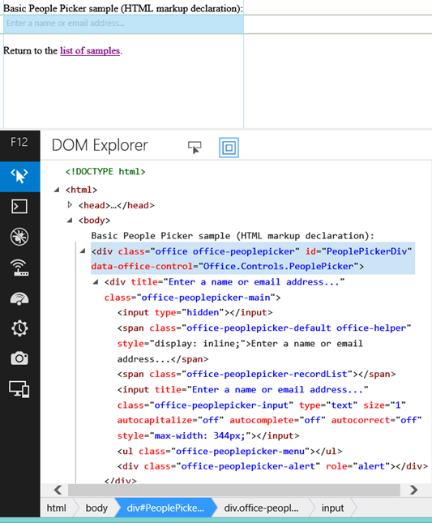

# <a name="use-the-experimental-people-picker-widget-in-sharepoint-add-ins"></a>Использование экспериментального мини-приложения "Выбор людей" в надстройках SharePoint
Узнайте, как использовать мини-приложение "Выбор людей" на любой веб-странице, даже если страница не размещена в SharePoint. С помощью мини-приложения "Выбор людей" можно помочь пользователям надстройки находить и выбирать людей и группы.
 

 **Примечание.** В настоящее время идет процесс замены названия "приложения для SharePoint" названием "надстройки SharePoint". Во время этого процесса в документации и пользовательском интерфейсе некоторых продуктов SharePoint и средств Visual Studio может по-прежнему использоваться термин "приложения для SharePoint". Дополнительные сведения см. в статье [Новое название приложений для Office и SharePoint](new-name-for-apps-for-sharepoint#bk_newname).
 


 **Внимание!** Экспериментальные мини-приложения Office для веб-страниц предоставляются только в целях исследований и сбора отзывов. Не следует использовать их в производственных сценариях. Принцип работы мини-приложений Office для веб-страниц может существенно измениться в будущих выпусках. Ознакомьтесь с [условиями лицензии на экспериментальные мини-приложения Office для веб-страниц](office-web-widgets--experimental-license-terms).
 


Используя в надстройках экспериментальный виджет "Выбор людей", вы можете помочь пользователям находить и выбирать людей и группы в клиенте. Когда пользователь вводит текст в текстовом поле, виджет загружает контакты, чьи имена или адреса электронной почты соответствуют запросу.
 


**Рис. 1. Обработка запроса мини-приложением "Выбор людей"**

 

 

 

 

 
Надстройка может получать доступ к выбранным пользователям, считывая свойство **selectedItems** мини-приложения. Свойство selectedItems является массивом объектов, которые представляют людей или группы. В приведенной ниже таблице показаны доступные свойства объекта пользователя.
 


|**Свойство**|**Описание**|
|:-----|:-----|
|**department**|Представляет подразделение пользователя или группы.|
|**displayName**|Представляет отображаемое имя пользователя или группы.|
|**email**|Представляет электронный адрес пользователя или группы.|
|**isResolved**|Указывает, удалось ли мини-приложению разрешить текст для пользователя или группы в клиенте.|
|**jobTitle**|Представляет должность пользователя.|
|**loginName**|Представляет имя для входа пользователя или группы.|
|**mobile**|Представляет номер мобильного телефона пользователя или группы.|
|**principalId**|Представляет идентификатор субъекта пользователя или группы.|
|**principalType**|Указывает, является ли элемент пользователем или группой. Принимает значение 1, если это пользователь, и 4, если это группа.|
|**sipAddress**|Представляет SIP-адрес пользователя или группы.|
|**text**|Представляет текст имени пользователя или группы.|
Мини-приложение "Выбор людей" имеет кэш последних использовавшихся записей (MRU). В кэше хранятся пять последних записей, которые были обработаны мини-приложением.
 

## <a name="prerequisites-for-using-the-examples-in-this-article"></a>Необходимые условия для использования примеров в этой статье

Для использования примеров, описанных в этой статье, вам необходимо следующее:
 

 

- Visual Studio 2013.
    
 
- Диспетчер пакетов NuGet. Дополнительные сведения см. в статье [Установка NuGet](http://go.microsoft.com/fwlink/?LinkId=271465).
    
 
- Среда разработки SharePoint (для локальных сценариев требуется изоляция приложений).
    
 
- Пакет NuGet "Веб-виджеты Office (экспериментальная версия)". Дополнительные сведения об установке пакетов NuGet см. в разделе  [Управление пакетами NuGet с помощью диалогового окна](http://docs.nuget.org/docs/start-here/managing-nuget-packages-using-the-dialog). Вы также можете просмотреть  [коллекцию NuGet](http://www.nuget.org/packages/Microsoft.Office.WebWidgets.Experimental/).
    
 

## <a name="use-the-people-picker-widget-in-a-provider-hosted-sharepoint-add-in"></a>Использование мини-приложения "Выбор людей" в размещаемой у поставщика надстройке SharePoint

В этом примере представлена простая страница, размещенная вне SharePoint, которая объявляет мини-приложение "Выбор людей" с использованием разметки. Для простоты в этом примере не объявлено никаких параметров. Пример с параметрами приведен в разделе [Следующие шаги](use-the-experimental-people-picker-widget-in-sharepoint-add-ins#NextSteps).
 

 
Чтобы использовать мини-приложение "Выбор людей", выполните указанные ниже действия.
 

 

- Создайте надстройку SharePoint и веб-проекты.
    
 
- Создайте модуль на сайте надстройки. Это также гарантирует, что сайт надстройки будет создан при развертывании надстройки пользователем.
    
     **Примечание.** Междоменная библиотека требует наличия сайта надстройки. Мини-приложение "Выбор людей" взаимодействует с SharePoint посредством междоменной библиотеки.
- Создайте страницу надстройки, в которой с помощью части кода объявляется экземпляр мини-приложения "Выбор людей".
    
 

### <a name="to-create-a-sharepoint-add-in-and-web-projects"></a>Создание надстройки SharePoint и веб-проектов


1. Откройте Visual Studio 2013 от имени администратора. Для этого нажмите значок Visual Studio 2013 в меню **Пуск** и выберите пункт **Запуск от имени администратора**.
    
 
2. Создайте проект, используя шаблон "Надстройка SharePoint 2013". Шаблон **Надстройка SharePoint 2013** находится в следующем разделе: **Шаблоны**> **Visual C#**, **Office/SharePoint**> **Надстройки**.
    
 
3. Укажите URL-адрес веб-сайта SharePoint, который вы хотите использовать для отладки.
    
 
4. Выберите для надстройки вариант размещения **Размещено у поставщика**.
    
     **Примечание.** Мини-приложение "Выбор людей" можно использовать и с другими вариантами размещения, а также с надстройками Office и собственным веб-сайтом.
5. Выберите **Приложение веб-форм ASP.NET** в качестве типа проекта веб-приложения.
    
 
6. Выберите **службу контроля доступа Windows Azure** в качестве способа проверки подлинности.
    
 

### <a name="to-create-a-module-on-the-add-in-web"></a>Создание модуля на сайте надстройки


1. Выберите проект надстройки SharePoint в **обозревателе решений**. Выберите команду **Добавить**> **Создать элемент…**
    
 
2. Выберите **Элементы Visual C#**> **Office/SharePoint**> **Модуль**. Укажите имя модуля.
    
     **Примечание.** При создании надстройки, размещаемой в SharePoint, нет необходимости создавать дополнительный модуль.

### <a name="to-add-a-new-page-that-uses-the-people-picker-widget"></a>Добавление новой страницы, использующей мини-приложение "Выбор людей"


1. Выберите папку **Страницы** веб-проекта в **обозревателе решений**.
    
 
2. Скопируйте приведенный ниже код и вставьте его в **ASPX**-файл в проекте. Этот код выполняет следующие задачи:
    
      - добавляет ссылки на необходимые библиотеки и ресурсы Office;
    
 
  - инициализирует среду выполнения элементов управления;
    
 
  - запускает метод **renderAll** среды выполнения для элементов управления Office;
    
 
  - объявляет заполнитель для мини-приложения "Выбор людей".
    
 

```
  <!DOCTYPE html>
<html>
<head>
    <!-- IE9 or superior -->
    <meta http-equiv="X-UA-Compatible" content="IE=9" >
    <title>People Picker HTML Markup</title>

    <!-- Widgets Specific CSS File -->
    <link 
        rel="stylesheet" 
        type="text/css" 
        href="../Scripts/Office.Controls.css" 
    />

    <!-- Ajax, jQuery, and utils --> 
    <script 
        src=" https://ajax.aspnetcdn.com/ajax/4.0/1/MicrosoftAjax.js.js">
    </script>
    <script 
        src=" https://ajax.aspnetcdn.com/ajax/jQuery/jquery-1.9.1.min.js">
    </script>
    <script type="text/javascript">
        // Function to retrieve a query string value.
        // For production purposes you may want to use
        //  a library to handle the query string.
        function getQueryStringParameter(paramToRetrieve) {
            var params =
                document.URL.split("?")[1].split("&amp;");
            var strParams = "";
            for (var i = 0; i < params.length; i = i + 1) {
                var singleParam = params[i].split("=");
                if (singleParam[0] == paramToRetrieve)
                    return singleParam[1];
            }
        }
    </script>

    <!-- Cross-Domain Library and Office controls runtime -->
    <script type="text/javascript">
        //Register namespace and variables used through the sample
        Type.registerNamespace("Office.Samples.PeoplePickerBasic");
        //Retrieve context tokens from the querystring
        Office.Samples.PeoplePickerBasic.appWebUrl =
            decodeURIComponent(getQueryStringParameter("SPAppWebUrl"));
        Office.Samples.PeoplePickerBasic.hostWebUrl =
            decodeURIComponent(getQueryStringParameter("SPHostUrl"));

        //Pattern to dynamically load JSOM and and the cross-domain library
        var scriptbase =
            Office.Samples.PeoplePickerBasic.hostWebUrl + "/_layouts/15/";

        //Get the cross-domain library
        $.getScript(scriptbase + "SP.RequestExecutor.js",
            //Get the Office controls runtime and 
            //  continue to the createControl function
            function () {
                $.getScript("../Scripts/Office.Controls.js", createControl)
            }
        );
    </script>

    <!--People Picker -->
    <script 
        src="../Scripts/Office.Controls.PeoplePicker.js" 
        type="text/javascript">
    </script>
</head>
<body>
Basic People Picker sample (HTML markup declaration):
<div 
        id="PeoplePickerDiv" 
        data-office-control="Office.Controls.PeoplePicker">
</div>

<script type="text/javascript">
    function createControl() {
        //Initialize Controls Runtime
        Office.Controls.Runtime.initialize({
            sharePointHostUrl: Office.Samples.PeoplePickerBasic.hostWebUrl,
            appWebUrl: Office.Samples.PeoplePickerBasic.appWebUrl
        });

        //Render the widget, this must be executed after the
        //placeholder DOM is loaded
        Office.Controls.Runtime.renderAll();
    }
</script>
</body>
</html>

```


 **Примечание.** В приведенном выше примере кода явно указываются URL-адреса хост-сайта и сайта надстройки, чтобы инициализировать среду выполнения для элементов управления Office. Однако если URL-адреса хост-сайта и сайта надстройки указаны в параметрах строки запроса **SPAppWebUrl** и **SPHostUrl** соответственно, то вы можете передать пустой объект, и код попытается получить параметры автоматически. Параметры **SPAppWebUrl** и **SPHostUrl** включаются в строку запроса при использовании маркера **{StandardTokens}**.
 

В приведенной ниже примере показано, как передавать пустой объект в метод инициализации.
 

 


```
// Initialize with an empty object and the code 
// will attempt to get the tokens from the
// query string directly.
Office.Controls.Runtime.initialize({});
```


### <a name="to-build-and-run-the-solution"></a>Для создания и запуска решения


1. Нажмите клавишу F5.
    
     **Примечание.** При нажатии клавиши F5 Visual Studio выполняет сборку решения, развертывает надстройку и открывает для нее страницу разрешений.
2. Нажмите кнопку **Доверять**.
    
 
3. Выберите значок надстройки на странице **Содержимое сайта**.
    
 
Вы также можете загрузить этот пример из коллекции кода. См. пример кода [Использование экспериментальной версии мини-приложения "Выбор людей" в надстройке](http://code.msdn.microsoft.com/SharePoint-2013-Use-the-57859f85).
 

 

## 
<a name="NextSteps"> </a>

В этой статье описано, как использовать мини-приложение "Выбор людей" в своей надстройке с помощью HTML. Кроме того, вы можете ознакомиться со следующими сценариями и сведениями о мини-приложении.
 

 

### <a name="use-javascript-to-declare-the-people-picker-widget"></a>Использование JavaScript для объявления мини-приложения "Выбор людей"

В зависимости от своих предпочтений, вы можете использовать JavaScript вместо HTML для объявления мини-приложения. В этом случае вы можете применить следующую разметку в качестве заполнителя для мини-приложения.
 

 

```HTML
<div id="PeoplePickerDiv"></div>
```

Используйте приведенный ниже код JavaScript, чтобы создавать экземпляры мини-приложения "Выбор людей".
 

 


```
new Office.Controls.PeoplePicker(
    document.getElementById("PeoplePickerDiv"), {});
```

Пример кода, иллюстрирующий выполнение этих задач, представлен на странице **JSSimple.html** образца [Использование экспериментального мини-приложения "Выбор людей" в надстройке](http://code.msdn.microsoft.com/SharePoint-2013-Use-the-57859f85).
 

 

### <a name="specify-options-for-the-widget"></a>Указание параметров мини-приложения

Вы можете задавать параметры мини-приложения с помощью атрибута **data-office-options** в объявлении мини-приложения. Приведенный ниже код HTML иллюстрирует настройку параметров мини-приложения "Выбор людей".
 

 

```HTML
<div id="PeoplePickerDiv"
        data-office-control="Office.Controls.PeoplePicker"
        data-office-options='{
        "allowMultipleSelections" : true,
        "onChange" : handleChange,
        "placeholder" : "Check the count message, it changes when you add names..."
    }'>
</div>
```

В приведенном ниже коде показано, как задать параметры при объявлении мини-приложения "Выбор людей" с помощью JavaScript.
 

 


```
new Office.Controls.PeoplePicker(
    document.getElementById("PeoplePickerDiv"), {
        allowMultipleSelections: true,
        placeholder: "Check the count message, it changes when you add names...",
        onChange: function (ctrl) {
            document.getElementById("count").textContent = 
ctrl.selectedItems.length.toString();
        }
    });
```

Кроме того, вы можете указать обработчики для таких событий, как **onChange**, **onAdded** и **onRemoved**. Обратите внимание, что в приведенном выше коде обработчик события onChange принимает единственный параметр **ctrl**, который является ссылкой на мини-приложение.
 

 
Пример указания параметров приведен на страницах **MarkupOptions.html** и **JSOptions.html** образца [Использование экспериментального мини-приложения "Выбор людей" в надстройке](http://code.msdn.microsoft.com/SharePoint-2013-Use-the-57859f85).
 

 

### <a name="retrieve-the-people-or-groups-selected-in-the-widget"></a>Получение пользователей или групп, выбранных в мини-приложении

Чтобы определить, какие люди выбраны в мини-приложении, необходимо выполнить следующие действия.
 

 

- Получите ссылку на мини-приложение.
    
 
- Получите доступ к свойству **selectedItems** мини-приложения.
    
 
Вы можете получить ссылку на мини-приложение с помощью приведенного ниже синтаксиса.
 

 


```
var pplPicker = document.getElementById("PeoplePickerDiv")._officeControl;
```

Вы также можете сохранить ссылку при создании экземпляра мини-приложения.
 

 


```
var pplPicker = new Office.Controls.PeoplePicker(
                        document.getElementById("PeoplePickerDiv"), {});
```

Свойство **selectedItems** — это массив объектов, представляющих людей или группы. Люди или группы в массиве selectedItems могут быть разрешенными или неразрешенными. Это можно проверить с помощью свойства **isResolved**. В приведенном ниже примере показано, как получить доступ к элементу *i* в массиве и использовать имя пользователя или группы.
 

 


```
var principal = pplPicker.selectedItems[i];
$("#msg").text(principal.text + " is selected in the control.");
```

Пример получения выбранных пользователей или групп из мини-приложения приведен на странице **demo.html** в разделе [Мини-приложения Office для веб-страниц: экспериментальная демо-версия](http://code.msdn.microsoft.com/SharePoint-2013-Office-Web-6d44aa9e).
 

 

### <a name="customize-the-style-of-the-widget"></a>Настройка стиля мини-приложения

Разработчику может потребоваться настроить пользовательский интерфейс мини-приложения. На приведенном ниже рисунке показана иерархия HTML в мини-приложении после его преобразования.
 

 

**Рис. 2. Иерархия HTML в мини-приложении "Выбор людей"**

 

 

 
Мини-приложение определяет множество классов с префиксом **office-peoplepicker**, которые можно найти и настроить в таблице стилей **Office.Controls.css**.
 

 

## <a name="conclusion"></a>Заключение
<a name="NextSteps"> </a>

С помощью экспериментального мини-приложения "Выбор людей" можно искать людей и группы в клиенте, после чего ваша надстройка сможет использовать участников, выбранных вашими пользователями. Свои идеи и комментарии вы можете оставить на сайте  [Office Developer Platform UserVoice](http://officespdev.uservoice.com/).
 

 

## <a name="additional-resources"></a>Дополнительные ресурсы
<a name="bk_addresources"> </a>


-  [Обзор экспериментальных мини-приложений Office для веб-страниц](office-web-widgets--experimental-overview)
    
 
-  [Условия лицензии на экспериментальные мини-приложения Office для веб-страниц](office-web-widgets--experimental-license-terms)
    
 
-  [Страница коллекции NuGet "Экспериментальные мини-приложения Office для веб-страниц"](http://www.nuget.org/packages/Microsoft.Office.WebWidgets.Experimental/)
    
 
-  [Пример кода. Использование экспериментального мини-приложения "Выбор людей" в надстройке](http://code.msdn.microsoft.com/SharePoint-2013-Use-the-57859f85).
    
 
-  [Использование экспериментального мини-приложения "Просмотр списка на рабочем столе" в надстройках для SharePoint](use-the-experimental-desktop-list-view-widget-in-sharepoint-add-ins).
    
 

