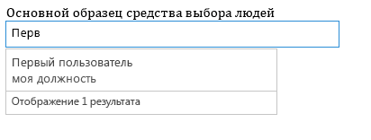
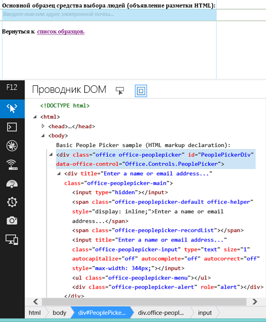

# <a name="use-the-experimental-people-picker-widget-in-sharepoint-add-ins"></a>Использование экспериментального мини-приложения People Picker в надстройках SharePoint

Мини-приложение People Picker может использоваться на любой веб-странице, даже если она не размещена в SharePoint. Используйте мини-приложение People Picker в ваших надстройках, чтобы помочь пользователям находить и выбирать людей и группы.

> [!WARNING] 
> Экспериментальные мини-приложения Office для веб-страниц предоставляются только в целях исследования и сбора отзывов. Не следует использовать их в производственных сценариях. Поведение мини-приложений Office для веб-страниц может существенно измениться в будущих выпусках. Ознакомьтесь с [условиями лицензии на экспериментальные мини-приложения Office для веб-страниц](office-web-widgetsexperimental-license-terms.md).

Используя в надстройках экспериментальный виджет "Выбор людей", вы можете помочь пользователям находить и выбирать людей и группы в клиенте. Когда пользователь вводит текст в текстовом поле, виджет загружает контакты, чьи имена или адреса электронной почты соответствуют запросу.

<br/>

**Обработка запроса мини-приложением People Picker**



Ваша надстройка может получить доступ к выбранным контактам путем считывания свойства **selectedItems** мини-приложения. Свойство selectedItems является массивом объектов, которые представляют собой людей или группы. В таблице ниже приведены доступные свойства объекта пользователя.

<br/>

|**Свойство**|**Описание**|
|:-----|:-----|
|**department**|Подразделение пользователя или группы.|
|**displayName**|Отображаемое имя пользователя или группы.|
|**email**|Электронный адрес пользователя или группы.|
|**isResolved**|Указывает, удалось ли мини-приложению разрешить текст для пользователя или группы в клиенте.|
|**jobTitle**|Должность пользователя.|
|**loginName**|Имя для входа пользователя или группы.|
|**mobile**|Номер мобильного телефона пользователя или группы.|
|**principalId**|Основной идентификатор пользователя или группы.|
|**principalType**|Указывает, является ли элемент пользователем или группой. Принимает значение 1, если это пользователь, и 4, если это группа.|
|**sipAddress**|SIP-адрес пользователя или группы.|
|**text**|Текстовый заголовок имени пользователя или группы.|

<br/>

Мини-приложение "Выбор людей" имеет кэш последних использовавшихся записей (MRU). В кэше хранятся пять последних записей, которые были обработаны мини-приложением.
 
## <a name="prerequisites-for-using-the-examples-in-this-article"></a>Необходимые условия для использования примеров в этой статье

Для использования примеров, описанных в этой статье, вам потребуются:

- Visual Studio 2013 или более поздней версии.
- Диспетчер пакетов NuGet. Дополнительные сведения см. в статье [Установка NuGet](http://go.microsoft.com/fwlink/?LinkId=271465).
- Среда разработки SharePoint (для локальных сценариев требуется изоляция приложений).
- Пакет NuGet "Экспериментальные мини-приложения Office для веб-страниц". Дополнительные сведения об установке пакетов NuGet см. в статье [Пользовательский интерфейс диспетчера пакетов NuGet](https://docs.microsoft.com/ru-RU/nuget/tools/package-manager-ui). Вы также можете просмотреть [страницу коллекции NuGet](https://www.nuget.org/packages/Microsoft.Office.WebWidgets.Experimental/).
    
## <a name="use-the-people-picker-widget-in-a-provider-hosted-sharepoint-add-in"></a>Использование мини-приложения People Picker в надстройке SharePoint с размещением у поставщика

В этом примере простая страница размещена вне платформы SharePoint, объявляющей мини-приложение People Picker с помощью разметки. Для простоты в этом примере параметры не объявлены, но вы можете посмотреть пример с параметрами в разделе [Дальнейшие действия](#NextSteps).

Чтобы использовать мини-приложение People Picker, выполните следующие действия:

- Создайте надстройку SharePoint и веб-проекты.

- Создайте модуль на сайте надстройки. Это действие гарантирует создание сайта надстройки при ее развертывании.
    
    > [!NOTE] 
    > Междоменная библиотека требует наличия сайта надстройки. Мини-приложение People Picker взаимодействует с SharePoint посредством междоменной библиотеки.

- Создайте страницу надстройки, в которой с помощью разметки объявляется экземпляр мини-приложения People Picker.
    
### <a name="to-create-a-sharepoint-add-in-and-web-projects"></a>Создание надстройки SharePoint и веб-проектов

1. Откройте Visual Studio от имени администратора. (Для этого выберите значок Visual Studio в меню **Пуск** и пункт **Запуск от имени администратора**.)

2. Создайте проект, используя шаблон "Надстройка SharePoint". Шаблон **Надстройка SharePoint** находится в следующем разделе: **Шаблоны** > **Visual C#**, **Office/SharePoint** > **Надстройки**.
    
3. Укажите URL-адрес веб-сайта SharePoint, который вы хотите использовать для отладки.
 
4. Выберите для надстройки вариант размещения **Размещено у поставщика**.
    
    > [!NOTE] 
    > Мини-приложение People Picker можно использовать и с другими вариантами размещения, а также с надстройками Office или собственным веб-сайтом.

5. Выберите **Приложение веб-форм ASP.NET** в качестве типа проекта веб-приложения.
    
6. Выберите **службу контроля доступа Windows Azure** в качестве способа проверки подлинности.
    

### <a name="to-create-a-module-on-the-add-in-web"></a>Создание модуля на сайте надстройки

1. Выберите проект надстройки SharePoint в **обозревателе решений**. Выберите **Добавить** > **Создать элемент**.
    
2. Выберите **Элементы Visual C#** > **Office/SharePoint** > **Модуль**. Укажите имя модуля.
    
    > [!NOTE] 
    > При создании надстройки с размещением в SharePoint нет необходимости создавать дополнительный модуль.


### <a name="to-add-a-new-page-that-uses-the-people-picker-widget"></a>Добавление новой страницы, использующей мини-приложение People Picker

1. Выберите папку **Страницы** веб-проекта в **обозревателе решений**.
    
2. Скопируйте приведенный ниже код и вставьте его в **ASPX**-файл проекта. Код выполняет следующие задачи:
    
    - добавляет ссылки на необходимые библиотеки и ресурсы Office;
    
    - инициализирует среду выполнения элементов управления;
            
    - запускает метод **renderAll** среды выполнения элементов управления Office;
            
    - объявляет заполнитель для мини-приложения People Picker.

    ```HTML
    <!DOCTYPE html>
    <html>
    <head>
    <!-- IE9 or superior -->
        <meta http-equiv="X-UA-Compatible" content="IE=9" >
        <title>People Picker HTML Markup</title>

        <!-- Widgets Specific CSS File -->
        <link 
            rel="stylesheet" 
            type="text/css" 
            href="../Scripts/Office.Controls.css" 
        />

    <!-- Ajax, jQuery, and utils --> 
        <script 
            src=" https://ajax.aspnetcdn.com/ajax/4.0/1/MicrosoftAjax.js.js">
        </script>
        <script 
            src=" https://ajax.aspnetcdn.com/ajax/jQuery/jquery-1.9.1.min.js">
        </script>
        <script type="text/javascript">
            // Function to retrieve a query string value.
            // For production purposes you may want to use
            //  a library to handle the query string.
            function getQueryStringParameter(paramToRetrieve) {
                var params =
                    document.URL.split("?")[1].split("&amp;");
                var strParams = "";
                for (var i = 0; i < params.length; i = i + 1) {
                    var singleParam = params[i].split("=");
                    if (singleParam[0] == paramToRetrieve)
                        return singleParam[1];
                }
            }
        </script>

    <!-- Cross-Domain Library and Office controls runtime -->
        <script type="text/javascript">
            //Register namespace and variables used through the sample
            Type.registerNamespace("Office.Samples.PeoplePickerBasic");
            //Retrieve context tokens from the querystring
            Office.Samples.PeoplePickerBasic.appWebUrl =
                decodeURIComponent(getQueryStringParameter("SPAppWebUrl"));
            Office.Samples.PeoplePickerBasic.hostWebUrl =
                decodeURIComponent(getQueryStringParameter("SPHostUrl"));

            //Pattern to dynamically load JSOM and and the cross-domain library
            var scriptbase =
                Office.Samples.PeoplePickerBasic.hostWebUrl + "/_layouts/15/";

            //Get the cross-domain library
            $.getScript(scriptbase + "SP.RequestExecutor.js",
                //Get the Office controls runtime and 
                //  continue to the createControl function
                function () {
                    $.getScript("../Scripts/Office.Controls.js", createControl)
                }
            );
        </script>

    <!--People Picker -->
        <script 
            src="../Scripts/Office.Controls.PeoplePicker.js" 
            type="text/javascript">
        </script>
    </head>
    <body>
        Basic People Picker sample (HTML markup declaration):
        <div 
                id="PeoplePickerDiv" 
                data-office-control="Office.Controls.PeoplePicker">
        </div>

        <script type="text/javascript">
            function createControl() {
                //Initialize Controls Runtime
                Office.Controls.Runtime.initialize({
                    sharePointHostUrl: Office.Samples.PeoplePickerBasic.hostWebUrl,
                    appWebUrl: Office.Samples.PeoplePickerBasic.appWebUrl
                });

                //Render the widget, this must be executed after the
                //placeholder DOM is loaded
                Office.Controls.Runtime.renderAll();
            }
        </script>
    </body>
    </html>

    ```

<br/>

> [!NOTE] 
> В приведенном выше примере кода явно указаны URL-адреса хост-сайта и сайта надстройки, чтобы инициализировать среду выполнения для элементов управления Office. Однако если URL-адреса хост-сайта и сайта надстройки указаны в параметрах строки запроса **SPAppWebUrl** и **SPHostUrl** соответственно, то вы можете передать пустой объект, и код попытается получить параметры автоматически. Параметры **SPAppWebUrl** и **SPHostUrl** включаются в строку запроса при использовании маркера **{StandardTokens}**.
 
В следующем примере показано, как передавать пустой объект в метод инициализации.

```
// Initialize with an empty object and the code 
// will attempt to get the tokens from the
// query string directly.
Office.Controls.Runtime.initialize({});
```


### <a name="to-build-and-run-the-solution"></a>Сборка и запуск решения

1. Нажмите клавишу F5.
    
    > [!NOTE] 
    > При нажатии клавиши F5 Visual Studio выполняет сборку решения, развертывает надстройку и открывает страницу разрешений.

2. Нажмите кнопку **Доверять**.
    
3. Выберите значок надстройки на странице **Содержимое сайта**.
    
Чтобы скачать этот пример из коллекции кода, см. пример кода [Использование экспериментального мини-приложения People Picker в надстройке](https://code.msdn.microsoft.com/office/SharePoint-2013-Use-the-57859f85).
 
<a name="NextSteps"> </a>

## <a name="next-steps"></a>Дальнейшие действия

В этой статье описано, как использовать мини-приложение "Выбор людей" в своей надстройке с помощью HTML. Кроме того, вы можете ознакомиться со следующими сценариями и сведениями о мини-приложении.

### <a name="use-javascript-to-declare-the-people-picker-widget"></a>Использование JavaScript для объявления мини-приложения People Picker

Для объявления мини-приложения можно использовать JavaScript, а не HTML. В этом случае в качестве заполнителя для мини-приложения можно использовать следующую разметку:

```HTML
<div id="PeoplePickerDiv"></div>
```

<br/>

Используйте приведенный ниже код JavaScript для создания экземпляров мини-приложения People Picker.

```js
new Office.Controls.PeoplePicker(
    document.getElementById("PeoplePickerDiv"), {});
```

<br/>

Пример кода, который показывает, как выполнять эти действия, размещен на странице **JSSimple.html** в разделе [Использование экспериментального мини-приложения "Выбор людей" в надстройке](https://code.msdn.microsoft.com/office/SharePoint-2013-Use-the-57859f85).

### <a name="specify-options-for-the-widget"></a>Указание параметров мини-приложения

Параметры мини-приложения можно задать с помощью атрибута **data-office-options** в объявлении мини-приложения. Следующий HTML-код демонстрирует способ задания параметров мини-приложения "Выбор людей".

```HTML
<div id="PeoplePickerDiv"
        data-office-control="Office.Controls.PeoplePicker"
        data-office-options='{
        "allowMultipleSelections" : true,
        "onChange" : handleChange,
        "placeholder" : "Check the count message, it changes when you add names..."
    }'>
</div>
```

<br/>

В приведенном ниже коде показано, как задать параметры при объявлении мини-приложения People Picker с помощью JavaScript.

```js
new Office.Controls.PeoplePicker(
    document.getElementById("PeoplePickerDiv"), {
        allowMultipleSelections: true,
        placeholder: "Check the count message, it changes when you add names...",
        onChange: function (ctrl) {
            document.getElementById("count").textContent = 
ctrl.selectedItems.length.toString();
        }
    });
```

Кроме того, вы можете указать обработчики для таких событий, как **onChange**, **onAdded** и **onRemoved**. Обратите внимание, что в приведенном выше коде обработчик события onChange принимает единственный параметр **ctrl**, который является ссылкой на мини-приложение.

Пример указания параметров приведен на страницах **MarkupOptions.html** и **JSOptions.html** в разделе [Использование экспериментального мини-приложения "Выбор людей" в надстройке](https://code.msdn.microsoft.com/office/SharePoint-2013-Use-the-57859f85).

### <a name="retrieve-the-people-or-groups-selected-in-the-widget"></a>Получение пользователей или групп, выбранных в мини-приложении

Выполните следующие задачи, чтобы определить, какие люди выбраны в мини-приложении:

- Получите ссылку на мини-приложение.
    
- Получите доступ к свойству **selectedItems** мини-приложения.
    
Вы можете получить ссылку на мини-приложение с помощью приведенного ниже синтаксиса.

```
var pplPicker = document.getElementById("PeoplePickerDiv")._officeControl;
```

<br/>

Вы также можете сохранить ссылку при создании экземпляра мини-приложения.

```
var pplPicker = new Office.Controls.PeoplePicker(
                        document.getElementById("PeoplePickerDiv"), {});
```

<br/>

Свойство **selectedItems** — это массив объектов, представляющих людей или группы. Люди или группы в массиве selectedItems могут быть разрешенными или неразрешенными. Это можно проверить с помощью свойства **isResolved**. В приведенном ниже примере показано, как получить доступ к элементу *i* в массиве и использовать имя пользователя или группы.

```
var principal = pplPicker.selectedItems[i];
$("#msg").text(principal.text + " is selected in the control.");
```

<br/>

Пример способа загрузки выбранных людей или групп из мини-приложения приведен на странице **demo.html** в разделе [Веб-виджеты Office экспериментальная демо-версия](https://code.msdn.microsoft.com/office/SharePoint-2013-Office-Web-6d44aa9e).

### <a name="customize-the-style-of-the-widget"></a>Настройка стиля мини-приложения

Разработчику может потребоваться настроить пользовательский интерфейс. На рисунке ниже представлена HTML-иерархия мини-приложения после его преобразования. Мини-приложение определяет множество классов с префиксом **office-peoplepicker**, которые можно найти и настроить в таблице стилей **Office.Controls.css**.

**HTML-иерархия в мини-приложении People Picker**



Экспериментальное мини-приложение People Picker позволяет выбирать людей и группы в клиенте, а затем передавать выбранные субъекты в надстройку. Свои идеи и комментарии вы можете оставить на [сайте UserVoice для разработчиков Office](http://officespdev.uservoice.com/).


## <a name="see-also"></a>Дополнительные ресурсы
<a name="bk_addresources"> </a>

-  [Использование экспериментального мини-приложения Desktop List View в надстройках для SharePoint](use-the-experimental-desktop-list-view-widget-in-sharepoint-add-ins.md)
-  [Обзор экспериментальных мини-приложений Office для веб-страниц](office-web-widgetsexperimental-overview.md)
-  [Создание компонентов взаимодействия с пользователем в SharePoint](create-ux-components-in-sharepoint.md)
