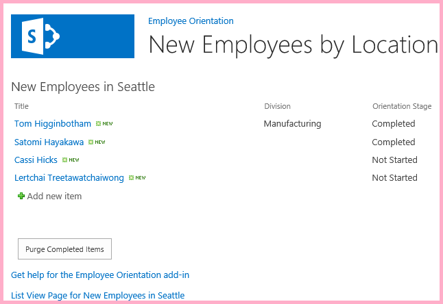
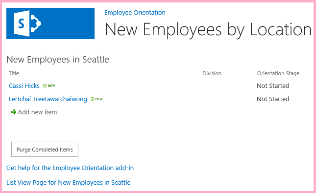

# <a name="use-the-sharepoint-javascript-apis-to-work-with-sharepoint-data"></a><span data-ttu-id="03e5c-101">Работа с данными SharePoint с помощью API JavaScript для SharePoint</span><span class="sxs-lookup"><span data-stu-id="03e5c-101">Use the SharePoint JavaScript APIs to work with SharePoint data</span></span>
<span data-ttu-id="03e5c-102">Узнайте, как работать с данными SharePoint на страницах сайта надстройки с помощью объектной модели JavaScript для SharePoint.</span><span class="sxs-lookup"><span data-stu-id="03e5c-102">Use the SharePoint JavaScript  object model to work with SharePoint data from ecmascriptshort on pages in the add-in web.</span></span>
 

 <span data-ttu-id="03e5c-p101">**Примечание.** В настоящее время идет процесс замены названия "приложения для SharePoint" названием "надстройки SharePoint". Во время этого процесса в документации и пользовательском интерфейсе некоторых продуктов SharePoint и средств Visual Studio может по-прежнему использоваться термин "приложения для SharePoint". Дополнительные сведения см. в статье [Новое название приложений для Office и SharePoint](new-name-for-apps-for-sharepoint#bk_newname).</span><span class="sxs-lookup"><span data-stu-id="03e5c-p101">The name "apps for SharePoint" is changing to "SharePoint Add-ins". During the transition, the documentation and the UI of some SharePoint products and Visual Studio tools might still use the term "apps for SharePoint". For details, see [New name for apps for Office and SharePoint](new-name-for-apps-for-sharepoint#bk_newname).</span></span>
 

<span data-ttu-id="03e5c-p102">Это 10-я часть серии статей, посвященной основам разработки надстроек SharePoint, размещаемых в SharePoint. Для начала вам следует ознакомиться со статьей [Надстройки SharePoint](sharepoint-add-ins) и предыдущими статьями из этой серии.</span><span class="sxs-lookup"><span data-stu-id="03e5c-p102">Use the SharePoint JavaScript object model to work with SharePoint data from JavaScript on pages in the add-in web. This is the 10th in a series of articles about the basics of developing SharePoint-hosted SharePoint Add-ins. You should first be familiar with  [SharePoint Add-ins](sharepoint-add-ins) and the previous articles in this series:</span></span>
 

-  [<span data-ttu-id="03e5c-108">Знакомство с созданием надстроек SharePoint с размещением в SharePoint</span><span class="sxs-lookup"><span data-stu-id="03e5c-108">Get started creating SharePoint-hosted SharePoint Add-ins</span></span>](get-started-creating-sharepoint-hosted-sharepoint-add-ins)
    
 
-  [<span data-ttu-id="03e5c-109">Развертывание и установка надстроек для SharePoint</span><span class="sxs-lookup"><span data-stu-id="03e5c-109">Deploy and install a SharePoint-hosted SharePoint Add-in</span></span>](deploy-and-install-a-sharepoint-hosted-sharepoint-add-in)
    
 
-  [<span data-ttu-id="03e5c-110">Добавление настраиваемых столбцов в надстройку с размещением в SharePoint</span><span class="sxs-lookup"><span data-stu-id="03e5c-110">Add custom columns to a SharePoint-hostedSharePoint Add-in</span></span>](add-custom-columns-to-a-sharepoint-hostedsharepoint-add-in)
    
 
-  [<span data-ttu-id="03e5c-111">Добавление настраиваемого типа контента в надстройку для SharePoint с размещением в SharePoint</span><span class="sxs-lookup"><span data-stu-id="03e5c-111">Add a custom content type to a SharePoint-hostedSharePoint Add-in</span></span>](add-a-custom-content-type-to-a-sharepoint-hostedsharepoint-add-in)
    
 
-  [<span data-ttu-id="03e5c-112">Добавление веб-части на страницу в надстройку для SharePoint с размещением в SharePoint</span><span class="sxs-lookup"><span data-stu-id="03e5c-112">Add a Web Part to a page in a SharePoint-hosted SharePoint Add-in</span></span>](add-a-web-part-to-a-page-in-a-sharepoint-hosted-sharepoint-add-in)
    
 
-  [<span data-ttu-id="03e5c-113">Добавление рабочего процесса в надстройку для SharePoint с размещением в SharePoint</span><span class="sxs-lookup"><span data-stu-id="03e5c-113">Add a workflow to a SharePoint-hosted SharePoint Add-in</span></span>](add-a-workflow-to-a-sharepoint-hosted-sharepoint-add-in)
    
 
-  [<span data-ttu-id="03e5c-114">Добавление настраиваемой страницы и стиля для надстройки с размещением в SharePoint</span><span class="sxs-lookup"><span data-stu-id="03e5c-114">Add a custom page and style to a SharePoint-hosted SharePoint Add-in</span></span>](add-a-custom-page-and-style-to-a-sharepoint-hosted-sharepoint-add-in)
    
 
-  [<span data-ttu-id="03e5c-115">Добавление настраиваемой функции отрисовки в клиенте в надстройку SharePoint, размещаемую в SharePoint</span><span class="sxs-lookup"><span data-stu-id="03e5c-115">Add custom client-side rendering to a SharePoint-hosted SharePoint Add-in</span></span>](add-custom-client-side-rendering-to-a-sharepoint-hosted-sharepoint-add-in)
    
 
-  [<span data-ttu-id="03e5c-116">Создание настраиваемой кнопки ленты на хост-сайте надстройки SharePoint</span><span class="sxs-lookup"><span data-stu-id="03e5c-116">Create a custom ribbon button in the host web of a SharePoint Add-in</span></span>](create-a-custom-ribbon-button-in-the-host-web-of-a-sharepoint-add-in)
    
 

 <span data-ttu-id="03e5c-p103">**Примечание.** Если вы изучали предыдущие статьи этой серии о надстройках, размещаемых в SharePoint, то у вас уже есть решение для Visual Studio, которое можно использовать для работы с данной статьей. Кроме того, вы можете скачать репозиторий [SharePoint_SP-hosted_Add-Ins_Tutorials](https://github.com/OfficeDev/SharePoint_SP-hosted_Add-Ins_Tutorials) и открыть файл BeforeJSOM.sln.</span><span class="sxs-lookup"><span data-stu-id="03e5c-p103">**Note** If you have been working through this series about SharePoint-hosted add-ins, then you have a Visual Studio solution that you can use to continue with this topic. You can also download the repository at  [SharePoint_SP-hosted_Add-Ins_Tutorials](https://github.com/OfficeDev/SharePoint_SP-hosted_Add-Ins_Tutorials) and open the BeforeJSOM.sln file.</span></span>
 

<span data-ttu-id="03e5c-p104">Несмотря на то что в надстройках SharePoint, размещаемых в SharePoint, не должно быть серверного кода, вы можете использовать бизнес-логику и взаимодействие времени выполнения с компонентами SharePoint в таких надстройках, применяя JavaScript и клиентскую объектную модель JavaScript для SharePoint. Мы будем называть ее JSOM. Обратите внимание на букву M в конце. Не следует путать это название с JSO **N** (нотация объектов JavaScript). В данной статье вы будете использовать объектную модель JavaScript для поиска и удаления старых элементов из списка **New Employees in Seattle** (Новые сотрудники в Сиэтле).</span><span class="sxs-lookup"><span data-stu-id="03e5c-p104">Even though SharePoint-hosted SharePoint Add-ins cannot have server-side code, you can still have business logic and runtime interaction with SharePoint components in a SharePoint-hosted SharePoint Add-in by using JavaScript and the SharePoint JavaScript client object model library. (We'll call it JSOM. Note the "M" on the end. Don't confuse this with JSO **N** [JavaScript Object Notation].) In this article you use the JavaScript object model to find and remove old items from the **New Employees in Seattle** list.</span></span>
 

## <a name="create-the-javascript-and-a-button-to-invoke-it"></a><span data-ttu-id="03e5c-123">Создание JavaScript и кнопки для его вызова</span><span class="sxs-lookup"><span data-stu-id="03e5c-123">Create the JavaScript and a button to invoke it</span></span>


1. <span data-ttu-id="03e5c-124">Убедитесь, что выполнено указанное ниже действие, которое описывается в первом руководстве из этой серии.</span><span class="sxs-lookup"><span data-stu-id="03e5c-124">Verify that the following step from the first tutorial in this series was completed:</span></span> 
    
    <span data-ttu-id="03e5c-p105">Откройте файл **/Pages/Default.aspx** из корневой папки проекта. Помимо прочего, этот созданный файл загружает один или оба сценария, размещенные в SharePoint: sp.runtime.js и sp.js. Часть кода для загрузки этих файлов можно найти в элементе управления **Content** в начале файла с идентификатором **PlaceHolderAdditionalPageHead**. Часть кода зависит от используемой версии **Инструментов разработчика Microsoft Office для Visual Studio**. Согласно руководствам из этой серии необходимо загрузить оба файла с обычными HTML-тегами **\<script\>**, а не с тегами **\<SharePoint:ScriptLink\>**. Убедитесь, что приведенные ниже строки присутствуют в элементе управления **PlaceHolderAdditionalPageHead** *над* строкой `<meta name="WebPartPageExpansion" content="full" />`.</span><span class="sxs-lookup"><span data-stu-id="03e5c-p105">Open the file /Pages/Default.aspx from the root of the project. Among other things, this generated file loads one or both of two scripts that are hosted on SharePoint: sp.runtime.js and sp.js. The markup for loading these files is in the Content control near the top of the file that has the ID PlaceHolderAdditionalPageHead. The markup varies depending on the version of Microsoft Office Developer Tools for Visual Studio that you are using. This series of tutorials requires that both files be loaded and that they be loaded with ordinary HTML    tags, not <SharePoint:ScriptLink> tags. Ensure that the following lines are in the PlaceHolderAdditionalPageHead control, just above  the line :</span></span>
    


```
  <script type="text/javascript" src="/_layouts/15/sp.runtime.js"></script> 
<script type="text/javascript" src="/_layouts/15/sp.js"></script> 

```


    Then search the file for any other markup that also loads one or the other of these files and remove the redundant markup. Save and close the file.
    
 
2. <span data-ttu-id="03e5c-p106">Узел **Сценарии** в **обозревателе решений** может содержать файл Add-in.js. Если его нет, но есть файл App.js, щелкните файл App.js правой кнопкой мыши и измените его имя на Add-in.js. Если нет ни файла Add-in.js, ни файла App.js, создайте необходимый файл, выполнив указанные ниже действия.</span><span class="sxs-lookup"><span data-stu-id="03e5c-p106">In the **Scripts** node in **Solution Explorer**, there may already be an Add-in.js file. If there isn't, but there is an App.js, right-click App.js and rename it Add-in.js. If there isn't either an Add-in.js or App.js, create one with these steps:</span></span>
    
      1. <span data-ttu-id="03e5c-134">Щелкните правой кнопкой мыши узел **Сценарии** и выберите пункты **Добавить** > **Создать элемент** > **Интернет**.</span><span class="sxs-lookup"><span data-stu-id="03e5c-134">Right-click the  **Scripts** node and choose **Add** > **New Item** > **Web**.</span></span>
    
 
  2. <span data-ttu-id="03e5c-135">Выберите **файл JavaScript** и назовите его Add-in.js.</span><span class="sxs-lookup"><span data-stu-id="03e5c-135">Choose **JavaScript File** and name itAdd-in.js.</span></span>
    
 
3. <span data-ttu-id="03e5c-136">Откройте файл Add-in.js и удалите его содержимое (если оно есть).</span><span class="sxs-lookup"><span data-stu-id="03e5c-136">Open Add-in.js and delete its content, if there is any.</span></span>
    
 
4. <span data-ttu-id="03e5c-p107">Добавьте указанные ниже строки в файл. Обратите внимание на указанные ниже особенности этого кода.</span><span class="sxs-lookup"><span data-stu-id="03e5c-p107">Add the following lines to the file. Note the following about this code:</span></span>
    
      - <span data-ttu-id="03e5c-139">Если вы непреднамеренно сделаете что-нибудь не так в JavaScript, то благодаря строке  `'use strict';` среда выполнения JavaScript в браузере создаст исключение.</span><span class="sxs-lookup"><span data-stu-id="03e5c-139">The  `'use strict';` line ensures that the JavaScript runtime in the browser will throw an exception if you inadvertently use certain bad practices in the JavaScript.</span></span>
    
 
  - <span data-ttu-id="03e5c-p108">В переменной  `clientContext` хранится объект **SP.ClientContext**, который ссылается на веб-сайт SharePoint. Весь код JSOM начинается с создания или получения ссылки на объект этого типа.</span><span class="sxs-lookup"><span data-stu-id="03e5c-p108">The  `clientContext` variable holds a **SP.ClientContext** object that references the SharePoint website. All JSOM code begins by creating, or getting a reference to, an object of this type.</span></span>
    
 
  - <span data-ttu-id="03e5c-142">В переменной  `employeeList` хранится ссылка на экземпляр списка **New Employees in Seattle** (Новые сотрудники в Сиэтле).</span><span class="sxs-lookup"><span data-stu-id="03e5c-142">The  `employeeList` variable holds a reference to the list instance **New Employees in Seattle**.</span></span>
    
 
  - <span data-ttu-id="03e5c-143">В переменной `completedItems` хранятся элементы из списка, которые будет удалять сценарий: элементы, в которых для поля **OrientationStage** задано значение **Completed**.</span><span class="sxs-lookup"><span data-stu-id="03e5c-143">The  `completedItems` variable holds the items from the list that the script will delete: the items whose **OrientationStage** field is set to **Completed**.</span></span>
    
 

```
  'use strict';

var clientContext = SP.ClientContext.get_current(); 
var employeeList = clientContext.get_web().get_lists().getByTitle('New Employees In Seattle'); 
var completedItems; 
```

5. <span data-ttu-id="03e5c-p109">Чтобы свести к минимуму обмен сообщениями между браузером клиента и сервером SharePoint, JSOM использует систему пакетной обработки. Только одна функция (**SP.ClientContext.executeQueryAsync**) на самом деле отправляет сообщения на сервер (и получает ответы). Вызовы интерфейсов API JSOM, поступающие между вызовами метода **executeQueryAsync**, объединяются в пакеты, которые затем отправляются на сервер при следующем вызове метода **executeQueryAsync**. В общем случае невозможно вызвать метод объекта JSOM, если только объект не был доставлен клиенту во время предыдущего вызова метода **executeQueryAsync**. Предполагается, что ваш сценарий будет вызывать метод **SP.ListItem.deleteObject** каждого завершенного элемента в списке, поэтому ему необходимо дважды вызвать метод **executeQueryAsync**: для получения коллекции завершенных элементов списка и для объединения вызовов **deleteObject** в пакет и их отправки на сервер для выполнения.</span><span class="sxs-lookup"><span data-stu-id="03e5c-p109">To minimize messages between the client browser and the SharePoint server, the JSOM uses a batching system. Only one function, **SP.ClientContext.executeQueryAsync**, actually sends messages to the server (and receives replies) . Calls to the JSOM APIs that come in between calls of **executeQueryAsync** are bundled up and sent to the server in a batch the next time **executeQueryAsync** is called. However, it is not generally possible to call a method of a JSOM object unless the object has been brought down to the client in a previous call of **executeQueryAsync**. Your script is going to call the **SP.ListItem.deleteObject** method of each completed item on the list, so it has to make two calls of **executeQueryAsync**; one to get a collection of the completed list items, and then a second to batch the calls of **deleteObject** and send them to the server for execution.</span></span>
    
    <span data-ttu-id="03e5c-p110">Таким образом, начнем с создания метода для получения элементов списка с сервера. Добавьте приведенный ниже код в файл.</span><span class="sxs-lookup"><span data-stu-id="03e5c-p110">So, begin by creating a method to get the list items from the server. Add the following code to the file.</span></span> 
    


```
  function purgeCompletedItems() {

   var camlQuery = new SP.CamlQuery(); 
   camlQuery.set_viewXml( 
         '<View><Query><Where><Eq>' + 
           '<FieldRef Name=\'OrientationStage\'/><Value Type=\'Choice\'>Completed</Value>' + 
         '</Eq></Where></Query></View>'); 
     completedItems = employeeList.getItems(camlQuery); 
}
```

6. <span data-ttu-id="03e5c-p111">Когда эти строки будут отправлены на сервер и выполнены там, они создадут коллекцию элементов списка, но скрипт должен доставить эту коллекцию клиенту. Для этого необходимо вызвать функцию **SP.ClientContext.load**, поэтому добавьте приведенную ниже строку в конце метода.</span><span class="sxs-lookup"><span data-stu-id="03e5c-p111">When these lines are sent to server and executed there, they create a collection of list items, but the script must bring that collection down to the client. This is done with a call to the **SP.ClientContext.load** function, so add the following line to the method to the end of the method.</span></span>
    
```
  clientContext.load(completedItems);
```

7. <span data-ttu-id="03e5c-p112">Добавьте вызов метода **executeQueryAsync**. У этого метода два параметра, и оба они представляют собой функции обратного вызова. Первый метод выполняется, если сервер успешно выполняет все команды в пакете. Второй — если по какой-либо причине на сервере произошел сбой. Мы создадим эти две функции на одном из следующих этапов. Добавьте приведенную ниже строку в конце метода.</span><span class="sxs-lookup"><span data-stu-id="03e5c-p112">Add a call of **executeQueryAsync**. This method has two parameters, both of which are callback functions. The first runs if server successfully executes all the commands in the batch. The second runs if the server fails for any reason. You create these two functions in later steps. Add the following line to the end of the method.</span></span>
    
```
  clientContext.executeQueryAsync(deleteCompletedItems, onGetCompletedItemsFail);
```

8. <span data-ttu-id="03e5c-p113">Теперь добавьте приведенную ниже строку в конце метода. Возвращая значение **false** кнопке ASP.NET, которая будет вызывать эту функцию, мы отменим стандартное действие кнопок ASP.NET, то есть перезагрузку страницы. Перезагрузка страницы приведет к перезагрузке файла Add-in.js. Это, в свою очередь, повлечет за собой повторную инициализацию объекта `clientContext`. Если такая перезагрузка будет выполнена после того, как метод **executeQueryAsync** отправит свой запрос, и до того, как SharePoint отправит отклик, то исходный объект `clientContext` для обработки отклика будет отсутствовать. Работа функции будет прекращена, и не будет выполнена ни одна из функций обратного вызова (для обработки успешного выполнения или сбоя). Конкретное поведение зависит от используемого браузера.</span><span class="sxs-lookup"><span data-stu-id="03e5c-p113">Finally, add the following line to the end of the method. By returning **false** to the ASP.NET button that will call the function, we cancel the default behavior of ASP.NET buttons, which is to reload the page. A reload of the page would cause a reload of the Add-in.js file. That, in turn, would reinitialize the `clientContext` object. If this reload completed between the time the **executeQueryAsync** sends its request and the time the SharePoint server sends back the response, then the original `clientContext` object is no longer in existence to process the response. The function would halt with neither the success nor the failure callbacks executed. (Exact behavior might vary depending on the browser.)</span></span>
    
```
  return false;
```

9. <span data-ttu-id="03e5c-p114">Добавьте указанную ниже функцию ( `deleteCompletedItems`) в файл. Эта функция запускается при успешном выполнении функции  `purgeCompletedItems`. Обратите внимание на указанные ниже особенности этого кода.</span><span class="sxs-lookup"><span data-stu-id="03e5c-p114">Add the following function,  `deleteCompletedItems`, to the file. This is the function that runs if the  `purgeCompletedItems` function is successful. Note the following about this code:</span></span>
    
      - <span data-ttu-id="03e5c-p115">Метод **SP.ListItem.get_id** возвращает идентификатор элемента списка. Каждый элемент массива представляет собой объект **SP.ListItem**.</span><span class="sxs-lookup"><span data-stu-id="03e5c-p115">The **SP.ListItem.get_id** method returns the ID of the list item. Each item in the array is an **SP.ListItem** object.</span></span>
    
 
  - <span data-ttu-id="03e5c-171">Метод **SP.List.getItemById** возвращает объект **SP.ListItem** с указанным идентификатором.</span><span class="sxs-lookup"><span data-stu-id="03e5c-171">The **SP.List.getItemById** method returns the **SP.ListItem** object with the specified ID.</span></span>
    
 
  - <span data-ttu-id="03e5c-172">Метод **SP.ListItem.deleteObject** помечает элемент списка, который требуется удалить с сервера, при вызове метода **executeQueryAsync**.</span><span class="sxs-lookup"><span data-stu-id="03e5c-172">The **SP.ListItem.deleteObject** method marks the list item to be deleted on the server when the call of **executeQueryAsync** is made.</span></span>
    
 
  - <span data-ttu-id="03e5c-p116">Прежде чем удалять элементы списка, необходимо скопировать их из коллекции, отправленной с сервера в массив. Если сценарий вызывал метод **deleteObject** для каждого элемента непосредственно в цикле **while**, то JavaScript создаст сообщение об ошибке, в котором будет сказано, что длина коллекции меняется во время перечисления. Это сообщение об ошибке не совсем верное, так как на самом деле элемент не будет удален, пока вызовы метода **deleteObject** не будут объединены в пакет и отправлены на сервер, но модель JSOM разработана так, чтобы имитировать создание исключений, которые должны произойти на сервере (где код не должен менять размер коллекции во время ее перечисления). Массивы имеют фиксированный размер, поэтому вызов метода **deleteObject** для элемента массива приведет к удалению элемента из списка, но при этом размер массива не будет изменен.</span><span class="sxs-lookup"><span data-stu-id="03e5c-p116">The list items have to be copied from the collection that is sent down from the server to an array before they can be deleted. If the script called the **deleteObject** method for each item directly in the **while** loop, the JavaScript would throw an error complaining that the length of the collection is being changed while the enumeration is underway. The error message isn't literally true, because the item isn't really deleted from anything until the **deleteObject** calls are bundled and sent to the server, but the JSOM is designed to mimic the exception throws that would occur on the server (where code should not change a collection size while the collection is being enumerated). However, arrays have a fixed size, so calling **deleteObject** on an item in an array deletes the item from the list, but does not change the size of the array.</span></span>
    
 

```
  function deleteCompletedItems() {

    var itemArray = new Array();
    var listItemEnumerator = completedItems.getEnumerator();

    while (listItemEnumerator.moveNext()) {
        var item = listItemEnumerator.get_current();
        itemArray.push(item);
    }

    var i;
    for (i = 0; i < itemArray.length; i++) {
        employeeList.getItemById(itemArray[i].get_id()).deleteObject();
    }

    clientContext.executeQueryAsync(onDeleteCompletedItemsSuccess, onDeleteCompletedItemsFail);
}
```

10. <span data-ttu-id="03e5c-p117">Добавьте указанную ниже функцию ( `onDeleteCompletedItemsSuccess`) в файл. Эта функция запускается при успешном удалении завершенных элементов (или если в списке нет завершенных элементов). Во второй строке ( `location.reload(true);`) выполняется повторная загрузка страницы с сервера. Это необходимо, так как веб-часть представления списка на странице будет по-прежнему отображать завершенные элементы, пока страница не будет обновлена. (Файл Add-in.js тоже будет повторно загружен, но это не приводит к проблеме, так как в результате этой операции не будет прерываться работа текущей функции JavaScript.)</span><span class="sxs-lookup"><span data-stu-id="03e5c-p117">Add the following function,  `onDeleteCompletedItemsSuccess`, to the file. This is the function that runs if the completed items are successfully deleted (or there aren't any completed items on the list). The second line,  `location.reload(true);`, causes the page to reload from the server. This is a convenience because the list view Web Part on the page still shows the completed items until the page is refreshed. (The Add-in.js file is reloaded too, but that doesn't cause a problem because it won't do so in a way that interrupts an ongoing JavaScript function.</span></span>
    
```
  function onDeleteCompletedItemsSuccess() {
    alert('Completed orientations have been deleted.');
    location.reload(true);
}
```

11. <span data-ttu-id="03e5c-182">Добавьте в файл две приведенные ниже функции обратного вызова для обработки сбоя.</span><span class="sxs-lookup"><span data-stu-id="03e5c-182">Add the following two callback-on-failure functions to the file.</span></span> 
    
```
  // Failure callbacks

function onGetCompletedItemsFail(sender, args) {
    alert('Unable to get completed items. Error:' + args.get_message() + '\n' + args.get_stackTrace());
}

function onDeleteCompletedItemsFail(sender, args) {
    alert('Unable to delete completed items. Error:' + args.get_message() + '\n' + args.get_stackTrace());
}
```

12. <span data-ttu-id="03e5c-183">Откройте файл default.aspx и найдите элемент **asp:Content** с идентификатором **PlaceHolderMain**.</span><span class="sxs-lookup"><span data-stu-id="03e5c-183">Open the default.aspx file and find the **asp:Content** element with the ID **PlaceHolderMain**.</span></span>
    
 
13. <span data-ttu-id="03e5c-p118">Добавьте приведенную ниже часть кода между элементом **WebPartPages:WebPartZone** и первым из двух элементов **asp:Hyperlink**. Обратите внимание, что обработчик события **OnClientClick** содержит строку `return purgeCompletedItems()`, а не просто `purgeCompletedItems()`. Возвращаемое из функции значение `false` сообщает ASP.NET, что не нужно перезагружать страницу.</span><span class="sxs-lookup"><span data-stu-id="03e5c-p118">Add the following markup between the **WebPartPages:WebPartZone** element and the first of the two **asp:Hyperlink** elements. Note that the value of the **OnClientClick** handler is `return purgeCompletedItems()` instead of just `purgeCompletedItems()`. The  `false` that is returned from the function tells ASP.NET not to reload the page.</span></span>
    
```HTML
  <p><asp:Button runat="server" OnClientClick="return purgeCompletedItems()" 
  ID="purgecompleteditemsbutton" Text="Purge Completed Items" /></p>
```

14. <span data-ttu-id="03e5c-187">Заново выполните сборку проекта в Visual Studio.</span><span class="sxs-lookup"><span data-stu-id="03e5c-187">Rebuild the project in Visual Studio.</span></span>
    
 
15. <span data-ttu-id="03e5c-188">Чтобы при тестировании надстройки вам не приходилось вручную задавать для каждого элемента в столбце **Orientation Stage** (Этап обучения) значение "Completed" (Завершено), откройте файл elements.xml для экземпляра списка **NewEmployeesInSeattle** (не для шаблона списка **NewEmployeeOrientation**) и добавьте часть кода `<Field Name="OrientationStage">Completed</Field>` в качестве последнего дочернего объекта для одного или нескольких элементов **Row**.</span><span class="sxs-lookup"><span data-stu-id="03e5c-188">To minimize the need to manually set the **Orientation Stage** of list items toCompleted while testing the add-in, open the elements.xml file for the list instance **NewEmployeesInSeattle** (not the elements.xml for the list template **NewEmployeeOrientation**) and add the markup  `<Field Name="OrientationStage">Completed</Field>` as the last child to one or more of the **Row** elements.</span></span>
    
    <span data-ttu-id="03e5c-189">Ниже показано, как должен выглядеть элемент **Rows**.</span><span class="sxs-lookup"><span data-stu-id="03e5c-189">The following is an example of how the **Rows** element should look.</span></span>
    


```
  <Rows>
  <Row>
    <Field Name="Title">Tom Higginbotham</Field>
    <Field Name="Division">Manufacturing</Field>
    <Field Name="OrientationStage">Completed</Field>
  </Row>
  <Row>
    <Field Name="Title">Satomi Hayakawa</Field>
    <Field Name="OrientationStage">Completed</Field>
  </Row>
  <Row>
    <Field Name="Title">Cassi Hicks</Field>
  </Row>
  <Row>
    <Field Name="Title">Lertchai Treetawatchaiwong</Field>
  </Row>
</Rows>
```


## <a name="run-and-test-the-add-in"></a><span data-ttu-id="03e5c-190">Запуск и тестирование надстройки</span><span class="sxs-lookup"><span data-stu-id="03e5c-190">Run and test the add-in</span></span>


 

 

1. <span data-ttu-id="03e5c-191">Включите всплывающие окна в браузере, который Visual Studio использует при отладке.</span><span class="sxs-lookup"><span data-stu-id="03e5c-191">Enable popups on the browser that Visual Studio uses when you debug.</span></span>
    
 
2. <span data-ttu-id="03e5c-p119">Нажмите клавишу F5, чтобы развернуть и запустить надстройку. Visual Studio выполнит временную установку надстройки на тестовом сайте SharePoint и сразу же запустит ее.</span><span class="sxs-lookup"><span data-stu-id="03e5c-p119">Use the F5 key to deploy and run your add-in. Visual Studio makes a temporary installation of the add-in on your test SharePoint site and immediately runs the add-in.</span></span> 
    
 
3. <span data-ttu-id="03e5c-194">Откроется начальная страница надстройки. В списке будет один или несколько элементов, для которых в столбце **Orientation Stage** (Этап обучения) задано значение **Completed** (Завершено).</span><span class="sxs-lookup"><span data-stu-id="03e5c-194">The home page of the add-in opens and there are one or more items on the list with **Orientation Stage** at **Completed**.</span></span> 
    
    <span data-ttu-id="03e5c-195">**Список перед удалением завершенных элементов**</span><span class="sxs-lookup"><span data-stu-id="03e5c-195">**List before purge of completed items**</span></span>

 

  
 

 

 
4. <span data-ttu-id="03e5c-p121">После полной загрузки начальной страницы надстройки нажмите кнопку **Purge Completed Items** (Удалить завершенные элементы). При успешном выполнении операции (т. е. если не появится никакого сообщения об ошибке) будут удалены все элементы со статусом **Completed** (Завершено) и откроется всплывающее окно с сообщением **Completed orientations have been deleted** (Сведения о завершенном вводном обучении удалены).</span><span class="sxs-lookup"><span data-stu-id="03e5c-p121">When the start page of the add-in has completely loaded, choose the **Purge Completed Items** button. If the operation succeeds (you don't get any failure message), then all the **Complete** items are deleted and you'll see the popup message box saying **Completed orientations have been deleted**.</span></span> 
    
 
5. <span data-ttu-id="03e5c-200">Закройте всплывающее окно. После этого страница будет перезагружена, а в веб-части представления списка больше не будет элементов с состоянием **Completed** (Завершено).</span><span class="sxs-lookup"><span data-stu-id="03e5c-200">Close the popup and the page will reload and the **Completed** items are no longer in the list view Web Part..</span></span>
    
    <span data-ttu-id="03e5c-201">**Список после удаления завершенных элементов**</span><span class="sxs-lookup"><span data-stu-id="03e5c-201">**List after purge of completed items**</span></span>

 

  
 

 

 
6. <span data-ttu-id="03e5c-p122">Чтобы завершить сеанс отладки, закройте окно браузера или остановите отладку в Visual Studio. При каждом нажатии клавиши F5 Visual Studio будет отзывать предыдущую версию надстройки и устанавливать ее последнюю версию.</span><span class="sxs-lookup"><span data-stu-id="03e5c-p122">To end the debugging session, close the browser window or stop debugging in Visual Studio. Each time that you press F5, Visual Studio will retract the previous version of the add-in and install the latest one.</span></span>
    
 
7. <span data-ttu-id="03e5c-p123">Эти надстройка и решение Visual Studio будут рассматриваться и в других статьях, поэтому при перерывах в работе рекомендуется отзывать надстройку. В **обозревателе решений** щелкните проект правой кнопкой мыши и выберите пункт **Отозвать**.</span><span class="sxs-lookup"><span data-stu-id="03e5c-p123">You will work with this add-in and Visual Studio solution in other articles, and it's a good practice to retract the add-in one last time when you are done working with it for a while. Right-click the project in **Solution Explorer** and choose **Retract**.</span></span>
    
 

## 
<span data-ttu-id="03e5c-207"><a name="Nextsteps"> </a></span><span class="sxs-lookup"><span data-stu-id="03e5c-207"></span></span>

<span data-ttu-id="03e5c-208">В следующей статье этой серии вы добавите JavaScript на страницу на сайте надстройки, который работает с данными SharePoint на хост-сайте:  [Работа с данными хост-сайта из JavaScript на сайте надстройки](work-with-host-web-data-from-javascript-in-the-add-in-web).</span><span class="sxs-lookup"><span data-stu-id="03e5c-208">In the next article in this series, you'll add JavaScript to a page on the add-in web that works with SharePoint data on the host web:  [Work with host web data from JavaScript in the add-in web](work-with-host-web-data-from-javascript-in-the-add-in-web).</span></span>
 

 

