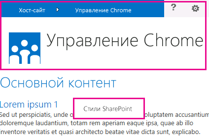
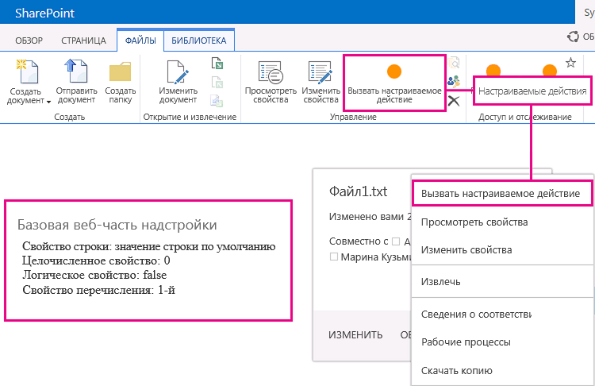

# Разработка пользовательского интерфейса для надстроек SharePointUX design for SharePoint Add-ins

При создании надстроек разработчику всегда уделять особое внимание пользовательскому интерфейсу. Модель надстроек SharePoint включает множество компонентов и механизмов, помогающих создать качественный пользовательский интерфейс. Кроме того, пользовательский интерфейс в модели надстроек достаточно гибкий, чтобы вы могли использовать методики и платформы, наиболее соответствующие потребностям пользователей.As a developer, you should always give high priority to the user experience (UX) when you are creating add-ins. The model for SharePoint Add-ins offers many UX components and mechanisms that help you build a great user experience. The user experience in the add-in model is also flexible enough to let you use the techniques and platforms that best adapt to the needs of end users.

## Общие сведения о пользовательском интерфейсе надстроек в SharePointHigh-level overview of add-in UX in SharePoint

Вы, как разработчик надстроек, должны знать архитектуру своей надстройки. Если вы уже решили, как ваша надстройка будет распределена по удаленным и SharePoint-платформам, можно определяться с выбором доступных вариантов создания пользовательского рабочего интерфейса для вашей надстройки. Вы можете задать себе следующие вопросы:As the add-in developer, you have to know the architecture of your add-in. After you determine how your add-in will be distributed in remote and SharePoint platforms, you can decide among the available alternatives for building your add-in UX. You might ask yourself the following questions:

- Какие средства можно использовать при создании надстройки, размещаемой в облаке?What can I use if I am creating a cloud-hosted add-in?

- Какие средства можно использовать при создании надстройки, размещаемой в SharePoint?What can I use if I am creating a SharePoint-hosted add-in? Дополнительные сведения см. в статье [Выбор шаблонов для разработки и размещения надстройки SharePoint](choose-patterns-for-developing-and-hosting-your-sharepoint-add-in.md).For more information, see [Choose patterns for developing and hosting your SharePoint Add-in](choose-patterns-for-developing-and-hosting-your-sharepoint-add-in.md).

- Как подключить пользовательский интерфейс к хост-сайту?How can I connect my UX to the host web? Дополнительные сведения см. в статье [Хост-сайты, сайты надстроек и компоненты SharePoint в SharePoint](host-webs-add-in-webs-and-sharepoint-components-in-sharepoint.md).For more information, see [Host webs, add-in webs, and SharePoint components in SharePoint](host-webs-add-in-webs-and-sharepoint-components-in-sharepoint.md).

На схеме ниже показаны основные сценарии и варианты, которые следует рассмотреть при проектировании пользовательского интерфейса надстройки.The following diagram shows the main scenarios and options to consider when you are designing your add-in UX.

*Рис. 1. Основные сценарии и параметры пользовательского интерфейса надстроек**Figure 1. Add-in UX main scenarios and options*

 
При выборе дизайна необходимо основательно продумать, какие части вашей надстройки будут размещены в SharePoint, а какие нет. Необходимо также продумать, каким образом ваша надстройка будет взаимодействовать с хост-сетью.In choosing your design, you should fundamentally consider which parts of your add-in are hosted in SharePoint and which are not. You should also consider how your add-in interacts with the host web.

## Сценарии добавления пользовательского интерфейса в надстройки, размещаемые в облакеAdd-in UX scenarios in cloud-hosted add-ins

Предположим, что вы решаете не размещать определенную рабочую среду в SharePoint. В данных сценариях предполагается, что ваши конечные пользователи будут перемещаться между веб-сайтом SharePoint и надстройкой в облаке. Вы можете использовать технологии и инструменты платформы, но SharePoint также предоставляет ресурсы, которые помогут спроектировать удобную рабочую среду для пользователей.Suppose that you determine that some of your user experience is not hosted in SharePoint. In these scenarios, it is expected that your end users go back and forth between a SharePoint website and the cloud-hosted add-in. You can use the techniques and tools in the platform, but SharePoint also provides resources to help you design a smooth experience for users.

Для надстроек SharePoint, размещаемых в облаке, доступны указанные ниже ресурсы пользовательского интерфейса.The following UX resources are available for cloud-hosted add-ins in SharePoint:

- **Элемент управления хрома.** С помощью этого элемента управления вы можете использовать заголовок навигации определенного сайта SharePoint в своей надстройке, не регистрируя библиотеку сервера и не используя какую-либо технологию или средство.**Chrome control:** The chrome control enables you to use the navigation header of a specific SharePoint site in your add-in without needing to register a server library or use a specific technology or tool. Чтобы использовать эту функцию, вам потребуется зарегистрировать библиотеку JavaScript для SharePoint с помощью стандартных тегов `<script>`.To use this functionality, you must register a SharePoint JavaScript library through standard `<script>` tags. Вы можете указать заполнитель с помощью HTML-элемента **div**, а затем настроить этот элемент управления, используя доступные параметры.You can provide a placeholder by using an HTML **div** element and further customize the control by using the available options. Этот элемент управления наследует внешний вид от указанного веб-сайта SharePoint.The control inherits its appearance from the specified SharePoint website. Дополнительные сведения см. в статье [Использование клиентского элемента управления хрома в надстройках SharePoint](use-the-client-chrome-control-in-sharepoint-add-ins.md).For more information, see [Use the client chrome control in SharePoint Add-ins](use-the-client-chrome-control-in-sharepoint-add-ins.md).

- **Таблица стилей.** Вы можете оставить ссылку на таблицу стилей веб-сайта SharePoint в Надстройка SharePoint и использовать её для оформления стилей ваших веб-страниц с помощью доступных классов. Помимо этого, если конечные пользователи меняют тему веб-сайта SharePoint, вы можете назначить новые наборы стилей, не меняя ссылку в надстройке. Дополнительные сведения см. в статье [Использование таблицы стилей веб-сайта SharePoint в надстройках для SharePoint](use-a-sharepoint-website-s-style-sheet-in-sharepoint-add-ins.md).**Stylesheet:** You can reference a SharePoint website's style sheet in your SharePoint Add-in and use it to style your webpages using the available classes. In addition, if the end users change the SharePoint website's theme, your add-in can adopt the new set of styles without modifying the reference in your add-in. For more information, see [Use a SharePoint website's style sheet in SharePoint Add-ins](use-a-sharepoint-website-s-style-sheet-in-sharepoint-add-ins.md).
     
На рис. 2 показаны ресурсы модели для надстроек SharePoint, размещаемых в облаке.Figure 2 shows the resources in the model for SharePoint Add-ins for cloud-hosted add-ins.

*Рис. 2. Добавление ресурсов пользовательского интерфейса для надстроек, размещаемых в облаке**Figure 2. Add-in UX resources for cloud-hosted add-ins*

## Сценарии добавления пользовательского интерфейса в надстройки, размещаемые в SharePointAdd-in UX scenarios in SharePoint-hosted add-ins

Если ваша надстройка размещена в SharePoint, маловероятно, что пользовательская рабочая среда значительно изменится, когда пользователи будут перемещаться между хост-сетью и сетью надстройки. После развертывания надстройки сеть надстройки использует таблицу стилей и тему из хост-сети. Вы можете по прежнему пользоваться элементом управления хрома и таблицей стилей в надстройке, размещенной в SharePoint, но наиболее значительным отличием от сценариев, размещенных в облаке, является доступность шаблона надстройки.If your add-in is hosted in SharePoint, the user experience is less likely to change very much when users move back and forth between the host web and the add-in web. When the add-in is deployed, the add-in web takes the style sheet and theme from the host web. You can still use the chrome control and style sheet in a SharePoint-hosted add-in, but the most significant difference with cloud-hosted scenarios is the availability of the add-in template.

Для надстроек, размещаемых в SharePoint доступны следующие ресурсы пользовательского интерфейса:The following UX resource is available for SharePoint-hosted add-ins:

- **Шаблон надстройки.** Шаблон надстройки включает эталонную страницу **app.master**. Этот вариант используется по умолчанию при создании сайта надстройки.**Add-in template:** The add-in template includes the **app.master** masterpage. It is the default option when you create an add-in web.

Надстройки, размещаемые в SharePoint, также могут использовать имеющиеся ресурсы и технологии SharePoint, например ленту, инфраструктуру веб-частей и функцию клиентской обработки.SharePoint-hosted add-ins also benefit from existing resources and technologies in SharePoint such as the Ribbon, web part infrastructure, and client-side rendering.

## Сценарии подключения пользовательского интерфейса надстройки к хост-сайтуScenarios for connecting the add-in UX to the host web

В некоторых случаях используемые вами надстройки могут запускаться изнутри хост-сети. Дополнительно к отображениям некоторых рабочих сред вашей надстройки на страницах, размещенных в SharePoint, доступны способы открытия надстроек из библиотеки документов и списка.Some of the use cases for your add-in can be triggered from within the host web. SharePoint provides ways to open your add-in from a document library or list in addition to ways to show some of your add-in UX within SharePoint-hosted pages.

Для подключения пользовательского интерфейса надстройки к хост-сайту доступны указанные ниже ресурсы пользовательского интерфейса.The following UX resources are available to connect your add-in UX to the host web:

- **Дополнительные действия.** Вы можете использовать дополнительные действия для подключения надстройки к пользовательскому интерфейсу хост-сайта.**Custom actions**: You can use custom actions to connect the host web UX with your add-in. Существует два типа дополнительных действий: ленты и ECB.There are two types of custom actions: Ribbon or ECB. Дополнительное действие может отправлять параметры, например список или элемент, в котором оно было вызвано, на удаленную страницу.A custom action can send parameters such as the list or item on which it was invoked to a remote page. Дополнительные сведения см. в статье [Создание дополнительных действий для развертывания с надстройками SharePoint](create-custom-actions-to-deploy-with-sharepoint-add-ins.md).For more information, see [Create custom actions to deploy with SharePoint Add-ins](create-custom-actions-to-deploy-with-sharepoint-add-ins.md).   
 
- **Веб-части надстройки.** С помощью веб-частей надстроек вы можете добавлять в хост-сеть рабочие среды ваших надстроек. Веб-часть надстройки доступна в галерее Web Part хост-сети после развертывания надстройки. Пользователи могут добавлять веб-часть надстройки на страницу с помощью элемента управления **Web Part Adder**. Дополнительные сведения см. в статье [Создание веб-частей надстройки для установки совместно с надстройкой для SharePoint](create-add-in-parts-to-install-with-your-sharepoint-add-in.md).**Add-in parts:** You can include some of your add-in user experience in the host web by using add-in parts. The add-in part is available in the Web Part gallery in the host web when you deploy the add-in. Users can add the add-in part to a page by using the **Web Part Adder** control. For more information, see [Create add-in parts to install with your SharePoint Add-in](create-add-in-parts-to-install-with-your-sharepoint-add-in.md).
    
На рис. 3 показаны ресурсы модели надстроек SharePoint, позволяющие подключить пользовательский интерфейс надстройки к хост-сайту.Figure 3 shows the resources in the model for SharePoint Add-ins to connect your add-in UX to the host web.

*Рис. 3. Ресурсы пользовательского интерфейса для хост-сайта**Figure 3. Add-in UX resources for the host web*

## См. такжеSee also

-  [Проектирование надстроек SharePointDesign SharePoint Add-ins](design-sharepoint-add-ins.md)
-  [Надстройки SharePointSharePoint Add-ins](sharepoint-add-ins.md)
-  [Что следует рассмотреть, прежде чем приступать к разработке надстроек SharePointThree ways to think about design options for SharePoint Add-ins](three-ways-to-think-about-design-options-for-sharepoint-add-ins.md)
-  [Важные аспекты разработки и архитектуры для надстроек SharePointImportant aspects of the SharePoint Add-in architecture and development landscape](important-aspects-of-the-sharepoint-add-in-architecture-and-development-landscap.md)
-  [Хост-сайты, сайты надстроек и компоненты SharePoint в SharePointHost webs, add-in webs, and SharePoint components in SharePoint](host-webs-add-in-webs-and-sharepoint-components-in-sharepoint.md)
-  [Рекомендации по проектированию пользовательского интерфейса надстроек SharePointSharePoint Add-ins UX design guidelines](sharepoint-add-ins-ux-design-guidelines.md)
-  [Создание компонентов пользовательского интерфейса в SharePointCreate UX components in SharePoint](create-ux-components-in-sharepoint.md)
-  [Использование таблицы стилей веб-сайта SharePoint в надстройках SharePointUse a SharePoint website's style sheet in SharePoint Add-ins](use-a-sharepoint-website-s-style-sheet-in-sharepoint-add-ins.md)
-  [Использование клиентского элемента управления хрома в надстройках SharePointUse the client chrome control in SharePoint Add-ins](use-the-client-chrome-control-in-sharepoint-add-ins.md)
-  [Создание веб-частей надстроек для установки вместе с надстройкой SharePointCreate add-in parts to install with your SharePoint Add-in](create-add-in-parts-to-install-with-your-sharepoint-add-in.md)
-  [Создание дополнительных действий для развертывания с надстройками SharePointCreate custom actions to deploy with SharePoint Add-ins](create-custom-actions-to-deploy-with-sharepoint-add-ins.md)
    
 

