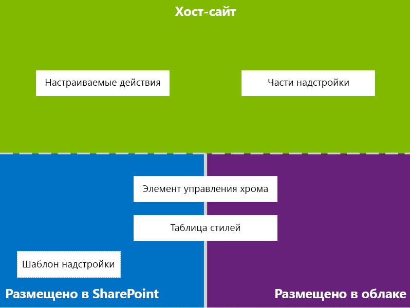

# Разработка пользовательского интерфейса для надстроек SharePoint

При создании надстроек разработчику всегда уделять особое внимание пользовательскому интерфейсу. Модель надстроек SharePoint включает множество компонентов и механизмов, помогающих создать качественный пользовательский интерфейс. Кроме того, пользовательский интерфейс в модели надстроек достаточно гибкий, чтобы вы могли использовать методики и платформы, наиболее соответствующие потребностям пользователей.

## Общие сведения о пользовательском интерфейсе надстроек в SharePoint

Вы, как разработчик надстроек, должны знать архитектуру своей надстройки. Если вы уже решили, как ваша надстройка будет распределена по удаленным и SharePoint-платформам, можно определяться с выбором доступных вариантов создания пользовательского рабочего интерфейса для вашей надстройки. Вы можете задать себе следующие вопросы:

- Какие средства можно использовать при создании надстройки, размещаемой в облаке?

- Какие средства можно использовать при создании надстройки, размещаемой в SharePoint? Дополнительные сведения см. в статье [Выбор шаблонов для разработки и размещения надстройки SharePoint](choose-patterns-for-developing-and-hosting-your-sharepoint-add-in.md).

- Как подключить пользовательский интерфейс к хост-сайту? Дополнительные сведения см. в статье [Хост-сайты, сайты надстроек и компоненты SharePoint в SharePoint](host-webs-add-in-webs-and-sharepoint-components-in-sharepoint.md).

На схеме ниже показаны основные сценарии и варианты, которые следует рассмотреть при проектировании пользовательского интерфейса надстройки.

*Рис. 1. Основные сценарии и параметры пользовательского интерфейса надстроек*

 
При выборе дизайна необходимо основательно продумать, какие части вашей надстройки будут размещены в SharePoint, а какие нет. Необходимо также продумать, каким образом ваша надстройка будет взаимодействовать с хост-сетью.

## Сценарии добавления пользовательского интерфейса в надстройки, размещаемые в облаке

Предположим, что вы решаете не размещать определенную рабочую среду в SharePoint. В данных сценариях предполагается, что ваши конечные пользователи будут перемещаться между веб-сайтом SharePoint и надстройкой в облаке. Вы можете использовать технологии и инструменты платформы, но SharePoint также предоставляет ресурсы, которые помогут спроектировать удобную рабочую среду для пользователей.

Для надстроек SharePoint, размещаемых в облаке, доступны указанные ниже ресурсы пользовательского интерфейса.

- **Элемент управления хрома.** С помощью этого элемента управления вы можете использовать заголовок навигации определенного сайта SharePoint в своей надстройке, не регистрируя библиотеку сервера и не используя какую-либо технологию или средство. Чтобы использовать эту функцию, вам потребуется зарегистрировать библиотеку JavaScript для SharePoint с помощью стандартных тегов `<script>`. Вы можете указать заполнитель с помощью HTML-элемента **div**, а затем настроить этот элемент управления, используя доступные параметры. Этот элемент управления наследует внешний вид от указанного веб-сайта SharePoint. Дополнительные сведения см. в статье [Использование клиентского элемента управления хрома в надстройках SharePoint](use-the-client-chrome-control-in-sharepoint-add-ins.md).

- **Таблица стилей.** Вы можете оставить ссылку на таблицу стилей веб-сайта SharePoint в Надстройка SharePoint и использовать её для оформления стилей ваших веб-страниц с помощью доступных классов. Помимо этого, если конечные пользователи меняют тему веб-сайта SharePoint, вы можете назначить новые наборы стилей, не меняя ссылку в надстройке. Дополнительные сведения см. в статье [Использование таблицы стилей веб-сайта SharePoint в надстройках для SharePoint](use-a-sharepoint-website-s-style-sheet-in-sharepoint-add-ins.md).
     
На рис. 2 показаны ресурсы модели для надстроек SharePoint, размещаемых в облаке.

*Рис. 2. Добавление ресурсов пользовательского интерфейса для надстроек, размещаемых в облаке*

## Сценарии добавления пользовательского интерфейса в надстройки, размещаемые в SharePoint

Если ваша надстройка размещена в SharePoint, маловероятно, что пользовательская рабочая среда значительно изменится, когда пользователи будут перемещаться между хост-сетью и сетью надстройки. После развертывания надстройки сеть надстройки использует таблицу стилей и тему из хост-сети. Вы можете по прежнему пользоваться элементом управления хрома и таблицей стилей в надстройке, размещенной в SharePoint, но наиболее значительным отличием от сценариев, размещенных в облаке, является доступность шаблона надстройки.

Для надстроек, размещаемых в SharePoint доступны следующие ресурсы пользовательского интерфейса:

- **Шаблон надстройки.** Шаблон надстройки включает эталонную страницу **app.master**. Этот вариант используется по умолчанию при создании сайта надстройки.

Надстройки, размещаемые в SharePoint, также могут использовать имеющиеся ресурсы и технологии SharePoint, например ленту, инфраструктуру веб-частей и функцию клиентской обработки.

## Сценарии подключения пользовательского интерфейса надстройки к хост-сайту

В некоторых случаях используемые вами надстройки могут запускаться изнутри хост-сети. Дополнительно к отображениям некоторых рабочих сред вашей надстройки на страницах, размещенных в SharePoint, доступны способы открытия надстроек из библиотеки документов и списка.

Для подключения пользовательского интерфейса надстройки к хост-сайту доступны указанные ниже ресурсы пользовательского интерфейса.

- **Дополнительные действия.** Вы можете использовать дополнительные действия для подключения надстройки к пользовательскому интерфейсу хост-сайта. Существует два типа дополнительных действий: ленты и ECB. Дополнительное действие может отправлять параметры, например список или элемент, в котором оно было вызвано, на удаленную страницу. Дополнительные сведения см. в статье [Создание дополнительных действий для развертывания с надстройками SharePoint](create-custom-actions-to-deploy-with-sharepoint-add-ins.md).   
 
- **Веб-части надстройки.** С помощью веб-частей надстроек вы можете добавлять в хост-сеть рабочие среды ваших надстроек. Веб-часть надстройки доступна в галерее Web Part хост-сети после развертывания надстройки. Пользователи могут добавлять веб-часть надстройки на страницу с помощью элемента управления **Web Part Adder**. Дополнительные сведения см. в статье [Создание веб-частей надстройки для установки совместно с надстройкой для SharePoint](create-add-in-parts-to-install-with-your-sharepoint-add-in.md).
    
На рис. 3 показаны ресурсы модели надстроек SharePoint, позволяющие подключить пользовательский интерфейс надстройки к хост-сайту.

*Рис. 3. Ресурсы пользовательского интерфейса для хост-сайта*

## Дополнительные ресурсы

-  [Проектирование надстроек SharePoint](design-sharepoint-add-ins.md)
-  [Надстройки SharePoint](sharepoint-add-ins.md)
-  [Что следует рассмотреть, прежде чем приступать к разработке надстроек SharePoint](three-ways-to-think-about-design-options-for-sharepoint-add-ins.md)
-  [Важные аспекты разработки и архитектуры для надстроек SharePoint](important-aspects-of-the-sharepoint-add-in-architecture-and-development-landscap.md)
-  [Хост-сайты, сайты надстроек и компоненты SharePoint в SharePoint](host-webs-add-in-webs-and-sharepoint-components-in-sharepoint.md)
-  [Рекомендации по проектированию пользовательского интерфейса надстроек SharePoint](sharepoint-add-ins-ux-design-guidelines.md)
-  [Создание компонентов пользовательского интерфейса в SharePoint](create-ux-components-in-sharepoint.md)
-  [Использование таблицы стилей веб-сайта SharePoint в надстройках SharePoint](use-a-sharepoint-website-s-style-sheet-in-sharepoint-add-ins.md)
-  [Использование клиентского элемента управления хрома в надстройках SharePoint](use-the-client-chrome-control-in-sharepoint-add-ins.md)
-  [Создание веб-частей надстроек для установки вместе с надстройкой SharePoint](create-add-in-parts-to-install-with-your-sharepoint-add-in.md)
-  [Создание дополнительных действий для развертывания с надстройками SharePoint](create-custom-actions-to-deploy-with-sharepoint-add-ins.md)
    
 

