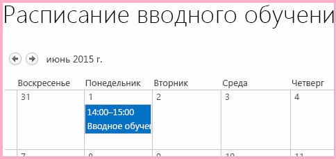
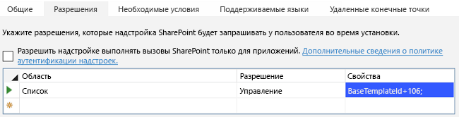

# <a name="work-with-host-web-data-from-javascript-in-the-add-in-web"></a>Работа с данными хост-сайта из JavaScript на сайте надстройки

Это одиннадцатая часть серии статей, посвященной основам разработки надстроек SharePoint, размещаемых в SharePoint. Для начала вам следует ознакомиться со статьей [Надстройки SharePoint](sharepoint-add-ins.md) и предыдущими статьями этой серии, представленными в разделе [Знакомство с созданием надстроек SharePoint, размещаемых в SharePoint](get-started-creating-sharepoint-hosted-sharepoint-add-ins.md#Nextsteps). 
    
> [!NOTE]
> Если вы изучали предыдущие статьи этой серии о надстройках, размещаемых в SharePoint, то у вас уже есть решение для Visual Studio, которое можно использовать для работы с этой статьей. Кроме того, вы можете скачать репозиторий на веб-странице [SharePoint_SP-hosted_Add-Ins_Tutorials](https://github.com/OfficeDev/SharePoint_SP-hosted_Add-Ins_Tutorials) и открыть файл BeforeHostWebData.sln.

По умолчанию SharePoint запрещает коду JavaScript в надстройке доступ к данным на других веб-сайтах SharePoint в ферме. Благодаря этому ограничению скрипту в мошеннической надстройке не удастся получить доступ к конфиденциальным данным. Тем не менее зачастую надстройке требуется доступ к хост-сайту или другим веб-сайтам, находящимся в том же семействе веб-сайтов, что и хост-сайт. 

Чтобы включить этот сценарий в вашей надстройке, используются два указанных ниже этапа.

- Вы запрашиваете разрешение на доступ к хост-сайту в файле манифеста надстройки. Пользователю, который устанавливает надстройку, будет предложено предоставить это разрешение. Если пользователь не предоставит это разрешение, то не удастся установить надстройку.

- Для создания вызовов JSOM к хост-сайту, используйте объект **SP.AppContextSite** вместо объекта **SP.ClientContext**. Этот объект позволяет надстройке получать объект контекста для веб-сайтов, отличных от сайта надстройки, но только для тех веб-сайтов, которые находятся в одном и том же семействе веб-сайтов. (Кроме того, существует способ получения доступа к любому веб-сайту в подписке SharePoint Online или в локальном веб-приложении SharePoint, но это более сложная тема.)

В данной статье вы будете использовать JSOM для поиска еще не запущенных процессов вводного обучения и проверки того, что они запланированы в календаре на хост-сайте.

## <a name="prepare-the-host-web-calendar"></a>Подготовка календаря хост-сайта

Откройте хост-сайт (ваш тестовый веб-сайт разработчика) и убедитесь, что на нем есть календарь **Employee Orientation Schedule** (Расписание обучения сотрудников) с одним событием **Orient Cassie Hicks** (Обучение Cassie Hicks). Если его нет, выполните указанные ниже действия.

1. На домашней странице сайта выберите пункты **Содержимое сайта** > **Добавить надстройку** > **Календарь**.    
 
2. В диалоговом окне **Добавление календаря** введите **Employee Orientation Schedule** (Расписание обучения сотрудников) в поле **Имя**, а затем нажмите кнопку **Создать**.
    
3. Когда откроется календарь, наведите курсор на любую дату, чтобы на ней появилась ссылка **Добавить**, и перейдите по ссылке **Добавить**.   
 
4. В диалоговом окне **Employee Orientation Schedule - New Item** (Расписание обучения сотрудников: новый элемент) в поле **Название** введите **Orient Cassi Hicks** (Обучение Cassie Hicks). В остальных полях оставьте значения, используемые по умолчанию, и нажмите кнопку **Сохранить**.
    
   Календарь должен выглядеть примерно так:
    
   *Рис. 1. Настраиваемый календарь*

   


## <a name="create-the-javascript-and-a-button-to-invoke-it"></a>Создание кода JavaScript и кнопки для его вызова

1. В **обозревателе решений** в узле **Скрипты** откройте файл Add-in.js. 
    
2. Добавьте указанные ниже объявления под объявлением `completedItems`. 
    
    ```
     var notStartedItems;
     var calendarList;
     var scheduledItems;
    ```
    
   - Элемент `notStartedItems` ссылается на элементы в списке **New Employees in Seattle** (Новые сотрудники в Сиэтле), у которого параметр **Orientation Stage** (Этап обучения) имеет значение **Not Started** (Не начато).
   - Элемент `calendarList` ссылается на календарь, который вы создали на хост-сайте.
   - Элемент `scheduledItems` ссылается на коллекцию элементов календаря.

3. При запуске надстройки SharePoint вызывает ее начальную страницу и добавляет ряд параметров запроса в URL-адрес начальной страницы. Один из таких параметров — `SPHostUrl`, который, конечно же, представляет собой URL-адрес хост-сайта. Эта информация требуется надстройке, чтобы она могла совершать вызовы к данным хост-сайта, поэтому в верхней части файла Add-in.js сразу после объявления переменных для элемента `scheduledItems` добавьте указанную ниже строку. 

    ```
      var hostWebURL = decodeURIComponent(getQueryStringParameter("SPHostUrl"));
    ```

   Обратите внимание на указанные ниже особенности этого кода.
    
   - `getQueryStringParameter` — это служебная функция, которую вы создадите на следующем этапе.
   - `decodeUriComponent` — это стандартная функция JavaScript, выполняющая обратное преобразование кодировки универсального кода ресурса (URI), которое SharePoint совершает для параметров запроса. Например, код %2F для косой черты будет преобразован обратно в символ /.

4. Добавьте указанный ниже код в конец файла. С помощью этой функции можно считывать параметры запроса. 
    
    ```
      // Utility functions

    function getQueryStringParameter(paramToRetrieve) {
         var params = document.URL.split("?")[1].split("&amp;");
         var strParams = "";
         for (var i = 0; i < params.length; i = i + 1) {
             var singleParam = params[i].split("=");
             if (singleParam[0] == paramToRetrieve) {
                 return singleParam[1];
            }
         }
     }
    ```

5. Добавьте указанную ниже функцию в файл Add-in.js перед разделом с функциями обратного вызова для обработки ошибок. 

    ```
      function ensureOrientationScheduling() {

        var camlQuery = new SP.CamlQuery();
        camlQuery.set_viewXml(
            '<View><Query><Where><Eq>' +
                '<FieldRef Name=\'OrientationStage\'/><Value Type=\'Choice\'>Not started</Value>' +
            '</Eq></Where></Query></View>');
        notStartedItems = employeeList.getItems(camlQuery);

        clientContext.load(notStartedItems);
        clientContext.executeQueryAsync(getScheduledOrientations, onGetNotStartedItemsFail);
        return false;
    }
    ```

   Обратите внимание на указанные ниже особенности этого кода.

   - Он практически идентичен методу запроса списка, который получает элементы с состоянием **Completed** (Завершено), за исключением того, что он получает элементы с состоянием **Not Started** (Не начато), а не **Completed** (Завершено). Нас интересуют только элементы с состоянием **Not Started** (Не начато), так как в скрипте для простоты предполагается, что если обучение прошло этап **Not Started** (Не начато), то оно уже должно быть в расписании.
   - На последующих этапах вы создадите два метода обратного вызова в вызове **executeQueryAsync**.

6. Добавьте указанную ниже функцию в файл Add-in.js сразу под предыдущей функцией. Обратите внимание, что в этой функции для идентификации запрашиваемого списка используется объект **hostWebContext**.

    ```
      function getScheduledOrientations() {

        var hostWebContext = new SP.AppContextSite(clientContext, hostWebURL);
        calendarList = hostWebContext.get_web().get_lists().getByTitle('Employee Orientation Schedule');

        var camlQuery = new SP.CamlQuery();
        scheduledItems = calendarList.getItems(camlQuery);

        clientContext.load(scheduledItems);
        clientContext.executeQueryAsync(scheduleAsNeeded, onGetScheduledItemsFail);
    }
    ```

   > [!NOTE]
   > Обратите внимание, что в запрос CAML не добавляется никакой разметки запроса. Отсутствие фактического запроса в объекте запроса гарантирует, что будут получены *все* элементы списка. Если бы список был очень большим, это могло привести к тому, что запрос к серверу выполнялся бы неприемлемо долго. В этом случае нам, возможно, потребовалось бы найти другой способ достижения нашей цели. В нашем же примере используется очень маленький список (списки календаря почти всегда маленькие), и получение всего списка (чтобы можно было выполнить итерации в нем в клиенте) позволит нам свести к минимуму количество вызовов к серверу, то есть вызовов метода **executeQueryAsync**.

7. Добавьте указанную ниже функцию в файл. 

    ```
      function scheduleAsNeeded() {

        var unscheduledItems = false;
        var dayOfMonth = '10';

        var listItemEnumerator = notStartedItems.getEnumerator();

        while (listItemEnumerator.moveNext()) {
            var alreadyScheduled = false;
            var notStartedItem = listItemEnumerator.get_current();

            var calendarEventEnumerator = scheduledItems.getEnumerator();
            while (calendarEventEnumerator.moveNext()) {
                var scheduledEvent = calendarEventEnumerator.get_current();

                 // The SP.ListItem.get_item('field_name ') method gets the value of the specified field.
                if (scheduledEvent.get_item('Title').indexOf(notStartedItem.get_item('Title')) > -1) {
                    alreadyScheduled = true;
                    break;
                }
            }
            if (alreadyScheduled === false) {

                 // SP.ListItemCreationInformation holds the information the SharePoint server needs to
                 // create a list item
                var calendarItem = new SP.ListItemCreationInformation();

                 // The some_list .additem method tells the server which list to add 
                 // the item to.
                var itemToCreate = calendarList.addItem(calendarItem);

                 // The some_item .set_item method sets the value of the specified field.
                itemToCreate.set_item('Title', 'Orient ' + notStartedItem.get_item('Title'));

                 // The EventDate and EndDate are the start and stop times of an event.
                itemToCreate.set_item('EventDate', '2015-06-' + dayOfMonth + 'T21:00:00Z');
                itemToCreate.set_item('EndDate', '2015-06-' + dayOfMonth + 'T23:00:00Z');
                dayOfMonth++;

                 // The update method tells the server to commit the changes to the SharePoint database.
                itemToCreate.update();
                unscheduledItems = true;
            }
        }
        if (unscheduledItems) {
            calendarList.update();
            clientContext.executeQueryAsync(onScheduleItemsSuccess, onScheduleItemsFail);
        }
    }
    ```

   Обратите внимание на указанные ниже особенности этого кода.

   - Этот метод проверяет, содержится ли название элемента с состоянием **Not Started** (Не начато) в списке **New Employees In Seattle** (Новые сотрудники в Сиэтле), представляющее собой имя сотрудника, в названии события из календаря **Employee Orientation Schedule** (Расписание обучения сотрудников). При этом для простоты предполагается, что при создании всех записей в календаре в названиях событий используются полные имена сотрудников.

   - Если ни одно из уже имеющихся в календаре событий не совпадает с элементом с состоянием **Not Started** (Не начат), то сценарий создает элемент календаря для элемента с состоянием **Not Started** (Не начат).

   - Объект JSOM использует простой объект **ListItemCreationInformation** вместо объекта **SPListItem**. Это позволяет свести к минимуму объем полезных данных, отправляемых на сервер SharePoint.

   - Двум полям типа **DateTime** нового события календаря присвоены даты месяца, в котором была написана эта статья: `2015-06`. *Измените эти даты на даты с текущим месяцем и годом, чтобы вам не пришлось прокручивать календарь в поисках необходимых элементов.* 

   - Если будет обнаружено, что каких-либо элементов с состоянием **Not Started** (Не начат) нет в расписании, то первый элемент будет внесен в расписание на 10-е число месяца. Каждый дополнительный элемент, которого нет в расписании, будет вноситься в расписание со сдвигом на один день. В примере используется упрощающее допущение, подразумевающее, что элементов не так много и они не будут запланированы на несуществующие дни месяца, например, на 32-е число.

   - Большая часть этого кода представляет собой стандартный JavaScript. Строки с использованием модели JSOM SharePoint прокомментированы.

8. Добавьте указанный ниже обработчик успешного выполнения, который вызывается при добавлении элементов, которых ранее не было в расписании, в календарь.
    
    ```
      function onScheduleItemsSuccess() {
        alert('There was one or more unscheduled orientations and they have been added to the '
                  + 'Employee Orientation Schedule calendar.');
    }
    ```

9. Добавьте приведенные ниже функции в раздел файла с функциями обратного вызова для обработки неудачного выполнения.
    
    ```
      function onGetNotStartedItemsFail(sender, args) {
        alert('Unable to get the not-started items. Error:' 
            + args.get_message() + '\n' + args.get_stackTrace());
    }

    function onGetScheduledItemsFail(sender, args) {
        alert('Unable to get scheduled items from host web. Error:' 
            + args.get_message() + '\n' + args.get_stackTrace());
    }

    function onScheduleItemsFail(sender, args) {
        alert('Unable to schedule items on host web calendar. Error:' 
            + args.get_message() + '\n' + args.get_stackTrace());
    }
    ```

10. Откройте файл default.aspx и найдите элемент **asp:Content** с идентификатором **PlaceHolderMain**.

11. Добавьте указанную ниже разметку непосредственно под кнопкой `purgeCompletedItems`.
    
    ```HTML
      <p><asp:Button runat="server" OnClientClick="return ensureOrientationScheduling()" 
      ID="ensureorientationschedulingbutton" Text="Ensure all items are on the Calendar" /></p>
    ```

12. Выполните перестройку проекта в Visual Studio.

13. Чтобы при тестировании надстройки вам не приходилось вручную задавать значение **Not Started** (Не начато) для поля **Orientation Stage** (Этап обучения) элементов списка, откройте файл elements.xml для экземпляра списка **NewEmployeesInSeattle** (но не файл elements.xml для шаблона списка **NewEmployeeOrientation**) и убедитесь, что поле **Orientation Stage** (Этап обучения) для по крайней мере трех элементов **Row** (Строка), *включая строку для Cassie Hicks*, имеет значение **Not Started** (Не начато). Так как это значение используется по умолчанию, самый простой способ сделать это — проверить, что элемент **Field** (Поле) для поля `OrientationStage` отсутствует для трех или более строк.
    
   В примере ниже показано, как должен выглядеть элемент **Rows** (Строки).
 
    ```
      <Rows>
        <Row>
          <Field Name="Title">Tom Higginbotham</Field>
          <Field Name="Division">Manufacturing</Field>
          <Field Name="OrientationStage">Completed</Field>
        </Row>
        <Row>
          <Field Name="Title">Satomi Hayakawa</Field>
        </Row>
        <Row>
          <Field Name="Title">Cassi Hicks</Field>
        </Row>
        <Row>
          <Field Name="Title">Lertchai Treetawatchaiwong</Field>
        </Row>
      </Rows>
    ```


## <a name="specify-the-permissions-to-the-host-web-that-the-add-in-needs"></a>Установка необходимых надстройке разрешений для хост-сайта

Ваша надстройка автоматически получает разрешение на полный контроль над ее сайтом, поэтому до сих пор вам не нужно было указывать, какие разрешения необходимы для надстройки. Для взаимодействия с данными на хост-сайте вам потребуется отдельно запросить разрешения на доступ к хост-сайту. Надстройке Employee Orientation необходимо разрешение для добавления элементов в календарь на хост-сайте. 

1. В **обозревателе решений** откройте файл appmanifest.xml. 

2. В конструкторе манифеста перейдите на вкладку **Разрешения**.

3. В раскрывающемся списке в верхней строке столбца **Область** выберите пункт **Список**.

4. В столбце **Разрешение** выберите **Управление**.

5. Если оставить столбец **Свойства** пустым, надстройка будет запрашивать разрешение на запись в каждый список на хост-сайте. Рекомендуется задать для надстройки только те разрешения, которые ей действительно нужны. Не существует способа, которым в манифесте надстройки можно ограничить разрешения определенным экземпляром списка, но можно ограничить разрешения надстройки только экземплярами списков, созданными на основе определенного базового шаблона списка. Базовый шаблон списка календаря — **Events** (События) с числовым идентификатором 106.
    
   Выберите ячейку **Свойства** в той же строке, чтобы в ячейке появилась кнопка **Изменить**. Теперь список разрешений должен выглядеть приблизительно так, как показано ниже.

   *Рис. 2. Список разрешений с отображенной кнопкой "Изменить"*

   

6. Нажмите кнопку **Изменить**. Откроется диалоговое окно **Свойства**.

7. Присвойте параметру **Name** (Имя) значение **BaseTemplateId**, а параметру **Value** (Значение) — значение **106**. Диалоговое окно должно выглядеть так, как показано ниже.
    
   *Рис. 3. Диалоговое окно свойств разрешений списка*

   

8. Нажмите кнопку **ОК**. Теперь вкладка **Разрешения** должна выглядеть приблизительно так, как показано ниже.

   *Рис. 4. Вкладка "Разрешения" в конструкторе манифестов надстроек в Visual Studio*

   

## <a name="run-and-test-the-add-in"></a>Запуск и тестирование надстройки

1. Подготовьте календарь хост-сайта, как описано выше в этой статье. В нем должно быть одно событие с именем **Orient Cassi Hicks** (Обучение Cassi Hicks).

2. Включите всплывающие окна в браузере, который Visual Studio использует при отладке.

3. Нажмите клавишу F5, чтобы развернуть и запустить надстройку. Visual Studio выполнит временную установку надстройки на тестовом сайте SharePoint и сразу же запустит ее. 

4. Откроется форма согласия на предоставления разрешений, в которой вы можете предоставить необходимые разрешения для надстройки. На странице имеется раскрывающийся список всех календарей на хост-сайте, в котором вы можете выбрать необходимый календарь. Выберите календарь **Employee Orientation Schedule** (Обучение сотрудников) и щелкните **Доверять**.
    
   *Рис. 5. Запрос согласия для надстройки SharePoint*

   

5. После полной загрузки начальной страницы надстройки нажмите кнопку **Ensure Items are Scheduled** (Добавить элементы в расписание).
    
   *Рис. 6. Домашняя страница надстройки Employee Orientation (Обучение сотрудников) с новой кнопкой*

   

6. Если запущена какая-либо функция обратного вызова при ошибке, отобразится сообщение с предупреждением об ошибке, созданное этой функцией. В противном случае отобразится сообщение об успешном выполнении, созданное последней успешно выполненной функцией обратного вызова: *There was one or more unscheduled orientations and they have been added to the Employee Orientation Schedule calendar* (Обнаружена одна или несколько незапланированных задач обучения, и они были добавлены в календарь с расписанием вводного обучения для сотрудников).

7. Перейдите в календарь **Employee Orientation Schedule** (Расписание обучения сотрудников) на хост-сайте. Например, перейдите по иерархической ссылке на домашнюю страницу вашего сайта разработчика и щелкните **Содержимое сайта**. Щелкните плитку **Employee Orientation Schedule** (Расписание обучения сотрудников) (но не плитку **Employee Orientation** [Обучение сотрудников]).

   Календарь должен выглядеть примерно так, как показано ниже. В ходе выполнения сценария было обнаружено, что уже имеется событие для сотрудника Cassi Hicks, поэтому еще одно событие для этого сотрудника не создавалось. Вместо этого были созданы события для двух других сотрудников, для процесса вводного обучения которых было установлено состояние **Not Started** (Не начат). Кроме того, не было создано событие для сотрудника, чей процесс вводного обучения уже прошел этап **Not Started** (Не начат).

   *Рис. 7. Календарь после добавления двух новых событий*

   

8. Прежде чем еще раз нажать кнопку **Ensure Items are Scheduled** (Добавить элементы в расписание), обязательно удалите два новых события из календаря.

9. Чтобы завершить сеанс отладки, закройте окно браузера или остановите отладку в Visual Studio. При каждом нажатии клавиши F5 Visual Studio будет отзывать предыдущую версию надстройки и устанавливать ее последнюю версию.

10. Вы будете работать с этой надстройкой и решением Visual Studio при изучении других статей, поэтому при перерывах в работе рекомендуем отзывать надстройку. В **обозревателе решений** щелкните проект правой кнопкой мыши и выберите пункт **Отозвать**.

## <a name="next-steps"></a>Дальнейшие действия
<a name="Nextsteps"> </a>

Теперь вы можете перейти к более сложным задачам, связанным с надстройками SharePoint, размещаемыми в SharePoint: 

-  [Проектирование надстроек SharePoint](design-sharepoint-add-ins.md)
-  [Разработка надстроек SharePoint](develop-sharepoint-add-ins.md)
-  [Публикация надстроек SharePoint](publish-sharepoint-add-ins.md)
-  [Средства и среды для разработки надстроек SharePoint](tools-and-environments-for-developing-sharepoint-add-ins.md)
    
 

