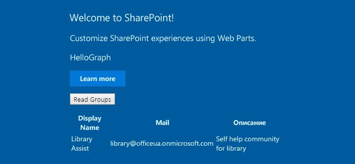
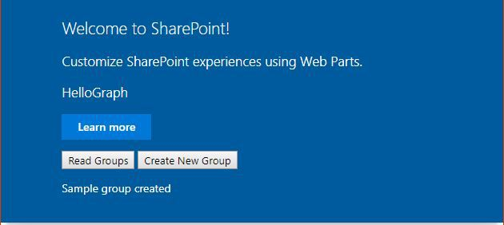

# <a name="use-graphhttpclient-to-call-microsoft-graph"></a><span data-ttu-id="36f6d-101">Вызов Microsoft Graph с помощью класса GraphHttpClient</span><span class="sxs-lookup"><span data-stu-id="36f6d-101">Use GraphHttpClient to call Microsoft Graph</span></span>
> [!IMPORTANT]
><span data-ttu-id="36f6d-102">Класс **GraphHttpClient** находится на этапе тестирования, и в него могут быть внесены изменения.</span><span class="sxs-lookup"><span data-stu-id="36f6d-102">The **GraphHttpClient** is currently in preview and is subject to change.</span></span> <span data-ttu-id="36f6d-103">Сейчас он не поддерживается для использования в рабочих средах.</span><span class="sxs-lookup"><span data-stu-id="36f6d-103">It is not currently supported for use in production environments.</span></span>

<span data-ttu-id="36f6d-104">Используйте класс **GraphHttpClient**, чтобы совершать вызовы к REST API Microsoft Graph.</span><span class="sxs-lookup"><span data-stu-id="36f6d-104">Use the **GraphHttpClient** class to make calls to the Microsoft Graph REST API.</span></span> <span data-ttu-id="36f6d-105">Вы можете выполнять запросы GET, POST и PATCH, используя методы **get()**, **post()** и **fetch()**.</span><span class="sxs-lookup"><span data-stu-id="36f6d-105">You can make GET, POST, and PATCH requests using the **get()**, **post()**, and **fetch()** methods.</span></span> <span data-ttu-id="36f6d-106">В этой статье рассказывается, как создать веб-часть, которая использует класс **GraphHttpClient**, но вы можете применять класс **GraphHttpClient** в любом клиентском коде в SharePoint Framework.</span><span class="sxs-lookup"><span data-stu-id="36f6d-106">This article shows how to build a web part that uses **GraphHttpClient**, but you can use **GraphHttpClient** in any SharePoint Framework client code.</span></span>

## <a name="retrieve-office-365-groups-using-a-get-call"></a><span data-ttu-id="36f6d-107">Получение групп Office 365 с помощью вызова GET</span><span class="sxs-lookup"><span data-stu-id="36f6d-107">Retrieve Office 365 groups using a GET call</span></span>

<span data-ttu-id="36f6d-108">Вы можете использовать метод **get()** для совершения вызова REST к Microsoft Graph.</span><span class="sxs-lookup"><span data-stu-id="36f6d-108">You can use the **get()** method to make a REST call to Microsoft Graph.</span></span> <span data-ttu-id="36f6d-109">В этом примере показано, как получить список групп Office 365.</span><span class="sxs-lookup"><span data-stu-id="36f6d-109">This example shows you how to retrieve a list of Office 365 groups.</span></span> 

### <a name="create-a-new-web-part-project"></a><span data-ttu-id="36f6d-110">Создание проекта веб-части</span><span class="sxs-lookup"><span data-stu-id="36f6d-110">Create a new web part project</span></span>

1. <span data-ttu-id="36f6d-111">Создайте каталог проекта в любом расположении.</span><span class="sxs-lookup"><span data-stu-id="36f6d-111">Create a new project directory in your favorite location.</span></span> 

  ```
  mkdir hellograph-webpart
  ```

2. <span data-ttu-id="36f6d-112">Перейдите к каталогу проекта.</span><span class="sxs-lookup"><span data-stu-id="36f6d-112">Go to the project directory.</span></span>

  ```
  cd hellograph-webpart
  ```

3. <span data-ttu-id="36f6d-113">Создайте веб-часть, запустив генератор Yeoman для SharePoint.</span><span class="sxs-lookup"><span data-stu-id="36f6d-113">Create a new web part by running the Yeoman SharePoint generator.</span></span>

  ```
  yo @microsoft/sharepoint
  ```

4. <span data-ttu-id="36f6d-114">Когда отобразится соответствующий запрос, выполните указанные ниже действия.</span><span class="sxs-lookup"><span data-stu-id="36f6d-114">When prompted:</span></span>

  * <span data-ttu-id="36f6d-115">Введите имя решения **hellograph-webpart**.</span><span class="sxs-lookup"><span data-stu-id="36f6d-115">Enter a solution name of **hellograph-webpart**.</span></span>
  * <span data-ttu-id="36f6d-116">В качестве расположения для размещения файлов выберите вариант **Использовать текущую папку**.</span><span class="sxs-lookup"><span data-stu-id="36f6d-116">Select **Use the current folder** for where to place the files.</span></span>
  * <span data-ttu-id="36f6d-117">Когда отобразится соответствующий запрос, введите **д**, если вы хотите разрешить администратору клиента развертывать решение немедленно на всех сайтах, не запуская процесс развертывания компонентов или добавления приложений на сайтах.</span><span class="sxs-lookup"><span data-stu-id="36f6d-117">Enter **y** when prompted if you want to allow the tenant admin to deploy the solution to all sites immediately, without running any feature deployment or adding apps in sites.</span></span>
  * <span data-ttu-id="36f6d-118">В качестве типа клиентского компонента, который необходимо создать, выберите вариант **Веб-часть**.</span><span class="sxs-lookup"><span data-stu-id="36f6d-118">Select **Web Part** as the type of client-side component to create.</span></span>
  * <span data-ttu-id="36f6d-119">В качестве имени веб-части введите **HelloGraph**.</span><span class="sxs-lookup"><span data-stu-id="36f6d-119">Enter **HelloGraph** as your web part name.</span></span>
  * <span data-ttu-id="36f6d-120">В качестве описания веб-части введите **Совершает вызовы API Групп Microsoft Graph**.</span><span class="sxs-lookup"><span data-stu-id="36f6d-120">Enter **Calls the Microsoft Graph Groups API** as the web part description.</span></span>
  * <span data-ttu-id="36f6d-121">Примите значение **Веб-платформа без JavaScript**, используемое по умолчанию, в качестве платформы и нажмите клавишу **ВВОД**.</span><span class="sxs-lookup"><span data-stu-id="36f6d-121">Accept the default **No javascript web framework** as the framework, and choose **Enter**.</span></span>

  

5. <span data-ttu-id="36f6d-123">Генератор Yeoman создаст веб-часть.</span><span class="sxs-lookup"><span data-stu-id="36f6d-123">The Yeoman generator will build the web part.</span></span> <span data-ttu-id="36f6d-124">По завершении формирования шаблонов откройте папку проекта в редакторе кода.</span><span class="sxs-lookup"><span data-stu-id="36f6d-124">When the scaffolding is finished, open your project folder in your code editor.</span></span> <span data-ttu-id="36f6d-125">В этой статье в инструкциях и на снимках экрана используется Visual Studio Code, но вы можете использовать любой другой редактор.</span><span class="sxs-lookup"><span data-stu-id="36f6d-125">This article uses Visual Studio Code in the steps and screenshots, but you can use any editor that you prefer.</span></span>

6. <span data-ttu-id="36f6d-126">Выполните команду gulp serve и подтвердите, что она правильно выполняется на рабочем месте.</span><span class="sxs-lookup"><span data-stu-id="36f6d-126">Run the gulp serve command and confirm that it runs in the local workbench correctly.</span></span>

  ```
  gulp serve
  ```

### <a name="add-a-button-and-placeholder-for-results"></a><span data-ttu-id="36f6d-127">Добавление кнопки и заполнителя для результатов</span><span class="sxs-lookup"><span data-stu-id="36f6d-127">Add a button and placeholder for results</span></span>
<span data-ttu-id="36f6d-128">Далее вы измените HTML-код и добавите кнопку для получения групп Office 365.</span><span class="sxs-lookup"><span data-stu-id="36f6d-128">Next, you'll modify the HTML to provide a button to retrieve Office 365 groups.</span></span> <span data-ttu-id="36f6d-129">В HTML-код также необходимо добавить заполнитель для отображения групп.</span><span class="sxs-lookup"><span data-stu-id="36f6d-129">The HTML also needs a placeholder to display the groups.</span></span>

1. <span data-ttu-id="36f6d-130">В редакторе кода откройте файл **/src/webparts/helloGraph/HelloGraphWebPart.ts**.</span><span class="sxs-lookup"><span data-stu-id="36f6d-130">In your code editor, open the **/src/webparts/helloGraph/HelloGraphWebPart.ts** file.</span></span>

2. <span data-ttu-id="36f6d-131">Измените метод **render()** так, чтобы он содержал кнопку и раздел **div**, в котором код будет отображать группы Office 365 после их получения.</span><span class="sxs-lookup"><span data-stu-id="36f6d-131">Modify the **render()** method so that it contains a button and a **div** where the code will list the Office 365 groups after they are retrieved.</span></span>

  <span data-ttu-id="36f6d-132">Ваш код должен выглядеть, как указанный ниже TypeScript.</span><span class="sxs-lookup"><span data-stu-id="36f6d-132">Your code should look like the following TypeScript.</span></span>

  ```typescript
    public render(): void {
      this.domElement.innerHTML = `
        <div class="${styles.helloGraph}">
        <div class="${styles.container}">
        <div class="ms-Grid-row ms-bgColor-themeDark ms-fontColor-white ${styles.row}">
          <div class="ms-Grid-col ms-u-lg10 ms-u-xl8 ms-u-xlPush2 ms-u-lgPush1">
            <span class="ms-font-xl ms-fontColor-white">Welcome to SharePoint!</span>
            <p class="ms-font-l ms-fontColor-white">Customize SharePoint experiences using Web Parts.</p>
            <p class="ms-font-l ms-fontColor-white">${escape(this.properties.description)}</p>
            <a href="https://aka.ms/spfx" class="${styles.button}">
              <span class="${styles.label}">Learn more</span>
            </a>
            <p>
            <input id="readGroups" type="button" value="Read Groups"/> 
            </p>
            <div id="spTableContainer" ></div>
          </div>
        </div>
      </div>
    </div>`;
    this.domElement.querySelector('#readGroups').addEventListener('click',() => {this._readGroups();});
    }
  ```

  <span data-ttu-id="36f6d-133">Вы определите метод **_readGroups()** позже.</span><span class="sxs-lookup"><span data-stu-id="36f6d-133">You'll define the **_readGroups()** method later.</span></span>

3. <span data-ttu-id="36f6d-134">Определите интерфейс для представления каждой группы Office 365.</span><span class="sxs-lookup"><span data-stu-id="36f6d-134">Define an interface to represent each Office 365 group.</span></span> <span data-ttu-id="36f6d-135">Добавьте указанный ниже код непосредственно перед классом **HelloGraphWebPart**, но после операций импорта.</span><span class="sxs-lookup"><span data-stu-id="36f6d-135">Add the following code just before the **HelloGraphWebPart** class but after the imports.</span></span>

  ```typescript
  export interface IOffice365Group {
    // Microsoft Graph has more group properties.
    displayName: string;
    mail: string;
    description: string;
  }
  ```

### <a name="use-the-graphhttpclientget-method-to-retrieve-office-365-groups"></a><span data-ttu-id="36f6d-136">Получение групп Office 365 с помощью метода GraphHttpClient.get</span><span class="sxs-lookup"><span data-stu-id="36f6d-136">Use the GraphHttpClient.get method to retrieve Office 365 groups</span></span>
<span data-ttu-id="36f6d-137">Далее вы вызовете метод **GraphHttpClient.get()**, чтобы совершить вызов REST к Microsoft Graph и получить список групп Office 365.</span><span class="sxs-lookup"><span data-stu-id="36f6d-137">Next, you'll call the **GraphHttpClient.get()** method to make a REST call to Microsoft Graph to retrieve a list of Office 365 groups.</span></span>

1. <span data-ttu-id="36f6d-138">Импортируйте класс **GraphHttpClient** и связанные с ним типы, добавив указанный оператор импорта в начале файла **HelloGraphWebPart.ts**.</span><span class="sxs-lookup"><span data-stu-id="36f6d-138">Import the **GraphHttpClient** class and related types by adding the following import statement near the top of the **HelloGraphWebPart.ts** file.</span></span>

  ```typescript
  import { GraphHttpClient, HttpClientResponse, IGraphHttpClientOptions } from '@microsoft/sp-http';
  ```

2. <span data-ttu-id="36f6d-139">Создайте метод **_readGroups()**, добавив указанный ниже код в класс **HelloGraphWebPart**.</span><span class="sxs-lookup"><span data-stu-id="36f6d-139">Create the **_readGroups()** method by adding the following code to the **HelloGraphWebPart** class.</span></span>

  ```typescript
  protected _readGroups(){
      // Query for all groups on the tenant using Microsoft Graph.
      this.context.graphHttpClient.get(`v1.0/groups?$orderby=displayName`, GraphHttpClient.configurations.v1).then((response: HttpClientResponse) => {
        if (response.ok) {
          return response.json();
        } else {
          console.warn(response.statusText);
        }
      }).then((result: any) => {
        // Transfer result values to the group variable
        this._renderTable(result.value);
      });
  }
  ```

  <span data-ttu-id="36f6d-140">В предыдущем фрагменте кода у свойства контекста имеется экземпляр класса GraphHttpClient.</span><span class="sxs-lookup"><span data-stu-id="36f6d-140">In the previous code, the context property has the GraphHttpClient instance.</span></span> <span data-ttu-id="36f6d-141">Когда вы вызываете метод **get()**, выполняется вызов REST к Microsoft Graph, который передает указанный URL-адрес.</span><span class="sxs-lookup"><span data-stu-id="36f6d-141">When you call the **get()** method, a REST call is made to Microsoft Graph that passes the specified URL.</span></span> <span data-ttu-id="36f6d-142">В данном случае используется следующий URL-адрес: **v1.0/groups?orderby=displayName**.</span><span class="sxs-lookup"><span data-stu-id="36f6d-142">In this case, the URL is **v1.0/groups?orderby=displayName**.</span></span> <span data-ttu-id="36f6d-143">В результате будет создан запрос GET, и Microsoft Graph возвратит все группы Office 365 в клиенте, отсортировав их по отображаемому имени.</span><span class="sxs-lookup"><span data-stu-id="36f6d-143">This issues a GET request and Microsoft Graph will return all Office 365 groups in the tenant in order by display name.</span></span>

  <span data-ttu-id="36f6d-144">Вы можете создать любой запрос GET, использовав этот метод и введя правильные значения URL-адреса.</span><span class="sxs-lookup"><span data-stu-id="36f6d-144">You can issue any GET request by using this technique and entering the correct URL values.</span></span> <span data-ttu-id="36f6d-145">Значения URL-адресов см. в [документации по Microsoft Graph](https://developer.microsoft.com/ru-RU/graph/docs/concepts/overview).</span><span class="sxs-lookup"><span data-stu-id="36f6d-145">To find the URL values, see the [Microsoft Graph documentation](https://developer.microsoft.com/ru-RU/graph/docs/concepts/overview).</span></span> <span data-ttu-id="36f6d-146">Например, для получения группы вы можете использовать URL-адрес, указанный в статье о [запросах GET для получения групп](https://developer.microsoft.com/ru-RU/graph/docs/api-reference/v1.0/api/group_get).</span><span class="sxs-lookup"><span data-stu-id="36f6d-146">For example, you can use URL specified in the [Groups GET request](https://developer.microsoft.com/ru-RU/graph/docs/api-reference/v1.0/api/group_get) topic to get groups.</span></span> 

  <span data-ttu-id="36f6d-147">Метод **get()** возвращает объект **HttpClientResponse**, который вы можете использовать для определения того, успешно ли выполнен вызов.</span><span class="sxs-lookup"><span data-stu-id="36f6d-147">The **get()** method returns an **HttpClientResponse**, which you can use to determine whether the call was successful.</span></span> <span data-ttu-id="36f6d-148">Возвращенный объект JSON находится в объекте **result.value**.</span><span class="sxs-lookup"><span data-stu-id="36f6d-148">The returned JSON is in the **result.value**.</span></span> <span data-ttu-id="36f6d-149">Так как вы ожидаете получить несколько групп, вы передадите значение в метод **_renderTable()**, который создаст таблицу строк для каждой группы.</span><span class="sxs-lookup"><span data-stu-id="36f6d-149">Because you expect multiple groups to be returned, you will pass the value to a **_renderTable()** method, which will build a table of rows for each group.</span></span>

3. <span data-ttu-id="36f6d-150">Создайте метод **_renderTable()** для отображения возвращенных групп в таблице, в которой каждая строка представляет отдельную группу.</span><span class="sxs-lookup"><span data-stu-id="36f6d-150">Create a **_renderTable()** method to render the returned groups in a table where each row represent a group.</span></span> <span data-ttu-id="36f6d-151">Добавьте указанный ниже метод в класс **HelloGraphWebPart**.</span><span class="sxs-lookup"><span data-stu-id="36f6d-151">Add the following method to the **HelloGraphWebPart** class.</span></span>

  ```typescript
  protected _renderTable(items: IOffice365Group[]): void {
    let html: string = '';
    if (items.length<=0){
      html=`<p>There are no groups to list...</p>`;
    }
    else {
      html += `
      <table><tr>
        <th>Display Name</th>
        <th>Mail</th>
        <th>Description</th></tr>`;
      items.forEach((item: IOffice365Group) => {
        html += `
          <tr>
              <td>${item.displayName}</td>
              <td>${item.mail}</td>
              <td>${item.description}</td>
          </tr>`;
      });
      html += `</table>`;
    }
    const tableContainer: Element = this.domElement.querySelector('#spTableContainer');
    tableContainer.innerHTML = html;
    return;
  }
  ```

### <a name="run-the-web-part-to-call-microsoft-graph"></a><span data-ttu-id="36f6d-152">Запуск веб-части для вызова Microsoft Graph</span><span class="sxs-lookup"><span data-stu-id="36f6d-152">Run the web part to call Microsoft Graph</span></span>
<span data-ttu-id="36f6d-153">Коду необходимо вызвать приложение **GraphHttpClient**, которое выполняется в SharePoint, поэтому вам не удастся запустить его на локальном рабочем месте.</span><span class="sxs-lookup"><span data-stu-id="36f6d-153">The code needs to call the **GraphHttpClient** application that runs on SharePoint, so you can't run it on the local workbench.</span></span> <span data-ttu-id="36f6d-154">Вам придется упаковать и развернуть его в SharePoint.</span><span class="sxs-lookup"><span data-stu-id="36f6d-154">You have to package and deploy it to SharePoint.</span></span>

1. <span data-ttu-id="36f6d-155">Упакуйте решение с помощью команды gulp.</span><span class="sxs-lookup"><span data-stu-id="36f6d-155">Use gulp to package your solution.</span></span>

  ```
  gulp package-solution
  ```

2. <span data-ttu-id="36f6d-156">Разверните решение в своем клиенте SharePoint, выполнив указанные ниже действия.</span><span class="sxs-lookup"><span data-stu-id="36f6d-156">Deploy the solution to your SharePoint tenant:</span></span>
  * <span data-ttu-id="36f6d-157">Перейдите в каталог приложений вашего сайта.</span><span class="sxs-lookup"><span data-stu-id="36f6d-157">Go to your site's App Catalog.</span></span>
  * <span data-ttu-id="36f6d-158">Отправьте или перетащите файл **hellograph-webpart.sppkg** в каталог приложений.</span><span class="sxs-lookup"><span data-stu-id="36f6d-158">Upload or drag and drop the **hellograph-webpart.sppkg** to the App Catalog.</span></span>
  * <span data-ttu-id="36f6d-159">Если вы доверяете **hellograph-webpart-client-side-solution**, то при отображении соответствующего запроса выберите вариант **Сделать это решение доступным для всех сайтов в организации** и нажмите кнопку **Развернуть**.</span><span class="sxs-lookup"><span data-stu-id="36f6d-159">When prompted, if you trust the **hellograph-webpart-client-side-solution**, select **Make this solution available to all sites in the organization**, and choose **Deploy**.</span></span>

3. <span data-ttu-id="36f6d-160">Разместите веб-часть с помощью команды gulp serve.</span><span class="sxs-lookup"><span data-stu-id="36f6d-160">Use gulp serve to host the web part.</span></span>

  ```
  gulp serve --nobrowser
  ```

4. <span data-ttu-id="36f6d-161">Добавьте веб-часть на веб-страницу или используйте рабочее место SharePoint.</span><span class="sxs-lookup"><span data-stu-id="36f6d-161">Add the web part to a web page, or use the SharePoint workbench.</span></span>

  <span data-ttu-id="36f6d-162">На странице должно отображаться следующее:</span><span class="sxs-lookup"><span data-stu-id="36f6d-162">You should see the following on your page.</span></span>
  <span data-ttu-id="36f6d-163"></span><span class="sxs-lookup"><span data-stu-id="36f6d-163"></span></span>

  <span data-ttu-id="36f6d-164">Если вы нажмете кнопку **Read Groups** (Прочитать группы), отобразится список всех групп Office 365 в вашем клиенте.</span><span class="sxs-lookup"><span data-stu-id="36f6d-164">When you choose **Read Groups**, you will see a list of all the Office 365 groups on your tenant.</span></span> <span data-ttu-id="36f6d-165">Если в списке нет ни одной группы, отобразится сообщение, в котором будет указано, что нет ни одной группы.</span><span class="sxs-lookup"><span data-stu-id="36f6d-165">If no groups are listed, you'll just see a message that indicates that there were no groups.</span></span> <span data-ttu-id="36f6d-166">Далее вы создадите группу.</span><span class="sxs-lookup"><span data-stu-id="36f6d-166">You will create a new group next.</span></span>

## <a name="create-a-new-office-365-group-using-a-post-call"></a><span data-ttu-id="36f6d-167">Создание группы Office 365 с помощью вызова POST</span><span class="sxs-lookup"><span data-stu-id="36f6d-167">Create a new Office 365 group using a POST call</span></span>

<span data-ttu-id="36f6d-168">Вы можете совершать вызовы POST к API Microsoft Graph, используя метод **GraphHttpClient.post()**.</span><span class="sxs-lookup"><span data-stu-id="36f6d-168">You can issue POST calls to the Microsoft Graph API by using the **GraphHttpClient.post()** method.</span></span> <span data-ttu-id="36f6d-169">Вы создадите группу Office 365, используя метод **post()**.</span><span class="sxs-lookup"><span data-stu-id="36f6d-169">You'll use the **post()** method to create a new Office 365 group.</span></span>


### <a name="add-a-button-and-placeholder-for-results"></a><span data-ttu-id="36f6d-170">Добавление кнопки и заполнителя для результатов</span><span class="sxs-lookup"><span data-stu-id="36f6d-170">Add a button and placeholder for results</span></span>
<span data-ttu-id="36f6d-171">И снова вам потребуется изменить HTML-код и добавить в него кнопку создания группы.</span><span class="sxs-lookup"><span data-stu-id="36f6d-171">Again, you need to modify the HTML to add a button that will create a new group.</span></span>

1. <span data-ttu-id="36f6d-172">В редакторе кода откройте файл **/src/webparts/helloGraph/HelloGraphWebPart.ts**.</span><span class="sxs-lookup"><span data-stu-id="36f6d-172">In your code editor, open the **/src/webparts/helloGraph/HelloGraphWebPart.ts** file.</span></span>

2. <span data-ttu-id="36f6d-173">Измените метод **render()** так, чтобы он содержал кнопку и раздел **div**, который будет сигнализировать об успешности создания группы.</span><span class="sxs-lookup"><span data-stu-id="36f6d-173">Modify the **render()** method so that it contains a button and a **div** that will indicate whether the creation was successful.</span></span>

  <span data-ttu-id="36f6d-174">Ваш код должен выглядеть, как указанный ниже TypeScript.</span><span class="sxs-lookup"><span data-stu-id="36f6d-174">Your code should look like the following TypeScript.</span></span>

  ```typescript
    public render(): void {
      this.domElement.innerHTML = `
        <div class="${styles.helloGraph}">
        <div class="${styles.container}">
        <div class="ms-Grid-row ms-bgColor-themeDark ms-fontColor-white ${styles.row}">
          <div class="ms-Grid-col ms-u-lg10 ms-u-xl8 ms-u-xlPush2 ms-u-lgPush1">
            <span class="ms-font-xl ms-fontColor-white">Welcome to SharePoint!</span>
            <p class="ms-font-l ms-fontColor-white">Customize SharePoint experiences using Web Parts.</p>
            <p class="ms-font-l ms-fontColor-white">${escape(this.properties.description)}</p>
            <a href="https://aka.ms/spfx" class="${styles.button}">
              <span class="${styles.label}">Learn more</span>
            </a>
            <p>
            <input id="readGroups" type="button" value="Read Groups"/> 
            <input id="createGroup" type="button" value="Create New Group"/>                           
            </p>
            <div id="spCreateGroupResults" ></div>
            <div id="spTableContainer" ></div>
          </div>
        </div>
      </div>
    </div>`;
    this.domElement.querySelector('#createGroup').addEventListener('click',() => {this._createGroup();});
    this.domElement.querySelector('#readGroups').addEventListener('click',() => {this._readGroups();});    
    }
  ```

3. <span data-ttu-id="36f6d-175">Добавьте метод **_createGroup()** для совершения вызовов к API Microsoft Graph и создания группы.</span><span class="sxs-lookup"><span data-stu-id="36f6d-175">Add the **_createGroup()** method to call the Microsoft Graph API and create a new group.</span></span>

  ```typescript
    protected _createGroup(){
      // Use Microsoft Graph to create a sample group.
      this.context.graphHttpClient.post(`v1.0/groups`,GraphHttpClient.configurations.v1,{
        body: JSON.stringify({"description": "Self help community for library",
        "displayName": "Library Assist",
        "groupTypes": [
          "Unified"
        ],
        "mailEnabled": true,
        "mailNickname": "library",
        "securityEnabled": false
      })
    }).then((response: HttpClientResponse) => {
      const resultContainer: Element = this.domElement.querySelector('#spCreateGroupResults');
        if (response.ok) {
          resultContainer.innerHTML = `<p>Sample group created</p>`;
        } else {
          resultContainer.innerHTML = `<p>Could not create group see console for details</p>`;        
          console.warn(response.status);
        }
      });
    }
  ```

  <span data-ttu-id="36f6d-176">Показанный выше код создает простую группу с помощью примера кода из статьи [Создание группы](https://developer.microsoft.com/ru-RU/graph/docs/api-reference/v1.0/api/group_post_groups), посвященной Microsoft Graph.</span><span class="sxs-lookup"><span data-stu-id="36f6d-176">The previous code creates a simple group using the code example from the Microsoft Graph [Create group](https://developer.microsoft.com/ru-RU/graph/docs/api-reference/v1.0/api/group_post_groups) article.</span></span>

  <span data-ttu-id="36f6d-177">Метод **post()** совершает вызов REST API POST по URL-адресу **v1.0/groups**.</span><span class="sxs-lookup"><span data-stu-id="36f6d-177">The **post()** issues a POST REST API call to the **v1.0/groups** URL.</span></span> <span data-ttu-id="36f6d-178">Третий параметр — значение **IGraphHttpClientOptions**, в котором указано тело JSON для описания новой группы.</span><span class="sxs-lookup"><span data-stu-id="36f6d-178">The third parameter is an **IGraphHttpClientOptions** value in which the JSON body is specified to describe the new group.</span></span> <span data-ttu-id="36f6d-179">Класс **HttpClientResponse** используется для определения успешности выполнения вызова и для отображения соответствующего результата.</span><span class="sxs-lookup"><span data-stu-id="36f6d-179">The **HttpClientResponse** is used to determine whether the call was successful, and to display an appropriate result.</span></span>

  <span data-ttu-id="36f6d-180">Вы можете совершить вызов POST из документации по Microsoft Graph, использовав этот шаблон и указав объект JSON в теле.</span><span class="sxs-lookup"><span data-stu-id="36f6d-180">You can issue a POST call from the Microsoft Graph documentation by using this pattern and specifying the JSON in the body.</span></span>

### <a name="run-the-web-part-to-create-a-new-group"></a><span data-ttu-id="36f6d-181">Запуск веб-части для создания группы</span><span class="sxs-lookup"><span data-stu-id="36f6d-181">Run the web part to create a new group</span></span>

1. <span data-ttu-id="36f6d-182">Упакуйте решение с помощью команды gulp.</span><span class="sxs-lookup"><span data-stu-id="36f6d-182">Use gulp to package your solution.</span></span>

  ```
  gulp package-solution
  ```

2. <span data-ttu-id="36f6d-183">Разверните решение в своем клиенте SharePoint, выполнив указанные ниже действия.</span><span class="sxs-lookup"><span data-stu-id="36f6d-183">Deploy the solution to your SharePoint tenant:</span></span>
  * <span data-ttu-id="36f6d-184">Перейдите в каталог приложений вашего сайта.</span><span class="sxs-lookup"><span data-stu-id="36f6d-184">Go to your site's App Catalog.</span></span>
  * <span data-ttu-id="36f6d-185">Отправьте или перетащите файл **hellograph-webpart.sppkg** в каталог приложений.</span><span class="sxs-lookup"><span data-stu-id="36f6d-185">Upload or drag and drop the **hellograph-webpart.sppkg** to the App Catalog.</span></span>
  * <span data-ttu-id="36f6d-186">Так как ваше решение уже зарегистрировано, отобразится запрос о том, не хотите ли вы заменить его.</span><span class="sxs-lookup"><span data-stu-id="36f6d-186">Because your solution is already registered, you'll be prompted as to whether you want to replace it.</span></span> <span data-ttu-id="36f6d-187">Выберите вариант **Заменить**.</span><span class="sxs-lookup"><span data-stu-id="36f6d-187">Choose **Replace it**.</span></span>
  * <span data-ttu-id="36f6d-188">Когда отобразится запрос о том, доверяете ли вы решению, выберите вариант **Развернуть**.</span><span class="sxs-lookup"><span data-stu-id="36f6d-188">When prompted as to whether you trust the solution, choose **Deploy**.</span></span>

3. <span data-ttu-id="36f6d-189">Разместите веб-часть с помощью команды gulp serve.</span><span class="sxs-lookup"><span data-stu-id="36f6d-189">Use gulp serve to host the web part.</span></span>

  ```
  gulp serve --nobrowser
  ```

4. <span data-ttu-id="36f6d-190">Добавьте веб-часть на веб-страницу или используйте рабочее место SharePoint.</span><span class="sxs-lookup"><span data-stu-id="36f6d-190">Add the web part to a web page, or use the SharePoint workbench.</span></span>

  <span data-ttu-id="36f6d-191">На странице должно отображаться следующее:</span><span class="sxs-lookup"><span data-stu-id="36f6d-191">You should see the following on your page.</span></span>
  <span data-ttu-id="36f6d-192"></span><span class="sxs-lookup"><span data-stu-id="36f6d-192"></span></span>

5. <span data-ttu-id="36f6d-193">Если вы нажмете кнопку **Create New Group** (Создать группу), код создаст группу Office 365.</span><span class="sxs-lookup"><span data-stu-id="36f6d-193">When you choose **Create New Group**, the code will create a new Office 365 group.</span></span> 

  > [!NOTE] 
  ><span data-ttu-id="36f6d-194">Если вы попытаетесь еще раз создать ту же самую группу, код возвратит ошибку, так как группа уже существует.</span><span class="sxs-lookup"><span data-stu-id="36f6d-194">If you try to create the same group again, the code will return an error because the group already exists.</span></span> <span data-ttu-id="36f6d-195">Сообщение об ошибке будет отображено в консоли, и вы сможете просмотреть его в режиме разработчика в браузере.</span><span class="sxs-lookup"><span data-stu-id="36f6d-195">The error is logged to the console, which you can view in the browser's developer mode.</span></span>

## <a name="update-a-group-using-a-patch-call"></a><span data-ttu-id="36f6d-196">Изменение группы с помощью вызова PATCH</span><span class="sxs-lookup"><span data-stu-id="36f6d-196">Update a group using a PATCH call</span></span>

<span data-ttu-id="36f6d-197">К данному моменту вы должны были разобраться в шаблоне.</span><span class="sxs-lookup"><span data-stu-id="36f6d-197">By now you should understand the pattern.</span></span> <span data-ttu-id="36f6d-198">Если вам необходимо совершить вызов к REST API Microsoft Graph, используйте для запроса метод **get()** или **post()** с URL-адресом.</span><span class="sxs-lookup"><span data-stu-id="36f6d-198">If you need to call a Microsoft Graph REST API, use the **get()** or **post()** methods along with the URL for your request.</span></span> <span data-ttu-id="36f6d-199">Последний метод, о котором следует рассказать, — метод **fetch()**.</span><span class="sxs-lookup"><span data-stu-id="36f6d-199">The last method to show is the **fetch()** method.</span></span> <span data-ttu-id="36f6d-200">С помощью этого метода вы можете создать запрос PATCH к Microsoft Graph для изменения ресурса.</span><span class="sxs-lookup"><span data-stu-id="36f6d-200">This method allows you to issue a PATCH request to Microsoft Graph to update a resource.</span></span>

<span data-ttu-id="36f6d-201">В коде ниже показано, как вызвать метод **fetch()** для изменения существующей группы.</span><span class="sxs-lookup"><span data-stu-id="36f6d-201">The following code shows how to call the **fetch()** method to update an existing group.</span></span>

```typescript
    this.context.graphHttpClient.fetch(`v1.0/groups/2dfead70-21e4-4f30-bb2b-94b1bbdefdfa`,GraphHttpClient.configurations.v1,{
      method: "PATCH",
      body: JSON.stringify(
        {
          "description": "This is the new description",
          "displayName": "testtest"
        })
  }).then((response: HttpClientResponse) => {
    const resultContainer: Element = this.domElement.querySelector('#spUpdateGroupResults');
      if (response.ok) {
        resultContainer.innerHTML = `<p>Group updated</p>`;
      } else {
        resultContainer.innerHTML = `<p>Could not update group see console for details</p>`;        
        console.warn(response.status);
      }
    });
```

<span data-ttu-id="36f6d-202">Идентификатор группы указан в URL-адресе.</span><span class="sxs-lookup"><span data-stu-id="36f6d-202">The ID of the group is specified in the URL.</span></span> <span data-ttu-id="36f6d-203">Получите идентификатор, выполнив сначала вызов GET.</span><span class="sxs-lookup"><span data-stu-id="36f6d-203">Get the ID by using a GET call first.</span></span> <span data-ttu-id="36f6d-204">Параметр **method** имеет значение **PATCH**.</span><span class="sxs-lookup"><span data-stu-id="36f6d-204">The **method** parameter is set to **PATCH**.</span></span> <span data-ttu-id="36f6d-205">В теле указано, свойства какой группы необходимо изменить.</span><span class="sxs-lookup"><span data-stu-id="36f6d-205">The body specifies which group properties to modify.</span></span>
