# <a name="debug-sharepoint-framework-solutions-in-visual-studio-code"></a>Отладка решений SharePoint Framework в Visual Studio Code

Visual Studio Code — это популярный редактор кода, часто используемый для создания решений SharePoint Framework. Настроив отладку решения SharePoint Framework в Visual Studio Code, вы можете эффективнее пошагово выполнять код и исправлять ошибки. В этой статье описываются необходимые условия и действия по настройке Visual Studio Code для отладки решений SharePoint Framework.

## <a name="prerequisites"></a>Необходимые компоненты

Настроить Visual Studio Code для отладки решений SharePoint Framework проще всего с помощью Google Chrome и расширения Debugger for Chrome.

### <a name="install-google-chrome"></a>Установка Google Chrome

Скачайте и установите последнюю версию Google Chrome со страницы [https://www.google.com/chrome/browser/desktop/index.html](https://www.google.com/chrome/browser/desktop/index.html).

### <a name="install-the-debugger-for-chrome-visual-studio-code-extension"></a>Установка расширения Debugger for Chrome в Visual Studio Code

Запустите Visual Studio Code и откройте панель **Расширения**.

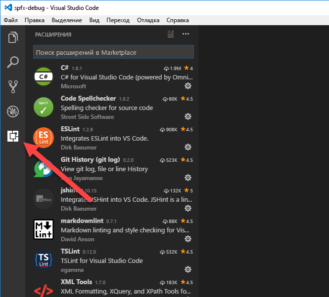

В поле поиска введите **Debugger for Chrome**.

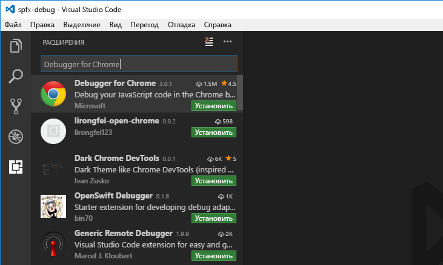

Установите расширение **Debugger for Chrome**, нажав кнопку **Установить** рядом с ним. Установив расширение, обновите окно Visual Studio Code, нажав кнопку **Перезагрузить**.

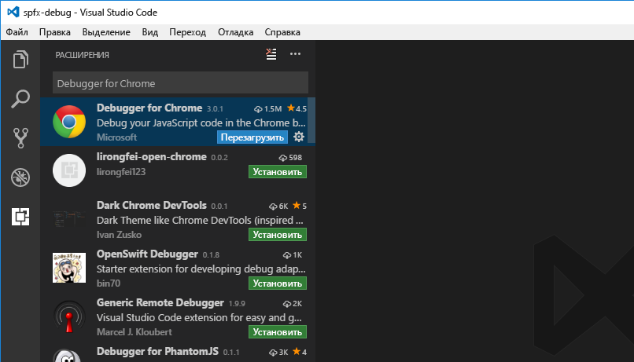

## <a name="debug-sharepoint-framework-solution-using-local-workbench"></a>Отладка решения SharePoint Framework с помощью локальной рабочей области

Вы можете использовать локальную рабочую область, чтобы проверить, корректно ли работает веб-часть. Локальная рабочая область хорошо подходит для тестирования всех сценариев, не требующих связи с SharePoint, а также для автономной разработки.

### <a name="create-debug-configuration-for-local-workbench"></a>Создание конфигурации отладки для локальной рабочей области

Откройте в Visual Studio Code панель **Отладка**.

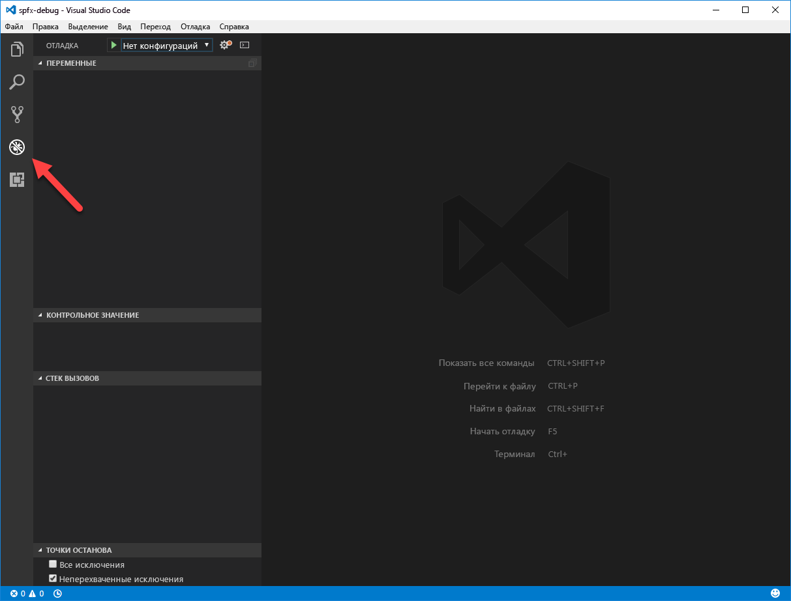

В верхней части панели откройте раскрывающийся список **Конфигурации** и выберите пункт **Добавить конфигурацию...**

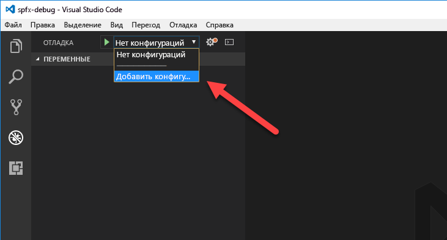

Выберите **Chrome** в списке сред отладки.

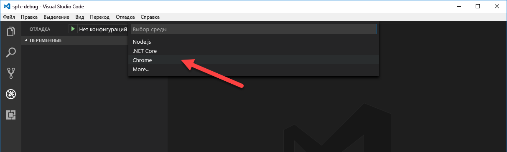

Замените содержимое созданного файла **launch.json** на следующее:

```json
{
    "version": "0.2.0",
    "configurations": [
        {
            "name": "Local workbench",
            "type": "chrome",
            "request": "launch",
            "url": "https://localhost:4321/temp/workbench.html",
            "webRoot": "${workspaceRoot}",
            "sourceMaps": true,
            "sourceMapPathOverrides": {
                "webpack:///../../../src/*": "${webRoot}/src/*",
                "webpack:///../../../../src/*": "${webRoot}/src/*",
                "webpack:///../../../../../src/*": "${webRoot}/src/*"
            },
            "runtimeArgs": [
                "--remote-debugging-port=9222"
            ]
        }
    ]
}
```

В этой конфигурации используется отладчик **chrome**, входящий в состав расширения **Debugger for Chrome**. Он указывает на URL-адрес локальной рабочей области в качестве отправной точки. При отладке кода TypeScript важна конфигурация, с помощью которой отладчик сопоставляет код JavaScript, выполняемый в браузере, с исходным кодом TypeScript.

### <a name="test-debugging-sharepoint-framework-client-side-web-part-in-the-local-workbench"></a>Тестирование отладки клиентской веб-части SharePoint Framework в локальной рабочей области

Настроив Visual Studio Code для отладки решений SharePoint Framework с помощью Google Chrome и локальной рабочей области, вы можете проверить, корректно ли все работает.

#### <a name="configure-a-breakpoint"></a>Настройка точки останова

В Visual Studio Code откройте основной исходный файл веб-части и добавьте точку останова на первой строке метода **render**. Для этого щелкните слева от номера строки или выделите строку кода в редакторе и нажмите клавишу **F9**.

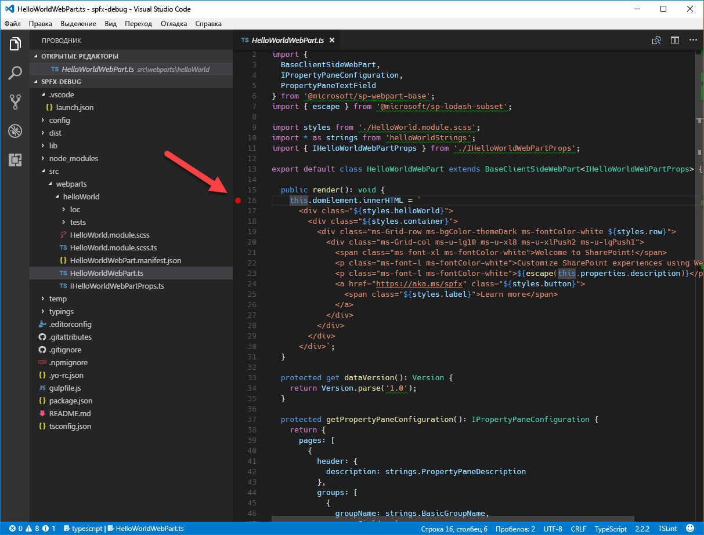

#### <a name="start-serving-the-sharepoint-framework-solution"></a>Начало работы решения SharePoint Framework

В Visual Studio Code откройте меню **Вид** и выберите пункт **Интегрированный терминал** или нажмите клавиши **CTRL+`**. В терминале выполните следующую команду:

```sh
gulp serve --nobrowser
```

При этом будет выполнена сборка решения SharePoint Framework и запустится локальный веб-сервер для предоставления выходных файлов. Так как отладчик запустит собственный экземпляр браузера, мы используем аргумент **--nobrowser**, чтобы задача **serve** не открывала окно браузера.

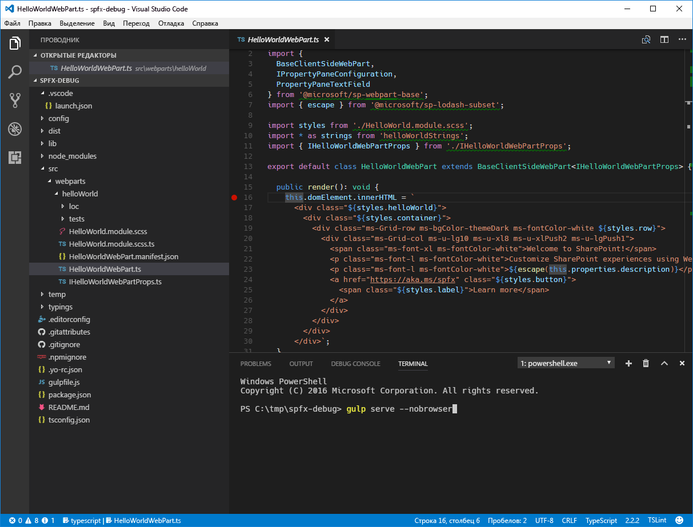

#### <a name="start-debugging-in-visual-studio-code"></a>Начало отладки с помощью Visual Studio Code

Когда задача gulp будет выполнена, переместите фокус в область кода Visual Studio Code и нажмите клавишу **F5** (или выберите в меню **Отладка** пункт **Запустить отладку**). Будет запущен режим отладки Visual Studio Code: цвет строки состояния изменится на оранжевый, и откроется новое окно Google Chrome с локальной версией рабочей области SharePoint.

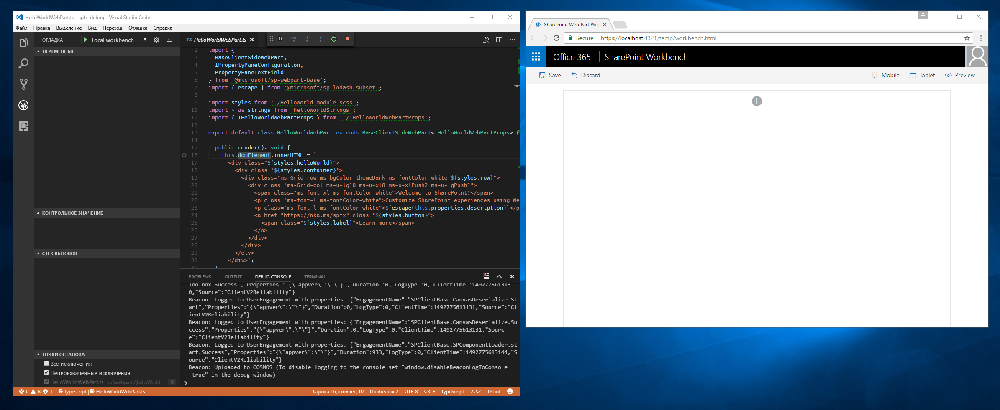

> Обратите внимание, что в этот момент точка останова отключена, так как код веб-части еще не загружен. SharePoint Framework загружает веб-части по запросу только после их добавления на страницу.

#### <a name="add-web-part-to-canvas"></a>Добавление веб-части на холст

Чтобы убедиться, что отладка работает, добавьте веб-часть на холст в рабочей области.

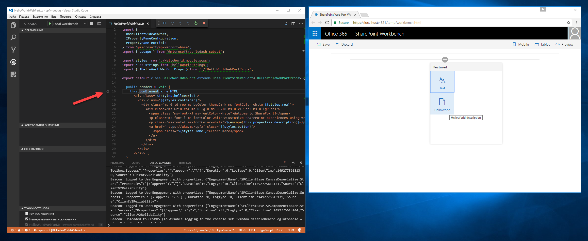

Обратите внимание, что после загрузки кода на страницу индикатор точки останова изменился на активный.

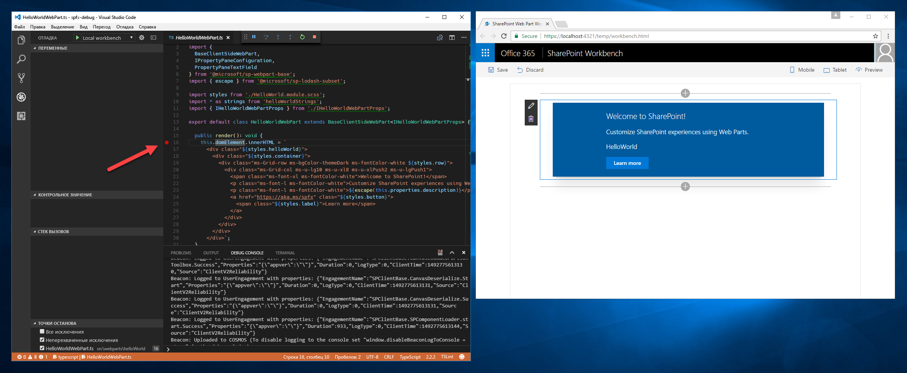

Если теперь обновить страницу, в Visual Studio Code будет достигнута точка останова, и вы сможете проверить все свойства и пошагово выполнить код.

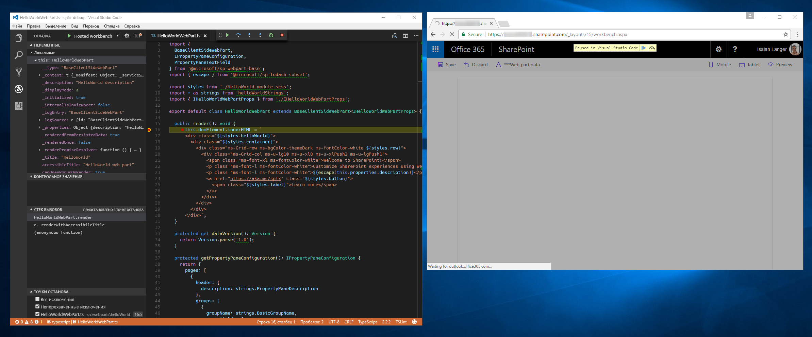

## <a name="debug-sharepoint-framework-solution-using-hosted-workbench"></a>Отладка решения SharePoint Framework с помощью размещенной рабочей области

Чтобы проверить взаимодействие решения с SharePoint, можно использовать размещенную версию рабочей области SharePoint, доступную в каждом клиенте Office 365 по адресу **https://yourtenant.sharepoint.com/_layouts/workbench.aspx**. При создании решений SharePoint Framework вы будете регулярно выполнять такие проверки, поэтому рекомендуем создать отдельную конфигурацию отладки для размещенной версии рабочей области SharePoint.

### <a name="create-debug-configuration-for-hosted-workbench"></a>Создание конфигурации отладки для размещенной рабочей области

В Visual Studio Code откройте файл **./.vscode/launch.json**. Скопируйте имеющуюся конфигурацию отладки и укажите URL-адрес размещенной рабочей области:

```json
{
    "version": "0.2.0",
    "configurations": [
        {
            "name": "Local workbench",
            "type": "chrome",
            "request": "launch",
            "url": "https://localhost:4321/temp/workbench.html",
            "webRoot": "${workspaceRoot}",
            "sourceMaps": true,
            "sourceMapPathOverrides": {
                "webpack:///../../../src/*": "${webRoot}/src/*",
                "webpack:///../../../../src/*": "${webRoot}/src/*",
                "webpack:///../../../../../src/*": "${webRoot}/src/*"
            },
            "runtimeArgs": [
                "--remote-debugging-port=9222"
            ]
        },
        {
            "name": "Hosted workbench",
            "type": "chrome",
            "request": "launch",
            "url": "https://contoso.sharepoint.com/_layouts/workbench.aspx",
            "webRoot": "${workspaceRoot}",
            "sourceMaps": true,
            "sourceMapPathOverrides": {
                "webpack:///../../../src/*": "${webRoot}/src/*",
                "webpack:///../../../../src/*": "${webRoot}/src/*",
                "webpack:///../../../../../src/*": "${webRoot}/src/*"
            },
            "runtimeArgs": [
                "--remote-debugging-port=9222"
            ]
        }
    ]
}
```

### <a name="test-debugging-sharepoint-framework-client-side-web-part-in-the-hosted-workbench"></a>Тестирование отладки клиентской веб-части SharePoint Framework в размещенной рабочей области

Создав конфигурацию отладки для размещенной рабочей области, проверьте, корректно ли она работает. В Visual Studio Code откройте панель **Отладка** и в раскрывающемся списке **Конфигурации** выберите новую конфигурацию **Hosted workbench**.

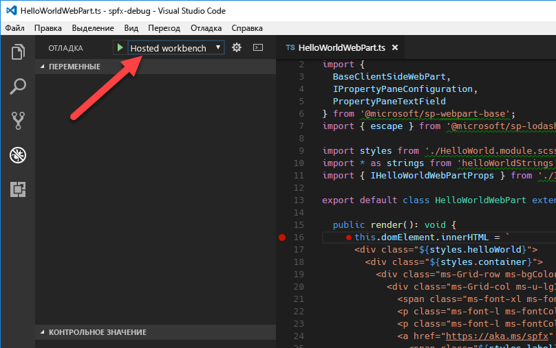

Затем запустите отладку. Для этого нажмите клавишу **F5** или выберите в меню **Отладка** пункт **Запустить отладку**. Visual Studio Code переключится в режим отладки (это будет видно по оранжевой строке состояния), а расширение Debugger for Chrome откроет новое окно Google Chrome со страницей входа в Office 365.


После входа добавьте веб-часть на холст и обновите рабочую область. Как и в случае с локальной рабочей областью, в Visual Studio Code будет достигнута точка останова, и сможете проверить переменные и пошагово выполнить код.


## <a name="additional-information"></a>Дополнительные сведения

- [Отладка веб-части SharePoint Framework (Элио Струйф)](http://www.eliostruyf.com/how-to-debug-your-sharepoint-framework-web-part/)
- [Отладка веб-части SPFx React с помощью Visual Studio Code (Велин Георгиев)](http://blog.velingeorgiev.pro/how-debug-sharepoint-framework-webpart-visual-studio-code)
